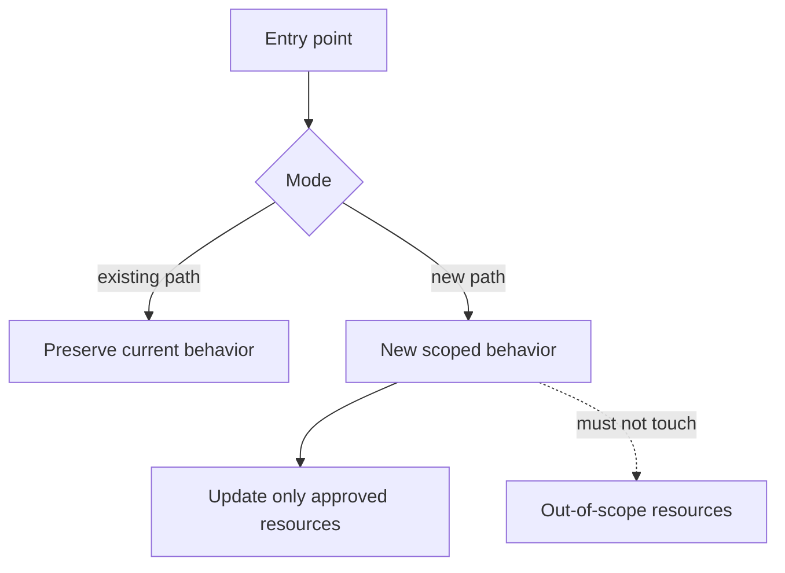

# Design Before Code

Use this skill to enforce an architecture-first development loop. The goal is to make the implementation smaller, easier to review, and aligned with the existing project instead of starting with code edits and explaining them afterward.

## Gate

Do not edit source code until these are clear enough to defend:

1. The problem being solved.
2. The existing architecture and ownership boundary.
3. The minimal file-level scope.
4. Explicit non-goals and files that should not change.
5. The abstraction or seam being introduced, if any.
6. The test and verification plan.

For tiny mechanical fixes, the gate can be brief. For features, behavior changes, or upstream PR work, write the design into the appropriate project note, issue draft, PR plan, or local report before editing.

## Workflow

1. Read the task source: issue, proposal, existing report, failing test, user notes, and referenced docs.
2. Read the current implementation before deciding the design. Prefer `rg`, `rg --files`, targeted `sed`, and existing tests.
3. Build a file-level scope matrix:

   | File / area | Change type | Why it changes | Risk | Test coverage |
   | --- | --- | --- | --- | --- |

4. Build an explicit no-change list:

   | File / area | Why it should not change |
   | --- | --- |

5. Draw the current and proposed flows when more than three components/functions are involved. Mermaid is preferred for Markdown notes.
6. Define the implementation sequence. Put behavior-preserving refactors before behavior changes when that reduces review risk.
7. Define the validation plan before editing. Include unit tests, generated docs, linters, and any integration/manual smoke tests.
8. Only then edit files. Keep the diff inside the approved scope. If implementation reveals a new required file or wider blast radius, stop and update the design before continuing.

## Design Artifacts

For non-trivial work, produce these artifacts in a reusable location rather than only in chat:

- Problem statement and current behavior.
- Proposed behavior.
- Current flow Mermaid diagram.
- Proposed flow Mermaid diagram.
- File scope matrix.
- No-change / non-goals list.
- Function-level design.
- Test matrix.
- PR or review explanation draft when upstream-facing.

Use concise Mermaid diagrams such as:

## Scope Discipline

Prefer these choices:

- Reuse existing helpers, data models, naming conventions, and tests.
- Add a small abstraction only when it isolates real complexity or prevents duplication.
- Keep install, migration, cleanup, and runtime controller behavior separate unless the issue explicitly requires combining them.
- Make side effects testable. Prove not only what changes, but also what does not change.
- Keep local learning notes and skills out of upstream-facing branches.

Avoid these choices:

- Broad refactors that are not required for the feature.
- Touching workload/template/config files just because they are nearby.
- Introducing a new framework, controller, CRD, or layout when the issue asks for a narrow CLI or helper change.
- Generating new trust roots, credentials, migrations, or persistent state unless the design explicitly requires it.
- Writing the PR explanation after the code in a way that hides scope drift.

## Stop Conditions

Stop and update the design before coding further when:

- A required file was not in the original scope matrix.
- A no-change file must change.
- A helper would affect shared behavior outside the task.
- Tests require broad integration setup not mentioned in the plan.
- The implementation starts needing unrelated cleanup to look reasonable.

When this happens, report the new scope pressure and propose either a smaller design or a deliberate scope expansion.
