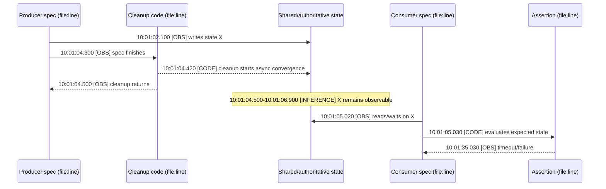

# Cross-Spec Pollution Evidence Contract

Use this reference when a failed E2E may have consumed state left by another spec, when a workflow was rerun, or when one component artifact appears to explain several failures.

## Attempt Ownership First

Run:

```bash
python3 <this-skill-dir>/scripts/audit_run_attempt.py <job-url>
```

Interpret the result conservatively:

- `attempt_compatible`: the selected job belongs to the current run attempt and the artifact was created within that attempt's time window.
- `not_attributable`: the selected job belongs to an older attempt than the run currently exposes. Do not use that run-scoped artifact to prove the older failure.
- `ambiguous`: timestamps or API fields are insufficient. State the evidence gap instead of assigning the artifact to an attempt.

Attempt compatibility, job ownership, and availability are separate. `attempt_compatible` proves only that the timestamps do not conflict with the selected run attempt. Match the artifact name to the matrix job and inspect the upload step before assigning it to that job. An artifact may also be `attempt_compatible` but `expired`; in that case it cannot supply downloadable component-log evidence.

Artifact names are not attempt identifiers. A matching `karmada_e2e_log_*` name does not prove ownership after a rerun.

## Required Causal Tuple

Before calling the root cause cross-spec pollution, fill every row:

| Link | Required identity | Minimum evidence |
| --- | --- | --- |
| Producer | exact Ginkgo spec and source location | producer timeline or source-proven write |
| Cleanup | exact `AfterEach`/`DeferCleanup`/helper and source location | cleanup timeline plus helper behavior |
| Residual state | exact object, field, cache/status, or member-cluster state | timestamped API/component evidence |
| Consumer | exact later Ginkgo spec and source location | consumer timeline and read/wait call |
| Assertion | exact failed helper/assertion and source location | failure line, expected value, timeout |

If any link is missing, report the strongest supported level: observation, candidate mechanism, or inference. Do not turn adjacency into causality.

## Five-Lane Timed Sequence

Use the exact evidence table first, then a sequence diagram with these lanes:



Replace every placeholder. Put a timestamp or bounded interval on each evidence-bearing message. `[OBS]`, `[CODE]`, and `[INFERENCE]` make the evidence boundary visible; they do not replace citations beside the diagram.

## Semantic Audit

Before publishing, answer these in one sentence each:

1. Which exact spec produced the residual state?
2. Which cleanup function returned before which convergence completed?
3. What exact state remained, and where was it authoritative or cached?
4. Which exact consumer spec observed it?
5. Which assertion failed because of that observation?
6. Which timestamps prove the producer-cleanup-consumer ordering?
7. Is every artifact attempt-compatible, job-matched, and available?

If the diagram cannot answer all seven, narrow the claim or collect more evidence.
