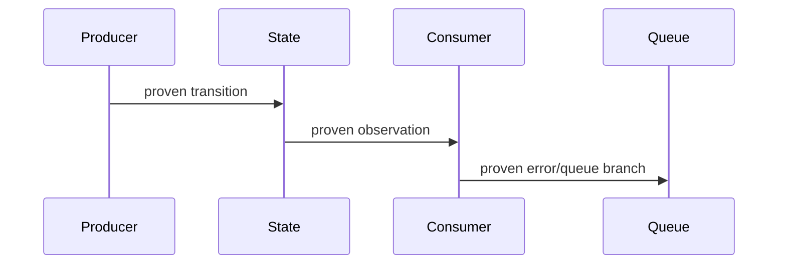

# Karmada Issue Discussion Skill

Use this skill for Karmada upstream issue/discussion work: reading full thread context, extracting consensus, translating to Chinese for internship notes, drafting English comments, and linking related issues/PRs.

## Required Context

- Follow root `AGENTS.md` fork/upstream workflow.
- Upstream comments must be in English.
- Chinese analysis belongs in `internship-reports/`.
- Search for related issues/PRs before proposing a new direction.
- Distinguish explicit maintainer comments from engineering inference.
- For bug claims based on fault injection, mocks, or constructed state, also use `code-review-growth` and apply both its Production Reachability Gate and Contribution Value Gate before deep analysis, drafting, or posting.
- For flake issues, also use `code-review-growth` and apply its Flake Root-Cause Gate. Label statements as symptom, hypothesis, or root cause; do not use root cause before `E3` evidence.
- Distinguish human maintainers/reviewers from automation bots, CI, merge gates, and AI reviewer output.
- Do not post comments, `/assign`, reviewer requests, or maintainer mentions without explicit user approval of the exact text and target.
- Treat reviewer-facing text as an index to evidence, not a copy of the local investigation report. Read `references/concise-issue-writing.md` before drafting a new issue or a non-trivial upstream comment.

## Workflow

1. Identify target issue/PR numbers and related links.
2. For batch scans, fetch minimal list/API metadata first: title, short body snippet, state, labels, assignees, linked PR, changed-file count, and last update. Do not run `thread_brief.py` for every item.
3. Apply the Production Relevance Gate below. If the item is `SKIP`, record one sentence and stop; do not fetch full JSON, read the full diff, or run mock/fault-injection tests merely to manufacture a review opportunity.
4. For items that pass, fetch compact thread context with `thread_brief.py`. Fetch full JSON only when the brief is insufficient, the user explicitly targets the item, or exact evidence is needed for a material exception.
5. Extract:
   - problem statement
   - proposed solutions
   - participant roles and comment weight
   - maintainer guidance
   - open questions
   - blocked, duplicate, or conflicting work
   - related issue/PR graph
6. For every bug claim, apply the Bug Reachability Gate below before choosing a bug title, label, or definitive wording.
7. For a flake investigation, trace producer, member/authoritative state, reflected cache/status, consumer, queue/retry, recovery event, and self-healing behavior. At `E0-E2`, record missing causal edges instead of presenting a complete RCA diagram; at `E3`, build the timestamp/code table and Mermaid sequence diagram.
8. If an issue has an active assignee or linked open PR, recommend review/testing feedback instead of duplicate implementation.
9. Produce Chinese internal summary first when planning or learning.
10. Produce English upstream comment only when asked to draft or post.
11. Run the concise-first publishing gate below before presenting exact text for approval.
12. Include GitHub cross-links with short relevance notes.
13. If repeated issue/PR analysis requires API calls, filtering, or timeline summarization, improve scripts under this skill before repeating manual work.

## Production Relevance Gate

Reachability answers whether a path can happen; it does not answer whether the issue deserves analysis or code. During community scans, use only compact metadata to classify each item before reading the full diff:

1. **Trigger**: Prefer supported, ordinary production workflows. Default to `SKIP` for arbitrary invalid values, manual state corruption, mock-only errors, or extreme scheduling/configuration combinations without real workload evidence.
2. **Outcome**: Identify the final user/system effect after recovery. A panic recovered by the framework and converted to the same rate-limited retry is not a process crash; changing it to an ordinary error is usually diagnostic hygiene. A CLI panic on an intentionally invalid value is narrow UX hardening unless the input is plausibly common.
3. **Prevalence**: Require a real incident pattern, normal-path source evidence, user demand, or maintainer direction. One deliberately constructed reproduction proves reachability, not prevalence.
4. **Fix leverage**: Prefer a fix that restores behavior or enforces the contract at its existing boundary. Downgrade patches that only wrap the symptom while the resource remains stuck, or that add guard/validation layers for unsupported input without a material outcome change.
5. **Complexity budget**: Reject defensive nesting, new state, or broad validation generated only to satisfy mocks. Test volume, green CI, no assignee, and no human review are availability signals, not value signals.

Classify the result:

- **PRIORITIZE**: normal production path or material security, data integrity, process-wide availability, compatibility, repeated incident, or explicit maintainer priority.
- **LIGHTWEIGHT**: real but narrow hygiene with a small root-boundary fix; do not displace strategic work or expand the review into speculative edge cases.
- **SKIP**: mock-only, intentionally invalid/unsupported, extreme unobserved state, self-healing with no final-outcome change, or a defensive patch whose complexity exceeds its value.

`No worthwhile candidate` is a correct scan result. If the user explicitly asks to review a low-value target, explain the classification and keep the review proportional unless a material exception emerges.

This gate controls our analysis budget and task recommendations, not upstream merge eligibility. For a small correct `LIGHTWEIGHT` patch, prefer no comment over telling the contributor the work is unnecessary. Do not demand proof of a company incident. Post a negative or blocking review only when the patch has a concrete cost or defect, such as defensive state/branches disproportionate to impact, a wrong contract, regression risk, or an overstated production claim.

## Bug Reachability Gate

Before opening a bug issue or describing a scenario as a confirmed bug:

1. State the exact trigger and bad outcome separately.
2. Identify the production producer of the trigger. Accept an observed log/reproduction, or source/contract evidence that a real component or API may return that error or state.
3. Prove users or controllers can reach the required preconditions through supported operations; check validation, locks, ownership, ordering, and feature gates.
4. Trace retries, resyncs, restarts, later events, and cleanup. A temporary internal inconsistency that self-heals within the documented contract may not justify a bug issue.
5. Use fault injection only after steps 2-3, and inject a value the real boundary is allowed to produce.
6. Classify the draft:
   - **Observed bug**: report reproduction/log evidence and actual impact.
   - **Reachable latent bug**: state that the path is source- or contract-proven but not observed in production; explain why the failure mode is realistic.
   - **Hypothesis/question**: production reachability remains unproven; ask for confirmation or diagnostics instead of filing a definitive bug claim.

A mock only proves conditional behavior. Do not use an arbitrary fake error, impossible object, or unsupported event order as the sole basis for a bug issue, root-cause claim, severity label, or requested fix.

Reachability is necessary but not sufficient for prioritization. An observed path caused by deliberately invalid input may still be `LIGHTWEIGHT` or `SKIP` when recovery preserves the same final behavior and the patch only changes diagnostics. Mock coverage never raises contribution priority by itself.

## Concise-First Publishing Gate

Before presenting an issue or comment for approval:

1. Select the repository template and artifact type first: enhancement, bug, flake, proposal/umbrella, ordinary comment, or review finding.
2. Lead with the outcome, bounded impact, or exact decision needed. Do not recap the full thread.
3. Keep one decisive evidence item per material claim and explain why each cross-link matters.
4. Keep chronology, failed commands, complete logs, and broad source-reading notes in `internship-reports/` unless they change an upstream decision.
5. Measure reviewer-visible text, excluding hidden HTML template comments:

```bash
python3 .agents/skills/karmada-issue-discussion/scripts/draft_metrics.py <draft.md> --limit 250
```

Use soft review triggers, not hard correctness limits:

- Enhancement/question: 80-250 visible words.
- Reproducible bug or focused flake: usually 120-400 visible words before irreducible logs/manifests.
- Ordinary comment/review: 40-180 visible words; review again above 250.

Long form is justified only for source-backed RCA, necessary reproduction material, proposal/API contracts, or an umbrella tracker. Put the conclusion and requested action first, then link or collapse supporting detail. When asking for posting approval, include the visible word count and name the long-form reason if the draft exceeds the relevant trigger.

## Fetching Thread Context

After an item passes the Production Relevance Gate, use the compact briefing script:

```bash
python3 .agents/skills/karmada-issue-discussion/scripts/thread_brief.py <number>
python3 .agents/skills/karmada-issue-discussion/scripts/thread_brief.py <number> --repo karmada-io/karmada
```

It prints metadata, assignees, `/assign` signals, body snippet, issue comments, and PR files/commits/review comments when applicable. During batch scans, do not call it before the relevance gate; use list/API metadata to reject low-value items first.

Use the full JSON script when exact raw context is needed:

```bash
python3 .agents/skills/karmada-issue-discussion/scripts/fetch_thread.py <number>
python3 .agents/skills/karmada-issue-discussion/scripts/fetch_thread.py <number> --repo karmada-io/karmada
```

The script prints JSON with the issue/PR object, comments, PR files, PR commits, and PR review comments.

If network/API fails, use `curl` against:

```text
https://api.github.com/repos/karmada-io/karmada/issues/<number>
https://api.github.com/repos/karmada-io/karmada/issues/<number>/comments
https://api.github.com/repos/karmada-io/karmada/pulls/<number>
https://api.github.com/repos/karmada-io/karmada/pulls/<number>/files
https://api.github.com/repos/karmada-io/karmada/pulls/<number>/comments
https://api.github.com/repos/karmada-io/karmada/pulls/<number>/commits
```

## Chinese Summary Format

```md
## Issue / PR 概览

- 编号：
- 标题：
- 状态：
- 标签：
- 里程碑：
- PR 认领 @：
- 相关链接：

## 讨论脉络

1. ...

## 参与者与评论权重

- 真人维护者 / reviewer：
- PR 作者 / issue 作者：
- 其他贡献者：
- 自动化 bot / CI：
- AI reviewer：

## 维护者明确意见

- @user: ...

## 当前共识

- ...

## 尚未解决的问题

- ...

## 对我们的影响

- ...

## 建议下一步

1. ...
```

## English Comment Draft Format

Use this compact default for upstream comments:

```md
I verified <scenario> at `<sha>`.

- Observation: <result>
- Evidence: <test, log, or code path>
- Impact: <bounded behavior>

Suggested next step: <one action or question>.
```

For local deployment, e2e, compatibility, or performance evidence, use the longer structure below only when the fields materially affect the upstream decision. Otherwise keep the full table in the local report and publish a compact result plus link.

```md
## Scope

- What is verified:
- What is not verified:

## Environment

- OS:
- Go:
- Docker/container runtime:
- kind/k3d/Kubernetes:
- Karmada branch/commit:
- Kubeconfig contexts:

## Results / observations

| Case | Result | Evidence | Notes |
| --- | --- | --- | --- |

## Suggested next step

- ...
```

For a flake root-cause comment, use this structure only after reaching `E3` in `code-review-growth`:

````md
## First failure and timeline

| Time | Actor and code path | State transition | Evidence |
| --- | --- | --- | --- |
| ... | `file:function/branch` | ... | log/artifact link |



## Why recovery does not self-heal

- Recovery event:
- Event filter / retry branch:
- Terminal stuck state:

## Fix invariant and counterfactual

- Exact causal edge cut by the patch:
- Expected sequence with the invariant:
- Controlled validation or stated E4 limitation:
````

## Cross-Linking Rules

- Use `#123` for same-repo references.
- Explain why each link is relevant; do not dump links.
- State relationship clearly:
  - "related to #123"
  - "appears to be covered by #123"
  - "may be a follow-up to #123"
  - "blocked by the direction in #123"

## Guardrails

- Never claim we will implement something unless the user asks to commit to it.
- Do not post comments without explicit user instruction.
- Do not treat automation bot or AI reviewer comments as maintainer consensus.
- Do not turn a rerun, timing correlation, or local state-window experiment into a root-cause claim or fix recommendation. At `E2`, publish only a labeled hypothesis or diagnostics plan.
- Do not turn fault injection or a constructed state into a production bug claim without a real producer, reachable preconditions, and recovery analysis.
- Always report assignee state as `PR 认领 @` in planning tables or summaries.
- If someone is assigned or an active PR exists, recommend review/test feedback instead of duplicate implementation.
- Keep Chinese analysis local unless the project explicitly asks for it.
- Do not paste file inventories, complete test matrices, chronological work logs, bot summaries, or dynamic CI status into an ordinary issue/comment.
- Do not imitate empty fields or weak evidence found in historical examples; preserve their brevity while satisfying the current repository template and evidence requirements.
