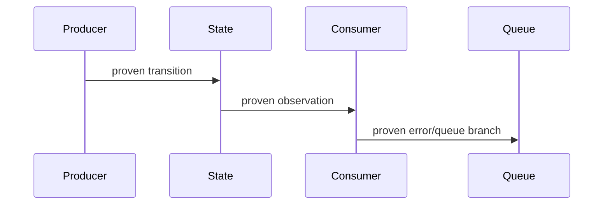

# Karmada Issue Discussion Skill

Use this skill for Karmada upstream issue/discussion work: reading full thread context, extracting consensus, translating to Chinese for internship notes, drafting English comments, and linking related issues/PRs.

## Required Context

- Follow root `AGENTS.md` fork/upstream workflow.
- Upstream comments must be in English.
- Chinese analysis belongs in `internship-reports/`.
- Search for related issues/PRs before proposing a new direction.
- Distinguish explicit maintainer comments from engineering inference.
- For flake issues, also use `code-review-growth` and apply its Flake Root-Cause Gate. Label statements as symptom, hypothesis, or root cause; do not use root cause before `E3` evidence.
- Distinguish human maintainers/reviewers from automation bots, CI, merge gates, and AI reviewer output.
- Do not post comments, `/assign`, reviewer requests, or maintainer mentions without explicit user approval of the exact text and target.
- Treat reviewer-facing text as an index to evidence, not a copy of the local investigation report. Read `references/concise-issue-writing.md` before drafting a new issue or a non-trivial upstream comment.

## Workflow

1. Identify target issue/PR numbers and related links.
2. Fetch compact thread context first:
   - issue/PR title, body, state, labels, milestone, assignees
   - `/assign` and `/unassign` comments
   - issue comments
   - if PR: base/head branch, changed files, commits, reviews, review comments
3. Fetch full JSON only when the compact brief is insufficient for quoting, code review, timeline checks, or exact reviewer wording.
4. Extract:
   - problem statement
   - proposed solutions
   - participant roles and comment weight
   - maintainer guidance
   - open questions
   - blocked, duplicate, or conflicting work
   - related issue/PR graph
5. For a flake investigation, trace producer, member/authoritative state, reflected cache/status, consumer, queue/retry, recovery event, and self-healing behavior. At `E0-E2`, record missing causal edges instead of presenting a complete RCA diagram; at `E3`, build the timestamp/code table and Mermaid sequence diagram.
6. If an issue has an active assignee or linked open PR, recommend review/testing feedback instead of duplicate implementation.
7. Produce Chinese internal summary first when planning or learning.
8. Produce English upstream comment only when asked to draft or post.
9. Run the concise-first publishing gate below before presenting exact text for approval.
10. Include GitHub cross-links with short relevance notes.
11. If repeated issue/PR analysis requires API calls, filtering, or timeline summarization, improve scripts under this skill before repeating manual work.

## Concise-First Publishing Gate

Before presenting an issue or comment for approval:

1. Select the repository template and artifact type first: enhancement, bug, flake, proposal/umbrella, ordinary comment, or review finding.
2. Lead with the outcome, bounded impact, or exact decision needed. Do not recap the full thread.
3. Keep one decisive evidence item per material claim and explain why each cross-link matters.
4. Keep chronology, failed commands, complete logs, and broad source-reading notes in `internship-reports/` unless they change an upstream decision.
5. Measure reviewer-visible text, excluding hidden HTML template comments:

```bash
python3 .agents/skills/karmada-issue-discussion/scripts/draft_metrics.py <draft.md> --limit 250
```

Use soft review triggers, not hard correctness limits:

- Enhancement/question: 80-250 visible words.
- Reproducible bug or focused flake: usually 120-400 visible words before irreducible logs/manifests.
- Ordinary comment/review: 40-180 visible words; review again above 250.

Long form is justified only for source-backed RCA, necessary reproduction material, proposal/API contracts, or an umbrella tracker. Put the conclusion and requested action first, then link or collapse supporting detail. When asking for posting approval, include the visible word count and name the long-form reason if the draft exceeds the relevant trigger.

## Fetching Thread Context

Use the compact briefing script first:

```bash
python3 .agents/skills/karmada-issue-discussion/scripts/thread_brief.py <number>
python3 .agents/skills/karmada-issue-discussion/scripts/thread_brief.py <number> --repo karmada-io/karmada
```

It prints a token-efficient Markdown brief with metadata, assignees, `/assign` signals, body snippet, issue comments, and PR files/commits/review comments when applicable.

Use the full JSON script when exact raw context is needed:

```bash
python3 .agents/skills/karmada-issue-discussion/scripts/fetch_thread.py <number>
python3 .agents/skills/karmada-issue-discussion/scripts/fetch_thread.py <number> --repo karmada-io/karmada
```

The script prints JSON with the issue/PR object, comments, PR files, PR commits, and PR review comments.

If network/API fails, use `curl` against:

```text
https://api.github.com/repos/karmada-io/karmada/issues/<number>
https://api.github.com/repos/karmada-io/karmada/issues/<number>/comments
https://api.github.com/repos/karmada-io/karmada/pulls/<number>
https://api.github.com/repos/karmada-io/karmada/pulls/<number>/files
https://api.github.com/repos/karmada-io/karmada/pulls/<number>/comments
https://api.github.com/repos/karmada-io/karmada/pulls/<number>/commits
```

## Chinese Summary Format

```md
## Issue / PR 概览

- 编号：
- 标题：
- 状态：
- 标签：
- 里程碑：
- PR 认领 @：
- 相关链接：

## 讨论脉络

1. ...

## 参与者与评论权重

- 真人维护者 / reviewer：
- PR 作者 / issue 作者：
- 其他贡献者：
- 自动化 bot / CI：
- AI reviewer：

## 维护者明确意见

- @user: ...

## 当前共识

- ...

## 尚未解决的问题

- ...

## 对我们的影响

- ...

## 建议下一步

1. ...
```

## English Comment Draft Format

Use this compact default for upstream comments:

```md
I verified <scenario> at `<sha>`.

- Observation: <result>
- Evidence: <test, log, or code path>
- Impact: <bounded behavior>

Suggested next step: <one action or question>.
```

For local deployment, e2e, compatibility, or performance evidence, use the longer structure below only when the fields materially affect the upstream decision. Otherwise keep the full table in the local report and publish a compact result plus link.

```md
## Scope

- What is verified:
- What is not verified:

## Environment

- OS:
- Go:
- Docker/container runtime:
- kind/k3d/Kubernetes:
- Karmada branch/commit:
- Kubeconfig contexts:

## Results / observations

| Case | Result | Evidence | Notes |
| --- | --- | --- | --- |

## Suggested next step

- ...
```

For a flake root-cause comment, use this structure only after reaching `E3` in `code-review-growth`:

````md
## First failure and timeline

| Time | Actor and code path | State transition | Evidence |
| --- | --- | --- | --- |
| ... | `file:function/branch` | ... | log/artifact link |



## Why recovery does not self-heal

- Recovery event:
- Event filter / retry branch:
- Terminal stuck state:

## Fix invariant and counterfactual

- Exact causal edge cut by the patch:
- Expected sequence with the invariant:
- Controlled validation or stated E4 limitation:
````

## Cross-Linking Rules

- Use `#123` for same-repo references.
- Explain why each link is relevant; do not dump links.
- State relationship clearly:
  - "related to #123"
  - "appears to be covered by #123"
  - "may be a follow-up to #123"
  - "blocked by the direction in #123"

## Guardrails

- Never claim we will implement something unless the user asks to commit to it.
- Do not post comments without explicit user instruction.
- Do not treat automation bot or AI reviewer comments as maintainer consensus.
- Do not turn a rerun, timing correlation, or local state-window experiment into a root-cause claim or fix recommendation. At `E2`, publish only a labeled hypothesis or diagnostics plan.
- Always report assignee state as `PR 认领 @` in planning tables or summaries.
- If someone is assigned or an active PR exists, recommend review/test feedback instead of duplicate implementation.
- Keep Chinese analysis local unless the project explicitly asks for it.
- Do not paste file inventories, complete test matrices, chronological work logs, bot summaries, or dynamic CI status into an ordinary issue/comment.
- Do not imitate empty fields or weak evidence found in historical examples; preserve their brevity while satisfying the current repository template and evidence requirements.
