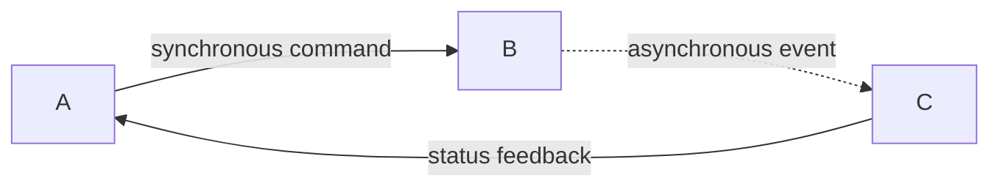

# Data-Flow Authoring

Use a Mermaid `flowchart` when the question is how data, events, commands, or state move through a bounded process.

## Build The Model First

List these before writing Mermaid:

- Producers and entry points.
- Processing stages and decisions.
- Durable state, queues, caches, and external systems.
- The payload or event on each edge.
- Ownership, trust, cluster, or lifecycle boundaries.
- Feedback, retry, error, and terminal paths.

Do not infer an edge from component proximity or naming. Mark source-backed facts, observed behavior, and hypotheses differently when the distinction matters.

## Layout

- Prefer `flowchart LR` for a pipeline or cross-component data movement.
- Prefer `flowchart TB` for staged processing, current/proposed comparison, or a decision tree.
- Use one subgraph per real boundary. Avoid decorative nesting.
- Place the most connected state or queue near the center.
- Keep the main path visually continuous; route feedback and failure paths around it.
- Split overview and detail when the graph exceeds about 18 meaningful nodes or needs more than one dominant reading direction.

## Semantics

Use consistent connectors:



- Nodes name a responsibility or state, not only a package name.
- Edge labels name transferred data, events, commands, or responses.
- Datastores use the database shape: `DB[(State store)]`.
- For a datastore read in a data-flow view, one `store -->|loaded data| consumer` edge is enough. Use a sequence diagram when the read request and returned value must be distinguished.
- Queues use an explicit label such as `QUEUE[Event queue]`; do not rely on color alone.
- Decision diamonds should represent actual branching: `VALID{"Valid?"}`.

## Styling

Use `classDef` rather than external CSS. Start with a restrained multi-role palette:

```mermaid
classDef source fill:#dae8fc,stroke:#6c8ebf,color:#172554;
classDef process fill:#d5e8d4,stroke:#82b366,color:#14532d;
classDef state fill:#fff2cc,stroke:#d6b656,color:#713f12;
classDef external fill:#f5f5f5,stroke:#666666,color:#262626,stroke-dasharray:5 5;
classDef risk fill:#f8cecc,stroke:#b85450,color:#7f1d1d,stroke-dasharray:6 4;
```

Use color to communicate roles. Add a compact legend when three or more colors or line styles are essential to interpretation.

## Review Checklist

- Can a reader find the entry point and terminal outcome without reading surrounding prose?
- Is every arrow direction meaningful?
- Does every important edge say what moves across it?
- Are state reads and writes distinguishable from control calls?
- Are async feedback and retry paths visually different from the happy path?
- Are scope and unresolved relationships visible but outside the main path?
- Does the diagram remain understandable when shown at README width?
