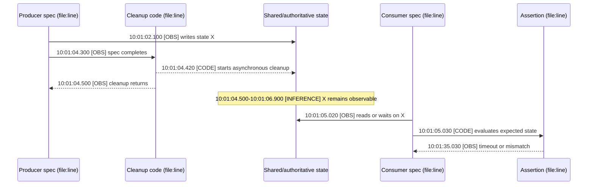

# Sequence-Diagram Authoring

Use `sequenceDiagram` when order, concurrency, retry, timeout, or recovery is more important than static component placement.

## Participants

- Declare participants explicitly in left-to-right reading order.
- Use `actor` only for people or external callers; use `participant` for services, controllers, queues, APIs, and stores.
- Alias long project names: `participant CM as Controller Manager`.
- Use `box` only for a real ownership, process, cluster, or trust boundary.
- Keep the ordinary diagram near 3-8 participants. Split broad architecture from detailed interaction timing.

## Messages

Use consistent arrow semantics:

| Syntax | Meaning |
| --- | --- |
| `A->>B` | Synchronous request or command |
| `B-->>A` | Response or returned observation |
| `A-)B` | Asynchronous event or dispatch |
| `A-xB` | Failed, rejected, or terminated message when the cross is materially useful |

Name messages with verbs and payloads: `Create Work`, `Watch Binding update`, `Return 409 Conflict`. Avoid labels such as `call`, `data`, or `response` without context.

## Control Blocks

- Use `alt` for mutually exclusive outcomes.
- Use `opt` for an optional path.
- Use `loop` for bounded retry or polling; put the bound in the label.
- Use `par` only for genuinely concurrent work.
- Use `critical` when failure handling around an atomic or safety-sensitive region is the point.
- Use `break` for an exception that terminates the remaining sequence.
- Use `Note over` for state ownership, cache freshness, or an invariant that cannot be expressed as a message.

Do not use a control block only to color or decorate the diagram.

Mermaid sequence diagrams do not need the flowchart role palette. Prefer explicit participant aliases, consistent arrow semantics, failure crosses, control blocks, and notes. Apply global theme variables for contrast, but do not depend on participant-specific colors unless the selected Mermaid version supports and renders them reliably.

## Activations And State

- Add activations only when execution ownership or nested calls matter.
- Keep activation pairs balanced. Prefer `A->>+B` and `B-->>-A` for short request/response scopes.
- Show the authoritative state source explicitly. A cache, reflected status, and API object are separate participants when their freshness difference causes the behavior.
- For retry analysis, show the first failure, retry decision, state read on retry, recovery event, and terminal result.
- Label unsupported causal arrows as hypotheses rather than completing a visually convenient story.

## Cross-Spec E2E RCA

When one E2E spec may leave state that affects another, the main diagram must connect test identity, code, state, and time. Use these five lanes:

Replace placeholders with exact Ginkgo spec names, source locations, state identities, and timestamps. `[OBS]` means direct test/log evidence, `[CODE]` means source-proven behavior, and `[INFERENCE]` means a causal interpretation. Do not promote an inference to an observed message merely to make the diagram look complete.

This view must answer which exact spec produced the state, which cleanup code returned too early or left work in flight, what state remained, which exact spec consumed it, which assertion failed, and what timestamps prove the ordering. An object-only sequence cannot answer these questions and is therefore secondary evidence.

## Review Checklist

- Are participants ordered to minimize message crossings?
- Does time flow cleanly from top to bottom?
- Are sync requests, responses, and async events distinguishable?
- Are retries bounded and tied to a real error or event?
- Does the diagram show why recovery does or does not self-heal?
- Are activations balanced and useful?
- Can the sequence be split if it needs more than two nested control blocks or eight participants?
