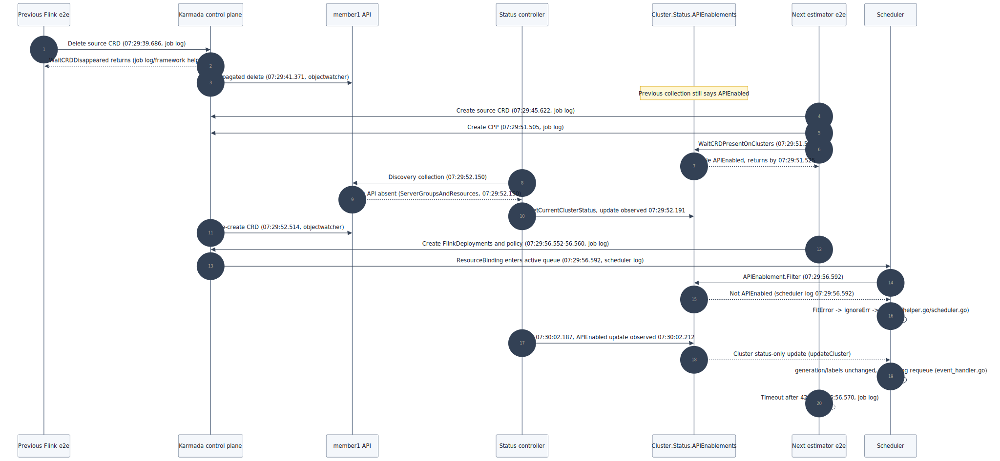
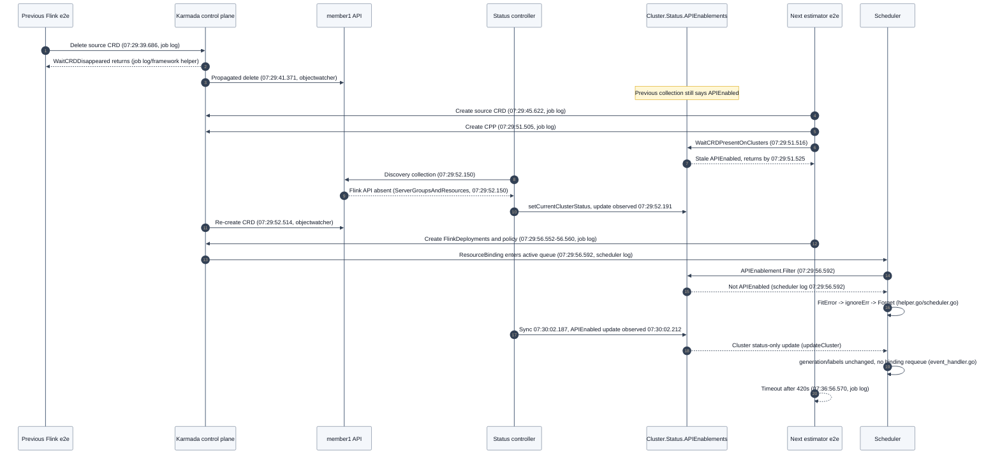

# Day 11：Karmada CI Flake 专项统计

- 报告日期：`2026-07-09`
- 统计窗口：`2026-06-26 00:00 UTC` 至 `2026-07-09`
- 最新状态快照：`2026-07-13 15:25 CST`

> 本报告把“当前该关注什么”放在前面。历史统计口径、PR 文案、详细样本和数据采集过程统一放在附录。

## 一页结论

1. **#7719 / PR #7732 已闭环，但原 RCA 需要纠偏。** `@RainbowMango` 用失败 run 的组件日志和 scheduler 源码补齐了 `FitError -> Forget -> status-only update 不 requeue` 的完整因果链，随后 `/lgtm`、`/approve`；PR 已于 `2026-07-13T07:24:54Z` 合并为 `d0714678`。我们此前把 timing experiment 当成 root cause，且误称 scheduler 直接检查 member API，这不符合成熟项目的 flake 修复标准。
2. **本窗口确认了 3 类高置信 flake。** 分别是 FlinkDeployment cleanup/APIEnablements 竞态、Remedy status cleanup 超时、aggregated API/etcd 短暂失稳。
3. **失败数量不能直接当成 flake 数量。** 598 条 upstream run 中有 32 条 failed run，但其中还包含真实代码问题、lint、release、chart template 和 image scan；只有 4 个 upstream 样本达到本报告的高置信标准。
4. **下一项最值得补证据的是 schedule workflow。** 已有 37 行 schedule/compatibility e2e 或 setup 非成功 job，但缺少 Ginkgo failure summary，尚不能按 spec 或根因归类。
5. **Remedy 暂不急着发新 issue。** 当前只有一次与历史 #5323 高度一致的新复现；再出现一次时，再准备 reopen 或新 issue 的证据包。

| 关注项 | 当前判断 | 下一动作 |
| --- | --- | --- |
| [`#7732`](https://github.com/karmada-io/karmada/pull/7732) | 已 `/lgtm`、`/approve` 并合并；维护者 RCA 证明补丁切断了测试共享状态的因果边 | 归档 merge SHA 和 RCA；把源码级时序门槛复用于后续 flake |
| Remedy / [`#5323`](https://github.com/karmada-io/karmada/issues/5323) | 历史 flake 疑似复现一次 | 保留 job 链接；第二次复现后再发社区更新 |
| Schedule / compatibility | 数量多但根因未知 | 下载最近 artifacts，按 Ginkgo spec、setup 阶段和控制面故障聚类 |
| Aggregated API / etcd transient | 高置信环境或控制面瞬时失稳 | 挂到 [`#6841`](https://github.com/karmada-io/karmada/issues/6841) 台账，不修改无关业务代码 |

## 最新关注

### #7719 修复 PR #7732

状态快照：

| 项目 | 状态 |
| --- | --- |
| PR | [`karmada-io/karmada#7732`](https://github.com/karmada-io/karmada/pull/7732)，merged |
| Head | `1240559dd34cc0eedd0ec6cffe97b5c0076660dc` |
| Merge commit | `d0714678fe181e8dc7d7446555e14799333911db`，`2026-07-13T07:24:54Z` |
| Human review | [`@RainbowMango` APPROVED](https://github.com/karmada-io/karmada/pull/7732#pullrequestreview-4682566443)：`/lgtm`、`/approve`，并引用维护者 RCA |
| Labels | `approved`、`lgtm`、`kind/flake`、`size/S` |
| Issue | [`#7719`](https://github.com/karmada-io/karmada/issues/7719) 已随 PR 合并关闭 |

当前判断：

- 补丁方向成立，但我们原来的论证只到 timing/state window，属于 hypothesis，不足以称为 root cause。
- `WaitCRDPresentOnClusters` 和 scheduler APIEnablement plugin 都读取 `Cluster.Status.APIEnablements`；它们都不直接检查 member API。原分析对此表述错误。
- 维护者补出的关键环节是“为什么状态恢复后不自愈”：普通 `FitError` 被当成完成并 `Forget`，而 `APIEnablements` 恢复只是 status-only update，不触发 binding requeue。
- 后续 flake 必须先完成 timestamp log + function/branch 的源码级时序，再讨论补丁；同 SHA rerun 转绿和本地 timing experiment 只能分别证明 nondeterminism 与 hypothesis。

### Remedy 再次出现

- 样本：[`run 28998390044 / job 86054168903`](https://github.com/karmada-io/karmada/actions/runs/28998390044/job/86054168903)。
- 失败点：删除 Remedy 后，`Cluster.Status.RemedyActions` 中的 `TrafficControl` 长时间不消失。
- 历史关联：closed issue [`#5323`](https://github.com/karmada-io/karmada/issues/5323) 的标题与 spec 路径高度一致。
- 当前动作：继续观察。再次出现时记录 head SHA、Kubernetes 版本、first error 和 rerun 结果，再决定 reopen 还是新建 issue。

### Schedule 与 compatibility 失败

- 统计窗口内有 37 行 schedule/compatibility e2e 或 setup 非成功 job。
- 当前数据只能说明“稳定性信号明显”，不能说明 37 行都是 flake，也不能归因到同一个根因。
- 下一步优先下载最近两次 `CI Schedule Workflow` 和 `APIServer compatibility` artifacts，提取 Ginkgo failure summary、first hard failure 和 control-plane logs。

### 持续更新触发条件

后续只在以下事件发生时更新报告正文：

- Remedy spec 再次复现。
- schedule/compatibility artifacts 已能归到具体 spec 或 setup 根因。
- 新一周统计窗口完成，关键数字发生变化。

普通 queued/running 波动、无日志的单个 cancelled job、与 diff 无关的 bot 评论不单独扩写正文。

## 已确认或高置信 Flake

### 1. FlinkDeployment / estimator ResourceBinding 等待超时

| 时间 | Run / Job | 关联 PR | 失败表现 |
| --- | --- | --- | --- |
| 2026-07-01 | [`run 28499042349 / job 84472927003`](https://github.com/karmada-io/karmada/actions/runs/28499042349/job/84472927003) | [`#7697`](https://github.com/karmada-io/karmada/pull/7697) | ResourceQuota assumption 用例等待 FlinkDeployment `ResourceBinding` 超时 |
| 2026-07-09 | [`run 28998390044 / job 86054168911`](https://github.com/karmada-io/karmada/actions/runs/28998390044/job/86054168911) | [`#7728`](https://github.com/karmada-io/karmada/pull/7728) merge 后 master push | NodeResource assumption 用例反复找不到多个 FlinkDeployment `ResourceBinding` |

关键证据：

- scheduler 曾报告 `member1` missing `flink.apache.org/v1beta1/FlinkDeployment` API。
- 失败 job 显示下一用例的 `WaitCRDPresentOnClusters` 从 `07:29:51.516` 到下一步 `07:29:51.525` 仅约 9ms，但 member1 的新 CRD 到 `07:29:52.514` 才创建；该 wait 命中的是上一轮残留的 `APIEnabled`。
- 维护者组件日志和源码追踪证明：status controller 随后采到 CRD 缺失，唯一一次 scheduling 因缺 API 返回 `FitError`，该 binding 被 `Forget`；状态恢复的 cluster status-only update 又不触发 requeue，最终卡满 420 秒。
- #7697 没有修改 estimator/Flink 路径，同一代码通过空提交重触发后全绿。
- #7728 只改 runner label，PR CI 全绿，合并后的独立 master push 再次命中同类 Flink timeout。

结论：高置信 e2e shared-state flake。完整 RCA 见 [`@RainbowMango` 的 issue comment](https://github.com/karmada-io/karmada/issues/7719#issuecomment-4955452375)；修复 PR [`#7732`](https://github.com/karmada-io/karmada/pull/7732) 已合并。

### 2. Remedy status cleanup 超时

| 时间 | Run / Job | 失败表现 |
| --- | --- | --- |
| 2026-07-09 | [`run 28998390044 / job 86054168903`](https://github.com/karmada-io/karmada/actions/runs/28998390044/job/86054168903) | `remedy testing ... Create an immediately type remedy, then remove it` 等待 `TrafficControl` 从 cluster status 消失超时 |

日志特征：

- `Cluster(member1) remedyActions: map[TrafficControl:{}]` 重复出现。
- `Timed out after 420.000s`。
- 失败点为 `test/e2e/framework/cluster.go:318`。

结论：与历史 [`#5323`](https://github.com/karmada-io/karmada/issues/5323) 高度一致，但本窗口只有一次新样本，先观察第二次复现。

### 3. Aggregated API / control plane transient

| 时间 | Run / Job | 关联变更 | 失败表现 |
| --- | --- | --- | --- |
| 2026-07-08 | [`run 28912823833 / job 85774432012`](https://github.com/karmada-io/karmada/actions/runs/28912823833/job/85774432012) | #7728 PR CI | `clusters.cluster.karmada.io` 返回 503，`karmadactl exec` 超时，AfterSuite 连锁失败 |
| 2026-07-09 | [`fork run 29006012630 / job 86080188511`](https://github.com/ranxi2001/karmada/actions/runs/29006012630/job/86080188511) | #7732 fork validation | `etcdserver: request timed out` 后出现 API connection refused、leader election lost 和 cleanup 连锁超时 |

关键证据：

- 最早硬失败来自 etcd/control-plane，而不是后续报错的业务 spec。
- 同一 run 中出现 aggregated apiserver 停止 serving、多控制面容器退出和 API connection refused。
- #7728 rerun 后通过；#7732 fork v1.34 failed job 在 attempt 2 通过。

结论：高置信 CI 资源或 control-plane transient flake。fork 样本不计入 upstream 598 条 run 的统计总数，只用于补强分类证据。

## 持续关注台账

| 编号 | 状态 | 本报告中的作用 | 下一检查点 |
| --- | --- | --- | --- |
| [`#7732`](https://github.com/karmada-io/karmada/pull/7732) | merged, `kind/flake`, `lgtm`, `approved` | Flink cleanup/APIEnablements 修复 | 已归档 merge SHA 与维护者 RCA |
| [`#7719`](https://github.com/karmada-io/karmada/issues/7719) | closed, `kind/flake` | Flink cleanup/APIEnablements RCA 与证据入口 | 作为后续 flake 源码时序分析范例 |
| [`#5323`](https://github.com/karmada-io/karmada/issues/5323) | closed | Remedy 同名历史 flake | 第二次新复现后决定 reopen/new issue |
| [`#6841`](https://github.com/karmada-io/karmada/issues/6841) | open, `kind/flake` | e2e 间歇失败 umbrella | schedule/control-plane 新样本归档 |
| [`#7388`](https://github.com/karmada-io/karmada/issues/7388) | open, `kind/flake` | v1.35 环境/兼容性历史参照 | 仅在失败持续集中于 v1.35 时关联 |
| [`#7692`](https://github.com/karmada-io/karmada/pull/7692) | open | 同类异步同步屏障参考 | 不与 #7732 重复实现 |
| [`#7697`](https://github.com/karmada-io/karmada/pull/7697) | open | 第一次 Flink failure 和空提交转绿证据 | 不把 flake 修复混入证书 PR |
| [`#7728`](https://github.com/karmada-io/karmada/pull/7728) | merged | runner 更新与第二次 Flink/Remedy 样本 | 只作为历史证据，不归因给 runner label |

## 附录 A：统计口径与关键数字

### 统计口径

| 项目 | 口径 |
| --- | --- |
| 仓库 | [`karmada-io/karmada`](https://github.com/karmada-io/karmada) |
| 时间窗口 | `2026-06-26 00:00 UTC` 至 `2026-07-09` |
| 数据源 | GitHub Actions run/job metadata，必要时补 job log 和 artifact |
| 高置信 flake | rerun/空提交后转绿；或 failure 与 diff 无关并落在已验证的异步等待、control-plane transient 边界 |
| 不直接计入 | lint、release、chart template、image scan，或只有失败状态而没有日志的样本 |

> “Failed run 比例”不是“flake 率”。本报告只把证据足够的样本列为高置信 flake。

### 关键数字

| 指标 | 数量 | 说明 |
| --- | ---: | --- |
| Upstream Actions runs | 598 | 统计窗口覆盖总量 |
| Failed runs | 32 | run 级失败，不等于 flake |
| 非成功 job rows | 72 | 从失败 run 展开后的 job 行数 |
| e2e/setup/Kubernetes test rows | 56 | 主要分析对象 |
| Schedule/compatibility rows | 37 | 数量高，但根因尚未归类 |
| 高置信 flake 类型 | 3 | FlinkDeployment、Remedy、control-plane transient |
| 高置信 upstream 样本 | 4 | 都能关联 issue/PR 和具体日志 |
| Fork CI 补充样本 | 1 | 不计入 upstream 总数 |
| Rerun/trigger 后转绿样本 | 5 | 2 个 upstream rerun、2 个空提交、1 个 fork rerun |

失败集中度：`CI Workflow` 有 16 条 failed run；e2e/setup/Kubernetes test 共 56 行非成功 job，是本窗口的主要噪声来源。

## 附录 B：Rerun / Trigger 证据

| 类型 | 数量 | 样本 | 用法 |
| --- | ---: | --- | --- |
| GitHub 原生 rerun 后转绿 | 2 | [`28212061472`](https://github.com/karmada-io/karmada/actions/runs/28212061472)、[`28256528352`](https://github.com/karmada-io/karmada/actions/runs/28256528352) | 证明 e2e/Kubernetes test 可能 transient |
| 空提交 trigger 后转绿 | 2 | #7697 的 [`93eaf7e`](https://github.com/ranxi2001/karmada/commit/93eaf7e57515c959fe30fa2aba387ce10029046d)、#7728 的 [`de3b6be`](https://github.com/ranxi2001/karmada/commit/de3b6be675bbf8ad12f91052f7d0fb53c5b592a5) | 两个 commit 均为 `files=0/additions=0/deletions=0` |
| Fork job rerun 后转绿 | 1 | [`run 29006012630`](https://github.com/ranxi2001/karmada/actions/runs/29006012630) attempt 2 | 只作 control-plane transient 补充样本 |
| Rerun 但不算 flake | 8 | workflow approval、release failure、cancelled 等 | 不用于证明业务 e2e flake |

## 附录 C：PR #7732 文案与技术复查

### PR 文案摘要

- Title：`test(e2e): wait for FlinkDeployment CRD cleanup`
- Kind：`/kind flake`
- Issue：`Fixes #7719`
- 用户影响：`NONE`
- 核心说明：旧 cleanup 只等待 control plane CRD 消失；PR 补齐 member CRD 和 `Cluster.Status.APIEnablements` 收敛等待。
- 非目标：不修改 scheduler、estimator、resource interpreter、CRD propagation controller 或生产行为。
- AI disclosure：用于日志分析、diff 对比和 PR 文案整理，最终代码由提交者审阅验证。

GitHub 上的 [PR #7732 正文](https://github.com/karmada-io/karmada/pull/7732) 是最终文案来源，本报告不再维护第二份完整 body。

### 文件范围

| 文件 | 作用 |
| --- | --- |
| `test/e2e/framework/customresourcedefine.go` | 新增等待 CRD 从 member cluster `APIEnablements` 消失的 helper |
| `test/e2e/suites/base/estimator_test.go` | 覆盖 ResourceQuota 与 NodeResource 两个 cleanup |
| `test/e2e/suites/base/federatedresourcequota_test.go` | 补齐 multi-components cleanup |
| `test/e2e/suites/base/schedule_multi_template_test.go` | 补齐 ScheduleMultiTemplate cleanup |

### 同步屏障

```text
control plane CRD disappeared
  -> member cluster CRD disappeared
  -> Cluster.Status.APIEnablements no longer reports FlinkDeployment as APIEnabled
  -> next test performs a fresh propagation/readiness wait
```

### 维护者 RCA 与原分析纠偏

先明确结论：PR 的测试隔离修复是 causal fix，但我们此前给出的理由没有达到 causal RCA。我们证明了旧 cleanup 会提前返回和状态存在时间窗，却没有追到 consumer 的错误分类、queue terminal path 以及 recovery event 为什么不能自愈；还把 scheduler 的观察对象说错了。最终批准依赖的是维护者补出的 [`#7719 root cause analysis`](https://github.com/karmada-io/karmada/issues/7719#issuecomment-4955452375)，不是“重跑绿了”或我们的 timing 推测。

#### Observed facts

| 时间 | Actor / event | 可直接得出的事实 | 证据 |
| --- | --- | --- | --- |
| `07:29:39.686` | previous e2e 删除 control-plane CRD | 旧 cleanup 只等待 control-plane `NotFound` | [failed job](https://github.com/karmada-io/karmada/actions/runs/28499042349/job/84472927003) Ginkgo step |
| `07:29:41.371` | objectwatcher 删除 member1 CRD | member-side 删除晚于 source cleanup | controller-manager component log |
| `07:29:45.622` | next e2e 创建 source CRD | 下一用例已开始复用同名 CRD | failed job Ginkgo step |
| `07:29:51.505` | next e2e 创建 CPP | 新一轮 propagation 已发起 | failed job Ginkgo step |
| `07:29:51.516-51.525` | presence wait 返回并进入下一步 | 约 9ms 返回；不可能观察到 `52.514` 才创建的新 member CRD | failed job Ginkgo/log timestamps |
| `07:29:52.150` | status controller 采集 member1 API | 采集发生在 member CRD 缺失窗口 | controller-manager component log |
| `07:29:52.514` | objectwatcher 重建 member1 CRD | 比 status collection 晚约 `0.364s` | controller-manager component log |
| `07:29:56.552-56.560` | next e2e 创建 FlinkDeployments 和 policy | workload scheduling 输入在 non-enabled status 写入后出现 | failed job Ginkgo steps |
| `07:29:56.592-56.593` | scheduler 唯一一次调度 | APIEnablement filter 报 missing API，结果为 clusters `[]` | scheduler component log |
| `07:30:02.212` | scheduler 收到 member1 Cluster update | `APIEnablements` 已恢复，但日志中没有 affected binding enqueue 或第二次 scheduling | scheduler component log |
| `07:36:56.570` | test timeout | binding 一直冻结在 `NoClusterFit` 直到 420 秒超时 | failed job and scheduler log |

#### Code-proven causal chain

| 链路 | 源码证明 |
| --- | --- |
| presence helper 观察什么 | [`WaitCRDPresentOnClusters`](https://github.com/karmada-io/karmada/blob/3d4d14d746de507164abf40c1017b1f2b0e47e3a/test/e2e/framework/customresourcedefine.go#L66-L78) 读取 `Cluster.Status.APIEnablements`，不访问 member CRD |
| 状态如何产生 | [`setCurrentClusterStatus`](https://github.com/karmada-io/karmada/blob/3d4d14d746de507164abf40c1017b1f2b0e47e3a/pkg/controllers/status/cluster_status_controller.go#L247-L261) 通过 member discovery 收集 API 并写入 Cluster status |
| scheduler 观察什么 | [`APIEnablement.Filter`](https://github.com/karmada-io/karmada/blob/3d4d14d746de507164abf40c1017b1f2b0e47e3a/pkg/scheduler/framework/plugins/apienablement/api_enablement.go#L50-L77) 同样只读 `Cluster.Status.APIEnablements` |
| 一次失败为什么成为 terminal | [`getConditionByError`](https://github.com/karmada-io/karmada/blob/3d4d14d746de507164abf40c1017b1f2b0e47e3a/pkg/scheduler/helper.go#L112-L129) 对普通 `FitError` 返回 `ignoreErr=true`；[`scheduleResourceBinding`](https://github.com/karmada-io/karmada/blob/3d4d14d746de507164abf40c1017b1f2b0e47e3a/pkg/scheduler/scheduler.go#L571-L582) 把 `err` 置为 `nil`；[`handleErr`](https://github.com/karmada-io/karmada/blob/3d4d14d746de507164abf40c1017b1f2b0e47e3a/pkg/scheduler/scheduler.go#L933-L945) 随后执行 `Forget` |
| 状态恢复为什么不自愈 | [`updateCluster`](https://github.com/karmada-io/karmada/blob/3d4d14d746de507164abf40c1017b1f2b0e47e3a/pkg/scheduler/event_handler.go#L326-L353) 只在 deletion timestamp、labels 或 generation 变化时进入 affected-binding requeue；status-only update 不改变 generation |

因此旧时序是：

`旧 status=APIEnabled -> 下一用例 presence wait 假阳性 -> status controller 采到短暂缺失并写 non-enabled -> 唯一一次调度 FitError -> binding Forget -> status 恢复但不 requeue -> 420s timeout`

此前“scheduler checks the actual member cluster API”的说法是错误的。scheduler 与 presence helper 读的是同一份反映状态；真正的问题不是两者分别读取了不同数据源，而是下一用例先命中旧 `APIEnabled`，随后 status 在唯一一次 scheduling 前翻转为 non-enabled，并且恢复事件不会重新排队。

#### Source-backed sequence





#### 为什么 #7732 切中了因果边

- `WaitCRDDisappearedOnClusters` 先证明 member CRD 实体已经删除。
- `WaitCRDDisappearedFromClusterStatus` 再证明上一轮 `APIEnabled` 已被 status controller 清除。
- 下一轮 `WaitCRDPresentOnClusters` 因而必须观察一次新的 `non-enabled -> APIEnabled` 转换，不能再把上一轮残留状态当成新传播完成。
- 修复只建立 e2e 跨用例边界 invariant，不改变 scheduler 的 `FitError`、queue 或 production controller 行为，范围与已证明的根因一致。

这两个 cleanup wait 互补：仅等 member `NotFound` 可能仍留下 stale `APIEnabled`；仅等 status `!= APIEnabled` 又不能单独证明 member 实体确已删除。补丁切断的是“旧 status 让下一轮 readiness wait 假阳性”这条因果边，而不是用更长 timeout 掩盖问题。

### 代码复查结论

- 4 个 FlinkDeployment CRD 创建路径均已覆盖。
- Ginkgo `DeferCleanup` LIFO 顺序正确：先清 workload/policy，再删 ClusterPropagationPolicy，最后删除源 CRD并等待 member 状态。
- helper 接受 `APIUnknown` 是合理的：member CRD 已直接确认为 NotFound，下一轮 setup 仍必须等到 `APIEnabled`。
- Gemini 的 nil pointer finding 不成立：注入的 `gomega.Gomega` 断言失败会中止当前 poll 并让 `Eventually` 重试。
- 没有发现补丁本身需要修改的 correctness finding；但此前 review 缺少 scheduler terminal path 和 recovery-event 分析，不能把“补丁看起来合理”写成“root cause 已证明”。

### 验证

- `git diff --check upstream/master...upstream/pr-7732`：通过。
- `go test ./test/e2e/framework ./test/e2e/suites/base -run '^$' -count=0`：通过。
- Topic worktree 干净，commit 包含 `Signed-off-by`，base 是 PR head 的祖先。
- Fork push CI 的 CI Workflow、Chart、CLI、Operator 最终通过。
- Upstream 核心 lint、codegen、compile、unit、e2e v1.34-v1.35-v1.36 通过。
- `@RainbowMango` 基于上述 RCA 提交 `/lgtm`、`/approve`，PR 最终合并为 `d0714678fe181e8dc7d7446555e14799333911db`。

剩余风险：仓库仍没有一个可确定性重放完整 420 秒失败链的自动化回归测试。当前证据达到 E3：原始组件日志和源码分支贯通了 producer、reflected status、consumer、queue 与 recovery event。E4 尚未通过受控复现或回归测试达成；修复后矩阵通过只能说明没有观察到回归，不能单独证明 causal validation。维护者是在完整 E3 RCA、补丁范围与 counterfactual 一致的基础上批准合并。

## 附录 D：待补日志样本

### Setup failures

| 时间 | Workflow / Job | Run / Job | 当前证据 |
| --- | --- | --- | --- |
| 2026-07-06 | CI / e2e v1.34 | [`28818641938 / 85466088131`](https://github.com/karmada-io/karmada/actions/runs/28818641938/job/85466088131) | setup e2e step 失败，需补 artifact |
| 2026-07-07 | Operator / v1.35 | [`28863480122 / 85607622872`](https://github.com/karmada-io/karmada/actions/runs/28863480122/job/85607622872) | setup operator step 失败，需补 artifact |
| 2026-07-06 | Operator / v1.34 | [`28761483062 / 85277656027`](https://github.com/karmada-io/karmada/actions/runs/28761483062/job/85277656027) | master push setup failure，需补 artifact |
| 2026-06-28 | CLI / v1.36 | [`28322104916 / 83905699582`](https://github.com/karmada-io/karmada/actions/runs/28322104916/job/83905699582) | setup init e2e failure，需补 artifact |

相关历史：[`#3667`](https://github.com/karmada-io/karmada/issues/3667)、[`#3682`](https://github.com/karmada-io/karmada/pull/3682)、[`#3699`](https://github.com/karmada-io/karmada/pull/3699)。当前证据不足，不能直接写成确定 flake。

### Schedule/compatibility 代表样本

| Workflow | Run | 失败概况 |
| --- | --- | --- |
| CI Schedule Workflow | [`28297782357`](https://github.com/karmada-io/karmada/actions/runs/28297782357) | v1.27-v1.31 多个 e2e failed |
| CI Schedule Workflow | [`28750372834`](https://github.com/karmada-io/karmada/actions/runs/28750372834) | v1.27-v1.30 多个 e2e failed |
| APIServer compatibility | [`28300711541`](https://github.com/karmada-io/karmada/actions/runs/28300711541) | master/release branches 多组合失败 |
| APIServer compatibility | [`28753707990`](https://github.com/karmada-io/karmada/actions/runs/28753707990) | v1.28/v1.30/v1.32 compatibility failures |

分类时必须先找 first hard failure，不能把 AfterSuite、cleanup 或 API connection refused 的后续错误当成根因。

## 附录 E：暂不归为 Flake

| 类型 | 样本 | 原因 |
| --- | --- | --- |
| lint | runs `28706816762`、`28410342955` | 更可能是代码静态检查或格式问题 |
| Chart template | run `28369536076` | 需结合 PR diff，不能仅凭 job failure 判 flake |
| Release publish/upload | `v1.19.0-alpha.1` 相关 runs | 属发布资产链路，不是 e2e |
| Image scanning | run `28307314200` | 属镜像构建/扫描路径 |

## 附录 F：数据获取流程

### 中间文件

- `/tmp/karmada-actions-all-1000-20260626-20260709.json`
- `/tmp/karmada-actions-failures-20260626-20260709.json`
- `/tmp/karmada-failed-jobs-clean-20260626-20260709.tsv`
- `/tmp/karmada-flake-keylines-20260626-20260709.txt`

### 核心命令

```bash
gh run list --repo karmada-io/karmada \
  --created '>=2026-06-26' \
  --limit 1000 \
  --json databaseId,name,displayTitle,event,headBranch,headSha,status,conclusion,createdAt,updatedAt,url

gh run list --repo karmada-io/karmada \
  --created '>=2026-06-26' \
  --status failure \
  --limit 200 \
  --json databaseId,name,displayTitle,event,headBranch,headSha,status,conclusion,createdAt,updatedAt,url

gh run view <run-id> --repo karmada-io/karmada --json jobs
gh run view <run-id> --repo karmada-io/karmada --job <job-id> --log
```

PR #7732 的持续状态检查：

```bash
gh pr checks 7732 --repo karmada-io/karmada
gh api repos/karmada-io/karmada/pulls/7732/reviews --paginate
gh api repos/karmada-io/karmada/pulls/7732/comments --paginate
```

### 限制

- 部分较早 job 的日志通过 `gh run view --job --log` 返回空内容，只能先基于 workflow/job/step metadata 归类。
- Schedule workflow 不绑定具体 PR diff，只能作为 master 分支持续稳定性的信号。
- Fork CI 不进入 upstream 598 条 run 总量，只能作为补充证据。
- Release、publish、lint、chart template 和 image scanning failure 保留在失败统计里，但不直接进入高置信 flake。
