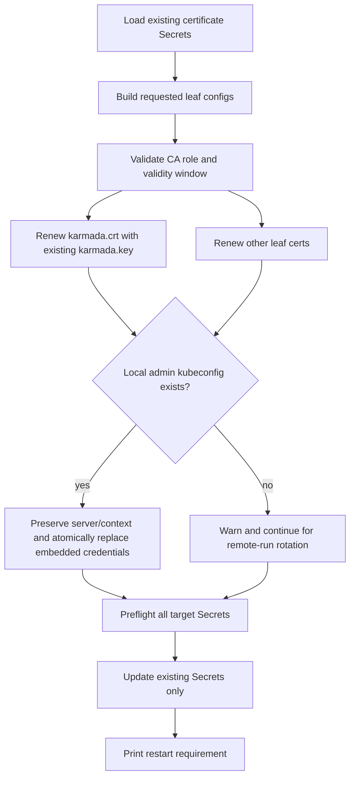

# Day 13：PR #7697 深度 Review 与持续合并维护

日期：2026-07-13

## 今日目标

1. 对 [karmada-io/karmada#7697](https://github.com/karmada-io/karmada/pull/7697) 做一次不依赖 CI 全绿结论的完整代码 review。
2. 找出证书轮换在安全、兼容、失败恢复和用户操作契约上的真实边界。
3. 将本文作为 #7697 直到 merge 的唯一持续维护入口。

## 当前快照

| 项目 | 状态 |
| --- | --- |
| Upstream PR | [#7697 `feat: support rotating init-managed certificates`](https://github.com/karmada-io/karmada/pull/7697) |
| 关联 issue | [#7693](https://github.com/karmada-io/karmada/issues/7693) |
| Head | `4b6fa135fe870a7fa97fcc00399092bac7e6eb92` |
| 变更规模 | 10 files，`+1696/-22`，标签 `size/XXL` |
| 当前 assignee | `@zhzhuang-zju` |
| Requested reviewers | `@prodanlabs`、`@Tingtal` |
| Human review | 尚无实质性代码 review，尚无 `lgtm/approve` |
| CI | exact head 的 17 个 check-runs 全部 success；Tide 等待 `lgtm/approve` |
| 分支同步 | clean head `4b6fa135f` 已推送到 `ranxi2001:feature/cert-mode-rotate`，4 个 commits 均有 sign-off |
| 本地候选 | 已成为远端 PR head；本次 hardening commit 为 `+547/-9` |
| 真实过期验证 | final head 已在隔离双节点 kind v1.36.1 环境完成 10 分钟 leaf 真实过期、rotate、rollout restart 和恢复验证；全部最终断言通过 |
| 维护状态 | `WAITING_HUMAN_REVIEW`：实现、CI 和精简 body 均已完成；当前 body 为 30 行、241 词，等待 human `lgtm/approve` |

## 变更模型

当前 PR 为 `karmadactl init` 增加 `--cert-mode=rotate`。默认仍为 `install`；`rotate` 路径复用现有 CA，重新签发 init-managed component leaf certificates，并更新约 11 个现有 certificate/config Secrets。

```text
Validate
  -> Complete
       -> completeCommon
       -> completeRotate
  -> RunInit
       -> runCertRotate
            -> buildInitCertConfigs
            -> prepareRotatedCertAndKeyData
            -> certSecretSpecs
            -> updateCertsSecrets
```

当前明确不做 CA/root rotation、caBundle migration、workload recreation、automatic restart、Helm/operator/cert-manager 集成。

> 分析：“更新 Secret 中的证书数据”和“所有运行中组件安全切换到新凭据”是两个不同阶段。本 PR 主要覆盖前者，但必须确保手工 restart 不会触发新的信任断层。

## 实现前设计收敛

### 候选流程



### 文件范围

| 文件 / 区域 | 变更类型 | 为什么需要 | 主要风险 | 验证 |
| --- | --- | --- | --- | --- |
| `pkg/karmadactl/cmdinit/kubernetes/cert_rotation.go` | 行为修复 | 复用 `karmada.key`、CA 预检、刷新已存在本地 kubeconfig | 证书/私钥匹配、部分写入 | focused unit tests |
| `pkg/karmadactl/cmdinit/kubernetes/deploy_test.go` | 回归测试 | 证明 key 保留、kubeconfig server/context 保留、CA 失败零 Secret update | 测试证书生成成本 | focused + package tests |
| `pkg/karmadactl/cmdinit/cmdinit.go` | 用户文档 | 恢复 issue #7693 中“其他参数与原安装一致”的契约 | 帮助文本与真实能力不一致 | command flags verifier |
| `docs/command-line-flags/karmadactl_init.md` | 生成文档 | 同步 CLI example/help | 手工修改被 generator 覆盖 | `hack/verify-command-line-flags.sh` |

如实现发现原子写入必须共享，才扩展到 `pkg/karmadactl/cmdinit/utils/`；默认优先把 mode-specific 逻辑留在 `cert_rotation.go`，避免改变 install 的旧文件写入语义。

### 明确不改

| 区域 | 不改理由 |
| --- | --- |
| `deployments.go` / workload templates | 本轮不实现 auto restart、checksum annotation 或 hot reload |
| Secret names/layout | 第一版继续使用 init-managed 现有 Secrets |
| WebhookConfiguration/APIService/CRD caBundle | CA 不轮换，caBundle 无需迁移 |
| Helm/operator/cert-manager | issue #7693 第一步只聚焦 `karmadactl init` |
| SAN 自动继承策略 | 涉及用户契约和身份扩张，先修文档/补测试，等会议确认后再决定是否编码 |

### 测试矩阵

| 场景 | 预期 |
| --- | --- |
| rotate `karmada.crt` | cert 更新，`karmada.key` 与公钥保持 |
| 本地 admin kubeconfig 存在且 server 为 custom URL | server/context 不变，嵌入 CA/client cert/key 更新 |
| 本地 admin kubeconfig 不存在 | rotate 可从其他机器执行，记录 warning 但不失败 |
| 本地 kubeconfig 无法解析/写入 | 在 Secret update 前失败 |
| CA 已过期/尚未生效/非 CA | 在任何 Secret update 前失败 |
| requested leaf `NotAfter` 超过 CA | 在任何 Secret update 前失败 |
| 默认 install | 现有测试和行为不变 |

## 合并前 Findings

### P1 / Blocking（本地候选已修复）：`karmada.key` 同时是 ServiceAccount JWT signing key

`pkg/karmadactl/cmdinit/kubernetes/cert_rotation.go:82` 调用 `signLeafCert()` 重签 `karmada.crt`；`pkg/karmadactl/cmdinit/cert/cert.go:224-239` 的 `NewCertAndKey()` 每次都生成新私钥。

但 `karmada.key` 还有非 TLS 用途：

- `pkg/karmadactl/cmdinit/kubernetes/command.go:82-83`：kube-apiserver 的 `service-account-key-file` 和 `service-account-signing-key-file`。
- `pkg/karmadactl/cmdinit/kubernetes/command.go:138`：kube-controller-manager 的 `service-account-private-key-file`。

所以当前实现会在无 old/new verification overlap 的情况下更换 ServiceAccount JWT 签名 key。CA 保持不变无法让旧 JWT 通过新 key 验签；HA 滚动重启期间，新旧 apiserver 副本还会信任不同 key，现有 token 可能出现间歇或持久 `401`。

建议：第一版复用现有 `karmada.key`，只续签 `karmada.crt`。SA signing-key rotation 若需要 old/new 过渡，应拆成单独设计。回归测试应断言 rotate 前后该 key/公钥不变。

### P1 / Blocking（本地候选已修复）：init 生成的 admin kubeconfig 仍使用旧 client cert

install 在 `pkg/karmadactl/cmdinit/kubernetes/deploy.go:838-842` 调用 `createKarmadaConfig()`，生成默认 `/etc/karmada/karmada-apiserver.config`。rotate 在 `deploy.go:799-803` 直接进入 `runCertRotate()`，只更新集群内 Secrets。

Day 8 已有运行证据：旧 kubeconfig 因 cert expired 访问失败，恢复验证必须从更新后的 Secret 手工导出 `rotated-karmada.config`。现有 `createKarmadaConfig()` 也不能直接复用，因为 `pkg/karmadactl/cmdinit/utils/format.go:110-115` 发现文件已存在会直接返回。

建议：rotate 时解析现有 kubeconfig，保留 server/context，以原子写入方式替换 CA/client cert/key；或至少生成新文件并明确输出路径。

### P1 / Blocking（本地候选已修复文档与测试）：遗漏原安装 flags 会静默改变 SAN 和组件 server

issue #7693 明确使用：

```text
karmadactl init --cert-mode=rotate <other flags consistent with the original installation>
```

但 PR 的 CLI 示例和生成文档只展示 `karmadactl init --cert-mode=rotate`。实现会根据本次 `EtcdReplicas`、`HostClusterDomain`、external DNS/IP、node IP 和 InternetIP 重建 SAN，并全量重建 8 个组件 kubeconfig。

原安装若使用 3 副本 etcd、custom cluster domain 或 external DNS/IP，按当前示例运行会退回默认值，可能丢失 etcd peer SAN、外部 API 地址或组件 server URL。

最小合并要求：修正示例/help/release note，明确必须重放原安装参数，并补 3 副本 etcd、custom domain、external SAN 测试。更可靠的方案是从现有 cert/kubeconfig 保留 SAN 和 server/context。

### P1 / Blocking（本地候选已修复）：未预检 CA 有效期

`pkg/karmadactl/cmdinit/kubernetes/cert_rotation.go:166-184` 只加载 CA cert/key；`deploy.go:508` 把 leaf `NotAfter` 设为 `now + CertValidity`；签发逻辑没有保证 leaf 有效期被 CA 有效期包含。

如果 CA 已过期或只剩 30 天，命令仍可能写入显示为“365 天”的 leaf 并打印成功，但信任链当前已不可用或 30 天后失效。

建议：在任何 Secret update 前检查 root/front-proxy/internal-etcd CA 的 CA 属性、当前有效性和 `requested NotAfter <= CA.NotAfter`。不满足时应明确报告需要 CA rotation。

## 本地候选修复（已提交，尚未推送）

| Finding | 本地实现 | 回归证据 |
| --- | --- | --- |
| ServiceAccount signing key | `karmada.crt` 使用现有 `karmada.key` 续签；其他 rotate 逻辑不下沉到 install 共用 API；旧 cert/key 不匹配时在任何 Secret update 前失败 | 新 cert 与旧 key 匹配；webhook `tls.key` 保持；mismatched key 零 Secret update |
| 本地 admin kubeconfig | 文件存在时只更新固定 `karmada-apiserver` / `karmada-admin` 条目，保留 server、current context、无关条目和 mode；支持相对 CA 文件并同目录原子替换；文件缺失 warning 后继续 | custom server/context、relative CA file、损坏文件、跨集群 CA mismatch 均有测试 |
| 原安装 flags / SAN | CLI example 明确其他 flags 必须与原安装一致；生成 help 同步；成功用例使用 3 副本 etcd、custom cluster domain、external DNS/IP 并检查新 SAN | `hack/verify-command-line-flags.sh`；SAN assertions |
| CA 预检 | rotate-only 检查 Basic Constraints、CA role、可选 KeyUsage 限制、当前有效期、leaf expiry 和 CA expiry 包含关系 | 固定时钟边界测试；expired/short-lived CA 零 Secret update |

独立复核还发现并修复了一个原设计未覆盖的跨集群风险：如果用户通过 `--kubeconfig` 轮换集群 B，但默认 data path 留着集群 A 的 kubeconfig，不能保留 A server 却写入 B credentials。现在写入前比较本地 kubeconfig CA 与目标 `karmada-cert` Secret CA；不一致时文件和 Secrets 均不修改。

> 分析：`KeyUsage == 0` 表示 keyUsage 扩展未提供限制，按 RFC 5280 和 Go `CheckSignatureFrom` 语义允许；只有扩展存在时才要求 `KeyUsageCertSign`。测试显式固定了这个兼容边界。

## P2 剩余风险

- External etcd CA/client cert/key 只读取 bytes，未解析 CA PEM、未校验 client cert/key 匹配。
- `updateCertsSecrets()` 顺序更新约 11 个 Secret，第 N 个失败时前 N-1 个已经更新，没有 rollback。
- 当前失败测试只让第一个 Update 失败，未验证部分写入后的可重跑性。
- kubeconfig 原子替换会保留 permission bits，但新 inode 不保证保留自定义 owner/group、ACL 或 xattrs；默认 root 创建场景通常不受影响，定制 `root:karmada 0640` 等部署需要维护者确认是否合并前支持。

## 已确认正常

- `install` 仍是默认 mode，原安装路径保持。
- rotate 正确跳过 NodePort 检查、节点打标和 data directory 清空。
- 所有目标 Secret 会在首次 Update 前完成存在性检查，不会意外创建缺失 Secret。
- Existing root CA 和 Secret metadata 会保留；internal/external etcd mode 误切换已有防护。
- Bot 原来提出的 etcd mode、metadata 和 error wrapping 意见已经代码和测试处理。

## 验证证据

测试先证明旧行为确实失败，再实现修复：保留 `karmada.key`、刷新本地 kubeconfig、拒绝 expired/short-lived CA 三组测试在旧代码分别失败；实现后全部通过。

当前验证命令：

```bash
go test ./pkg/karmadactl/cmdinit/kubernetes -run 'TestValidateCAForLeaf|TestCommandInitOption_runCertRotate(...)' -count=1
go test ./pkg/karmadactl/cmdinit/... -count=1
go test ./pkg/karmadactl/... ./cmd/karmadactl/... ./cmd/kubectl-karmada/... -count=1
$(go env GOPATH)/bin/golangci-lint run ./pkg/karmadactl/cmdinit/...
hack/verify-command-line-flags.sh
hack/verify-import-aliases.sh
git diff --check
```

结果：rebase 前最终聚焦测试通过（`24.185s`），`cmdinit/...` 全量测试通过，其中 `pkg/karmadactl/cmdinit/kubernetes` 为 `106.358s`；rebase 后逻辑 head `89e91a1e0` 的聚焦测试通过（`37.823s`）。随后只补 3 条 helper doc comments 并 amend 为 `4b6fa135f`，再次运行 `TestValidateCAForLeaf`（`0.035s`）、目标 lint（`0 issues`）、command-line flags verifier 和 `git diff --check upstream/master..HEAD` 均通过。最终 head 的完整 karmadactl/CLI 测试也通过，其中 kubernetes package 为 `127.318s`；import-alias verifier 通过。`range-diff` 显示原 3 个有效 commit patch-equivalent，只删除空的 `test: trigger ci`，再追加 hardening commit。当前远端 head 的 17 个 GitHub check-runs 仍全部 success，但尚不包含本地候选。

### Final head 真实证书过期与恢复验证

本轮不是 fake client 或只解析证书的单元测试，而是在本地真实启动 Karmada 控制面，让 10 分钟 leaf certificates 自然过期后再恢复。

| 项目 | 实际值 |
| --- | --- |
| 被测代码 | clean head `4b6fa135fe870a7fa97fcc00399092bac7e6eb92`，`go version -m` 确认 `vcs.modified=false` |
| 工具/集群 | kind `v0.32.0`，Kubernetes `v1.36.1`，1 control-plane + 1 worker |
| Karmada 组件镜像 | `docker.io/karmada/*:v1.18.0`；提前拉取，避免冷缓存消耗短证书寿命 |
| 初始/轮换有效期 | `10m` -> `8760h` |
| etcd | `hostPath`，固定到带 `karmada.io/etcd=true` 的 worker |
| 自定义身份 | `--cert-external-dns=karmada.test`、`--cert-external-ip=127.0.0.1` |
| 本地 kubeconfig | server 改为 kind 映射端口 `https://127.0.0.1:33443`，context `karmada-apiserver`，mode `0640` |
| 证据目录 | `/tmp/pr7697-expiry-final/logs/`；关键结论已抄入本文，临时目录不作为唯一证据 |

关键时间线：

1. `14:45:43 +08:00` 左右签发 10 分钟 leaf，实际 `NotAfter=2026-07-13T06:55:43Z`。
2. `14:49:13` 基线：7 个控制面 Pod 均为 `1/1 Running`，`/readyz=ok`，APIService `Available=True`，过期前创建的 ServiceAccount token 返回 HTTP 200。
3. 先请求 `--cert-validity-period=100000h` 做 CA 边界负例。命令以 rc=1 拒绝：`requested certificate expiry ... exceeds CA expiry ...`；`karmada-cert` resourceVersion 仍为 `868`，本地 kubeconfig SHA256 也未变化。
4. `14:56:06` 在真实过期后观测：OpenSSL `-checkend 0` rc=1；默认 kubeconfig `/readyz` 报 `x509: certificate has expired`；旧 token 的 curl 因 server TLS cert 过期返回 rc=60；controller-manager、kube-controller-manager 和 scheduler 日志均出现实际 x509/leader-election 故障。
5. 使用 host kubeconfig 和与原安装一致的 SAN/domain/etcd flags 执行 final-head `--cert-mode=rotate --cert-validity-period=8760h`，11 个 init-managed Secrets 更新成功，本地 admin kubeconfig 同步刷新。
6. 依次对 `etcd`、`karmada-apiserver`、`karmada-aggregated-apiserver`、`kube-controller-manager`、`karmada-controller-manager`、`karmada-scheduler`、`karmada-webhook` 执行并等待 `rollout restart`。
7. `15:11:28` 最终状态：7 个 workload 都是 desired/updated/ready `1/1/1`，`/readyz=ok`，APIService `Available=True`，过期前签发的旧 ServiceAccount token 再次返回 HTTP 200。

机器断言全部通过：

```text
ca_and_karmada_key_unchanged=true
leaf_certificates_changed=true
local_client_cert_matches_secret=true
kubeconfig_server_context_mode_preserved=true
custom_sans_preserved=true
karmada_api_and_apiservice_ready=true
old_sa_token_http_code=200
all_final_assertions_passed=true
```

证书细节也符合设计：root/front-proxy/internal-etcd 三个 CA 的证书 SHA256 前后完全一致；`karmada.key` SHA256 前后完全一致；`karmada.crt`、`apiserver.crt`、`etcd-client.crt`、`etcd-server.crt` 指纹均变化且新 `NotAfter` 为 2027-07-13；apiserver SAN 仍包含 `karmada.test` 和 `127.0.0.1`。本地 kubeconfig 的 client cert 与 Secret 中新 `karmada.crt` bytes 一致，同时保留自定义 server、context 和 `0640`。

> 分析：rotate 后、显式 rollout 前，`/readyz` 和旧 token 已恢复为 HTTP 200，说明本次环境里的 apiserver 能从更新后的投影文件重新加载 serving material，且部分异常组件已因进程退出自动重启。但这不能扩张为“所有 Karmada 组件都保证热加载”；最终仍按 PR 的保守运维契约执行并验证了完整 rollout。

### 运行调试证据

- `kind` 和 `helm` 初始都不在 PATH；`/root/go/bin/kind` 是旧 `v0.30.0`，因此按当前 `go.mod` 安装隔离的 kind `v0.32.0`。本路径不依赖 Helm。
- 第一版到期等待命令把赋值和 `test` 错写进同一个 `while` 条件，立即报 `test: : integer expression expected`，没有等待也没有修改集群。修正为每 20 秒重算实际 `NotAfter` 后正常完成。
- 两节点环境最初只有 worker 可调度。实际 Deployment 使用同 app 的 required pod anti-affinity，单副本又是 `maxUnavailable=0/maxSurge=1`，会让 rollout 卡住；因此仅在隔离集群移除 control-plane 的 `NoSchedule` taint，etcd 仍由 nodeSelector 固定在 worker。
- 7 个 `rollout status` 都成功后，收尾的 `kubectl wait pod --all` 捕获到刚删除的旧 webhook Pod并返回 `NotFound`。基于当前 Pod 列表重跑 wait 全部通过，最终 workload ready replicas、API 和 token 断言也全部通过；分类为测试辅助脚本竞态，不是产品故障。

## 持续维护流程

### 状态机

| 状态 | 进入条件 | 退出条件 |
| --- | --- | --- |
| `REVIEW_BLOCKED` | 已有未解决的 correctness/design 风险 | 维护者确认方向，或本地修复和回归测试完成 |
| `IMPLEMENTING` | 修复 scope 已收敛 | 实现、定向测试和 diff review 完成 |
| `FORK_CI` | 候选 commit 已推送个人 fork | fork push workflows 完成并分类所有失败 |
| `UPSTREAM_REVIEW` | PR head 已更新且证据完整 | 所有实质 review 意见处理，获得 `lgtm/approve` |
| `MERGE_READY` | CI、DCO、threads、`lgtm/approve` 都满足 | PR merged 或出现新变更/新失败 |
| `MERGED` | GitHub 状态为 merged | 归档 merge SHA、最终 CI 和 follow-up 任务 |

### 每次维护循环

1. 回读 PR head SHA、base、assignee、requested reviewers、labels、merge state 和 Tide。
2. 读取所有 human comments/reviews/line threads，再看 bot 和 CI。
3. 确认新 commit 是否真正处理已有 finding，并重新跟踪调用方和非快乐路径。
4. 运行最小相关测试，再根据 blast radius 升级到 cmdinit/karmadactl 或更广测试。
5. 推 upstream-facing PR branch 前，先准备 diff、tests、fork CI 和 exact reply，获得用户确认。
6. 将每次 head/review/CI/决策追加到下方维护日志，同步 TODO 和 PROGRESS。
7. PR 未 merge 前不把任务标记为 `DONE`，不因一次 CI 全绿停止跟进。

## 修复与评审队列

| 顺序 | 任务 | 状态 | 完成证据 |
| --- | --- | --- | --- |
| 1 | 为 SA signing key 编写回归测试，并收敛为“保留 `karmada.key`”或维护者确认的过渡方案 | LOCAL_DONE | rotate 前后 key 不变，新 cert/旧 key 匹配；mismatched key 零 update |
| 2 | 更新或明确生成本地 admin kubeconfig | LOCAL_DONE | custom server/context、relative CA file、missing/malformed/cross-cluster CA 测试通过 |
| 3 | 确认 SAN/flags 契约，修文档并补非默认安装测试 | LOCAL_DONE | example/help 已改；3-replica etcd、custom domain、external DNS/IP SAN 已断言 |
| 4 | 增加 CA 有效期预检 | LOCAL_DONE | CA role/time/lifetime 边界和 zero Secret update 测试通过 |
| 5 | 校验 external-etcd cert/key，定义部分 Secret update 的重试语义 | TODO | invalid PEM/mismatched key/Nth update failure 测试或维护者接受记录 |
| 6 | 清理 16 个已处理 bot threads，更新 PR body 的 head/fork CI 证据 | TODO | threads resolved，PR body 指向当前 head |
| 7 | 同步最新 upstream master，重跑定向测试和 fork push CI | PUSH_PENDING | 本地已基于 `upstream/master@3d4d14d74` rebase，head `4b6fa135f` 聚焦/lint/docs 通过；等用户批准 push 后观察 workflows |
| 8 | 请求 human review，逐条处理意见直到 `lgtm/approve` 和 merge | TODO | review links、回复、最终 merge SHA |

## 社区会议问题

1. 第一版是否明确保留 `karmada.key`，将 ServiceAccount signing-key rotation 拆到单独设计？
2. `/etc/karmada/karmada-apiserver.config` 是否属于 init-managed 输出，并必须同步更新？
3. 是否接受“用户必须完整重放原安装 flags”，还是应从旧 cert/kubeconfig 保留 SAN 和 server？
4. 不支持 CA rotation 时，CA 剩余有效期不足应报错、截断 leaf 有效期，还是只警告？
5. 多 Secret 顺序更新的部分失败语义是否可接受？合并前是否要求 rotate 专项 e2e？

## 维护日志

| 日期 | Head | 事件 | 结论 | 下一步 |
| --- | --- | --- | --- | --- |
| 2026-07-13 | `93eaf7e` | 完成全 diff、证书消费方、全 review threads、CI 和定向测试的深度 review | 4 个 P1 blocking 边界，当前状态 `REVIEW_BLOCKED` | 先准备 SA key 与本地 kubeconfig 的最小设计/测试，再去社区会议确认 scope |
| 2026-07-13 | local on `93eaf7e` | 先添加失败测试，再完成 4 个 P1 的本地候选修复；独立复核补出跨集群 kubeconfig CA guard | 4 files `+544/-9`，聚焦/cmdinit tests、lint、docs、diff check 全部通过，未提交、未 push | 准备 signed-off commit/rebase/push exact action，请用户批准后进入 fork CI |
| 2026-07-13 | local `89e91a1e0` | 创建 signed-off hardening commit；rebase 到 `upstream/master@3d4d14d74`，删除空 CI-trigger commit；用 range-diff 复核 | clean，ahead master 4；rebase 后聚焦/lint/docs/diff check 通过，远端仍为 `93eaf7e` | 用户批准后按下方 lease-protected 命令 force-push，立即跟踪 fork/upstream CI |
| 2026-07-13 | local `4b6fa135f` | 审计 16 个 review threads，并按既有 bot 规范补齐 3 个新 helper doc comments 后 amend | 13 个文档类 + 3 个行为类 bot threads 均已由代码覆盖；无真人 review；lint/test/docs 复验通过 | 先 push 跑新 head CI；再按 exact draft 更新 body、回复/resolve threads |
| 2026-07-13 | local `4b6fa135f`, remote `93eaf7e` | 第三个连续目标循环仍未收到 upstream-facing push 的明确授权；重新核对 local/remote/master/PR 均无漂移 | 安全的本地与只读准备已穷尽，posting gate 不允许把自动 continuation 视为确认 | 状态标记 `BLOCKED_USER_APPROVAL`；用户回复“确认 push”后恢复并立即执行 lease-protected push |
| 2026-07-13 | local `4b6fa135f`, runtime kind v1.36.1 | 完成 10m leaf 真实过期、CA 超长有效期负例、rotate、7 workload rollout 和恢复验证 | 过期故障已复现；CA/`karmada.key` 保持，本地 kubeconfig 自动刷新，旧 SA token 仍有效；最终断言全通过 | 保留本地证据；远端仍需用户明确批准 push 后才能进入新 head CI |
| 2026-07-14 | remote `4b6fa135f` | 用户确认后仅通过 REST API 将 PR body 从约 1015 词收缩为 241 词 | 回读与本地候选逐字一致，SHA-256 `9740e0ca...35af`；title/branch/commits/threads/reviewer 未变 | 等待 human review，不扩大 scope |

## 历史 Push 准备（已完成）

> 2026-07-14 更新：下述 push 已完成，PR head 当前为 `4b6fa135f`。保留本节只用于记录当时的 lease 保护和审批边界。

目标：将个人 fork 的 `feature/cert-mode-rotate` 从已确认旧 head `93eaf7e57515c959fe30fa2aba387ce10029046d` 更新为本地 `4b6fa135fe870a7fa97fcc00399092bac7e6eb92`，从而更新 open PR #7697 并触发 fork push / upstream PR CI。

精确命令：

```bash
git push --force-with-lease=refs/heads/feature/cert-mode-rotate:93eaf7e57515c959fe30fa2aba387ce10029046d \
  origin HEAD:refs/heads/feature/cert-mode-rotate
```

该 lease 会在远端 head 已被他人更新时拒绝 push，不会覆盖未知改动。本动作不包含 PR 评论、PR body 修改、thread resolve 或 reviewer request；这些动作等新 head CI 结果确定后分别准备 exact text 并再次确认。PR body 后续还需更新新 head/fork CI 证据，并披露本轮使用 Codex 辅助 review、实现和测试，所有结果均由本地测试与 CI 独立验证。

同一命令加 `--dry-run` 已成功验证权限、refspec 和 lease，输出确认预期变更为 `93eaf7e57...4b6fa135f` forced update；dry-run 没有写远端、没有改变 PR，也没有触发 CI。

## 历史 PR body 草稿（已废弃）

> 该版本发布后达到 120 行、约 1015 词，文件表、完整测试矩阵、动态 CI 状态和已知限制占用了 reviewer 的首屏。不要再次发布此版本；详细证据保留在本报告，GitHub body 使用后文精简候选。

以下正文使用官方模板；只有 `<...>` 三处 CI placeholder 需要在新 head checks 结束后替换。发布前仍需用户再次确认完整正文。

````markdown
**What type of PR is this?**

/kind feature

**What this PR does / why we need it**:

Manually rotating certificates created by `karmadactl init` requires users to reproduce several certificate, kubeconfig, and Secret mappings correctly. This PR adds `--cert-mode=rotate` so the installation tool can reuse that knowledge and renew the certificates it manages.

`install` remains the default mode. In `rotate` mode, `karmadactl init`:

1. Loads the existing root, front-proxy, and internal-etcd CA material instead of generating new CAs.
2. Validates that each CA is currently valid, authorized to sign certificates, and valid for the requested leaf lifetime.
3. Renews the init-managed leaf certificates. `karmada.key` is preserved because it is also used as the ServiceAccount signing key.
4. Refreshes the existing local admin kubeconfig when it belongs to the same CA, while preserving its server, current context, unrelated entries, and permission bits.
5. Preflights all 11 init-managed certificate/config Secrets, then updates the existing Secrets without creating missing ones or dropping their metadata.
6. Leaves component restart to the user after the Secrets are updated.

Users must keep certificate-related and topology flags consistent with the original installation, including etcd replicas, cluster domain, and external certificate DNS/IP values, because those options are used to rebuild certificate SANs and component kubeconfigs.

**Which issue(s) this PR fixes**:

Fixes #7693

Part of #7690

**Special notes for your reviewer**:

### Behavior and compatibility

- `--cert-mode` supports `install` and `rotate`; an empty value remains equivalent to `install`.
- `spec.certMode` provides the same selection through a `KarmadaInitConfig`.
- The existing install behavior was not removed. It was extracted into `completeInstall` and `runInstall`, while certificate-config and Secret-spec construction are shared with rotation.
- Rotation skips install-only NodePort checks, node mutation, data-directory initialization, CRD preparation, and workload creation.
- A root CA supplied through `--ca-cert-file` and `--ca-key-file` must match the CA certificate already stored in `karmada-cert`.
- Internal and external etcd modes cannot be switched during rotation.
- A missing local admin kubeconfig produces a warning and does not prevent rotation from another machine.
- A malformed or different-cluster local kubeconfig fails before it or any Secret is modified.
- Components must still be restarted after rotation to load the new data.

### File-level rationale

| File | Rationale |
| --- | --- |
| `pkg/karmadactl/cmdinit/cert/cert.go` | Adds reusable PEM certificate/private-key loading and encoding helpers needed to reuse existing CA and leaf keys. |
| `pkg/karmadactl/cmdinit/cert/cert_test.go` | Covers valid loading/signing and invalid PEM or nil-key handling. |
| `pkg/karmadactl/cmdinit/config/types.go` | Adds optional `spec.certMode` configuration. |
| `pkg/karmadactl/cmdinit/config/config_test.go` | Verifies `certMode` config loading. |
| `pkg/karmadactl/cmdinit/cmdinit.go` | Wires `--cert-mode`, clarifies CA behavior by mode, and documents the original-installation flag requirement. |
| `pkg/karmadactl/cmdinit/cmdinit_test.go` | Verifies that the new flag is registered. |
| `pkg/karmadactl/cmdinit/kubernetes/deploy.go` | Dispatches install/rotate flows, shares certificate and Secret builders, and implements update-only Secret writes that preserve existing metadata. |
| `pkg/karmadactl/cmdinit/kubernetes/cert_rotation.go` | Implements CA reuse and validation, leaf renewal, ServiceAccount key preservation, etcd-mode guards, local kubeconfig refresh, and rotation preflight. |
| `pkg/karmadactl/cmdinit/kubernetes/deploy_test.go` | Covers success, compatibility, update-only behavior, SAN reconstruction, and pre-update failure boundaries. |
| `docs/command-line-flags/karmadactl_init.md` | Regenerates the command reference for the new flag, examples, and mode-specific CA help. |

No user behavior was deleted: install-only code was extracted into `completeInstall` / `runInstall`, and certificate-config / Secret-spec construction was extracted for reuse by both modes.

### Test coverage

Regression coverage includes:

- expiring leaf renewal while preserving all CA certificates;
- preservation of `karmada.key` and validation that the renewed certificate still matches it;
- three-replica etcd, custom cluster domain, and external DNS/IP SANs;
- local kubeconfig refresh with relative CA files, custom server/context, unrelated entries, and file mode preservation;
- rejection of malformed or cross-cluster kubeconfigs before Secret updates;
- CA role, key-usage, validity-window, and leaf-lifetime boundaries;
- rejection of missing Secrets, missing CA keys, mismatched leaf keys, mismatched CA files, and etcd-mode switches;
- internal and external etcd paths;
- Secret metadata preservation and actionable update errors;
- absence of install-time workload and Service mutations during rotation.

Local validation:

- `go test ./pkg/karmadactl/cmdinit/... -count=1`
- `go test ./pkg/karmadactl/... ./cmd/karmadactl/... ./cmd/kubectl-karmada/... -count=1`
- `PATH="$(go env GOPATH)/bin:$PATH" golangci-lint run ./pkg/karmadactl/cmdinit/...`
- `hack/verify-command-line-flags.sh`
- `hack/verify-import-aliases.sh`
- `git diff --check upstream/master...HEAD`

Fork and upstream CI:

- Head: `<PUSHED_HEAD_SHA>`
- Fork push CI: `<FORK_CI_STATUS_AND_CHECK_COUNTS>`
- Fork Actions: https://github.com/ranxi2001/karmada/actions?query=branch%3Afeature%2Fcert-mode-rotate
- Upstream PR CI: `<UPSTREAM_PR_CI_STATUS_AND_CHECK_COUNTS>`

### Scope and non-goals

- No root, front-proxy, or etcd CA rotation.
- No WebhookConfiguration, APIService, or CRD `caBundle` migration.
- No automatic workload restart, rollout, or runtime certificate reload.
- No Helm, operator, or cert-manager integration.
- No automatic discovery of the original installation flags or SANs.
- External-etcd certificate material is supplied or reused; this PR does not issue those certificates.

### Known limits and follow-ups

- Secret existence is preflighted, but the 11 Secret updates are sequential and are not a cross-resource transaction. A later API failure can leave an earlier subset updated.
- External-etcd PEM contents and client certificate/key consistency are not fully validated by the rotation path.
- Atomic local-kubeconfig replacement preserves permission bits, but not custom owner/group, ACL, or extended attributes.
- This PR has unit coverage for the rotation workflow but does not add a dedicated live-cluster certificate-rotation e2e test.

### AI assistance

Codex was used to help inspect certificate consumers, draft portions of the implementation and regression tests, and prepare this PR text. I reviewed the diff and validated the changes with the commands and CI listed above.

**Does this PR introduce a user-facing change?**:

```release-note
`karmadactl init`: Added `--cert-mode=rotate` to renew init-managed leaf certificates and update certificate/config Secrets. Use flags consistent with the original installation and restart the related components after rotation.
```
````

## 2026-07-14 已发布的精简 PR body

目标：严格保留官方模板，只写 reviewer 做首次判断所需的信息。详细文件 rationale、完整边界测试和实验日志继续留在本报告，不放入 PR body。

````markdown
**What type of PR is this?**

/kind feature

**What this PR does / why we need it**:

This PR adds certificate rotation to `karmadactl init` through `--cert-mode=rotate` and `spec.certMode: rotate`.

Rotation reuses existing CA material to renew init-managed leaf certificates, refreshes a matching local admin kubeconfig, and updates existing certificate/config Secrets. The default `install` path is unchanged. Root CAs, Secret metadata, and `karmada.key` (the ServiceAccount signing key) are preserved.

Users must pass options consistent with the original installation and restart the affected components after rotation.

**Which issue(s) this PR fixes**:

Fixes #7693

**Special notes for your reviewer**:

- Safety: validates CA/key usage and lifetime, preflights all target Secrets, and rejects missing Secrets, CA mismatches, and internal/external etcd mode changes.
- Scope: does not rotate CAs, update `caBundle` fields, or restart workloads automatically. Secret updates are sequential rather than transactional.
- Tests: `go test ./pkg/karmadactl/... ./cmd/karmadactl/... ./cmd/kubectl-karmada/... -count=1`; cmdinit lint, command-line flag/import verifiers, and all 17 checks on `4b6fa135f` passed.
- Live test: allowed 10-minute leaf certificates to expire on kind, rotated them to one year, restarted all seven managed workloads, and verified `/readyz`, APIService availability, and a pre-rotation ServiceAccount token.
- AI assistance: Codex helped inspect the code and draft tests/text; I reviewed the changes and validated the results above.

**Does this PR introduce a user-facing change?**:

```release-note
`karmadactl init`: Added `--cert-mode=rotate` to renew init-managed leaf certificates. Use options consistent with the original installation and restart affected components after rotation.
```
````

发布结果：用户确认上述完整英文文本后，仅覆盖了 [karmada-io/karmada#7697](https://github.com/karmada-io/karmada/pull/7697) 的 body。REST 回读为 1821 bytes、30 行，内容与本地候选逐字一致，SHA-256 为 `9740e0ca8750fe9f70fb04bc0ecea69d8d03ba55be055f1ce0d8da891cf535af`；title、branch、commits、review threads 和 reviewer requests 均未修改。

## Push 后 Review thread 处理草稿

当前 16/16 threads 都是 bot，12 条 current、4 条 outdated；没有真人 line review。`@zhzhuang-zju` 只有 `/assign`，ApprovalNotifier 要求先取得 `lgtm`，之后再请他 `/approve`。

以下 13 个 Gemini 文档类 threads 均已由 `b085e8381` 或 `4b6fa135f` 中的 doc comments 覆盖，push 后回读代码和 thread 状态，无新意见时静默 resolve，避免逐条制造重复回复：

```text
PRRT_kwDOEpM8m86Nduh8
PRRT_kwDOEpM8m86NduiB
PRRT_kwDOEpM8m86NduiE
PRRT_kwDOEpM8m86NduiG
PRRT_kwDOEpM8m86NduiH
PRRT_kwDOEpM8m86NduiJ
PRRT_kwDOEpM8m86NduiM
PRRT_kwDOEpM8m86NduiO
PRRT_kwDOEpM8m86NduiR
PRRT_kwDOEpM8m86NduiS
PRRT_kwDOEpM8m86NduiV
PRRT_kwDOEpM8m86NduiY
PRRT_kwDOEpM8m86Nduib
```

以下 3 个 Copilot 行为类 threads 先发布对应英文证据，再 resolve；每个动作仍需用户确认。

### Etcd mode switch

Target: `PRRT_kwDOEpM8m86Ndu9_` / `discussion_r3503187405`

```text
Addressed in the latest push. Rotation now detects the existing etcd mode from the `etcd-cert` Secret and rejects both internal-to-external and external-to-internal mode switches before any Secret update. Added regression coverage in `TestCommandInitOption_runCertRotateRejectsEtcdModeSwitch` and `TestCommandInitOption_runCertRotateRejectsExternalEtcdModeSwitch`.
```

### Secret metadata

Target: `PRRT_kwDOEpM8m86Ndu-S` / `discussion_r3503187428`

```text
Addressed in the latest push. `setExistingSecretMetadata` now copies the existing Secret `ObjectMeta` before the update, preserving labels, annotations, owner references, finalizers, and the resource version. `TestCommandInitOption_runCertRotatePreservesExistingSecretMetadata` covers the metadata preservation behavior.
```

### Secret update error context

Target: `PRRT_kwDOEpM8m86Ndu-X` / `discussion_r3503187434`

```text
Addressed in the latest push. Secret update errors now include the target `namespace/name` and wrap the original error with `%w`. `TestCommandInitOption_updateCertsSecretsIncludesSecretIdentityOnUpdateFailure` verifies both the error context and `apierrors.IsInternalError`.
```

## Stop Conditions

本任务只在以下条件全部满足后标记 `DONE`：

1. PR #7697 的 GitHub 状态为 `MERGED`。
2. 记录最终 head、merge commit SHA、合并时间和合并者。
3. 记录最终 CI/Tide/review/threads 状态。
4. 将明确 deferred 的 CA rotation、auto restart/reload、Helm/operator/cert-manager 等项目转为 follow-up 记录。
5. TODO 和 PROGRESS 同步改为 merged 完成态。

如 PR 被 close 但未 merge，不标记 `DONE`；应记录 maintainer 原因并将任务标记为 `BLOCKED` 或转入新 PR。
