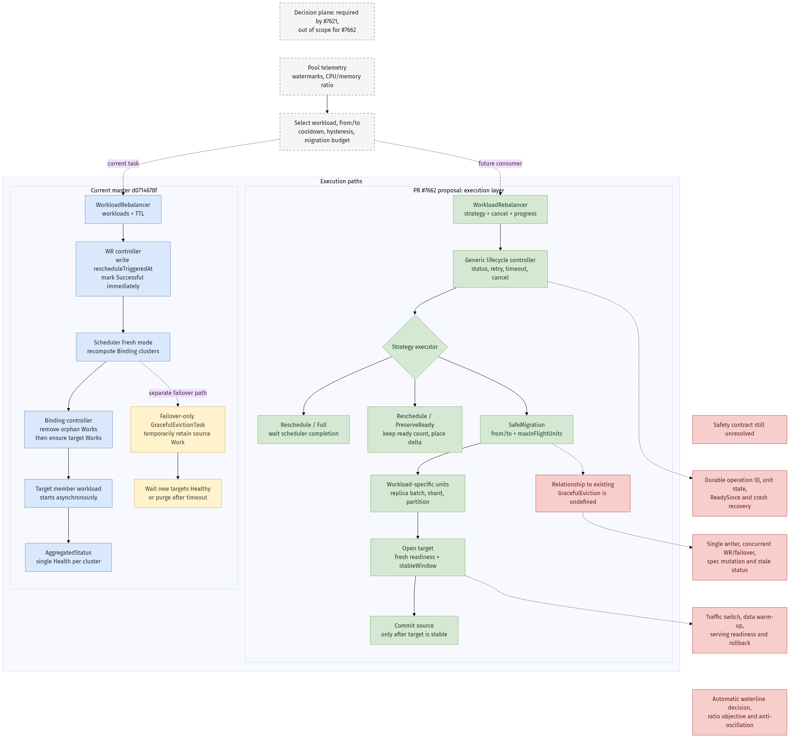
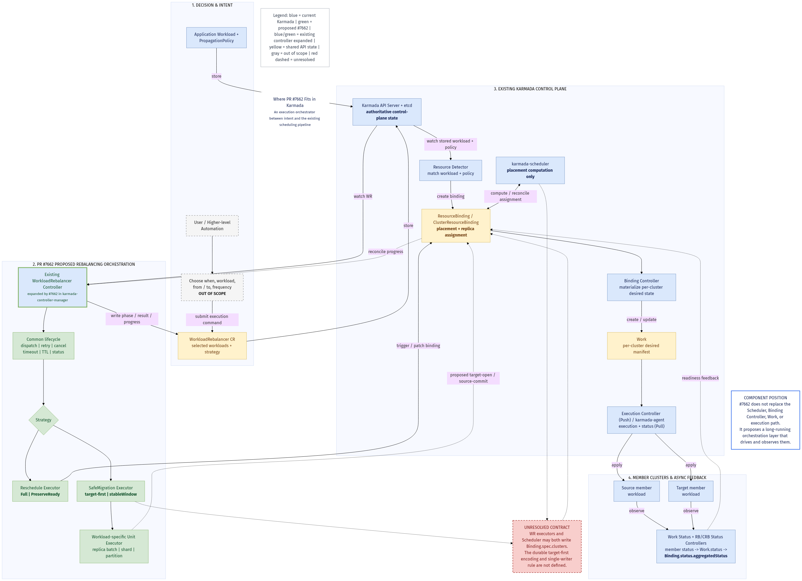
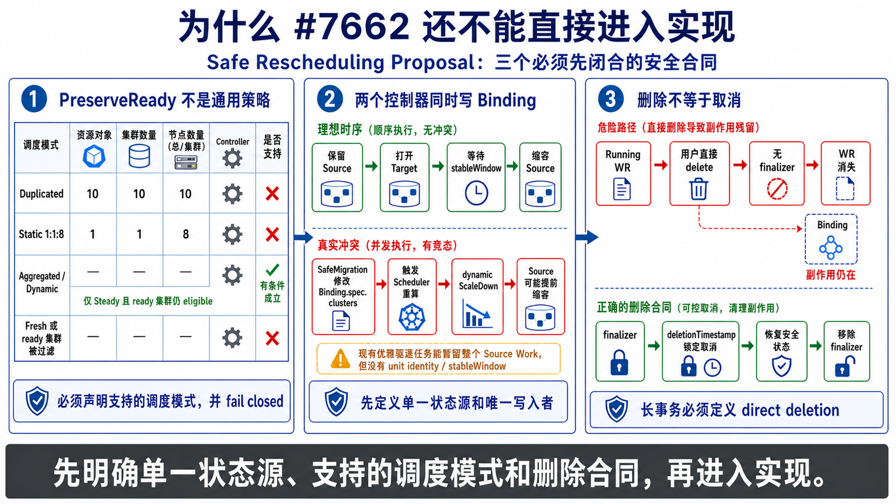

# Day 15：#7621 复杂工作负载安全重调度特性尽调

日期：2026-07-13

最近更新：2026-07-14

## 一页结论

[#7621](https://github.com/karmada-io/karmada/issues/7621) 值得作为后续高价值主线，但当前正确动作是深度 review [proposal PR #7662](https://github.com/karmada-io/karmada/pull/7662)，不是认领 issue 或直接写 executor。

- `MAINTAINER`：`@zhzhuang-zju` 明确说 #7621 当时只用于讨论，不需要开发；议题随后进入 2026-06-16 和 2026-06-30 社区会议。
- `OBS`：#7621 仍是 open `kind/question`、无 assignee；#7662 已由 `@zhy76` 提交，`@RainbowMango` assign 自己 review，但没有实质性真人技术 review、`/lgtm` 或 `/approve`。
- `CODE`：当前 WorkloadRebalancer 只写 `binding.spec.rescheduleTriggeredAt`，写入成功就把任务标成 `Successful`，不等待 scheduler、Work 或 member workload ready。
- `CODE`：现有 GracefulEviction 能在 failover 场景暂时保留源端 Work，但 WorkloadRebalancer 和 Descheduler 都没有使用它；它也没有明确目标、稳定窗口、流量切换或迁移单元。
- `SCOPE`：#7662 只设计“上层已经决定迁谁、从哪迁到哪之后，怎样执行”的 execution layer。#7621 提到的自动水位决策、CPU/内存比例优化、防振荡、业务流量切换和数据 warm-up 都仍是 non-goal。

因此，这条主线含金量高，但“做好”不是在作者旁边再开一个重复 PR。最有效的切入点是先贡献独立、可验证的设计证据：`PreserveReady` 对不同副本调度策略是否成立、SafeMigration 与 GracefulEviction 如何共享唯一状态源、controller crash/cancel/spec mutation/stale status 下需要持久化什么。维护者确认边界后，再认领一个测试或兼容性实现切片。

> 注释：公开资料只能确认 `@zhy76` 的 GitHub profile 标注 `@alibaba`，不能从 issue、PR 或公开 profile 进一步确认具体业务线。“千问事业群”在本文中只作为用户提供的背景，不当作已公开核验事实。技术价值判断也不依赖作者公司。

## 证据范围

| 类型 | 证据 |
| --- | --- |
| Upstream master | `d0714678fe181e8dc7d7446555e14799333911db`，2026-07-13 通过 GitHub REST 与 `upstream/master` 交叉确认 |
| #7621 | GitHub issue body、4 条评论、events/timeline、assignee/label 状态 |
| #7662 | head `586f6fc3508eb0a504223898c0329a4bb8b4c57c`，完整 720 行 proposal、全部 issue/review/line comments、exact-head checks |
| 社区会议 | 官方 Google Meeting Notes；2026-06-16、2026-06-30 官方 YouTube 录像入口 |
| 当前实现 | WorkloadRebalancer API/controller、scheduler Fresh mode、binding controller、GracefulEviction、Descheduler、ResourceInterpreter 和多组件调度源码 |

本轮没有运行或修改 Karmada Go 代码。所有源码判断都绑定到上述 exact SHA；proposal 判断绑定到 PR head，不把未合并文档当成 master 行为。

## Issue / PR 概览

| 项目 | #7621 | #7662 |
| --- | --- | --- |
| 标题 | Guidance on safe rescheduling for complex workloads | Extend WorkloadRebalancer with Strategy-based Rebalancing |
| 状态 | open，`kind/question` | open，非 draft，mergeable 但 blocked，`size/XL` |
| 作者 | `@zhy76`，Karmada `MEMBER` | `@zhy76` |
| PR 认领 @ | 无 | assignee `@RainbowMango`；requested reviewers `@seanlaii`、`@Tingtal` |
| 当前产出 | 生产需求与讨论入口 | 一份 +720/-0 proposal，未改 API/runtime |
| 真人技术结论 | 无 | 无；`@RainbowMango` 只表示已放入 review queue |
| CI | 不适用 | 17 个 exact-head checks 成功；只证明文档 head 通过仓库检查 |

九条 line comments 均来自 Gemini 或 Copilot。optional strategy、TTL 兼容性、controller 早退、运行中 spec mutation 和迁移中间态持久化等意见有技术价值，但仍须按源码独立验证，不能写成 maintainer consensus。

## 社区讨论时间线

| 时间 | 事件 | 能证明什么 | 不能证明什么 |
| --- | --- | --- | --- |
| 2026-06-12 | #7621 创建 | 需求来自真实复杂 workload 语义：shard、warm-up、readiness/heartbeat、资源池平衡 | 尚无设计方向 |
| 2026-06-12 | `@zhzhuang-zju` 邀请作者参加会议，并明确“currently just for discussion, and no development work is required for now” | 社区希望先讨论，禁止把它当普通可认领 feature | 不是拒绝长期特性 |
| 2026-06-16 | 中文社区会议讨论 #7621，纪要仅记 `Openkruze-like workloads.` | 议题确实进入会议 | 没有 API、owner 或 action item 共识 |
| 2026-06-23 | #7662 proposal 创建 | 作者将问题拆成执行框架 | 不代表设计被接受 |
| 2026-06-24 | `@RainbowMango` `/assign`，表示进入其 review queue | 有 maintainer review owner | 不是技术 review、LGTM 或 approve |
| 2026-06-30 | 作者在中文会议介绍 #7662 | 社区把 story 2 归为 offline pending replica，story 3 归为 online graceful migration | 纪要没有记录方案批准或未决问题答案 |
| 2026-07-13 | 本轮复核 | PR 仍停在原始单 commit，无真人技术 review | 不能推断社区已放弃；只能说当前等待 review |

会议资料：

- [官方 Meeting Notes](https://docs.google.com/document/d/1y6YLVC-v7cmVAdbjedoyR5WL0-q45DBRXTvz5_I7bkA/edit)
- [2026-06-16 官方录像](https://www.youtube.com/watch?v=i-YL8mHKWWg)
- [2026-06-30 官方录像](https://www.youtube.com/watch?v=y-r0o2kDRXs)

两段录像没有公开 caption track，本轮没有把未转录音频内容当作证据。

## 通俗理解

普通 reschedule 解决的是：“重新算一下，这个 workload 应该放在哪些集群。”

#7621 要解决的是更难的问题：“在旧集群还对外服务时，先让新集群把数据下载、模型加载、Pod/Shard 启动和健康检查做完；确认新端稳定后，再逐步关掉旧端；如果中途失败、重启或取消，不能两边都丢，也不能来回搬。”

这接近一个跨集群、长时间运行、可恢复的迁移事务：

1. 决定迁移对象和目标。
2. 在目标端预留或打开容量。
3. 等待 workload-specific readiness 和稳定窗口。
4. 切换流量或确认业务接管。
5. 提交源端缩容/删除。
6. 在任意 crash point 能重新判断已经做到哪一步。
7. 失败或取消时恢复到明确的安全状态。

> 分析：这里不能套数据库的原子事务幻想。member cluster、controller、scheduler、Work 和业务流量系统都是异步的，真正可实现的是幂等状态机、持久化检查点和明确的补偿动作。

## Current vs Proposed



- [可编辑 draw.io 源](day15-issue-7621-current-proposed-flow.drawio)
- [Mermaid fallback 源](day15-issue-7621-current-proposed-flow.mmd)
- [SVG](day15-issue-7621-current-proposed-flow.svg)

图中灰色 decision plane 是 #7621 需要、但 #7662 明确不负责的部分；蓝色是当前 master；绿色是 proposal；红色是尚未闭合的安全合同。

### PR #7662 在 Karmada 组件链路中的位置



- [可编辑 draw.io 源](day15-pr7662-karmada-component-position.drawio)
- [Mermaid fallback 源](day15-pr7662-karmada-component-position.mmd)
- [SVG](day15-pr7662-karmada-component-position.svg)

这张图进一步展开 proposal 与现有 Karmada 组件的边界：#7662 扩展现有 WorkloadRebalancer controller，作为 intent 和既有 scheduler / Binding / Work / execution pipeline 之间的长事务编排层，不替代这些组件。红色虚线保留当前最重要的未决合同：WR executor 与 scheduler 可能同时写 `Binding.spec.clusters`，proposal 尚未定义 durable target-first encoding 和 single-writer rule。

## 当前源码链路

### 1. WorkloadRebalancer 只是 trigger

当前 API 只有 `workloads` 和 `ttlSecondsAfterFinished`，没有 strategy、source/target、phase、progress 或 cancel：

- [`WorkloadRebalancerSpec`](https://github.com/karmada-io/karmada/blob/d0714678fe181e8dc7d7446555e14799333911db/pkg/apis/apps/v1alpha1/workloadrebalancer_types.go#L53-L68)
- [`ObservedWorkload`](https://github.com/karmada-io/karmada/blob/d0714678fe181e8dc7d7446555e14799333911db/pkg/apis/apps/v1alpha1/workloadrebalancer_types.go#L108-L139)

Controller 找到 Binding 后写入 `rescheduleTriggeredAt`，API update 成功就立即记录 `RebalanceSuccessful`：

- [`triggerReschedule`](https://github.com/karmada-io/karmada/blob/d0714678fe181e8dc7d7446555e14799333911db/pkg/controllers/workloadrebalancer/workloadrebalancer_controller.go#L189-L253)

所以当前 `Successful` 的准确语义是“成功触发”，不是“scheduler 已完成”，更不是“新集群已开始稳定服务”。现有 e2e 也把 WR status 和 scheduler `lastScheduledTime` 分成两个 wait：

- [`checkWorkloadRebalancerResult`](https://github.com/karmada-io/karmada/blob/d0714678fe181e8dc7d7446555e14799333911db/test/e2e/suites/base/workloadrebalancer_test.go#L112-L123)

### 2. Scheduler 进入 Fresh 模式

Scheduler 观察到 trigger 后执行完整重调度；动态副本分配从默认 `Steady` 切到 `Fresh`，不参考上次分配：

- [`doScheduleBinding`](https://github.com/karmada-io/karmada/blob/d0714678fe181e8dc7d7446555e14799333911db/pkg/scheduler/scheduler.go#L395-L453)
- [`newAssignState`](https://github.com/karmada-io/karmada/blob/d0714678fe181e8dc7d7446555e14799333911db/pkg/scheduler/core/assignment.go#L95-L123)

这能实现 fresh placement，但没有 make-before-break 协议。

### 3. 普通 Binding 更新会先清 orphan Work

Binding controller 的顺序是先 `removeOrphanWorks()`，再 `ensureWork()`：

- [`syncBinding`](https://github.com/karmada-io/karmada/blob/d0714678fe181e8dc7d7446555e14799333911db/pkg/controllers/binding/binding_controller.go#L109-L151)

WorkloadRebalancer 不创建 GracefulEvictionTask，因此 scheduler 把源集群移出 `spec.clusters` 后，源端 Work 没有 target-ready barrier，会先成为 orphan。这里就是当前 WR 无法保证连续服务的核心边界。

### 4. 已有 GracefulEviction 是 failover-only 的半套能力

`GracefulEvictCluster` 会把源集群从 active clusters 移出，同时添加 `GracefulEvictionTask`：

- [`GracefulEvictCluster`](https://github.com/karmada-io/karmada/blob/d0714678fe181e8dc7d7446555e14799333911db/pkg/apis/work/v1alpha2/binding_types_helper.go#L153-L196)

Binding helper 会把 task 的 `fromCluster` 继续视为 existing cluster，因此源端 Work 暂时不被清理：

- [`ObtainBindingSpecExistingClusters`](https://github.com/karmada-io/karmada/blob/d0714678fe181e8dc7d7446555e14799333911db/pkg/util/helper/binding.go#L190-L212)

GracefulEviction controller 等 scheduler 处理当前 generation 且新调度集群全部 `Health=Healthy` 后移除 task；但 timeout 到期也会移除：

- [`assessSingleTask`](https://github.com/karmada-io/karmada/blob/d0714678fe181e8dc7d7446555e14799333911db/pkg/controllers/gracefuleviction/evictiontask.go#L67-L115)

它提供“暂时保留源端”的基础，却没有明确 `to`、批次、stableWindow、流量切换、回滚和 durable progress。[#7455](https://github.com/karmada-io/karmada/issues/7455) 还证明“无目标 fit 时 timeout 后是否仍清源端”本身就是未解决的产品语义。

### 5. Descheduler 也不是资源池均衡器

当前 Descheduler 硬编码只处理动态拆分的 Deployment：

- [`FilterBindings`](https://github.com/karmada-io/karmada/blob/d0714678fe181e8dc7d7446555e14799333911db/pkg/descheduler/core/filter.go#L30-L62)

它将长期不可调度副本的目标数降到不低于当前 ready replicas，再让 scheduler 补差额：

- [`updateScheduleResult`](https://github.com/karmada-io/karmada/blob/d0714678fe181e8dc7d7446555e14799333911db/pkg/descheduler/descheduler.go#L208-L244)

它没有 target-ready 后再缩 source 的状态机，也不根据资源池 watermark、CPU/内存比例或迁移历史选 workload。

### 6. 复杂 workload 已有解释器，但 readiness 粒度不够

ResourceInterpreter 有 replica、component、status 和 health 扩展点：

- [`ResourceInterpreter`](https://github.com/karmada-io/karmada/blob/d0714678fe181e8dc7d7446555e14799333911db/pkg/resourceinterpreter/interpreter.go#L42-L81)

但最终 Binding 每个 cluster 只有一个 `Healthy/Unhealthy/Unknown`。没有 health hook 的资源会直接被当成 Healthy：

- [`interpretHealth`](https://github.com/karmada-io/karmada/blob/d0714678fe181e8dc7d7446555e14799333911db/pkg/controllers/status/work_status_controller.go#L393-L412)

更典型的是，当前 FlinkDeployment 规则把 `FAILED/FINISHED/CANCELED/SUSPENDED` 和 `RUNNING` 都视为 Healthy：

- [Flink health customization](https://github.com/karmada-io/karmada/blob/d0714678fe181e8dc7d7446555e14799333911db/pkg/resourceinterpreter/default/thirdparty/resourcecustomizations/flink.apache.org/v1beta1/FlinkDeployment/customizations.yaml#L10-L20)

这对 failover 的“资源状态已终结/不再变化”可能有意义，但不能直接等价为“在线推理服务已 ready 并接管流量”。SafeMigration 必须定义 workload-specific serving readiness，而不能只复用通用 `Health=true`。

## #7621 目标覆盖矩阵

| 目标 | 当前 master | #7662 proposal | 剩余缺口 |
| --- | --- | --- | --- |
| 连续服务 | GracefulEviction 在 failover 中可暂留 source | SafeMigration 提出 target-first/source-commit | traffic switch、数据 warm-up、fallback、安全不变量 |
| target ready 后清 source | GracefulEviction 看 binding-level Health 或 timeout | workload unit executor + stableWindow | readiness freshness、持久化 ReadySince、commit 幂等 |
| 多 shard/component | Alpha Components 能做容量估计 | MigrationUnit 可由 workload executor 定义 | Binding 没有 component/shard 级 placement 和 stable unit identity |
| 自动水位均衡 | 缺失 | 明确 non-goal | telemetry、workload selection、from/to、迁移预算 |
| CPU/内存比例不恶化 | estimator 只能判断能否放下 | 明确 non-goal | 多目标评分与约束合同 |
| 防振荡 | Steady/ClusterLocality 只能减少普通调度扰动 | 明确 non-goal | cooldown、hysteresis、history、budget |
| cancel/restart 恢复 | WR 无长事务 | 提出 Canceling 和每轮重建 units | durable checkpoint、原始计划、partial commit 补偿 |
| 多 workload 一致性 | 逐个独立 trigger | 逐个 executor reconcile | 没有 group transaction 或 failure policy |

## #7662 提案做了什么

Proposal 把 WorkloadRebalancer 从单一 trigger 扩展为 strategy execution framework：

| Strategy | 设计意图 |
| --- | --- |
| `Reschedule/Full` | 保留 legacy fresh schedule，但等待 scheduler 完成后再标记完成 |
| `Reschedule/PreserveReady` | 把各 cluster 的目标副本降到当前 ready 数，仅让 scheduler 重排 unavailable delta |
| `SafeMigration` | 按 `from/to` 打开 target migration units，等待 stableWindow，再 commit source |

公共 controller 管 workload list、phase/status、retry、cancel、timeout 和 TTL；strategy executor 管 Binding 变化；SafeMigrationUnitExecutor 管 Deployment batch、shard 或 partition 等业务迁移单元：

- [Proposal architecture and API](https://github.com/karmada-io/karmada/blob/586f6fc3508eb0a504223898c0329a4bb8b4c57c/docs/proposals/scheduling/%20extend-workload-rebalancer/README.md#L179-L308)
- [Controller and executor interfaces](https://github.com/karmada-io/karmada/blob/586f6fc3508eb0a504223898c0329a4bb8b4c57c/docs/proposals/scheduling/%20extend-workload-rebalancer/README.md#L309-L492)
- [Execution flow and status](https://github.com/karmada-io/karmada/blob/586f6fc3508eb0a504223898c0329a4bb8b4c57c/docs/proposals/scheduling/%20extend-workload-rebalancer/README.md#L493-L686)

这个分层方向合理：scheduler 负责算 placement，长时间迁移由 controller/executor 管，不把等待和业务状态塞进 scheduler hot path。

## 高风险设计缺口

### Blocking 1：迁移事务没有 durable source of truth

Proposal 说 MigrationUnit 每轮从真实对象重建，但 `target desired-open`、stableWindow 的 `ReadySince`、原始 source plan、partial source commit 和 cancel rollback 都不是仅看当前对象就一定能重建的事实。

典型 crash point：

| Crash point | 重启后必须知道什么 |
| --- | --- |
| target patch 前 | unit 尚未开始，重复 reconcile 不应误判 in-flight |
| target patch 成功、status 未写 | target 是本任务打开的，重复操作必须幂等 |
| ready 观察到一半 stableWindow | 本次 ready 连续窗口从何时开始，状态是否属于当前 generation |
| source commit 成功、status 未写 | 不能再次缩 source，也不能把 unit 当未开始 |
| 部分 units committed 后 cancel | 原始 source layout、已提交边界、补偿优先级 |

如果不先定义持久化载体，`phase` 只是表面状态，无法证明 controller restart 后安全。

### Blocking 2：没有和 GracefulEviction 定义单一迁移状态机

现有 GracefulEviction 已能表达“source 从 active scheduling result 移除，但 source Work 暂留”。SafeMigration 如果另外直接 patch Binding/Work，会出现两个系统同时决定 source 是否删除。

Proposal 需要明确三选一：

1. 复用并扩展 GracefulEvictionTask；
2. SafeMigration 独立，但定义严格互斥和 ownership；
3. 抽取共同 migration primitive，再让 failover 与 WR 都消费。

没有这个决定，无法设计幂等、并发和故障恢复测试。

### Blocking 3：缺少单写者和并发冲突模型

同一个 Binding 可能同时被两个 WorkloadRebalancer、taint manager、failover、Descheduler、policy update 或用户修改。需要至少定义：

- 哪个字段/annotation/status 表示 migration owner 和 operation ID；
- observed workload generation、Binding UID/generation/resourceVersion 如何校验；
- 第二个任务是 reject、queue、merge 还是 supersede；
- workload spec 在 Running 中变化时 fail closed、replan 还是 cancel；
- optimistic conflict 后如何重新读取并判断旧动作是否已经生效。

### Blocking 4：PreserveReady 不能直接假设适用于所有 scheduling mode

把 `spec.clusters[i].replicas` 改为 ready 数，不代表 scheduler 一定保留这些 cluster counts。Duplicated、Static Weighted、Aggregated、Dynamic Weighted 的 assignment 规则不同；只有读现有 `AssignReplicas` 路径并做行为矩阵，才能确定哪些 mode 支持该不变量。

另一个问题是 cluster-level `readyReplicas=4` 不能标识“具体哪 4 个 Pod/shard 应被锁定”，对 Deployment 可能够用，对 shard workload 不够。

### Evidence Gap：AggregatedStatus freshness

AggregatedStatus 是 member object -> Work status -> Binding status 的异步反射结果。fresh GET 不等于该 ready 值属于本次 workload/binding lifecycle。需要关联 workload generation、member observedGeneration、Binding generation 和本次 operation ID，才能开始 stableWindow 或提交 source。

### Compatibility：默认值和 TTL 都改变旧合同

- `strategy` 若 required，旧 YAML 和现有 client create 会失败；应先由维护者决定 omitted strategy 是否 default 到 legacy Full。
- 即使 default Full，`Successful` 从“trigger 写入成功”变成“scheduler 完成”也会改变 status/TTL 时序。
- 当前 TTL 对 Successful 或 Failed 的 completed WR 都生效；proposal 改成只清成功对象，是独立 API 行为变化，不能夹带在 strategy 字段里。

### Scope：proposal 不是 #7621 的完整答案

自动水位、CPU/内存比例和防振荡在 proposal 中明确排除。即使 #7662 全部实现，也只得到一个可被上层系统调用的 migration execution primitive。后续仍需要 decision controller 或外部平台决定何时迁、迁谁、迁到哪。

## 相关 Issue / PR 图谱

| 编号 | 关系 | 当前意义 |
| --- | --- | --- |
| [#4698](https://github.com/karmada-io/karmada/issues/4698) / [#4840](https://github.com/karmada-io/karmada/issues/4840) | WorkloadRebalancer 原始设计 | 当前 trigger-only 行为的起点 |
| [#5172](https://github.com/karmada-io/karmada/issues/5172) | multiple clusterAffinities 下 fresh reschedule umbrella | open、assignee `@bharathguvvala`、v1.19；不要重复实现 |
| [#7717](https://github.com/karmada-io/karmada/issues/7717) | failback 语义 | maintainer 说明想回 primary 应用 `overflowAffinities`，#7662 Story 1 必须写清 policy 前提 |
| [#7455](https://github.com/karmada-io/karmada/issues/7455) | GracefulEviction 无 replacement 时仍可能 timeout 清源端 | SafeMigration 的“绝不提前清源端”不能直接继承现有默认语义 |
| [#7483](https://github.com/karmada-io/karmada/issues/7483) | failover storm 下 Binding optimistic-lock conflict | 证明迁移状态机必须显式设计并发和 retry |
| [#7492](https://github.com/karmada-io/karmada/issues/7492) | multi-component scheduling phase IV | v1.19 相邻主线，已有成员准备跟进；SafeMigration unit 不能假设底层 placement 已支持 component 粒度 |
| [#6518](https://github.com/karmada-io/karmada/issues/6518) | failover workload 分配不均 | 属于资源效率/decision side，且涉及 estimator stale state |
| [#7441](https://github.com/karmada-io/karmada/issues/7441) | 自动 failback | 未来可能调用 #7662 execution primitive，但不是当前 proposal 的实现依赖 |
| [#7662](https://github.com/karmada-io/karmada/pull/7662) | #7621 直接 proposal | 当前最适合 review 和贡献证据的入口 |

## 对秋招价值的诚实判断

这个方向的简历价值确实比普通小修复高，前提是最终形成可验证产出，而不是只在 issue 下出现名字。

高价值能力包括：

- Kubernetes controller 的长事务、幂等 reconcile、崩溃恢复和 optimistic concurrency；
- 多集群 scheduler、Binding/Work、eventual consistency 和 stale status；
- make-before-break、稳定窗口、补偿动作、流量/数据平面边界；
- API defaulting、向后兼容、状态机合同和跨版本升级；
- 多组件 AI/大数据 workload 的容量估计、readiness 与 shard 语义；
- 在公开社区会议和 maintainer review 中把生产需求变成可合并设计。

最有说服力的秋招证据顺序是：

1. proposal 中有被作者/maintainer采纳的 source-backed review；
2. 有独立 regression/state-machine tests 或小型实现 PR merged；
3. 能展示 crash/recovery/e2e 证据，而不是只有 happy path 单测；
4. 能在社区会议清楚讲 scope、non-goals 和风险；
5. 最后才是“与哪家公司的人协作过”。

风险也要正视：这是跨 release 的设计，全部做完很可能赶不上秋招。我们的目标应是尽快拿到一个独立、可 merge、能说明系统判断力的切片，而不是等待整套 SafeMigration 落地后才形成成果。

## 我们的参与策略

### 当前阶段：Proposal Review

状态标记为 `REVIEW`，不 `/assign` #7621，不从作者分支复制 controller，不先改 API。

### 2026-07-14：三个 blocking gap 信息图



这张图把当前 review 的三项 blocking gap 压缩成一页：`PreserveReady` 的支持边界、target-first 与 Binding 调度重算的冲突，以及 direct deletion 缺少 finalizer 合同。它是下面源码和实验分析的阅读索引，不替代证据本身。

> 注意：这张中文图仅用于本地学习记录，不可用于 upstream issue、PR、review 或社区会议。后续新图默认全部使用英文。

- [原生生成提示词](day15-pr7662-review-infographic-prompt.md)
- [术语修正提示词](day15-pr7662-review-infographic-correction-prompt.md)

### 2026-07-14：PreserveReady 行为矩阵

使用 `upstream/master@d0714678f` 的真实 `core.AssignReplicas` 做 focused audit。输入统一为 Deployment desired `10`，准备保留的 ready 下界为 `member1=4/member2=4`，候选另含 `member3`。

| Case | 实际输出 | 结论 |
| --- | --- | --- |
| Duplicated / Steady | `10/10/10`，sum `30` | 不兼容；每个候选得到完整副本数，proposal 的 total-delta 算法也不适用 |
| Static Weighted `1:1:8` / Steady | `1/1/8` | 不兼容；按权重完整重算，ready `4/4` 不是下界 |
| Aggregated / Steady | `6/4/0` | 条件兼容；仅在 ready clusters 仍是 candidates 且没有 Fresh trigger 时成立 |
| Dynamic Weighted / Steady | `5/4/1` | 条件兼容；同样依赖 candidate 和 Steady 条件 |
| Aggregated / Fresh | `10/0/0` | 不兼容；Fresh 丢弃旧分配 |
| Dynamic Weighted / Fresh | `4/2/4` | 不兼容；`member2` 低于 ready 下界 |
| Aggregated / Steady，过滤 `member2` | `10/0/0` | 不兼容；旧 ready cluster 不再 eligible 时被移除 |
| Dynamic / Steady，过滤 `member2` | `6/0/4` | 不兼容；旧 ready cluster 不再 eligible 时被移除 |

代码原因很明确：Duplicated 直接给每个 candidate 完整 `spec.replicas`；Static Weighted 不使用 Steady/Fresh 分支；只有 Aggregated/Dynamic 的 Steady scale-up 会把仍在 candidate 集合中的旧 `spec.clusters` 当作增量分配下界。因此 proposal 不能把 `PreserveReady` 描述成通用 `Reschedule` mode，至少要定义 supported placement matrix、禁止未完成的 Fresh trigger，并在 ready cluster 失去 eligibility 时 fail closed。

验证命令：

```text
go test ./pkg/scheduler/core -run '^TestAuditPreserveReadyAcrossReplicaStrategies$' -count=1 -v
go test ./pkg/scheduler/core -run 'TestAssignReplicas|Test_dynamicScale|Test_assignByStaticWeightStrategy' -count=1
```

两条命令均通过。第一条只存在于临时 detached worktree，用于审计，不进入 Karmada 代码或 upstream branch。

### SafeMigration target-first 与 scheduler 冲突

Proposal 的 `EnsureTarget -> stableWindow -> CommitSource` 无法只用 `Binding.spec.clusters` 表达：

1. `EnsureTarget` 在不缩 source 的情况下加入 target，会让 `sum(spec.clusters) > spec.replicas`。
2. spec 更新增加 Binding generation，scheduler update handler 会立即入队。
3. Divided/Aggregated 或 Dynamic 的 Steady 路径看到 over-assignment 后进入 `dynamicScaleDown`；Duplicated/Static 则直接完整重算。
4. 如果同一次 patch 先缩 source 再加 target，binding controller 会在 target ready 前就按新 `spec.clusters` 缩 source，同样违反 target-first。

现有 `GracefulEvictionTasks` 能把整个 source cluster 移出 active schedule result，同时继续把 source Work 视为 existing；但它没有 target/unit identity、`stableWindow` 或 Deployment replica-batch 语义，默认还会在 Healthy 或 timeout 后删 task。Proposal 必须明确是扩展该 durable state、增加专用 migration field/CR，还是采用其他 scheduler exclusion；不能让 SafeMigration 和 scheduler 同时写 `spec.clusters` 却没有单一状态源。

### 直接删除绕过 cancellation

独立反证确认这是 blocking lifecycle gap，而不只是实现细节：

- Proposal 只有 `spec.cancel -> Canceling -> Cancel()`，没有 finalizer、`deletionTimestamp` 或 direct-delete 合同。
- 当前 WR controller 的 update predicate 只比较 spec，`DeleteFunc` 返回 false；对象 NotFound 时直接结束 reconcile。
- ResourceBinding 的 owner 是 workload，不是 WR；删除 WR 不会触发垃圾回收来撤销 target-open 或 partial source commit。
- 现有 GracefulEviction controller 只会继续已存在的 eviction task，不能替 SafeMigration 执行 rollback。

最小安全合同应是：第一次 strategy side effect 前添加 finalizer；`deletionTimestamp` 视为不可撤销的 cancel，停止启动新 unit，先收敛到 proposal 定义的 safe state，再移除 finalizer。还必须定义恢复无法收敛时的行为，避免 finalizer 永久阻塞删除。

对应 regression 至少覆盖：target 已打开但 source 未提交时 delete；部分 source 已提交时 delete；确认没有新 unit 启动、source 先保留/恢复，并且 WR 只在安全收敛后消失。

### Upstream review 状态

评论 A 已于 2026-07-14 发布到 PR #7662 proposal line 569（选择 unit 并打开 target）：[#discussion_r3576720182](https://github.com/karmada-io/karmada/pull/7662#discussion_r3576720182)。远端回读确认作者为 `@ranxi2001`、commit 为 `586f6fc3508e`、正文 80 个英文词：

```text
Could the proposal clarify how `EnsureTarget` keeps source replicas unchanged while the scheduler remains active?

Updating `Binding.spec.clusters` increments the Binding generation and requeues scheduling. A temporary target-first over-assignment can therefore enter `dynamicScaleDown`; Duplicated and Static Weighted also recompute the assignment directly. This means the source may shrink before the target passes `stableWindow`.

Could the design define one authoritative migration state, or an explicit scheduler exclusion, and require that source desired replicas cannot decrease between `EnsureTarget` and the end of `stableWindow`?
```

候选 B 尚未发布，目标为 PR #7662 proposal line 328（controller ownership 包含 cancellation）：

```text
Could the lifecycle define direct deletion while `SafeMigration` is Running?

The proposal reaches `Canceling` only through `spec.cancel`. Today the WR controller filters delete events and spec-unchanged updates, and a NotFound reconcile returns without cleanup. Because the Binding is owned by the workload rather than the WR, deleting the WR after `EnsureTarget` or a partial `CommitSource` would leave those side effects without an executor to converge or roll them back.

Would the first side effect require a finalizer, with `deletionTimestamp` treated as latched cancellation: stop starting units, restore the defined safe state, then remove the finalizer? A regression should cover deletion after target-open and after partial source commit, including what happens if restoration cannot converge.
```

评论 A 不重复现有 9 条 bot threads，也没有把行为矩阵和完整取证过程复制到 upstream。下一步先等待作者或 `@RainbowMango` 回答 authoritative migration state / scheduler exclusion；评论 B 仍需用户确认 exact target 和全文，不能自动发布。

### Maintainer 确认后

优先认领以下独立切片之一：

1. state-machine contract tests：restart、重复 reconcile、stale status、partial commit、cancel；
2. backward compatibility tests：旧 YAML、default Full、status completion timing、Failed TTL；
3. conflict tests：两个 WR、workload generation mutation、failover 与 WR 并发；
4. 最小 Full executor：只有在 API/default/status 合同确定后实现，并证明旧行为兼容。

不建议先抢目录改名、英文语法或大段 executor 实现。这些动作可见度低，也不能证明我们理解了最难的安全边界。

## 本轮失败与绕过

| 失败 | 现象 | 绕过 |
| --- | --- | --- |
| Web 页面工具 | 两次 GitHub open/search 都返回 stream decode error | 使用 GitHub REST、repo-local thread scripts 和公开页面 URL 交叉核验 |
| 本地 upstream ref 过旧 | `upstream/master` 停在 `3d4d14d74` | `git fetch upstream master` 更新到 `d0714678f`，未 checkout 或改工作树 |
| `gh pr view` GraphQL | token 缺 `read:org`，读取 reviewer login 失败 | 改用公开 REST pulls/reviews/check-runs API |
| controller 文件名假设错误 | 尝试读取不存在的 `workload_rebalancer_controller.go` | `rg --files` 找到实际 `workloadrebalancer_controller.go` |
| Bilibili API | 返回 `-799` | 使用官方 YouTube RSS、录像 URL 和 Google Meeting Notes |
| 录像 transcript | 两场视频没有公开 caption track | 只引用会议纪要明确记录，不推断音频内容 |
| draw.io / Graphviz | 当前 Linux 环境没有 CLI | 保留 `.drawio` 和 `.mmd` 源，使用 Mermaid remote renderer 生成 PNG/SVG，并记录限制 |
| Karmada proposal reference 缺失 | `karmada-issue-discussion` 引用了不存在的 `references/proposal-review.md` | 只读参考 AgentCube 同源 checklist，并以 Karmada proposal、源码和历史 API 为最终证据；未照搬 AgentCube 项目结论 |

## 下一步

1. 评论 A 已发布；候选 B direct-deletion/finalizer 仍需用户确认 exact target/text，不合并成冗长 omnibus review。
2. 等待作者或 `@RainbowMango` 回答 authoritative migration state / scheduler exclusion、finalizer/deletion 和 supported placement 边界，不重复追问已有 bot threads。
3. 设计边界明确后，请作者/maintainer 指定可独立认领的 state-machine、compatibility 或 scheduler contract test slice。
4. 只有获得 maintainer/author 边界确认后，才从最新 `upstream/master` 建独立 topic branch；Day 15 报告和本地 evidence 不进入 upstream branch。

## Stop Conditions

- #7662 作者正在修改同一 API/controller 时，不开重复 implementation PR。
- Proposal 未确定 GracefulEviction relationship、persistence 和 backward compatibility 前，不写 SafeMigration executor。
- 只有 AI reviewer 支持、没有源码/测试或 maintainer direction 时，不宣称设计已接受。
- 如果我们的实验只能证明某个 scheduling mode 行为，不把它外推成完整 safe migration 正确性。
