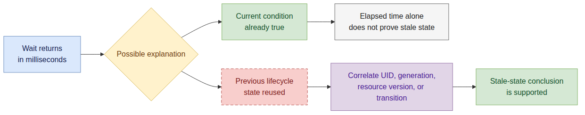
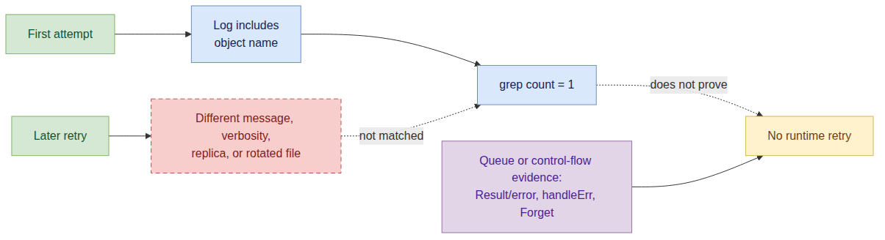

# Day 17 - PR #7764 E2E Root Cause Analysis Skill Review

日期：2026-07-14

PR：[#7764 Add agent skill for diagnosing flaky E2E tests](https://github.com/karmada-io/karmada/pull/7764)

Compare：[master...RainbowMango:pr_e2e_failure_triage_skill](https://github.com/karmada-io/karmada/compare/master...RainbowMango:karmada:pr_e2e_failure_triage_skill)

Review commit：`ef572a249c20ab0b014f752cd8a6d64b6964db29`

## 今日目标

Review PR #7764 新增的 Claude Code project skill，检查它是否能够从 Karmada E2E 失败 job 中取得日志、定位 Ginkgo 失败、关联组件日志，并形成有证据的 root cause chain。

这次 review 不修改 PR 代码，也不自动向 upstream 发布评论。先在本地验证 AI reviewer 的意见，再由人工决定哪些意见采纳、哪些不采纳、哪些继续调查。

> 注释：skill 也是可执行工作流的一部分。Review skill 时不能只检查 Markdown 格式，还要实际运行关键命令，确认路径、artifact 布局和日志格式与仓库当前 CI 一致。

## Review Surface

PR 只有一个 commit，新增一个文件：

```text
.claude/skills/e2e-root-cause-analysis/SKILL.md | 150 lines
```

Skill 的目标流程是：

1. 从 PR 或 job URL 找到失败的 E2E job。
2. 下载 GitHub Actions job log 和对应 Kubernetes 版本的 component-log artifact。
3. 从 Ginkgo `[FAILED]` 和 Timeline 反向定位失败。
4. 用 scheduler、controller-manager、agent 等组件日志补齐因果链。
5. 检查 retry/requeue 源码，再输出带时间戳和文件名的报告。

本次同时交叉检查：

- `.github/workflows/ci.yml`
- `.github/workflows/ci-schedule.yml`
- `.github/workflows/ci-schedule-compatibility.yaml`
- `.github/workflows/installation-cli.yaml`
- `.github/workflows/installation-operator.yaml`
- `hack/run-e2e.sh`
- `hack/run-e2e-init.sh`
- `hack/run-e2e-operator.sh`
- issue [#7719](https://github.com/karmada-io/karmada/issues/7719) 的失败 job 和真实 artifact

## 本地验证

### Skill 结构

将 PR head 中的 skill 提取到临时目录后运行：

```bash
python3 /root/.codex/skills/.system/skill-creator/scripts/quick_validate.py \
  /tmp/karmada-pr7764-skill/.claude/skills/e2e-root-cause-analysis
```

结果：

```text
Skill is valid!
```

同时运行：

```bash
git diff --check upstream/master...upstream/pr/7764
```

结果通过，没有 whitespace error。

### Job log 格式

对当前 PR lint job 和 issue #7719 的失败 E2E job 分别执行：

```bash
gh api repos/karmada-io/karmada/actions/jobs/87033217333/logs > job.log
gh api repos/karmada-io/karmada/actions/jobs/84472927003/logs > failed-e2e.log
file job.log failed-e2e.log
```

两个文件都由 `gh api` 直接得到 UTF-8 plain text，不需要解压。对失败 E2E log 执行 skill 中的命令能够命中：

```bash
grep -n "\[FAILED\]\|Summarizing" failed-e2e.log
```

实际找到了 `[FAILED]`、420 秒 timeout 和 `Summarizing 1 Failure`。

因此，Copilot 提出的“job logs endpoint 下载 ZIP，必须先 unzip”是误报。GitHub workflow-run logs endpoint 和 single-job logs endpoint 不能混为一谈。

### Component-log artifact 布局

下载 issue #7719 首次失败 run 的真实 artifact：

```bash
gh run download 28499042349 \
  --repo karmada-io/karmada \
  -n karmada_e2e_log_v1.34.0 \
  --dir /tmp/karmada-pr7764-artifact
```

顶层目录和文件包括：

```text
karmada-host/
member3/
karmada.config
```

组件日志位于更深的目录，例如：

```text
karmada-host/karmada-host-control-plane/containers/
member3/member3-control-plane/containers/
```

在 artifact 根目录执行 PR 当前命令：

```bash
compgen -G 'karmada-scheduler-*.log'
```

匹配数为 `0`。递归查找：

```bash
find . -type f -name 'karmada-scheduler-*.log'
```

实际找到 `8` 个 scheduler log 文件。因此，flat glob 问题已经用真实 artifact 复现，不只是静态推测。

## 八条 Review 意见的人工结论

| 编号 | Review 意见 | 当前决定 | 记录方式 |
| --- | --- | --- | --- |
| 1 | 为下载的 CI logs/artifacts 增加 untrusted-content / prompt-injection guard | 不采纳 | 不作为本 PR blocker，不准备 upstream comment |
| 2 | Skill 描述覆盖所有 Karmada E2E，但 artifact 命令主要按 base E2E 编写 | 采纳 | compatibility/init/operator 使用不同 artifact 名称；已发布 line review |
| 3 | `grep -h "<object-name>" karmada-<component>-*.log` 无法从 artifact 根目录找到嵌套日志 | 采纳 | 已用 #7719 真实 artifact 复现，应修改为 recursive 且 component-scoped 的搜索 |
| 4 | `job.log` 和 `gh run download` 默认写入当前目录，可能覆盖或污染工作区 | 采纳 | 建议统一放入 `mktemp -d`，并只清理该临时目录 |
| 5 | “对象只出现一次”不能单独证明组件没有 retry | 采纳 | 日志命中数只能作为 lead，必须继续验证 controller Result/error 或 scheduler queue path；已发布 line review |
| 6 | Artifact layout 写有 `member1/`、`member2/`、`member3/`，但当前 artifact collector 不会导出 `member1/`、`member2/` | 采纳 | 已枚举同名 artifact 的全部当前 producer，并交叉检查本地/init/operator collector；现有 Copilot thread 有效，不重复发布评论 |
| 7 | “wait 很快通过”被直接推广为 previous-lifecycle stale state | 采纳 | elapsed time 只能形成 hypothesis，仍需 UID/generation/resourceVersion 或 old-state-disappeared/new-state-present 证据；已发布 line review |
| 8 | Skill 普通段落几乎全部按约 80 列 hard-wrap | 采纳（non-blocking） | reference parser 保留 body newline，但无 Claude A/B 效果证据；作为 prompt-quality question 发布 |

> 分析：人工 triage 的关键不是把每条 AI review comment 都变成修改。已确认项必须有可复现证据；不采纳项不继续包装成 blocker；待确认项必须保留证据缺口，不能写成已经成立的 bug。

## 已采纳意见

### 2. Artifact 下载命令与 Skill 声明范围不一致

Skill description 会在任意 Karmada E2E CI failure 上触发，但当前下载示例固定为 `karmada_e2e_log_<k8s_version>`。这只直接适配 base CI 和 scheduled base CI：compatibility 使用 `karmada_e2e_log_<apiserver>_<karmada>`，init/operator 则分别使用 `karmada_init_e2e_log_*` 和 `karmada_operator_e2e_log_*`。

由于前一条命令已经列出 run 的 artifact，最小修正可以是让后续下载使用列表中选定的 exact artifact name，并按 workflow 说明 layout；另一种合理选择是把 skill trigger 明确收窄到 base E2E。

已发布 review：[artifact scope thread](https://github.com/karmada-io/karmada/pull/7764#discussion_r3577478905)。

### 3. Component Log 搜索需要递归且限制文件范围

PR 当前示例：

```bash
grep -h "<object-name>" karmada-<component>-*.log
```

问题不是 `grep` 本身，而是 `gh run download` 将 artifact 解压成多层 kind log 目录，而流程没有先 `cd` 到 `containers/`。从下载目录直接运行时，shell glob 在 `grep` 启动前就匹配失败。

更稳妥的示例：

```bash
grep -rFn --include='karmada-<component>-*.log' '<object-name>' .
```

与 Gemini 建议的 `grep -rn "<object-name>" .` 相比，保留 `--include` 可以限制到目标组件，减少 pod dump、journal 和重复 `pods/.../0.log` 带来的噪音。

这项基础问题已有 [Gemini thread](https://github.com/karmada-io/karmada/pull/7764#discussion_r3577123443)，本轮没有重复发布。以下 component-scoped 版本保留为本地候选；只有作者采用无 filename 限制的递归搜索时再讨论噪音边界：

```text
The downloaded artifact is extracted below nested kind-log directories, so this
flat glob matches no files when run from the download directory. I reproduced
this with the v1.34.0 artifact from run 28499042349: the flat glob found 0
scheduler logs while a recursive search found 8. Could this use a recursive,
component-scoped search such as `grep -rFn --include='karmada-<component>-*.log'
'<object-name>' .`?
```

### 4. 下载证据应使用独立临时目录

PR 当前流程会：

- 用 `> job.log` 静默覆盖当前目录同名文件；
- 将 `karmada-host/`、`member3/` 和 `karmada.config` 解压到当前目录；
- 最后只写“Clean up downloaded logs afterwards”，没有定义允许删除的边界。

建议先创建并切换到专用目录：

```bash
workdir="$(mktemp -d)"
trap 'rm -rf -- "$workdir"' EXIT

gh api repos/karmada-io/karmada/actions/jobs/<job_id>/logs \
  > "$workdir/job.log"
gh run download <run_id> \
  --repo karmada-io/karmada \
  -n karmada_e2e_log_<k8s_version> \
  --dir "$workdir/artifact"
```

这样 cleanup 只删除本次 workflow 创建的目录，不需要猜测当前 worktree 中哪些文件属于用户。

候选 upstream review comment（尚未发布）：

```text
These commands currently write into the caller's working directory: `>` can
overwrite an existing `job.log`, and `gh run download` extracts directories and
`karmada.config` there. The final cleanup instruction then has no safe ownership
boundary. Could the workflow create one `mktemp -d`, write/download with paths
under it (using `--dir`), and remove only that directory afterward?
```

### 6. Member Cluster 目录必须与 artifact collector 一致

PR 的下载命令固定选择 `karmada_e2e_log_<k8s_version>`。当前仓库中，所有以 `karmada_e2e_log_` 开头的 artifact producer 都调用同一个 collector：

| Workflow | Artifact 名称 | Collector | kind log 顶层目录 |
| --- | --- | --- | --- |
| `.github/workflows/ci.yml` | `karmada_e2e_log_<k8s>` | `hack/run-e2e.sh` | host + pull-mode cluster |
| `.github/workflows/ci-schedule.yml` | `karmada_e2e_log_<k8s>` | `hack/run-e2e.sh` | host + pull-mode cluster |
| `.github/workflows/ci-schedule-compatibility.yaml` | `karmada_e2e_log_<apiserver>_<karmada>` | `hack/run-e2e.sh` | host + pull-mode cluster |

`hack/run-e2e.sh` 只对 `KARMADA_HOST_CLUSTER_NAME` 和 `PULL_MODE_CLUSTER_NAME` 执行 `kind export logs`；默认分别是 `karmada-host` 和 `member3`。因此默认 artifact 不会出现 `member1/`、`member2/`。#7719 run `28499042349` 的实际 `v1.34.0` artifact 也只有：

```text
karmada-host/
member3/
karmada.config
```

其他环境不会为 PR 当前目录描述提供反例：

- 本地执行 `hack/run-e2e.sh` 复用同一 collector；kind 模式仍只导出 host 和 pull-mode cluster，非 kind 模式不导出任何 cluster log 目录。
- init CI 使用 `karmada_init_e2e_log_*` 和 `hack/run-e2e-init.sh`，只导出 host。
- operator CI 使用 `karmada_operator_e2e_log_*` 和 `hack/run-e2e-operator.sh`，也只导出 host。

所以这里不需要再猜作者是否想描述其他环境：对 PR 实际让用户下载的 artifact，`member1/`、`member2/` 是错误目录；其他 workflow 则不使用这段命令所指定的 artifact 名称。现有 [Copilot review thread](https://github.com/karmada-io/karmada/pull/7764#discussion_r3577139335) 已准确指出这个问题，不需要再发重复评论。最小修正是把默认 layout 写为 `karmada-host/` 和 `member3/`，并避免声称 artifact 包含 every member cluster。

### 5. 日志出现次数与 retry 结论

通用情况下，“对象名只出现在一条日志中”只能说明当前搜索条件只命中一次，未必等于没有 retry：另一次 reconcile 可能使用不同日志、不同 key，或者不打印对象名。

但 issue #7719 不是只靠计数得出结论。已有证据包括：

- scheduler 中该 Binding 只有一次 scheduling attempt；
- `FitError` 经 `getConditionByError` 进入 `ignoreErr=true`，随后 queue `Forget`；
- `Cluster.Status.APIEnablements` 恢复是 status-only update；
- `updateCluster` 对该变化没有 enqueue affected Binding；
- 失败窗口中 `Enqueue affected ResourceBinding` 为零。

后文只要求在声称“it should self-heal”前检查源码，并没有撤销前文确定性的 “did not retry”。此外，retry 可能使用不同 message/verbosity、出现在 rotated log 或另一 replica 中。Karmada 的真实 retry 语义由 controller 返回的 `Result`/error 或 scheduler 的 `handleErr`/`Forget` 路径决定，因此日志命中数只能作为调查 lead。

已发布 review：[retry evidence thread](https://github.com/karmada-io/karmada/pull/7764#discussion_r3577478909)。

### 7. 快速 wait 只能形成 stale-state hypothesis

某个 readiness wait 在毫秒级通过，不能单独区分“当前 lifecycle 的条件本来已经成立”和“读到了 previous lifecycle state”。将 elapsed time 直接描述为 “usually means stale state” 会把通用调查过早锚定到 #7719 的特定 root cause。

在确认 stale lifecycle 前，应补 UID/generation/resourceVersion correlation，或至少证明 `old state disappeared -> new transition observed`。已发布 review：[stale-state evidence thread](https://github.com/karmada-io/karmada/pull/7764#discussion_r3577478907)。

### 8. Hard-wrap 对 Agent Prompt 的证据边界

PR 中普通 prose 几乎全部固定在约 80 列：初次 review 的 150 行版本中有 64 行长度为 65-90 字符。官方 Claude Code 文档说明 skill 激活后，rendered `SKILL.md` content 会作为一条 message 进入 conversation；Agent Skills reference parser 的 `parse_frontmatter()` 返回保留内部 newline 的 raw Markdown body。

后续对 OpenAI 与 Anthropic 当前官方仓库做了固定 SHA、Markdown AST 级复核。OpenAI 已将旧 `openai/skills` 标记 deprecated，并明确重定向到 `openai/plugins`，所以主统计使用后者的 608 个现行 skill；Anthropic 使用 `anthropics/skills` 的 17 个 skill。官方仓库并非绝对禁止 hard wrap，但绝大多数 prompt paragraph 都保持为一个物理行，而本 PR 的多物理行段落比例为 60%。因此该意见的依据是 Markdown 语义、prompt transport、模型格式敏感性研究与官方工程惯例的组合，而不是本地 A/B。A/B 只在声称“可测性能下降”时才需要；当前意见仍是 non-blocking robustness convention，不是 correctness claim。

已发布 review：[hard-wrap thread](https://github.com/karmada-io/karmada/pull/7764#discussion_r3577478914)。完整参考与官方仓库统计见后文刷新记录。

## PR 与 Review 状态

Review 时 PR head 为 `ef572a249`，mergeability 为 `MERGEABLE`。lint、codegen、compile、unit test，以及 CLI/Chart/Operator 的已完成 matrix checks 均通过；base `e2e test` 三个 Kubernetes 版本在最后一次检查时仍在运行。

已有 AI reviewer comments 的本地判断：

| Comment | 判断 |
| --- | --- |
| Gemini：flat component glob 找不到嵌套日志 | 有效；但建议继续限制 component filename，避免递归搜索全部 artifact |
| Copilot：single-job logs endpoint 返回 ZIP | 误报；实际 `gh api .../jobs/<job_id>/logs` 返回 plain text |
| Copilot：base artifact 没有 `member1/`、`member2/` | 有效；同名 artifact 的全部当前 producer 都使用只导出 host/member3 的 `hack/run-e2e.sh` |
| Copilot：使用 `grep -E` 比 `\|` 更 portable | 可作为低优先级 portability cleanup，不作为本轮独立评论 |

用户确认 exact text 后，已在 head `ef572a249` 提交一次 [`COMMENTED` review #4692557177](https://github.com/karmada-io/karmada/pull/7764#pullrequestreview-4692557177)，包含四条不重复现有 bot thread 的 line comments：artifact scope、stale-state hypothesis、retry inference、prose hard-wrap。没有提交总评、`lgtm/approve`、maintainer mention 或 reviewer request。

## 2026-07-16 增量复核：首次刷新只有作者回复，没有新提交

用户要求 review 新提交后，分别核对 PR REST head、upstream pull ref 和作者 fork branch：三者仍全部指向 `ef572a249c20ab0b014f752cd8a6d64b6964db29`。PR 仍只有 1 个 commit、1 个新增文件，`ef572a249..upstream/pr/7764` 没有 commit 或 file diff。因此本轮没有可执行的“新 commit diff review”；`updated_at=2026-07-16T03:39:49Z` 来自新的 review reply，不是 push。

唯一的新活动是作者在 Gemini flat-glob thread 回复：[`No, we need to search logs from specific component.`](https://github.com/karmada-io/karmada/pull/7764#discussion_r3592474113)。该 thread 随后被标记为 `resolved=true`、`outdated=false`，但 line 97 仍是：

```bash
grep -h "<object-name>" karmada-<component>-*.log
```

作者要求保留 component scope 是正确的；Gemini 的 `grep -rn "<object-name>" .` 会搜索整个 artifact，噪音过大。但这没有解决原始问题：shell 的 flat glob 不会进入 `karmada-host/.../containers/` 或 `member3/.../containers/`。Day 17 已用 run `28499042349` 的真实 artifact 证明 flat glob 找到 0 个 scheduler logs，而递归 component search 找到 8 个。因此该核心命令正确性问题仍未修复，thread 的 resolved 状态不能替代代码修正。

同时满足“递归”和“具体组件”的最小命令仍是：

```bash
grep -rFn --include='karmada-<component>-*.log' -- '<object-name>' .
```

其中 `--include` 保留组件边界，`-r` 穿透 kind log 子目录，`-F` 避免对象名被当作正则，`-n` 保留可引用的文件行号。若要回复作者，可使用以下英文候选；本轮未发布：

```text
Agreed that the search should remain component-scoped. The issue is only that
the current flat glob does not traverse the downloaded artifact's nested
directories; in the v1.34.0 artifact from run 28499042349 it found 0 scheduler
logs, while a recursive component search found 8. Could this use
`grep -rFn --include='karmada-<component>-*.log' -- '<object-name>' .` so it is
both recursive and component-scoped?
```

其余 thread 没有新回复：4 条 `ranxi2001` review 均为 `resolved=false`、`outdated=false`；3 条 Copilot thread 也仍未 resolved，其中 single-job logs ZIP 结论仍是已实测的误报。

当前旧 head 共有 17 个 check runs：16 success，只有 `e2e test (v1.34.0)` failure。首个硬失败是 `FederatedResourceQuota auto-provision testing` 在 join cluster 的 `BeforeEach` 中触发 1 小时 suite timeout；后续 control-plane `connection refused` 和 cleanup failure 是超时后的连带结果。PR diff 只新增 skill Markdown，v1.35/v1.36 e2e 同 SHA 均成功；这些证据只到 `E0`，不能声称 root cause、flake 或与 PR 代码有关，也不构成新的 skill diff finding。

### 二次刷新：`44e708220` 是 patch-equivalent rebase

首次刷新约两分钟后，作者 force-push 新 head `44e708220853b50ddc19c7a7afab52196f29351a`。直接执行 `git diff ef572a249..44e708220` 会显示 22 个文件 `+60/-32`，但这不是 PR skill 的增量：旧 commit parent 是 `d01d3a8fd3`，新 parent 是 `2f47894fa6`，中间包含 `#7728` runner 更新、`#7732` e2e cleanup 修复和 CodeQL dependency bump。

按单 commit patch 比较后，结果是完全等价：

```text
git range-diff ef572a249^! 44e708220^!
1: ef572a249 = 1: 44e708220 Add agent skill for diagnosing flaky E2E tests

stable patch-id (old) = 967d65395a3e9851088ee15fecd3102b118c708c
stable patch-id (new) = 967d65395a3e9851088ee15fecd3102b118c708c
```

`SKILL.md` 在两个 head 之间逐字相同；新 commit 相对自己的 parent 仍只新增该文件 150 行。因此这次 push 只是 rebase 到较新的 `master`，没有处理任何 review finding：

- line 47 仍固定下载 `karmada_e2e_log_<k8s_version>`，scope mismatch 未修复；
- line 56-57 仍声明 artifact 有 `member1/2/3`，collector mismatch 未修复；
- line 78-80 仍把快速 wait 直接归因于 stale state，lifecycle evidence gate 未加入；
- line 97 仍是 flat component glob，嵌套日志搜索失败未修复；
- line 103-105 仍从单次命中推断 `did not retry`，queue/source evidence gate 未加入；
- hard-wrap 统计仍是 64 行落在 65-90 字符，non-blocking prompt-quality question 未处理。

作者同时回复并 resolve 了 Copilot 的 ZIP 误报，准确区分 job-level logs 为 text、run-level logs 为 ZIP。这与本报告实测一致，是有效的 thread 处理，但不属于 skill patch。

对 exact SHA `44e708220` 重新运行 skill quick validation 和 `git diff --check 44e708220^..44e708220` 均通过。检查快照为 DCO/codegen success，其余 11 个已出现的 checks 仍在运行；green CI 不能替代上述命令和 RCA 语义 review。

### 三次刷新：`1972f0b4e` 与作者完整回复

作者再次 amend 为 head `1972f0b4e3d8908227eb861220d47dec59d6aef6`，并回复所有 4 条 `ranxi2001` review。`range-diff 44e708220^! 1972f0b4e^!` 证明本次 patch 只修改 artifact layout：删除错误的 `member1/`、`member2/`，保留 `member3/`；skill 从 150 行变为 149 行。该修正与 `hack/run-e2e.sh` collector 和真实 artifact 一致，应标记为已解决。

对 exact SHA `1972f0b4e` 的 skill quick validation、`git diff --check` 均通过；65-90 字符 hard-wrap 仍为 64 行。当前 17 checks 为 15 success、2 failure：v1.34 首个硬失败是 namespace auto-provision cleanup 读取 Cluster 时收到 apiserver 503，v1.35 首个硬失败是 Deployment cleanup 遇到 `etcdserver: request timed out`，后续均出现 control-plane/cleanup 级联失败。PR 只改 1 行 Markdown，这些失败当前只到 `E0`，不能归因于 skill patch。

#### 四条人工 review 的回复判定

| Thread | 作者回复 | 证据判定 | 建议动作 |
| --- | --- | --- | --- |
| Artifact scope | skill 只用于 E2E，不用于 init/operator | 部分成立：init/operator 可以排除；但 compatibility workflow 的 job 就叫 `e2e test`、运行 `hack/run-e2e.sh`，artifact 名称仍是双版本 `karmada_e2e_log_<apiserver>_<karmada>` | 保持 open，用 compatibility 这一项澄清，不再争论 init/operator |
| Fast wait -> stale | fast step 值得注意，当前文字看起来没问题 | “值得注意”成立，但 elapsed time 只证明 fast，不能区分当前 lifecycle 已满足条件与 previous-lifecycle stale state；`WaitCRDPresentOnClusters` 首次 poll 只读当前 `Cluster.Status.APIEnablements` | 保持 open，把争点简化为 `signal != diagnosis`，建议 `usually means -> can indicate` |
| Single hit -> no retry | 没看出单次命中推断的问题 | 日志计数可作 lead，但不能证明 queue/controller control flow；scheduler 的真实 retry 由 `getConditionByError`、`handleErr`、`Forget`/backoff 决定，且 attempt 日志可能是未启用的 V(4) | 保持 open，用具体 source path 解释 `log evidence != retry evidence` |
| Hard-wrap | 请求文档依据 | 请求合理；不应只说“parser 保留换行”就结束。现有规范、实现和论文可组成理论机制链，支持 robustness 建议，但不支持“每个 hard wrap 必然降低性能” | 保持 non-blocking，提供下面的理论参考与限定表述 |

#### Review comment 可理解性复盘

作者分别在 [fast-wait thread](https://github.com/karmada-io/karmada/pull/7764#discussion_r3593103404) 说 `I may not get what you mean`，在 [retry thread](https://github.com/karmada-io/karmada/pull/7764#discussion_r3593119673) 说 `I feel hard to understand what you mean`。这不能只归因于作者没有细读：两条 comment 技术方向正确，但把最关键的推理桥压缩在术语里，只有读过本地调查或聊天解释的人容易补全。

共同问题不是使用 `Could`；`Could` 只负责礼貌。真正缺失的是 standalone causal context：

| Thread | Comment 已提供 | 作者仍需自行补全的上下文 |
| --- | --- | --- |
| Fast wait | `hypothesis`、`current lifecycle`、UID/generation/resourceVersion | 同一个“毫秒级返回”在两种情况下都会出现：previous-lifecycle stale state，或当前对象条件本来已经满足；所以 elapsed time 不能区分二者 |
| Retry | different message/verbosity/replica、`handleErr`/`Forget` | grep count 测量的是“这个搜索模式命中几次”，retry 是 runtime control-flow event；两者不是同一个量，单次命中不能直接推出没有 retry |

如果一个 upstream comment 只有在聊天里再做一次通俗解释后才能理解，comment 本身就没有通过 review-quality gate。以后非平凡 comment 必须按 `observation -> concrete counterexample -> reasoning -> specific action` 组织，并做一次无本地报告/无聊天上下文的 teach-back 检查。

更可理解的 fast-wait 草稿（未发布）：

```text
This sentence treats a very fast return as evidence that the helper read stale state from the previous test case. But the same helper also returns immediately when the condition is already true for the current object, so elapsed time alone cannot distinguish those two cases. Could `usually means` be changed to `can indicate`, and stale state only be concluded after the observed value is tied to the previous lifecycle, for example by UID/generation/resourceVersion or by seeing the old state disappear before the new transition?
```

更可理解的 retry 草稿（未发布）：

```text
This sentence equates one grep hit with the component not retrying. The count only proves that this search pattern found the object name once; a later retry may log a different message or verbosity, run in another replica, or appear in a rotated file. Could `did not retry` be changed to `may not have retried`, with a definite no-retry conclusion requiring queue or control-flow evidence such as `handleErr`/`Forget` or the returned `Result`/error?
```

这次 miss 已固化到 `code-review-growth` 的主 workflow 和 pattern library，并接入 `karmada-pr-management` upstream posting gate；它不是 #7764 专用措辞模板，而是所有复杂 review comment 的可理解性约束。

`draft_metrics.py` 统计 fast-wait 重写稿为 `85/1`，retry 重写稿为 `72/1`。按新 gate 自检，两条都直接指出 current claim、给出同信号反例、解释 signal 与 diagnosis/control-flow claim 的差别，并把 `Could` 只留在最后的具体 action。本轮没有做 fresh-agent teach-back；发布前仍需用户检查 exact text。

#### Review visualization gate 复盘

可理解性不只取决于句子是否通俗。当 comment 要求作者在脑中跟踪多个原因、actor、state layer 或事件顺序时，继续压缩成大段 prose 会把图的认知成本转嫁给作者。我们此前把 Mermaid 当成 proposal/RCA 的重型产物，对 line comment 过于吝啬；这也是 review workflow 的缺陷。

[GitHub 官方文档](https://docs.github.com/en/get-started/writing-on-github/working-with-advanced-formatting/creating-diagrams) 明确说明 Mermaid 会在 pull requests、Issues 和 Discussions 中直接渲染。因此以后遇到以下关系，默认比较一个 4-10 节点的 inline Mermaid 与 prose：3 个以上 actor/state/step、retry 或时序、同一 signal 的多个原因、current-vs-proposed。单一局部事实仍用一两句文字；图前必须有一句结论，图后必须有具体 action，不能让图替代证据或可访问的文字总结。

Fast-wait 的核心不是 lifecycle 术语列表，而是“同一个 fast signal 有两个可能原因”。[Mermaid source](day17-fast-wait-signal-vs-claim.mmd) 可直接放入 GitHub `mermaid` fence；[PNG preview](day17-fast-wait-signal-vs-claim.png)：



Retry 的核心不是罗列所有日志位置，而是“grep count 与 runtime retry 是两个不同量”。[Mermaid source](day17-retry-log-signal-vs-control-flow.mmd) 可直接放入 GitHub `mermaid` fence；[PNG preview](day17-retry-log-signal-vs-control-flow.png)：



如果后续回复这两个 thread，优先结构应为：一句 plain-language finding -> 对应 inline Mermaid -> 一句 evidence boundary + requested action，而不是在现有 `85/1`、`72/1` prose 后再叠加图。图用于替换关系叙述，不是增加附件。

该 gate 已加入 `code-review-growth` 主 workflow/pattern library、`karmada-pr-management` posting gate，并为 `project-mermaid` 增加 GitHub inline review comment mode。后者明确规定 one-off comment 的 approved fenced block 可作为 canonical source，无需为了评论额外提交 PNG；属于 report/reusable evidence 时仍交付 `.mmd + PNG`。

[Day 22 safe-rescheduling infographic prompt](day22-karmada-meeting-rescheduling-infographic-prompt.md) 和对应的 [PNG](day22-karmada-meeting-rescheduling-infographic.png) 是正向先例。它没有要求读者从段落里自行拼出 `resource pressure -> explicit intent -> current safety gap -> target-first invariant -> workload-aware units`，而是把五阶段流、source-before-target-ready 的风险窗口和 target-first handoff 放在同一视野；底部又单独写明会议证据支持哪些方向、不批准哪些 API/ownership/persistence/rollback/implementation 结论，以及 ASR 的来源限制。虽然它是报告级信息图而不是 inline Mermaid，但其信息架构可以直接迁移到 review comment：图负责关系，邻近文字负责 finding、action 和 evidence boundary。

Day 22 还示范了 proposal change comparison 的合理用色：现有组件和背景关系使用蓝色/中性色，拟议的 target-first invariant 用绿色突出，只有 service-loss risk 使用红色。PR proposal 如果是同一流程的节点变化，Mermaid 特别合适：current/proposed 保持相同的节点顺序和标签，unchanged/current 节点保持中性，changed/new 节点使用强调色，open question 用琥珀色，material risk 才用红色，removed 节点用灰色虚线；每种颜色仍需由文字标签、边框或线型重复表达。[Proposal change template](../.agents/skills/project-mermaid/assets/proposal-change-template.mmd) 使用 GitHub 可内联的基础 `classDef` 语法，并提供 [PNG preview](../.agents/skills/project-mermaid/assets/proposal-change-template.png)。两者由官方 Mermaid CLI 11.16.0 生成/校验并已做原图检查；首次因两个 subgraph 无连接而发生 proposed/current 重排，加入不可见布局约束后 current 固定在上、proposed 固定在下。

这也补上一条防误用规则：Mermaid 不能只追求“比文字短”。如果图综合了会议、日志、实验或论文证据，必须明确 `supports`、`does not establish` 和 provenance limitation；否则视觉上的确定感反而可能把 inference 包装成事实。

此外，作者正确回复并 resolve Copilot 的 job-text/run-ZIP 误报，接受并修复 member layout，拒绝 `grep -E` portability cleanup 可接受；但 Gemini flat-glob thread 虽已 resolved，line 96 仍不能从 artifact 根目录递归找到具体 component log，该命令正确性问题仍存在。

#### Hard-wrap 的理论支撑与官方仓库对照

这里不要求为本 PR 另做 Claude A/B；需要的是可引用的机制链：

1. [CommonMark 0.31.2 soft line breaks](https://spec.commonmark.org/0.31.2/#soft-line-breaks) 将普通段落内的物理换行定义为 softbreak，并允许 renderer 输出 newline 或 space，说明 hard wrap 不是作者想表达的 Markdown 段落结构。
2. [Claude Code skill lifecycle](https://code.claude.com/docs/en/skills#skill-content-lifecycle) 说明 rendered `SKILL.md` content 会作为 prompt/message 进入上下文；[Agent Skills reference parser](https://github.com/agentskills/agentskills/blob/38a2ff82958afee88dadf4831509e6f7e9d8ef4e/skills-ref/src/skills_ref/parser.py#L45-L50) 只切除 frontmatter 并对 body 做外层 `strip()`，内部 newline 保留。
3. Sclar et al. 的 ICLR 2024 论文 [Quantifying Language Models' Sensitivity to Spurious Features in Prompt Design](https://arxiv.org/abs/2310.11324) 专门研究 meaning-preserving prompt formats，证明 separator/format 选择能形成可区分的内部表示，并可能显著改变模型行为；该论文同时指出不存在跨模型恒定的“最佳格式”。
4. 官方工程实践提供独立的 convention baseline。旧 [OpenAI `skills@49f948f`](https://github.com/openai/skills/tree/49f948faa9258a0c61caceaf225e179651397431) README 已标记 deprecated 并指向当前 [OpenAI Plugins repository](https://github.com/openai/plugins/tree/11c74d6ba24d3a6d48f54a194cd00ef3beea18f9)，因此不再把旧仓库的 `skill-creator` 当现行主依据。新仓库说明每个 plugin 可包含 `skills/`；在固定 SHA 实际枚举到 608 个 `SKILL.md`，包括 [`openai-developers`](https://github.com/openai/plugins/tree/11c74d6ba24d3a6d48f54a194cd00ef3beea18f9/plugins/openai-developers/skills) 与 [`github`](https://github.com/openai/plugins/tree/11c74d6ba24d3a6d48f54a194cd00ef3beea18f9/plugins/github/skills) bundles，repo-local [`plugin-creator`](https://github.com/openai/plugins/blob/11c74d6ba24d3a6d48f54a194cd00ef3beea18f9/.agents/skills/plugin-creator/SKILL.md) 也是当前 prompt source example。Anthropic 的 [`skill-creator`](https://github.com/anthropics/skills/blob/9d2f1ae187231d8199c64b5b762e1bdf2244733d/skills/skill-creator/SKILL.md#L86-L99) 明确强调 progressive disclosure，并要求 [imperative、explain why、避免僵硬格式](https://github.com/anthropics/skills/blob/9d2f1ae187231d8199c64b5b762e1bdf2244733d/skills/skill-creator/SKILL.md#L115-L139)。

2026-07-16 固定并检查了 [OpenAI `plugins@11c74d6`](https://github.com/openai/plugins/tree/11c74d6ba24d3a6d48f54a194cd00ef3beea18f9) 与 [Anthropic `skills@9d2f1ae`](https://github.com/anthropics/skills/tree/9d2f1ae187231d8199c64b5b762e1bdf2244733d)。统计使用本机 `markdown-it-py 3.0.0` default rules（CommonMark 加 table parsing）：去掉 YAML frontmatter 后，仅计 `paragraph_open -> inline` AST 节点；只要 inline child 含 `softbreak` 就算多物理行段落。Heading、code fence、table 等不会混入 paragraph 计数。初次用纯 CommonMark preset 时 table 会被当成 paragraph，因此最终统计统一启用 table rule。

| Corpus | `SKILL.md` | Paragraphs | 含 softbreak | 比例 | Softbreaks |
| --- | ---: | ---: | ---: | ---: | ---: |
| OpenAI current `plugins` repository, all | 608 | 32956 | 1910 | 5.8% | 5412 |
| OpenAI `openai-developers` bundle | 5 | 425 | 12 | 2.8% | 16 |
| OpenAI repo-local `plugin-creator` | 1 | 66 | 8 | 12.1% | 11 |
| OpenAI `github` bundle | 4 | 166 | 0 | 0.0% | 0 |
| Anthropic official `skills/` | 17 | 1375 | 45 | 3.3% | 64 |
| Anthropic `skill-creator` | 1 | 170 | 1 | 0.6% | 1 |
| PR #7764 `1972f0b4e` | 1 | 35 | 21 | 60.0% | 47 |

该统计不把官方惯例冒充规范：OpenAI 当前 `plugin-creator` 有 8 个多行段落，Anthropic `skill-creator` 也有一个带 softbreak 的 list paragraph，所以不能声称“官方禁止 hard wrap”。OpenAI 全库还混合了大量 partner-contributed skills，5.8% 是刻意保留异质写法的 broad baseline。它能支持的更窄结论是：本 PR 的系统性约 80 列折行仍是明显 outlier，而“一个 semantic paragraph 一个 source line”是两家当前官方 corpus 的主流写法。

因此可防守的结论不是“每个 hard wrap 都会降低效果”，而是：hard wrap 会给 prompt 增加没有 Markdown 语义目的的 formatting separators，而模型并不保证对等价格式不敏感；让一个 semantic paragraph 保持一个 source line，是避免 accidental structure 的 robustness convention。

#### 回复状态与未发布候选

Artifact scope、fast wait、retry 三条仍是未发布候选。Hard-wrap 回复已按用户确认发布，正文保留在本节作为 exact handoff record。

Artifact scope：

```text
Thanks, agreed that init and operator installation tests are outside this skill's
scope. The remaining case is compatibility E2E:
`.github/workflows/ci-schedule-compatibility.yaml` names the job `e2e test`, runs
`hack/run-e2e.sh`, and uploads
`karmada_e2e_log_<apiserver>_<karmada>`. Could the skill either say it covers
only base/scheduled-base E2E, or download the exact name selected from the
preceding artifact list?
```

Fast wait / Retry：本节原有 `57/6`、`61/5` 草稿已被可理解性复盘中的 `85/1`、`72/1` 版本取代；上文两个单行代码块是唯一 canonical draft，旧稿不再用于发布。

Hard-wrap：

```text
Yes. This is a format-sensitivity argument, not an A/B claim.

[CommonMark](https://spec.commonmark.org/0.31.2/#soft-line-breaks) defines an intra-paragraph line ending as a soft break. The [Agent Skills reference parser](https://github.com/agentskills/agentskills/blob/38a2ff82958afee88dadf4831509e6f7e9d8ef4e/skills-ref/src/skills_ref/parser.py#L45-L50) preserves those line endings in the Markdown body, and [Claude Code](https://code.claude.com/docs/en/skills#skill-content-lifecycle) loads skill content into the model context. Sclar et al. ([ICLR 2024](https://arxiv.org/abs/2310.11324)) show that meaning-equivalent prompt formats can still materially affect model behavior.

Official practice provides a useful baseline. At fixed SHAs, paragraphs containing soft breaks account for 1,910/32,956 (5.8%) across the 608 skills in the [current OpenAI plugins repository](https://github.com/openai/plugins/tree/11c74d6ba24d3a6d48f54a194cd00ef3beea18f9), including 12/425 (2.8%) in its `openai-developers` bundle. The [Anthropic skills repository](https://github.com/anthropics/skills/tree/9d2f1ae187231d8199c64b5b762e1bdf2244733d) has 45/1,375 (3.3%), and its `skill-creator` has 1/170 (0.6%). This file has 21/35 (60%), containing 47 soft breaks.

Neither repository prescribes one style, and I do not have direct evidence that hard wrapping makes this skill perform worse. The comparison only shows that keeping each semantic paragraph on one source line is the more common style in these repositories. Either form is valid; this was intended as a non-blocking consistency suggestion.
```

`draft_metrics.py` 统计 reviewer-visible words/nonblank lines 分别为：artifact scope `51/7`、fast wait `85/1`、retry `72/1`、hard-wrap `168/4`，均低于 250 词 soft limit。前三条仍为 draft；hard-wrap 已发布为 [discussion reply `3593371150`](https://github.com/karmada-io/karmada/pull/7764#discussion_r3593371150)。初次发布错误地沿用了本地约 80 列排版；经用户确认后只把每个段落内部 newline 替换为空格，四段措辞、链接和段落边界均未改变。API 回读与本地代码块逐字一致，thread `PRRT_kwDOEpM8m86Qrd8S` 仍为 unresolved。本轮没有回复另外三条、resolve thread 或提交新 review。

## VS Code 无法切换到 `intern` 的原因

`/home/karmada` 当前在 `feature/cert-mode-rotate`，而 `intern` 已被 linked worktree 占用：

```text
/tmp/karmada-intern-worktree  [intern]
```

Git 不允许同一个 local branch 同时被两个 worktree checkout，因此 VS Code 在 `/home/karmada` 中切换到 `intern` 会失败。这不是 `index.lock`，也不是当前 feature branch 有未提交代码。

现有 `intern` worktree 中还有未提交的 Day 15、`PROGRESS.md`、`todo.md` 和图文件，不能直接删除该 worktree。当前安全用法是让 VS Code 打开已有目录：

```bash
code --reuse-window /tmp/karmada-intern-worktree
```

等这些已有修改完成 commit 或 stash 后，才可以移除 linked worktree，再让 `/home/karmada` checkout `intern`。本次没有执行 remove、stash、commit 或 branch switch。

## 今日结论

1. PR 的 skill 结构合法，核心 RCA 思路与 #7719 的证据链一致。
2. 已向 upstream 发布四条人工 review：artifact scope、stale-state hypothesis、retry inference、prose hard-wrap；前三条针对 RCA/命令正确性，hard-wrap 明确是 non-blocking prompt-quality question。
3. 第 1 条不采纳；第 3、6 条已有 bot thread，不重复发布；第 4 条临时目录安全边界保留为本地候选。
4. 第 5 条已确认日志命中数不能替代 queue/reconcile 证据；第 6 条已有完整 producer/collector 证据。
5. Copilot 关于 single-job log ZIP 的评论已经用真实 job 验证为误报。
6. Review 状态为 `COMMENTED`；未修改 upstream branch、代码、labels、assignees 或 approval state。
7. Fast-wait 与 retry 原评论技术方向成立，但没有通过 standalone comprehension gate；作者两次明确表示难以理解。已把该 miss 提升为 `code-review-growth` 和 `karmada-pr-management` 的强制 review-comment 规则，不能再用礼貌问句和术语列表代替通俗因果解释。
8. 复杂关系还必须通过 visualization gate：3 个以上 actor/state/step、分支原因、retry/时序或 current-vs-proposed 默认比较 inline Mermaid，不能把本应画成箭头的内容继续压成大段 prose。Day17 已交付 fast-wait/retry 两组 `.mmd + PNG`；Day22 safe-rescheduling 信息图是正向先例，并补出 proposal 节点变化的颜色语义，以及 `supports` / `does not establish` / provenance limitation 的证据边界要求。

## 下一步

1. 当前 head `1972f0b4e` 已修复 member layout，但 artifact compatibility scope、fast-wait stale inference、single-hit retry inference 和 flat glob 仍未处理。Hard-wrap 理论/官方 corpus 回复已发布且 thread 保持 unresolved；artifact scope、fast wait、retry 三条发布前必须先通过 standalone comprehension 与 visualization gates，并由用户确认 exact target/text。Fast-wait/retry 已有文字重写与可直接内联的 Mermaid source，暂未发布。
2. 第 4 条临时目录安全边界暂不追加评论，避免一次 review 过载；只有作者更新后仍保留无 ownership cleanup 时再决定。
3. 如作者扩展 skill 到 init/operator，再分别按其不同 artifact 名称和 host-only layout 验证。
4. 等已有 `intern` worktree 修改被安全保存后，再决定是否将该 worktree 移出 `/tmp` 或释放 branch 占用。
