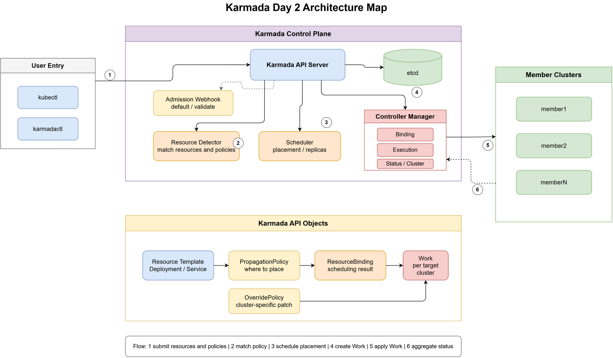
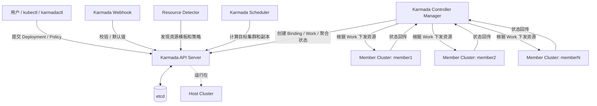
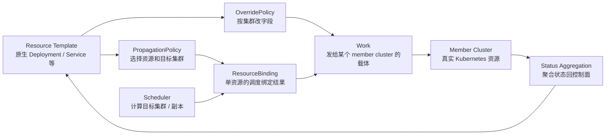
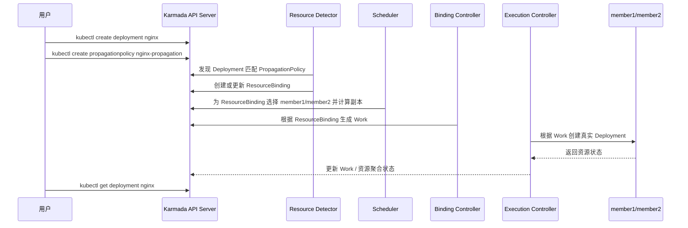
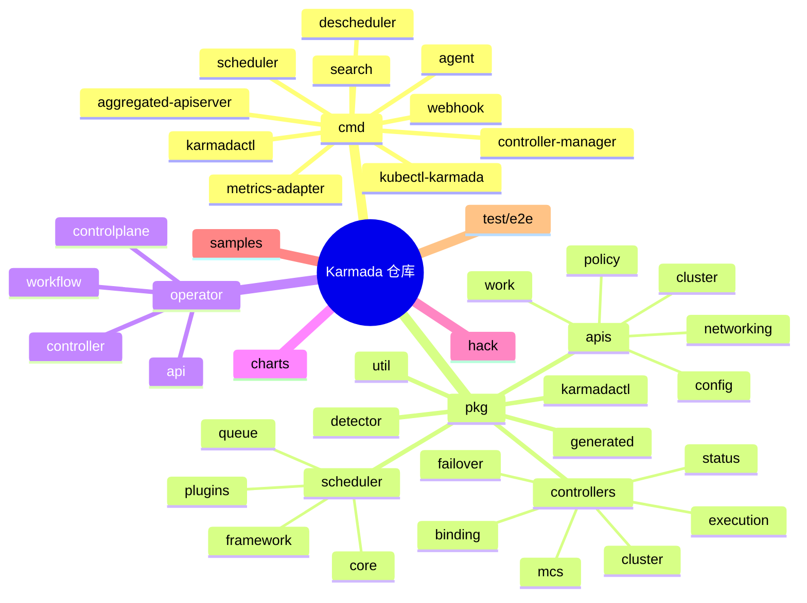

# Day 2：Karmada 项目理解和源码地图

日期：2026-06-29

## 今日目标

我是第一次系统接触 Karmada，只具备大概的 Kubernetes 概念。今天的目标不是深读某一个控制器，而是先建立一张“不会迷路”的项目地图：

- 先回答 Karmada 解决什么问题。
- 再把 README 中的架构概念翻译成 Kubernetes 初学者能理解的模型。
- 最后把核心概念映射到本仓库的源码目录，知道后续该从哪里继续读。

本次没有运行本地 Karmada 集群，也没有验证真实 member cluster 上的资源效果；结论主要来自 README、samples 和源码入口。

## 可视化产出

- PNG 预览：[day2-karmada-architecture.png](day2-karmada-architecture.png)
- draw.io 原生嵌入版 PNG：[day2-karmada-architecture.drawio.png](day2-karmada-architecture.drawio.png)
- draw.io 原生 SVG：[day2-karmada-architecture.drawio.svg](day2-karmada-architecture.drawio.svg)
- draw.io 可编辑源文件：[day2-karmada-architecture.drawio](day2-karmada-architecture.drawio)

## 阅读证据

| 证据 | 看到的内容 | 对理解的帮助 |
| --- | --- | --- |
| `README.md:20` | Karmada 让应用跨多个 Kubernetes 集群和云运行，并尽量不要求修改应用本身 | 明确项目定位：多集群 Kubernetes 编排 |
| `README.md:64` | 控制面包含 Karmada API Server、Controller Manager、Scheduler | 建立第一层架构 |
| `README.md:77` | Execution Controller 监听 Work 并分发资源到 member clusters | 确认 Work 是下发到成员集群的关键对象 |
| `README.md:82`、`README.md:84`、`README.md:88` | Resource template、PropagationPolicy、OverridePolicy 的定义 | 建立传播策略和差异化配置模型 |
| `samples/nginx/deployment.yaml` | 用户仍然提交普通 `apps/v1 Deployment` | Karmada 兼容 Kubernetes 原生资源心智 |
| `samples/nginx/propagationpolicy.yaml` | `PropagationPolicy` 选择 `member1`、`member2`，并配置副本分配 | 理解“放到哪里”和“怎么分副本” |
| `samples/nginx/overridepolicy.yaml` | `OverridePolicy` 可按目标集群修改 label/annotation | 理解“同一个资源在不同集群可以有差异” |
| `cmd/controller-manager/app/controllermanager.go` | controller-manager 注册 cluster、binding、execution、status 等控制器 | 从二进制入口映射到控制器实现 |
| `pkg/detector/detector.go` | `ResourceDetector` 监听资源和 policy 变化 | 解释“用户提交普通资源后，Karmada 怎么发现它” |
| `pkg/scheduler/scheduler.go` | Scheduler 调度 binding，并输出目标集群结果 | 解释“调度器在哪里做放置决策” |
| `pkg/controllers/binding/binding_controller.go` | ResourceBinding controller 将 binding 同步成 Work | 解释“调度结果如何变成下发任务” |
| `pkg/controllers/execution/execution_controller.go` | execution controller 将 Work 同步到目标集群 | 解释“Work 如何落到 member cluster” |

> 注释：Kubernetes 里常见的 controller 模式是“监听对象变化，然后不断 reconcile 实际状态”。Karmada 仍然沿用这个模式，只是它监听的不止一个集群，并且多了一层“把资源模板转成跨集群 Work”的过程。

## 一句话理解 Karmada

Karmada 可以先粗略理解为：在一个 Kubernetes 风格的控制面里保存用户的应用和多集群策略，再通过调度器和控制器，把这些应用分发到多个真实 Kubernetes 成员集群，并把状态聚合回来。

它不是替代 Kubernetes 单集群调度器去调 Pod 到 Node，而是在更高一层决定“这个 Deployment / Service / 其他资源应该出现在哪些集群，以及每个集群应该是什么版本或副本数”。

## 架构总览

> 分析：这张图是入门视角，不是完整生产部署图。真实项目里还有 aggregated-apiserver、agent、descheduler、search、metrics-adapter、scheduler-estimator、operator 等组件；但第一天理解传播主链路时，可以先抓住 API Server、Controller Manager、Scheduler、member clusters。

## 核心对象关系

Karmada 的资源传播链路可以先记成这一条线：

关键区别：

- `Resource Template`：用户熟悉的 Kubernetes 原生资源，例如 `Deployment`。
- `PropagationPolicy`：决定资源要传播到哪些集群，调度和副本策略也在这里表达。
- `OverridePolicy`：决定同一个资源在不同集群里如何差异化，例如 label、annotation、镜像、StorageClass。
- `ResourceBinding` / `ClusterResourceBinding`：Karmada 对“某个资源应该放到哪里”的中间结果。
- `Work`：真正面向 member cluster 的下发任务。README 明确写到 execution controller 监听 Work 并分发资源。

> 注释：不要把 `PropagationPolicy` 理解成“直接把资源推过去的脚本”。它更像声明式配置：用户表达期望，控制器和调度器异步推进后续对象。

## 从 nginx 样例理解传播

`samples/nginx` 是最适合入门的第一条链路：

样例里的 `PropagationPolicy` 指定：

- 资源选择器匹配 `apps/v1`、`Deployment`、`name: nginx`。
- 目标集群是 `member1` 和 `member2`。
- 副本调度类型是 `Divided`，并使用相同权重 `1:1`。

因此初步理解是：用户写的还是普通 `Deployment`，Karmada 额外用 policy 决定这个 Deployment 要在哪些集群出现。

## 源码目录地图

对后续阅读最重要的目录：

| 目录 | 作用 | 下一步读法 |
| --- | --- | --- |
| `cmd/` | 各个二进制入口 | 先看对应 `app/*.go` 如何组装 option、client、controller |
| `pkg/apis/` | Karmada 自定义 API 类型 | 先看 `policy`、`work`、`cluster` 三组 |
| `pkg/detector/` | 发现资源模板与 policy 匹配关系 | Day 3 追 nginx 链路时重点读 |
| `pkg/controllers/binding/` | binding 到 Work 的转换 | 连接调度结果和下发任务 |
| `pkg/controllers/execution/` | Work 到 member cluster 资源的同步 | 理解资源真正落集群的位置 |
| `pkg/controllers/status/` | Work / Binding / Cluster 状态聚合 | 理解为什么 control plane 能看到聚合状态 |
| `pkg/scheduler/` | 多集群调度逻辑 | 后续单独做 Day 5 深读 |
| `pkg/karmadactl/` | Karmada CLI 命令实现 | 适合找文档、help、测试补充类贡献点 |
| `operator/` | 用 CR 管理 Karmada 控制面安装生命周期 | 和 `karmadactl init` 是不同安装入口 |
| `test/e2e/` | 端到端行为测试 | 找真实用户场景和回归测试入口 |

## 当前确认的组件职责

| 组件 / 对象 | 初学者解释 | 源码入口 |
| --- | --- | --- |
| Karmada API Server | 像 Kubernetes API Server 一样保存 Karmada 对象 | `cmd/aggregated-apiserver/`、`pkg/aggregatedapiserver/` |
| Controller Manager | 多个控制器的集合，负责推进状态 | `cmd/controller-manager/app/controllermanager.go`、`pkg/controllers/` |
| Scheduler | 给 Binding 选择目标集群和副本分配 | `cmd/scheduler/`、`pkg/scheduler/` |
| Resource Detector | 监听普通资源和 policy，建立传播关系 | `pkg/detector/` |
| Binding Controller | 把 Binding 同步成 Work | `pkg/controllers/binding/` |
| Execution Controller | 把 Work 同步到 member cluster | `pkg/controllers/execution/` |
| Status Controller | 汇总 Work、Binding、Cluster 状态 | `pkg/controllers/status/` |
| Agent | pull 模式下运行在 member cluster 侧的组件 | `cmd/agent/`、`pkg/controllers` 中部分 pull/push 相关逻辑后续再读 |
| Webhook | 对 Karmada API 做默认值和校验 | `cmd/webhook/`、`pkg/webhook/` |
| Operator | 通过 operator 管理 Karmada 控制面 | `operator/` |
| karmadactl | 初始化、join、register、addons 等 CLI | `cmd/karmadactl/`、`pkg/karmadactl/` |

## 我现在的心智模型

如果把 Kubernetes 单集群类比成“一个城市内部调度交通”，Karmada 更像“多个城市之间的统一调度中心”。它不直接替代 member cluster 内部的 kube-scheduler，而是决定应用资源应该进入哪些城市，然后每个城市内部仍由原生 Kubernetes 继续调度 Pod 到 Node。

更工程化地说：

1. 用户面向 Karmada API Server 提交原生 Kubernetes 资源和 Karmada policy。
2. Karmada 在控制面生成 Binding，表示资源和目标集群之间的关系。
3. Scheduler 更新 Binding 里的目标集群和副本分配。
4. Binding controller 根据 Binding 生成一个或多个 Work。
5. Execution controller 把 Work 中的 manifest 应用到 member cluster。
6. Status controller 或相关同步逻辑把 member cluster 的实际状态聚合回 Karmada 控制面。

## 今天遇到的卡点

| 卡点 | 现象 | 处理 |
| --- | --- | --- |
| draw.io CLI 路径误判 | `drawio --version`、`draw.io --version` 和 `C:\Program Files\draw.io\draw.io.exe --version` 都不可用；后续诊断发现 draw.io 实际安装在 `C:\Users\ranxi\AppData\Local\Programs\draw.io\draw.io.exe`，版本 `30.2.6`，只是未加入 PATH | 已用用户级安装路径重新导出 PNG/SVG；以后在 Windows 上应优先检查 `%LOCALAPPDATA%\Programs\draw.io\draw.io.exe` |
| 尚未运行 Quick Start | 没有执行 `hack/local-up-karmada.sh`，也没有真实 kubeconfig/context 证据 | 本文不声称本地集群已启动，只记录源码和文档理解 |
| README 概念和当前源码命名不完全一一对应 | README 提到 policy controller，但当前源码里重点入口是 `pkg/detector`、scheduler、binding/execution controllers | 报告中区分“概念链路”和“源码入口”，后续 Day 3 再追具体 reconcile |

## 后续最小行动

1. Day 3 深追 `samples/nginx`：从 `Deployment` + `PropagationPolicy` 到 `ResourceBinding`、`Work`、member cluster manifest。
2. 读 `pkg/detector/detector.go` 的 `ReconcilePropagationPolicy` 和资源匹配逻辑。
3. 读 `pkg/controllers/binding/common.go` 的 `ensureWork`，确认 Work 的命名、namespace 和 manifest 生成规则。
4. 读 `pkg/controllers/execution/execution_controller.go` 的 `syncToClusters`，确认 push 模式下如何操作 member cluster。
5. 在环境允许时再运行 `hack/local-up-karmada.sh`，把本文的概念链路和真实对象状态对齐。
