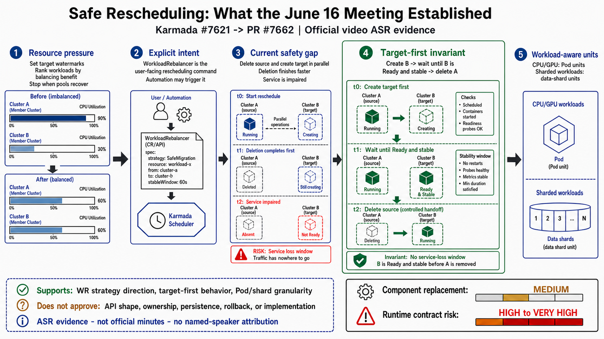

# Day 22：2026-06-16 Karmada 社区会议重调度讨论文字稿

日期：2026-07-15

来源：[Karmada Bi-Weekly Meeting(Asia) for 20260616](https://www.youtube.com/watch?v=i-YL8mHKWWg&t=891s)

目标片段：视频绝对时间 `14:51-24:51`

## 一页结论

这 10 分钟录像为 #7621 / proposal PR #7662 补上了会议音频证据：社区讨论明确把 `WorkloadRebalancer` 视为用户显式下发重调度意图的入口，并提出可以在其上叠加迁移等策略；讨论也直接指出当前重调度可能同时删除 source、创建 target，而删除通常更快，会造成服务受损，因此提出了“A 保留到 B 完全 OK 后再删除”的 target-first 方向。

这提高了 #7662 总体架构方向的可信度，但不等于 proposal 已获批准。录像没有确认具体 API、executor 接口、持久化状态、并发 ownership、GracefulEviction 关系或兼容性合同，也没有授权实现。它最强地支持的是问题和行为不变量，不是当前 720 行设计的每个实现细节。

后续会议证据见 [Day 23：2026-06-30 #7662 全量转录与对齐](day23-pr7662-meeting-2026-06-30-transcript-and-alignment.md)。第二场视频总长 `57:08`，不是本报告第一场中的 10 分钟目标片段。

## 会议信息图

- [原始生成提示词](day22-karmada-meeting-rescheduling-infographic-prompt.md)
- [第一次文字校正提示词](day22-karmada-meeting-rescheduling-infographic-correction-prompt.md)
- [最终 API 字段校正提示词](day22-karmada-meeting-rescheduling-infographic-final-correction-prompt.md)

最终图由 `$gpt-image-draw` / `gpt-image-2` 原生生成，固定 16:9 档 `1672x941`，全部使用英文标签。首图把 WR 示例误写为 `policy: reschedule` 并显示了多余分隔符；第一次参考图编辑改为 `strategy: SafeMigration`，最终再对照 proposal 把不存在的用户字段 `unit` 改为真实字段 `stableWindow: 60s`。最终 PNG 已按原始分辨率检查，标题、五段流程、证据边界和风险等级没有裁切或重叠；没有使用代码贴字或其他模型。

## 证据等级与边界

本文把内容标记为 `ASR/官方录像证据`，不是官方会议纪要，也不是 maintainer consensus。

- 官方录像没有人工字幕或 YouTube 自动字幕。
- 使用本地 `faster-whisper large-v3-turbo` 转录，语言固定为中文；目标片段在 NVIDIA GPU 上完成。
- 主转录覆盖完整 10 分钟；末尾 80 秒因长音频上下文出现越界幻觉，另行使用 `condition_on_previous_text=False` 和 Karmada 专有词提示重跑。超过实际音频长度的生成内容已丢弃。
- 本文校正明显同音词，例如“鸡群”为“集群”、“玉子”为“阈值”、“从教度”为“重调度”、“卡巴达/卡玛达”为 `Karmada`、“被 over”为 `failover`、“轨弄更新”为“滚动更新”。
- 标点、重复口头语和无意义停顿已清理，但没有改变可辨识的技术含义。
- 没有执行说话人分离，不把任何一句录音自动归因给具体 maintainer。下文“提问/需求说明”和“回应”只是根据上下文整理的对话角色。
- `PDB` 一词由 ASR 识别为“PUB”，结合“防护机制”上下文校为“疑似 PDB-like”，仍保留不确定标记。
- 片段在 `24:51` 处截断，最后一句没有完整收录。

> 注释：会议录像可以证明某个问题和方向在会议中被讨论过；只有明确的真人 review、`/lgtm`、`/approve`、合并记录或可核验 action item，才能进一步证明 proposal 获得社区接受。

## 时间索引

| 视频时间 | 内容 |
| --- | --- |
| `14:51-17:43` | 资源池水位、应用收益排序、CPU/GPU/多分片 workload、Pod 与 shard 迁移粒度 |
| `17:43-19:19` | 社区既有自动重调度尝试及当前保守原则；迁移属于高风险动作 |
| `19:19-21:33` | 当前 WorkloadRebalancer 只是显式 Fresh trigger；可在其上叠加策略和自动化输入 |
| `21:33-22:53` | 当前 source 删除与 target 创建可能同时发生，删除更快会损害服务 |
| `22:53-23:26` | 类似滚动更新的 target-first：B 完全 OK 后再删除 A |
| `23:26-24:14` | 多分片按 shard、GPU workload 按 Pod 滚动；疑似全集群级 PDB-like 防护 |
| `24:14-24:51` | Karmada 跨集群滚动更新计划与本需求是否一致仍待确认 |

## 清理版文字稿

### `14:51-15:12`：资源池背景与选择问题

需求说明：在两个独立的资源池中，每个池子里有多个集群。

提问：你们怎么选择搬迁哪些应用？

### `15:12-16:03`：按水位收益选择应用

回应：如果一个集群的水位到了阈值，目前的想法是，先设定一个期望的水位目标，然后对要迁的资源池中的应用做排序。排序依据是把这个应用搬过去之后会有怎样的水位收益，先模拟演算一遍，选择收益最大的应用。

如果搬迁这个应用已经能够满足期望的水位目标，两个集群都下降到某个水位以下，就不再做后续应用的搬迁操作。

### `16:03-17:43`：workload 类型与迁移单元

提问：这里可能还有其他考虑。要搬的应用有没有优先级设定？这些集群上都是同类型应用，还是也有其他类型？

需求说明：在线 workload 有普通 CPU 应用，也有 GPU 应用。从线上数据看，资源的大头是多分片应用。例如一些在线索引类应用数据量很大，一个 Pod 放不下，需要把数据分片，每个 Pod 保留一部分数据。这类 workload 占用的资源特别大，可能约 10% 的应用规模占了约 50% 的资源量。

每个 workload 的特征不一样。普通 CPU 或 GPU 应用可以按 Pod 维度迁移；多分片应用会按一个分片一个分片的维度迁移，一个分片也对应一个底层 CR。

### `17:43-19:19`：为什么 Karmada 对自动迁移保守

提问：社区以前有过这类场景吗？

回应：社区有人讨论过，但在 Karmada 里没有把它做成一种自动化能力。很早以前调度器尝试过一些自动重调度方法，现在逐步变成了更稳健的策略：调度决策做完之后，调度器尽量不要自发腾挪这些 workload。

即使用户需要调度器做自动调度，例如集群故障时进行迁移，也只在用户收益很明显时做。比如 failover 功能默认关闭，需要显式开启。这体现了一个判断：集群搬迁是危险、高风险的，而且不一定成功，所以调度器不应该主动做这些事情。

### `19:19-21:33`：沿 WorkloadRebalancer 叠加策略

回应：真正有重调度场景时，社区有 `WorkloadRebalancer`，这是一个尝试。希望提供一个显式入口，让用户能够显式触发重调度。

当前重调度做得比较浅，只是触发调度器忽略之前的调度结果，进行新一轮调度。后面有新的重调度诉求时，可以再叠加更丰富的重调度策略。这个场景就是一个比较典型的重调度场景。

初步想法是可以在 `WorkloadRebalancer` 上叠加可指定的重调度策略，例如迁移。调度器收到请求后按照指示重调度，并不一定完全忽略之前的调度结果。当然，这只是初步想法。

Karmada 社区目前希望沿着 `WorkloadRebalancer` 这条路做重调度。它可以认为是用户下发重调度指令的手段；这个手段之上仍然可以叠加自动化，例如此处一词不清的周期/潮汐类 Rebalancer，或者由其他自动化输入源决定触发。

### `21:33-22:53`：当前重调度的服务受损窗口

提问：目前社区的 `WorkloadRebalancer` 在稳定性方面，是不是触发以后原来的 workload 会直接下掉，再重新走一遍调度？

回应：对。现在的 `WorkloadRebalancer` 可能仍然选到原集群，重调度没有效果；也可能选到另一个集群。如果选到另一个集群，它会同时做两件事：从原集群删除，在新集群创建。

这个过程中删除往往更快，重建要拉镜像、启动，速度更慢。一般无法接受这种情况，服务相当于受损。

### `22:53-23:26`：target-first 方向

回应：可以从其他角度考虑。在重调度场景中，能不能做成优雅的、类似滚动更新的效果？Karmada 调度器可以做出从 A 调到 B 的决策，但 A 是否可以再保留一段时间，等 B 完全 OK 后再删除？这也是一种实现。

### `23:26-24:14`：滚动粒度与多集群保护

需求说明：滚动还要考虑粒度。多分片应用只能按一个 data shard 的维度滚动。GPU 应用通常把卡分配得比较满，没有很多额外资源，只能按一个 Pod 一个 Pod 的维度滚动。

字节这类场景似乎做了一个全集群级别、疑似 PDB-like 的防护机制，可以在整个多集群维度做滚动升级。Karmada 社区以前有过类似思考吗？

### `24:14-24:51`：跨集群滚动更新仍需对齐

回应：我不清楚你说的具体是什么，如果有链接可以发来看看。你提到 Karmada 的滚动更新，Karmada 今年想做跨集群滚动更新，但我不知道它和这个要求是否一致。不同公司对滚动更新有不同做法；这里说的是能看到的 Karmada 用户真实使用场景。

片段到此结束，后续一句未完整收录。

## 对 #7662 的新增含义

| 会议证据 | 对 #7662 的含义 | 证据边界 |
| --- | --- | --- |
| WorkloadRebalancer 是显式重调度入口 | proposal 把 strategy execution 放在 WR controller 上，组件位置与会议初步方向一致 | 不代表当前 API 和 executor 拆分已获批准 |
| 可在显式入口之上叠加自动化输入 | #7662 作为 execution primitive、把水位选择留给外部 decision layer 的 scope 有依据 | 录像没有设计自动水位、冷却或防振荡合同 |
| 当前 source 删除与 target 创建同时发生，删除更快 | SafeMigration 不是普通优化，而是在修复已明确讨论的服务连续性缺口 | 录像没有说明应 patch Binding、Work，还是复用 GracefulEvictionTask |
| 等 B 完全 OK 后再删 A | target-first 是明确行为不变量，应成为 proposal 和测试的主验收条件 | “完全 OK”的 readiness、freshness、stable window 和 traffic takeover 都未定义 |
| shard 与 Pod 的迁移粒度不同 | 可插拔 `MigrationUnitExecutor` 的抽象动机成立 | unit identity、CR ownership、checkpoint 和 partial commit 仍未定义 |
| 调度器不应主动搬迁高风险 workload | 显式 opt-in、清楚的 operation owner、失败恢复和审计状态是必要合同 | 不能据此断言所有自动触发都应放进 scheduler 或 WR controller |

> 分析：#7662 在 2026-06-23 创建，晚于这次 2026-06-16 讨论。proposal 的 SafeMigration story 与会议提出的 target-first、按 workload unit 迁移高度吻合，但“proposal 是对会议 action item 的正式实现”仍只是合理推断，公开纪要没有记录该 action item。

## 对现有系统的颠覆度校准

| 维度 | 颠覆度 | 判断 |
| --- | --- | --- |
| 组件分工 | 中 | 方向上是在现有 WR、scheduler、Binding、Work 链路外增加长事务编排，不要求替换 scheduler 核心 |
| API 与状态合同 | 高 | WR 从一次性 trigger 变成长生命周期 operation，status、TTL、cancel、default 和旧客户端语义都会变化 |
| 调度并发与 ownership | 很高 | SafeMigration 与 scheduler、failover、policy update 可能同时写 Binding；没有 single-writer 或互斥合同就不能安全实现 |
| member workload 生命周期 | 很高 | target-first 改变 source/target Work 的创建删除顺序，还要处理 readiness、stable window、restart 和 partial commit |
| workload 扩展面 | 高 | Deployment、Pod、shard/partition 的迁移单元不同，需要 CR-specific executor 和稳定 identity |
| 自动水位决策 | 低（本 PR） | 会议讨论了资源池水位和收益排序，但 #7662 把“何时迁、迁谁、迁到哪”留在 execution layer 之外 |

总体不是“推翻 Karmada 调度器”，而是把当前很浅的 trigger 升级为跨组件、可恢复的迁移事务。架构替换幅度是中等，运行时安全合同和实现风险是高到很高。最危险的做法是把三个 user stories 一次性落成一个大型实现 PR；更稳妥的顺序仍是先确认 API/ownership/state persistence，再分别落 compatibility、scheduler contract 和 SafeMigration state-machine 测试切片。

## 本地转录产物

以下文件位于仓库忽略的 `_tmp/`，用于复核，不进入 upstream topic branch：

- `_tmp/youtube-transcribe/i-YL8mHKWWg-full.m4a`
- `_tmp/youtube-transcribe/i-YL8mHKWWg-14m51s-24m51s.wav`
- `_tmp/youtube-transcribe/i-YL8mHKWWg-23m31s-24m51s.wav`
- `_tmp/youtube-transcribe/large-v3-turbo/i-YL8mHKWWg-14m51s-24m51s.srt`
- `_tmp/youtube-transcribe/large-v3-turbo/i-YL8mHKWWg-14m51s-24m51s.txt`

本机用户级 skill 安装在 `C:\Users\ranxi\.codex\skills\whisper-transcribe`；Python 3.12 环境在 `C:\Users\ranxi\.codex\venvs\whisper-transcribe`；本地模型在 `C:\Users\ranxi\.codex\models\faster-whisper-large-v3-turbo`。skill 来源为 GitHub `azuma520/youtube-to-notebooklm` 仓库中的 `skills/whisper-transcribe`，许可证为 MIT。新的 Codex 会话启动后才会刷新 skill 目录并显示该能力。
