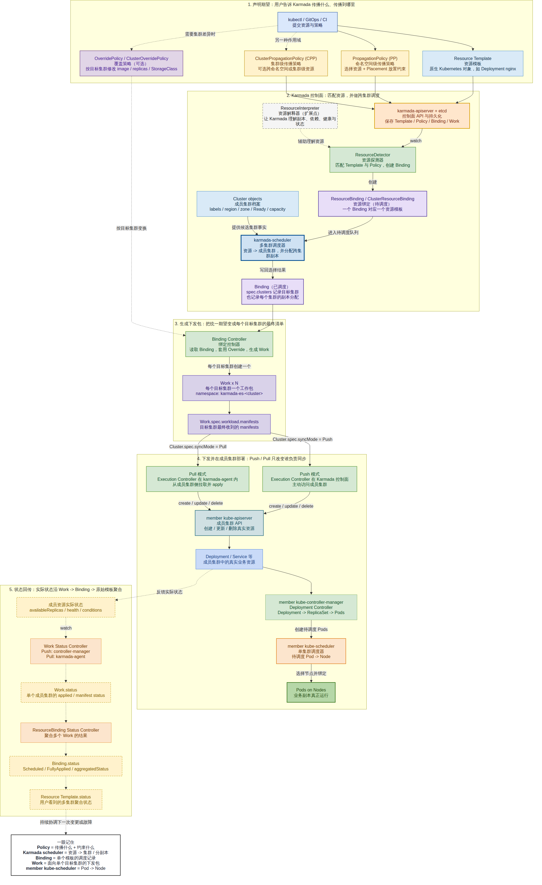

# Day 24：Karmada 资源传播、部署与调度组件详解

日期：2026-07-16

## 目标

用一张本地中文学习图回答三个问题：

1. `PropagationPolicy` 到底是什么，它和资源模板是什么关系？
2. Karmada 如何从一个 Deployment 得出目标集群和每个集群的副本数？
3. Karmada 调度与成员集群内的 Kubernetes 调度分别做到哪一步？



可编辑与可缩放版本：

- [draw.io 源文件](day24-karmada-resource-propagation-scheduling-components.drawio)
- [Mermaid 源文件](day24-karmada-resource-propagation-scheduling-components.mmd)
- [SVG 矢量图](day24-karmada-resource-propagation-scheduling-components.svg)
- [PNG 预览图](day24-karmada-resource-propagation-scheduling-components.png)

> 注释：仓库默认要求新图使用英文。这张图是用户明确要求的本地中文学习材料，不用于 upstream PR、issue 或社区会议。

## 先记住一条主链

```text
Resource Template + PropagationPolicy
  -> ResourceDetector
  -> ResourceBinding（待调度）
  -> karmada-scheduler
  -> ResourceBinding（已写入目标集群）
  -> Binding Controller
  -> Work（每个目标集群一个）
  -> Execution Controller / karmada-agent
  -> member kube-apiserver
  -> Deployment Controller
  -> member kube-scheduler
  -> Pods on Nodes
```

反向状态链是：

```text
成员资源实际状态 -> Work.status -> Binding.status -> Resource Template.status
```

## 核心名字与中文含义

| 英文名 | 可以先理解成 | 它回答的问题 |
| --- | --- | --- |
| Resource Template | 资源模板 | “要部署什么？”它不是 Karmada 专用 CRD，而是 Deployment、Service 等原生对象 |
| PropagationPolicy | 命名空间级传播策略 | “选中哪些同 namespace 资源，允许放到哪些集群，如何分副本？” |
| ClusterPropagationPolicy | 集群级传播策略 | “是否需要跨 namespace 选择，或传播 cluster-scoped 资源？” |
| Placement | 放置约束 | “目标集群必须满足哪些 affinity、spread、replica scheduling 条件？” |
| OverridePolicy | 差异化覆盖策略 | “同一模板到某个集群后，哪些字段要改？” |
| ResourceDetector | 资源探测器 | “哪个资源匹配了哪个传播策略？”匹配后创建 Binding |
| ResourceBinding | 资源绑定/调度记录 | “这个 namespaced 模板被调度到哪些集群、每处多少副本？” |
| ClusterResourceBinding | 集群资源绑定 | 与 ResourceBinding 类似，但对应 cluster-scoped 资源模板 |
| Cluster object | 成员集群档案 | scheduler 可用的集群 label、region、zone、Ready、capacity 等事实 |
| karmada-scheduler | 多集群调度器 | “资源去哪些集群、跨集群副本怎么分？”不负责选择 Node |
| Binding Controller | 绑定控制器 | “如何把调度结果和 override 变成每个集群的最终 Work？” |
| Work | 单集群下发包 | “这个目标集群最终应收到哪些 manifests？”通常每个目标集群一个 |
| Execution Controller | 执行控制器 | “如何把 Work 中的 manifests create/update/delete 到成员集群？” |
| karmada-agent | Pull 模式代理 | 在成员集群侧运行 Execution Controller，拉取 Work 并本地 apply |
| member kube-controller-manager | 成员集群控制器 | Deployment Controller 根据 Deployment 创建 ReplicaSet 和 Pods |
| member kube-scheduler | 单集群调度器 | “一个待调度 Pod 应绑定到本集群哪个 Node？” |
| Work/Binding Status Controller | 状态控制器 | “如何把成员集群实际状态逐层聚合回用户看到的模板状态？” |
| ResourceInterpreter | 资源解释器 | “Karmada 如何理解某种资源的副本、依赖、健康和聚合语义？” |

## `PropagationPolicy` 具体在说什么

仓库的 `samples/nginx/propagationpolicy.yaml` 可以拆成两半：

```yaml
apiVersion: policy.karmada.io/v1alpha1
kind: PropagationPolicy
metadata:
  name: nginx-propagation
spec:
  resourceSelectors:              # 传播什么
    - apiVersion: apps/v1
      kind: Deployment
      name: nginx
  placement:                      # 传播到哪里、如何分副本
    clusterAffinity:
      clusterNames: [member1, member2]
    replicaScheduling:
      replicaDivisionPreference: Weighted
      replicaSchedulingType: Divided
```

因此，`PropagationPolicy` 本身既不是 Deployment，也不是一次“同步命令”。它是保存在 Karmada API 中的声明式策略：

- `resourceSelectors` 选择传播对象；
- `placement.clusterAffinity` 限定候选集群；
- `placement.spreadConstraints` 可限制跨 region、zone 或 cluster 的分布；
- `placement.replicaScheduling` 可描述多集群副本分配方式；
- 真正创建 Binding、调度、生成 Work 和下发资源的是后续控制器与 scheduler。

## 五个最容易混淆的边界

### 1. Policy 不是调度结果

Policy 是用户输入的规则，Binding 才是针对一个具体资源模板计算出来的记录。可以把它们理解成“规则”与“本次计算结果”。

### 2. Karmada scheduler 不把 Pod 放到 Node

Karmada scheduler 的决策层级是 `资源 -> 集群`；member kube-scheduler 的决策层级是 `Pod -> Node`。两者都叫 scheduler，但输入、输出和运行位置不同。

### 3. Binding 不是 Work

Binding 面向调度，记录集群选择和副本分配；Work 面向执行，封装一个目标集群最终收到的 manifests。Binding Controller 位于两者之间。

### 4. Push 与 Pull 不改变上半段调度语义

两种模式都经过 Policy、Binding、scheduler 和 Work。区别只在执行位置：Push 由 Karmada 控制面访问成员集群；Pull 由成员集群内的 `karmada-agent` 拉取并 apply。

### 5. `ResourceDetector` 与旧称 `Policy Controller`

当前源码中的核心实现名是 `ResourceDetector`，位于 `pkg/detector/`。部分较早的概览仍用 Policy Controller 描述“匹配资源与策略”的职责；读源码时应以 `ResourceDetector` 为入口，避免误以为还存在一个同名独立实现。

## 源码核对入口

| 责任 | 源码入口 |
| --- | --- |
| PP/CPP API 与 Placement | `pkg/apis/policy/v1alpha1/propagation_types.go` |
| 匹配资源与策略、创建 Binding | `pkg/detector/detector.go` |
| Binding API | `pkg/apis/work/v1alpha2/binding_types.go` |
| Work API | `pkg/apis/work/v1alpha1/work_types.go` |
| Binding -> Work | `pkg/controllers/binding/` |
| Work -> member resource | `pkg/controllers/execution/` |
| Work/Binding 状态聚合 | `pkg/controllers/status/` |
| Pull 模式 agent | `cmd/agent/app/agent.go` |

## 绘图记录

宿主机没有可执行的 draw.io CLI，但已有 AgentCube 创建的 `agentcube-drawio-pr431` 容器，内含 draw.io `30.3.11`。通过 `docker cp` 输入 Mermaid 源文件并在容器内转换为可编辑 `.drawio` 和嵌入式 SVG。容器的直接 PNG 导出返回 `Empty export data`，因此 PNG 是用本机 Chromium 对最终 SVG 做的无裁切栅格化预览；SVG 和 draw.io 文件仍是主交付物。
