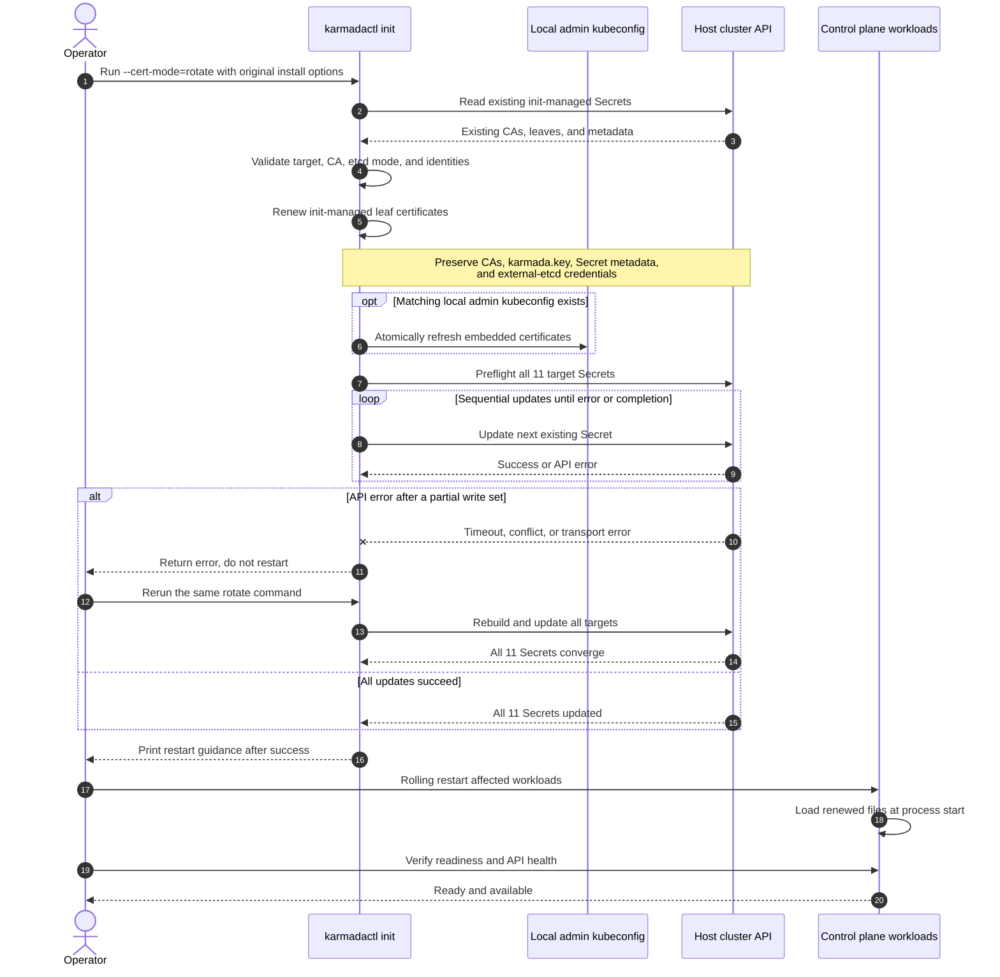

# Day 26: PR #7697 Targeted Certificate Rotation Fixes

Date: 2026-07-17

## Context

PR [karmada-io/karmada#7697](https://github.com/karmada-io/karmada/pull/7697) adds `karmadactl init --cert-mode=rotate`. A second full review of head `3d1bc25b094f4d93caca37db1384618351e01896` confirmed that the main direction is sound, but found three certificate identity and trust-boundary problems that should be fixed before requesting human approval.

These are ordinary recovery-path risks, not mock-only or deliberately invalid-input cases. They can break API endpoint verification, silently mix credentials between real clusters, or make the control plane unable to reach external etcd after restart.

## Problem 1: Rotation Can Drop Persisted SANs

`buildInitCertConfigs()` reconstructs SANs from the current flags, current control-plane node IPs, and `utils.InternetIP()` on the machine executing rotation. It does not read SANs from the existing leaf certificates.

Concrete failure: installation on machine A automatically records A's public IP in `apiserver.crt`; after expiry, an administrator runs rotation from machine B with all original explicit flags. The renewed certificate can replace A's implicit IP with B's IP. Clients that still use A's endpoint then fail hostname/IP verification after component restart.

The recovery path also becomes dependent on a third-party Internet-IP request even though the old certificate already persists the required identity.

### Fix

- Keep install-time Internet-IP discovery unchanged.
- Build rotation configs without querying the current execution host's Internet IP.
- Merge the existing `karmada.crt` SANs into the renewed karmada certificate config.
- Merge the existing `apiserver.crt` SANs into the renewed apiserver certificate config.
- For internal etcd, merge the existing `etcd-server.crt` SANs before signing the renewed server certificate.
- Treat current explicit flags and topology as additive inputs; never silently remove an existing DNS/IP SAN during renewal.

## Problem 2: CA Equality Is Not Cluster Identity

`refreshLocalAdminKubeconfigIfExists()` currently checks only whether the local kubeconfig CA equals the selected remote `karmada-cert` Secret CA.

Concrete failure: clusters A and B share one enterprise CA but have different `karmada.key` values. Rotation targets B through the host kubeconfig while the default local data path contains A's admin kubeconfig. The CA check passes, A's server URL is retained, and B's renewed `CN=system:admin, O=system:masters` credential is written into that file. Because both clusters trust the same CA and authorize the same subject, the mixed kubeconfig may authenticate successfully instead of failing closed.

### Fix

- Continue checking CA certificate DER equality.
- Load the local kubeconfig client certificate from embedded data or its referenced relative/absolute file.
- Compare its `RawSubjectPublicKeyInfo` with the renewed target `karmada.crt` public key before rewriting the file.
- This identity is stable because rotation intentionally preserves `karmada.key`.
- On mismatch, fail before changing the local file or any Secret.

## Problem 3: External Etcd Contract Allows Credential Replacement

The PR says root CAs are preserved and the first version renews init-managed leaves. However, the external-etcd path accepts arbitrary replacement CA/client files and copies them into Secrets. The current positive test even replaces the old external-etcd CA/client tuple with a different one.

This is a control-plane availability boundary. A wrong external-etcd trust root or client pair takes effect after restart and can disconnect the API server from its data store.

### Fix

Adopt a preserve-only contract for the first version:

- Parse and validate the existing external-etcd CA and client certificate/key pair.
- Preserve the existing Secret bytes on every successful rotation.
- Permit replaying external-etcd file flags only when the supplied files parse to the same existing CA and client certificate identity.
- Reject a different CA or client credential before local or remote mutation, with an error explaining that external-etcd credential rotation is outside `cert-mode=rotate` scope.
- Do not add CA migration, external credential rollout, or automatic restart to this PR.

## Current and Proposed Flow

```text
Current rotate
runCertRotate
  -> build config from current environment
  -> load Secrets and sign leaves
  -> compare local kubeconfig CA only
  -> optionally replace external-etcd credentials
  -> write local kubeconfig, then update Secrets

Proposed rotate
runCertRotate
  -> load existing certificate Secrets
  -> build deterministic rotation config
  -> merge persisted serving-certificate SANs
  -> validate local CA and stable client public key
  -> validate external-etcd files equal existing credentials
  -> write local kubeconfig, then update Secrets
```

## File Scope

| File / area | Change | Reason | Test coverage |
| --- | --- | --- | --- |
| `pkg/karmadactl/cmdinit/kubernetes/deploy.go` | Split the shared config builder internally | Preserve install behavior while omitting execution-host Internet-IP lookup during rotation | Existing install tests and cmdinit package tests |
| `pkg/karmadactl/cmdinit/kubernetes/cert_rotation.go` | Add persisted SAN merge and identity/credential validation | Repair the three certificate and trust-boundary defects | Focused positive, negative, and no-mutation regressions |
| `pkg/karmadactl/cmdinit/kubernetes/deploy_test.go` | Add regressions | Prove the invariants and failure ordering | Focused tests, package tests, full CLI suite |

## Explicit Non-Goals

- No API/config type or generated flag documentation change.
- No CA generation or `pkg/karmadactl/cmdinit/cert` redesign.
- No Secret name, key, or workload template change.
- No CA rotation or `caBundle` migration.
- No automatic workload restart or runtime certificate reload.
- No Helm, operator, cert-manager, or Certificate Framework integration.
- No cross-Secret transaction or rollback state machine in this repair.

## Function Design

- Keep `buildInitCertConfigs()` as the install wrapper. Add a private builder option used only by rotation to omit `InternetIP()`.
- Create rotation configs only after loading the existing `karmada-cert` Secret. Use newly allocated SAN slices and canonical IP strings when merging to avoid aliasing and duplicates.
- Load and merge internal-etcd SANs only after confirming the existing installation is internal etcd.
- Add a kubeconfig certificate loader parallel to the CA loader, supporting embedded and referenced certificate data.
- Reuse parsed-certificate DER/public-key comparisons rather than raw PEM formatting comparisons.
- Parse existing external-etcd client certificate/key bytes as a pair. Supplied client files must also form a valid pair and identify the same certificate.

## Regression Matrix

| Scenario | Expected result |
| --- | --- |
| Old karmada/apiserver SAN exists only in the persisted leaf | Renewed corresponding leaf retains it |
| Old internal-etcd SAN reflects more replicas than current flags | Renewed etcd server leaf retains it |
| Rotation runs from a different/offline machine | No execution-host Internet-IP identity is needed; old SANs remain |
| Local kubeconfig and target share a CA but use different karmada keys | Error; local bytes and all Secrets unchanged |
| Local kubeconfig references a matching relative client certificate file | Identity check succeeds; refreshed credential is embedded as before |
| External-etcd paths replay the existing tuple | Success; existing bytes remain unchanged |
| External-etcd paths provide a different CA or client credential | Error before any mutation |
| Existing external-etcd client certificate/key is malformed or mismatched | Error before any mutation |

## Validation Plan

Run in this order:

1. New focused rotation regressions.
2. `go test ./pkg/karmadactl/cmdinit/... -count=1`.
3. `go test ./pkg/karmadactl/... ./cmd/karmadactl/... ./cmd/kubectl-karmada/... -count=1`.
4. Targeted `golangci-lint` for cmdinit.
5. Command-line flag and import-alias verifiers.
6. `git diff --check` and a final source/diff review.

No push, PR body edit, thread resolution, comment, or reviewer request is authorized by this implementation task.

## Work Log

### 2026-07-17: Design and first implementation pass

- Created this Day 26 record as the only new progress entry for the repair; the previously written Day 13 report was left unchanged.
- Changed only the three files in the scope matrix under `/home/karmada`.
- Kept install-time `InternetIP()` discovery behind the existing `buildInitCertConfigs()` path and disabled it only for rotation.
- Implemented persisted SAN merge for `karmada.crt`, `apiserver.crt`, and internal `etcd-server.crt`.
- Added local kubeconfig client-public-key binding after the existing CA check.
- Changed external etcd from replacement to preserve-only semantics, with parsed certificate and key-pair validation.
- Added focused regressions for SAN preservation, same-CA/different-key kubeconfigs, relative client certificate paths, matching external-etcd flag replay, and rejected external credential replacement.
- Ran `gofmt` and `git diff --check`; both passed.
- Ran the first focused test set: `go test ./pkg/karmadactl/cmdinit/kubernetes -run 'TestCommandInitOption_runCertRotate(PreservesExistingServingCertificateSANs|RefreshesExistingLocalAdminKubeconfig|RejectsLocalAdminKubeconfigFromAnotherCluster|RejectsLocalAdminKubeconfigWithDifferentClientIdentity|WithExistingExternalEtcdCerts|WithExternalEtcdCertFiles|RejectsExternalEtcdCredentialReplacement)$' -count=1`; passed in `59.755s`.

Current status: implementation is local and uncommitted. Broader package/CLI validation and final diff review remain. Nothing has been pushed or posted upstream.

### 2026-07-17: Validation and final local review

Focused and broad validation completed:

- All rotation entry-point tests passed: `go test ./pkg/karmadactl/cmdinit/kubernetes -run '^TestCommandInitOption_runCertRotate' -count=1` (`135.486s`).
- The complete cmdinit suite passed: `go test ./pkg/karmadactl/cmdinit/... -count=1`; `cmdinit/kubernetes` completed in `148.686s`.
- The broad CLI suite passed: `go test ./pkg/karmadactl/... ./cmd/karmadactl/... ./cmd/kubectl-karmada/... -count=1`; `cmdinit/kubernetes` completed in `232.872s` and both CLI command packages exited successfully.
- `hack/verify-command-line-flags.sh` passed with generated docs unchanged.
- `hack/verify-import-aliases.sh` passed.
- Final `git diff --check` passed.

The first lint run found two `gocyclo` failures: `prepareExternalEtcdCertAndKeyData` and `refreshLocalAdminKubeconfigIfExists` both reached complexity 18 with a limit of 15. The repair extracted external-etcd credential consistency checks and local kubeconfig target-identity checks into small contract-specific helpers. After the refactor, `PATH="$(go env GOPATH)/bin:$PATH" golangci-lint run ./pkg/karmadactl/cmdinit/...` passed with `0 issues`. Focused regressions were rerun after the refactor and passed in `43.690s`.

The test helper was then tightened to preserve the original leaf CN, organization, and extended-key usages while changing only key/SAN material. This makes the shared-CA regression model the real `CN=system:admin, O=system:masters` case instead of a weaker synthetic subject. The affected SAN and shared-CA tests passed again in `18.742s`; final lint remained at `0 issues`.

Final source diff in `/home/karmada`:

| File | Additions | Deletions |
| --- | ---: | ---: |
| `pkg/karmadactl/cmdinit/kubernetes/cert_rotation.go` | 159 | 35 |
| `pkg/karmadactl/cmdinit/kubernetes/deploy.go` | 12 | 5 |
| `pkg/karmadactl/cmdinit/kubernetes/deploy_test.go` | 164 | 8 |
| Total | 335 | 48 |

Counterfactual review confirms the new regressions are meaningful against the previous implementation:

- The SAN test would fail because the previous rotation builder never read old leaf SANs.
- The shared-CA/different-key test would fail because the previous guard accepted CA equality and rewrote the kubeconfig.
- The external-etcd replacement tests would fail because the previous implementation accepted and stored a different CA/client tuple.

Final local status: the implementation and validation are complete, but the three source files remain uncommitted on `feature/cert-mode-rotate`. This Day 26 report is untracked on `intern`. No commit, push, PR body edit, thread resolution, comment, or reviewer request has been performed. A live-cluster expiry test was not repeated for this local delta; the prior live test proves the general expiry/restart recovery chain, while the new identity invariants are covered by focused certificate and no-mutation regressions.

### 2026-07-17: Amend and upstream-facing branch update

After the user approved the exact push action, the three-file repair was amended into the existing single signed-off commit on `/home/karmada:feature/cert-mode-rotate`.

- Old head and exact force-with-lease value: `3d1bc25b094f4d93caca37db1384618351e01896`.
- New head: `4328591b02004717e97e40abd537133b1d08f8cf` (`feat: support rotating init-managed certificates`).
- The commit still contains `Signed-off-by: ranxi2001 <ranxi2001@users.noreply.github.com>`.
- Push target: `ranxi2001/karmada:feature/cert-mode-rotate`, which is the upstream-facing head branch for `karmada-io/karmada#7697`.
- Push command used an explicit lease for the old SHA and completed as `3d1bc25b0...4328591b0 (forced update)`.
- No PR body, title, comment, thread, label, or reviewer request was changed.

GitHub post-push verification:

- PR #7697 is open, has one commit, and reports head `4328591b02004717e97e40abd537133b1d08f8cf`.
- The fork branch resolves to the same SHA and the local source worktree is clean.
- DCO completed successfully.
- Fork push workflows started for exact SHA `4328591b0`: CI Workflow `29553109146`, Chart `29553109140`, CLI `29553109182`, and Operator `29553109130`; FOSSA and image-scanning were skipped by workflow rules.
- Upstream PR check runs also started for the same SHA. At the first post-push snapshot, lint/codegen and Kubernetes matrix jobs were queued or in progress with no failures.

Latest status: the source repair is committed and pushed to PR #7697. CI is pending and must be checked again before requesting human review or changing the PR body/threads.

### 2026-07-17: Post-push full re-review of PR #7697

Review surface:

- Exact head: `4328591b02004717e97e40abd537133b1d08f8cf`, one signed-off commit, 10 files, `+1988/-27`.
- Current base: `upstream/master@1f07b77c35ccac02501a4d0cd4f0bb525d26b887`; the PR is 11 base commits behind.
- None of the 11 newer base commits changes a PR path. `git merge-tree --write-tree upstream/master upstream/pr-7697` succeeded with tree `6045f6b0ca8db1b2dddc105e6fbf3a334447c6f2`, so there is no current merge conflict.
- Read the complete PR body, issue #7693, umbrella proposal #7690, all 10 changed files, surrounding init/certificate consumers, all conversation comments, all line comments, and all reviews.
- Human state: `@zhzhuang-zju` assigned the PR, `prodanlabs` and `Tingtal` are requested reviewers, but no human code/design review has been submitted. Existing reviews are Gemini/Copilot only.
- Thread state: 16 unresolved bot threads, of which 11 still anchor to current lines and 5 are outdated. Their requested doc/error/metadata/mode-switch changes are present in current code; this is review-hygiene debt rather than an open implementation defect.

#### Re-review findings

No new blocking code finding was identified. The three previous blockers are closed at source and regression-test level:

1. Rotation calls `buildCertConfigs(false)` and unions persisted SANs from `karmada.crt`, `apiserver.crt`, and internal `etcd-server.crt`; the execution host's `InternetIP()` is now install-only.
2. Local kubeconfig refresh requires both CA DER equality and `RawSubjectPublicKeyInfo` equality with the renewed target client certificate. The same-CA/different-key regression fails before local or Secret mutation.
3. External-etcd rotation now preserves the existing CA/client bytes, parses the existing and supplied certificate material, validates the client pair, and rejects a different tuple before mutation.

The regression counterfactual is meaningful: the old implementation would drop the persisted-only SANs, accept the same-CA/different-key kubeconfig, and store replacement external-etcd credentials.

Two reviewer-facing items remain before asking for `lgtm`:

- **Validation evidence is stale in the PR body.** It still says all 17 checks passed on `4b6fa135f`. That tree predates the targeted repair and is no longer tree-equivalent to current head. Update this line only after current-head CI finishes, or remove the dynamic SHA/check count.
- **External-etcd preserve-only behavior is under-documented.** The code rejects a renewed external-etcd client certificate even when the operator reuses the same file paths. This is consistent with the chosen first-version boundary because external credentials are user-provided rather than issued by `karmadactl`, but the current help/body only says “init-managed leaves” and does not state the operational consequence. Before merge, explicitly say that `cert-mode=rotate` preserves external-etcd CA/client credentials and they must be rotated separately. This is a contract/documentation gap, not evidence that CA migration should be added to this PR.

Additional residual risks remain non-blocking:

- The local kubeconfig write still precedes the all-Secret preflight, and the 11 Secret updates are sequential. Mixed states remain cryptographically compatible because the CA and `karmada.key` are stable; rerun convergence is still not covered by an injected Nth-update failure test.
- Atomic kubeconfig replacement preserves mode bits but not custom owner/group, ACLs, or xattrs.
- Rotation preserves old SANs additively and has no explicit prune operation. This favors recovery compatibility but can retain retired identities until a future deliberate removal workflow exists.
- The current command help/synopsis still presents `init` primarily as installation; a dedicated user guide remains the appropriate follow-up for backup, external-etcd, restart, and version-skew procedures.
- A new live-cluster expiry run was not performed for `4328591b0`; the earlier live run proves the overall expiry/rotate/restart chain, while the new identity guards are covered by focused unit regressions.

#### Validation snapshot

- Local exact-head broad tests, cmdinit lint, flag/import verifiers, and diff checks passed before push.
- A fresh package coverage run passed: `go test ./pkg/karmadactl/cmdinit/kubernetes -coverprofile=/tmp/pr7697-review-cover.out -count=1` in `152.202s`, with `66.5%` package statement coverage.
- Critical rotation functions have direct coverage: SAN merge `100%`, `runCertRotate` `88.9%`, external-etcd preparation `81.8%`, external client validation `82.4%`, kubeconfig refresh `82.4%`, and CA lifetime validation `94.4%`. Codecov's aggregate `62.60%` patch number therefore does not by itself identify an uncovered correctness boundary.
- At the review snapshot, exact-head upstream checks were 14 success and 3 e2e jobs in progress; fork Chart/CLI/Operator were success and fork CI Workflow remained in progress. No current-head failure was present.

Current assessment: `CODE_REVIEW_READY`, pending exact-head e2e completion, a concise PR-body contract/evidence update, and bot-thread cleanup before human review. No source change or upstream action was performed during this re-review.

### 2026-07-17: External-etcd contract documentation repair

The re-review identified a user-facing contract gap rather than another rotation implementation defect. In external-etcd mode, rotation deliberately preserves the existing CA and client credential bytes and rejects replacement credentials. The `--cert-mode` help did not state that consequence, so an operator could update externally managed files at stable paths, replay the original flags, and receive a rejection without having seen the preserve-only boundary in the command documentation.

The local repair in `/home/karmada:feature/cert-mode-rotate` changes only three files:

| File | Purpose |
| --- | --- |
| `pkg/karmadactl/cmdinit/cmdinit.go` | State that rotate mode preserves external-etcd CA/client credentials and that they must be rotated separately. |
| `pkg/karmadactl/cmdinit/cmdinit_test.go` | Keep the user-facing contract covered by the existing `cert-mode` flag test. |
| `docs/command-line-flags/karmadactl_init.md` | Regenerated flag reference; only the `--cert-mode` help line changed. |

Validation for this documentation delta:

- `go test ./pkg/karmadactl/cmdinit -count=1` passed.
- `PATH="$(go env GOPATH)/bin:$PATH" golangci-lint run ./pkg/karmadactl/cmdinit` passed with `0 issues`.
- `hack/verify-command-line-flags.sh` reported the generated docs up to date.
- `git diff --check` passed.

The PR body also needs to stop presenting the 17 checks on `4b6fa135f` as current-head evidence. The candidate below removes dynamic CI counts, narrows the local validation claim to commands rerun for this delta, states the external-etcd contract in both scope and release-note text, and distinguishes the earlier live-cluster test from current-head validation.

<!-- pr7697-body-start -->

````md
**What type of PR is this?**

/kind feature

**What this PR does / why we need it**:

This PR adds certificate rotation to `karmadactl init` through `--cert-mode=rotate` and `spec.certMode: rotate`.

Rotation reuses existing CA material to renew init-managed leaf certificates, refreshes a matching local admin kubeconfig, and updates existing certificate/config Secrets. The default `install` path is unchanged. Root CAs, Secret metadata, and `karmada.key` (the ServiceAccount signing key) are preserved.

Operators must reuse options consistent with the original installation. External etcd CA and client credentials are preserved and must be rotated separately. Restart the affected components after rotation.

**Which issue(s) this PR fixes**:

Fixes #7693

**Special notes for your reviewer**:

- Safety/scope: rotation validates CA/key usage and lifetime and preflights target Secrets. It rejects missing Secrets, CA mismatches, and etcd mode changes; it does not rotate CAs or external-etcd credentials, update `caBundle` fields, or restart workloads. Secret updates are sequential rather than transactional.
- Validation: `go test ./pkg/karmadactl/cmdinit -count=1`, targeted cmdinit lint, and `hack/verify-command-line-flags.sh` passed locally. Earlier kind validation renewed expired 10-minute leaf certificates and verified `/readyz`, APIService availability, and a pre-rotation ServiceAccount token after restart; focused unit tests cover the later identity guards.
- AI assistance: Codex helped inspect the code and draft tests/text; I reviewed the changes and validation results.

**Does this PR introduce a user-facing change?**:

```release-note
`karmadactl init`: Added `--cert-mode=rotate` to renew init-managed leaf certificates. External etcd CA and client credentials are preserved and must be rotated separately. Restart the affected components after rotation.
```
````

<!-- pr7697-body-end -->

Current local status: the three-file documentation repair and this Day 26 entry are uncommitted. No source commit, push, PR body edit, thread resolution, comment, label, or reviewer request has been performed.

### 2026-07-17: Local amend prepared for approval

The three-file repair was amended locally into the existing signed-off commit after validation:

- Remote PR head and required force-with-lease value remain `4328591b02004717e97e40abd537133b1d08f8cf`.
- New local head is `5b110b2e41c836a2d5efbceb46fbf70162dfd38d`.
- The incremental old-to-new diff is exactly 3 files, `+9/-3`; the full PR remains one commit and 10 changed files.
- `Signed-off-by: ranxi2001 <ranxi2001@users.noreply.github.com>` is present.
- The source worktree is clean. `origin/feature/cert-mode-rotate` still resolves to the old head, so GitHub PR #7697 has not changed.
- The candidate PR body measures 248 reviewer-visible words and 16 nonblank lines, within the 250-word soft budget.

No push, PR body edit, thread resolution, comment, label, or reviewer request has been performed. The next upstream-facing actions require approval of the exact force-with-lease update and full PR body text.

### 2026-07-17: Documentation repair pushed and PR body updated

After the user approved both exact upstream-facing actions:

- Force-with-lease updated `ranxi2001/karmada:feature/cert-mode-rotate` from `4328591b02004717e97e40abd537133b1d08f8cf` to `5b110b2e41c836a2d5efbceb46fbf70162dfd38d`.
- GitHub PR #7697 reports the same new head, and the local source worktree is clean.
- The PR body was replaced with the approved 248-word, 16-nonblank-line candidate above. A post-update machine comparison confirmed an exact match.
- The stale `4b6fa135f` check-count claim is gone. External-etcd preserve-only behavior is now stated in the summary, reviewer scope, release note, command help, generated flag documentation, and regression test.
- DCO passed for the new head. At the first post-push snapshot, lint, codegen, and the Chart/CLI/Operator Kubernetes matrix jobs were in progress with no failure reported.
- No review thread, comment, label, title, reviewer request, or other PR metadata was changed.

Current status: both approved upstream-facing actions are complete. New-head CI is running. This Day 26 report remains local and uncommitted on `intern`; it has not been pushed.

### 2026-07-17: Business and website contract review remediation

Reviewing the feature against issue #7693, the reusable init-configuration contract, ordinary company operations, and the website certificate/HA positioning exposed one merge-blocking API design problem and two release-level follow-ups.

#### Code changes

- Removed `spec.certMode` from `KarmadaInitConfig`. Certificate rotation is now selected only by the explicit one-shot `--cert-mode=rotate` CLI flag.
- Removed the config parser assignment that could overwrite the CLI-selected operation after Cobra flag parsing.
- Returned `pkg/karmadactl/cmdinit/config/types.go` and `config_test.go` exactly to the base tree, reducing the full PR from 10 changed files to 8.
- Changed `TestParseInitConfig` to start with CLI-selected rotate mode and verify that loading reusable installation parameters does not change that operation.
- Added a production-reachable partial-failure regression: the fake Kubernetes API returns a timeout on the final webhook Secret update after the other ten Secret updates have succeeded. The next `runCertRotate` call succeeds and every one of the 11 Secrets is compared against the final generated certificate/config set.

The timeout injection models a real Kubernetes API boundary that can return timeout, conflict, throttling, or transport errors. It is not evidence that a particular timeout was observed in production, and it does not add retry branches or rollback state to product code. Its purpose is to prove the documented operator recovery action: do not restart after a failed run; rerun rotation until the full update succeeds.

#### Validation

- Focused rotation and convergence tests passed in `17.896s`.
- `go test ./pkg/karmadactl/cmdinit/config -count=1` passed.
- `go test ./pkg/karmadactl/... ./cmd/karmadactl/... ./cmd/kubectl-karmada/... -count=1` passed; `cmdinit/kubernetes` completed in `190.136s`.
- `PATH="$(go env GOPATH)/bin:$PATH" golangci-lint run ./pkg/karmadactl/cmdinit/...` passed with `0 issues`.
- `hack/verify-command-line-flags.sh`, `hack/verify-import-aliases.sh`, and `git diff --check` passed.

The validated changes were amended locally into the existing signed-off commit:

- Remote PR head and lease value: `5b110b2e41c836a2d5efbceb46fbf70162dfd38d`.
- New local head: `bf24e47ce3bdecc9771b99fe85ac082253496a87`.
- Incremental old-to-new diff: 4 files, `+45/-9`; two of those files are removals that make them identical to the base tree.
- Full PR diff: 8 files, `+2031/-28`, one signed-off commit.

#### Release gates outside this code change

- Coordinate rather than duplicate the active manual-guide work under `karmada-io/website#1014`. Before release, the website should distinguish automatic agent renewal from manual `karmadactl init` control-plane leaf renewal and document backup, scope, external-etcd handling, restart order, health checks, and rerun recovery.
- Treat HA maintenance validation as release/runbook evidence: rotate before expiry on a replicated control plane, restart in a documented rolling order, and continuously probe control-plane availability. This is not authorization to add automatic rollout code to PR #7697.
- No website edit, issue/PR comment, thread resolution, reviewer request, or other upstream action was performed during this remediation.

The updated PR body candidate removes the configuration-file operation claim and records partial-update convergence without presenting dynamic CI counts.

<!-- pr7697-body-v2-start -->

````md
**What type of PR is this?**

/kind feature

**What this PR does / why we need it**:

This PR adds certificate rotation to `karmadactl init` through `--cert-mode=rotate`.

Rotation reuses existing CA material to renew init-managed leaf certificates, refreshes a matching local admin kubeconfig, and updates existing certificate/config Secrets. The default `install` path is unchanged. Root CAs, Secret metadata, and `karmada.key` (the ServiceAccount signing key) are preserved.

Operators must reuse options consistent with the original installation. External etcd CA and client credentials are preserved and must be rotated separately. Restart the affected components after rotation.

**Which issue(s) this PR fixes**:

Fixes #7693

**Special notes for your reviewer**:

- Safety/scope: rotation validates CA/key usage and lifetime, preflights target Secrets, and rejects missing or mismatched state and etcd mode changes. It does not rotate CAs or external-etcd credentials, update `caBundle` fields, or restart workloads. Secret writes are sequential; reruns converge after a partial API timeout.
- Validation: `go test ./pkg/karmadactl/... ./cmd/karmadactl/... ./cmd/kubectl-karmada/... -count=1`, cmdinit lint, and flag/import verifiers passed locally. Focused tests cover identity guards and partial-update rerun convergence; earlier kind validation confirmed expired-leaf recovery after restart.
- AI assistance: Codex helped inspect the code and draft tests/text; I reviewed the changes and validation results.

**Does this PR introduce a user-facing change?**:

```release-note
`karmadactl init`: Added `--cert-mode=rotate` to renew init-managed leaf certificates. External etcd CA and client credentials are preserved and must be rotated separately. Restart the affected components after rotation.
```
````

<!-- pr7697-body-v2-end -->

Current status: implementation, validation, local amend, and PR body v2 preparation are complete. The source worktree is clean. The new commit and body have not been pushed or posted; the `intern` report remains local and uncommitted.

### 2026-07-17: CLI-only operation contract pushed

After approval of both exact upstream-facing actions:

- Force-with-lease updated `ranxi2001/karmada:feature/cert-mode-rotate` from `5b110b2e41c836a2d5efbceb46fbf70162dfd38d` to `bf24e47ce3bdecc9771b99fe85ac082253496a87`.
- PR #7697 reports the same head and now has 8 changed files, `+2031/-28`.
- The PR body was replaced with the approved 239-word, 16-nonblank-line v2 candidate. A post-update machine comparison confirmed an exact match.
- The body no longer advertises `spec.certMode`; it records CLI-only rotation selection and partial-update rerun convergence.
- DCO passed. At the first post-push snapshot, lint, codegen, and the Chart/CLI/Operator Kubernetes matrix jobs were in progress with no reported failure.
- No review thread, comment, label, title, reviewer request, website artifact, or other PR metadata was changed.

Current status: the configuration-contract repair and convergence evidence are pushed, the PR body matches the new source contract, and new-head CI is running. The source worktree is clean. This Day 26 report remains local and uncommitted on `intern`; it has not been pushed.

### 2026-07-17: Outdated data-flow comment replacement prepared

The existing scope comment at [PR #7697 comment 4851795706](https://github.com/karmada-io/karmada/pull/7697#issuecomment-4851795706) was last updated on 2026-07-09. Its static data-flow image and prose predate the final CLI-only operation contract and do not show the sequential 11-Secret update boundary or rerun recovery after a partial API failure.

A sequence diagram is a better fit because the reviewer must track five actors and the order of validation, local-file mutation, Secret preflight/write, failure recovery, restart, and health verification. The canonical source is `day26-pr7697-certificate-rotation-sequence.mmd`; the directly viewable export is `day26-pr7697-certificate-rotation-sequence.png`.

Source grounding:

- `runCertRotate` prepares renewed data, optionally refreshes a matching local admin kubeconfig, updates Secrets, and prints restart guidance.
- `buildCertAndKeyData` builds eight kubeconfig Secrets plus etcd, karmada, and webhook certificate Secrets: 11 targets in total.
- `updateCertAndKeySecret` preflights all target Secret metadata before issuing sequential API updates.
- The focused timeout regression proves the documented operator recovery: an error after a partial write set returns without restart; rerunning the same command converges all 11 Secrets.

Rendering evidence:

- The first Mermaid CLI render rejected `Return error; do not restart` because the semicolon was parsed as a statement separator. The label was changed to `Return error, do not restart`.
- The corrected source rendered successfully with the official pinned `@mermaid-js/mermaid-cli@11.16.0` through the project renderer's `npx` backend.
- The PNG was inspected at original resolution: all five participants, 20 numbered messages, optional local-file path, failure/recovery branch, and success/restart path are visible without clipping or overlap.
- The PNG export is 1450 x 1449 pixels. A mechanical diff confirmed that the inline `sequenceDiagram` body below exactly matches the canonical `.mmd` source.
- The complete replacement has 268 visible words and 42 nonblank lines because Mermaid source is reviewer-visible. The prose outside the diagram is 87 words across five nonblank lines; the visualization is justified by actor and lifecycle ordering rather than prose length.

The proposed edit replaces the entire old comment so stale review prompts and the static image do not remain beside the current contract.

<!-- pr7697-comment-4851795706-v2-start -->

````md
Updated to match the current PR contract. This replaces the earlier static data-flow image with the operator-visible sequence, including recovery after a partial Secret update.



Contract at this head:

- Rotation is selected only by the explicit `--cert-mode=rotate` CLI flag; `--config` can still provide reusable installation parameters.
- CAs, `karmada.key`, Secret metadata, and external-etcd credentials are preserved.
- On an API update failure, rerun before restarting. The command does not rotate trust roots or external credentials, update `caBundle` fields, restart workloads, or add an automatic lifecycle controller.
````

<!-- pr7697-comment-4851795706-v2-end -->

After the user approved the exact target and full replacement text, GitHub issue comment `4851795706` was edited in place at `2026-07-17T07:47:46Z`.

- The comment URL and author are unchanged.
- The old `user-attachments` image reference is absent and the inline `mermaid` / `sequenceDiagram` block is present.
- A byte-level comparison using the GitHub API body with no output-added newline matched the approved Day 26 draft exactly.
- No other comment, review thread, PR field, label, title, or reviewer request was changed.

### 2026-07-17: Runtime-validation comment refresh prepared

The next author comment, [PR #7697 comment 4853917542](https://github.com/karmada-io/karmada/pull/7697#issuecomment-4853917542), was created on 2026-07-01 and has never been edited. Its core rotate-then-restart conclusion and kind result remain valid, but its 573-word design recap duplicates the preceding sequence comment and omits the final CLI-only, external-etcd preserve-only, and partial-update rerun contracts.

The replacement keeps the historical kind evidence while distinguishing it from current-head unit coverage. It deliberately contains no second diagram because the preceding comment now owns the operator sequence. After compression, the draft has 165 visible words and 10 nonblank lines.

<!-- pr7697-comment-4853917542-v2-start -->

````md
Updated for current head `bf24e47ce`; the runtime test below predates its later safety guards.

### Current contract

- Rotation is an explicit one-shot CLI operation selected by `--cert-mode=rotate`.
- It renews init-managed leaves and updates a matching local admin kubeconfig plus 11 existing Secrets while preserving existing CAs, persisted SANs, `karmada.key`, and Secret metadata.
- External-etcd CA and client credentials are preserved and must be rotated separately.
- Secret writes are sequential; after an API update failure, rerun before restarting.
- It adds no expiry controller, automatic rotation or restart, hot-reload guarantee, CA migration, or `caBundle` update.

### Validation boundary

Earlier kind validation used a three-node host cluster and two push-mode member clusters. After 10-minute leaf certificates expired, rotation to `8760h` plus component restarts restored all control-plane Pods to `Running`, both members to `Ready=True`, and `v1alpha1.cluster.karmada.io` to `Available=True`; CAs remained unchanged.

Current-head unit regressions cover cluster identity, SAN/metadata/external-etcd preservation, and partial-update rerun convergence. The kind run validates the rotate-then-restart recovery sequence, not every current-head guard.
````

<!-- pr7697-comment-4853917542-v2-end -->

After the user approved the exact target and full replacement text, GitHub issue comment `4853917542` was edited in place at `2026-07-17T07:57:28Z`.

- The GitHub API body matched the approved Day 26 draft byte for byte.
- The old `Design intent` long-form section is absent; `Current contract` and `Validation boundary` are present.
- The comment URL and author are unchanged.
- No other comment, review thread, PR field, label, title, or reviewer request was changed.

### 2026-07-17: Intern push snapshot

- PR #7697 and the source worktree remain at clean head `bf24e47ce3bdecc9771b99fe85ac082253496a87`.
- The latest check-run snapshot is 14 success, one failure, and two in progress.
- The failure is [`e2e test (v1.35.0)` job 87832263874](https://github.com/karmada-io/karmada/actions/runs/29563506143/job/87832263874); `e2e test (v1.34.0)` and `e2e test (v1.36.1)` are still running.
- No failure log classification has been completed, so this record does not attribute the failure to the PR or label it a flake.
- The next loop must inspect the first hard failure and compare the other matrix results before changing code, rerunning CI, cleaning review threads, or requesting human review.
