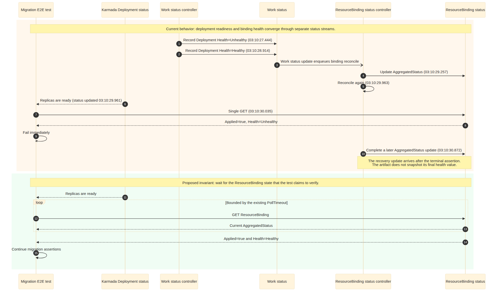
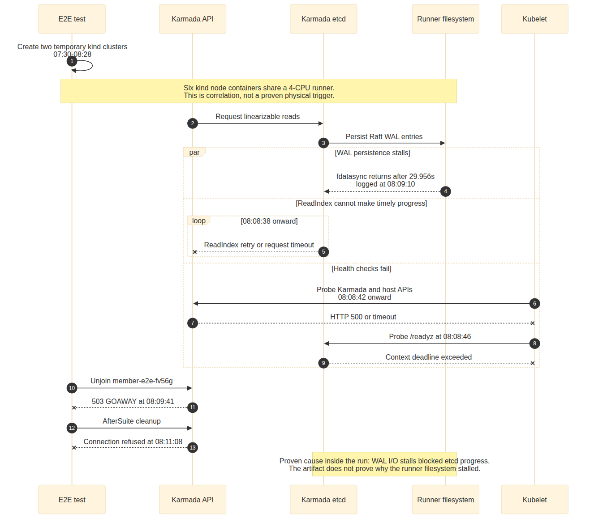
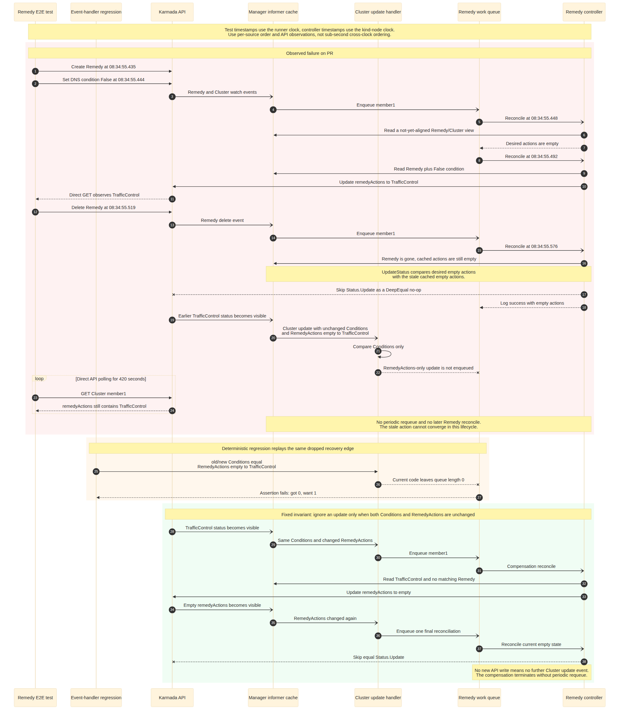

# Day 27：可通过 PR 消除的 CI Flake 候选与 #7697 E2E RCA

- 日期：`2026-07-17`
- 候选范围：Day 11 至 Day 27 已确认与原 PR 代码无关的 Karmada CI flakes
- 深入分析对象：[`karmada-io/karmada#7697`](https://github.com/karmada-io/karmada/pull/7697) head `bf24e47ce3bdecc9771b99fe85ac082253496a87`
- 原始 CI：[`run 29563506143`](https://github.com/karmada-io/karmada/actions/runs/29563506143)，attempt 1
- 同 SHA 复测：同一 run 的 attempt 2，由 [`/retest` comment 5001143200](https://github.com/karmada-io/karmada/pull/7697#issuecomment-5001143200) 触发；v1.35、v1.36 均通过
- 详细日志目录：`/tmp/pr7697-e2e-bf24e47-29563506143`
- 快照后交叉验证：[`#7777`](https://github.com/karmada-io/karmada/pull/7777) head `3861906f2c3c51ec57eca114b71bff883d135fa3` 的 [`run 29581580350`](https://github.com/karmada-io/karmada/actions/runs/29581580350)，其中 [`v1.35 job 87889887276`](https://github.com/karmada-io/karmada/actions/runs/29581580350/job/87889887276) 再次出现多个 etcd 的 persistence I/O stall

> 注释：本报告只记录 Day 27 新分析，不回写 Day 11 或 Day 26。Day 11 的原统计窗口和分母保持不变，Day 26 继续记录 #7697 代码与 review 进展。

## 一页结论

1. `2026-07-10` 至当前快照共有 83 个 upstream PR `CI Workflow` run objects；严格排除代码错误和 mixed runs 后，23 个 runs、29 个 failed jobs 被归为 PR flake，覆盖 18 个 PR。
2. 两个候选均已在独立 fork branch 完成最小实现：Remedy 两文件修复达到局部 E4，并已发布 [`#7776`](https://github.com/karmada-io/karmada/issues/7776) 与 [`#7777`](https://github.com/karmada-io/karmada/pull/7777)；migration 一文件同步屏障完成 package compile；两条 fork branch 的 v1.34/v1.35/v1.36 E2E matrix 均通过。
3. FlinkDeployment/APIEnablements flake 已由 [`#7732`](https://github.com/karmada-io/karmada/pull/7732) 修复并合并，列为 `DONE`，不重复开 PR。
4. 本窗口剩余 25 个 flake jobs 只能证明与被测 PR diff 无关，尚不能收敛为一个可消除根因的改动，列为 `NEEDS_RCA`；不能用 timeout、通用 retry 或业务层防御分支填补证据空白。
5. PR #7697 attempt 1 的 v1.35 与 v1.36 是两个互不相关的失败。v1.35 已证明 `etcd WAL fdatasync stall -> raft/ReadIndex stall -> API 不健康 -> FRQ cleanup 失败`，但 runner 文件系统停顿的物理诱因仍只有 E2；v1.36 已证明 Remedy stale-cache no-op 与事件过滤共同造成永久不收敛。
6. 同 SHA `/retest` 转绿只证明 manifestation 具有非确定性，不撤销 Remedy 的 E3 根因，也不构成继续等待的理由。Remedy 修复已作为独立 issue #7776、PR #7777 推进，没有混入证书 PR #7697。
7. 统计快照后的 #7777 v1.35 红灯不是 Remedy 修复失效：并行阶段先因控制面不可用 fail-fast，Serial Remedy spec 未执行；Karmada、host Kubernetes、member3 三个独立 etcd 在同一时间窗出现 `slow fdatasync`，把该样本归入既有 control-plane / etcd collapse 簇。

## 可开 PR 的 Flake 候选清单

Day 27 的产出门槛不是“确认多少红灯属于 flake”，而是“哪些 flake 已有足够证据设计一个能切断根因的 PR”。按 `READY / DONE / NEEDS_RCA` 重新分类如下：

| 优先级 | Flake 簇 | 跨窗口证据 | 证据等级 | 解决性 PR 状态 | 下一步 |
| --- | --- | --- | --- | --- | --- |
| P0 | Remedy action cleanup 不收敛 | 历史 #5323；Day 11、#7770、#7697 三条新样本 | E4：旧 predicate 下 regression 失败，修复后通过；三版本 fork E2E 通过 | [`#7776`](https://github.com/karmada-io/karmada/issues/7776) / [`#7777`](https://github.com/karmada-io/karmada/pull/7777) 已发布 | 等待 review；upstream v1.35 红灯按独立 I/O stall 分类，不修改 Remedy patch |
| P1 | migration ResourceBinding health 一次性断言 | #7718 一条，但日志完整记录异步状态顺序 | E3；真实失败保留，package compile 与三版本 fork E2E 通过 | `FORK_CI_GREEN` | 准备独立 flake issue/PR exact text，获取用户确认后再发布 |
| DONE | FlinkDeployment/APIEnablements 跨用例残留 | Day 11 两条；本窗口 #7745 一条合并前样本 | E3；维护者接受 causal patch | [`#7732`](https://github.com/karmada-io/karmada/pull/7732) 已合并 | 归档，不重复实现 |
| HOLD | control-plane / etcd / aggregated API collapse | 本窗口 16 jobs，多 PR、多 Kubernetes matrix；包含 #7723 restart-check；快照后另有 #7777 v1.35 | collapse 链可到 E3；#7777 三个独立 etcd 同窗 stall 强化共同 host 假设，但物理 trigger 仍仅 E2 | `NEEDS_RCA` | 先取得 runner host I/O、pressure、container exit 与磁盘证据，再决定 CI harness 还是环境修复 |
| HOLD | temporary member cluster / test-harness lifecycle | 本窗口 9 jobs，包含 kubeadm、overlay、join/unjoin、node readiness、setup | 目前多为 E1，且失败入口异质 | `NEEDS_RCA` | 按 exact first failure 拆簇；只有同一 producer/recovery gap 重复后才设计 PR |

> 分析：`READY_FOR_IMPLEMENTATION` 表示已经值得进入独立修复工作流，不表示可以跳过回归验证直接发布。Remedy 首个本地门禁是 E4：新增测试必须在旧 predicate 下失败、在新 predicate 下通过；之后再准备 upstream issue/PR 文案并获取用户确认。

## 实现前设计门禁

两个修复必须在不同 topic branch 中推进，且分析、复现和修复始终观察同一份状态、同一条 consumer decision 和同一个 recovery event。共同 base 为 `upstream/master@1f07b77c35ccac02501a4d0cd4f0bb525d26b887`。

### 对齐矩阵

| 候选 | 分析中的 causal edge | 复现必须命中的边 | 修复建立的 invariant | E4 门禁 |
| --- | --- | --- | --- | --- |
| Remedy | Conditions 相同的 `RemedyActions: [] -> [TrafficControl]` cache event 被 `clusterEventHandler.Update` 丢弃，补偿 reconcile 消失 | 对同一个 Cluster 构造相同 Conditions、仅 RemedyActions 改变的 old/new event；旧代码 queue length 为 0 | 仅当 Conditions 和 RemedyActions 都不变时才忽略 update | test-only baseline 必须失败为 `got 0, want 1`，应用 predicate 后同一测试通过 |
| Migration | Karmada Deployment readiness 与 ResourceBinding AggregatedStatus 独立收敛；测试在前者 ready 后只 GET 后者一次 | 使用真实 job `87524291083` 的 `Work Unhealthy -> Work Healthy -> Deployment ready -> RB one-shot Unhealthy -> later RB update` | 测试必须等待它声称验证的同一个 RB 达到 `Applied && Healthy` | 不造 mock；保留真实 CI 复现，patch 后由 focused compile/test 与 fork e2e matrix 验证 exact spec |

### 文件范围

| Branch | 文件 | 变更类型 | 为什么必须改 | 验证 |
| --- | --- | --- | --- | --- |
| `fix/remedy-actions-reconcile` | `pkg/controllers/remediation/eventhandlers.go` | product predicate | 恢复被过滤的 RemedyActions-only recovery event | `go test ./pkg/controllers/remediation -count=1` |
| `fix/remedy-actions-reconcile` | `pkg/controllers/remediation/eventhandlers_test.go` | focused regression | 在旧 predicate 下确定性复现 queue drop | test-only fail -> fixed pass |
| `test/migration-binding-health-wait` | `test/e2e/suites/base/migration_and_rollback_test.go` | e2e synchronization | 用既有 helper 等待真实断言对象 | package compile、focused spec 能运行时执行、fork e2e matrix |

### 明确不改

| 文件 / 行为 | 不改原因 |
| --- | --- |
| `pkg/util/helper/status.go` | #7077 的共享 update 方案影响全部 caller、并发 writer 和 API 请求量；当前 Remedy 有更窄的 recovery edge |
| `pkg/controllers/remediation/remedy_controller.go` | 不需要 direct uncached read、永久 `RequeueAfter` 或 success-log follow-up 才能恢复丢失事件 |
| `test/e2e/framework/resourcebinding.go` | `WaitResourceBindingFitWith` 已有 26 个调用点且语义足够；不新增或扩大共享 helper |
| API、CRD、generated、scheduler、timeout 常量 | 两个根因均不在这些边界；修改会扩大 scope 且不能提高 causal proof |
| Day 11 / Day 26 | 历史报告保持不变；实现与验证只追加到 Day 27 |

### Skill 来源

将 upstream [`#7764`](https://github.com/karmada-io/karmada/pull/7764) 合并后的 `.claude/skills/e2e-root-cause-analysis/SKILL.md` 从 `upstream/master@1f07b77c3` 原样复制到 `.agents/skills/e2e-root-cause-analysis/SKILL.md`。该副本只进入 `intern`，不会出现在任何 upstream topic branch。

另外新增 `.agents/skills/fix-e2e-flakes/SKILL.md`，补足上游 skill 只负责分析、不规范实现阶段的空白。它强制执行 E3 后才改代码、analysis/reproduction/fix 同维度对齐、Mermaid 三段同 actor 比较、最小文件白名单、E4 reverse-patch、nil/empty 与 event-loop 反证、独立 fork branch 和 CI 分类。两个 skill 都通过 `skill-creator` 的 `quick_validate.py`；本轮两个真实修复作为首次 forward test。

### 候选 1：Remedy event filter 最小修复

预期首个 patch 只改两个文件：

| 文件 | 必要改动 | 建立的 invariant |
| --- | --- | --- |
| `pkg/controllers/remediation/eventhandlers.go` | 仅当 `Conditions` 和 `RemedyActions` 都没有变化时才忽略 Cluster update | controller 自己关心的 action status 到达 cache 后一定提供一次补偿 reconcile |
| `pkg/controllers/remediation/eventhandlers_test.go` | 新增 Conditions 相等、RemedyActions 改变时 queue length 为 1 的回归用例 | 旧 predicate 下失败、新 predicate 下通过，提供局部 E4 counterfactual |

不修改共享 `pkg/util/helper/status.go`，不引入 direct uncached read，不增加永久 `RequeueAfter`，也不把日志措辞调整混入首个修复。这个范围切断已证明的 recovery-event 丢失边，同时避开 #7077 全局 JSON Patch 方案的并发覆盖和额外 API 请求风险。

### 候选 2：Migration ResourceBinding health 同步屏障

失败 job [`87524291083`](https://github.com/karmada-io/karmada/actions/runs/29467397453/job/87524291083) 暴露的是两个独立状态流之间的一次性断言：

| 时间（UTC） | Actor / 状态 | 证据含义 |
| --- | --- | --- |
| `03:10:27.444` | Work status controller 将 member Deployment 解释为 `Unhealthy` | ResourceBinding 旧 health 有真实 producer，不是伪造输入 |
| `03:10:28.914` | 同一个 Work 被解释为 `Healthy` | member Deployment 已完成健康转换 |
| `03:10:29.257` | RB status controller 更新 AggregatedStatus；`03:10:29.963` 再次 reconcile | Work health 与 ResourceBinding 聚合是独立异步链路 |
| `03:10:29.961` | Karmada Deployment aggregated status 更新 | `WaitDeploymentStatus` 可以完成，但不保证 ResourceBinding health 同时可见 |
| `03:10:30.035` | 测试单次 GET 仍读到 `Applied=true, Health=Unhealthy` 并立即失败 | terminal decision 没有等待它实际声明要验证的 ResourceBinding 状态 |
| `03:10:30.872` | RB status controller 再次完成 AggregatedStatus update | recovery update 晚于 terminal assertion；测试没有消费恢复事件 |

源码中的 [`WaitDeploymentStatus`](../test/e2e/framework/deployment.go) 只轮询 Karmada Deployment 的 replicas。随后 `migration_and_rollback_test.go` 对 ResourceBinding 执行一次 GET 和三个立即断言，而 ResourceBinding health 由 Work status event 经 `RBStatusController` 另行聚合。仓库已有 `WaitResourceBindingFitWith`，并已在 26 个 e2e 调用点使用，因此不需要新 helper。

最小 patch 只改 `test/e2e/suites/base/migration_and_rollback_test.go`：保留 Deployment ready wait，再用 `WaitResourceBindingFitWith` 等待 `len(AggregatedStatus) > 0 && Applied && Health == ResourceHealthy`。这不是延长固定 sleep，也不是放宽断言；它把等待条件对齐到测试声称验证的状态。

验证门禁：运行只聚焦 `Verify migrate a Deployment from member cluster` 的 e2e，多次对比 patch 前后；确认 failure 前后的日志仍能证明 member health producer 正常。当前检索没有发现覆盖该同步屏障的 open issue/PR，发布前仍需准备独立 flake issue 和 exact PR text。



可编辑图源：[`day27-migration-resourcebinding-health-sync.mmd`](day27-migration-resourcebinding-health-sync.mmd)

## 实现与验证结果

两个 topic branch 都从同一个 `upstream/master@1f07b77c35ccac02501a4d0cd4f0bb525d26b887` 创建，且不包含 internship report、中文笔记或本地 skill。

### Remedy：局部 E4 已闭环

- Branch：`fix/remedy-actions-reconcile`
- Commit：`3861906f2c3c`，`fix: reconcile remedy action status updates`，含 Signed-off-by
- 文件：`pkg/controllers/remediation/eventhandlers.go`、`pkg/controllers/remediation/eventhandlers_test.go`
- test-only baseline：`go test ./pkg/controllers/remediation -run Test_clusterEventHandler -count=1 -v` 在旧 predicate 下只失败于 `update_event:_equal_cluster_condition_but_different_remedy_actions`，输出 `queue length = 0, want 1`
- fixed focused：同一命令通过；`go test ./pkg/controllers/remediation -count=1` 通过
- E4 reverse-patch：临时恢复只比较 Conditions 的旧生产逻辑后，同一 regression 再次以 `got 0, want 1` 失败；恢复修复后重新通过
- diff hygiene：`git diff --check` 通过，只有计划内两文件

首次实现用 `reflect.DeepEqual` 比较 RemedyActions。按新 skill 的反向门禁检查后，发现空 action set 可表示为 `nil` 或 `[]`；两者不应触发无意义 reconcile。最终使用既有 `sets.NewString(...).Equal(...)` 做集合语义比较，并让 no-op case 显式覆盖 `nil` 对空切片。这样 `[] -> [TrafficControl]` 会补偿入队，而语义相同的最终空状态会终止。

首次使用过窄的 subtest regex 没有命中任何测试且没有产生输出，不能作为基线证据；随后改跑完整 `Test_clusterEventHandler` 并取得上述确定性失败。以后 flake E4 必须在 verbose 输出中确认目标 case 实际执行。

Fork push CI：[`fix/remedy-actions-reconcile`](https://github.com/ranxi2001/karmada/tree/fix/remedy-actions-reconcile) 已推送。[`CI Workflow`](https://github.com/ranxi2001/karmada/actions/runs/29575820186)、[`CLI`](https://github.com/ranxi2001/karmada/actions/runs/29575820200)、[`Operator`](https://github.com/ranxi2001/karmada/actions/runs/29575820208) 和 [`Chart`](https://github.com/ranxi2001/karmada/actions/runs/29575820185) 全部成功；CI Workflow 内 lint、codegen、compile、unit test 以及 e2e v1.34.0/v1.35.0/v1.36.1 均成功。FOSSA 与 image-scanning 按 fork push 条件 skipped。

### Migration：真实状态屏障已实现

- Branch：`test/migration-binding-health-wait`
- Commit：`8ef8a08c61b0`，`test(e2e): wait for migration binding health`，含 Signed-off-by
- 文件：只改 `test/e2e/suites/base/migration_and_rollback_test.go`
- 行为：保留 Deployment readiness wait，把随后对同一个 ResourceBinding 的一次性 GET 改为既有 `WaitResourceBindingFitWith`，条件仍是 `len(items) > 0 && Applied && Health == ResourceHealthy`
- compile validation：`go test ./test/e2e/framework ./test/e2e/suites/base -run '^$' -count=1` 通过，base package 明确返回 `[no tests to run]`
- diff hygiene：`git diff --check` 通过，单文件净减少 3 行；没有新增 helper、sleep、timeout 或 mock

本机没有 kind cluster 和 kubectl current-context，因此未声称本地系统 E2E 通过。E3 baseline 仍是 job `87524291083` 的真实顺序，patch 后系统验证由 fork e2e matrix 承担。

Fork push CI：[`test/migration-binding-health-wait`](https://github.com/ranxi2001/karmada/tree/test/migration-binding-health-wait) 已推送。[`CI Workflow`](https://github.com/ranxi2001/karmada/actions/runs/29575825927)、[`CLI`](https://github.com/ranxi2001/karmada/actions/runs/29575825879)、[`Operator`](https://github.com/ranxi2001/karmada/actions/runs/29575825906) 和 [`Chart`](https://github.com/ranxi2001/karmada/actions/runs/29575825926) 全部成功；CI Workflow 内 lint、codegen、compile、unit test 以及 e2e v1.34.0/v1.35.0/v1.36.1 均成功。FOSSA 与 image-scanning 按 fork push 条件 skipped。

### Fork diff preflight

| Branch | Scope / base | 反向 review 结论 | 剩余风险 |
| --- | --- | --- | --- |
| Remedy | 两文件；merge-base 精确等于 `1f07b77c3` | 未发现阻塞 finding；动作集合变化恢复被丢弃事件，语义相同的 nil/empty 状态不入队，最终无新 status write 时自然终止 | 三版本 fork E2E 已通过，但随机完整 cache-lag 时序不保证每次命中；局部 E4 承担 causal regression proof |
| Migration | 一文件；merge-base 精确等于 `1f07b77c3` | 未发现阻塞 finding；等待对象、binding name、consumer state 和失败断言完全一致，不会由旧 lifecycle 或 proxy readiness 提前满足 | 三版本 fork E2E 已通过；历史仍只有一条完整失败样本，因此不能单独量化长期 flake rate 降幅 |

Remedy 已发布 upstream issue [`#7776`](https://github.com/karmada-io/karmada/issues/7776) 和 PR [`#7777`](https://github.com/karmada-io/karmada/pull/7777)。Migration 仍只存在于 fork branch，尚未创建 upstream issue/PR 或发布评论。

## 与已合并 Flake 修复的关系

Day 11 跟踪的 FlinkDeployment/APIEnablements flake 已由 [`#7732`](https://github.com/karmada-io/karmada/pull/7732) 修复并于 `2026-07-13` 合并为 `d0714678fe181e8dc7d7446555e14799333911db`，对应 issue [`#7719`](https://github.com/karmada-io/karmada/issues/7719) 已关闭。

这次两条失败不能继续归到 #7719：

| 项目 | #7719 / #7732 | Day 27 v1.35 | Day 27 v1.36 |
| --- | --- | --- | --- |
| 核心对象 | FlinkDeployment CRD、APIEnablements、ResourceBinding | Karmada etcd、API health、FRQ cleanup | Remedy、Cluster status、controller cache |
| 不自愈原因 | `FitError -> Forget`，status-only recovery 不 requeue binding | datastore 已无法及时完成 linearizable read | status write 被 stale cache 跳过，恢复事件被过滤 |
| 当前状态 | 已合并闭环 | same-SHA 复测通过；host-level trigger 仍未证明 | 新 PR 候选已就绪；same-SHA 复测通过不否定 E3 |

> 分析：#7732 提供的是 RCA 方法模板，不是这次失败的通用解释。必须从 terminal assertion 反向追到 first hard failure，再用源码分支解释为什么系统没有恢复。

## Day 11 之后的 PR Flake 统计

- 统计窗口：`2026-07-10 00:00 UTC` 至 `2026-07-17 10:00 UTC`
- 数据范围：`karmada-io/karmada`、event=`pull_request` 的 upstream Actions runs
- PR flake 单位：一个 PR `CI Workflow` run 中，与该 PR diff 无关且有日志、已知 RCA、matrix asymmetry 或同路径后续通过证据的失败 job
- 排除：lint、codegen、unit、Operator matrix 的确定性代码失败；PR 新增 spec 在多个矩阵稳定失败；修改路径直接覆盖失败功能；同一 run 同时存在真实代码失败的 mixed run；cancelled、master push、fork push 和证据不足的红灯

> 注释：root-cause evidence level 与“是否属于 PR 自身代码错误”是两个维度。控制面 collapse 可以在 E2 时确定与文档/单测 PR diff 无关，但 runner 的物理诱因仍未达到 E3。

### 总量

| 指标 | 数量 | 说明 |
| --- | ---: | --- |
| upstream pull-request workflow run objects | 332 | CI、CLI、Chart、Operator 全部 workflow |
| `CI Workflow` run objects | 83 | 29 success、30 failure、24 cancelled |
| 经历 failed attempt 的 `CI Workflow` runs | 31 | 30 个当前 conclusion=failure，加上 attempt 1 失败、attempt 2 成功的 #7697 |
| 候选 failed CI jobs | 46 | 30 个 failure runs 的 44 jobs，加 #7697 attempt 1 的 2 jobs |
| 纳入的 flake-only CI runs | 23 | 覆盖 18 个 PR；一个 run 内没有确定性代码失败 |
| 纳入的 flake jobs | 29 | job 级样本，不把同 run 的级联 failure 合并成一个 job |
| 排除的 code/mixed CI runs | 8 | 17 个 failed jobs |
| 另行排除的 Operator run | 1 | #7770 初版 3 个 Kubernetes matrix jobs 均失败 |

`23/83 = 27.7%` 表示本窗口中“至少经历一个合格 flake job 的 CI Workflow run object 占比”，不是项目代码缺陷率，也不是单 spec 的统计学 flake probability。频繁 force-push 产生的 24 个 cancelled runs 保留在总分母中，但不参与失败分类。

### Flake 类型

| 类型 | Flake jobs | 判定边界 | 代表样本 |
| --- | ---: | --- | --- |
| control-plane / etcd / aggregated API collapse | 16 | first hard failure 为 etcd timeout、API 503/refused/reset、leader-election loss 或多个并行 spec 同时失去 API；不把 runner 物理诱因写成已证明 root cause | #7770、#7764、#7759、#7756、#7723、#7697 v1.35 |
| temporary member cluster / test-harness lifecycle | 9 | kind kubeadm/overlay/setup、join/unjoin、node readiness 或 dynamic-cluster cleanup 失败，且 PR 不改该路径 | #7575、#7750、#7748、#7747、#7742、#7736 |
| known asynchronous/status convergence | 4 | 已知 #7719，或与 diff 无关的 migration/Remedy status timeout | #7745、#7718、#7770 Remedy、#7697 v1.36 |

### 纳入台账

| PR | Flake runs / jobs | 失败证据 | 为什么不是 PR 代码错误 |
| --- | ---: | --- | --- |
| [`#7723`](https://github.com/karmada-io/karmada/pull/7723) | [1 run](https://github.com/karmada-io/karmada/actions/runs/29565545054) / 1 | v1.32 `264/264` specs 通过；member etcd readiness 失败后 controller-manager lease renewal timeout，进程以 `leader election lost` 退出，末尾 restart guard 发现 restart=1 | diff 只更新 release-1.16 workflow actions；restart 是 control-plane unhealthy 的结果，不是独立 controller panic |
| [`#7770`](https://github.com/karmada-io/karmada/pull/7770) | [4 runs](https://github.com/karmada-io/karmada/actions/runs/29404224599) / 5 | dynamic-cluster unjoin、Remedy cleanup，以及三次 etcd/API collapse；另见 runs [29474163260](https://github.com/karmada-io/karmada/actions/runs/29474163260)、[29480755795](https://github.com/karmada-io/karmada/actions/runs/29480755795)、[29485217218](https://github.com/karmada-io/karmada/actions/runs/29485217218) | 这些失败在修正初版 lint/Operator 代码错误后的不同 heads 上随机落到无关 spec；最终 head CI 通过 |
| [`#7764`](https://github.com/karmada-io/karmada/pull/7764) | [2 runs](https://github.com/karmada-io/karmada/actions/runs/29317000541) / 3 | FRQ timeout 后 API refused；另一个 run 的 v1.34/v1.35 都出现 etcd timeout/control-plane collapse；另见 [29470835207](https://github.com/karmada-io/karmada/actions/runs/29470835207) | PR 只新增 RCA skill 文档，最终 head CI 通过 |
| [`#7718`](https://github.com/karmada-io/karmada/pull/7718) | [1 run](https://github.com/karmada-io/karmada/actions/runs/29467397453) / 1 | v1.34 migration case 在 Deployment ready 后立即读取 ResourceBinding，短暂观察到 `ResourceHealth=Unhealthy`；组件日志随后出现 Healthy Work 与更晚的 RB status update | diff 只更新 release-1.18 workflow actions；失败来自 e2e 对两个异步状态流缺少同步屏障 |
| [`#7575`](https://github.com/karmada-io/karmada/pull/7575) | [1 run](https://github.com/karmada-io/karmada/actions/runs/29443747648) / 1 | temporary kind cluster `kubeadm init` 失败，随后 API cleanup refused | docs-only PR，不改 kind、search 或 control plane |
| [`#7759`](https://github.com/karmada-io/karmada/pull/7759) | [2 runs](https://github.com/karmada-io/karmada/actions/runs/29208530099) / 3 | aggregated service refused、temporary cluster setup 失败、多个并行 spec 随 API collapse 中断；另见 [29251320301](https://github.com/karmada-io/karmada/actions/runs/29251320301) | first hard failure 是 control-plane availability，不是 rollout assertion；相邻 heads CI 通过 |
| [`#7763`](https://github.com/karmada-io/karmada/pull/7763) | [1 run](https://github.com/karmada-io/karmada/actions/runs/29234464452) / 1 | dynamic cluster join event 等待后 API/control-plane refused | diff 是 MCS event lookup index，不修改 karmadactl join 或 cluster lifecycle |
| [`#7756`](https://github.com/karmada-io/karmada/pull/7756) | [1 run](https://github.com/karmada-io/karmada/actions/runs/29190328598) / 2 | v1.35/v1.36 同 run 出现 etcd/context deadline 与 API refused cascade | diff 只收窄 bootstrap node Ready 判定，不解释多个并行 control plane collapse |
| [`#7709`](https://github.com/karmada-io/karmada/pull/7709) | [1 run](https://github.com/karmada-io/karmada/actions/runs/29136992735) / 1 | v1.35 `etcdserver: request timed out` 后多 namespace cleanup refused | docs-only PR |
| [`#7750`](https://github.com/karmada-io/karmada/pull/7750) | [1 run](https://github.com/karmada-io/karmada/actions/runs/29133283324) / 1 | v1.36 setup 等待 `~/.kube/karmada.config` 300 秒超时，E2E 未开始 | PR 只增加 clusterrole utility unit tests |
| [`#7748`](https://github.com/karmada-io/karmada/pull/7748) | [1 run](https://github.com/karmada-io/karmada/actions/runs/29133253675) / 2 | v1.34 member Secret API timeout/refused；v1.36 dynamic cluster unjoin cleanup 失败 | PR 只增加 bootstrap ConfigMap unit test |
| [`#7747`](https://github.com/karmada-io/karmada/pull/7747) | [1 run](https://github.com/karmada-io/karmada/actions/runs/29132218329) / 1 | v1.35 dynamic cluster join command timeout，随后 API EOF | PR 只增加 cluster utility unit tests |
| [`#7745`](https://github.com/karmada-io/karmada/pull/7745) | [1 run](https://github.com/karmada-io/karmada/actions/runs/29126586522) / 1 | v1.34 estimator FlinkDeployment/ResourceQuota 420 秒 timeout | 已由 #7719 E3 RCA 归类；该 run 发生在 #7732 合并前 |
| [`#7742`](https://github.com/karmada-io/karmada/pull/7742) | [1 run](https://github.com/karmada-io/karmada/actions/runs/29118931767) / 1 | temporary member cluster overlay network apply 失败，随后 host/Karmada API refused | PR 只增加 selector unit test |
| [`#7741`](https://github.com/karmada-io/karmada/pull/7741) | [1 run](https://github.com/karmada-io/karmada/actions/runs/29118897031) / 1 | kind node readiness log pattern 未出现，随后 API cleanup refused | PR 只增加 Secret utility unit test |
| [`#7736`](https://github.com/karmada-io/karmada/pull/7736) | [1 run](https://github.com/karmada-io/karmada/actions/runs/29090826457) / 1 | dynamic cluster unjoin 失败，aggregated API 返回 malformed response | operator endpoint diff 不修改 base E2E cluster lifecycle；next head CI 通过 |
| [`#7710`](https://github.com/karmada-io/karmada/pull/7710) | [1 run](https://github.com/karmada-io/karmada/actions/runs/29088522823) / 1 | v1.36 cordon/uncordon setup 等待 420 秒，随后 API refused | PR 只增加 Service sorting unit tests |
| [`#7697`](https://github.com/karmada-io/karmada/pull/7697) | [1 run attempt](https://github.com/karmada-io/karmada/actions/runs/29563506143) / 2 | v1.35 etcd WAL stall；v1.36 Remedy cache-lag recovery gap | 两条链均达到 E3，且不在证书轮转 diff/执行路径 |

### 因代码错误排除

| PR | 排除 runs / jobs | 排除理由 |
| --- | ---: | --- |
| [`#7663`](https://github.com/karmada-io/karmada/pull/7663) | 2 / 6 | PR 新增的 token-rotation spec 在 v1.34/v1.35/v1.36 全部稳定 timeout；后续实现变更后才通过，属于当前代码/测试失败 |
| [`#7613`](https://github.com/karmada-io/karmada/pull/7613) | 1 / 1 | lint 失败 |
| [`#7771`](https://github.com/karmada-io/karmada/pull/7771) | 1 / 1 | codegen 失败 |
| [`#7770`](https://github.com/karmada-io/karmada/pull/7770) 初版 | 2 / 4 | 同一 head 的 CI lint 和 Operator 三个 Kubernetes matrix 全部失败；这是作者后续修正的代码问题，不计 flake |
| [`#7762`](https://github.com/karmada-io/karmada/pull/7762) | 1 / 2 | 同 run 有 unit test 真失败；即使另一个 e2e job 呈现 control-plane collapse，也按 mixed run 整体排除 |
| [`#7734`](https://github.com/karmada-io/karmada/pull/7734) | 2 / 6 | 两个 heads 的三个矩阵都集中失败在 MCS/metrics，而 PR 正在修改 dynamic informer 行为；没有独立证据允许排除代码因果 |

### 统计复核

原始 run 集合由以下 API 取得，再在本地用 `jq` 过滤 `.name == "CI Workflow"`、按 `.conclusion` 分组：

```bash
gh api --paginate \
  'repos/karmada-io/karmada/actions/runs?per_page=100&created=2026-07-10..2026-07-17&event=pull_request'
```

对 30 个当前 conclusion=`failure` 的 CI runs 逐一展开 `/actions/runs/<run_id>/jobs`，得到 44 个 failed jobs；#7697 run object 因 attempt 2 成功，最终 conclusion 已变为 `success`，因此另从 attempt 1 补回 2 个 failed jobs，候选总数为 `44 + 2 = 46`。分类时逐 job 读取 `/actions/jobs/<job_id>/logs` 的 first hard failure 和 Ginkgo summary，并回看 PR files、前后 heads 与 matrix 结果。纳入列表显式枚举 23 个 run IDs，排除列表显式枚举 8 个 CI runs；两者和 31 个经历 failed attempt 的 CI runs 完全闭合。

Day 11 的 `598` runs、`32` failed runs、`4` 个高置信 upstream 样本属于 `2026-06-26` 至 `2026-07-09` 的固定窗口，本报告不回写这些分母。本窗口只出现一条 #7719 Flink 样本，且发生在 #7732 合并前；合并后日志中虽有 Flink cleanup terminal failure，但它前面已经发生 etcd/API collapse，不能算 #7719 复现。Remedy 则在本窗口新增 #7770 和 #7697 两条，加上 Day 11 的历史样本，跨窗口已有三条。

## v1.35：etcd Persistence I/O Stall

- 原始失败：[`job 87832263874`](https://github.com/karmada-io/karmada/actions/runs/29563506143/job/87832263874)
- attempt 2：[`job 87847838644`](https://github.com/karmada-io/karmada/actions/runs/29563506143/job/87847838644)
- Ginkgo terminal failure：FederatedResourceQuota `AfterEach` unjoin GET 返回 503，随后 cleanup 出现 API connection refused

### 反向证据链

| 时间（UTC） | 证据 | 能证明什么 |
| --- | --- | --- |
| `08:11:08` | AfterSuite 无法连接 Karmada API `172.18.0.5:5443`，后续 host API `:6443` 也 refused | terminal cleanup errors 发生在控制面退出之后 |
| `08:09:41` | unjoin `member-e2e-fv56g` 的 GET 返回 503 和 HTTP/2 GOAWAY | FRQ `AfterEach` 是首个 Ginkgo failure，但不是 first system failure |
| `08:08:42-08:08:46` | kubelet 记录 Karmada API readiness HTTP 500、etcd `/readyz` deadline exceeded | API 和 datastore 在 unjoin 之前已经不健康 |
| `08:08:38` 起 | etcd 反复出现 `waiting for ReadIndex response took too long`；range 请求等待 raft agreement 10-14 秒后超时 | linearizable read 无法及时取得 raft 进展 |
| 日志时间 `08:09:10` | etcd WAL `slow fdatasync` 分别耗时 `29.956344099s`，后续还有 `10.120254277s` 和 `18.579469791s` | datastore 的直接阻塞点是严重 persistence I/O stall |
| `08:07:30-08:08:28` | 当前 serial spec 创建并加入两个临时 kind cluster；最终有六个运行中的 kind node container，runner 为 4 CPU、15.61 GiB | 资源/存储竞争是相关背景，但不是已证明的物理根因 |

前一个 FederatedHPA spec 已在当前 serial spec 开始前删除其 Job、policy、HPA、Service 和 Deployment。这里没有像 #7719 那样的同名对象残留或 stale-success wait 因果链。

etcd v3.6.8 源码与日志顺序一致：

- WAL 在 [`sync()` 中执行 fdatasync](https://github.com/etcd-io/etcd/blob/v3.6.8/server/storage/wal/wal.go#L829-L852)。
- raft Ready loop 在 [`Advance()` 前持久化 hard state 和 entries](https://github.com/etcd-io/etcd/blob/v3.6.8/server/etcdserver/raft.go#L243-L329)。
- linearizable read 在 [ReadIndex response 未返回时重试并最终失败](https://github.com/etcd-io/etcd/blob/v3.6.8/server/etcdserver/v3_server.go#L910-L928)。



可编辑图源：[`day27-pr7697-e2e-v135-etcd-io-stall-rca.mmd`](day27-pr7697-e2e-v135-etcd-io-stall-rca.mmd)

### 证据边界与动作

- `E3`：`WAL fdatasync stall -> raft/ReadIndex stall -> API failure -> cleanup failure`。
- `E2`：六个 kind node 与 runner I/O stall 同时出现，但没有 host I/O latency、pressure、kernel OOM 或 disk-full 证据建立物理因果。
- kind node inspection 为 `OOMKilled=false`；exit 137 单独不能证明 OOM。
- attempt 2 已通过，证明该失败具有 nondeterministic manifestation，但不改变 attempt 1 的 E3 in-run chain。
- 当前不准备产品修复；若后续同类失败重复出现，先补 runner host I/O/pressure 证据。没有 host-level cause 前，不为 FRQ、scheduler 或证书代码添加防御分支。

## v1.36：Remedy Cache-Lag Recovery Gap

- 原始失败：[`job 87832263849`](https://github.com/karmada-io/karmada/actions/runs/29563506143/job/87832263849)
- attempt 2：[`job 87847838611`](https://github.com/karmada-io/karmada/actions/runs/29563506143/job/87847838611)
- 历史参照：[`#5323`](https://github.com/karmada-io/karmada/issues/5323)、[`#6858`](https://github.com/karmada-io/karmada/issues/6858)、[`#6899`](https://github.com/karmada-io/karmada/issues/6899)

### 反向证据链

失败测试创建新的随机 Remedy `remedy-vq6mz`，设置 `ServiceDomainNameResolutionReady=False`，观察到 `TrafficControl`，删除 Remedy，然后由 direct API client 轮询 Cluster status。420 秒后 action 仍未消失。

| 顺序 | 证据 | 能证明什么 |
| --- | --- | --- |
| terminal | `WaitClusterFitWith` 连续 420 秒看到 `TrafficControl` | authoritative Cluster status 没有收敛 |
| final snapshot | `member1` resourceVersion `42949` 仍为 `remedyActions:["TrafficControl"]` | 旧 action 最终仍在 API 中；snapshot collector 不输出 Remedy，不能借此独立证明 Remedy 已不存在 |
| post-delete reconcile | active controller 计算 actions `[]` 并记录 success | delete event 已被处理，业务计算结果正确，但不代表 API write 实际发生 |
| preceding reconcile | 同一 active controller 先计算 `[TrafficControl]` | add write 与 post-delete cache read 紧邻发生 |
| recovery window | 此后 420 秒没有新的 member1 Remedy reconcile；standby 始终显示 lease 由 `jkgjd` 持有 | 没有第二个 active writer，也没有补偿重试 |

runner 上的 Ginkgo clock 与 kind node 内的 controller clock 相差数十毫秒，不能直接用跨时钟域的亚秒时间戳判断先后。本链路依赖各日志源内部顺序、direct API observation、leader identity、单并发默认值和源码分支。

### 源码证明

1. E2E `controlPlaneClient` 由 `gclient.NewForConfigOrDie` 创建，是 direct API client；Remedy controller 使用 `mgr.GetClient()`，读取 manager cache。
2. [`RemedyController.Reconcile`](https://github.com/karmada-io/karmada/blob/1f07b77c35ccac02501a4d0cd4f0bb525d26b887/pkg/controllers/remediation/remedy_controller.go#L51-L83) 计算 action 后调用 cache-backed `helper.UpdateStatus`。
3. [`UpdateStatus`](https://github.com/karmada-io/karmada/blob/1f07b77c35ccac02501a4d0cd4f0bb525d26b887/pkg/util/helper/status.go#L52-L70) 会重新从 cache GET；若 stale object 已与 desired `[]` 相等，就返回 `OperationResultNone` 而不写 API。源码注释明确要求调用方保留 eventual retry path。
4. controller 忽略 operation result，因此真实 update 与 skipped no-op 都记录 success。
5. controller 未设置 `MaxConcurrentReconciles`，controller-runtime 默认值为 1；三次 reconcile 是串行的，不支持“重叠 Remedy writer 覆盖成功写入”的替代解释。
6. [`clusterEventHandler.Update`](https://github.com/karmada-io/karmada/blob/1f07b77c35ccac02501a4d0cd4f0bb525d26b887/pkg/controllers/remediation/eventhandlers.go#L50-L58) 只比较 `Status.Conditions`。较早的 `[TrafficControl]` write 到达 cache 时只改变 `RemedyActions`，事件被过滤。
7. Reconcile 没有 periodic requeue。被过滤的 cache event 是最后一个潜在恢复机会，旧 action 因而持续到 timeout。



可编辑图源：[`day27-pr7697-e2e-v136-remedy-cache-race-rca.mmd`](day27-pr7697-e2e-v136-remedy-cache-race-rca.mmd)

### 社区历史与重复实现检查

- [`#5323`](https://github.com/karmada-io/karmada/issues/5323) 是完全相同的 Remedy E2E spec。维护者当时记录“retrying does not solve this problem”，三周后以“maybe has been fixed”关闭，但 thread 没有给出 causal patch。Day 11 和 Day 27 的两次新失败说明该现象仍存在。
- [`#6858`](https://github.com/karmada-io/karmada/issues/6858) 确认了 `UpdateStatus` stale-cache/DeepEqual 的通用风险。该 issue 最终由 [`#7632`](https://github.com/karmada-io/karmada/pull/7632) 自动关闭；#7632 只添加 warning comment，并明确当时没有找到一个可靠、可复现且会永久丢失 status 的现行 caller path。
- [`#6899`](https://github.com/karmada-io/karmada/issues/6899) 是 execution-controller 上同类 E2E 现象，已作为 #6858 duplicate 关闭，不覆盖 Remedy controller。
- [`#7077`](https://github.com/karmada-io/karmada/pull/7077) 曾尝试把共享 helper 改成无条件 JSON Patch，但已关闭未合并；社区担心全局 overwrite、并发 writer 和额外 API 请求风险。
- #6858 讨论中的 narrow Option 1 是：保留 cache/deep-equal，同时 watch controller 自己关心的 downstream status field，为 cache lag 提供额外 reconcile。当前 `RemedyActions` event filter 方案与这一方向一致，但只作用于 Remedy controller。
- `2026-07-17` 首次检索 open issue/PR 时，没有发现包含 `RemedyActions`、`remedy controller`、`#5323`、`#6858` 或 `#6899` 的活跃修复；随后已创建 Remedy-specific issue [`#7776`](https://github.com/karmada-io/karmada/issues/7776) 和修复 PR [`#7777`](https://github.com/karmada-io/karmada/pull/7777)。

因此无需再等待 same-SHA retest 第四次命中。#7776 已整理 #5323、Day 11、#7770 和 #7697 的连续样本，#7777 则提交了独立的两文件 patch，没有恢复 #7077 的全局 helper 改造。

### 修复方案与验证门禁

attempt 2 已通过只提供 E1 nondeterminism 证据，不是暂停修复的条件。候选实现按以下顺序验证：

1. `clusterEventHandler.Update` 在 `Status.Conditions` 之外同时比较 `Status.RemedyActions`。
2. 当 controller 自己的 action status write 到达 cache 时，允许额外 enqueue 一次；若前一次 post-delete update 因 stale cache 被跳过，这次 reconcile 会从已更新 cache 读取 `[TrafficControl]`，再把 desired `[]` 写回 API。
3. 增加 event-handler unit test：Conditions 不变但 RemedyActions 变化时必须 enqueue。
4. 先运行 `go test ./pkg/controllers/remediation`，再用现有 Remedy E2E 做真实时序验证；不为已由 CI 直接观察到的 cache lag 先引入复杂 mock client。

首个 patch 预计只改两个文件：

| 文件 | 必要改动 |
| --- | --- |
| `pkg/controllers/remediation/eventhandlers.go` | 把 `RemedyActions` 纳入 cluster update enqueue predicate |
| `pkg/controllers/remediation/eventhandlers_test.go` | 覆盖 Conditions 相等、RemedyActions 改变时 queue length 从 0 变为 1 |

暂不首选“每次 no-op 都 `RequeueAfter`”：当 API 与 cache 本来已经正确时，连续 no-op 会形成永久周期 reconcile。也不先引入 direct uncached read，因为这会扩大 API read 行为和实现范围；应先验证事件过滤这一条丢失的恢复边是否足以闭环。

首个 patch 也不顺带调整 success log。`OperationResultNone` 的日志区分属于可观测性 follow-up，不应扩大修复真实不收敛问题的最小 diff。

修改前基线：在 clean head `bf24e47ce` 运行 `go test ./pkg/controllers/remediation -count=1`，结果通过。现有测试没有覆盖 Conditions 不变但 RemedyActions 改变时的 enqueue 行为，因此“基线全绿”与 CI 中的真实竞态并不矛盾。实现阶段必须先加入 focused regression 并确认旧 predicate 会失败，再修改 predicate 使其通过；完整 Remedy e2e 继续作为系统级验证，但不要求随机竞态在每次运行中重现。

## `/retest` 与修复决策

| 结果 | v1.35 动作 | v1.36 动作 |
| --- | --- | --- |
| 转绿 | 记录 same-SHA nondeterminism；不撤销已证明的 in-run chain | 记录 timing-dependent manifestation；E3 产品根因仍成立，候选继续进入回归测试与实现 |
| 同类复现 | 补 host I/O/pressure 证据，准备 CI harness 或观测性方案；不改无关业务逻辑 | 追加为 prevalence 与 E4 系统级证据，不再作为是否开始修复的门槛 |
| 不同失败 | 重新从 first hard failure 分类，不把新 terminal error 塞进当前 RCA | 同左 |

最终状态：upstream run `29563506143` 为 `run_attempt=2`、`success`；v1.35 job `87847838644` 于 `2026-07-17T10:00:21Z` 通过，v1.36 job `87847838611` 于 `09:59:36Z` 通过。fork 同 SHA validation [`run 29568390877`](https://github.com/ranxi2001/karmada/actions/runs/29568390877) 也为 `success`。

## 快照后追加：#7777 v1.35 多个独立 etcd 的 fdatasync stall

- PR：[`#7777`](https://github.com/karmada-io/karmada/pull/7777)，head `3861906f2c3c51ec57eca114b71bff883d135fa3`
- Run：[`29581580350`](https://github.com/karmada-io/karmada/actions/runs/29581580350)，attempt 1；失败 job：[`e2e test (v1.35.0) / 87889887276`](https://github.com/karmada-io/karmada/actions/runs/29581580350/job/87889887276)
- Matrix 反证：同一 run、同一 SHA 的 [`v1.34 job 87889887289`](https://github.com/karmada-io/karmada/actions/runs/29581580350/job/87889887289) 与 [`v1.36 job 87889887263`](https://github.com/karmada-io/karmada/actions/runs/29581580350/job/87889887263) 均通过；lint、codegen、compile、unit test 也通过
- 统计口径：该 run 创建于 `2026-07-17T12:48:22Z`，晚于本报告 `10:00 UTC` 快照，不回算前文 `83 runs / 23 flake runs / 29 flake jobs / 16 collapse jobs / 25 NEEDS_RCA jobs`

这不是 #7776 的 Remedy cleanup 再现。当前 job 在并行阶段因第一个 Ginkgo failure 触发 `--fail-fast -p`，随后只运行清理；[`remedy_test.go`](../test/e2e/suites/base/remedy_test.go) 使用 `SerialDescribe`，job 日志没有执行任何 Remedy spec。最终只运行 `176/273` specs，结果为 `172 Passed / 4 Failed / 97 Skipped`。

### 反向证据链

| 时间（UTC） | 证据 | 能证明什么 |
| --- | --- | --- |
| `13:22:17` | Ginkgo 汇总 4 个失败并被其他并行进程中断；多个 `SynchronizedAfterSuite` 删除 namespace 时连接 `172.18.0.2:5443` 被拒绝 | 末尾 8 条 failure summary 包含并行 cleanup 的级联错误，不是 8 个独立产品缺陷 |
| `13:16:07` | 首个 Ginkgo failure 是 `ClusterPropagationPolicy / Edit ResourceSelectors / add resourceSelectors item` 的 `DeferCleanup`；`RemoveClusterPropagationPolicy` 的 DELETE 返回非 nil、非 NotFound，helper 只输出 `false, want true` | terminal spec 名称来自清理请求失败；它不指向 Remedy event predicate，也没有保留原始 DELETE error |
| `13:15:23` 起 | active controller-manager 收到 shutdown signal；随后 Karmada API `:5443`、host API `:6443` 和 member1 API `172.18.0.3:6443` 持续 refused | 多个测试对象和 API surface 同时失效，failure scope 已超出单个 spec |
| `13:15:13` 起 | host Kubernetes etcd 连续记录 `waiting for ReadIndex response took too long`，linearizable read 超时，`/readyz` 返回 503 | API 不健康由 datastore 无法及时推进 linearizable read 直接解释 |
| `13:15:24.122-13:15:24.557` | Karmada etcd `fdatasync=9.413s`、host Kubernetes etcd `6.715s`、member3 etcd `7.100s`；三个独立 datastore 在 435ms 窗口内同时 stall | 比 #7697 单条链更强地支持 shared-runner storage/I/O common-cause 假设，而不是某个 Karmada controller 的业务循环 |
| 全 job artifact | host、Karmada、member3 etcd 分别出现 99、15、32 次 `slow fdatasync`；Kind host node inspection 为 `OOMKilled=false` | stall 持续且跨 datastore；没有 OOM 证据 |
| setup 后 | `/dev/root` 为 `145G`，可用 `108G`、使用率 `26%`；日志没有 `No space left on device` | 可排除容量耗尽，但不能据此排除底层延迟或 I/O contention |

Remediation controller 日志只有 `13:03:40-13:04:34` 的 8 次初始 reconcile，全部以 `actions=[]` 正常完成；此后没有 Remedy reconcile，也没有 failure 或热循环。PR #7777 新增的 RemedyActions-only enqueue 最多产生一次补偿 reconcile，而本次 artifact 没有出现该路径。

### 证据边界与动作

- `E3`：`多个 etcd WAL fdatasync stall -> raft/ReadIndex stall -> API unhealthy/refused -> 并行 cleanup failure`。该 in-run 链与前文 #7697 v1.35 相同，并获得三个独立 datastore 的同步证据。
- `E2`：共同物理 trigger 仍未闭环。同步 `fdatasync` 明显强化 shared-runner storage stall 假设，但当前没有 host `iostat`、I/O PSI、`vmstat`、kernel block-layer error 或 hypervisor 指标，不能区分 backing-storage latency、CPU scheduling starvation 和更广泛的 host contention。
- 此红灯不改变 #7777 的 Remedy E4 counterfactual，也不证明 Remedy E2E 通过或失败，因为该 Serial spec 根本没有执行。
- 当前动作是只重跑 v1.35 job，不修改 PR #7777 的产品逻辑。若再次出现同簇 failure，应在 CI harness 增加周期性 `iostat -xz`、`vmstat`、`/proc/pressure/{io,cpu,memory}`、disk usage 和 container stats 采集，再决定 runner/harness 修复。
- Deferred review TODO（`2026-07-18`）：下次更新 #7777 时接受 [Gemini review suggestion](https://github.com/karmada-io/karmada/pull/7777#discussion_r3603254907)，把 `sets.NewString` 改为 `sets.New`，并为双方 `RemedyActions` 都为空的常见路径增加 fast path；随后重跑 focused unit test 与 upstream CI。完整 stale-cache lifecycle test 和 controller restart convergence 属于独立 follow-up，不扩大本 PR。

## 滚动 72 小时复核：2026-07-17 至 2026-07-20

- UTC 窗口：`2026-07-17T03:19:27Z` 至 `2026-07-20T03:19:27Z`
- 查询范围：`karmada-io/karmada` 的 `pull_request` workflow runs；逐 job 展开失败和取消的主 CI，避免只按 run conclusion 误判
- 总量：88 runs，其中 `CI Workflow` 22 runs，Chart、CLI、Operator 各 22 runs
- 主 CI 快照：11 success、5 failure、5 cancelled、1 in progress；5 个 failed runs 中 1 个只有 codegen 失败，排除后剩 4 个 E2E failed jobs
- 辅助 workflow：Chart、CLI、Operator 各 19 success、3 cancelled、0 failure；5 个 cancelled 主 CI 中也没有被取消状态掩盖的 failed/timed-out E2E job

> 注释：这是一个与前文固定统计重叠的独立滚动窗口，不把 4 个 jobs 直接累加到 `83 runs / 23 flake runs / 29 flake jobs`。其中 #7777 已在上一节单独记录。

### 失败台账与证据等级

| PR / job | First hard failure | 反证与因果证据 | 等级与动作 |
| --- | --- | --- | --- |
| [`#7782` v1.35 / job 88187044015](https://github.com/karmada-io/karmada/actions/runs/29684548763/job/88187044015) | `Karmadactl register` 等待 agent Deployment 超时 | 同 SHA fork [`run 29684547277`](https://github.com/Priyanshu8023/karmada/actions/runs/29684547277) 成功；artifact 中 etcd WAL `fdatasync` 最长 `39.956s`，随后 `ReadIndex` 堵塞、`/readyz` linearizable read 503 和 API 请求超时 | `E1` 非确定性；in-run collapse 链为 `E3`，物理 trigger 仍为 `E2`。归入 control-plane / etcd 簇，`NEEDS_RCA`，不修改 scheduler cache PR |
| [`#7779` v1.36 / job 88100450786](https://github.com/karmada-io/karmada/actions/runs/29651981782/job/88100450786) | `Karmadactl cordon/uncordon` cleanup 删除 kind cluster 时，Docker daemon 报 `could not kill: tried to kill container, but did not receive an exit event` | 同 run 的 v1.34/v1.35 E2E 通过；后续 etcd timeout 发生在 cleanup 已失败之后；没有同 SHA rerun，也没有相同错误的历史样本 | 仅 `E0` 环境候选，`NEEDS_RCA`。先等待重复样本和 containerd/Docker daemon 证据，不因一次 daemon 异常增加通用 cleanup retry |
| [`#7777` v1.35 / job 87889887276](https://github.com/karmada-io/karmada/actions/runs/29581580350/job/87889887276) | CPP cleanup 请求失败，随后多个 API surface refused | 同 SHA fork [`run 29575820186`](https://github.com/ranxi2001/karmada/actions/runs/29575820186) 成功；三个独立 etcd 同窗 `fdatasync` stall，详细链见上一节 | `E1` 非确定性 + in-run `E3` collapse；该红灯 `NO_FIX` 于 Remedy 代码，control-plane 物理 trigger 继续 `NEEDS_RCA` |
| [`#7723` v1.32 / job 87838360219](https://github.com/karmada-io/karmada/actions/runs/29565545054/job/87838360219) | 264/264 specs 全部通过，post-E2E restart check 发现 controller-manager restart count 为 1 | 同 SHA fork [`run 29565541964`](https://github.com/SipengShen01/karmada/actions/runs/29565541964) 成功；artifact 已建立 `etcd readiness failure -> lease renewal timeout -> leader election lost -> restart` | `E1` 非确定性；归入同一 control-plane / etcd 簇，对 workflow action 变更 `NO_FIX`，物理 trigger 继续 `NEEDS_RCA` |

### 跨 PR 聚类结论

4 个 E2E 红灯中，#7782、#7777、#7723 都是同 SHA 在另一条 CI 路径成功的高置信 flake，并共享 `etcd 不健康 -> API 或 leader election 失败 -> 测试/收尾失败` 这一故障家族。#7777 与 #7782 的 artifact 进一步给出 WAL `slow fdatasync`、`ReadIndex` 和 readiness 的连续日志；#7723 由 restart check 暴露同一控制面后果。这个滚动窗口把该簇从“单 PR 偶发红灯”提升为跨 PR 重复问题，但仍不能把 backing storage、CPU starvation 或 host contention 中的任意一个写成已证明的物理根因。

该簇沿用上文 [v1.35 etcd I/O stall RCA 图](day27-pr7697-e2e-v135-etcd-io-stall-rca.png)及其[可编辑 Mermaid 图源](day27-pr7697-e2e-v135-etcd-io-stall-rca.mmd)，因为 producer、datastore、API 和 terminal failure 的因果节点没有变化。下一步仍应先补 runner host `iostat -xz`、`vmstat`、I/O/CPU/memory PSI、disk usage 和 container stats，再判断是否存在可验证的 CI harness 修复；不能在无关业务测试中增加 timeout、sleep 或防御分支。

#7779 是另一类 container-runtime teardown failure。当前只有 Docker daemon 的单次退出事件缺失，既不能与 etcd 簇合并，也不足以证明 cleanup retry 能收敛，因此暂时不产生修复 PR。

### #7782 的次生 data race

#7782 的 race detector 还观察到一个真实但非本次超时根因的问题：[`KarmadactlBuilder.execWithFullOutput`](../test/e2e/framework/karmadactl.go) 在 timeout 分支调用 `Process.Kill()` 后立即格式化 `cmd.Stdout/cmd.Stderr`，却没有先等待 goroutine 中的 `cmd.Wait()` 返回。`os/exec` 的输出复制仍可能写入同一个 `bytes.Buffer`，因此日志读取与写入并发。

这条问题可列为独立 `LIGHTWEIGHT` helper hygiene 候选，但不能包装成 #7782 flake 修复：即使先等待 `cmd.Wait()` 消除 race，etcd stall 仍会让 register command 超时。若后续处理，最小边界是 kill 后消费 `errCh` 再读取 buffer，并增加 timeout-path race regression；不得顺带延长 register timeout。

### 本窗口修复候选决策

| 故障簇 | 决策 | 理由 |
| --- | --- | --- |
| control-plane / etcd persistence stall | `NEEDS_RCA` | 已重复且 in-run 链清楚，但 host physical trigger 未达到 E3；先补观测，暂不改业务逻辑 |
| Docker kind-container kill failure | `NEEDS_RCA` | 只有一个 E0 样本，不知道 retry 是否能收敛，也没有 daemon 侧根因 |
| KarmadactlBuilder timeout buffer race | `LIGHTWEIGHT` | source branch 与 race observation 对齐，可独立修复诊断路径，但不消除本窗口任何 timeout producer |
| 新的 source-proven flake fix | `NONE` | 本窗口没有新增达到 E3 causal edge + E4 counterfactual 的解决性 PR 候选 |

## #7777 current head: v1.34 post-test artifact upload timeout

- PR/head: [#7777](https://github.com/karmada-io/karmada/pull/7777) `dcd150b1739d448790b2e1c6d629c2273f93e619`
- Upstream run/job: [run 29713746444 / job 88263419523](https://github.com/karmada-io/karmada/actions/runs/29713746444/job/88263419523)
- Window boundary: the job failed at `2026-07-20T04:03:12Z`, after the rolling 72-hour window above ended at `2026-07-20T03:19:27Z`; do not add it to that window's numerator or denominator.

This red check is not an E2E spec failure. The `run e2e` step passed all `273/273` specs with `0 Failed`, printed `E2E run successfully`, and passed all component restart checks. The three Remedy E2E cases also completed their expected `[] -> TrafficControl -> []` transitions. The first and only hard failure occurred afterward in `actions/upload-artifact@v7.0.1`:

```text
2026-07-20T04:00:58.4383347Z Root directory input is valid!
2026-07-20T04:03:12.7817530Z Failed to CreateArtifact: Unable to make request: ETIMEDOUT
```

The request timed out while creating `karmada_e2e_log_v1.34.0`, before blob upload began. The immediately following 2 KiB kind-log artifact succeeded, as did the same run's v1.35/v1.36 E2E artifacts. The exact same SHA's fork push [run 29713744861 / v1.34 job 88263094313](https://github.com/ranxi2001/karmada/actions/runs/29713744861/job/88263094313) also passed E2E and uploaded its artifact successfully.

Classification: high-confidence CI infrastructure flake. The terminal causal edge is proven at the post-test `CreateArtifact` request; available evidence cannot distinguish a transient GitHub artifact-service failure from the hosted runner's network path. This is a new signature relative to Day 11 and the rolling 72-hour ledger, but one sample does not justify adding retries, `continue-on-error`, or workflow defenses. The correct PR action is `/retest`; #7777 code remains `NO_FIX` for this red check.

Update on `2026-07-21`: `@zhzhuang-zju` issued `/ok-to-test` and `/retest`. Attempt 2 of [run 29713746444](https://github.com/karmada-io/karmada/actions/runs/29713746444/attempts/2) passed, including v1.34 E2E and both log artifact uploads. The failed attempt is therefore classified as a transient CI artifact-upload flake and no #7777 code or workflow change is warranted.

Merge follow-up: #7777 received formal `/lgtm` and `/approve`, merged to `master` as [`eb2e7c75ff82`](https://github.com/karmada-io/karmada/commit/eb2e7c75ff828afbb34f625a105a24f5a973c1cc) on `2026-07-21T12:22:20Z`, and automatically closed #7776 as completed.

## 周报可复用摘要

本周完成两项已合并 flake 修复闭环：#7732 修复 FlinkDeployment cleanup/APIEnablements 竞态并关闭 #7719；#7777 修复 Remedy cleanup 的 stale-cache/event-filter 竞态并关闭 #7776。Day 11 之后的 83 个 upstream PR `CI Workflow` runs 中，严格排除代码错误后有 23 runs、29 jobs 被归为 flake。Remedy status cleanup 跨窗口出现三条新样本，#7697 日志与源码达到 E3；最小的 `RemedyActions`-only 补偿 enqueue 和 focused regression 已合并为 `eb2e7c75ff82`。Migration e2e 的独立 fork patch 则使用现有 `WaitResourceBindingFitWith` 等待其实际断言的 Applied + Healthy 状态。其余 25 jobs 仍需 RCA，不能用 timeout 或通用 retry 伪装修复。统计快照后的 #7777 v1.35 红灯不是 Remedy 回归，而是 control-plane collapse 新样本：三个独立 etcd 同时出现 6.7-9.4 秒 fdatasync stall；该样本不纳入上述统计，当前只应重跑并补 host I/O observability。

`2026-07-20` 的独立滚动 72 小时复核又发现 4 个 E2E failed jobs：#7782、#7777、#7723 为 E1 高置信 flake，且共同强化 control-plane / etcd stall 的跨 PR 重复性；#7779 为单次 Docker teardown E0 候选。该窗口没有新增可直接开解决性 PR 的 flake；#7782 同时暴露一个可独立处理但不会消除 timeout 的 KarmadactlBuilder buffer data race。

## 本轮方法改进

- 跨 Ginkgo runner、kind node、member cluster 比较时间戳前，先记录 clock domain；亚秒顺序必须用 API observation、resourceVersion、leader identity 或单并发源码补强。
- 控制面 collapse 不能停在失败 spec 名称；应继续检查 etcd WAL、ReadIndex、kubelet probe 与 container runtime。
- 区分 in-cluster direct cause 与 runner physical trigger。前者达到 E3，不代表后者也已证明。
- 同 SHA rerun 只判断 nondeterminism/reproducibility，不替代源码因果链，也不能用一次转绿否定 timing-dependent product defect。
- 多个独立 etcd 在同一亚秒窗口出现 `slow fdatasync` 是强 common-host correlation，但在缺少 host I/O、PSI、kernel 与 hypervisor 指标时，不能把 runner backing storage 写成已达到 E3 的物理 root cause。
- Flake 专项报告必须输出 `READY / DONE / NEEDS_RCA` 候选决策、最小修改面和证据缺口；只统计 red jobs 或证明“与原 PR 无关”不能回答哪些 flake 值得开 PR。
- 后续滚动窗口与固定历史窗口重叠时，单独报告窗口、run/job 分母和重复 PR，不把新样本直接累加到旧总量。
- Race detector 命中可以证明并发缺陷真实存在，但不能自动证明它是 terminal failure 的 producer；必须先按日志顺序区分“导致 timeout”与“timeout cleanup 触发的次生 race”。
