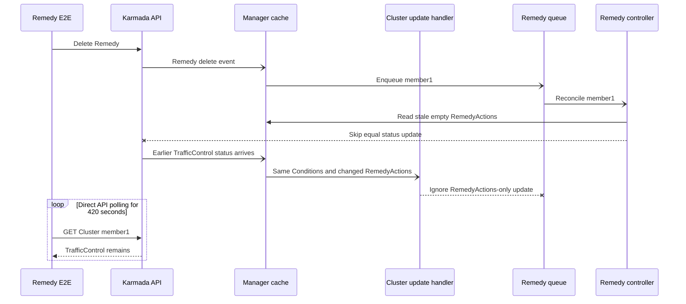

# Day 27: Remedy Flake Upstream Submission

- Date: `2026-07-17`
- Last updated: `2026-07-21`
- Target repository: `karmada-io/karmada`
- PR base: `master`
- PR head: `ranxi2001:fix/remedy-actions-reconcile`
- Initial PR commit: `3861906f2c3c51ec57eca114b71bff883d135fa3`
- Current squashed head: `dcd150b1739d448790b2e1c6d629c2273f93e619`
- Issue: [karmada-io/karmada#7776](https://github.com/karmada-io/karmada/issues/7776)
- Assignment: [`/assign` comment](https://github.com/karmada-io/karmada/issues/7776#issuecomment-5003434878), applied to `ranxi2001`
- PR: [karmada-io/karmada#7777](https://github.com/karmada-io/karmada/pull/7777), open and non-draft
- Posting state: published and API-verified

## Completed Publishing Sequence

1. Created the flake issue with the exact title and body below.
2. Replaced the PR placeholder with `Fixes #7776` and obtained the user's separate publication confirmation.
3. Rechecked `upstream/master`, overlapping open work, the branch diff, and exact-SHA fork CI.
4. Created upstream PR #7777 and verified its title, body, base/head, commit, files, labels, and draft state through the API.

## Exact Issue Draft

Target: new issue in `karmada-io/karmada`, using the `Flaking Test` template.

Title:

```text
[Flaky Test] Remedy action cleanup may not converge after Remedy deletion
```

Body:

````md
#### Which jobs are flaking:

- [`e2e test (v1.36.1)` in PR #7697, attempt 1](https://github.com/karmada-io/karmada/actions/runs/29563506143/job/87832263849); [the same SHA passed on attempt 2](https://github.com/karmada-io/karmada/actions/runs/29563506143/job/87847838611).
- [A 2026-07-09 occurrence](https://github.com/karmada-io/karmada/actions/runs/28998390044/job/86054168903) and #5323 show the same test timing out during cleanup.

#### Which test(s) are flaking:

`remedy testing with nil decision matches remedy [It] Create an immediately type remedy, then remove it`

#### Reason for failure:

The remediation controller can lose its last recovery event after a Remedy is deleted:



[`UpdateStatus`](https://github.com/karmada-io/karmada/blob/1f07b77c35ccac02501a4d0cd4f0bb525d26b887/pkg/util/helper/status.go#L52-L70) reads from the manager cache and skips the API write when the stale object already equals the desired empty actions. When the earlier `TrafficControl` write reaches the informer, [`clusterEventHandler.Update`](https://github.com/karmada-io/karmada/blob/1f07b77c35ccac02501a4d0cd4f0bb525d26b887/pkg/controllers/remediation/eventhandlers.go#L50-L58) ignores it because `Conditions` did not change. The controller has no periodic requeue, and the failed run had no later reconcile for 420 seconds, so the API status did not recover.

#### Anything else we need to know:

A narrow fix is to enqueue when either `Conditions` or `RemedyActions` changes. This follows the controller-specific watch approach discussed in #6858 while avoiding the broad status-patch behavior considered in #7077.

A focused regression gets queue length `0`, want `1` with the old predicate and passes with the fix. Fork commit [`3861906f2c3c`](https://github.com/ranxi2001/karmada/commit/3861906f2c3c51ec57eca114b71bff883d135fa3) passed unit tests and the v1.34/v1.35/v1.36 E2E matrix.
````

## Exact PR Draft

Target: `karmada-io/karmada:master` from `ranxi2001:fix/remedy-actions-reconcile`.

Title:

```text
fix: reconcile remedy action status updates
```

Published body:

````md
**What type of PR is this?**

/kind bug
/kind flake

**What this PR does / why we need it**:

Remedy action cleanup can remain stuck when `UpdateStatus` reads a stale cached Cluster and skips the post-delete status write. The later `RemedyActions`-only cache update was ignored because the Cluster event handler compared only `Conditions`.

This change enqueues Cluster updates when either `Conditions` or `RemedyActions` changes. Remedy actions are compared as a set so semantically equivalent empty values do not cause unnecessary reconciles.

**Which issue(s) this PR fixes**:

Fixes #7776

**Special notes for your reviewer**:

- Regression: the new handler test fails with queue length `0`, want `1` when the production change is reverted.
- Tests: `go test ./pkg/controllers/remediation -count=1`; fork CI at `3861906f2c3c` passed lint, codegen, compile, unit tests, and E2E on Kubernetes v1.34, v1.35, and v1.36.
- AI assistance: Codex assisted with root-cause analysis, implementation, and tests; I reviewed the changes and validation results.

**Does this PR introduce a user-facing change?**:

```release-note
karmada-controller-manager: Fixed an issue that Remedy actions might remain stale after a Remedy is removed.
```
````

## Preflight Summary

- No overlapping open issue or PR was found for `RemedyActions`, `remedy controller`, or the remediation event handler.
- #5323 is the same E2E spec but was closed with "maybe has been fixed" and no causal patch.
- #6858 documents the shared stale-cache mechanism and discussed a controller-specific watch, but closed through #7632's caller-convergence warning rather than a universal implementation. #7776 supplies the new concrete remediation path that violates that warning.
- #7077's shared status patch was closed without merge and is intentionally out of scope.
- `upstream/master` remains `1f07b77c35ccac02501a4d0cd4f0bb525d26b887`; the topic branch changes only `pkg/controllers/remediation/eventhandlers.go` and `eventhandlers_test.go`.
- The signed-off commit is pushed to the fork, and exact-SHA fork CI is green.
- No maintainer is mentioned or reviewer requested in either draft.
- The exact issue body is 288 visible words and 33 nonblank lines; the exact PR body is 178 visible words and 16 nonblank lines.
- The exact inline Mermaid source rendered successfully with `@mermaid-js/mermaid-cli@11.16.0` and was visually checked without clipping or ambiguous arrows.

## Published State

- Issue #7776 is open, authored by `ranxi2001`, and its API body matches the approved draft apart from the API-added trailing newline.
- `/assign` was published exactly and the issue assignee is `ranxi2001`.
- Directly adding `kind/flake` to the issue was rejected because `ranxi2001` lacks `AddLabelsToLabelable`. A later [`/kind flake` comment](https://github.com/karmada-io/karmada/issues/7776#issuecomment-5003473805) applied the label.
- At creation, PR #7777 was open and non-draft against `master` with head `ranxi2001:fix/remedy-actions-reconcile@3861906f2c3c51ec57eca114b71bff883d135fa3`.
- The initial PR API reported exactly two changed files, one signed-off commit, and the expected `kind/bug` and `kind/flake` labels. DCO passed immediately and upstream CI started.
- The online PR body matches the approved 178-word draft apart from the API-added trailing newline. No reviewer was requested and no maintainer was mentioned.

## 2026-07-20 Squash Update

- A Gemini suggestion had added generic `sets.New` usage and an empty-action fast path in commit `13645be77042637fbd9c50efb93829555b6ecc0c`; all checks on that head passed, but the equal non-empty set branch was not covered.
- Added a supported-state no-op case where old and new `RemedyActions` both contain `TrafficControl`. No invented action or invalid input was used because `TrafficControl` is the only current `RemedyAction` value.
- With the set-equality return temporarily disabled, the new case failed with `queue length = 1, want 0`; after restoration, `go test ./pkg/controllers/remediation -count=1` and `go test -race ./pkg/controllers/remediation -count=1` passed. Local coverage reports `clusterEventHandler.Update` at 100%.
- Squashed the two published commits and the new test into signed-off commit `dcd150b1739d448790b2e1c6d629c2273f93e619`. The desired tree stayed exactly `618f70c79efb9c90df68566de414d09d3ca94ef9` across the rewrite.
- `upstream/master` advanced from `1f07b77c3` to `e4417e386` without touching either remediation file. The squash retained the original merge-base, and `git merge-tree --write-tree upstream/master HEAD` completed without conflict.
- The force-push used an exact lease on old remote head `13645be77042637fbd9c50efb93829555b6ecc0c`. API verification shows PR #7777 is open, non-draft, mergeable, contains one signed-off commit, and still changes only `eventhandlers.go` and `eventhandlers_test.go`.
- DCO passed on the new head; upstream CI Workflow, Chart, CLI, and Operator checks started. No PR body, comment, reviewer request, or maintainer mention was changed.

## 2026-07-21 Maintainer Confirmation And Review Method

### 最新状态

| 对象 | 当前状态 | 决策含义 |
| --- | --- | --- |
| [Issue #7776](https://github.com/karmada-io/karmada/issues/7776) | open；assignee `@ranxi2001`；`kind/bug`、`kind/flake` | `@zhzhuang-zju` 已基本确认这是现实问题，并确认其根因与 #6858 非常相似 |
| [PR #7777](https://github.com/karmada-io/karmada/pull/7777) | open、non-draft；head `dcd150b17`；assignee `@zhzhuang-zju`；17 个 check runs 全部成功 | 维护者已明确接受当前方案方向，但 review state 仍为 `COMMENTED`，尚无 `lgtm` 或 `approved`；Tide 只等待后两项标签 |
| [CI run 29713746444 attempt 2](https://github.com/karmada-io/karmada/actions/runs/29713746444/attempts/2) | success | 原 v1.34 post-test artifact upload timeout 已通过重跑消失；这只清除了 CI 门禁，不替代代码 review |

维护者在 [#7776 的回复](https://github.com/karmada-io/karmada/issues/7776#issuecomment-5033508979) 中没有只说“能复现”，而是按八个步骤重建了完整竞态：先写入 `TrafficControl`，manager cache 尚未观察到写入时删除 Remedy，delete event 触发 reconcile，`UpdateStatus` 从旧 cache 读到空 actions 并因相等跳过 API 写，随后较早的 `TrafficControl` 更新到达 informer，却又被只比较 `Conditions` 的 handler 忽略，最终没有后续 reconcile 清理 API 中的旧状态。

这条回复完成了两件事：

1. 确认问题和根因类别：这是 direct API status write 与异步 manager cache 之间的 timing race。
2. 保留方案审查边界：维护者明确说会稍后 review proposed solution，因此不能把问题确认写成 PR 已获认可。

### #6858 的真实先例边界

#6858 不能简单概括成“社区已经选择 status event watch”。完整讨论实际经历了 direct API GET、custom condition helper、`observedGeneration`、no-op timed requeue、always update/patch 和 controller-specific event filter 等多条路径。

- #7106 为原 workload sync 路径补了 conflict retry，缓解了当时的具体触发。
- #7077 和 #7447 的宽泛 status helper 改动都没有合并，讨论中明确担心字段 ownership、QPS 和 reconcile loop。
- 最终合并的 [#7632](https://github.com/karmada-io/karmada/pull/7632) 只在 `UpdateStatus` 写明调用方合同：cache 可能 stale；如果一次更新被跳过，调用方必须保证最终收敛；若过滤 reconcile event 又没有 periodic reconcile，stale status 可能永久保留。

因此，#7776/#7777 与 #6858 的准确关系是：同一 stale-cache 根因类别，新的 remediation 调用方违反了 #7632 记录的收敛前提；#7777 的 `RemedyActions` watch 是针对这个调用方恢复事件的窄修复。它不是照搬一个已经获得通用共识的实现。

### 可复用的 maintainer / committer 方法

| 方法 | #6858 / #7776 中的表现 | 以后直接采用的写法 |
| --- | --- | --- |
| 先复述，再质疑 | `XiShanYongYe-Chang`、`zhzhuang-zju` 会把理解重述成可回答的问题 | 先写“我的理解是否是……”，让分歧落到一个具体状态或事件上 |
| 引用历史但说明关系 | `RainbowMango` 连接旧 issue/PR，同时继续追问 root cause | 每个链接补一句“它证明什么、没有证明什么”，不裸贴编号 |
| 按事件分点 | #7776 用八步把 API、cache、controller、handler 分开 | 一步只写一个 actor 和一个状态变化，最后单独总结 race/invariant |
| 按维度比较方案 | `zach593` 比较 Update/Patch、DeepEqual/no-DeepEqual，并讨论 QPS、ownership、loop 风险 | 用明确维度列 pros/cons，不在长线程中反复陈述立场 |
| 引入真实生产先例 | `snowplayfire` 给出外部项目的具体 filter/code precedent | 用真实调用方或生产路径支撑，不把 mock-only 条件包装成 bug |
| 分离判断层级 | #7776 先确认问题，明确把 proposed solution 留到 PR review | 分开报告 problem、root cause、patch、approval、merge gate 五种状态 |
| 讨论不收敛就升级 | #6858 在方案长期无共识时带到 community meeting | 先列未决问题和选项成本，再请求维护者/会议决策，不靠重复评论推进 |

以后复杂 review 的默认骨架为：`当前判断 -> 编号事件链 -> 一句根因/不变量 -> 历史先例及边界 -> 方案取舍 -> 尚未确认项 -> 下一动作`。这比堆源码符号更方便维护者快速核对，也能避免我们把“同一根因”误写成“同一方案已获批准”。

### 方案 review 结论

`2026-07-21T12:11:22Z`，`@zhzhuang-zju` 在 [`clusterEventHandler.Update` 的 line review](https://github.com/karmada-io/karmada/pull/7777#discussion_r3621975631) 中给出明确方案判断：监听 `RemedyActions` 可能产生额外 no-op reconciliations，但 Remedy 的创建、更新、删除并不频繁，而且单次 reconciliation 较轻，因此当前方案可接受。

这条意见把状态推进了一步：

1. **问题与根因**：已在 #7776 基本确认。
2. **实现方向**：当前 caller-specific trigger 已获得明确 `MAINTAINER` 接受证据，没有提出代码修改要求。
3. **形式门禁**：review submission 仍是 `COMMENTED`，没有 `/lgtm` 或 `/approve`；Tide 仍显示 `Needs approved, lgtm labels`，所以不能写成 PR 已批准或可合并。

这也是一种可复用的 tradeoff review 写法：先主动承认代价，再分别约束事件频率和单次成本，最后给出接受或拒绝结论。它比只说“性能影响不大”更容易让其他 reviewer 核对判断依据。当前不需要修改代码或回复该 thread；下一步是等待 reviewer/approver 给出正式门禁标签，或提出新的 actionable comment。

### Release Note Follow-Up

`2026-07-21T12:16:42Z`，`@zhzhuang-zju` 在 [conversation comment](https://github.com/karmada-io/karmada/pull/7777#issuecomment-5033855501) 中表示 `Others LGTM~`，唯一要求是把 release note 收窄到具体 API 字段和关联资源。用户确认后，PR body 中 `release-note` fence 已更新为：

```text
karmada-controller-manager: Fixed an issue where `Cluster.status.remedyActions` could remain stale after an associated `Remedy` resource was removed.
```

REST API 回读确认新句子恰好出现一次、旧句子已不存在；PR 仍为 open、non-draft，base/head 与 commit `dcd150b1739d448790b2e1c6d629c2273f93e619` 均未改变。没有修改代码、推 PR branch 或发布额外回复。`Others LGTM~` 说明维护者没有其他内容意见，但它仍不是正式 `/lgtm` 或 `/approve` 命令；Tide 继续等待这两个标签。
