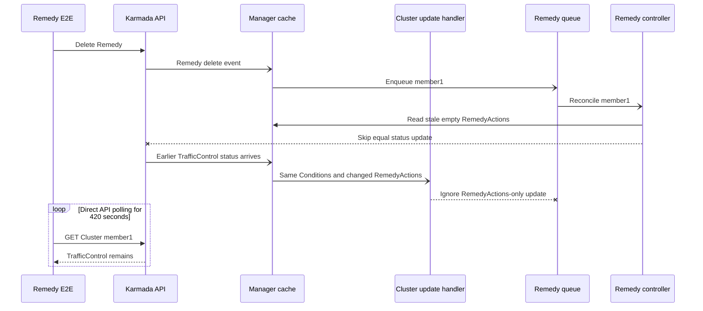

# Day 27: Remedy Flake Upstream Submission

- Date: `2026-07-17`
- Last updated: `2026-07-20`
- Target repository: `karmada-io/karmada`
- PR base: `master`
- PR head: `ranxi2001:fix/remedy-actions-reconcile`
- Initial PR commit: `3861906f2c3c51ec57eca114b71bff883d135fa3`
- Current squashed head: `dcd150b1739d448790b2e1c6d629c2273f93e619`
- Issue: [karmada-io/karmada#7776](https://github.com/karmada-io/karmada/issues/7776)
- Assignment: [`/assign` comment](https://github.com/karmada-io/karmada/issues/7776#issuecomment-5003434878), applied to `ranxi2001`
- PR: [karmada-io/karmada#7777](https://github.com/karmada-io/karmada/pull/7777), open and non-draft
- Posting state: published and API-verified

## Completed Publishing Sequence

1. Created the flake issue with the exact title and body below.
2. Replaced the PR placeholder with `Fixes #7776` and obtained the user's separate publication confirmation.
3. Rechecked `upstream/master`, overlapping open work, the branch diff, and exact-SHA fork CI.
4. Created upstream PR #7777 and verified its title, body, base/head, commit, files, labels, and draft state through the API.

## Exact Issue Draft

Target: new issue in `karmada-io/karmada`, using the `Flaking Test` template.

Title:

```text
[Flaky Test] Remedy action cleanup may not converge after Remedy deletion
```

Body:

````md
#### Which jobs are flaking:

- [`e2e test (v1.36.1)` in PR #7697, attempt 1](https://github.com/karmada-io/karmada/actions/runs/29563506143/job/87832263849); [the same SHA passed on attempt 2](https://github.com/karmada-io/karmada/actions/runs/29563506143/job/87847838611).
- [A 2026-07-09 occurrence](https://github.com/karmada-io/karmada/actions/runs/28998390044/job/86054168903) and #5323 show the same test timing out during cleanup.

#### Which test(s) are flaking:

`remedy testing with nil decision matches remedy [It] Create an immediately type remedy, then remove it`

#### Reason for failure:

The remediation controller can lose its last recovery event after a Remedy is deleted:



[`UpdateStatus`](https://github.com/karmada-io/karmada/blob/1f07b77c35ccac02501a4d0cd4f0bb525d26b887/pkg/util/helper/status.go#L52-L70) reads from the manager cache and skips the API write when the stale object already equals the desired empty actions. When the earlier `TrafficControl` write reaches the informer, [`clusterEventHandler.Update`](https://github.com/karmada-io/karmada/blob/1f07b77c35ccac02501a4d0cd4f0bb525d26b887/pkg/controllers/remediation/eventhandlers.go#L50-L58) ignores it because `Conditions` did not change. The controller has no periodic requeue, and the failed run had no later reconcile for 420 seconds, so the API status did not recover.

#### Anything else we need to know:

A narrow fix is to enqueue when either `Conditions` or `RemedyActions` changes. This follows the controller-specific watch approach discussed in #6858 while avoiding the broad status-patch behavior considered in #7077.

A focused regression gets queue length `0`, want `1` with the old predicate and passes with the fix. Fork commit [`3861906f2c3c`](https://github.com/ranxi2001/karmada/commit/3861906f2c3c51ec57eca114b71bff883d135fa3) passed unit tests and the v1.34/v1.35/v1.36 E2E matrix.
````

## Exact PR Draft

Target: `karmada-io/karmada:master` from `ranxi2001:fix/remedy-actions-reconcile`.

Title:

```text
fix: reconcile remedy action status updates
```

Published body:

````md
**What type of PR is this?**

/kind bug
/kind flake

**What this PR does / why we need it**:

Remedy action cleanup can remain stuck when `UpdateStatus` reads a stale cached Cluster and skips the post-delete status write. The later `RemedyActions`-only cache update was ignored because the Cluster event handler compared only `Conditions`.

This change enqueues Cluster updates when either `Conditions` or `RemedyActions` changes. Remedy actions are compared as a set so semantically equivalent empty values do not cause unnecessary reconciles.

**Which issue(s) this PR fixes**:

Fixes #7776

**Special notes for your reviewer**:

- Regression: the new handler test fails with queue length `0`, want `1` when the production change is reverted.
- Tests: `go test ./pkg/controllers/remediation -count=1`; fork CI at `3861906f2c3c` passed lint, codegen, compile, unit tests, and E2E on Kubernetes v1.34, v1.35, and v1.36.
- AI assistance: Codex assisted with root-cause analysis, implementation, and tests; I reviewed the changes and validation results.

**Does this PR introduce a user-facing change?**:

```release-note
karmada-controller-manager: Fixed an issue that Remedy actions might remain stale after a Remedy is removed.
```
````

## Preflight Summary

- No overlapping open issue or PR was found for `RemedyActions`, `remedy controller`, or the remediation event handler.
- #5323 is the same E2E spec but was closed with "maybe has been fixed" and no causal patch.
- #6858 documents the shared stale-cache mechanism; its controller-specific watch option matches this narrow fix.
- #7077's shared status patch was closed without merge and is intentionally out of scope.
- `upstream/master` remains `1f07b77c35ccac02501a4d0cd4f0bb525d26b887`; the topic branch changes only `pkg/controllers/remediation/eventhandlers.go` and `eventhandlers_test.go`.
- The signed-off commit is pushed to the fork, and exact-SHA fork CI is green.
- No maintainer is mentioned or reviewer requested in either draft.
- The exact issue body is 288 visible words and 33 nonblank lines; the exact PR body is 178 visible words and 16 nonblank lines.
- The exact inline Mermaid source rendered successfully with `@mermaid-js/mermaid-cli@11.16.0` and was visually checked without clipping or ambiguous arrows.

## Published State

- Issue #7776 is open, authored by `ranxi2001`, and its API body matches the approved draft apart from the API-added trailing newline.
- `/assign` was published exactly and the issue assignee is `ranxi2001`.
- Directly adding `kind/flake` to the issue was rejected because `ranxi2001` lacks `AddLabelsToLabelable`. A later [`/kind flake` comment](https://github.com/karmada-io/karmada/issues/7776#issuecomment-5003473805) applied the label.
- At creation, PR #7777 was open and non-draft against `master` with head `ranxi2001:fix/remedy-actions-reconcile@3861906f2c3c51ec57eca114b71bff883d135fa3`.
- The initial PR API reported exactly two changed files, one signed-off commit, and the expected `kind/bug` and `kind/flake` labels. DCO passed immediately and upstream CI started.
- The online PR body matches the approved 178-word draft apart from the API-added trailing newline. No reviewer was requested and no maintainer was mentioned.

## 2026-07-20 Squash Update

- A Gemini suggestion had added generic `sets.New` usage and an empty-action fast path in commit `13645be77042637fbd9c50efb93829555b6ecc0c`; all checks on that head passed, but the equal non-empty set branch was not covered.
- Added a supported-state no-op case where old and new `RemedyActions` both contain `TrafficControl`. No invented action or invalid input was used because `TrafficControl` is the only current `RemedyAction` value.
- With the set-equality return temporarily disabled, the new case failed with `queue length = 1, want 0`; after restoration, `go test ./pkg/controllers/remediation -count=1` and `go test -race ./pkg/controllers/remediation -count=1` passed. Local coverage reports `clusterEventHandler.Update` at 100%.
- Squashed the two published commits and the new test into signed-off commit `dcd150b1739d448790b2e1c6d629c2273f93e619`. The desired tree stayed exactly `618f70c79efb9c90df68566de414d09d3ca94ef9` across the rewrite.
- `upstream/master` advanced from `1f07b77c3` to `e4417e386` without touching either remediation file. The squash retained the original merge-base, and `git merge-tree --write-tree upstream/master HEAD` completed without conflict.
- The force-push used an exact lease on old remote head `13645be77042637fbd9c50efb93829555b6ecc0c`. API verification shows PR #7777 is open, non-draft, mergeable, contains one signed-off commit, and still changes only `eventhandlers.go` and `eventhandlers_test.go`.
- DCO passed on the new head; upstream CI Workflow, Chart, CLI, and Operator checks started. No PR body, comment, reviewer request, or maintainer mention was changed.
