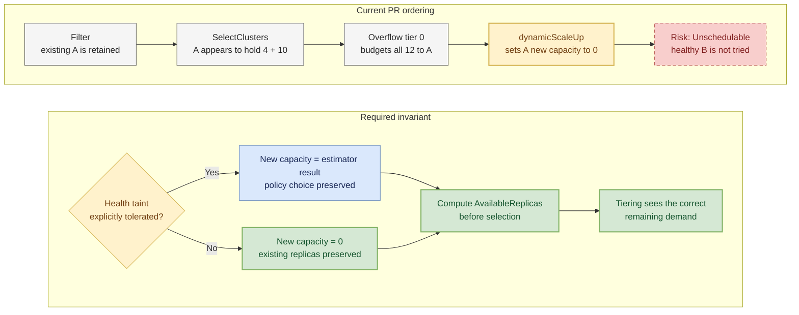

I think the effective capacity for new replicas needs to be decided before cluster selection, while preserving the existing `ClusterTolerations` behavior.

For an already-targeted non-Ready cluster, two policy states matter. If its health taint is not tolerated, `TaintToleration.Filter` retains the cluster only so its existing replicas can remain until taint-manager handles eviction. This is the #6861 case, so its new-replica capacity should be 0. If the health taint is explicitly tolerated, the policy intentionally keeps the cluster eligible, but this unconditional Ready check still sets its new capacity to 0 and overrides that policy choice.

The check is also too late for current `master`: `SelectClusters` computes `AvailableReplicas`, and overflow tiering consumes it before `dynamicScaleUp`. In a focused assignment/overflow regression, primary A had 4 existing + 10 estimated replicas, healthy overflow B had 10, and the desired count was 12. Tier 0 budgeted all 12 to A; `dynamicScaleUp` then reduced A's new capacity to 0 and returned `Unschedulable`, so B was never tried.

Could we compute this policy-aware new-replica capacity before selection and carry it through tiering and assignment? Please cover the `filter -> selection/tiering -> assignment` path for an existing untolerated cluster, an explicitly tolerated health taint, and a healthy overflow fallback. `dynamicFreshScale` also bypasses the current check; please apply the same invariant there, or confirm with maintainers that Fresh rescheduling is intentionally outside this PR's scope.
