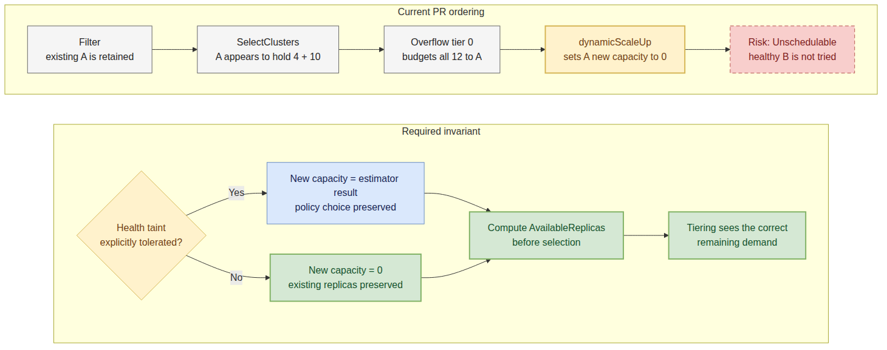

# Day 28: PR #6863 Scheduler Health Review

## Review target

- Issue: [karmada-io/karmada#6861](https://github.com/karmada-io/karmada/issues/6861)
- PR: [karmada-io/karmada#6863](https://github.com/karmada-io/karmada/pull/6863)
- PR head: `060724a5a101dc561a5975fbf74fbc503fe1e536`
- PR merge base: `8dbca68fc19af5aa6873a2b4e3bbf275988a33ad`
- Review baseline: `upstream/master@e4417e3862918be6e64daeba88ad643d549201b4`
- Upstream action: user-approved line review published as [discussion_r3612379211](https://github.com/karmada-io/karmada/pull/6863#discussion_r3612379211).

## Business path from the original issue

The issue describes a normal production operation, not a mock-only edge case:

1. A workload already has replicas on member clusters A and B.
2. A becomes unhealthy and cannot execute newly dispatched work.
3. The user increases the desired replicas under `Divided / Weighted / DynamicWeight=AvailableReplicas`.
4. Because A is already in `binding.spec.clusters`, `TaintToleration.Filter` keeps it in the candidate set so taint-manager can own later eviction.
5. The old scheduler still counts A's estimated allocatable replicas and assigns part of the scale-up delta to A.

The intended invariant for this issue is therefore narrower than "remove every unhealthy candidate": keep A's existing replicas during the grace period, but do not give A new replicas unless the policy explicitly permits its health taint.

## Findings

### P1: The unconditional Ready check overrides `ClusterTolerations`

The scheduler deliberately does not filter clusters by Ready condition in `findClustersThatFit`; its source comment says users decide through `Placement.ClusterTolerations`. `TaintToleration.Filter` has two distinct success paths:

- an already-targeted cluster is retained so taint-manager can handle eviction;
- a cluster whose `NoSchedule` or `NoExecute` taint is explicitly tolerated is eligible by user policy.

PR #6863 collapses both paths at `dynamicScaleUp`: every non-Ready cluster receives zero new capacity. A policy that explicitly tolerates `cluster.karmada.io/not-ready:NoSchedule` passes the filter, then loses that choice during assignment.

This contract is intentional. Merged commit `a42c819c101e850ec89f15f8fd7cb8f2b9bf94e9` replaced condition-only filtering with taint/toleration policy and added the current `DO NOT filter unhealthy cluster` source comment.

### P1: Applying health after selection can block healthy overflow

Current `master` computes `ClusterDetailInfo.AvailableReplicas` before cluster selection and overflow tier assignment. The PR changes only the later `dynamicScaleUp` input, after those decisions have already trusted the stale capacity.

A temporary current-master-plus-PR regression reproduced this supported path:

- unhealthy primary A: 4 existing replicas, 10 estimated new replicas;
- healthy overflow B: 10 available replicas;
- desired replicas: 12.

Tier selection sees A as `4 + 10 = 14` and asks the primary tier to satisfy all 12. `dynamicScaleUp` then changes A's new capacity to zero and returns:

```text
failed to scale up: Clusters available replicas 0 are not enough to schedule.
```

The loop returns on that error, so healthy overflow B is never tried. This conflicts with the accepted overflow-affinities proposal, which says an unavailable primary must use the next available tier.



Editable source: [day28-pr6863-late-health-capacity-flow.mmd](day28-pr6863-late-health-capacity-flow.mmd)

### P1: Fresh rescheduling bypasses the new guard

When `spec.rescheduleTriggeredAt` is newer than `status.lastScheduledTime`, `newAssignState` selects `Fresh`. `assignByDynamicStrategy` then calls `dynamicFreshScale`, which uses the original `AllocatableReplicas` and never executes the new Ready check. A manual reschedule can therefore still assign new replicas to the same unhealthy existing target.

### P2: The test proves arithmetic, not the scheduler contract

The added test calls `assignByDynamicStrategy` directly with a prepared candidate list. It proves that the steady assignment arithmetic preserves the unhealthy cluster's existing four replicas while allocating the delta elsewhere, but it bypasses `Schedule -> findClustersThatFit -> TaintToleration.Filter -> SelectClusters`.

The generic fixture changes are also broader than the regression:

- `NewCluster` now makes Ready=True implicit at 84 call sites across six test files, although removing that change leaves all scheduler-core tests green.
- `NewClusterWithResource` changes 48 assignment-test call sites and hides the Ready-condition-absent branch.
- Both builders use `metav1.Now()`, adding wall-clock state to otherwise deterministic fixtures.

A stronger test set should keep readiness explicit and cover the production branches: existing plus untolerated unhealthy, explicitly tolerated health taint, healthy overflow fallback, and Fresh rescheduling.

## Verification

- The PR auto-merges cleanly into `upstream/master@e4417e386`; the effective diff remains four files and 89 additions.
- `git diff --check` passed on the synthetic merge.
- `go test ./pkg/scheduler/core -run '^Test_dynamicScale$' -count=1` passed.
- `go test ./pkg/scheduler/framework/plugins/tainttoleration -count=1` passed.
- `go test ./pkg/apis/cluster/v1alpha1 -count=1` passed.
- `go test ./pkg/scheduler/... ./pkg/util/overridemanager -count=1` passed.
- The temporary unhealthy-primary/healthy-overflow regression failed with the exact insufficient-capacity error above; the temporary test and isolated worktree were removed afterward.
- The PR's 2025-11-18 CI is green, but it predates current `master` and has no human semantic approval. Tide remains pending.

The Copilot loop-copy comment is not a valid finding: the modified range copy is immediately read into `clusterAvailableReplicas[i]`, so no mutation of the original candidate slice is required.

## Exact upstream review comment

Target: PR #6863, `pkg/scheduler/core/division_algorithm.go`, right side of line 130 at head `060724a5a101dc561a5975fbf74fbc503fe1e536`.

Canonical approved body: [day28-pr6863-review-comment.md](day28-pr6863-review-comment.md).

This is intentionally one self-contained comment rather than several short comments. It gives the author the issue path, counterexample, stage ordering, expected invariant, and requested tests without requiring local chat context.

## Publication record

- User approved the exact revised body on 2026-07-20.
- Published line review: [discussion_r3612379211](https://github.com/karmada-io/karmada/pull/6863#discussion_r3612379211)
- Review state: `COMMENTED`; review ID `4732583531`.
- API readback verified author `ranxi2001`, commit `060724a5a101dc561a5975fbf74fbc503fe1e536`, path `pkg/scheduler/core/division_algorithm.go`, right-side line 130, and exact body equality with `day28-pr6863-review-comment.md`.
- No summary review, maintainer mention, label, assignment, approval, or other PR state was added.
