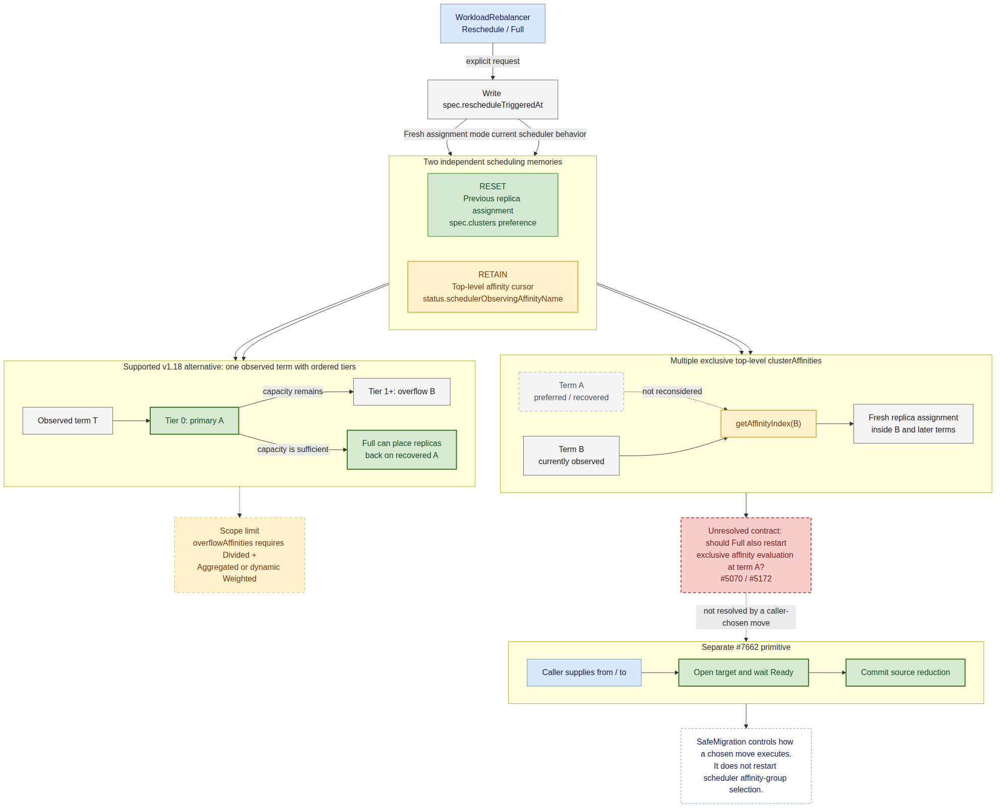

# Day 29：Issue #5070 与 PR #7662 的 Fresh / Full 语义调研

日期：2026-07-20

## 结论先行

[#5070](https://github.com/karmada-io/karmada/issues/5070) 与后续要继续评审的 [proposal PR #7662](https://github.com/karmada-io/karmada/pull/7662) **直接相关，但不是已经被 #7662 覆盖的旧问题**。

它暴露了 `Fresh` 一词混在一起的两个状态层：

1. `spec.clusters` 代表的上一次副本分配；
2. `status.schedulerObservingAffinityName` 代表的顶层 `clusterAffinities` 搜索游标。

当前 `WorkloadRebalancer` 会让动态副本分配进入 `Fresh`，因此第 1 层会重新计算；但 scheduler 仍从第 2 层记录的 affinity term 开始，所以已经从 A 前进到 B 后，不会因为一次 Full/Fresh 自动回头重试 A。

因此：

- #5070 是真实公司业务场景，不是 mock 或人为异常输入；
- current master 仍未实现“显式 Fresh 从第一个顶层 affinity term 重新搜索”；
- v1.18 `overflowAffinities` 只在一个顶层 term 内提供 primary -> overflow 的有序层级，不能证明旧 `clusterAffinities` 问题已消失；
- #7662 当前的 `Reschedule/Full` 只是复用现有 timestamp trigger，并没有实现 #5070/#5172；
- 在 community 对旧顶层 affinity 语义重新确认前，不应把 #5070 偷偷并入 #7662，也不应继续用未限定范围的 “recompute the whole assignment” 描述 Full。

## 调研范围与证据快照

调研阶段只读核验以下对象；完成报告后，经用户确认仅在 #5070 发布 `/assign`，未发布技术评论或修改其他 upstream 状态：

| 对象 | 2026-07-20 状态 | 本轮用途 |
| --- | --- | --- |
| [#5070](https://github.com/karmada-io/karmada/issues/5070) | Open，`kind/feature`；2026-07-20 已认领给 `@ranxi2001`，无 milestone | 原始生产需求与 2024 年方向讨论 |
| [#5172](https://github.com/karmada-io/karmada/issues/5172) | Open，assignee `@bharathguvvala`，milestone v1.19 | Fresh across multiple affinities umbrella；proposal/implementation/UT/e2e 均未完成 |
| [#5425](https://github.com/karmada-io/karmada/pull/5425) | Open、blocked、无 LGTM/Approve | 历史最小实现方向及失败原因 |
| [#4990](https://github.com/karmada-io/karmada/issues/4990) | 2026-06-02 以 v1.18 Overflow Affinities 为由关闭 | 需求演化与“已解决”边界 |
| [#7717](https://github.com/karmada-io/karmada/issues/7717) | Open，2026-07-06 在 v1.18 后复现 | 当前真实行为与新建议的冲突 |
| [#7662](https://github.com/karmada-io/karmada/pull/7662) | Open，head `586f6fc`，proposal-only，无 human approval | `Reschedule/Full`、`PreserveReady`、`SafeMigration` 的边界 |
| `upstream/master` | `e4417e386` | current source 和测试事实 |

证据标签：

- `FACT`：GitHub 对话、当前源码、测试或官方文档直接支持；
- `INFERENCE`：由多项事实推出，但尚未得到 community 的新明确决策；
- `OPEN`：需要 author / maintainer 选择的合同。

## 为什么 #5070 值得继续追

`FACT`：[报告者给出的](https://github.com/karmada-io/karmada/issues/5070#issuecomment-2182081134)不是构造出来的边界值，而是公司正在使用 Karmada 解决的混合云成本场景：

- A 是更便宜、优先使用的私有 on-prem 集群；
- B 是成本更高、只用于 burst 或 failover 的公有云集群；
- A 恢复或重新释放容量后，管理员显式创建 WorkloadRebalancer，希望从 B 回到 A。

原始复现也对应正常生命周期：A 正常 -> A 不可调度 -> 前进到 B -> A 恢复 -> 用户主动 Full/Fresh。没有非法对象、mock-only 输入或现实中不会发生的极端调度值。

`FACT`：`@chaosi-zju` 在了解该生产背景后[明确认为需求合理且需要支持](https://github.com/karmada-io/karmada/issues/5070#issuecomment-2182131652)；`@XiShanYongYe-Chang` [将它称为 good direction](https://github.com/karmada-io/karmada/issues/5070#issuecomment-2202570372)，并说明此前没有 reset scheduling group 只是因为缺少用户案例。#5070 随后从 bug 改为 feature，#5172 被创建用于继续跟踪。

`FACT`：官方 [Workload Rebalance 文档](https://karmada.io/docs/next/userguide/scheduling/workload-rebalancer/) 仍把 primary 恢复后的 failback 列为 Scenario 4，并称显式 reschedule 会忽略 previous propagation、建立新的分配。该用户期待不是口说无凭，而是与项目公开承诺一致。

## 历史时间线

| 日期 | 事实 | 对当前判断的意义 |
| --- | --- | --- |
| 2024-06-20 | #5070 报告 A -> B 后，WorkloadRebalancer 仍从 observed B 开始 | 原始缺口定位准确 |
| 2024-06-21 | 报告者补充 on-prem A / public-cloud B 的公司成本场景 | 通过 production relevance gate |
| 2024-06-21 | `@chaosi-zju` 解释旧设计只允许向后续 term 前进，随后认可新需求 | 旧行为是有意设计，但新能力也被认可 |
| 2024-06-28 | 双方同意应由用户显式触发并承担 Fresh 影响 | 不是自动周期 failback |
| 2024-07-02 | `@XiShanYongYe-Chang` 认可 reset-group direction；bug -> feature | 行为变更需要 feature 语义与测试 |
| 2024-07-11 | #5172 创建，后续分配给原报告者 | 独立 umbrella 已存在，避免重复抢实现 |
| 2024-08-26 | #5425 打开，目标是在显式 reschedule 时从 index 0 开始 | 找到最小 causal location |
| 2024-09-21 | [maintainer 建议](https://github.com/karmada-io/karmada/pull/5425#discussion_r1769531084)复用 `util.RescheduleRequired(...)` 决定是否 reset index | 最新明确实现方向不是由 controller 清 status |
| 2025-01-17 | maintainer [表示早期功能代码无问题](https://github.com/karmada-io/karmada/pull/5425#issuecomment-2597684402)，但当前提交不编译、含无关文件、CI 失败 | PR 停滞不是设计被否决 |
| 2025-05 至 2026-05 | #5172 从 v1.15 顺延到 v1.19 | 只是 revisit signal，不是交付承诺 |
| 2026-06-02 | [#4990 因 v1.18 Overflow Affinities 被关闭](https://github.com/karmada-io/karmada/issues/4990#issuecomment-4602095404) | 只证明重叠需求有新表达方式 |
| 2026-07-06 | #7717 在 v1.18 后用 Duplicated 再次复现；[回复建议改用 overflow](https://github.com/karmada-io/karmada/issues/7717#issuecomment-4888352507) | 当前合同仍不一致，且建议不适用于原配置 |

## 两种 affinity 不是同一层



- [可编辑 Mermaid 源](day29-issue5070-pr7662-full-semantics.mmd)

### 顶层 `clusterAffinities`

多个 `ClusterAffinityTerm` 是按顺序尝试、一次选择一个的互斥 fallback group。原始 multi-scheduling-group proposal 明确写道：reschedule 时应从 `SchedulerObservedAffinityName` 对应的 term 继续。

例如：

```text
clusterAffinities:
  A: on-prem
  B: public cloud

status.schedulerObservingAffinityName = B
```

当前 reschedule 从 B 开始，A 不再属于本轮候选。

### term 内 `overflowAffinities`

v1.18 新增的是一个已选顶层 term 内的有序 tier：primary A、overflow B、overflow C。没有单独持久化“当前 overflow tier”的 status cursor；每次调度都会重新计算 tier order，因此显式 Full 可以在同一 term 内重新优先使用恢复后的 primary。

但它有明确的支持矩阵：admission 只允许 `Divided + Aggregated` 或 `Divided + Weighted(dynamicWeight)`；`Duplicated` 和 static weight 不支持。

因此，下面两种 YAML 不能只看名字相似就等价：

```text
exclusive top-level terms:  [A] -> [B]
one term with tiers:         [A primary -> B overflow]
```

## Current Master 的源码证据

### 1. WorkloadRebalancer 只写 trigger

[`pkg/controllers/workloadrebalancer/workloadrebalancer_controller.go`](../pkg/controllers/workloadrebalancer/workloadrebalancer_controller.go) 的 RB/CRB 两条路径都只把创建时间写入 `spec.rescheduleTriggeredAt`。它不会清空 `spec.clusters`、`SchedulerObservedAffinityName` 或 `LastScheduledTime`。

当前 controller 在 Binding update 成功后就把 workload 记为 `Successful`；#7662 计划等待 scheduler completion，这是另一个生命周期改动，但不会自动改变 affinity 搜索起点。

### 2. scheduler 能识别显式 reschedule

[`pkg/scheduler/scheduler.go`](../pkg/scheduler/scheduler.go) 的 RB/CRB reconcile 都用：

```go
util.RescheduleRequired(spec.RescheduleTriggeredAt, status.LastScheduledTime)
```

触发一次 schedule。这个 predicate 要求 trigger 严格晚于 last scheduled time。

### 3. Fresh 只进入副本 assignment 层

[`pkg/scheduler/core/assignment.go`](../pkg/scheduler/core/assignment.go) 在同一个 predicate 为 true 时，把 assignment mode 从 `Steady` 切为 `Fresh`。动态 Fresh 会不再把旧 `spec.clusters` 当作分配偏好，但仍把原副本加回可用容量，随后重新分配。

### 4. 外层 affinity loop 仍从 observed term 开始

RB 与 CRB 对称地执行：

```go
affinityIndex := getAffinityIndex(
    placement.ClusterAffinities,
    status.SchedulerObservedAffinityName,
)
```

之后才调用 scheduling algorithm。也就是说 outer group 已经先限定为 B，inner assignment 再 Fresh；Fresh 没有机会看到 A。

### 5. ClusterAffinity plugin 只展开当前 term

[`pkg/scheduler/framework/plugins/clusteraffinity/cluster_affinity.go`](../pkg/scheduler/framework/plugins/clusteraffinity/cluster_affinity.go) 只找 `AffinityName == SchedulerObservedAffinityName` 的顶层 term，然后把该 term 的 primary 和 `OverflowAffinities` 加入候选。它不会遍历更早的顶层 term。

## 行为矩阵

| Policy 形状 / 操作 | Full 当前重置什么 | 是否能回到 A | 结论 |
| --- | --- | --- | --- |
| 单个 `clusterAffinity`，A/B 都是候选 | 重新计算副本分配 | 可能重新使用 A，但没有 primary/backup 顺序保证 | current Full 范围内 |
| 顶层 `clusterAffinities: [A, B]`，observed=B | 只 Fresh B 内分配 | 否，不重试 earlier A | #5070/#5172 缺口 |
| 一个 term：primary A + overflow B | 在同一 term 内从 tier 0 重新分配 | 是，前提是支持的 Divided mode 且 A 有容量 | v1.18 支持路径 |
| `PreserveReady`，ready replicas 已在 B | 计划保留 B 的 ready 下界 | 不应被理解为 failback | 与 #5070 目标不同 |
| `SafeMigration from=B to=A` | caller 已经选定 source/target | 可做 target-first 回迁 | 解决“怎么安全移动”，不解决 scheduler“选哪里” |

## v1.18 是否已经解决 #5070

答案是：**只解决了一部分可重新建模的业务，不是原能力的完整实现。**

`FACT`：[Overflow proposal](../docs/proposals/scheduling/multi-scheduling-group/overflow-affinities/README.md) 明确说它不取代旧 `ClusterAffinities`：旧字段用于互斥 group isolation / failover；overflow 用于一个 candidate group 内的成本优化与弹性 tier。

`FACT`：#4990 后期同时提出了两类需求：

1. ordered failover / recovery；
2. capacity overflow / reverse consolidation。

v1.18 明确交付了第 2 类，并能让使用受支持 Divided mode、改写成 `overflowAffinities` 的 workload 在显式 reschedule 后回到 primary。

`FACT`：#7717 使用 `replicaSchedulingType: Duplicated` 在 v1.18 后复现了原问题。feature author 回复“改用 overflowAffinities”，但官方文档和 validation 又明确拒绝 Duplicated + overflow；用户必须改变副本调度语义才能采用该建议。

`INFERENCE`：因此 #4990 的关闭不能作为 #5070/#5172 已实现的证据；至少 Duplicated failback 和 legacy top-level group reset 仍没有闭环。

## #5425 为什么没合并

历史实现的有效核心只有 RB/CRB 各三行：在计算现有 affinity index 后，如果 `RescheduleRequired(...)` 为 true，就把 index 设为 0。

maintainer [明确建议过这个方向](https://github.com/karmada-io/karmada/pull/5425#discussion_r1769531084)，并在 2025-01-17 [表示之前的功能代码没有问题](https://github.com/karmada-io/karmada/pull/5425#issuecomment-2597684402)。PR 最终停滞的直接原因是贡献者反复 rebase/squash 失败：

- [current head](https://github.com/karmada-io/karmada/commit/a37e17d098e66ff8436df7fd3f0ed927389901de) 是 merge commit；
- 混入无关 operator proposal；
- [CRB 分支错误引用未定义的 `rb`](https://github.com/karmada-io/karmada/blob/a37e17d098e66ff8436df7fd3f0ed927389901de/pkg/scheduler/scheduler.go#L689-L692)，无法编译；
- 没有 UT / e2e；
- DCO、merge commits 和 CI 长期不满足要求。

所以它可以作为设计证据，不能直接 revive 或 cherry-pick。maintainer 当时也只建议在 clean branch [重建 six-line change](https://github.com/karmada-io/karmada/pull/5425#issuecomment-2597783855)。若 community 仍要 #5172，应从最新 master 重建 clean、focused change，并先补合同测试。

## 对 #7662 的方案评审结论

### Finding 1：Story 1 把候选范围说得过宽

proposal 写的是恢复后 “recompute placement and use all eligible clusters again”，但 earlier top-level affinity groups 对 current scheduler 根本不是 candidates；即使是候选，scheduler 也不保证“使用全部集群”。

Story 1 必须给出准确的 policy shape 和 scheduling mode。否则读者会自然把它理解成 #5070 的 failback，而 Full 实际不提供该能力。

### Finding 2：`Full` 的兼容表述与完整重算表述冲突

“keeps current behavior” 是事实；“recompute the whole assignment” 或 “discard the old distribution” 若不限定状态层，则会误导。

建议把 current contract 写成：

> `Reschedule/Full` discards the previous replica assignment within the scheduler's current affinity context. It does not currently reset `status.schedulerObservingAffinityName` or restart earlier top-level `clusterAffinities` terms.

这段只是本地建议稿，尚未发布。

### Finding 3：Test Plan 只证明 trigger，证明不了 Fresh 合同

当前 proposal 的 Full tests 只要求写 timestamp、重新进入 scheduling 并等待 completion。现有测试本来就主要覆盖 timestamp；这会继续漏掉 #5070。

最低测试矩阵应包括：

| Case | 必须证明的合同 |
| --- | --- |
| RB + CRB，old lastScheduledTime + newer trigger | 确实进入显式 Fresh 分支 |
| observed=B，A 恢复，多个顶层 terms | 明确断言 Full 保留 B，或在 community 决定后断言 reset 到 A |
| 一个 term，A primary + B overflow，A 恢复 | Full 重新从 primary tier 分配 |
| A 仍不可用 | 若选择 reset 语义，应继续 fallback 到 B |
| Duplicated / static weight | 明确 reject unsupported overflow，不假装支持 failback |
| RB / CRB | 两条路径保持对称 |

### Finding 4：Full 和 SafeMigration 是正交能力

- #5070 / Full 讨论的是“scheduler 从哪里重新搜索、最终选择哪里”；
- SafeMigration 讨论的是“source/target 已选后，如何 target-first、等待 ready、再 commit source”。

原始 WorkloadRebalancer proposal 已明确接受 Fresh 可能带来 disruption，并把无中断 failback 留待后续。#7662 的 SafeMigration 正是在补执行安全，但不能反过来证明 Full 已有正确的 affinity reset。

## 当前最小建议

1. 不在 #7662 中静默实现 #5172；先把 Full 当前保留/重置的每一层状态写清楚。
2. 将 Story 1 改成准确的 supported example，最好使用一个 term 的 `overflowAffinities`，并注明仅支持 Divided + Aggregated/dynamic Weighted。
3. 在 proposal 中把 #5070/#5172 列为 related but unresolved；若要纳入，使用单独命名、scheduler-owned 的 reset contract，而不是让 controller 清 scheduler status。
4. 向 maintainer 提一个窄问题：v1.18 Overflow 是否只替代 supported Divided 场景，Duplicated 的 explicit failback 是否仍属于 v1.19 #5172。
5. maintainer 明确边界后，再决定是只补 proposal/test，还是从 current master 重建 #5425 的最小实现；不要抢已有 assignee 的 issue。

建议后续先评审英文 clarification，不直接写代码。这个顺序能避免 #7662 在“保持兼容”名义下无意改变旧 `clusterAffinities` 的状态机，也避免把已经接受过的生产需求误判为 v1.18 全部解决。

## 次要观察，不并入本轮修复

`INFERENCE`：current scheduler 在一次 in-flight schedule 结束时用本地 `Now()` 更新 `LastScheduledTime`。如果另一个更晚 trigger 恰好在旧 schedule 读取对象后、status patch 前写入，严格的 timestamp predicate 可能把两次请求合并。源码上存在可达窗口，但本轮没有生产日志或稳定复现，不能升级为新 bug/PR 候选；只在 #7662 设计并发 WR 或 operation identity 时重新验证。

## 2026-07-20 认领记录

用户确认 exact target `karmada-io/karmada#5070` 和 exact text `/assign` 后，已发布 [comment `5022199800`](https://github.com/karmada-io/karmada/issues/5070#issuecomment-5022199800)。GitHub API 回读确认：

- comment author：`ranxi2001`；
- body：`/assign`；
- issue state：Open；
- current assignee：`ranxi2001`。

该动作只认领 #5070。umbrella #5172 仍分配给 `@bharathguvvala`，stale PR #5425 仍 open，因此开始代码前必须先向 community 澄清 tracker、ownership 和是否需要 clean replacement；不能把 bot assignment 当成 #5172 自动转交。

## 本轮失败与绕过

| 项目 | 现象 | 处理 |
| --- | --- | --- |
| GitHub search CLI | 带括号的 `gh search` query 被错误转义 | 改用 issue/PR REST、GraphQL timeline 和固定 URL 回读 |
| v1.18 E2E 文件路径假设 | 预期的 `test/e2e/scheduling/overflow_affinities.go` 不存在 | `rg` 找到实际 `test/e2e/suites/base/clusteraffinities_test.go` |
| #5425 与 current master 的三点 diff | 历史 PR 有多个 merge base，直接比较带入大量旧 base 变化 | 回读 current head commit、PR changed files、line comments 和 maintainer 给出的 six-line recovery 指引 |
| website 版本路由 | unversioned Workload Rebalance 页面落到旧 stable 版本 | 同时核对 `/docs/next/`、repo-local proposal 与 current source，不把网页版本标签当代码证据 |

## Stop Conditions

- 没有新的 community contract 前，不宣称 #5070 是 bug，也不宣称 v1.18 已完整关闭它。
- 不直接 revive #5425，不把它的污染分支或无测试 patch 带入新工作。
- 不把 Full completion 写成 workload ready、failback achieved 或 SafeMigration completed。
- 任何 upstream 评论、issue ownership 或代码实现都需要用户先确认 exact target 和英文文本。
