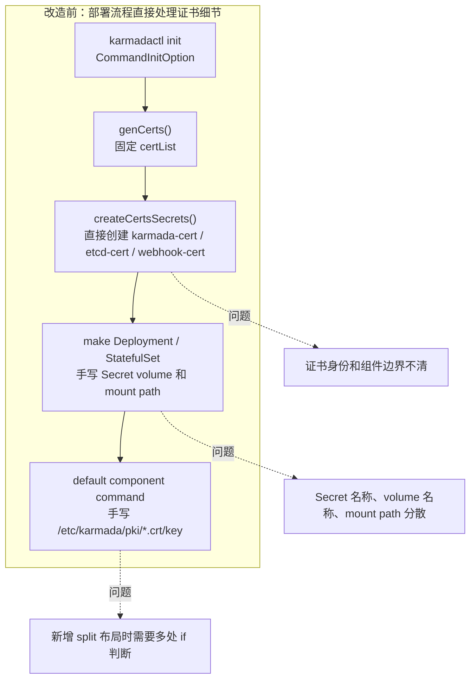
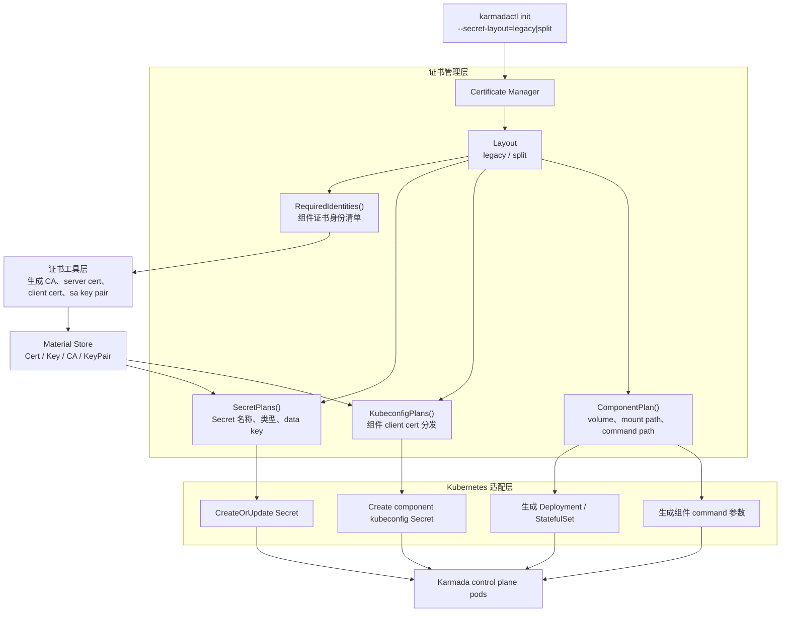

# Day 3：证书管理相关 issue / PR 调研和任务整理

日期：2026-06-29

## 今日目标

同事提示有一个“批量证书管理配置工具”方向的 issue / PR 可以做。今天的目标是先把社区里证书管理相关的 issue、PR 和历史 LFX 项目串起来，判断哪些是背景资料、哪些已经有人在做、哪些是真正适合作为后续贡献点的任务。

本次没有修改 Karmada 功能代码，也没有运行本地集群；结论来自本地仓库搜索、GitHub 公开 API / 页面检索和源码路径对照。

## 调研结论

最值得继续跟进的是 issue [#6051](https://github.com/karmada-io/karmada/issues/6051)：`[Umbrella] [Karmada config && certificates] secret and path naming convention`。

这个 issue 仍然 open，带 `help wanted`，并且已经拆成 config 和 certificate 两个任务。其中 Task two 是 `[Karmada Certificate] secret and path naming convention`，要求统一 Karmada 各组件证书 Secret、volume、mount path 和 secret field 命名。当前最明显的空位是：

- `helm`: `@help-wanted`
- `karmadactl`: 关联过 `#6187`
- `karmada-operator`: 关联 `#6178`

初步判断：如果我要接一个低风险但有实际价值的贡献点，优先从 `#6051` 的 Helm 证书命名规范入手，而不是直接碰正在进行的 `karmadactl` 大 PR。

## 相关背景

| 线索 | 状态 | 和当前任务的关系 |
| --- | --- | --- |
| [community#69](https://github.com/karmada-io/community/issues/69) Karmada Certificate Lifecycle Management | closed | LFX 2024 项目背景，覆盖证书可见性、手动替换指南、证书有效期配置、自动轮转 |
| [#6091](https://github.com/karmada-io/karmada/issues/6091) Self-Signed Certificate Content Standardization | closed | LFX 2025 项目，目标是 8 个 server 组件和 11 个 client 组件使用不同证书内容 |
| [#6269](https://github.com/karmada-io/karmada/pull/6269) Add component certificate identification | merged | #6091 的设计 PR，说明组件证书身份区分方向已经被社区接受 |
| [#6670](https://github.com/karmada-io/karmada/issues/6670) Proposal to Standardize Self-Signed Certificates in Karmada | open | 把 bash 部署方式里的证书标准化同步到其他部署方式 |
| [#6788](https://github.com/karmada-io/karmada/pull/6788) support split secret layout in init command | open | `karmadactl init` 支持 `--secret-layout=split`，当前 PR 仍 open 且有冲突，不适合重复开同类 PR |
| [#6553](https://github.com/karmada-io/karmada/pull/6553) helm: support rotating cert when helm upgrade | open | Helm 证书生命周期相关，但主题是 upgrade 时 rotate cert，不是命名规范 |

> 分析：同事说的“批量证书管理配置工具”不是一个我能精确匹配到的 issue 标题，更像是对证书标准化、split secret layout、证书生命周期管理这些任务的口头概括。后续和同事或 mentor 同步时，应该直接拿 `#6051`、`#6670`、`#6788` 这几个编号确认。

## 本地仓库证据

本地搜索看到证书逻辑主要分布在这些位置：

| 路径 | 作用 |
| --- | --- |
| `hack/deploy-karmada.sh` | bash 部署方式中生成 CA、server cert、client cert，并把证书写入 Secret |
| `hack/util.sh` | 证书生成辅助函数，例如 `util::create_signing_certkey`、`util::create_certkey` |
| `charts/karmada/values.yaml` | Helm chart 的 `certs.mode`、`certs.auto`、`certs.custom`、外部 etcd 证书、agent kubeconfig 等配置入口 |
| `charts/karmada/templates/_helpers.tpl` | Helm chart 中证书 Secret、volume、caBundle 相关模板 helper |
| `operator/pkg/certs/` | operator 侧证书配置、生成、存储和解析逻辑 |
| `pkg/karmadactl/cmdinit/` | `karmadactl init` 安装入口，涉及证书生成、Secret 创建和组件挂载 |
| `docs/proposals/cert/Self-Signed_Certificate_Content_Standardization.md` | 自签证书内容标准化设计文档 |

> 注释：当前证书问题横跨安装脚本、Helm chart、operator 和 CLI。做贡献时必须先选一个安装入口，不要一次性改所有部署方式，否则 review 范围会很大。

## 可选任务拆解

### 任务 A：接 `#6051` Helm 证书命名规范

优先级：最高。

目标是把 Helm chart 的证书 Secret、volume、mount path、secret field 向 issue 中的规范对齐。需要先只做调研和差距分析，再决定是否开 PR。

下一步：

1. 读 `#6051` Task two 的所有示例，提取期望命名表。
2. 对照 `charts/karmada/templates/` 当前实际 Secret、volume、mount path。
3. 输出一张差距表：组件、当前值、期望值、是否会破坏兼容、是否需要迁移策略。
4. 先在 issue 下评论英文分析和拟改范围，确认 maintainer 接受后再动代码。

风险：

- Helm chart 涉及用户升级兼容，不能轻易改现有 Secret 名称。
- 可能需要同时支持 legacy 和 standardized 两种布局，或者通过 value 开关启用。
- 证书 Secret 名称变化会影响多个 Deployment / StatefulSet / APIService / webhook 配置。

### 任务 B：帮忙 review 或续做 `#6788`

优先级：中。

`#6788` 已经实现 `karmadactl init --secret-layout=split`，但 PR 仍 open，且 GitHub API 显示 mergeable state 为 dirty。这个方向和 `#6051` 强相关，但已有作者在做。

下一步：

1. 本地拉取 PR diff，确认冲突点和测试失败点。
2. 不直接开重复 PR；先在 PR 下询问作者 / reviewer 是否接受协助。
3. 可以贡献 review、复现日志、冲突分析或补测试。

### 任务 C：调研 Helm 证书轮转 `#6553`

优先级：中低。

这个 PR 是 Helm upgrade 时是否重新生成证书的问题，属于证书生命周期管理，不是当前命名规范主线。可以作为理解 Helm 证书模板的参考。

下一步：

1. 阅读 `#6553` 改动点。
2. 判断它是否会影响 `#6051` 的 Secret 命名和升级兼容策略。

## 补充：批量系统证书替换分发的初步设计

下午继续对 `karmadactl init` 的证书生成和分发路径做了设计层梳理。RANXI2001反馈的关键点是：不要为了改代码而改代码，应该先抽象出证书管理层，再让安装流程消费这一层的结果。

> 分析：如果只在 `deploy.go`、`command.go`、`deployments.go` 和 `statefulset.go` 里到处加 `if secretLayout == split`，短期可以跑通，但后续 Helm、operator、addons 或证书轮转继续接入时会很难维护。更合理的方向是先把“证书身份、证书材料、Secret 分发计划、组件挂载路径”作为独立模型。

### 设计目标

1. 保持默认 `legacy` 行为不变，避免影响现有 `karmadactl init` 用户。
2. 增加可选 `split` 布局，用系统生成的组件级证书替换当前多组件共用证书的方式。
3. 把证书生成和 Secret 分发从 Kubernetes 部署模板里抽出来，形成可测试的证书管理层。
4. 让部署层只消费证书管理层产出的 plan，不直接关心 Secret 名称、data key、证书文件名。
5. 为后续同步 Helm、operator 或证书轮转留下统一抽象。

### 分层方案

| 层级 | 建议位置 | 职责 | 不应该做的事 |
| --- | --- | --- | --- |
| 证书工具层 | `pkg/karmadactl/cmdinit/cert` | 生成 CA、签发证书、写入 PEM 文件 | 不知道 Karmada 组件名、Secret 名称、volume mount |
| 证书管理层 | `pkg/karmadactl/cmdinit/certmanager` 或 `pkg/karmadactl/cmdinit/certstore` | 定义证书身份、layout、Secret plan、组件 kubeconfig plan、mount path plan | 不直接创建 Deployment / StatefulSet |
| Kubernetes 适配层 | `pkg/karmadactl/cmdinit/kubernetes` | 根据 plan 创建 Secret、生成 command、挂载 volume | 不散落证书命名规则 |

### Mermaid 设计图：改造前后对比

改造前，证书生成、Secret 创建、组件挂载路径和 command 参数都散落在 `kubernetes` 包的安装流程中。每新增一种证书布局，都容易变成在多个文件里重复判断 `legacy` / `split`。



改造后，`karmadactl init` 先选择 layout，再由证书管理层产出统一的证书身份清单和分发计划。Kubernetes 适配层只消费 plan，不再自己决定证书命名规则。



这个抽象引入后的核心变化：

| 维度 | 改造前 | 改造后 |
| --- | --- | --- |
| 证书身份 | 主要依赖固定 `certList`，多个组件复用 `karmada` 证书 | layout 明确定义每个组件需要哪些 server / client / special cert |
| Secret 分发 | `createCertsSecrets()` 直接拼 Secret 数据 | `SecretPlans()` 先生成声明式计划，再由 Kubernetes 适配层创建 |
| 挂载路径 | Deployment / StatefulSet 里直接写 mount path | `ComponentPlan()` 统一给出 volume、mount path 和 command path |
| kubeconfig | 多组件共用 admin 风格证书 | split 布局下按组件分发 client cert |
| 扩展 layout | 多文件散落 `if split` | 新增 layout 实现，部署层逻辑保持稳定 |

初步接口草案：

```go
type Manager struct {
    layout Layout
}

type Layout interface {
    Name() string
    RequiredIdentities() []IdentitySpec
    SecretPlans(store Store, input KubeconfigInput) ([]SecretSpec, error)
    ComponentPlan(component ComponentName) ComponentPlan
}

type IdentitySpec struct {
    ID           IdentityID
    CommonName   string
    Organizations []string
    AltNames     certutil.AltNames
    Signer       SignerID
    Kind         IdentityKind
}

type SecretSpec struct {
    Name string
    Type corev1.SecretType
    Data map[string]MaterialRef
}

type ComponentPlan struct {
    Volumes      []corev1.Volume
    VolumeMounts []corev1.VolumeMount
    Paths        map[PathRole]string
}
```

这里 `MaterialRef` 不是直接保存证书字节，而是指向某个证书材料，例如 `APIServerServer.Cert`、`APIServerServer.Key`、`RootCA.Cert`。这样单测可以只验证 plan，不必每次真的签发证书。

### 证书身份模型

split 布局里不应该只是把同一个 `karmada.crt/key` 拆进多个 Secret，而应该按组件生成证书身份。

建议第一版覆盖 `karmadactl init` 当前会部署的核心组件：

| 类型 | 身份 |
| --- | --- |
| CA | `ca`、`front-proxy-ca`、内部 etcd 的 `etcd-ca` |
| server cert | `karmada-apiserver`、`karmada-aggregated-apiserver`、`karmada-webhook`、内部 etcd `etcd-server` |
| component client cert | `karmada-controller-manager-client`、`karmada-scheduler-client`、`karmada-aggregated-apiserver-client`、`karmada-webhook-client`、`kube-controller-manager-client` |
| etcd client cert | `karmada-apiserver-etcd-client`、`karmada-aggregated-apiserver-etcd-client`、`etcd-client` |
| special client cert | `front-proxy-client`、`karmada-scheduler-grpc` |
| key pair | service account `sa.key` / `sa.pub` |

> 注释：`karmadactl init` 还会创建 descheduler、search、metrics-adapter 等 config Secret 名称，但这些组件不一定在 init 阶段部署。第一版可以为它们生成 component client cert 或保留兼容配置，但不能让核心组件继续依赖 admin 证书。

### Secret 分发模型

split 布局应对齐 `artifacts/deploy/*.yaml` 已经使用的路径和 Secret 命名：

| 组件 | Secret | mount path | data key |
| --- | --- | --- | --- |
| karmada-apiserver server | `karmada-apiserver-cert` | `/etc/karmada/pki/server` | `ca.crt`、`tls.crt`、`tls.key` |
| karmada-apiserver etcd client | `karmada-apiserver-etcd-client-cert` | `/etc/karmada/pki/etcd-client` | `ca.crt`、`tls.crt`、`tls.key` |
| karmada-apiserver front proxy client | `karmada-apiserver-front-proxy-client-cert` | `/etc/karmada/pki/front-proxy-client` | `ca.crt`、`tls.crt`、`tls.key` |
| karmada-apiserver service account key pair | `karmada-apiserver-service-account-key-pair` | `/etc/karmada/pki/service-account-key-pair` | `sa.pub`、`sa.key` |
| karmada-aggregated-apiserver server | `karmada-aggregated-apiserver-cert` | `/etc/karmada/pki/server` | `ca.crt`、`tls.crt`、`tls.key` |
| karmada-aggregated-apiserver etcd client | `karmada-aggregated-apiserver-etcd-client-cert` | `/etc/karmada/pki/etcd-client` | `ca.crt`、`tls.crt`、`tls.key` |
| kube-controller-manager CA | `kube-controller-manager-ca-cert` | `/etc/karmada/pki/ca` | `tls.crt`、`tls.key` |
| kube-controller-manager service account key pair | `kube-controller-manager-service-account-key-pair` | `/etc/karmada/pki/service-account-key-pair` | `sa.pub`、`sa.key` |
| karmada-scheduler estimator client | `karmada-scheduler-scheduler-estimator-client-cert` | `/etc/karmada/pki/scheduler-estimator-client` | `ca.crt`、`tls.crt`、`tls.key` |
| webhook serving cert | `karmada-webhook-cert` | `/var/serving-cert` 或 `/etc/karmada/pki/server` | `tls.crt`、`tls.key`，可附带 `ca.crt` |
| internal etcd server | `etcd-cert` | `/etc/karmada/pki/server` | `ca.crt`、`tls.crt`、`tls.key` |
| internal etcd client | `etcd-etcd-client-cert` | `/etc/karmada/pki/etcd-client` | `ca.crt`、`tls.crt`、`tls.key` |

兼容性策略：

- `legacy` 继续创建并挂载现有 `karmada-cert`、`etcd-cert`、`karmada-webhook-cert`，路径不变。
- `split` 下核心组件不再挂载聚合的 `karmada-cert`。
- `split` 下可以保留一个兼容性 `karmada-cert`，供 addons 或旧逻辑读取 CA / 证书，但它不再是核心组件的主依赖。
- external etcd 场景不生成内部 etcd server cert，只读取用户传入的 external etcd CA / client cert / key 并放入对应 etcd client Secret。

### kubeconfig 分发模型

当前 `createCertsSecrets()` 会给多个组件创建同一份 kubeconfig，里面用的是同一个 `karmada` admin 证书。split 方案应该改成按组件分发：

| config Secret | client cert |
| --- | --- |
| `karmada-aggregated-apiserver-config` | `karmada-aggregated-apiserver-client` |
| `karmada-controller-manager-config` | `karmada-controller-manager-client` |
| `karmada-scheduler-config` | `karmada-scheduler-client` |
| `karmada-webhook-config` | `karmada-webhook-client` |
| `kube-controller-manager-config` | `kube-controller-manager-client` |
| `karmada-descheduler-config` | `karmada-descheduler-client` |
| `karmada-search-config` | `karmada-search-client` |
| `karmada-metrics-adapter-config` | `karmada-metrics-adapter-client` |

外部给用户使用的 `karmada-apiserver.config` 仍保持 admin 证书语义，避免影响用户登录 Karmada API Server 的方式。

### 实现步骤草案

1. 新增证书管理层的数据结构和 legacy / split layout plan，不接入部署流程。
2. 给 layout plan 写单测，先验证 Secret 名称、data key、mount path、组件证书身份是否正确。
3. 改 `karmadactl init` 增加 `--secret-layout=legacy|split`，默认 `legacy`。
4. `RunInit` 中先通过 manager 生成证书身份列表，再读取证书材料，最后创建 Secret plan。
5. 部署层逐步改为从 `ComponentPlan` 获取 command path、volume、volumeMount。
6. 最后补命令行 flag 文档和 focused go test。

### 验证计划

| 验证项 | 命令 / 方法 |
| --- | --- |
| 管理层 plan 单测 | `go test ./pkg/karmadactl/cmdinit/... -run Cert` |
| CLI init 相关单测 | `go test ./pkg/karmadactl/cmdinit ./pkg/karmadactl/cmdinit/kubernetes -count=1` |
| command flag 文档 | `hack/verify-command-line-flags.sh` |
| 不破坏 legacy | 对比默认 `CommandInitOption` 生成的 command、volume、Secret key |
| split 布局正确性 | fake client 检查 Secret 名称和 `StringData` key；deployment/statefulset 检查 mount path |

### 仍需确认的问题

1. 证书管理层包名应该叫 `certmanager`、`certstore` 还是留在 `kubernetes` 包内。
2. split 布局第一版是否只覆盖 `karmadactl init` 部署的核心组件，还是同时覆盖 addons。
3. 保留兼容性 `karmada-cert` 时，里面应该放完整 legacy 证书集，还是只放 CA。
4. `#6788` 作者是否还在推进；如果要上游提交，应先避免和已有 PR 重复竞争。
5. `#6051` 的 Helm 命名规范是否要和 `karmadactl init` 的 split layout 使用完全一致的命名表。

## 今日卡点

| 卡点 | 现象 | 处理 |
| --- | --- | --- |
| GitHub CLI 未登录 | `gh search issues` 提示需要 `gh auth login` 或 `GH_TOKEN` | 改用 GitHub REST API 和网页搜索 |
| GitHub API 匿名限流 | 后续 broad search 出现 rate limit exceeded | 已经拿到核心 issue / PR 信息，后续如果继续做需要配置 `GH_TOKEN` |
| “批量证书管理配置工具”不是精确标题 | 搜索不到同名 issue / PR | 通过证书生命周期、self-signed standardization、split secret layout、secret naming convention 串联判断 |

## CI lint 失败复盘

日期：2026-06-30

在 `feature/cert-manager-layout` 分支把证书管理层初版实现推到 fork 后，push CI 已经跑完。结果不是功能测试失败，而是 `CI Workflow / lint` 失败：

| 项目 | 结果 |
| --- | --- |
| commit | `651cbec29 feat: add cert secret layout for init` |
| fork branch | `ranxi2001/karmada:feature/cert-manager-layout` |
| workflow | `CI Workflow` |
| failed job | `lint` |
| failed step | `hack/verify-staticcheck.sh` |
| 通过项 | `compile`、`unit test`、`codegen`、3 个 e2e、CLI / Chart / Operator Kubernetes 矩阵 |
| skipped | `FOSSA`、`image-scanning` |

### 什么是 lint 规范

这里的 lint 不是业务测试，而是项目的静态代码规范检查。Karmada 在 `.golangci.yml` 里配置了 `golangci-lint`，CI 的 `lint` job 会依次跑：

1. `hack/verify-license.sh`
2. `hack/verify-vendor.sh`
3. `hack/verify-staticcheck.sh`
4. `hack/verify-import-aliases.sh`

本次失败发生在第 3 步。`hack/verify-staticcheck.sh` 实际执行 `golangci-lint run`。它会检查代码风格、导出 API 注释、安全误报、现代 Go 写法、未使用参数等问题。即使 `go test` 全部通过，只要这些规范不满足，CI 仍然失败。

### 本次失败原因

本地复现命令：

```bash
PATH="$(go env GOPATH)/bin:$PATH" golangci-lint run ./pkg/karmadactl/cmdinit/...
```

复现结果：31 条问题，全部集中在新增的 `pkg/karmadactl/cmdinit/certmanager` 包。

| 类型 | 数量 | 说明 |
| --- | --- | --- |
| `revive` | 26 | 新增的导出 const / type / function 缺少 Go doc 注释 |
| `gosec` | 4 | `Secret... = "...-cert"` 这类常量被误判为 hardcoded credentials |
| `modernize` | 1 | 测试里手写循环可以改成 `slices.Contains` |
| `unused-parameter` | 1 | `legacyCertificateNames(externalEtcd bool)` 参数未使用 |

根因不是 Karmada 业务逻辑失败，而是提交前只跑了 `go test ./pkg/karmadactl/...` 和 `hack/verify-command-line-flags.sh`，漏跑了 CI lint 对应的 `hack/verify-staticcheck.sh` / `golangci-lint run`。新增一个公开包时，导出符号和常量名会被 lint 严格检查，不能只靠单测判断。

### 以后避免规则

以后只要新增 Go 包、导出类型、导出常量、命令行 flag、证书/Secret 名称或较大抽象层，提交前必须先跑：

```bash
PATH="$(go env GOPATH)/bin:$PATH" golangci-lint run ./pkg/karmadactl/cmdinit/...
go test ./pkg/karmadactl/... -count=1
hack/verify-command-line-flags.sh
```

如果要推到 fork 跑完整 push CI，再跑：

```bash
python3 /home/karmada/.agents/skills/karmada-push-ci-check/scripts/check_push_ci.py \
  --repo ranxi2001/karmada \
  --branch "$(git rev-parse --abbrev-ref HEAD)" \
  --sha "$(git rev-parse HEAD)" \
  --show-jobs failed
```

本次补救计划：

1. 给 `certmanager` 包所有导出符号补 Go doc 注释，或者把没有跨包必要的符号改成未导出。
2. 对 gosec 误判的 Secret 名称常量做合理处理：优先通过更清晰的命名/分组降低误报；必要时对确定安全的常量加局部 `#nosec G101`，但要写明这是 Kubernetes Secret 对象名，不是密钥内容。
3. 删除或真正使用 `legacyCertificateNames` 的 `externalEtcd` 参数。
4. 测试 helper 改用 `slices.Contains`。
5. 复跑 `golangci-lint run ./pkg/karmadactl/cmdinit/...`，通过后再 amend / force-with-lease 推 fork。

## PR 审阅准备

日期：2026-06-30

当前功能分支：`feature/cert-manager-layout`

当前提交：`eb02bde96cbd88697bb808e2cb56137070d18a4c`

fork push CI：已通过。18 个 check runs 中 16 个 success，2 个 skipped（`FOSSA`、`image-scanning`），0 个失败。

### 审阅辅助图

这些图用于和 reviewer / mentor 解释证书管理方向，但必须区分“当前 PR 已实现内容”和“后续演进方案”：

| 图片 | 用途 | 说明 |
| --- | --- | --- |
| [现有证书管理数据流图](karmada证书管理数据流图.png) | 背景说明 | 解释当前内置证书生成、控制面证书使用链路和 agent 证书轮换链路 |
| [Karmada 证书管理方案数据流图](Karmada证书管理方案-数据流图.png) | 长期方案 | 展示未来可能的策略 API、controller、cert-manager 集成、多集群 Secret 分发、监控告警 |
| [Karmada 证书管理方案对比分析图](Karmada证书管理方案对比分析-数据流图.png) | review 对比 | 对比 built-in 方案和 cert-manager-layout 长期方案的差异、价值和边界 |

> 重要边界：当前 PR 不是完整的 cert-manager 集成，也没有新增 CRD、controller 或证书轮换能力。当前 PR 做的是 `karmadactl init` 内部的证书布局抽象和可选 `split` Secret layout，为后续统一证书治理打基础。

### 当前 PR 已实现内容

1. 新增 `pkg/karmadactl/cmdinit/certmanager` 证书管理层，抽象 layout、证书身份、Secret plan、kubeconfig plan、组件 volume / mount / command path。
2. `karmadactl init` 新增可选参数 `--secret-layout=legacy|split`，默认仍为 `legacy`。
3. `legacy` 布局保持现有行为：继续使用聚合的 `karmada-cert`、`etcd-cert`、`karmada-webhook-cert`。
4. `split` 布局下，为核心组件生成并分发组件级 Secret，例如 `karmada-apiserver-cert`、`karmada-apiserver-etcd-client-cert`、`karmada-aggregated-apiserver-cert`、`karmada-webhook-cert`、service account key pair 等。
5. 部署层不再手写证书 Secret / mount path / command path，而是消费 `ComponentPlan`。
6. split 布局下 kubeconfig Secret 使用组件对应 client cert，不再都复用 admin 风格的 `karmada` 证书。
7. external etcd 场景保留外部 etcd 证书读取逻辑，不生成内部 etcd server identity / Secret。
8. 保留一个 legacy-compatible `karmada-cert`，降低 addons 或旧逻辑读取证书材料的兼容风险。

### 当前 PR 未实现内容

| 未实现项 | 原因 |
| --- | --- |
| cert-manager CRD / Issuer / Certificate 集成 | 这是长期方案，当前 PR 先做 `karmadactl init` 的布局抽象 |
| 证书自动轮换 | 当前 PR 只改变生成和分发布局，不改变证书生命周期控制器 |
| Helm chart / operator 同步改造 | scope 太大，应该在后续 PR 分别处理 |
| 控制面热加载或自动重启 | 当前组件仍按现有证书加载方式启动 |
| 新的 Karmada API 类型 | 本 PR 只影响 CLI init 和内部安装逻辑 |

### 代码修改文件解释

| 文件 | 修改类型 | 解释给 reviewer 的重点 |
| --- | --- | --- |
| `pkg/karmadactl/cmdinit/certmanager/types.go` | 新增 | 定义证书布局计划的数据模型：`IdentitySpec`、`SecretSpec`、`KubeconfigSpec`、`ComponentPlan`、`MaterialRef` 等。这是抽象层的核心，不直接创建 Kubernetes 对象。 |
| `pkg/karmadactl/cmdinit/certmanager/layout.go` | 新增 | 实现 `legacy` 和 `split` 两种 layout plan。legacy 保持现有聚合 Secret 行为；split 定义组件级 Secret、证书身份、kubeconfig client cert、volume mount 和 command path。 |
| `pkg/karmadactl/cmdinit/certmanager/layout_test.go` | 新增 | 覆盖 legacy plan、split plan、external etcd split plan 和非法 layout，确保 plan 层可独立测试。 |
| `pkg/karmadactl/cmdinit/kubernetes/cert_plan.go` | 新增 | Kubernetes 适配层：把 `certmanager.Plan` 转成 `corev1.Volume` / `VolumeMount`，生成 split 额外证书和 key pair，读取证书材料，并处理 `MaterialRef`。 |
| `pkg/karmadactl/cmdinit/cmdinit.go` | 修改 | 注册 `--secret-layout` flag，默认 `legacy`，可选值来自 `certmanager.SupportedLayouts()`。 |
| `pkg/karmadactl/cmdinit/config/types.go` | 修改 | 在 init config 中增加 `secretLayout` 字段，支持通过配置文件选择 layout。 |
| `pkg/karmadactl/cmdinit/config/config_test.go` | 修改 | 覆盖 `secretLayout: split` 配置解析。 |
| `pkg/karmadactl/cmdinit/kubernetes/deploy.go` | 修改 | `CommandInitOption` 增加 `SecretLayout`；`RunInit` 先构建 certificate plan，再生成证书、读取材料、创建 Secrets；`createCertsSecrets` 改为消费 `SecretSpec` 和 `KubeconfigSpec`。 |
| `pkg/karmadactl/cmdinit/kubernetes/command.go` | 修改 | 各控制面组件 command 中证书路径从 plan 获取，避免在命令构造里散落 legacy/split 判断。 |
| `pkg/karmadactl/cmdinit/kubernetes/deployments.go` | 修改 | Deployment 的 volumes / volumeMounts 从 `ComponentPlan` 获取，默认 legacy 路径不变，split 时切换为组件级 Secret。 |
| `pkg/karmadactl/cmdinit/kubernetes/statefulset.go` | 修改 | etcd StatefulSet 的证书 volume / mount 从 plan 获取，保持 etcd data/config volume 逻辑不变。 |
| `pkg/karmadactl/cmdinit/kubernetes/deploy_test.go` | 修改 | 新增 split Secret 创建测试，确认组件 Secret 和 kubeconfig Secret 能按 plan 创建。 |
| `pkg/karmadactl/cmdinit/kubernetes/deployments_test.go` | 修改 | 新增 split 布局下 apiserver command path 和 Secret volume 测试。 |
| `docs/command-line-flags/karmadactl_init.md` | 生成更新 | `hack/verify-command-line-flags.sh` 生成的新 flag 文档，展示 `--secret-layout`。 |

### Reviewer 重点关注点

| 关注点 | 希望 reviewer 帮忙确认 |
| --- | --- |
| 默认兼容性 | `--secret-layout` 默认 `legacy`，现有用户是否应完全无感。重点看 legacy command path、volume、Secret key 是否维持不变。 |
| split 命名规范 | Secret 名称、volume 名称、mount path、data key 是否与 `artifacts/deploy/*.yaml` 和 #6051 期望方向一致。 |
| 证书身份粒度 | component client cert 当前仍使用 `system:masters` group，是否需要在后续 PR 收窄权限。 |
| external etcd | split + external etcd 时是否正确复用用户传入的 CA / client cert / key，不生成内部 etcd server Secret。 |
| legacy-compatible `karmada-cert` | split 下保留兼容 Secret 是否合理，里面应该放完整 legacy 材料还是只保留必要 CA。 |
| abstraction boundary | `certmanager` 是否是合适包名；plan 层和 Kubernetes 适配层的职责是否清晰。 |
| release note | 新增用户可见 flag，release note 是否需要写明默认行为不变。 |

### 本地验证和 fork CI

本地已执行：

```bash
PATH="$(go env GOPATH)/bin:$PATH" golangci-lint run ./pkg/karmadactl/cmdinit/...
PATH="$(go env GOPATH)/bin:$PATH" hack/verify-staticcheck.sh
hack/verify-import-aliases.sh
go test ./pkg/karmadactl/... -count=1
hack/verify-command-line-flags.sh
git diff --check
```

fork push CI：

```text
repo: ranxi2001/karmada
branch: feature/cert-manager-layout
sha: eb02bde96cbd88697bb808e2cb56137070d18a4c
summary: 2 skipped, 4 success

CI Workflow: success
CLI: success
Chart: success
Operator: success
FOSSA: skipped
image-scanning: skipped
```

细分 check-run 结果：18 个 check runs，16 个 success，2 个 skipped，0 个 failed。

### 拟 PR 文案（未发布）

> 注意：下面只是准备稿。根据本地规则，不能在没有用户明确确认前创建 upstream PR。

````md
**What type of PR is this?**

/kind feature

**What this PR does / why we need it**:

This PR adds a certificate Secret layout abstraction for `karmadactl init` and introduces an optional `--secret-layout=legacy|split` flag.

The default behavior remains `legacy`, so existing `karmadactl init` users continue to use the current aggregated certificate Secrets.

When `--secret-layout=split` is selected, generated certificate material is distributed into component-scoped Secrets. The Kubernetes deployment layer consumes a certificate plan for Secret names, data keys, volume mounts, and command-line certificate paths instead of hard-coding those details in each workload template.

The PR also adds config-file support via `spec.secretLayout`, keeps a legacy-compatible `karmada-cert` Secret for compatibility, and handles external etcd by reusing user-provided etcd certificate material.

**Which issue(s) this PR fixes**:

N/A

Part of #6051
Related to #6670

**Special notes for your reviewer**:

- Scope: `karmadactl init` certificate generation and distribution only.
- Not included: cert-manager CRDs, certificate rotation controller, Helm chart changes, operator changes, or hot reload/restart behavior.
- Compatibility: `legacy` remains the default layout.
- Review focus:
  - Secret names, data keys, mount paths, and command paths for `split`.
  - Whether keeping a legacy-compatible `karmada-cert` Secret in `split` is the right compatibility bridge.
  - Whether component client certificate identities and groups should be narrowed in a follow-up.
  - External etcd behavior in `split`.
- AI assistance: Used Codex to inspect code paths, draft tests, and prepare this PR. I reviewed and validated the changes.

Tests:

```bash
PATH="$(go env GOPATH)/bin:$PATH" golangci-lint run ./pkg/karmadactl/cmdinit/...
PATH="$(go env GOPATH)/bin:$PATH" hack/verify-staticcheck.sh
hack/verify-import-aliases.sh
go test ./pkg/karmadactl/... -count=1
hack/verify-command-line-flags.sh
git diff --check
```

Fork push CI for `ranxi2001/karmada@eb02bde96cbd88697bb808e2cb56137070d18a4c` passed:

- CI Workflow: success
- CLI: success
- Chart: success
- Operator: success

**Does this PR introduce a user-facing change?**:

```release-note
karmadactl: Added `--secret-layout=split` to `karmadactl init` to optionally distribute generated certificates into component-scoped Secrets while keeping the default legacy layout unchanged.
```
````

### 拟 upstream issue 文案（未发布）

> 注意：下面是发往 `karmada-io/karmada` 的英文 issue 草稿。由于草稿中会直接 mention maintainer，必须先让用户确认目标和完整文本，不能自动发布。

建议目标：

1. 如果 maintainer 接受单独设计提案：新建 issue。
2. 如果 maintainer 认为 #6670 已覆盖该主题：把下面内容改成 #6670 评论。
3. 如果 maintainer 希望直接 review 现有实现：把重点收敛为 #6788 的设计评论，而不是开重复 PR。

标题：

```text
Proposal: plan-based split certificate Secret layout for karmadactl init
```

正文：

```md
**What would you like to be added**:

I would like to propose a plan-based certificate Secret layout abstraction for `karmadactl init`, related to #6051 and #6670, and taking into account the existing implementation attempt in #6788.

The user-facing entry would be an optional layout selector:

- `--secret-layout=legacy`: keep the current aggregated Secret behavior as the default.
- `--secret-layout=split`: distribute generated certificate material into component-scoped Secrets, while making workload commands, volumes, mounts, and kubeconfigs consume a declarative certificate plan.

The proposed internal boundary is:

- A certificate layout plan layer that describes identities, Secret names, Secret data keys, kubeconfig contents, component volume mounts, and command-line certificate paths.
- A Kubernetes adapter layer that creates Secrets, generates component kubeconfigs, and translates component plans into Deployment/StatefulSet specs.
- The existing `karmadactl init` flow selects a layout and passes the plan to deployment generation.

For split mode, the initial scope would be `karmadactl init` only:

- Split control-plane server/client material into component-scoped Secrets.
- Give scheduler/descheduler their own scheduler-estimator client certificate Secret.
- Keep webhook serving certificates in their own Secret.
- Keep internal etcd server/client certificates separate.
- For external etcd, keep using user-provided CA/client certificate material instead of generating internal etcd server material.
- Keep `legacy` as the default behavior for backward compatibility.

Non-goals for the first PR:

- No cert-manager CRDs or controller integration.
- No automatic certificate rotation or hot reload behavior.
- No Helm chart or operator changes in the same PR.
- No RBAC/client identity tightening unless maintainers want it included with the layout change.

Design overview:

The diagrams below are for review context. They describe the broader certificate-management direction and the current-vs-future data flow. The first implementation proposed by this issue would only take the `karmadactl init` layout-plan subset; it would not introduce the CRDs, controllers, or cert-manager integration shown in the longer-term view.

The first diagram shows the long-term certificate management model: policy/plan/inventory APIs, a controller layer, optional cert-manager/CA integration, distribution to member clusters, and observability. For this issue, the relevant part is the layout-plan boundary between certificate generation, Secret distribution, and workload consumption.


The second diagram compares the current built-in certificate flow with the longer-term automated certificate-management direction. For this issue, the relevant change is moving from scattered hard-coded Secret/path handling to a layout plan consumed by the `karmadactl init` deployment generation code.


I prepared a prototype branch to make the design concrete:

- Branch: https://github.com/ranxi2001/karmada/tree/feature/cert-manager-layout
- Commit: https://github.com/ranxi2001/karmada/commit/eb02bde96cbd88697bb808e2cb56137070d18a4c
- Fork push CI: passed for CI Workflow, CLI, Chart, and Operator; FOSSA and image-scanning were skipped.

Local checks run on the prototype:

- `golangci-lint run ./pkg/karmadactl/cmdinit/...`
- `hack/verify-staticcheck.sh`
- `hack/verify-import-aliases.sh`
- `go test ./pkg/karmadactl/... -count=1`
- `hack/verify-command-line-flags.sh`
- `git diff --check`

**Why is this needed**:

The current `karmadactl init` certificate handling mixes certificate identity, Secret layout, Secret data keys, volume mounts, kubeconfig generation, and command-line paths across the Kubernetes deployment generation code. This makes the naming convention work in #6051 and the certificate standardization goal in #6670 harder to evolve safely.

A plan-based boundary would keep the default behavior compatible while giving `karmadactl init` a clearer path to support split certificate distribution. It should also reduce scattered `legacy`/`split` conditionals in Deployment and StatefulSet builders.

The main design questions I would like to clarify before opening or continuing an upstream PR are:

1. Is a plan-based certificate layout boundary acceptable for `karmadactl init`?
2. Should the first implementation target only `karmadactl init`, or should Helm/operator alignment be designed in the same issue?
3. Should split mode keep a legacy-compatible `karmada-cert` Secret temporarily for compatibility?
4. Should component client certificate groups/privileges be narrowed in the layout PR, or left for a follow-up?
5. Since #6788 is already open, would maintainers prefer continuing that PR, opening a smaller replacement PR with this abstraction, or first discussing the design under #6670?

@zhzhuang-zju, could you help review whether this direction is reasonable before I proceed with upstream code work?
```

发布前检查：

- 不能写 `Fixes #6670`，因为这个 issue 草稿只是设计讨论，不应该自动关闭已有 proposal。
- 必须明确 #6788 已经存在，避免社区认为我们没有尊重已有贡献。
- 如果发布为 #6670 评论，开头要改成 `Thanks for the proposal. I explored a plan-based implementation direction...`，并删掉 enhancement issue 模板标题。
- 如果发布为新 issue，保留 `**What would you like to be added**` / `**Why is this needed**` 两段，符合 `.github/ISSUE_TEMPLATE/enhancement.md`。
- 两张图片链接已验证为 `200 image/png`。如果从 GitHub Web UI 发布，最好上传为 GitHub issue attachments，再把 raw fork 图片链接替换为 `github.com/user-attachments/assets/...`，避免未来 `intern` 分支改名或图片移动导致链接失效。
- 图片是长期方向说明，发布时必须保留 `Non-goals` 和 `Design overview` 的 scope 说明，避免 reviewer 误解为本 issue 要一次性引入 CRD/controller/cert-manager 集成。

## 明日最小行动

1. 先让用户确认 upstream issue/comment 的目标和完整英文文本，再决定是否发布并 mention `@zhzhuang-zju`。
2. 如果发布为新 issue，使用 enhancement 模板；如果维护者认为重复，则转为 #6670 或 #6788 评论。
3. 在获得设计方向前，不急着创建 upstream PR；已有 fork prototype 只作为设计证据。
4. 如果 mentor 仍建议先接 `#6051` Helm 部分，则回到 Helm Secret / volume / mount path 差距表。
5. 如果 mentor 要求继续基础学习，则回到 Day 2 计划，深追 `samples/nginx` 传播链路。
