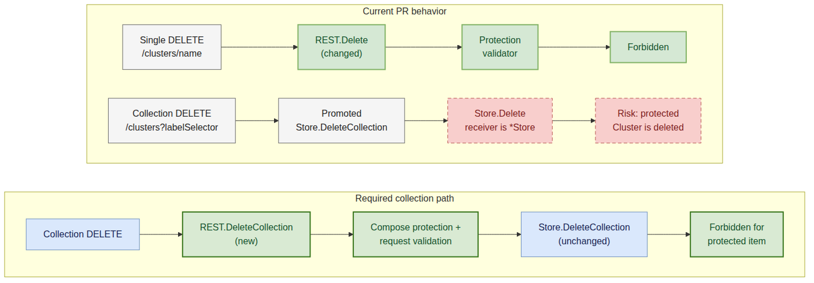

# Day 30: PR #7779 Cluster Deletion Protection Review

## Review target

- Issue: [karmada-io/karmada#7751](https://github.com/karmada-io/karmada/issues/7751)
- PR: [karmada-io/karmada#7779](https://github.com/karmada-io/karmada/pull/7779)
- PR head: `0b3b3fac9161dfddc4ed08c0cc5fe627c588ccd9`
- PR base: `1f07b77c35ccac02501a4d0cd4f0bb525d26b887`
- Review baseline: `upstream/master@4926be09b`
- Scope: 3 files, 279 additions, 2 deletions.
- Upstream action: user-approved line review published as [discussion_r3620214882](https://github.com/karmada-io/karmada/pull/7779#discussion_r3620214882).

## Original issue and production contract

This is a normal supported operation, not a mock-only edge case. The accepted deletion-protection proposal names accidental `Cluster` deletion as a motivating case and promises that a resource labeled `resourcetemplate.karmada.io/deletion-protected=Always` rejects deletion. Issue #7751 shows why the existing webhook cannot enforce that promise: `Cluster` is served by `karmada-aggregated-apiserver`, while the deletion-protection webhook is registered on the main Karmada API server.

Putting the check in the aggregated API server's Cluster REST storage is therefore the right solution layer. The PR also correctly keeps the incoming delete validator and matches the existing `Always` label semantics. The remaining problem is that it protects only one of the two delete operations exposed by the Cluster API.

## Blocking finding

### P1: Collection deletion bypasses the new protection

The PR adds `REST.Delete`, but `REST` embeds `*genericregistry.Store`. The embedding promotes `Store.DeleteCollection`, so `REST` still implements `rest.CollectionDeleter` without a Cluster-specific override.

The complete supported call path is:

1. The generated `ClusterInterface` exposes `DeleteCollection` in `pkg/generated/clientset/versioned/typed/cluster/v1alpha1/cluster.go:46`.
2. The API installer detects `rest.CollectionDeleter` and registers the cluster-scoped collection DELETE route in `vendor/k8s.io/apiserver/pkg/endpoints/installer.go:342-343,528`.
3. The HTTP handler calls `r.DeleteCollection(...)` in `vendor/k8s.io/apiserver/pkg/endpoints/handlers/delete.go:328-330`.
4. Method promotion selects `(*genericregistry.Store).DeleteCollection` because the PR does not define `(*REST).DeleteCollection`.
5. That method invokes `e.Delete(...)` in `vendor/k8s.io/apiserver/pkg/registry/generic/registry/store.go:1279-1289`. Here `e` is a `*Store`, so the call cannot dispatch back to the outer `REST.Delete` override.

The result is that `validateDeletionProtection` never enters this path. A normal client call with a label selector that matches a protected Cluster can still delete it:

```go
karmadaClient.ClusterV1alpha1().Clusters().DeleteCollection(
    ctx,
    metav1.DeleteOptions{},
    metav1.ListOptions{LabelSelector: "review.example/target=protected"},
)
```



Editable source: [day30-pr7779-deletecollection-bypass.mmd](day30-pr7779-deletecollection-bypass.mmd)

This leaves the issue and release note only partially satisfied: single-object deletion is protected, while collection deletion is not.

## Minimal causal fix

Keep the PR's current storage-layer design and add only the missing verb-specific wrapper:

```go
var _ rest.CollectionDeleter = &REST{}

func (r *REST) DeleteCollection(
    ctx context.Context,
    deleteValidation rest.ValidateObjectFunc,
    options *metav1.DeleteOptions,
    listOptions *metainternalversion.ListOptions,
) (runtime.Object, error) {
    return r.Store.DeleteCollection(
        ctx,
        composeDeleteValidations(validateDeletionProtection, deleteValidation),
        options,
        listOptions,
    )
}
```

The interface assertion documents the intended API surface but is not the fix by itself. The behavior regression should issue `DeleteCollection` with a selector that matches only one protected Cluster, expect a Forbidden/error response, and verify the Cluster still exists. Kubernetes documents collection deletion as non-atomic, so matching only the protected target keeps the test's expected state unambiguous.

## Test and solution review

- `TestValidateDeletionProtection` covers label values, Forbidden classification, wrong object type, and typed nil, but it tests only the helper.
- `TestComposeDeleteValidations` proves ordering and short-circuit behavior, but not REST method routing.
- The E2E case calls `Clusters().Delete(...)` only, so it cannot detect a `DeleteCollection` bypass.
- For single-object deletion, the PR preserves `DeleteOptions`, the request validator, preconditions, finalizers, dry-run behavior, and API error propagation by delegating to `Store.Delete`.
- No second production correctness blocker was found. The E2E cleanup could wait for final `NotFound` after its fallback delete, but that is test hygiene rather than a reason to reject the storage fix.

## Verification

- `go test ./pkg/registry/cluster/storage -count=1`: passed.
- `go test ./pkg/registry/cluster/... -count=1`: passed.
- `go test ./test/e2e/suites/base -run '^$' -count=1`: compiled successfully with no selected tests.
- `git diff --check`: passed.
- The PR is eight commits behind current `upstream/master`, but those commits do not touch its three changed files; `git merge-tree --write-tree upstream/master upstream/pr-7779` completed without conflicts.
- Upstream unit, lint, codegen, compile, DCO, v1.34 E2E, and v1.35 E2E checks passed. The v1.36 E2E job failed later in an unrelated Docker container-kill/etcd cleanup path; the new protected-Cluster case had already passed, so that red check is not evidence for or against the collection-delete finding.
- Two independent source reviews converged on the same collection-delete bypass and found no second production blocker.

## Exact upstream review comment

Target: PR #7779, `pkg/registry/cluster/storage/storage.go`, right side of line 115 at head `0b3b3fac9161dfddc4ed08c0cc5fe627c588ccd9`.

Canonical published body: [day30-pr7779-review-comment.md](day30-pr7779-review-comment.md)

The comment follows `observation -> concrete call path -> impact -> requested change`. The Mermaid diagram replaces a longer method-promotion explanation with matching current and required paths.

## Publication record

- User approved the exact target and body on 2026-07-21.
- Published line review: [discussion_r3620214882](https://github.com/karmada-io/karmada/pull/7779#discussion_r3620214882)
- Review state: `COMMENTED`; review ID `4742244969`.
- API readback verified author `ranxi2001`, commit `0b3b3fac9161dfddc4ed08c0cc5fe627c588ccd9`, path `pkg/registry/cluster/storage/storage.go`, right-side line 115, and byte-for-byte body equality with `day30-pr7779-review-comment.md` (2116 bytes).
- No summary review body, maintainer mention, label, assignment, approval, or other PR state was added.
