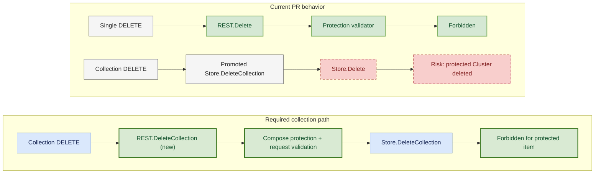

This only protects single-object deletion. Because `REST` embeds `*genericregistry.Store`, it still promotes `Store.DeleteCollection` and implements `rest.CollectionDeleter`. The API installer therefore exposes collection DELETE for `/clusters`, and `Store.DeleteCollection` calls `e.Delete` with a `*Store` receiver. That call cannot return to the outer `REST.Delete` override, so `validateDeletionProtection` is skipped.

This is a supported client path: `ClusterInterface` exposes `DeleteCollection`, so a label selector matching a protected Cluster can still delete it. Could we override `REST.DeleteCollection` and pass the same composed validator to `r.Store.DeleteCollection`? Please add a regression whose selector matches only a protected Cluster, then assert the request is rejected and the Cluster remains; using one match also avoids the API's documented non-atomic partial-deletion behavior.
