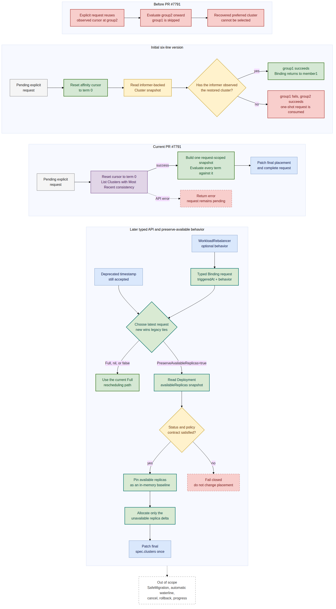
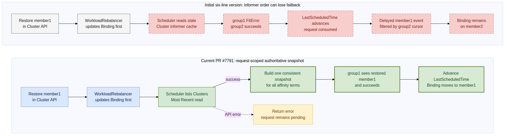

# Day 31：WorkloadRebalancer API 设计与分阶段开发方案

日期：2026-07-21

## 先说人话

今天不再等 PR #7662 的作者先重写 proposal。我们采用 maintainer 已经给出的收敛方向，但不把 API、controller、scheduler 和二十余个生成文件塞进第一个 PR。

先用一个 10 副本的例子说明最终目标：

```text
member1：当前分配 6，available 4
member2：当前分配 4，available 4

PreserveAvailableReplicas=true：
  固定 member1:4、member2:4 作为不可降低的基线；
  scheduler 只重新分配剩余 2 个 unavailable 副本；
  最后只 patch 一次完整结果。
```

不能先把 Binding 临时改成 `4/4` 再调度。那会真的把 10 副本中间缩成 8 个；如果第二步失败，系统会停在错误的半成品状态。正确做法是在 scheduler 内存中计算基线和缺口，成功后一次性写最终 `spec.clusters`。

开发按两个可独立审阅的行为 PR 推进：

1. 第一个 PR 只完成 #5070：显式完整重调度不仅重算副本，还从第一个顶层 `clusterAffinities` term 重新搜索，并为这次一次性请求读取 current Cluster snapshot。它没有 API 变更，边界仍只在 scheduler 内部，而且历史 maintainer 已认可 scheduler-owned 的实现位置。
2. 第二个 PR 才端到端加入 typed `Reschedule` API 和 `PreserveAvailableReplicas`。API、controller、scheduler、CRD/OpenAPI、单元测试和 E2E 必须一起交付，不能拆成会被用户调用却没有效果的半成品。

这不是继续纠结原 issue 的边界，而是把 maintainer 的设计按可验证行为落地。#7621 的 SafeMigration、自动水位和无中断迁移继续保持开放，本系列不声称修复它们。

## 当前依据与决策强度

| 依据 | 已证明什么 | 没有证明什么 |
| --- | --- | --- |
| [RainbowMango 对 PR #7662 的 review](https://github.com/karmada-io/karmada/pull/7662#pullrequestreview-4742653446) | WorkloadRebalancer 应收敛为 typed reschedule；legacy timestamp 保留；较新请求生效；legacy/nil 表示完整重调度；SafeMigration 移出范围 | 这仍是 `COMMENTED` 设计建议，不是已合并 API；相同时间戳、行为可变性、availability 数据合同没有写全 |
| [Issue #5070](https://github.com/karmada-io/karmada/issues/5070) | on-prem A -> public-cloud B -> A 恢复后显式 failback 是真实公司业务；maintainer 认可 reset scheduling group 的方向 | 不代表自动 failback，也不保证迁移过程无中断 |
| [历史 PR #5425](https://github.com/karmada-io/karmada/pull/5425) | 在 scheduler 的 RB/CRB affinity 入口根据现有 trigger 把 index 设为 0，是历史 maintainer 建议过的最小实现 | 旧分支有污染、编译和测试问题，不能 cherry-pick 或直接 revive |
| 当前源码 `upstream/master@4926be09b` | Full 只让动态副本 assignment 进入 `Fresh`；外层仍从 `SchedulerObservedAffinityName` 开始 | 当前代码还没有 typed request，也没有 preserve-available 下界算法 |

本报告把 maintainer 没写全的部分收敛成实现默认值，后续以 draft PR 和精确测试暴露这些选择；如果 maintainer 反对某项公开 API 合同，在第二个 PR 合并前调整，不阻塞第一个 #5070 PR。

## 目标流程



- [可编辑 Mermaid 源](day31-workload-rebalancer-api-development-plan.mmd)

图同时回答两个问题：#7791 为什么从 6 行 cursor 修复扩展为 request-scoped Cluster snapshot，以及当前 legacy 请求以后如何演进为 typed 完整重调度和保留 available 副本两条路径。

颜色含义：灰色是既有入口，蓝色是保留的职责，深绿色是 cursor 修复，紫色是 current snapshot 修复，青绿色是第二个 PR，黄色是条件判断，红色是缺陷或失败路径。

本机没有预装 `mmdc`，因此使用 repo-local renderer 的显式 `npx` fallback 和固定版本 `@mermaid-js/mermaid-cli@11.16.0` 渲染白底 PNG；更新后的主图尺寸为 `1534x2783`，未发现文字裁切、节点重叠或空白画布。

## API 设计

### 类型归属

`Reschedule` 和唯一一份 `RescheduleBehavior` 放在 `pkg/apis/work/v1alpha2`。Binding 是 scheduler 的执行合同；WorkloadRebalancer 只是请求生产者，因此 `apps/v1alpha1 -> work/v1alpha2 -> policy/v1alpha1` 的依赖方向合理且没有 import cycle。

不复制 apps/work 两份 behavior，也不新增 common API package，否则相同字段以后容易发生 schema 漂移。

```go
// pkg/apis/work/v1alpha2/binding_types.go
type RescheduleBehavior struct {
    // PreserveAvailableReplicas keeps replicas currently reported available
    // in their assigned clusters and reschedules only the unavailable part.
    // Defaults to false.
    // +kubebuilder:default=false
    // +optional
    PreserveAvailableReplicas *bool `json:"preserveAvailableReplicas,omitempty"`
}

type Reschedule struct {
    // +required
    TriggeredAt metav1.Time `json:"triggeredAt"`

    // Nil means complete rescheduling.
    // +optional
    Behavior *RescheduleBehavior `json:"behavior,omitempty"`
}

type ResourceBindingSpec struct {
    // existing fields...

    // +optional
    Reschedule *Reschedule `json:"reschedule,omitempty"`

    // Deprecated: use Reschedule.TriggeredAt instead.
    // +optional
    RescheduleTriggeredAt *metav1.Time `json:"rescheduleTriggeredAt,omitempty"`
}
```

`ResourceBindingSpec` 已同时被 `ResourceBinding` 和 `ClusterResourceBinding` 使用，因此不再复制一套 CRB API。

```go
// pkg/apis/apps/v1alpha1/workloadrebalancer_types.go
type WorkloadRebalancerSpec struct {
    Workloads []ObjectReference `json:"workloads"`

    // Nil means complete rescheduling.
    // +optional
    Reschedule *workv1alpha2.RescheduleBehavior `json:"reschedule,omitempty"`

    TTLSecondsAfterFinished *int32 `json:"ttlSecondsAfterFinished,omitempty"`
}
```

用户 YAML：

```yaml
apiVersion: apps.karmada.io/v1alpha1
kind: WorkloadRebalancer
metadata:
  name: preserve-serving-replicas
spec:
  workloads:
    - apiVersion: apps/v1
      kind: Deployment
      namespace: default
      name: demo
  reschedule:
    preserveAvailableReplicas: true
```

不填写 `spec.reschedule`、填写 `{}` 或显式写 `false` 都表示 Full。这里的 nil 是行为默认值，不是“没有请求”；WorkloadRebalancer 对象本身就是请求。

### 请求仲裁

Binding 侧需要一个共享 helper，把新旧字段规范化为同一种有效请求，controller、scheduler reconcile、outer affinity 和 replica assignment 都使用同一结果，不能各写一套时间比较。

| Binding 状态 | 有效请求 |
| --- | --- |
| 只有 legacy timestamp | legacy Full |
| 只有 typed request | typed behavior |
| 两者都有且 typed 更新 | typed request |
| 两者都有且 legacy 更新 | legacy Full |
| 两者时间完全相同 | typed request 胜出，避免 deprecated Full 静默覆盖新 behavior |
| trigger 不晚于 `lastScheduledTime` | 已消费，不再执行 |
| `lastScheduledTime=nil` | 保留 current 行为：先完成首次调度；没有已确认 placement 时 preserve 不制造第二套初始调度 |

两个 typed 请求如果时间完全相同但 behavior 不同，没有足够字段建立全序。第一版采用“现有 typed 请求胜出”的幂等规则，不让并发 writer 来回覆盖；若社区要求严格多请求顺序，后续必须增加 request ID，而不是继续猜时间。

### WorkloadRebalancer behavior 不允许事后修改

当前 controller 使用 WorkloadRebalancer `creationTimestamp` 作为稳定 trigger，而且成功 workload 不会因为 behavior 被编辑而重新执行。若允许原地把 `false` 改成 `true`，API update 会成功，但 scheduler 看不到新时间戳，属于静默 no-op。

因此第二个 PR 的默认设计是：`spec.reschedule` 仅在创建时确定，之后 immutable；`workloads` 和 `ttlSecondsAfterFinished` 仍维持现有可更新行为。优先用 CRD transition validation 表达，不为一个字段新建 webhook。生成后必须用有效/无效 update 用例验证 CEL，而不是只相信 marker。

需要另一种 behavior 时，创建新的 WorkloadRebalancer。这样一个对象对应一个稳定请求，controller retry 仍然幂等。

## 行为设计

### Full：第一个 PR 即可落地

完整重调度要丢弃两层历史：

1. `spec.clusters` 表示的旧副本分配，由现有 `Fresh` assignment 处理；
2. `status.schedulerObservingAffinityName` 表示的顶层 affinity 搜索书签，由第一个 PR 在内存中把起始 index 设为 0。

controller 不清空 scheduler-owned status。scheduler 仍按 A、B、C 顺序尝试，成功后把实际选中的 affinity name 写回 status；如果 A 仍不可用，自然继续回到 B。

Full 保留现有的 ClusterAffinity、Duplicated、Static/Dynamic/Aggregated、Overflow 和非 workload 路径。第一个 PR 不引入任何新 API 或生成文件。

### PreserveAvailableReplicas：第二个 PR 端到端实现

第一版只支持 `apps/v1 Deployment` 的两种 Divided 动态算法：

- `ReplicaDivisionPreference=Aggregated`；
- `ReplicaDivisionPreference=Weighted` 且使用 `DynamicWeight`。

执行步骤：

1. scheduler 选出新旧字段中的有效 pending request。
2. preserve 请求保留当前 outer affinity group，不执行 Full 的 index 0 reset。
3. 从同一个 Binding 快照读取 `spec.clusters` 和 `status.aggregatedStatus`。
4. 对每个正副本 target，要求唯一 status、`Applied=true`、raw status 非空，并解析 Deployment `availableReplicas`。
5. 要求 `0 <= availableReplicas <= assignedReplicas`，且总 available 不超过 desired replicas。
6. deep-copy `ResourceBindingSpec`，只在内存中把 copy 的 `Clusters` 替换为 available 基线。
7. 运行现有 Steady dynamic scale-up，只分配 `desired - preserved` 的缺口。
8. 要求每个正数基线 cluster 仍然在 filter/select 的最终 candidates 中；否则 fail closed。
9. 成功后一次性 patch 最终 `spec.clusters`，绝不先写中间基线。

`availableReplicas` 指 member workload 经 ResourceInterpreter 反射到 `AggregatedStatusItem.Status` 的字段，不是 scheduler 中“集群剩余容量”的同名概念。当前 native Deployment reflector 已经保留该字段，因此第一版不修改 ResourceInterpreter。

这是 scheduler 执行时读取的最新缓存快照，不是 WorkloadRebalancer 创建时冻结的事务快照。它能保证“最终 assignment 不低于本次读取到的 available 基线”，不能承诺跨控制器的强一致状态或 target-first 无中断迁移。

### 第一版支持矩阵

| 场景 | Full | PreserveAvailableReplicas |
| --- | --- | --- |
| Deployment + Divided/Aggregated | 支持 | 支持 |
| Deployment + Divided/DynamicWeight | 支持 | 支持 |
| Divided/StaticWeight，包括默认静态等权 | 支持 | 明确拒绝；当前算法会重算全部比例，无法证明下界 |
| Duplicated | 支持 | 明确拒绝；没有“只移动部分全量副本”的清晰语义 |
| OverflowAffinities | 支持 | 明确拒绝；当前逐 tier allocator 没有 pinned lower bound |
| 多 Pod template | 保持现状 | 明确拒绝；没有单一 `availableReplicas` 合同 |
| 非 Deployment 或任意同名 CRD 字段 | 保持现状 | 明确拒绝，避免误读不同资源的字段语义 |
| 单 ClusterAffinity | 支持 | preserved clusters 仍 eligible 时支持 |
| 多 ClusterAffinities | 从 term 0 开始 | 保留当前 term；cursor 无效时拒绝 |
| SpreadConstraints | 支持 | selected set 包含全部 preserved clusters 时支持，否则拒绝 |
| ResourceBinding | 支持 | 支持上述 Deployment 场景 |
| ClusterResourceBinding | 支持 | API/调度入口对称；第一版没有 cluster-scoped Deployment 场景 |

失败时不修改 `spec.clusters`：

- status 缺失、未 Applied、空、重复或暂时不合法：记录 `Unschedulable`，等待 status 更新；
- preserved cluster 不再满足 filter/spread：记录明确原因，让用户选择 Full 或先修 policy；
- unsupported mode/resource：记录明确的 scheduler condition/event，不把它降级成 Full；
- API 或 patch 错误：沿用 scheduler backoff。

当前 event handler 会忽略不增加 generation 的 status-only 更新。第二个 PR 必须允许“存在 pending preserve 请求且 `AggregatedStatus` 实际变化”的 RB/CRB 重新入队，否则 status 后来就绪时 priority queue 不能及时自愈。

WorkloadRebalancer 的 `RebalanceSuccessful` 暂时仍表示“请求已成功写入 Binding”，不表示 scheduler 已完成，也不表示 workload 已 available。真正执行结果继续看 Binding `Scheduled` condition 和 `lastScheduledTime`；本 PR 不扩展 WR status machine。

## 分阶段 PR 方案

### PR 1：完成 #5070 的 Full 语义

实际标题：

```text
scheduler: restart cluster affinity evaluation on explicit reschedule
```

实际分支：`feature/reset-affinity-on-reschedule`

实际标签和关联：

```text
/kind feature
Fixes #5070
Related implementation: #5425
```

设计阶段曾考虑先在 #5070 留 clean-replacement 说明并 cross-link #5172。实际发布时按用户决定不增加独立 issue 评论，也不关联仍有其他 assignee 的 #5172；PR body 只把长期停滞的 #5425 标为历史实现参考，并明确 #7662 的 typed behavior API 不在本次范围。这样保留必要上下文，同时不制造 ownership 或 supersede 声明。

| 文件 | 修改 | 为什么属于 PR 1 |
| --- | --- | --- |
| `pkg/scheduler/scheduler.go` | RB/CRB 的 multi-affinity 入口在 pending explicit Full 时从 index 0 开始 | #5070 的直接 causal location；不清 status |
| `pkg/scheduler/scheduler_test.go` | RB/CRB 对称覆盖 pending、更新/更旧/相等 trigger、A 失败继续 B | 证明不是无条件 reset，也证明 fallback 仍工作 |
| `test/e2e/suites/base/clusteraffinities_test.go` | 在现有 top-level A/B 生命周期中补 A recover -> WR -> A | 复用真实 label failover 场景，证明生产生命周期而不只测 helper |

明确不改：`pkg/apis/**`、controller、`pkg/util/binding.go`、CRD/OpenAPI、generated files、PreserveAvailableReplicas、Overflow、SafeMigration 和 status schema。

### PR 2：typed API + preserve-available 闭环

建议标题：

```text
scheduler: preserve available replicas during explicit rescheduling
```

类型：

```text
/kind feature
/kind api-change
/kind deprecation
```

它只 `Part of` 或 `Related to` #7662/#7621，不写 `Fixes #7621`。SafeMigration、自动 waterline、CPU/内存比例和 anti-oscillation 都没有交付。

#### 手写源码范围

| 层 | 文件 | 计划改动 |
| --- | --- | --- |
| API | `pkg/apis/work/v1alpha2/binding_types.go` | 新增 `Reschedule`、`RescheduleBehavior`、typed request，deprecate legacy comment |
| API helper | `pkg/apis/work/v1alpha2/binding_types_helper.go` | 统一新旧请求仲裁和 behavior 默认语义 |
| Apps API | `pkg/apis/apps/v1alpha1/workloadrebalancer_types.go` | 引用唯一一份 behavior；增加 create-time immutable contract |
| Controller | `pkg/controllers/workloadrebalancer/workloadrebalancer_controller.go` | 只写 typed request；不删除/覆盖更新的 legacy 或 typed 请求 |
| Scheduler trigger | `pkg/scheduler/scheduler.go` | 所有显式请求统一读取 effective request；Full reset、Preserve retain cursor |
| Preserve preparation | 新建 `pkg/scheduler/reschedule.go` | 校验 Deployment/status/support matrix，构造内存基线 |
| Assignment | `pkg/scheduler/core/assignment.go` | Preserve 使用基线走 Steady dynamic scale-up；只返回最终结果 |
| Event | `pkg/scheduler/event_handler.go` | pending Preserve 的 AggregatedStatus 变化可重新入队 |
| E2E | `test/e2e/suites/base/workloadrebalancer_test.go` | 保留 available 下界并只分配 unavailable delta |

每个手写文件都要有相邻 `_test.go` 回归。若实现过程中需要修改 spreadconstraint、resource interpreter、descheduler 或 GracefulEviction，说明设计边界已经扩大，必须停下来更新本报告和支持矩阵，不能顺手扩散。

#### 生成文件范围

运行窄 codegen/crd/swagger 脚本后，预计至少更新：

- apps/work 两组 `zz_generated.deepcopy.go`；
- work `zz_generated.model_name.go`；
- `pkg/generated/openapi/zz_generated.openapi.go`；
- apps/work applyconfiguration spec、新增 reschedule/behavior applyconfiguration、internal schema 和 utils；
- WorkloadRebalancer、ResourceBinding、ClusterResourceBinding 三个 CRD；
- `api/openapi-spec/swagger.json`。

不手工挑掉由同一 API 字段生成的合法产物。`work/v1alpha1` 类型和 conversion 不增加字段：它当前本来就不包含 legacy reschedule，`v1alpha2` 仍是 storage hub。

## 函数级实现设计

| 函数/职责 | 输入 | 输出或副作用 | 关键不变量 |
| --- | --- | --- | --- |
| `LatestRescheduleRequest` | Binding spec 的 typed + legacy 字段 | 规范化 `*Reschedule` | 新字段在 legacy 同时间戳时胜出；legacy behavior 永远是 Full |
| `RescheduleRequired` | effective trigger + `lastScheduledTime` | pending bool | 继续使用严格 `After`，避免同一请求重复执行 |
| Full affinity start | affinity terms + status cursor + pending request | 起始 index | 只有 pending Full 为 0；普通 reconcile 和 Preserve 保留 cursor |
| controller request builder | WR creationTimestamp + behavior | typed Binding request | retry 生成完全相同的对象；不 dual-write legacy |
| preserve baseline builder | spec.clusters + aggregated status | deep-copied effective spec 或错误 | 不修改 informer 对象；每个正基线都可证明来源；失败不 patch |
| dynamic assignment | selected candidates + effective spec | final targets | 每个 target `final >= preserved`；总和等于 desired |
| status update event gate | old/new Binding | 是否 enqueue | 只为 pending Preserve 且 AggregatedStatus 真变化放行，不让所有 status update 触发 schedule storm |

## 测试矩阵

### PR 1

| 测试 | 必须证明 |
| --- | --- |
| RB observed=B，trigger > last | 首先调用 A |
| CRB observed=B，trigger > last | 与 RB 对称 |
| trigger nil、旧于或等于 last | 仍从 B 开始，不改变普通 reconcile |
| A 仍不匹配/容量不足 | 继续尝试 B，不因 reset 直接失败 |
| E2E A -> B -> A recover -> WR | 最终回到 A，且 WorkloadRebalancer lifecycle 正常 |

### PR 2

| 维度 | Cases |
| --- | --- |
| 请求仲裁 | old-only、new-only、两者 newer、legacy/new tie、nil/false/true behavior |
| Controller | RB/CRB 写 typed request；较旧 WR 不覆盖较新请求；retry 幂等；legacy 不被主动清除 |
| 正常 Preserve | `6 assigned / 4 available + 4/4 -> baseline 4/4 + allocate 2`，Aggregated 和 DynamicWeight |
| Status 防御 | missing、nil raw、invalid JSON、`Applied=false`、duplicate cluster、negative、available > assigned、sum > desired |
| Policy 冲突 | preserved cluster 被 affinity/filter/spread 排除时结果不 patch |
| Unsupported | StaticWeight、Duplicated、Overflow、多 template、非 Deployment 均明确报错，不能降级 Full |
| Cursor | Full 从 A 开始；Preserve 保留 B；无效 current cursor 时 Preserve 失败 |
| Event | 普通 status-only update 仍忽略；pending Preserve 的 AggregatedStatus 变化重新入队 |
| Completion | 只有最终 patch 成功才更新 Scheduled/lastScheduledTime；WR Successful 仍只是 accepted |
| E2E | available 下界不下降、只重新分配 unavailable delta、legacy WR manifest 仍执行 Full |

测试不能只断言 helper 返回值。至少一个单元测试必须在删除实际 scheduler reset 后失败，Preserve 测试必须断言每个 cluster 的下界和最终总副本数。

## 验证与 Review 路径

PR 1 聚焦验证：

```bash
go test ./pkg/scheduler/... -count=1
go test ./pkg/util/... -count=1
go test ./test/e2e/suites/base -run '^$' -count=0
make verify
```

有本地 Karmada 环境时运行聚焦 Ginkgo 用例；提交前把 clean topic branch 推到 fork，等待 push CI 的三版本 E2E，再做 upstream PR preflight。

PR 2 先运行聚焦包，再运行生成和全仓验证：

```bash
go test ./pkg/apis/work/v1alpha2 ./pkg/util ./pkg/controllers/workloadrebalancer ./pkg/scheduler/... -count=1
make update
make verify
git diff --check
```

`make update` 会包含较宽的生成步骤。实现时先运行窄脚本并检查 diff；最终仍以 `make update` 后无额外 diff 为门禁，避免提交过期 CRD/OpenAPI。

Reviewer ownership：

- API：`pkg/apis/OWNERS`，approvers `kevin-wangzefeng`、`RainbowMango`；
- Scheduler：`pkg/scheduler/OWNERS`，approvers `Garrybest`、`whitewindmills`、`XiShanYongYe-Chang`；
- E2E 和其余文件按最近 OWNERS 向上解析。

## 版本升级顺序

新 controller 按 maintainer 建议只写 typed request，旧 scheduler 完全不认识该字段。Preserve 请求不能 dual-write legacy timestamp，因为旧 scheduler 会把它当 Full，反而破坏 available 下界。

因此第二个 PR 的 release note 必须写明滚动升级顺序：

```text
CRD -> karmada-scheduler -> karmada-controller-manager
```

旧 controller + 新 scheduler 仍可通过 legacy timestamp 工作。新 controller 不应先于 scheduler 启用。若社区要求任意升级顺序，必须另设计 capability negotiation，不能用 dual-write 假装兼容。

## 明确不做

- 不实现 SafeMigration、target-first、stableWindow、rollback、cancel、progress 或 finalizer；
- 不让 WorkloadRebalancer controller 写 `spec.clusters` 或清 scheduler status；
- 不把 `RebalanceSuccessful` 改成 workload ready；
- 不自动检测水位、CPU/内存比例或周期 failback；
- 不把 arbitrary CRD 的同名 `availableReplicas` 当作相同语义；
- 不顺手重构通用 scheduler assignment framework；
- 不关闭 #7621，也不宣称本功能提供无中断迁移。

## 下一步

1. 已完成：在独立 topic worktree 从 `upstream/master` 创建 `feature/reset-affinity-on-reschedule`。
2. 已完成：PR 1 只实现 RB/CRB reset、正负回归测试和真实 E2E，没有触碰 API 文件。
3. 已完成：本地验证和反向失败证明闭环，发布范围固定为 3 个文件，PR body 已在本文留档。
4. 已完成：用户确认 exact target/title/body 后发布 [PR #7791](https://github.com/karmada-io/karmada/pull/7791)；没有先评论 #5425，也没有宣称 supersede。
5. 当前：等待 PR 1 的上游 CI 和真人 review；同时从最新 master 准备第二个端到端 API PR，超出本报告支持矩阵时先更新设计，不堆防御嵌套。

## Stop Conditions

- 第一个 PR 出现 API/generated diff，立即停止并拆回 #5070 causal scope。
- Preserve 不能证明 `final >= available baseline` 时，不允许以 best effort 名义合并。
- 缺失/unsupported status 不能静默降级成 Full。
- 未经用户确认，不发布 issue comment、PR、reviewer mention 或其他 upstream 动作。

## #5070 第一阶段实现与验证

### 通俗结论

这一阶段最终收敛成一个边界清楚的 scheduler 行为修复。工作负载原来从第一组亲和性 `A` 调度到第二组 `B` 后，即使 `A` 已恢复，WorkloadRebalancer 触发的“完整重调度”仍会沿用 Binding 状态里记录的 `B` 作为搜索起点，所以无法回到优先级更高的 `A`。

最初的 6 行修复只在“存在尚未执行的显式重调度请求”时把 affinity 起点改为第 0 组。独立 review 随后证明这还不够：如果 Cluster informer 尚未看到 `A` 恢复，scheduler 仍会错误 fallback 到 `B` 并消费这次一次性请求。当前 PR 因此还会为 pending request 直接 List Clusters，构造本轮专用的 current snapshot；普通 reconcile 没有显式请求时仍使用原 informer cache 和当前 cursor，不改变故障切换、状态恢复和日常调度行为。

### 六行初版解决了什么，没解决什么

初版新增的 6 行是 RB 和 CRB 两条对称路径各 3 行。它们没有实现新的选集群算法，只修正现有多组亲和性循环的起始下标：

```go
if util.RescheduleRequired(rb.Spec.RescheduleTriggeredAt, rb.Status.LastScheduledTime) {
	affinityIndex = 0
}

if util.RescheduleRequired(crb.Spec.RescheduleTriggeredAt, crb.Status.LastScheduledTime) {
	affinityIndex = 0
}
```

- 第一段处理命名空间资源的 `ResourceBinding`，见 [6 行版 head `scheduler.go#L633-L636`](https://github.com/ranxi2001/karmada/blob/1117aa6e20a37f3c9b69598ea3732510dd52cc74/pkg/scheduler/scheduler.go#L633-L636)。
- 第二段处理集群级资源的 `ClusterResourceBinding`，见 [6 行版 head `scheduler.go#L860-L863`](https://github.com/ranxi2001/karmada/blob/1117aa6e20a37f3c9b69598ea3732510dd52cc74/pkg/scheduler/scheduler.go#L860-L863)。

这 6 行本身没有错，但“6 行足够”隐含了一个当时未证明的前提：scheduler 的 Cluster informer 已经观察到用户此前提交的 `A` 恢复。不同资源的 informer 可以乱序交付事件，因此完整修复必须同时控制两个变量：从哪个 affinity term 开始，以及本轮看到哪一版 Cluster 数据。

| 版本 | affinity 起点 | Cluster 数据来源 | 用户先恢复 A、再发请求的结果 |
| --- | --- | --- | --- |
| 修复前 | 当前书签 `B` | informer snapshot | 根本不检查 A |
| 6 行初版 `1117aa6e20` | 第 0 组 `A` | informer snapshot | cache 已更新时成功；cache stale 时请求可能丢失 |
| 当前 PR `8992dabd62` | 第 0 组 `A` | Most Recent List 构造的 request-scoped snapshot | 不依赖 Cluster/Binding informer 的到达顺序 |

先认识参与判断的三个状态：

| 状态 | 通俗含义 | 谁负责写 |
| --- | --- | --- |
| `SchedulerObservedAffinityName` | 调度器上次成功使用的亲和性组“书签” | scheduler 成功选中 term 后写入 Binding status |
| `RescheduleTriggeredAt` | 用户通过 WorkloadRebalancer 发出的重调度请求时间 | WorkloadRebalancer controller 写入 Binding spec |
| `LastScheduledTime` | scheduler 上一次成功完成调度的时间 | scheduler 成功后写入 Binding status |

新增代码前已有这一行：

```go
affinityIndex := getAffinityIndex(clusterAffinities, SchedulerObservedAffinityName)
```

它把“书签”换算成数组下标。例如策略是 `[A, B, C]`，Binding 当前记录 `B`，那么默认得到 `affinityIndex = 1`。原来的循环因此只会尝试 `B -> C`，排在前面的 `A` 根本不会进入调度算法。

逐行看新增的 3 行：

1. `if util.RescheduleRequired(...)`：判断是否存在尚未处理的显式请求。只有 `RescheduleTriggeredAt` 和 `LastScheduledTime` 都不为空，并且前者严格晚于后者时才返回 `true`。请求为空、首次调度尚未完成或该请求已经处理过时都返回 `false`。
2. `affinityIndex = 0`：仅在上述条件成立时覆盖旧书签，从第一个顶层 `clusterAffinities` term 开始搜索。
3. `}`：结束条件块，因此普通 reconcile、扩缩容等没有 pending explicit request 的路径仍保留原起点。

CRB 的另外 3 行完全相同，只把 `rb` 换成 `crb`。没有为了这一个短判断再造 helper，因为 RB/CRB 两个调度入口本来就是对称实现，把条件放在各自入口能直接看出两类 Binding 行为一致。

设置下标后，既有循环已经完成剩余工作：

1. 根据 `affinityIndex` 把当前候选 term 的名字写入内存中的 `updatedStatus`；
2. `ClusterAffinity` plugin 根据这个名字只筛选当前 term 的集群；
3. 当前 term 成功就停止循环，并把集群结果和新的 affinity 书签写回 Binding；
4. 当前 term 失败就执行 `affinityIndex++`，继续尝试下一组；
5. 所有 term 都失败时恢复原书签，不向 API 暴露一个虚假的中间状态。

因此它不是“永远选择 A”，而是改变有显式请求时的完整尝试顺序：

| 场景 | 搜索起点 | 尝试顺序 |
| --- | --- | --- |
| 当前在 B 的普通调度 | `index(B) = 1` | `B -> C` |
| 当前在 B 的显式完整重调度 | `0` | `A -> B -> C` |

如果 A 在 current snapshot 中仍不可调度，已有循环仍会回退到 B、C；如果 A 已恢复，就会在第一轮成功并把 Binding 从 B 更新回 A。调度成功后 `LastScheduledTime` 会更新到请求时间之后，同一个 `RescheduleTriggeredAt` 下一轮不再满足 `RescheduleRequired`，所以这是一次性、用户触发的重新搜索，不是自动 failback。

把它放回 #5070 的真实业务过程，因果链就是：

```text
on-prem A 初始成功
  -> A 故障或容量不足，普通调度前进到 public-cloud B
  -> Binding 书签记录 B
  -> A 恢复，但普通调度仍从 B 开始
  -> 用户创建 WorkloadRebalancer
  -> controller 写入新的 RescheduleTriggeredAt
  -> scheduler 直接 List Clusters，建立 request-scoped current snapshot
  -> affinityIndex 从 index(B) 改为 0
  -> 既有循环使用同一 snapshot 重新检查 A，成功后写回 A
```

这也解释了为什么不需要让 WorkloadRebalancer controller 清空 `SchedulerObservedAffinityName`：scheduler 可以在内存中的 status 副本上尝试 A，只有调度成功才更新真实 status，失败时仍保留原来的 B。修复因此落在真正拥有搜索循环的 scheduler 内部，不制造跨 controller 的中间状态。

能力边界也保持明确：本次只改变现有 timestamp 触发的完整重调度，不增加自动回迁，不在所有 term 之间做全局评分或跨 term 拆分副本，也不实现 #7662 讨论中的 typed behavior API。

### 代码范围

独立 topic worktree：`/tmp/karmada-5070-affinity-reset`

- branch：`feature/reset-affinity-on-reschedule`
- 原始实现 base：`upstream/master@4926be09bc3546162a56faf92e7e3e96158d4bcd`
- 原始验证 commit：`06840d2203890c94b230c6028851f256e89f4324`
- 发布前 rebase base：`upstream/master@eb2e7c75ff828afbb34f625a105a24f5a973c1cc`
- 6 行初版 head：`1117aa6e20a37f3c9b69598ea3732510dd52cc74`，与原始验证提交的 stable patch-id 相同
- 当前 PR #7791 head：`8992dabd62f89cc705f4c1ddae33914d1b3a4fa0`
- fork branch：<https://github.com/ranxi2001/karmada/tree/feature/reset-affinity-on-reschedule>

6 行初版是 3 个文件、`+299/-17`；current snapshot 修复 amend 后，当前 PR 是 8 个文件、`+544/-32`。其中生产代码分布在 4 个文件，共 `+56/-13`；其余是单元测试和 E2E。它不再是“只有 6 行生产代码”的版本。

| 文件 | 改动 | 为什么需要 |
| --- | --- | --- |
| `pkg/scheduler/cache/cache.go` | `+2/-11` | 让 informer snapshot 复用统一构造器 |
| `pkg/scheduler/cache/cache_test.go` | `+12` | 验证原 cache snapshot 行为保持不变 |
| `pkg/scheduler/cache/snapshot.go` | `+10` | 从 direct List 结果构造隔离的深拷贝 snapshot |
| `pkg/scheduler/core/generic_scheduler.go` | `+5` | 允许本轮请求覆盖默认 informer snapshot |
| `pkg/scheduler/core/generic_scheduler_test.go` | `+68` | 证明 stale default 与 current override 会产生预期的不同结果 |
| `pkg/scheduler/scheduler.go` | `+39/-2` | RB/CRB 重置 cursor；pending request List 一次 Clusters 并复用 snapshot |
| `pkg/scheduler/scheduler_test.go` | `+336/-19` | 覆盖 RB/CRB、normal path、stale cache 和 List error |
| `test/e2e/suites/base/clusteraffinities_test.go` | `+72` | 真实 A -> B -> A，且删除 test-only cache barrier |

相对 6 行初版，新增修复是 `+263/-33`；删除的 16 行 E2E barrier 也计入这里。没有修改 API、CRD、controller、event handler 或 generated code，也没有把普通调度改成 direct List。

### 测试如何对应同一个缺陷

单元测试先把 RB/CRB 的当前 cursor 都放在 `affinity2`：

- pending reschedule：第一次 scheduler 调用必须收到 `affinity1`；
- 没有 pending trigger：第一次调用仍必须是 `affinity2`。

当前版本再补上第二条因果边：默认 scheduler cache 中的 `member1` 是旧标签，request snapshot 中的同名 Cluster 是已恢复标签；默认路径必须 no-fit，override 路径必须选择 `member1`。RB/CRB 还对称证明 pending request 会 direct List、normal path 不 List、List error 时 Algorithm 调用数为 0 且请求保持 pending。

E2E 使用真实对象完成同一条路径：

1. `affinity1/member1` 初始部署；
2. 修改 member1 标签使第一组不再匹配，普通调度落到 `affinity2/member2`；
3. 跨过 RFC3339 的下一秒，恢复 member1 后直接创建 WorkloadRebalancer，不再修改 member2 制造 cache barrier；
4. scheduler 通过 Most Recent List 读取已经提交的 member1 恢复状态；
5. 断言最终回到 `affinity1/member1`，member2 上的副本被清理，Binding cursor 和 WorkloadRebalancer 状态均正确。

这里的秒级屏障不是延长业务超时，而是匹配 `metav1.Time` 持久化精度和 `RescheduleRequired` 的严格 `After` 合同，避免 trigger 与 last-scheduled 落在同一秒造成测试假失败。

### 两条因果边的反向证明

第一条边是 cursor：本地临时删除 6 行初版逻辑，只运行两个显式 reschedule case。RB 和 CRB 都稳定失败，实际首次调用仍为 `affinity2`，而测试期待 `affinity1`。这证明 6 行确实解决了“从哪里开始”。

第二条边是 cache freshness：临时删除 generic scheduler 使用 request snapshot override 的 3 行后，`TestScheduleUsesClusterSnapshotOverride` 稳定得到 no-fit；恢复后选择 `member1`。这证明额外代码解决的是“term 0 看见哪一版 Cluster”，不是无关重构。

当前修复必须同时满足两条 causal edge：

```text
pending explicit reschedule
  -> affinity start index must become 0
  -> obtain one Most Recent Cluster snapshot for the request
  -> every term reads that same snapshot
  -> recovered preferred group can be selected again
```

### 6 行初版的本地验证（历史记录）

- focused RB/CRB tests：通过；
- `go test ./pkg/scheduler/... -count=1`：通过；
- `go test ./test/e2e/suites/base -run '^$' -count=1`：编译通过；
- `git diff --check`：通过；
- targeted golangci-lint：`0 issues`；
- mocks、gofmt、vendor、Swagger/OpenAPI、command-line flags、crdgen、codegen、license verify：逐项通过。

完整本地 golangci-lint 在冷缓存环境运行到仓库配置的 10 分钟上限后退出，但退出前报告 `0 issues`。fork 标准 lint 随后通过，因此没有以扩大 timeout 或修改代码来掩盖本机资源问题。本机没有现成 kind/Karmada 集群，真实 E2E 交给 fork push CI 三个 Kubernetes 版本执行。

### 6 行初版的 Fork CI 与 flake 分类（历史记录）

exact-SHA run：<https://github.com/ranxi2001/karmada/actions/runs/29823411230>

- codegen、lint、compile、unit：通过；
- Kubernetes v1.35.0：通过，新 A -> B -> A spec 用时 `20.804s`；
- Kubernetes v1.36.1：通过，新 A -> B -> A spec 用时 `23.157s`；
- Kubernetes v1.34.0 attempt 1：在新用例执行前，被既有 `federatedresourcequota` BeforeEach 的 `etcdserver: request timed out` 中断。
- Kubernetes v1.34.0 attempt 2：通过，完整 job 用时 `48m55s`；日志明确显示新 spec `reschedule from the first cluster affinity` 在 `21.239s` 内通过。

v1.34 attempt 1 的证据链是：多套 etcd 同时出现数秒 `slow fdatasync`，随后 raft/linearizable read stall，API `/readyz` 503 和拒绝连接，最终一个 namespace setup 失败并打断并行 specs/cleanup。它属于 Day 27 已记录的共享 runner 存储停顿簇；在本次 run 中，API 失败链达到 E3，物理触发原因仍只到 E2，不能口说无凭地归因于某一种宿主机硬件问题。该失败不经过本次修改的 scheduler 路径，因此没有为它增加 retry、timeout 或业务代码。

同一 SHA 的 failed-job rerun 最终为 `success`：codegen、lint、compile、unit 和 Kubernetes v1.34-v1.36 E2E 全部通过。CLI、Operator、Chart 三组 fork push workflows 也通过；FOSSA 和 image scanning 按 fork workflow 条件正常 skipped。attempt 1 被判定为基础设施 flake 后没有修改代码，attempt 2 直接验证了原提交。

### Upstream PR 首轮 CI：runner 被中断，不是用例失败

先说人话：PR #7791 的首轮 upstream CI 虽然有一个红灯，但我们的新功能和新 E2E 都已经运行成功。红灯来自承载 v1.34 job 的 GitHub Actions runner 突然收到 shutdown signal，Ginkgo 只能中断当时正在等待的另一个用例。这次不需要修改 scheduler、E2E 或 timeout，正确处理是重跑。

[CI Workflow run 29886071749](https://github.com/karmada-io/karmada/actions/runs/29886071749) 的 v1.35 和 v1.36 E2E 均通过；唯一失败的是 v1.34 [job 88817778041](https://github.com/karmada-io/karmada/actions/runs/29886071749/job/88817778041)。关键时间线如下：

| UTC 时间 | 观察 | 含义 |
| --- | --- | --- |
| `03:00:10` | 新增 `reschedule from the first cluster affinity` spec 以 `20.816s` 通过 | v1.34 已完成 `member1 -> member2 -> WorkloadRebalancer -> member1`，本 PR 路径没有失败 |
| `03:05:21` | 既有 CronFederatedHPA suspend spec 创建对象后进入 `time.Sleep(90s)` | 这是 [测试源码第 160 行](https://github.com/karmada-io/karmada/blob/1117aa6e20a37f3c9b69598ea3732510dd52cc74/test/e2e/suites/base/cronfederatedhpa_test.go#L160) 的预期等待，不是卡死或失败 |
| `03:06:31` | runner 输出 `The runner has received a shutdown signal` | 第一处硬错误发生在 Actions runner 层 |
| `03:06:33` | Ginkgo 汇总 `223 Passed / 1 Interrupted / 50 Skipped`，step 结束为 `The operation was canceled` | `Interrupted by User` 是收到终止信号后的框架标记；当时尚未执行 CronFederatedHPA 的结果断言 |

v1.34 的 `upload logs` 和 `upload kind logs` 也随 runner 终止被 skipped，因此没有 component artifacts 可继续下钻。现有证据可以确认 `runner shutdown -> Ginkgo interrupted`，但无法区分 runner service 停止、VM 回收或单 job 人工取消；不能把其中任一种写成已证实的物理根因。该签名也不同于 Day 27 的 `etcd slow fdatasync -> API collapse`：本次中断前没有产品断言失败、API timeout、connection refused 或 etcd stall。

最终分类为 `Actions runner interruption / NO_FIX for #7791`。v1.35 和 v1.36 中同一新增 spec 分别以 `20.540s`、`21.210s` 通过；下一步只需 `/retest`，不增加业务 retry、固定 sleep 或更长 timeout。

### 当前边界

- 已发布 upstream [PR #7791](https://github.com/karmada-io/karmada/pull/7791)；没有另发 #5070 技术评论、#5425 评论或 maintainer mention；
- open PR [#5425](https://github.com/karmada-io/karmada/pull/5425) 与目标重叠但长期停滞、当前不可编译且混有无关改动；maintainer 当时也明确[建议用 `RescheduleRequired` 后把 affinity index 置 0](https://github.com/karmada-io/karmada/pull/5425#discussion_r1769531084)。准备上游 PR 时需要如实说明重叠关系，不擅自宣称 supersede；
- #5172 仍属于另一位 assignee，不把本次 #5070 修复写成接管 umbrella；
- typed reschedule request 和 PreserveAvailableReplicas 继续留在第二阶段，不混入这个 commit。

## Upstream PR 发布记录

目标：`karmada-io/karmada:master <- ranxi2001:feature/reset-affinity-on-reschedule`

Title：

```text
scheduler: restart cluster affinity evaluation on explicit reschedule
```

Body：

````markdown
**What type of PR is this?**

/kind feature

**What this PR does / why we need it**:

A WorkloadRebalancer currently requests complete rescheduling by updating a binding's `spec.rescheduleTriggeredAt`. With multiple `clusterAffinities`, however, the scheduler still starts term evaluation from `status.schedulerObservingAffinityName`, so it never reconsiders recovered earlier terms.

When a timestamp-triggered explicit reschedule is pending, this change reevaluates top-level `clusterAffinities` from the first term in policy order and selects the first schedulable term. Scheduling without a pending explicit reschedule continues from the observed term. This enables explicitly requested failback to a recovered earlier pool; it does not add automatic failback or split replicas across top-level affinity terms.

**Which issue(s) this PR fixes**:

Fixes #5070

Related implementation: #5425

**Special notes for your reviewer**:

- Scope: current `spec.rescheduleTriggeredAt` complete-reschedule path only; no API, CRD, generated-code, or controller changes. The typed behavior API under discussion in #7662 is not implemented here.
- Tests: `go test ./pkg/scheduler/... -count=1` and `go test ./test/e2e/suites/base -run '^$' -count=1` passed; added A -> B -> A E2E coverage.
- AI assistance: Codex helped inspect the change and draft tests/text; I reviewed the code and validation results.

**Does this PR introduce a user-facing change?**:

```release-note
`karmada-scheduler`: WorkloadRebalancer-triggered rescheduling now reevaluates multiple `clusterAffinities` in policy order starting from the first term.
```
````

用户于 `2026-07-22` 确认上述 exact target/title/body 后，创建 upstream [PR #7791](https://github.com/karmada-io/karmada/pull/7791)。REST 回读确认它是 open、non-draft，base/head 为 `karmada-io/karmada:master <- ranxi2001:feature/reset-affinity-on-reschedule@1117aa6e20`，标题和正文与确认稿一致，仅多 API 保存的末尾换行；diff 仍为 3 个文件、`+299/-17`。`Fixes #5070` 已在 issue timeline 建立 cross-reference，没有额外发布 #5070/#5425 评论。

发布时 DCO 通过，上游 PR CI 已启动。`karmada-bot` 根据 `pkg/scheduler/OWNERS` 和 `test/OWNERS` 自动请求 `seanlaii`、`mohamedawnallah` review；创建时记录的 Copilot review request 因账户 quota 未实际执行，没有产生代码 finding。当时的下一步是等待上游 CI 和真人 review；后续 review 与 amend 结果见下文。

## PR #7791 独立 Review（6 行初版）：cache barrier 掩盖一次性请求丢失

### 先说人话

6 行初版有一个需要在合并前处理的正确性问题。用户先在 API 中恢复首选集群 `member1`，随后创建 WorkloadRebalancer，这是 #5070 和官方 proposal 描述的正常用法；但 scheduler 监听 Cluster 和 Binding 使用不同 informer，不能保证先看到 `member1` 恢复。如果它先看到重调度请求，就可能用旧缓存判断第一组仍不可用，成功回退到第二组并把这次请求标记为完成。稍后 `member1` 的恢复事件到达时，现有事件过滤又不会重新调度当前停在第二组的 Binding，最终结果会永久留在第二组。

初版 E2E 没有覆盖这个顺序。它在创建 WorkloadRebalancer 前额外修改 `member2` 的随机 label，并等待 Binding 的 `LastScheduledTime` 再推进一次，以此证明 scheduler 已处理排在前面的 `member1` 恢复事件。这个屏障能让 CI 稳定，却不是用户 API 合同的一部分，也正好绕开了生产中可能发生的顺序。

结论分类为 `reachable latent bug`：尚未观察到真实用户日志，但正常 API 操作和独立 informer 已证明触发顺序可达，源码与确定性测试共同证明请求会被消费且不会自愈。除这一项外，没有发现第二个值得阻塞的代码问题。

### 可达事件顺序

1. Binding 当前在 `group2/member2`，`SchedulerObservedAffinityName=group2`。
2. 用户把 `member1` label 恢复为匹配 `group1`，API 已接受更新，但 scheduler 的 Cluster informer 尚未处理该事件。
3. 用户创建 WorkloadRebalancer；Binding informer 先把新的 `RescheduleTriggeredAt` 交给 scheduler。
4. PR 新增逻辑把 `affinityIndex` 设为 0，但调度算法读取的 Cluster cache 仍认为 `member1` 不匹配，因此 `group1` 返回 FitError。
5. 既有循环继续到 `group2` 并成功；`patchBindingStatusCondition` 推进 `LastScheduledTime`，所以 `RescheduleRequired` 变为 false，这个 one-shot request 已被消费。
6. `member1` 的 Cluster informer 事件随后到达并刷新 cache。
7. `enqueueAffectedBindings` 只检查 `SchedulerObservedAffinityName` 指向的当前 term，也就是 `group2`；`member1` 只匹配 `group1`，Binding 不会重新入队。
8. 没有剩余 pending request，也没有能触发回到 `group1` 的恢复事件，工作负载永久留在 `member2`。

这里违反的不是“每次恢复都必须自动 failback”，而是更窄的合同：用户已经在恢复首选集群后显式请求 fresh rescheduling，这个一次性请求不应因为 scheduler 两个 informer 的到达顺序而得到不同最终结果。

### 源码证据

- `DOC`：`docs/proposals/scheduling/workload-rebalancer/workload-rebalancer.md` 把“cluster recovered 后主动触发 fresh rescheduling”列为 user story，并要求按当前 Binding `Placement` 完整重算。
- `CODE`：6 行版 head `pkg/scheduler/scheduler.go:633-655` 会从第一个 term 开始，但首组失败后允许后续 term 成功；`pkg/scheduler/scheduler.go:1018-1022` 会在这次成功后更新 `LastScheduledTime`。
- `CODE`：6 行版 head `pkg/scheduler/event_handler.go:400-440` 在 Binding generation 已观察后，只用 `SchedulerObservedAffinityName` 选一个 term 判断 Cluster 事件；恢复的早期 term 不匹配当前晚期 term 时不会入队。CRB 路径 `:447-487` 对称。
- `CODE`：新增 E2E `test/e2e/suites/base/clusteraffinities_test.go:149-164` 在恢复 `member1` 后修改无关的 `member2` label，并等待一次新的成功调度；这明确建立了 test-only cache barrier。
- `OBS`：隔离 worktree `1117aa6e20` 上的临时测试 `TestExplicitRescheduleBeforeRecoveredClusterCacheUpdate` 让第一次 `affinity1` 调度返回真实类型 `framework.FitError`，让 `affinity2` 成功，再送入 `cluster1` 恢复事件。测试观察到 `RescheduleRequired=false`、书签仍为 `affinity2`、priority queue 长度为 0，稳定通过。

诊断命令：

```text
go test ./pkg/scheduler -run '^TestExplicitRescheduleBeforeRecoveredClusterCacheUpdate$' -count=1 -v
```

关键输出：

```text
failed to schedule ResourceBinding(default/test-binding) with clusterAffiliates index(0): 0/0 clusters are available: no cluster exists.
--- PASS: TestExplicitRescheduleBeforeRecoveredClusterCacheUpdate
PASS
```

这个测试的 PASS 表示断言稳定观察到当前坏终态，不表示实现已修复。临时测试只存在于 disposable review worktree，未加入 PR 或 intern branch。

### 其他 Review 结果

- 6 行 cursor 逻辑与历史 #5425 中 maintainer 建议一致，RB/CRB 路径对称；finding 指向它没有建立的 cache freshness 前提，而不是否定 cursor reset。
- 单测同时覆盖 pending explicit request 从第一组开始，以及无 request 时继续当前组；没有发现索引或 patch 行为错误。
- `go test ./pkg/scheduler/... -count=1` 在 6 行版 head 通过。
- upstream lint、codegen、compile、unit、Chart、CLI、Operator 和 v1.35/v1.36 E2E 通过。
- 唯一失败的 v1.34 E2E job 中 `run e2e` step 结论为 `cancelled`，job 的 setup 已通过；既有证据显示新增 spec 已提前通过，因此该红灯继续分类为 runner interruption，不作为代码 finding。

### 建议处理边界

以下是 review 当时设置的合并门槛，下一节的实现和测试已经满足。不能只删除 E2E barrier 或换成固定 sleep，否则只会把产品 race 变成测试 flake。修复应让一次性请求在 `Cluster recovery -> Binding request` 和 `Binding request -> Cluster cache recovery` 两种 informer 到达顺序下都收敛，并增加确定性回归；在没有证明 convergence 前，不应仅凭 happy-path E2E 合并。

当时拟定的英文 line review 保存在 [day31-pr7791-review-comment.md](day31-pr7791-review-comment.md)。它已被本地修复取代，仅保留为 review 证据，不再作为待发布评论。

## PR #7791 修复设计与实现：request-scoped authoritative Cluster snapshot

### 先说人话

修复不再要求测试或用户先“碰一下 member2”来等待 scheduler cache。只要 Binding 中存在尚未处理的显式 multi-affinity 重调度请求，scheduler 就在本次调度开始时直接向 Karmada API 列出一次 Clusters，用该返回值构造一份与 informer cache 隔离的 snapshot，并让这一轮 `group1 -> group2 -> ...` 全部读取同一份数据。普通 reconcile、扩缩容和自动故障切换仍使用现有 informer cache，不增加 API 请求，也不变成自动 failback。

Kubernetes 官方 API 文档把未设置 `resourceVersion` 的 list 定义为 `Most Recent`，返回数据必须一致；当前文档进一步说明这类请求由 etcd quorum read 或保持与 etcd 一致的 apiserver watch cache 提供。因此，用户先完成 Cluster 更新、再创建 WorkloadRebalancer 后，scheduler 稍后发出的 Cluster List 能看到此前已经提交的恢复状态，而不依赖两个 informer 的交付顺序。来源：[Kubernetes API Concepts - Resource versions](https://kubernetes.io/docs/reference/using-api/api-concepts/#resource-versions)。

如果这次 List 失败，scheduler 返回普通错误，不执行 fallback，也不推进 `LastScheduledTime`；现有 scheduling queue 会重试，显式请求仍保持 pending。第一组真实不可用但 List 成功时，既有循环仍可合法 fallback 到第二组并完成请求，因此不会引入无限 pending。



Canonical Mermaid source: [day31-pr7791-authoritative-snapshot-fix.mmd](day31-pr7791-authoritative-snapshot-fix.mmd).

### 为什么选择这个方案

| 方案 | 结论 | 原因 |
| --- | --- | --- |
| 固定 sleep 或延迟 queue | 拒绝 | 只能缩小窗口，不能建立 cache freshness；负载高时仍会失败 |
| 保留 request，直到回到更早 affinity | 拒绝 | 更早组真实不可用时，fallback 是合法 fresh result；请求会永久 pending |
| 等待 Cluster informer 的 resourceVersion | 拒绝 | 请求没有携带对应 Cluster collection version，跨资源 resourceVersion 也不能直接比较 |
| pending explicit request 时直接 List Clusters | 采用 | 建立 Most Recent 一致性边界；只影响低频显式路径；API 失败可由现有 queue 重试 |

### 文件范围

| 文件 / 区域 | 修改类型 | 为什么需要 | 风险 | 覆盖 |
| --- | --- | --- | --- | --- |
| `pkg/scheduler/cache/snapshot.go` | 小型构造函数 | 从 authoritative Cluster List 构造与现有 cache snapshot 相同的深拷贝视图 | 低 | constructor/deep-copy unit test |
| `pkg/scheduler/cache/cache.go` | 复用构造函数 | informer cache 路径和 direct-list 路径共享 snapshot 构造逻辑 | 低 | 现有 cache tests |
| `pkg/scheduler/cache/cache_test.go` | cache 回归 | 证明构造器抽取后 informer-backed snapshot 仍深拷贝对象 | 低 | focused cache test |
| `pkg/scheduler/core/generic_scheduler.go` | request option | 当调用方提供 snapshot 时使用它，否则保持现有 cache snapshot | 中 | stale-default/current-override unit test |
| `pkg/scheduler/core/generic_scheduler_test.go` | 回归 | 证明提供 snapshot 后 filter 读取 current Cluster，而不是 stale lister | 低 | focused core test |
| `pkg/scheduler/scheduler.go` | authoritative List + RB/CRB 对称接入 | 仅 pending explicit `ClusterAffinities` 请求获取一次 snapshot，并在所有 term 间复用 | 中 | RB/CRB、normal path、List error tests |
| `pkg/scheduler/scheduler_test.go` | 因果回归 | 证明 current API 与 stale informer 不一致时仍回到第一组，List error 不消费请求 | 低 | focused/full scheduler tests |
| `test/e2e/suites/base/clusteraffinities_test.go` | 删除 cache barrier | E2E 恢复 member1 后直接创建 WorkloadRebalancer，不再伪造 member2 update | 中 | package compile + upstream E2E |

### 明确不改

| 文件 / 区域 | 不改原因 |
| --- | --- |
| API types、CRD、generated clients | 本次不新增 freshness token 或请求状态字段 |
| WorkloadRebalancer controller | controller 仍只写现有 `RescheduleTriggeredAt`；scheduler 拥有候选集和 cache |
| `pkg/scheduler/event_handler.go` | 不扩大 Cluster event fan-out，不改变普通路径的 stickiness / no-auto-failback 合同 |
| estimator、assignment、spreadconstraint | 只替换 Cluster object snapshot 来源，不改变选择或副本算法 |
| single `ClusterAffinity` 路径 | #7791 只修复 top-level `ClusterAffinities` cursor reset，不借机扩大既有 WorkloadRebalancer 行为 |

### 函数级设计

1. `schedulercache.NewSnapshot(clusters)` 深拷贝 Cluster objects，保证一次多 term 调度期间观察一致。
2. `core.ScheduleAlgorithmOption` 增加可选 `ClusterSnapshot`；`genericScheduler.Schedule` 仅在非 nil 时覆盖默认 `schedulerCache.Snapshot()`。
3. scheduler helper 根据 `RescheduleRequired` 决定是否直接 `Clusters().List(..., metav1.ListOptions{})`。List 只执行一次，结果转换成 `ClusterSnapshot`。
4. RB/CRB multi-affinity 函数先构造 option，再进入既有 term 循环；每次 `Algorithm.Schedule` 复用同一 option。
5. normal path 的 option 不含 override，继续读取 informer cache。
6. List error 原样返回到 `schedule(Resource|ClusterResource)Binding` 的现有 error/status/queue 路径；不 patch clusters、不推进 `LastScheduledTime`。

### 验证矩阵

| 场景 | 预期 |
| --- | --- |
| explicit request，API 中 group1 已恢复，informer 仍 stale | 使用 authoritative snapshot，RB/CRB 都选择 group1 |
| normal scheduling，API 与 informer 不同 | 不发 direct List，仍使用 informer cache 和当前 cursor |
| explicit request 的 Cluster List 失败 | 返回错误；不进入 Algorithm；`LastScheduledTime` 不推进 |
| group1 在 authoritative snapshot 中真实不可用 | 既有循环 fallback group2，并合法完成 request |
| 同一轮 group1 失败、group2 成功 | 两个 term 看到同一 snapshot，不在 term 间重新 List |
| E2E A -> B -> A | 删除 member2 cache barrier 后仍回到 member1 |

### 实现与测试结果

修复先在 topic worktree `/tmp/karmada-5070-affinity-reset` 的 `feature/reset-affinity-on-reschedule` 分支完成并通过全部本地验证。用户确认 push 后，将 8 文件 diff amend 到原 signed-off commit，并用锁定旧 SHA `1117aa6e20a37f3c9b69598ea3732510dd52cc74` 的 `--force-with-lease` 更新 fork branch。PR current head 为 `8992dabd62f89cc705f4c1ddae33914d1b3a4fa0`；没有修改 PR body 或发布 upstream comment。

相对旧 PR head，本轮修复修改 8 个文件、`263 insertions / 33 deletions`；amend 后 PR 相对 `upstream/master@eb2e7c75f` 的最终范围为相同 8 个文件、`544 insertions / 32 deletions`。没有 API、CRD、controller、event handler 或 generated diff。

实现结果与设计一致：

- `schedulercache.NewSnapshot` 从 direct List 结果建立深拷贝视图，原 informer-backed `Snapshot()` 复用同一构造器；
- `core.ScheduleAlgorithmOption.ClusterSnapshot` 只覆盖一次 scheduling cycle 的 Cluster 来源，其他 scheduler state 和插件不变；
- RB/CRB pending explicit multi-affinity 路径各 List 一次并在所有 term 复用 snapshot；normal path 不 List；
- List error 在进入 Algorithm 前返回，外层 status patch 不推进 `LastScheduledTime`，request 保持 pending；
- E2E 删除了恢复 member1 后修改随机 member2 label、等待额外 group2 schedule 的 16 行 cache barrier。

因果测试不是只检查 option 非空。`TestScheduleUsesClusterSnapshotOverride` 给默认 scheduler cache 放入 `member1.location=public-cloud` 的旧对象，同时给 request snapshot 放入 `member1.location=on-prem` 的当前对象：默认路径精确得到 no-fit，override 路径选择 `member1`。临时删除 generic scheduler 使用 override 的 3 行后，同一测试稳定失败：

```text
Schedule() with current snapshot error = 0/1 clusters are available: 1 cluster(s) did not match the placement cluster affinity constraint.
```

恢复 3 行后同一测试通过，构成 E4 counterfactual。RB/CRB 另有对称测试证明 Cluster List 失败时 Algorithm 调用数为 0，且 `RescheduleRequired` 仍为 true。

已通过：

```text
go test ./pkg/scheduler/cache -run '^(TestNewSnapshot|TestSnapshot)$' -count=1 -v
go test ./pkg/scheduler/core -run '^TestScheduleUsesClusterSnapshotOverride$' -count=1 -v
go test ./pkg/scheduler -run '^(TestBuildScheduleAlgorithmOption|TestExplicitRescheduleClusterListErrorKeepsRequestPending|TestScheduleResourceBindingWithClusterAffinities|TestScheduleClusterResourceBindingWithClusterAffinities)$' -count=1 -v
go test ./pkg/scheduler/... -count=1
go test -race ./pkg/scheduler/cache ./pkg/scheduler/core ./pkg/scheduler -count=1
go test ./test/e2e/suites/base -run '^$' -count=1
hack/verify-gofmt.sh
hack/verify-import-aliases.sh
PATH="$(go env GOPATH)/bin:$PATH" hack/verify-staticcheck.sh
git diff --check
```

staticcheck 第一次运行的过程阻塞也已记录：脚本成功把 `golangci-lint v2.12.2` 安装到 `/root/go/bin`，但当前 shell 的 `PATH` 不含该目录，因此同一脚本报 `golangci-lint: command not found`。显式补入 GOPATH/bin 后原 verifier 完整通过并报告 `0 issues`；这不是源码 finding。

剩余边界是显式 WorkloadRebalancer 中每个 Binding 会产生一次 Cluster List。它不会影响 normal scheduling QPS，且用 correctness 换取低频管理操作的一次 consistent read；本 PR 不增加跨 Binding snapshot cache，因为没有可靠 freshness key，复用旧 snapshot 会重新引入同一 race。

发布后回读确认：fork remote 和 upstream PR head 都是 `8992dabd62`，branch clean，PR 保持 open/non-draft/mergeable，commit count 仍为 1，8 个文件路径准确，`Signed-off-by` 保留，DCO 已通过。新的 upstream lint、codegen、Chart/CLI/Operator 矩阵已启动；不在本轮主动等待动态 CI。
