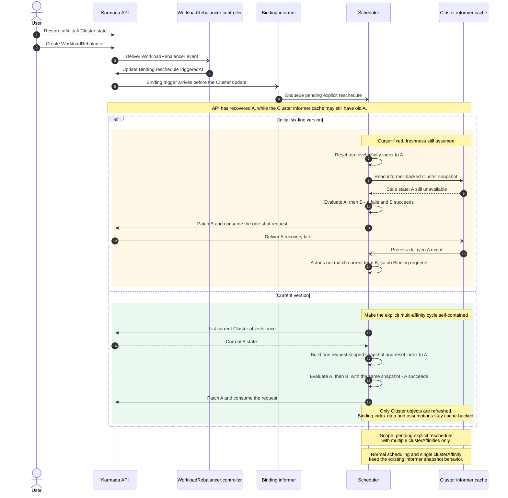

# Day 32：PR #7791 设计边界与六行初版差异说明

日期：2026-07-23

## 先说人话

最初的 6 行生产代码只解决了一个问题：用户显式要求重调度时，不再从上次停留的 B 组继续，而是把顶层 `clusterAffinities` 索引重置到 A 组。

它没有保证 scheduler 此时已经看到了“集群 A 恢复”的最新状态。Cluster 更新和 Binding 中的重调度请求由不同 informer 接收，API 中先写入 A 恢复，不代表 scheduler 一定先收到 A 的事件。如果 Binding 请求先到，旧方案会用过期 Cluster cache 判断 A 仍不可用，继续选择 B，并把一次性请求标为已消费；稍后到达的 A 事件又只按当前 B 组判断，无法把这次 failback 找回来。

当前实现因此不是泛化成“所有调度都直读 API”，而是把同一个已证明的问题闭合：只有 pending explicit reschedule 且存在多个顶层 `clusterAffinities` 时，先直读一次 Cluster 列表，构造本轮专用 snapshot，再让 A、B 等所有 term 共用它。普通调度、单 `clusterAffinity`、ResourceBinding indexer 和 in-flight assumptions 都仍走原 scheduler cache。

- [可编辑 Mermaid 源](day32-pr7791-scope-swimlane.mmd)

## 发布结果

- 已发布评论：[PR #7791 scope clarification](https://github.com/karmada-io/karmada/pull/7791#issuecomment-5053932300)。
- GitHub API 回读确认作者为 `ranxi2001`，正文与确认稿一致，仅省略本地草稿末尾的空行；`body_html` 已识别出 `data-type="mermaid"` 渲染容器。
- PR branch 从 `8992dabd62` amend 为单个 signed-off commit `b2cf85aa30`；old head 到 new head 仅在 `pkg/scheduler/scheduler.go` 增加两行 cache-boundary 注释。
- `gofmt -w pkg/scheduler/scheduler.go`、`git diff --check` 和 `go test ./pkg/scheduler/...` 通过；DCO 已通过，新 upstream PR checks 已启动。

## 已发布英文回复（原文）

I want to proactively clarify why the current scope is deliberate, and why the implementation grew beyond the original six production lines.

The six-line version reset `affinityIndex` to `0` for a pending explicit request. That fixed the retained top-level cursor, but the E2E initially needed an unrelated Cluster-label update as a cache barrier. Removing that barrier exposed a valid cross-informer ordering: the Binding trigger can reach the scheduler before the recovered Cluster update. In that case, term A is evaluated against stale state, term B can win again, and the one-shot request is consumed.

This is why the direct Cluster list is intentionally limited to pending explicit rescheduling with multiple `clusterAffinities`: it closes the #5070 cursor bug without leaving the same one-shot attempt dependent on cross-informer delivery order. The ResourceBinding and ClusterResourceBinding paths use the same option. A single `clusterAffinity` has no top-level cursor, so it is not required to close this evaluation-order bug. Fresh Cluster data may still matter there; I would prefer to cover that deliberately in a follow-up with its own behavior and API-list failure tests, rather than silently broadening this PR's read and failure semantics.

The snapshot override is also narrow: it replaces only `ClusterSnapshot` for this scheduling cycle. ResourceBinding index data and in-flight assumptions remain cache-backed. I will add a short comment near `buildScheduleAlgorithmOption()` so that boundary is visible in the code.

## 回复中的证据边界

- “6 行”只指 RB/CRB 两条路径各增加 `RescheduleRequired` 判断和 `affinityIndex = 0`，不是整个 PR 只有 6 行。
- 跨 informer 先后顺序是源码允许的真实时序；这里不把它写成已经拿到生产日志的事故。
- 单 `clusterAffinity` 也可能需要 fresh Cluster 数据，但它没有 #5070 的顶层 cursor 问题。是否统一 freshness、额外 API QPS 和 List 失败语义，应作为独立设计决定。
- 当前 override 只替换算法本轮看到的 Cluster snapshot，不刷新 Binding informer/indexer，也不绕过 scheduler assumptions。
