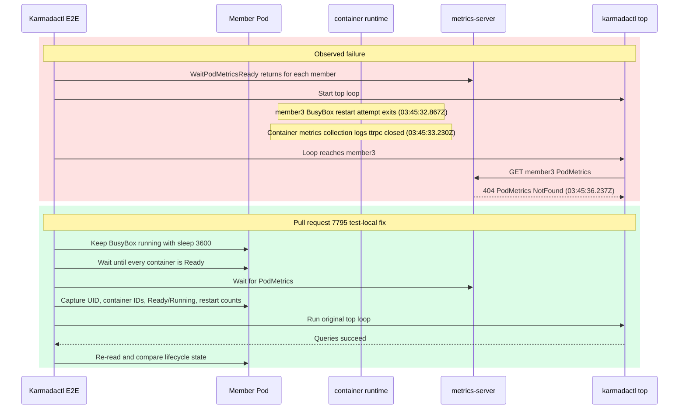

# Day 33 `karmadactl top` Flake Upstream Draft

## Target

- Repository: `karmada-io/karmada`
- Base: `master`
- Head: `ranxi2001:test/karmadactl-top-stable-pod`
- Local commit: `14b24b90db739a3091f6d1877c598a9f7f696e3d`
- Status: published as [`karmada-io/karmada#7795`](https://github.com/karmada-io/karmada/pull/7795)

## Title

```text
test(e2e): stabilize karmadactl top pod fixture
```

## Body

````markdown
**What type of PR is this?**

/kind flake

**What this PR does / why we need it**:

The `Karmadactl top existing pod` E2E uses an nginx and busybox Pod on each member cluster. The busybox container has no long-running command, so it exits and restarts while the test moves from its one-time PodMetrics readiness checks to the later sequential `karmadactl top` queries. Metrics can therefore be observed as ready and then return `PodMetrics NotFound` during the real assertion.

This change keeps busybox running only in this test context. It also verifies that the Pod UID and container IDs remain unchanged, with every container Ready, Running, and at zero restarts, from metrics readiness through all existing `top` queries. Shared fixtures and `karmadactl` behavior are unchanged.

**Which issue(s) this PR fixes**:

Part of #6841

**Special notes for your reviewer**:

- Focused two-member Kubernetes v1.36.1 E2E: fixed and restored variants passed; removing only the busybox command failed the lifecycle assertion after PodMetrics readiness succeeded.
- `go test ./test/e2e/suites/base -run '^$' -count=0`
- AI assistance: Codex helped analyze the CI failure, implement the test fix, and prepare validation; I reviewed the code and results.

**Does this PR introduce a user-facing change?**:

```release-note
NONE
```
````

## Publication Result

1. `upstream/master` remained `eb2e7c75ff828afbb34f625a105a24f5a973c1cc`; no rebase was required.
2. #6841 remained open with no assignee; no open PR matched the exact spec, error, or changed file.
3. Package compile, `gofmt`, `git diff --check`, one-file scope, DCO, and 200-word body gates passed.
4. After user confirmation, the topic branch was pushed and the exact title/body above was published as #7795. GitHub added only a trailing newline to the body.

## Reviewer Request Comment

Target: [`karmada-io/karmada#7795`](https://github.com/karmada-io/karmada/pull/7795)

Status: published after user confirmation as [comment `5065362331`](https://github.com/karmada-io/karmada/pull/7795#issuecomment-5065362331).

````markdown
The [latest retained occurrence](https://github.com/karmada-io/karmada/actions/runs/29976790271/job/89111183581) shows each `WaitPodMetricsReady` call returning after a successful GET. During the later `top` loop, member3's commandless BusyBox restart attempt exited before its query:



The log proves this ordering, not metrics-server's internal cache transition. Its pinned v0.6.3 [storage can omit PodMetrics when compatible container samples are missing](https://github.com/kubernetes-sigs/metrics-server/blob/a938798c8acf4a27215e780fd98aa57fe16d46a5/pkg/storage/pod.go#L48-L99), and [GET maps an empty result to this resource-specific 404](https://github.com/kubernetes-sigs/metrics-server/blob/a938798c8acf4a27215e780fd98aa57fe16d46a5/pkg/api/pod.go#L107-L132).

The reverse validation proves only that removing the BusyBox command loses this lifecycle after readiness; it does not deterministically reproduce the terminal 404. Scope remains test-local: no CLI retries and no change to the shared `NewPod` helper.

cc @zhzhuang-zju: could you review whether this scope matches the `Karmadactl top existing pod` flake you recorded in [#6841](https://github.com/karmada-io/karmada/issues/6841#issuecomment-3976712544)?
````

Validation:

- Reviewer-visible size: 248 words and 32 nonblank lines, including Mermaid source.
- The exact Mermaid block rendered successfully with `@mermaid-js/mermaid-cli@11.16.0`; the red and green regions, timestamps, labels, and arrow directions were visually checked.
- PR #7795 remained open at head `14b24b90db739a3091f6d1877c598a9f7f696e3d` with no human review comment when this draft was finalized.
- GitHub API readback confirmed an exact body match, author `ranxi2001`, the `@zhzhuang-zju` mention, and a Mermaid rendered-output container in `body_html`.

## Maintainer Follow-up（2026-07-28，已发布）

Target: reply to [`comment 5099297834`](https://github.com/karmada-io/karmada/pull/7795#issuecomment-5099297834) on `karmada-io/karmada#7795` at head `14b24b90db739a3091f6d1877c598a9f7f696e3d`.

Published: [`comment 5099607301`](https://github.com/karmada-io/karmada/pull/7795#issuecomment-5099607301). GitHub API readback matched the approved text exactly.

````markdown
Thanks for checking this. Your result is valid: the BusyBox restart by itself is not sufficient to produce a post-success 404. I repeated the same-manifest polling on Kubernetes v1.36.1 with metrics-server v0.6.3 and also observed 230 successful queries after the first success, with no later 404. A no-component-restart control went from `200/nginx-only` at `03:12:03`, through a natural BusyBox restart at `03:12:20`, directly to `200/nginx+busybox` at `03:12:33`. I agree the quoted sentence is too strong as written.

I could reliably reproduce the narrower metrics-server condition without restarting any component:

1. Start with stable nginx-only PodMetrics and wait for its sample timestamp to advance.
2. Seven seconds later, add a fresh container with `kubectl debug pod/pr7795-ephemeral --image=busybox:1.36.0 --container=busybox -- sleep 120`.
3. Poll the raw PodMetrics GET every 500 ms.

The result was `200/nginx` before the addition, 404 at `03:16:32.827`, then `200/nginx+busybox` at `03:16:48.668`. In v0.6.3, a container point younger than the [10-second threshold](https://github.com/kubernetes-sigs/metrics-server/blob/a938798c8acf4a27215e780fd98aa57fe16d46a5/pkg/storage/pod.go#L29-L31) does not get a [synthetic previous point](https://github.com/kubernetes-sigs/metrics-server/blob/a938798c8acf4a27215e780fd98aa57fe16d46a5/pkg/storage/pod.go#L121-L125); `GetMetrics` omits the whole Pod when a container in the latest batch has no previous point ([code](https://github.com/kubernetes-sigs/metrics-server/blob/a938798c8acf4a27215e780fd98aa57fe16d46a5/pkg/storage/pod.go#L65-L97)); and the API maps that empty result to 404 ([code](https://github.com/kubernetes-sigs/metrics-server/blob/a938798c8acf4a27215e780fd98aa57fe16d46a5/pkg/api/pod.go#L124-L132)).

This controlled case proves that ready -> 404 is possible when a fresh container point aligns with the next scrape. It does not prove that the retained CI run took this branch, because that artifact does not contain the metrics-server scrape batches. I will revise the PR description to state that boundary and frame the change as fixing the invalid fixture, independent of the unproven terminal 404 cause.
````

Comment review gate:

- Current claim named: BusyBox restart can make previously ready PodMetrics return 404.
- Concrete counterexample: same-manifest polling and the natural-restart control stayed successful.
- Missing/provided evidence: controlled fresh-container alignment proves the metrics-server mechanism; retained CI still lacks scrape batches.
- Requested action: author will narrow the PR claim and keep the patch scoped to fixture correctness.
- Prose is clearer than Mermaid here because the reviewer requested a runnable reproduction and the exact command/timestamps are the decision-relevant content.

## PR Body Revision（2026-07-28，已发布）

````markdown
**What type of PR is this?**

/kind cleanup

**What this PR does / why we need it**:

The `Karmadactl top existing pod` E2E expects stable metrics from an nginx and busybox Pod on each member cluster. The busybox container has no long-running command, so it exits and restarts while the test is still querying that Pod. This is not an appropriate fixture for a multi-container metrics test.

This change keeps busybox running only in this test context. It also verifies that the Pod UID and container IDs remain unchanged, with every container Ready, Running, and at zero restarts, from metrics readiness through all existing `top` queries. Shared fixtures and `karmadactl` behavior are unchanged.

The retained CI run recorded a successful metrics readiness check, a later BusyBox restart, and then `PodMetrics NotFound`. That ordering does not prove that the restart caused the 404, and same-manifest local polling did not reproduce a post-success 404. This PR therefore fixes the invalid fixture without claiming a proven root cause for that terminal error.

**Which issue(s) this PR fixes**:

Refs #6841

**Special notes for your reviewer**:

- Focused two-member Kubernetes v1.36.1 E2E: fixed and restored variants passed; removing only the busybox command failed the lifecycle assertion after PodMetrics readiness, but did not reproduce the terminal 404.
- `go test ./test/e2e/suites/base -run '^$' -count=0`
- AI assistance: Codex helped analyze the CI failure, implement the test fix, and prepare validation; I reviewed the code and results.

**Does this PR introduce a user-facing change?**:

```release-note
NONE
```
````

The published revision changes `/kind flake` to `/kind cleanup`, changes `Part of #6841` to `Refs #6841`, and removes the unproven causal claim. GitHub API readback matched the approved body exactly; PR #7795 remained open at head `14b24b90db739a3091f6d1877c598a9f7f696e3d`. It did not change the title, branch, commit, or code. Immediately after the update, the asynchronous label state still showed `kind/flake`; this is dynamic GitHub state rather than part of the approved body.

## Maintainer Review Update（2026-08-10，已发布）

### 先说人话

维护者把 #7795 的范围进一步收窄为两行行为变化：让 BusyBox 持续运行，并在查询 metrics 前等待整个 Pod Ready。UID、container ID、restart count 和前后快照虽然能诊断 fixture 生命周期，但不是合入这次修复所必需的合同，因此已从本地 patch 删除。

- Review：[直接设置 BusyBox command](https://github.com/karmada-io/karmada/pull/7795#discussion_r3746440045)；[只保留 command 与 `khelper.IsPodReady`](https://github.com/karmada-io/karmada/pull/7795#discussion_r3746457522)
- Remote head：`f1d3685b7e63422eee7c99ac8da65611b4fa69ae`
- Residual diff：`test/e2e/suites/base/karmadactl_test.go`，`+2/-1`
- Focused validation：`go test ./test/e2e/suites/base -run '^$' -count=1` 通过；`git diff --check` 通过
- 证据边界：这个 patch 修正不稳定 fixture，但仍不声称 commandless BusyBox 是原 `PodMetrics NotFound` 的完整根因。

### PR Body Revision

Status：已发布；GitHub API 回读与下列 165-word、17-nonblank-line 确认稿一致。

````markdown
**What type of PR is this?**

/kind cleanup

**What this PR does / why we need it**:

The `Karmadactl top existing pod` E2E creates an nginx and BusyBox Pod on each member cluster. BusyBox has no long-running command, so it exits and restarts, while `PodRunning` does not guarantee that every container is ready.

This change keeps BusyBox running only in this test and waits for `PodReady=True` before querying metrics. Shared fixtures and `karmadactl` behavior are unchanged. It does not claim that the BusyBox restart was the complete cause of the observed `PodMetrics NotFound`; subsequent runs still need to be monitored.

**Which issue(s) this PR fixes**:

Refs #6841

**Special notes for your reviewer**:

- Scope: test fixture only; no CLI retry or shared helper change.
- Tests: `go test ./test/e2e/suites/base -run '^$' -count=1`.
- AI assistance: Codex helped inspect the review feedback, reduce the patch, and run validation; I reviewed the code and results.

**Does this PR introduce a user-facing change?**:

```release-note
NONE
```
````

### Review Replies

Target: [`discussion_r3746440045`](https://github.com/karmada-io/karmada/pull/7795#discussion_r3746440045)

Published: [`discussion_r3747135026`](https://github.com/karmada-io/karmada/pull/7795#discussion_r3747135026)

```markdown
Updated. The BusyBox command is now set directly on the Pod returned by `helper.NewPod`, without scanning the containers by name.
```

Target: [`discussion_r3746457522`](https://github.com/karmada-io/karmada/pull/7795#discussion_r3746457522)

Published: [`discussion_r3747135768`](https://github.com/karmada-io/karmada/pull/7795#discussion_r3747135768)

```markdown
Updated. The PR now keeps only the BusyBox command and `khelper.IsPodReady`; the runtime-state snapshot and lifecycle assertions have been removed.
```

发布回读：已用精确 lease 将 `14b24b90d` force-push 为 `f1d3685b7`，GitHub PR API 显示 1 file、`+2/-1`、`size/XS`；PR body 与两条回复均逐字匹配确认稿。当前等待新 SHA 的 upstream PR CI 与 `lgtm/approved`，不检查或引用 fork push CI。

## Optional Command Revision（2026-08-10，已发布）

### 先说人话

为避免 top 测试直接依赖 `Containers[1]`，本地进一步把 BusyBox command 封装成 `helper.NewPod` 的可选参数。只有 top 调用传入 `"sleep", "3600"`；其余 19 个两参数调用得到的 `Command` 仍为 `nil`，源码和行为均保持兼容。

- Current remote head：`8d2148606f3475fea0c3ef113b795951a4cf278a`
- Residual diff：2 files，`+6/-5`
- `test/helper/resource.go`：`NewPod(namespace, name, busyboxCommand ...string)`，仅将可选参数交给 BusyBox `Command`
- `test/e2e/suites/base/karmadactl_test.go`：在 `helper.NewPod` 调用中传入 `"sleep", "3600"`，继续用 `khelper.IsPodReady`
- Validation：`go test ./test/helper ./pkg/controllers/execution ./pkg/util/helper -count=1`、`go test ./test/e2e/suites/base -run '^$' -count=1`、`git diff --check` 均通过

### PR Body Revision

Status：已发布；GitHub API 回读与下列 183-word、16-nonblank-line 确认稿一致。

````markdown
**What type of PR is this?**

/kind cleanup

**What this PR does / why we need it**:

The `Karmadactl top existing pod` E2E creates an nginx and BusyBox Pod on each member cluster. BusyBox has no long-running command, so it exits and restarts, while `PodRunning` does not guarantee that every container is ready.

This change lets `helper.NewPod` accept an optional BusyBox command and passes `sleep 3600` only from this test. Existing two-argument callers retain the previous Pod spec. The test also waits for `PodReady=True` before querying metrics.

This does not claim that the BusyBox restart was the complete cause of the observed `PodMetrics NotFound`; subsequent runs still need to be monitored.

**Which issue(s) this PR fixes**:

Refs #6841

**Special notes for your reviewer**:

- Scope: optional test-helper argument; existing callers keep their default behavior; no CLI retry.
- Tests: `go test ./test/helper ./pkg/controllers/execution ./pkg/util/helper -count=1`; `go test ./test/e2e/suites/base -run '^$' -count=1`.
- AI assistance: Codex helped inspect the review feedback, refine the helper API, and run validation; I reviewed the code and results.

**Does this PR introduce a user-facing change?**:

```release-note
NONE
```
````

### Review Reply Revision

Published：已原位编辑 [`discussion_r3747135026`](https://github.com/karmada-io/karmada/pull/7795#discussion_r3747135026)，没有新增 thread message。

```markdown
Updated. `helper.NewPod` now accepts an optional `busyboxCommand ...string`, and this test passes `"sleep", "3600"` directly in the call. Existing two-argument callers keep the previous Pod spec.
```

The second reply [`discussion_r3747135768`](https://github.com/karmada-io/karmada/pull/7795#discussion_r3747135768) remains accurate and needs no edit.

发布回读：已用精确 lease 将 `f1d3685b7` force-push 为 `8d2148606`；GitHub PR API 显示 2 files、`+6/-5`、`size/S`，PR body 和第一条编辑后的回复逐字匹配确认稿，第二条回复保持不变。当前等待新 SHA 的 upstream PR CI 与 `lgtm/approved`。

## Default Stable Fixture Revision（2026-08-10，待发布）

### 先说人话

上一版把 BusyBox command 设计成可选参数，仍然把“是否稳定运行”的责任留给每个调用方。重新从 helper 契约审计后，这个抽象不成立：`NewPod` 是多个 E2E 共用的 Pod fixture，默认应在测试期间保持稳定；测试结束由既有 `DeferCleanup`、`AfterEach` 或 namespace 删除回收资源，而不是依靠 BusyBox 自行退出。

- Current remote head：`8d2148606f3475fea0c3ef113b795951a4cf278a`
- Pending local head：`aaf1dc24c8c95a5bdd8fca799450ae1502260eab`
- Residual diff：2 files，`+5/-4`
- `test/helper/resource.go`：恢复 `NewPod(namespace, name)` 两参数 API；BusyBox 默认使用 `Command: []string{"sleep", "3600"}`；函数注释明确其容器为 long-running fixture
- `test/e2e/suites/base/karmadactl_test.go`：top 恢复普通两参数调用，继续用 `khelper.IsPodReady`
- 调用审计：8 个 E2E 调用均有 Pod 或 namespace 清理，没有调用依赖 BusyBox 退出、重启或 NotReady；12 个单测调用只构造对象，不执行容器
- Validation：`go test ./test/helper ./pkg/controllers/execution ./pkg/util/helper -count=1`、`go test ./test/e2e/suites/base -run '^$' -count=1`、`git diff --check` 均通过

> 分析：`NewPod` 使用默认 `RestartPolicyAlways`。无 command 的 BusyBox 不是“一次性任务”，而是退出后持续重启；真正需要“运行结束即完成”语义的 `NewJob` 会显式设置完成命令和 `RestartPolicyNever`。因此这里修复的是共享 fixture 默认值，而非扩张 top 测试范围。

### PR Body Revision

Status：待用户确认后发布。

````markdown
**What type of PR is this?**

/kind cleanup

**What this PR does / why we need it**:

`helper.NewPod` builds an nginx and BusyBox Pod reused across E2E tests. BusyBox has no long-running command, so it exits and restarts, while `PodRunning` does not guarantee that every container is ready.

This change makes the BusyBox container sleep for 3600 seconds by default, giving every E2E caller a stable test fixture until its existing Pod or namespace cleanup runs. The top test also waits for `PodReady=True` before querying metrics.

This does not claim that the BusyBox restart was the complete cause of the observed `PodMetrics NotFound`; subsequent runs still need to be monitored.

**Which issue(s) this PR fixes**:

Refs #6841

**Special notes for your reviewer**:

- Scope: shared test fixture default and top readiness condition; existing two-argument API retained; no production or CLI retry behavior.
- Tests: `go test ./test/helper ./pkg/controllers/execution ./pkg/util/helper -count=1`; `go test ./test/e2e/suites/base -run '^$' -count=1`.
- AI assistance: Codex helped inspect the review feedback, audit the shared helper contract, and run validation; I reviewed the code and results.

**Does this PR introduce a user-facing change?**:

```release-note
NONE
```
````

### Review Reply Revision

Target：原位编辑 [`discussion_r3747135026`](https://github.com/karmada-io/karmada/pull/7795#discussion_r3747135026)，不新增 thread message。

```markdown
Updated after checking the shared helper's contract. `helper.NewPod` now sets `Command: []string{"sleep", "3600"}` on its BusyBox container by default, and the call remains `helper.NewPod(namespace, name)`. All E2E callers already remove the Pod or its namespace during cleanup, so the helper now provides a stable fixture consistently.
```

The second reply [`discussion_r3747135768`](https://github.com/karmada-io/karmada/pull/7795#discussion_r3747135768) remains accurate and needs no edit.
