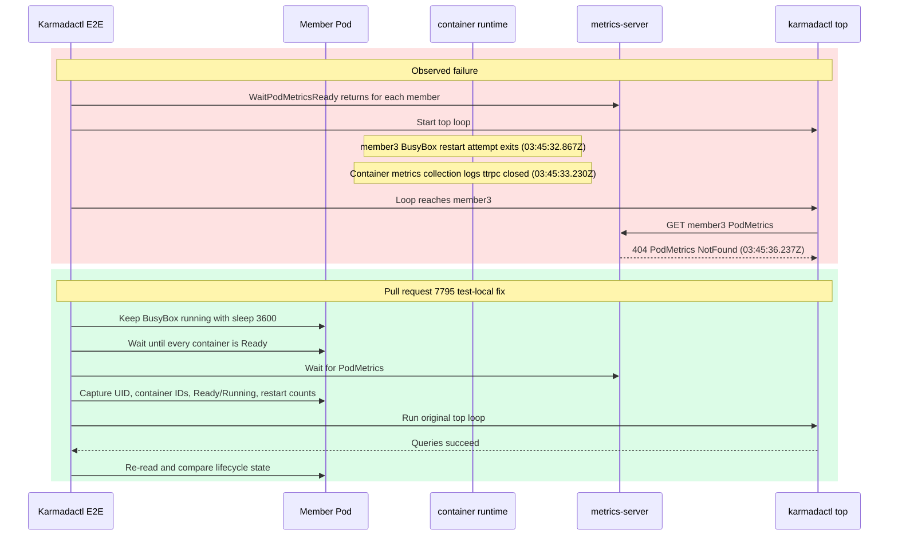

# Day 33 `karmadactl top` Flake Upstream Draft

## Target

- Repository: `karmada-io/karmada`
- Base: `master`
- Head: `ranxi2001:test/karmadactl-top-stable-pod`
- Local commit: `14b24b90db739a3091f6d1877c598a9f7f696e3d`
- Status: published as [`karmada-io/karmada#7795`](https://github.com/karmada-io/karmada/pull/7795)

## Title

```text
test(e2e): stabilize karmadactl top pod fixture
```

## Body

````markdown
**What type of PR is this?**

/kind flake

**What this PR does / why we need it**:

The `Karmadactl top existing pod` E2E uses an nginx and busybox Pod on each member cluster. The busybox container has no long-running command, so it exits and restarts while the test moves from its one-time PodMetrics readiness checks to the later sequential `karmadactl top` queries. Metrics can therefore be observed as ready and then return `PodMetrics NotFound` during the real assertion.

This change keeps busybox running only in this test context. It also verifies that the Pod UID and container IDs remain unchanged, with every container Ready, Running, and at zero restarts, from metrics readiness through all existing `top` queries. Shared fixtures and `karmadactl` behavior are unchanged.

**Which issue(s) this PR fixes**:

Part of #6841

**Special notes for your reviewer**:

- Focused two-member Kubernetes v1.36.1 E2E: fixed and restored variants passed; removing only the busybox command failed the lifecycle assertion after PodMetrics readiness succeeded.
- `go test ./test/e2e/suites/base -run '^$' -count=0`
- AI assistance: Codex helped analyze the CI failure, implement the test fix, and prepare validation; I reviewed the code and results.

**Does this PR introduce a user-facing change?**:

```release-note
NONE
```
````

## Publication Result

1. `upstream/master` remained `eb2e7c75ff828afbb34f625a105a24f5a973c1cc`; no rebase was required.
2. #6841 remained open with no assignee; no open PR matched the exact spec, error, or changed file.
3. Package compile, `gofmt`, `git diff --check`, one-file scope, DCO, and 200-word body gates passed.
4. After user confirmation, the topic branch was pushed and the exact title/body above was published as #7795. GitHub added only a trailing newline to the body.

## Reviewer Request Comment

Target: [`karmada-io/karmada#7795`](https://github.com/karmada-io/karmada/pull/7795)

Status: published after user confirmation as [comment `5065362331`](https://github.com/karmada-io/karmada/pull/7795#issuecomment-5065362331).

````markdown
The [latest retained occurrence](https://github.com/karmada-io/karmada/actions/runs/29976790271/job/89111183581) shows each `WaitPodMetricsReady` call returning after a successful GET. During the later `top` loop, member3's commandless BusyBox restart attempt exited before its query:



The log proves this ordering, not metrics-server's internal cache transition. Its pinned v0.6.3 [storage can omit PodMetrics when compatible container samples are missing](https://github.com/kubernetes-sigs/metrics-server/blob/a938798c8acf4a27215e780fd98aa57fe16d46a5/pkg/storage/pod.go#L48-L99), and [GET maps an empty result to this resource-specific 404](https://github.com/kubernetes-sigs/metrics-server/blob/a938798c8acf4a27215e780fd98aa57fe16d46a5/pkg/api/pod.go#L107-L132).

The reverse validation proves only that removing the BusyBox command loses this lifecycle after readiness; it does not deterministically reproduce the terminal 404. Scope remains test-local: no CLI retries and no change to the shared `NewPod` helper.

cc @zhzhuang-zju: could you review whether this scope matches the `Karmadactl top existing pod` flake you recorded in [#6841](https://github.com/karmada-io/karmada/issues/6841#issuecomment-3976712544)?
````

Validation:

- Reviewer-visible size: 248 words and 32 nonblank lines, including Mermaid source.
- The exact Mermaid block rendered successfully with `@mermaid-js/mermaid-cli@11.16.0`; the red and green regions, timestamps, labels, and arrow directions were visually checked.
- PR #7795 remained open at head `14b24b90db739a3091f6d1877c598a9f7f696e3d` with no human review comment when this draft was finalized.
- GitHub API readback confirmed an exact body match, author `ranxi2001`, the `@zhzhuang-zju` mention, and a Mermaid rendered-output container in `body_html`.
