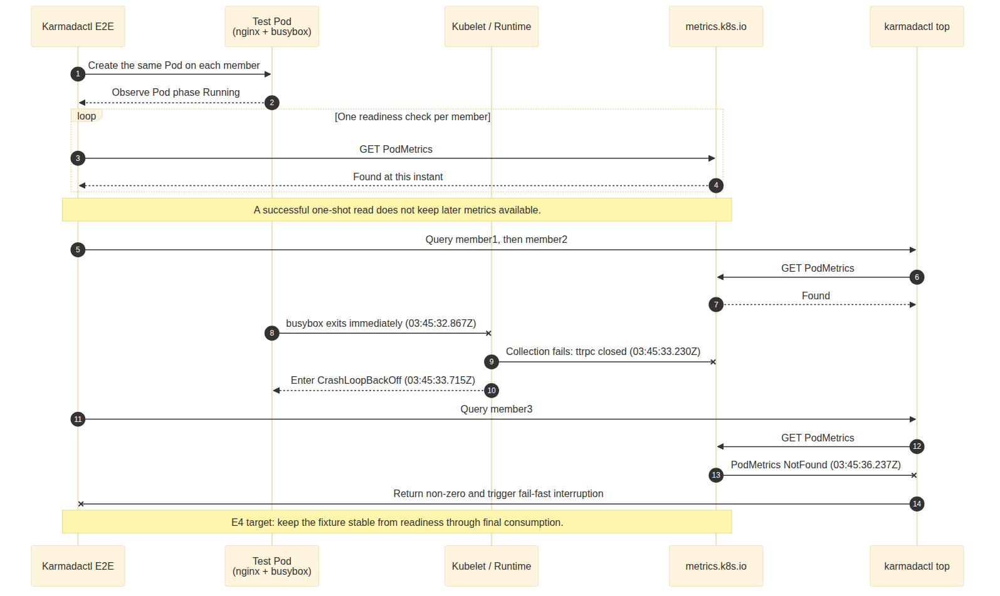
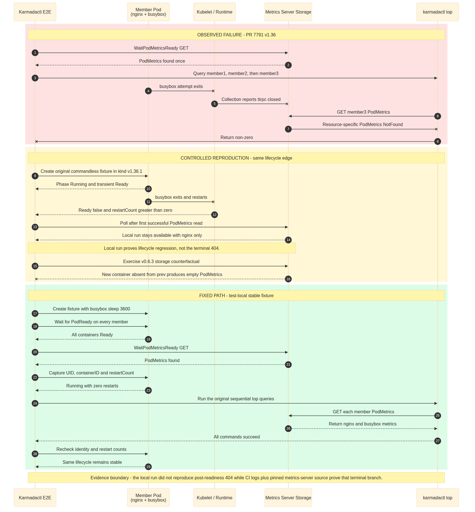

# Day 33：PR #7791 E2E 红灯分类与 `karmadactl top` Flake 修复

- 日期：`2026-07-23`
- PR/head：[`karmada-io/karmada#7791`](https://github.com/karmada-io/karmada/pull/7791) `b2cf85aa3075f4975fe389c65bdd2e1d1648d65e`
- CI run：[`29976790271`](https://github.com/karmada-io/karmada/actions/runs/29976790271)，attempt 1
- 修复 branch：`test/karmadactl-top-stable-pod`
- 本地 commit：`14b24b90db739a3091f6d1877c598a9f7f696e3d`
- Upstream PR：[`#7795`](https://github.com/karmada-io/karmada/pull/7795)

> 注释：本报告只记录 Day 33 对 #7791 新一轮 CI 的分类、复现和修复，不回写 Day 27 的固定统计窗口及历史分母。

## 一页结论

1. #7791 同一 run 的三条 E2E 红灯不是同一个 scheduler 回归。v1.34/v1.35 属于既有 control-plane / etcd collapse 簇，对 #7791 都是 `NO_FIX`；v1.36 是 #6841 跨月重复的 `karmadactl top` PodMetrics 生命周期竞态。
2. v1.36 的根因是测试只做一次 PodMetrics readiness 读取，但 commandless busybox 随后退出并重启，使后续顺序 `top` 查询可能得到 resource-specific 404。
3. 修复只改 `test/e2e/suites/base/karmadactl_test.go`：让当前 spec 的 busybox 长期运行，并验证从 metrics readiness 到最后一次 `top` 期间 Pod UID、容器身份和零重启保持不变。
4. 真实 two-member focused E2E 完成 `fixed pass -> reverse fail -> restored pass`，package compile、diff check、gofmt 和独立复审均通过，状态为 `LOCAL_E4`。
5. #6841 仍 open、无 assignee，未发现重复 PR；修复已发布为 upstream PR #7795，DCO 通过，等待 PR CI 和 human review。

## #7791 current head 三版本 E2E 失败

- PR/head：[`#7791`](https://github.com/karmada-io/karmada/pull/7791) `b2cf85aa3075f4975fe389c65bdd2e1d1648d65e`
- Run：[`29976790271`](https://github.com/karmada-io/karmada/actions/runs/29976790271)，attempt 1
- 失败 jobs：[`v1.34 / 89111183598`](https://github.com/karmada-io/karmada/actions/runs/29976790271/job/89111183598)、[`v1.35 / 89111183584`](https://github.com/karmada-io/karmada/actions/runs/29976790271/job/89111183584)、[`v1.36 / 89111183581`](https://github.com/karmada-io/karmada/actions/runs/29976790271/job/89111183581)
- 统计边界：该 run 创建于 `2026-07-23`，不属于 Day 27 报告中的 Day 11→Day 27 固定窗口，也不属于 `2026-07-17`→`2026-07-20` 的滚动 72 小时窗口；不回算 `83 / 23 / 29` 及其子分类分母

> 通俗解释：CI 看起来同时红了三个版本，但不是同一个 scheduler bug 在三个版本复现。v1.34 和 v1.35 是 runner 上多个 etcd 先变慢、再把 API 控制面拖垮；v1.36 则是已有历史记录的测试 Pod 生命周期问题。对 #7791 的正确动作是重跑，不是为了让 CI 转绿去改 scheduler 或增加通用 retry。

### First hard failure 台账

| Matrix | 第一个真实失败 | 源码与日志证据 | 与 #7791 的关系和动作 |
| --- | --- | --- | --- |
| v1.34 | `resource reschedule when join or unJoin cluster` 的 `BeforeEach` 创建临时 `member-e2e-7fsf5`，等待 kind 节点启动标记 `805.722s` 后超时；测试正文未执行 | host Kubernetes、Karmada、member3 三个 etcd 在相邻秒级窗口出现 `slow fdatasync`；Karmada etcd linearizable read 随后达到 `33s+`，再出现 readiness、lease 与容器退出级联；无 OOM、无磁盘容量耗尽证据 | PR 新增 A→B→A spec 已在 `03:49:02Z` 通过。归入既有 control-plane / etcd collapse，#7791 为 `NO_FIX` |
| v1.35 | `SchedulePriority / ResourceBinding should not be created` 在 `schedule_priority_test.go:123` 失败 | 断言并没有读到“错误创建的 Binding”；GET 在 `03:47:57.142Z` 因后端 etcd `connection refused` 触发 API `Handler timeout`，所以 `IsNotFound(err)` 为 false。此前 Karmada etcd 多次 `fdatasync` 1.3–5.9s、Range 20–26s，并最终 exit 137；host 与 member3 etcd 同窗 stall | 该 spec 使用单 `ClusterAffinity` 且没有 explicit reschedule，不能进入 #7791 的 pending multi-affinity 分支。新增 A→B→A spec 已通过；归入 control-plane / etcd collapse，#7791 为 `NO_FIX` |
| v1.36 | `Karmadactl top existing pod` 对 member3 返回 `podmetrics.metrics.k8s.io ... not found` | 测试先对每个 member 各成功读取一次 PodMetrics，随后才顺序执行 `top`；同一 Pod 的 busybox 在 member3 启动后立即退出，metrics collection 报 `ttrpc: closed`，kubelet 进入 `CrashLoopBackOff`，到 member3 查询时 readiness 已失效 | 这是 #6841 已记录的同签名 flake。其余 3 条 summary 都是 fail-fast 后的 `interrupted by other process`；#7791 新 spec 本 job 未执行，不能记为通过或失败 |

### v1.34 / v1.35：同一控制面崩溃簇的新样本

这两条 job 都达到“失败机制 E3”，但 runner 的物理 trigger 仍只有 E2：

1. 多个相互独立的 etcd 先在同一时间窗记录 WAL `slow fdatasync`。
2. raft `ReadIndex`、linearizable read 和 API handler 随后变慢或超时。
3. etcd、apiserver、controller-manager 或 member cluster startup 再出现退出、拒绝连接和 cleanup 级联。
4. 最终 Ginkgo spec 名称只是控制面崩溃后最先撞上错误的 consumer，不能反推该业务 spec 是 producer。

该模式与 #7697 v1.35、#7777 v1.35、#7782 v1.35 的证据链一致。新样本增加了发生频率，却没有新增 host `iostat`、PSI、kernel block-layer 或 hypervisor 证据，因此仍不能在业务代码或测试中加入 timeout、防御分支和通用 retry。下一步仍是补 runner 观测，再判断 storage latency、CPU starvation 或更广泛的 host contention。

### v1.36：`karmadactl top` readiness 可回退

该失败不是“metrics 从未准备好”，而是“测试只证明它在过去某一刻准备好”：

1. [`karmadactl_test.go`](../test/e2e/suites/base/karmadactl_test.go) 先通过 `WaitPodMetricsReady` 对每个 member 各做一次成功读取。
2. 随后 `karmadactl top` 才按 member1、member2、member3 顺序查询；前面的成功读取不是持续性保证。
3. [`NewPod`](../test/helper/resource.go) 创建 `nginx + busybox:1.36.0`，但 busybox 没有长运行 command。member3 日志显示它在 `03:45:32.851Z` 启动、`03:45:32.867Z` 退出，`03:45:33.230Z` metrics collection 报 `ttrpc: closed`，`03:45:33.715Z` 进入 `CrashLoopBackOff`。
4. member3 的 `top` 查询在 `03:45:36.237Z` 得到 PodMetrics NotFound。一次性 readiness 与真实消费之间存在测试 fixture 自己制造的生命周期窗口。

该 spec 至少有四个跨月真实 CI 样本：[`2026-01-06`](https://github.com/karmada-io/karmada/issues/6841#issuecomment-3714541561)、[`2026-02-28`](https://github.com/karmada-io/karmada/issues/6841#issuecomment-3976712544)、[`2026-04-24`](https://github.com/karmada-io/karmada/pull/7426#issuecomment-4311107365)和本次 #7791。其中 1 月、4 月和本次仍保留 exact `PodMetrics NotFound`，2 月旧 job 日志已过期，只能证明同一 spec 在 same-SHA rerun 后通过，不能再独立声称 exact stderr。它不是人为构造异常输入，也不是只在 mock 中成立的防御场景，因此值得进入独立 E4；#6841 无 assignee，当前 open PR 文件级扫描没有发现修复该 exact 路径的重复实现。

可编辑图源：[`day33-pr7791-v136-karmadactl-top-podmetrics-race.mmd`](day33-pr7791-v136-karmadactl-top-podmetrics-race.mmd)

### 候选决策与最小边界

| 故障簇 | 当前决策 | 最小下一步 | 明确不做 |
| --- | --- | --- | --- |
| control-plane / etcd collapse | `HOLD / NEEDS_RCA` | 在 CI harness 收集 host I/O、CPU/memory/I/O PSI、container stats 与 exit reason，先证明物理 trigger | 不改 scheduler，不为单个 spec 延长 timeout，不把多个 cleanup failure 当成多个产品 bug |
| `karmadactl top` PodMetrics 生命周期竞态 | [`UPSTREAM_PR_OPEN #7795`](https://github.com/karmada-io/karmada/pull/7795) | 已完成 fixed -> reverse -> restored 的真实 focused E2E、独立复审和发布；等待 PR CI 与 human review | 不修改共享 `NewPod` 影响全部调用者，不给 CLI 增加 retry，不把 NotFound 吞掉 |
| #7791 scheduler patch | `NO_FIX` | `/retest`；继续按新 head 的实际 job 分类 | 不因三个无关红灯扩大 PR scope |

本轮实现前的 `READY_FOR_E4` 只表示“日志、源码与历史重复性足以设计 focused counterfactual”。分析、反向复现和修复随后观察同一个 invariant：从首次 metrics readiness 到最后一次 `top` 消费，目标 Pod 的 UID 和容器身份不变，全部容器持续 Ready、Running 且没有重启，因此先升级为 `LOCAL_E4`，并在用户确认 exact target/title/body 后发布为 #7795。

#7791 当前 head 相对行为等价的上一版 `8992dabd62` 只增加两处注释；上一版 run `29913420003` 的 v1.34/v1.35 已通过，也提供同一产品行为下的非确定性反证。本轮尚未代用户发布 `/retest`。

### `karmadactl top` 候选推进设计（2026-07-23）

- Topic branch：`test/karmadactl-top-stable-pod`
- Upstream base：`eb2e7c75ff828afbb34f625a105a24f5a973c1cc`
- 原始观察：#7791 merge-test commit `5ca524203`；相关 `karmadactl`、fixture、metrics helper 文件与该 base blob 相同
- Ownership：#6841 open、无 assignee；`test/OWNERS` approver 为 `@XiShanYongYe-Chang`，reviewers 包含 `@zhzhuang-zju`

#### Alignment contract

| Dimension | 本轮必须保持的 identity |
| --- | --- |
| Object | 每个 member 上本轮传播的同一个 `testNamespace/pod-*`；记录 Pod UID 和容器身份 |
| State layer | member Pod `status.containerStatuses`，随后是同一 member 的 `metrics.k8s.io/PodMetrics` |
| Transition | busybox 启动后立即退出并重启；一次成功的 metrics observation 在后续 scrape 中可失效 |
| Consumer | 原有 `karmadactl top pod ... -C <member>` 顺序循环，不替换为 mock 或静态断言 |
| Failure | metrics-server 的 last/prev container points 不兼容时不返回该 Pod，CLI 单次 GET 收到 resource-specific 404 |
| Recovery | test-local busybox 保持运行；从 metrics readiness 到最后一次 `top` 后 Pod UID、containerID 和 restartCount 不变 |

#### 文件范围与非目标

| 文件 | 必要改动 | 风险控制 | 验证 |
| --- | --- | --- | --- |
| `test/e2e/suites/base/karmadactl_test.go` | 只为 `Karmadactl top pod` context 的 busybox 设置长运行 command；在 metrics readiness 后记录稳定容器状态，原有顺序 `top` 后复核同一生命周期未重启 | 不影响其他 7 个 `NewPod` caller；保留 nginx + busybox 多容器覆盖 | test-only baseline、fixed、reverse-patch；e2e package compile；真实 two-member focused spec |

明确不修改 `test/helper/resource.go`、`test/e2e/framework/pod.go`、`pkg/karmadactl`、workflow 和 metrics-server 配置；不增加 CLI retry、固定 sleep、通用 timeout，也不吞掉 NotFound。

#### 实现前 counterfactual

本地创建临时 kind v1.36.1 cluster，并使用仓库同一 `metrics-server v0.6.3` 安装脚本。两个 Pod 都复用 `nginx:1.19.0 + busybox:1.36.0`：

| Observation | 原 fixture | 候选 fixture |
| --- | --- | --- |
| busybox command | image default，启动后立即退出 | `sleep 3600` |
| Pod phase | `Running` | `Running` |
| Pod Ready | `False` | `True` |
| busybox restartCount | `2` | `0` |
| 后期 PodMetrics | 可只返回 nginx | 同时返回 nginx + busybox |
| 首次成功后的 240 轮 API 查询 | `230 success / 0 post-success 404` | `230 success / 0 post-success 404` |

该实验确定性证明了当前 `PodPhase == Running` barrier 会接受已经退化的多容器 Pod，也证明长运行 command 切断了 busybox restart 边；它没有在单节点本地环境中重现最终 404，因此不能单独冒充 terminal E4。terminal 机制由 metrics-server `v0.6.3@a938798c8` 源码补齐：`podStorage.GetMetrics()` 要求 last 中的每个 container 都在 prev 中存在；官方 storage regression 也覆盖“前一批只有 container1、后一批新增 container2时返回空 PodMetrics”。API 层在结果为空时返回本次观察到的 resource-specific NotFound。

可编辑图源：[`day33-karmadactl-top-flake-e4-alignment.mmd`](day33-karmadactl-top-flake-e4-alignment.mmd)

#### 实现与 E4 结果

- Worktree / branch：`/tmp/karmada-karmadactl-top-flake` / `test/karmadactl-top-stable-pod`
- 最终 source scope：只改 `test/e2e/suites/base/karmadactl_test.go`，`+44/-1`
- Causal fix：按容器名只给当前 `Karmadactl top pod` fixture 的 busybox 设置 `sleep 3600`；共享 `NewPod` 不变
- Consumer invariant：weak `PodPhase == Running` 改为 `IsPodReady`；PodMetrics 首次可用后记录每个 member 的 Pod UID、containerID，并要求全部容器 Ready、Running、restartCount=0；原有全部 `top` 命令完成后再次读取并比较
- Package compile：`go test ./test/e2e/suites/base -run '^$' -count=0` 通过
- Pinned producer test：metrics-server `v0.6.3@a938798c8` 的 `should get empty metrics if not all containers data points of one pod reported at the first cycle` 通过，`1 Passed / 22 Skipped`
- Upstream 稿与发布记录：[`day33-karmadactl-top-flake-upstream-draft.md`](day33-karmadactl-top-flake-upstream-draft.md)；使用 `Part of #6841`，避免关闭收集多类 flake 的总台账

真实 focused E4 复用了证书实验留下的两个 healthy v1.36.1 member，并给两者安装仓库固定的 metrics-server v0.6.3。第一次运行已进入 `top`，但 colon-separated kubeconfig 被 CLI 当成单个文件名；这是本地装配错误。随后生成权限 `0600` 的临时 merged kubeconfig，未改产品代码：

| Variant | Exact change | Focused result | 证明内容 |
| --- | --- | --- | --- |
| Fixed | 完整候选 patch | `1/273` 目标 spec 通过；spec `28.565s`，suite `35.703s` | 两个 member 的 metrics readiness、全部原有 `top` 路径、最终 Pod/容器身份复核和 AfterSuite 均成功 |
| Reverse | 只删除 `busybox.Command`，保留 lifecycle assertions | 失败；suite `37.546s`，`karmadactl_test.go:599` 的 `IsPodReady` 为 false | weak PodReady wait 曾短暂通过、metrics readiness 也已成功，但 commandless busybox 随后退出，使同一 lifecycle 在真实消费前退化 |
| Restored | 恢复同一 command hunk | `1/273` 目标 spec 再次通过；spec `28.853s`，suite `35.901s` | 排除首次偶然绿；最终工作树恢复到修复版 |

因此实现状态从 `READY_FOR_E4` 升级为 `LOCAL_E4`。这里没有声称测试了“容器重启后的 CLI retry/recovery”，因为 patch 的合同是提供稳定的 metrics fixture，而不是改变 CLI 行为。独立复审确认没有剩余 finding；单个 signed-off commit `14b24b90db739a3091f6d1877c598a9f7f696e3d` 已推送并发布为 #7795。

## Upstream 发布记录

- 发布时间：`2026-07-23T12:51:34Z`
- PR：[`karmada-io/karmada#7795`](https://github.com/karmada-io/karmada/pull/7795)，`master <- ranxi2001:test/karmadactl-top-stable-pod`
- 标题：`test(e2e): stabilize karmadactl top pod fixture`
- Diff：1 commit、1 file，`+44/-1`；head 为 `14b24b90db739a3091f6d1877c598a9f7f696e3d`
- 回读：open、非 Draft、mergeable；`kind/flake`、`size/M` 和 DCO pass 已生效，upstream PR CI 已启动
- 正文：与确认稿可见内容一致，仅 GitHub API 自动增加结尾空行；使用 `Part of #6841`，未关闭 flake 总台账
- 自动流程：karmada-bot 按 `test/OWNERS` 请求 `mohamedawnallah`、`XiShanYongYe-Chang` review；未手动 `/assign`、评论、mention 或请求 reviewer

## 周报可复用摘要

`2026-07-23` 的 #7791 run 有三条 E2E 红灯：v1.34/v1.35 是既有 control-plane / etcd collapse 的新样本，对 scheduler patch 均为 `NO_FIX`；v1.36 是 #6841 跨月重复的 `karmadactl top` PodMetrics 生命周期竞态。后者已在独立 topic branch 完成单文件修复和真实 two-member E4：修复版通过，只删除 busybox command 后在 metrics readiness 之后的生命周期断言失败，恢复后再次通过；signed-off commit `14b24b90d` 已发布为 upstream PR #7795。

## 本轮方法改进

- Ginkgo 汇总出现多条 failure 时，先区分第一个真实断言与 `interrupted by other process`；后者不能分别计为独立 flake 或修复候选。
- Readiness wait 只证明某次 observation 成功。若 fixture 之后还能从 ready 退化，分析必须继续追踪到最后一个真实 consumer，修复也应稳定 fixture 生命周期，而不是给 consumer 追加 retry。
