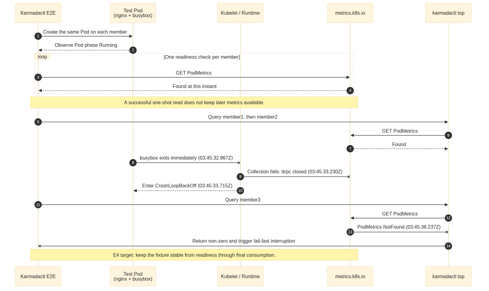
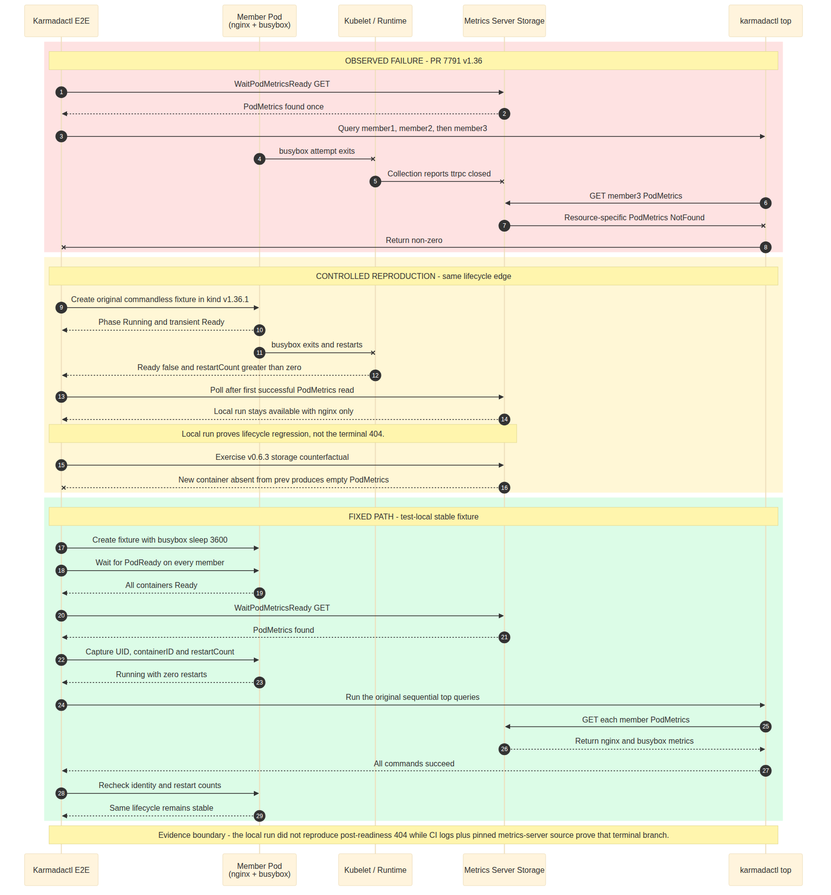

# Day 33：PR #7791 E2E 红灯分类与 `karmadactl top` Fixture 调查

- 日期：`2026-07-23`
- PR/head：[`karmada-io/karmada#7791`](https://github.com/karmada-io/karmada/pull/7791) `b2cf85aa3075f4975fe389c65bdd2e1d1648d65e`
- CI run：[`29976790271`](https://github.com/karmada-io/karmada/actions/runs/29976790271)，attempt 1
- 修复 branch：`test/karmadactl-top-stable-pod`
- 本地 commit：`14b24b90db739a3091f6d1877c598a9f7f696e3d`
- Upstream PR：[`#7795`](https://github.com/karmada-io/karmada/pull/7795)

> 注释：本报告只记录 Day 33 对 #7791 新一轮 CI 的分类、复现和修复，不回写 Day 27 的固定统计窗口及历史分母。

## 先说人话

1. #7791 同一 run 的三条 E2E 红灯不是同一个 scheduler 回归。v1.34/v1.35 属于既有 control-plane / etcd collapse 簇，对 #7791 都是 `NO_FIX`；v1.36 是 #6841 跨月重复的 `karmadactl top` PodMetrics 404 症状。
2. commandless busybox 会退出和重启，确实是不合格的 metrics fixture；但保留的 CI 日志只证明“readiness 成功 -> BusyBox 重启 -> 404”的先后顺序，没有记录 metrics-server 的两批 scrape，因此不能把重启直接定为 404 根因。
3. 修复只改 `test/e2e/suites/base/karmadactl_test.go`：让当前 spec 的 busybox 长期运行，并验证从 metrics readiness 到最后一次 `top` 期间 Pod UID、容器身份和零重启保持不变。
4. `fixed pass -> reverse lifecycle fail -> restored pass` 是 fixture lifecycle 的 `LOCAL_E4`，不是 terminal 404 的 E4；相同 manifest 和无组件重启的本地轮询都没有复现 post-success 404。
5. #7795 reviewer 同意 fixture 应修，但要求补充 ready -> 404 证据。受控实验已复现 metrics-server v0.6.3 的 fresh-container sample 机制；原 CI 是否命中该分支仍是有源码支持、但缺 scrape batch 的推断。

## #7791 current head 三版本 E2E 失败

- PR/head：[`#7791`](https://github.com/karmada-io/karmada/pull/7791) `b2cf85aa3075f4975fe389c65bdd2e1d1648d65e`
- Run：[`29976790271`](https://github.com/karmada-io/karmada/actions/runs/29976790271)，attempt 1
- 失败 jobs：[`v1.34 / 89111183598`](https://github.com/karmada-io/karmada/actions/runs/29976790271/job/89111183598)、[`v1.35 / 89111183584`](https://github.com/karmada-io/karmada/actions/runs/29976790271/job/89111183584)、[`v1.36 / 89111183581`](https://github.com/karmada-io/karmada/actions/runs/29976790271/job/89111183581)
- 统计边界：该 run 创建于 `2026-07-23`，不属于 Day 27 报告中的 Day 11→Day 27 固定窗口，也不属于 `2026-07-17`→`2026-07-20` 的滚动 72 小时窗口；不回算 `83 / 23 / 29` 及其子分类分母

> 通俗解释：CI 看起来同时红了三个版本，但不是同一个 scheduler bug 在三个版本复现。v1.34 和 v1.35 是 runner 上多个 etcd 先变慢、再把 API 控制面拖垮；v1.36 则是已有历史记录的测试 Pod 生命周期问题。对 #7791 的正确动作是重跑，不是为了让 CI 转绿去改 scheduler 或增加通用 retry。

### First hard failure 台账

| Matrix | 第一个真实失败 | 源码与日志证据 | 与 #7791 的关系和动作 |
| --- | --- | --- | --- |
| v1.34 | `resource reschedule when join or unJoin cluster` 的 `BeforeEach` 创建临时 `member-e2e-7fsf5`，等待 kind 节点启动标记 `805.722s` 后超时；测试正文未执行 | host Kubernetes、Karmada、member3 三个 etcd 在相邻秒级窗口出现 `slow fdatasync`；Karmada etcd linearizable read 随后达到 `33s+`，再出现 readiness、lease 与容器退出级联；无 OOM、无磁盘容量耗尽证据 | PR 新增 A→B→A spec 已在 `03:49:02Z` 通过。归入既有 control-plane / etcd collapse，#7791 为 `NO_FIX` |
| v1.35 | `SchedulePriority / ResourceBinding should not be created` 在 `schedule_priority_test.go:123` 失败 | 断言并没有读到“错误创建的 Binding”；GET 在 `03:47:57.142Z` 因后端 etcd `connection refused` 触发 API `Handler timeout`，所以 `IsNotFound(err)` 为 false。此前 Karmada etcd 多次 `fdatasync` 1.3–5.9s、Range 20–26s，并最终 exit 137；host 与 member3 etcd 同窗 stall | 该 spec 使用单 `ClusterAffinity` 且没有 explicit reschedule，不能进入 #7791 的 pending multi-affinity 分支。新增 A→B→A spec 已通过；归入 control-plane / etcd collapse，#7791 为 `NO_FIX` |
| v1.36 | `Karmadactl top existing pod` 对 member3 返回 `podmetrics.metrics.k8s.io ... not found` | 测试先对每个 member 各成功读取一次 PodMetrics，随后才顺序执行 `top`；同一 Pod 的 busybox 在 member3 启动后立即退出，metrics collection 报 `ttrpc: closed`，kubelet 进入 `CrashLoopBackOff`，随后 member3 查询得到 404。日志没有 metrics-server scrape batch，不能证明重启导致 404 | 这是 #6841 已记录的同签名 flake。其余 3 条 summary 都是 fail-fast 后的 `interrupted by other process`；#7791 新 spec 本 job 未执行，不能记为通过或失败 |

### v1.34 / v1.35：同一控制面崩溃簇的新样本

这两条 job 都达到“失败机制 E3”，但 runner 的物理 trigger 仍只有 E2：

1. 多个相互独立的 etcd 先在同一时间窗记录 WAL `slow fdatasync`。
2. raft `ReadIndex`、linearizable read 和 API handler 随后变慢或超时。
3. etcd、apiserver、controller-manager 或 member cluster startup 再出现退出、拒绝连接和 cleanup 级联。
4. 最终 Ginkgo spec 名称只是控制面崩溃后最先撞上错误的 consumer，不能反推该业务 spec 是 producer。

该模式与 #7697 v1.35、#7777 v1.35、#7782 v1.35 的证据链一致。新样本增加了发生频率，却没有新增 host `iostat`、PSI、kernel block-layer 或 hypervisor 证据，因此仍不能在业务代码或测试中加入 timeout、防御分支和通用 retry。下一步仍是补 runner 观测，再判断 storage latency、CPU starvation 或更广泛的 host contention。

### v1.36：异常 fixture 与 404 同窗，但因果未闭合

该失败不是“metrics 从未准备好”。日志能审计的事实顺序是：

1. [`karmadactl_test.go`](../test/e2e/suites/base/karmadactl_test.go) 先通过 `WaitPodMetricsReady` 对每个 member 各做一次成功读取。
2. 随后 `karmadactl top` 才按 member1、member2、member3 顺序查询；前面的成功读取不是持续性保证。
3. [`NewPod`](../test/helper/resource.go) 创建 `nginx + busybox:1.36.0`，但 busybox 没有长运行 command。member3 日志显示它在 `03:45:32.851Z` 启动、`03:45:32.867Z` 退出，`03:45:33.230Z` metrics collection 报 `ttrpc: closed`，`03:45:33.715Z` 进入 `CrashLoopBackOff`。
4. member3 的 `top` 查询在 `03:45:36.237Z` 得到 PodMetrics NotFound。这里能确定 fixture 在消费窗口退化，不能仅凭相邻时间戳确定 metrics-server 在内部采用了哪两批 container points。

该 spec 至少有四个跨月真实 CI 样本：[`2026-01-06`](https://github.com/karmada-io/karmada/issues/6841#issuecomment-3714541561)、[`2026-02-28`](https://github.com/karmada-io/karmada/issues/6841#issuecomment-3976712544)、[`2026-04-24`](https://github.com/karmada-io/karmada/pull/7426#issuecomment-4311107365)和本次 #7791。其中 1 月、4 月和本次仍保留 exact `PodMetrics NotFound`，2 月旧 job 日志已过期，只能证明同一 spec 在 same-SHA rerun 后通过，不能再独立声称 exact stderr。重复症状值得继续调查，但重复出现和时序相关性都不能代替 terminal causal edge；#6841 无 assignee，当前 open PR 文件级扫描没有发现修改该 exact fixture 的重复实现。



可编辑图源：[`day33-pr7791-v136-karmadactl-top-podmetrics-race.mmd`](day33-pr7791-v136-karmadactl-top-podmetrics-race.mmd)

### 候选决策与最小边界

| 故障簇 | 当前决策 | 最小下一步 | 明确不做 |
| --- | --- | --- | --- |
| control-plane / etcd collapse | `HOLD / NEEDS_RCA` | 在 CI harness 收集 host I/O、CPU/memory/I/O PSI、container stats 与 exit reason，先证明物理 trigger | 不改 scheduler，不为单个 spec 延长 timeout，不把多个 cleanup failure 当成多个产品 bug |
| `karmadactl top` 异常 fixture / PodMetrics 404 | [`UPSTREAM_PR_OPEN #7795`](https://github.com/karmada-io/karmada/pull/7795) | fixture lifecycle 已完成 fixed -> reverse -> restored；terminal 404 保持未证实，按 reviewer 反馈修正文案并等待方向 | 不修改共享 `NewPod`，不给 CLI 增加 retry，不把 NotFound 吞掉，不把 lifecycle failure 冒充 404 E4 |
| #7791 scheduler patch | `NO_FIX` | `/retest`；继续按新 head 的实际 job 分类 | 不因三个无关红灯扩大 PR scope |

本轮实现前的 `READY_FOR_E4` 判断过早。反向测试证明的是更早的 fixture invariant：从首次 metrics readiness 到最后一次 `top` 消费，目标 Pod 应保持同一 UID 和容器身份，全部容器持续 Ready、Running 且没有重启。它没有复现原始 terminal 404，因此只能标记为 `FIXTURE_LOCAL_E4 / TERMINAL_E2`；#7795 已发布，但因果文案需按 reviewer 反馈修正。

#7791 当前 head 相对行为等价的上一版 `8992dabd62` 只增加两处注释；上一版 run `29913420003` 的 v1.34/v1.35 已通过，也提供同一产品行为下的非确定性反证。本轮尚未代用户发布 `/retest`。

### `karmadactl top` 候选推进设计（2026-07-23）

- Topic branch：`test/karmadactl-top-stable-pod`
- Upstream base：`eb2e7c75ff828afbb34f625a105a24f5a973c1cc`
- 原始观察：#7791 merge-test commit `5ca524203`；相关 `karmadactl`、fixture、metrics helper 文件与该 base blob 相同
- Ownership：#6841 open、无 assignee；`test/OWNERS` approver 为 `@XiShanYongYe-Chang`，reviewers 包含 `@zhzhuang-zju`

#### Alignment contract

| Dimension | 本轮必须保持的 identity |
| --- | --- |
| Object | 每个 member 上本轮传播的同一个 `testNamespace/pod-*`；记录 Pod UID 和容器身份 |
| State layer | member Pod `status.containerStatuses`，随后是同一 member 的 `metrics.k8s.io/PodMetrics` |
| Transition | 已观察到 busybox 启动后立即退出并重启；“该重启使一次成功的 metrics observation 在后续 scrape 中失效”仍是待证因果边 |
| Consumer | 原有 `karmadactl top pod ... -C <member>` 顺序循环，不替换为 mock 或静态断言 |
| Failure | metrics-server 的 last/prev container points 不兼容时可以不返回该 Pod，CLI 单次 GET 会收到 resource-specific 404；原 CI artifact 未保存具体 points |
| Recovery | test-local busybox 保持运行；从 metrics readiness 到最后一次 `top` 后 Pod UID、containerID 和 restartCount 不变 |

#### 文件范围与非目标

| 文件 | 必要改动 | 风险控制 | 验证 |
| --- | --- | --- | --- |
| `test/e2e/suites/base/karmadactl_test.go` | 只为 `Karmadactl top pod` context 的 busybox 设置长运行 command；在 metrics readiness 后记录稳定容器状态，原有顺序 `top` 后复核同一生命周期未重启 | 不影响其他 7 个 `NewPod` caller；保留 nginx + busybox 多容器覆盖 | test-only baseline、fixed、reverse-patch；e2e package compile；真实 two-member focused spec |

明确不修改 `test/helper/resource.go`、`test/e2e/framework/pod.go`、`pkg/karmadactl`、workflow 和 metrics-server 配置；不增加 CLI retry、固定 sleep、通用 timeout，也不吞掉 NotFound。

#### 实现前 counterfactual

本地创建临时 kind v1.36.1 cluster，并使用仓库同一 `metrics-server v0.6.3` 安装脚本。两个 Pod 都复用 `nginx:1.19.0 + busybox:1.36.0`：

| Observation | 原 fixture | 候选 fixture |
| --- | --- | --- |
| busybox command | image default，启动后立即退出 | `sleep 3600` |
| Pod phase | `Running` | `Running` |
| Pod Ready | `False` | `True` |
| busybox restartCount | `2` | `0` |
| 后期 PodMetrics | 可只返回 nginx | 同时返回 nginx + busybox |
| 首次成功后的 240 轮 API 查询 | `230 success / 0 post-success 404` | `230 success / 0 post-success 404` |

该实验确定性证明了当前 `PodPhase == Running` barrier 会接受已经退化的多容器 Pod，也证明长运行 command 切断了 busybox restart 边；它没有在单节点本地环境中重现最终 404，因此不能单独冒充 terminal E4。metrics-server `v0.6.3@a938798c8` 源码只补齐了“可能机制”：少于 10 秒的新容器 point 不会用 start time 合成 previous point，`podStorage.GetMetrics()` 又要求 last 中每个 container 都在 prev 中存在；API 层把空结果转为 resource-specific NotFound。源码证明这条分支存在，不证明 retained CI 一定进入它。



可编辑图源：[`day33-karmadactl-top-flake-e4-alignment.mmd`](day33-karmadactl-top-flake-e4-alignment.mmd)

#### 实现与 fixture E4 结果

- Worktree / branch：`/tmp/karmada-karmadactl-top-flake` / `test/karmadactl-top-stable-pod`
- 最终 source scope：只改 `test/e2e/suites/base/karmadactl_test.go`，`+44/-1`
- Fixture fix：按容器名只给当前 `Karmadactl top pod` fixture 的 busybox 设置 `sleep 3600`；共享 `NewPod` 不变
- Consumer invariant：weak `PodPhase == Running` 改为 `IsPodReady`；PodMetrics 首次可用后记录每个 member 的 Pod UID、containerID，并要求全部容器 Ready、Running、restartCount=0；原有全部 `top` 命令完成后再次读取并比较
- Package compile：`go test ./test/e2e/suites/base -run '^$' -count=0` 通过
- Pinned producer test：metrics-server `v0.6.3@a938798c8` 的 `should get empty metrics if not all containers data points of one pod reported at the first cycle` 通过，`1 Passed / 22 Skipped`
- Upstream 稿与发布记录：[`day33-karmadactl-top-flake-upstream-draft.md`](day33-karmadactl-top-flake-upstream-draft.md)；使用 `Part of #6841`，避免关闭收集多类 flake 的总台账

真实 focused 验证复用了证书实验留下的两个 healthy v1.36.1 member，并给两者安装仓库固定的 metrics-server v0.6.3。第一次运行已进入 `top`，但 colon-separated kubeconfig 被 CLI 当成单个文件名；这是本地装配错误。随后生成权限 `0600` 的临时 merged kubeconfig，未改产品代码：

| Variant | Exact change | Focused result | 证明内容 |
| --- | --- | --- | --- |
| Fixed | 完整候选 patch | `1/273` 目标 spec 通过；spec `28.565s`，suite `35.703s` | 两个 member 的 metrics readiness、全部原有 `top` 路径、最终 Pod/容器身份复核和 AfterSuite 均成功 |
| Reverse | 只删除 `busybox.Command`，保留 lifecycle assertions | 失败；suite `37.546s`，`karmadactl_test.go:599` 的 `IsPodReady` 为 false | weak PodPhase wait 曾短暂通过、metrics readiness 也已成功，但 commandless busybox 随后退出，使同一 lifecycle 在真实消费前退化；没有复现 404 |
| Restored | 恢复同一 command hunk | `1/273` 目标 spec 再次通过；spec `28.853s`，suite `35.901s` | 排除首次偶然绿；最终工作树恢复到修复版 |

因此实现只在 fixture lifecycle 维度达到 `LOCAL_E4`；原始 terminal 404 保持 `E2`，因为 reverse variant 在更早的 readiness assertion 失败。patch 的合同是提供稳定的 metrics fixture，而不是改变 CLI 行为。单个 signed-off commit `14b24b90db739a3091f6d1877c598a9f7f696e3d` 已推送并发布为 #7795，后续 reviewer 反馈要求重新收紧因果表述。

## #7795 Maintainer Follow-up（2026-07-28）

`@zhzhuang-zju` 在 [comment `5099297834`](https://github.com/karmada-io/karmada/pull/7795#issuecomment-5099297834) 中同意 commandless BusyBox 是不合适的 fixture，应该修复；但他用相同 manifest 连续执行 `kubectl top`，首次成功后没有再观察到 NotFound，因此要求更多证据或可靠复现。

### 反证与受控机制实验

1. 先复核原 artifact：member3 的 nginx container `9d2ce047...` 从 `03:45:03` 持续存在；BusyBox attempt 0 在 `03:45:22` 启动，attempt 1 在 `03:45:32.851` 启动、`03:45:32.867` 退出；404 在 `03:45:36.237`。metrics-server 日志只有启动信息，没有保存 last/prev scrape points。
2. 相同 manifest 的旧本地轮询为 `230 success / 0 post-success 404`；本轮无组件重启的控制实验也从 `03:12:03 200/nginx-only` 经 BusyBox 自然重启，直接到 `03:12:33 200/nginx+busybox`。这与 maintainer 观察一致，证明“重启本身必然导致 404”是错误命题。
3. 一次重启 kubelet 后出现 `200 -> 404 -> 200`，但 kubelet restart 是混杂因素，该结果被排除，不能作为回复证据。
4. 为只验证 metrics-server 源码分支，创建稳定 nginx Pod，在一次 metrics timestamp 更新后等待 7 秒，再通过 ephemeral container 加入 `busybox:1.36.0 sleep 120`；全程不重启组件。结果为：`03:16:25.625` 加入新 container，`03:16:32.827` PodMetrics 404，`03:16:48.668` 恢复 `200/nginx+busybox`。

源码解释与实验一致：`freshContainerMinMetricsResolution = 10s`；新 container 少于 10 秒时不会生成 previous point；`GetMetrics()` 发现 last 中任一 container 不在 prev 就丢弃整个 Pod；REST `Get` 把空结果转为 404。该实验可靠复现 ready -> 404 机制，但 ephemeral-container + scrape alignment 与原 manifest 不同，所以只把原 CI 因果从“无证据相关性”提升为“机制已证实、具体分支仍未观测”，不能恢复为 terminal E4。

当前 reviewer-facing 动作应是：承认相同 manifest 未可靠复现；给出受控机制、精确时间线和源码；修改 PR body，明确 fixture fix 独立成立，而 retained CI 是否命中该 metrics-server 分支仍未证明。未经用户确认不发布回复、不编辑 upstream PR body。

## Upstream 发布记录

- 发布时间：`2026-07-23T12:51:34Z`
- PR：[`karmada-io/karmada#7795`](https://github.com/karmada-io/karmada/pull/7795)，`master <- ranxi2001:test/karmadactl-top-stable-pod`
- 标题：`test(e2e): stabilize karmadactl top pod fixture`
- Diff：1 commit、1 file，`+44/-1`；head 为 `14b24b90db739a3091f6d1877c598a9f7f696e3d`
- 回读：open、非 Draft、mergeable；`kind/flake`、`size/M` 和 DCO pass 已生效，upstream PR CI 已启动
- 正文：与确认稿可见内容一致，仅 GitHub API 自动增加结尾空行；使用 `Part of #6841`，未关闭 flake 总台账
- 自动流程：karmada-bot 按 `test/OWNERS` 请求 `mohamedawnallah`、`XiShanYongYe-Chang` review；未手动 `/assign`、评论、mention 或请求 reviewer

## 周报可复用摘要

`2026-07-23` 的 #7791 run 有三条 E2E 红灯：v1.34/v1.35 是既有 control-plane / etcd collapse 的新样本，对 scheduler patch 均为 `NO_FIX`；v1.36 是 #6841 跨月重复的 `karmadactl top` PodMetrics 404。#7795 已证明并修复 commandless BusyBox 的异常 fixture，但 reverse test 只在 lifecycle assertion 失败，没有复现 terminal 404；maintainer 反馈后已将证据等级收紧为 `FIXTURE_LOCAL_E4 / TERMINAL_E2`。受控 fresh-container 实验可靠复现 v0.6.3 的 ready -> 404 机制，原 CI 是否命中该分支仍缺 scrape points。

## 本轮方法改进

- Ginkgo 汇总出现多条 failure 时，先区分第一个真实断言与 `interrupted by other process`；后者不能分别计为独立 flake 或修复候选。
- Readiness wait 只证明某次 observation 成功；但更早的 lifecycle assertion 失败不能替代原始 terminal error。E4 必须保持 object、state layer、transition、consumer 和 terminal failure 对齐，否则只能分别报告 fixture invariant 与未决根因。

## Maintainer CI Follow-up（2026-07-24）

`@RainbowMango` 在 [PR #7791 评论](https://github.com/karmada-io/karmada/pull/7791#issuecomment-5065668153)中指出三条 E2E 都失败，并请作者检查。重新回读 current head、job logs、component artifacts 和 PR diff 后，原分类不变：三条红灯都不是 #7791 scheduler regression。

- v1.34：新增 `reschedule from the first cluster affinity` 在 `03:49:02Z` 通过；首个硬失败是后续旧用例在 `rescheduling_test.go:66` 创建临时 kind cluster 超时。host Kubernetes、Karmada、member3 三套 etcd 同窗出现 `fdatasync` 和 read stall；能确认共享 runner 资源/I/O stall 机制，不能从 artifact 继续断言磁盘、CPU 或 hypervisor 中哪一个是物理 trigger。
- v1.35：新增用例在 `03:44:50Z` 通过。Karmada etcd 从 `03:46:15Z` 出现 health read timeout，Karmada 与 host control-plane 组件在 `03:46:34Z` 丢失 lease；第一个业务断言到 `03:47:57Z` 才在无关 `SchedulePriority` 用例中失败。该用例使用 single `ClusterAffinity`，不会进入本 PR 的 pending explicit multi-affinity 路径。
- v1.36：首个硬失败是既有 `Karmadactl top existing pod` 在 `03:45:36Z` 收到 member3 PodMetrics 404；fail-fast 发生在新增 #7791 用例执行前。#7795 独立修复异常 fixture，但后续 review 已确认不能声称它证明或完整处理了 terminal 404 根因。
- 行为等价的上一 head `8992dabd62` 已通过 v1.34/v1.35；current head `b2cf85aa30` 只比它增加两行 cache-boundary 注释。#7791 正确动作仍是 `/retest`，不修改 scheduler 或测试 timeout。

以下评论为准确发布稿；三条 job 是独立分类，使用 bullet 比 Mermaid 更能避免制造“共同因果”的错觉。用户确认后已发布为 [comment `5065767232`](https://github.com/karmada-io/karmada/pull/7791#issuecomment-5065767232)。

````markdown
Thanks, I checked all three failed E2E jobs on the current head `b2cf85aa30`.

- [v1.34](https://github.com/karmada-io/karmada/actions/runs/29976790271/job/89111183598): the new `reschedule from the first cluster affinity` spec passed at `03:49:02Z`. The first hard failure happened later in `rescheduling_test.go:66`, where creation of a temporary kind cluster timed out after 805 seconds. The artifacts show simultaneous etcd `fdatasync`/read stalls across the host, Karmada, and member3 control planes.
- [v1.35](https://github.com/karmada-io/karmada/actions/runs/29976790271/job/89111183584): the new spec passed at `03:44:50Z`. The first assertion failure was the unrelated `SchedulePriority` case at `03:47:57Z`, after Karmada and host control-plane processes had lost their etcd leases. That case uses a single `ClusterAffinity`, so it cannot enter this PR's explicit multi-affinity path.
- [v1.36](https://github.com/karmada-io/karmada/actions/runs/29976790271/job/89111183581): the first hard failure was the existing `Karmadactl top existing pod` PodMetrics 404 at `03:45:36Z`. Fail-fast stopped the suite before the new spec ran. This fixture flake is addressed separately by #7795.

The previous behavior-equivalent head `8992dabd62` passed v1.34 and v1.35; the current head differs only by two comments. I do not see a #7791 scheduler regression in these failures. Retesting is the appropriate next step.

/retest
````

> 2026-07-28 更正：上面英文块是已发布的历史原文；其中 `This fixture flake is addressed separately by #7795` 表述过强。#7795 已处理异常 fixture，但原 404 的 terminal causal edge 仍未闭合。

GitHub API 回读确认发布作者、正文和 `/retest` 与批准稿一致。`karmada-bot` 随后在 [comment `5065768623`](https://github.com/karmada-io/karmada/pull/7791#issuecomment-5065768623) 明确拒绝触发测试：该外部贡献者 PR 需要 trusted user 先留下 `/ok-to-test`。因此当前没有新 Actions run；下一步等待已在 thread 中的 maintainer 处理，不重复发布 `/retest` 或额外催促。
