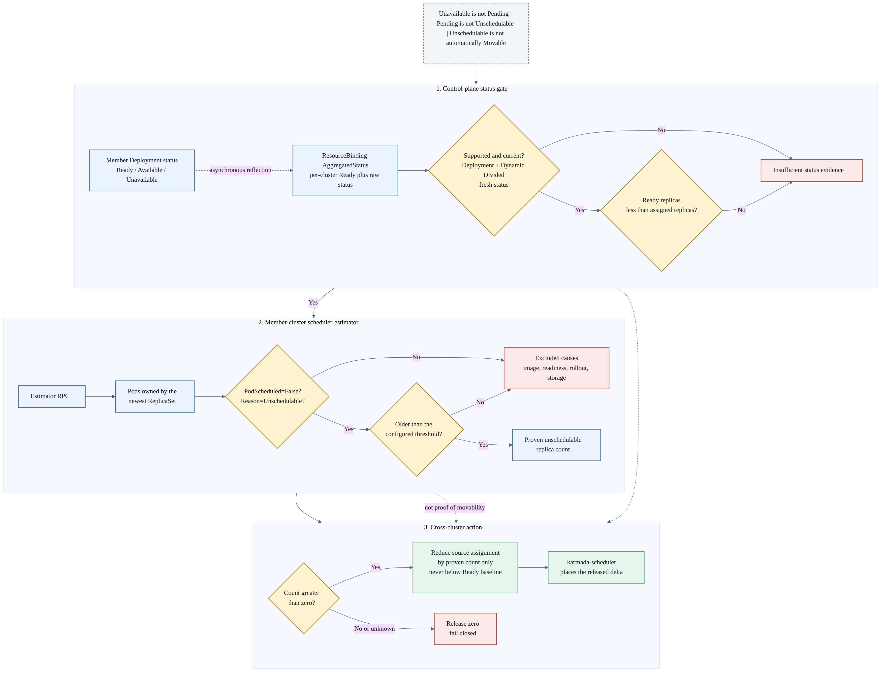

# Day 35：PR #7662 衍生调研：workload 的 unavailable、Pending 与可重调度副本

日期：2026-07-28

## 先说人话

### 先认清本文在说哪些对象

本文为了区分层次，把 `workload` 专门用来指“负责管理一组 Pod 的上层工作负载对象”，最典型的是 `Deployment`。它不是一个名为 Workload 的固定 Kubernetes Kind，而是 Deployment、StatefulSet、DaemonSet、Job 等资源的统称。

先只看本文最重要的 Deployment 场景：

```text
Karmada control plane
Deployment template: 全局期望 10 个副本
└── ResourceBinding: member1 分 6 个，member2 分 4 个

member1 cluster
Deployment: 这个集群期望 6 个副本
└── ReplicaSet: Deployment 用它维护当前版本
    ├── Pod 1 -> member1 的某个 Node
    ├── Pod 2 -> member1 的某个 Node
    └── ...共 6 个 Pod 对象
```

这几个对象各自回答不同问题：

| 对象 | 所在层次 | 回答的问题 | 本文关注的状态 |
| --- | --- | --- | --- |
| `ResourceBinding` | Karmada control plane | 全局 10 个副本分别分给哪些 member clusters | `spec.clusters[i].replicas`，例如 6 + 4 |
| `Deployment` | member cluster 中的 workload/controller 层 | 这个集群应该维持多少应用实例，目前整体容量够不够 | `.status.readyReplicas`、`.status.availableReplicas`、`.status.unavailableReplicas` |
| `ReplicaSet` | Deployment 与 Pod 之间 | 当前 Deployment 版本实际管理哪些 Pod | owner relationship、期望/实际 Pod 数 |
| `Pod` | 应用运行单元 | 这个具体实例是否已调度、是否启动、是否 Ready | phase `Pending/Running`、`PodScheduled`、`Ready` conditions |
| `Node` | member cluster 的机器/运行节点 | Pod 最终可以放到哪里，资源和约束是否满足 | CPU、memory、GPU、labels、taints 等 |

> 注释：本文说“workload 层面的 unavailable”，主要是指 **Deployment 对象**的 `.status.unavailableReplicas`。它是 Deployment 对自己管理的一组 Pod 做出的汇总，不是某个 Pod 上存在 `unavailable=true`，也不是 Node 的状态。

### 结论

`unavailable`、`Pending`、`Unschedulable` 和“值得跨集群移动”不是一回事：

- `unavailable` 在本文首先指 Deployment 的 `.status.unavailableReplicas`，是上层 workload 对一组 Pod 汇总出的容量缺口。例如 Deployment 想要 10 个可用副本，目前只有 8 个，那么缺口是 2；它不是 Pod phase。
- `Pending` 是 Pod phase，表示 Pod 已被 Kubernetes 接受，但一个或多个容器还没有完成启动准备。它既可能是调度器找不到 Node，也可能是在拉镜像。
- `Unschedulable` 是更窄的调度信号：`PodScheduled=False` 且 `reason=Unschedulable`，说明 member cluster 的 kube-scheduler 当前找不到符合条件的 Node。
- “可移动副本”不是 Kubernetes 原生状态，而是 Karmada 需要额外做出的策略判断：故障原因要具有集群局部性，目标集群要能承载，而且 workload 本身允许以这种单位迁移。

因此，PR [#7662](https://github.com/karmada-io/karmada/pull/7662) 如果要解决社区会议里的“某个 member cluster 长期 Pending，而另一个集群有空闲资源”场景，不能简单地把 workload 的全部 `unavailableReplicas` 都释放，也不能只看当前已经分配了多少副本。对现有能力最诚实的第一步，是只支持 `Deployment + Dynamic Divided`，复用 Karmada Descheduler 已有的长期 `Unschedulable` Pod 识别路径，按已证明的数量释放副本，并以当前 Ready 或 Available 数量作为安全下界。

这只是基于当前源码的实现建议，不是 #7662 已达成的社区共识。维护者建议的 `PreserveAvailableReplicas`、作者反提案的 `PreserveScheduled`、Descheduler 与 WorkloadRebalancer 的职责分工，以及 request 完成回执都仍未定。

### 一个具体例子

假设一个 Deployment 全局期望 10 个副本：

| 集群 | Karmada 已分配 | Available | 其余副本的真实情况 |
| --- | ---: | ---: | --- |
| `member1` | 6 | 4 | 1 个 Pod 长期 `Unschedulable`；1 个 Pod 已调度到 Node，但卡在 `ImagePullBackOff` |
| `member2` | 4 | 4 | 无异常，并且还有可用资源 |

此时：

- Deployment 的容量缺口是 `10 - 8 = 2`，所以有 2 个 unavailable replicas。
- 两个异常 Pod 都可能显示为 `Pending`，但原因不同。
- `PreserveScheduled` 只看到 `6 + 4 = 10` 已全部分配，缺口为 0，无法移动任何副本。
- 如果直接按 `PreserveAvailableReplicas` 把 `member1` 从 6 降到 4，会一次释放 2 个副本，但其中只有 1 个被证明是 member1 放不下；另一个是镜像问题，换集群是否有效取决于 registry、Secret 和网络环境。
- 现有 Descheduler 风格会只识别长期 `Unschedulable` 的 1 个 Pod，把 `member1` 从 6 调到 5，再由 karmada-scheduler 尝试把这 1 个副本放到别的集群。

这个例子说明：

> `unavailable count` 适合描述“少了多少服务容量”，`Unschedulable count` 更适合证明“有多少副本确实卡在 member kube-scheduler”，而 `movable count` 还需要跨集群和 workload 语义判断。

## 一、概念先拆开

### 1. 什么是 workload

workload 是 Kubernetes 用来运行应用或任务的资源。常见 workload 包括：

- `Deployment`：管理一组通常可以互换的无状态 Pod。
- `StatefulSet`：管理带稳定序号、网络身份和存储关系的 Pod。
- `DaemonSet`：在每个符合条件的 Node 上运行一个 Pod。
- `Job`：完成一定数量的任务，而不是长期维持在线服务容量。
- `Pod`：最小运行单元，也可以被直接创建。
- 自定义 workload：例如 `CloneSet`、`FlinkDeployment`、`RayJob`，其状态语义由 CRD 和对应 operator 定义。

Karmada 传播的是 workload 资源，member cluster 内的 workload controller 再创建 Pod，member kube-scheduler 最后把 Pod 绑定到 Node。因此，“跨集群把副本移走”和“集群内把 Pod 调度到某个 Node”是两个不同层级的决策。

### 2. 什么是副本 replica

“副本”不是永远等于“一只固定 Pod”，要看所在层级：

| 层级 | “副本”表示什么 |
| --- | --- |
| 全局 workload | 用户期望的并发实例数，例如 Deployment `.spec.replicas=10` |
| Karmada Binding | `ResourceBinding.spec.clusters[i].replicas` 分给某个 member cluster 的数量 |
| member workload | Override 和 replica revise 后，该集群实际收到的 workload 期望数量 |
| member Pod | workload controller 为达到期望数量创建的实际对象 |

Deployment 的一个逻辑副本通常可由新 Pod 替代，旧 Pod 删除后 UID 会变化；StatefulSet 的副本带 ordinal，例如 `web-0`，还可能绑定专属 PVC；Indexed Job 的执行单位是 completion index；DaemonSet 的单位则是“符合条件的 Node”。

所以设计跨 workload 的“移动 N 个副本”API 前，必须先回答 N 的单位和身份是什么。只给一个整数，对 Deployment 可能够用，对 StatefulSet、Job 和 DaemonSet 则可能丢失关键语义。

### 3. Pod 的 Pending 是什么

Kubernetes 官方定义中，Pod phase `Pending` 表示 Pod 已被集群接受，但一个或多个容器还没有完成设置并准备运行。它包含两个经常被混在一起的阶段：

1. Pod 还没有被调度到 Node。
2. Pod 已经被调度，但仍在下载镜像或准备容器。

因此，看到 `kubectl get pod` 中的 `Pending` 不能直接得出“集群资源不足”。应继续检查 Pod conditions 和 container states：

```text
Pod phase: Pending
  PodScheduled=False, reason=Unschedulable
  => member kube-scheduler 当前找不到合适 Node

Pod phase: Pending
  PodScheduled=True
  container waiting reason=ImagePullBackOff
  => Node 已经选定，问题在镜像拉取或凭据等启动准备
```

常见的 `Unschedulable` 原因包括：

- Node 的 CPU、memory、GPU 或扩展资源不足。
- `nodeSelector`、node affinity 或 topology 约束找不到匹配 Node。
- Node taint 没有对应 toleration。
- PVC、StorageClass、PV topology 或 volume binding 条件无法满足。
- 端口、设备插件或其他调度过滤条件冲突。

常见的“Pending 但已经 Scheduled”原因包括：

- 私有镜像缺少或写错 `imagePullSecret`。
- registry 不可达、限流或镜像不存在。
- volume attach/mount、CNI sandbox 或容器运行时准备失败。

### 4. Ready、Available 和 unavailable 的区别

| 信号 | 所在对象 | 含义 | 容易误解的地方 |
| --- | --- | --- | --- |
| `Ready=True` | Pod condition | Pod 可以服务请求，并通过 readiness gates | 刚 Ready 的 Pod 不一定已经满足 workload 的稳定可用时间 |
| `readyReplicas` | workload status | 当前 Ready 的副本数 | 它是计数，不说明未 Ready 的原因 |
| `availableReplicas` | workload status | Ready 状态连续保持至少 `.spec.minReadySeconds` 的副本数 | 比 Ready 更强，但仍不说明缺口是否能靠换集群修复 |
| `unavailableReplicas` | Deployment/DaemonSet status | 达到 100% 期望容量还缺多少副本 | 不是 Pod phase，也不是可迁移数量 |
| `Unschedulable` | `PodScheduled` condition reason | kube-scheduler 当前不能把 Pod 放到 Node | 需要持续时间阈值，避免把正常瞬时收敛当故障 |

一个 Pod 可以处于 `Running`，但 readiness probe 失败，因此不 Ready、也不 Available；一个刚通过 readiness 的 Pod 可以 Ready，但在 `minReadySeconds` 到达前仍不 Available。反过来，`unavailableReplicas=2` 只告诉我们容量缺 2，并不告诉我们对应 Pod 是没调度、拉镜像失败、rollout 中，还是应用健康检查失败。

### 5. movable 为什么是额外判断

跨集群移动可能有效，至少需要同时成立：

1. 当前失败是集群局部问题，而不是所有集群都会遇到的 manifest 或应用问题。
2. 目标集群满足 placement、资源、版本、存储和 policy 等条件。
3. workload 的执行单位可以被安全替代，不会破坏稳定身份、数据或任务完成语义。
4. Karmada 看到的状态足够新，确实对应当前 generation 和当前分配结果。

Kubernetes 没有一个通用 `.status.movableReplicas` 字段。它只能提供观察信号，Karmada 或自定义 interpreter 才能把这些信号解释为跨集群动作。

## 二、为什么同一个 manifest 在不同集群结果不同

多集群环境的价值和风险都来自“集群并不完全相同”。同一个 Pod template 可能得到以下结果：

| 环境差异 | `member1` 的结果 | `member2` 的结果 | 移动是否可能有效 |
| --- | --- | --- | --- |
| allocatable CPU/memory/GPU 不同 | `Unschedulable` | 有合适 Node，可运行 | 通常可能有效 |
| node labels、taints、scheduler profile 不同 | affinity/taint 不匹配 | 约束匹配 | 可能有效，但目标必须重新过滤 |
| StorageClass、CSI driver、PV topology 不同 | volume binding 或 mount 失败 | storage 条件满足 | 取决于数据和卷是否可跨集群恢复 |
| registry 网络、Secret、ServiceAccount 不同 | `ImagePullBackOff` | 能拉镜像 | 可能有效，但也可能应先修配置漂移 |
| CNI、DNS、服务依赖不同 | Running 但 readiness 失败 | Ready | 可能有效，但原因未必属于调度器 |
| image 名称或应用配置本身错误 | 所有集群都失败 | 所有集群都失败 | 无效，问题会跟着 workload 走 |
| Kubernetes 版本、准入策略、runtime 不同 | 被拒绝或行为不同 | 能创建 | 要先确认兼容和 policy 边界 |

Karmada 还可能通过 `OverridePolicy` 给不同集群改 image、resource requests、StorageClass 等字段。因此判断时不能只读 control plane 的原始 template，还要考虑 member cluster 实际收到的 manifest。

> 分析：`Unschedulable in member1` 只是当前集群的负面证据；“member2 一定能放下”仍应由 Karmada 的 cluster filter、scheduler estimator 或真实调度结果证明。

## 三、其他 workload 怎么识别 unavailable

### 1. 原生 workload 状态矩阵

| Workload | 可读取的主要状态 | unavailable 怎么得到 | 能否直接当作可移动副本 | 关键风险 |
| --- | --- | --- | --- | --- |
| `Deployment` | `replicas`、`readyReplicas`、`availableReplicas`、`unavailableReplicas`、`updatedReplicas`、`observedGeneration` | API 直接提供 `unavailableReplicas` | 不能；还要看 Pod 原因 | 最适合做第一版，但 rollout、镜像和 readiness 都会造成缺口 |
| `ReplicaSet` | `replicas`、`readyReplicas`、`availableReplicas`、`observedGeneration` | 可近似为 desired - available | 不能 | 通常由 Deployment 管理，直接操作可能与上层 controller 冲突 |
| `StatefulSet` | `currentReplicas`、`updatedReplicas`、`readyReplicas`、`availableReplicas`、`currentRevision` | 可按 desired - available 推导容量缺口 | 通常不能按整数直接移动 | ordinal、稳定网络身份、PVC、更新顺序和数据恢复 |
| `DaemonSet` | `desiredNumberScheduled`、`numberReady`、`numberAvailable`、`numberUnavailable` | API 直接提供 `numberUnavailable` | 不能套用“跨集群移动 N 个副本” | 期望数量由 eligible Nodes 决定，没有普通 `.spec.replicas` |
| `Job` | `active`、`ready`、`succeeded`、`failed`、`completedIndexes`、`failedIndexes` | 没有通用 available；要按 completion 目标判断进度 | 不能 | `active` 同时包含 Pending 和 Running；已完成不是 Ready；重跑可能重复副作用 |
| `Pod` | phase、conditions、container states | 直接判断这个 Pod 的 phase/conditions | 只有一个单元，但仍不一定安全 | 删除会改变 UID，可能丢本地状态或一次性执行进度 |
| `CronJob` | active Job refs、last schedule/success time | 应看其创建的 Job，不是 replica availability | 不能 | 调度周期和 Job 历史才是核心语义 |

### 2. Deployment

Deployment 是 #7662 当前故事最自然的第一目标：

- 副本通常可互换。
- API 同时提供 Ready、Available 和 Unavailable 计数。
- Karmada 已有按集群聚合 Deployment status 的路径。
- 现有 Karmada Descheduler 已能找到 Deployment 最新 ReplicaSet 拥有的 Pod，再识别长期 `Unschedulable` 数量。

但即使是 Deployment，也不能只读 `unavailableReplicas`。rollout 中的旧新 ReplicaSet 交替、`minReadySeconds`、readiness failure 和 image failure 都可能让这个数字增加。

### 3. StatefulSet

StatefulSet 的 `readyReplicas` 和 `availableReplicas` 可以描述当前容量，但“少 2 个”不等于可以随便在另一个集群补 2 个：

- `web-0` 与 `web-1` 有明确 ordinal。
- 每个 ordinal 可能绑定自己的 PVC。
- 默认更新和创建有顺序保证。
- 跨集群恢复可能依赖 Karmada 的 Application State Preservation，而不是简单减少 Binding 的整数。

所以 StatefulSet 需要“哪个 ordinal、数据在哪、目标如何恢复、源何时删除”的合同。一个通用 count 不够。

### 4. DaemonSet

DaemonSet 不是“用户想要 10 个副本”，而是“每个符合条件的 Node 运行一个”。`numberUnavailable` 可以反映 eligible Nodes 上缺多少可用 Pod，但跨集群把 2 个副本从 A 移到 B 不会修复 A 上那两个 Node 的覆盖缺口。

Karmada 默认 replica interpreter 也没有把 DaemonSet 当成普通 replica workload。它的扩展单位应是 Node coverage，而不是 Binding replica count。

### 5. Job 和批处理 workload

Job 的成功标准是完成任务，而不是持续维持 Available：

- `active` 包含 Pending 和 Running Pod。
- `succeeded` 表示任务已完成，不要求 Pod 仍 Ready。
- Indexed Job 需要保留 completion index 身份。
- 一个任务可能对外部系统产生不可重复的副作用。

因此 Job/Flink/Ray 类 workload 需要的是 completion、checkpoint、index 和幂等语义。只因为某个 Pod Pending 就在另一集群重建，可能造成重复执行或丢进度。

### 6. CRD 与 ResourceInterpreter

CRD 没有统一 status schema。Karmada 的 Resource Interpreter 可以扩展：

- `InterpretReplica`：解释 workload 的期望副本和资源需求。
- `InterpretComponent`：解释一个自定义 workload 包含哪些组件。
- `InterpretStatus` / `AggregateStatus`：反射和聚合 member 状态。
- `InterpretHealth`：判断整个资源在某个集群是否健康。

这些接口能让 Karmada 理解 `CloneSet` 或其他 operator workload，但当前并没有一个标准解释器接口返回“该集群有 N 个长期 Unschedulable、其中 M 个允许跨集群移动”。现有 `InterpretHealth` 是资源级健康判断，不能替代部分副本计数。

如果 #7662 未来要真正支持多种 CRD，需要 workload 显式 opt in，并提供结构化语义，例如：

```text
desired / ready / available / unschedulable / movable
observedGeneration / observedAt / unitKind
```

这会是一个新的 API/ResourceInterpreter 设计课题，不应假装通过读取任意 CRD 的 `.status.availableReplicas` 就已经通用化。

## 四、Karmada 当前怎么识别这些状态

### 1. Binding 的状态反射

`ResourceBinding.status.aggregatedStatus[]` 按 member cluster 保存：

- 原始 workload status。
- applied 状态和 message。
- 资源级 `Health`。

Karmada 内置 status aggregator 支持 Deployment、ReplicaSet、StatefulSet、DaemonSet、Job 等原生类型；但不同类型聚合的字段不同。状态来自 member cluster 的异步回传，因此做动作前还要考虑 `observedGeneration`、当前 Binding 分配和状态是否对齐，缺失或过期时应 fail closed，也就是释放 0 个副本。

Application Failover 使用的是资源/集群级 Health，可在一个 placement 整体不健康时触发故障转移。它不是“从这个集群只取走 2 个 unavailable replicas”的部分副本分类器。

### 2. 现有 Descheduler 是最接近的实现

截至 `upstream/master@ce2a7b869477272202095282251afe490c38d525`，Karmada Descheduler 的实际流程是：

1. 只接受 `Deployment`。
2. 只接受 replica scheduling 为 `Dynamic` + `Divided` 的 Binding。
3. 从 `ResourceBinding.status.aggregatedStatus` 读取各集群 `readyReplicas`。
4. 当某个集群 `ready < assigned` 时，把它列为候选。
5. 调用部署在 member cluster 的 scheduler-estimator。
6. estimator 找到 Deployment 最新 ReplicaSet 的 Pod，只统计 `PodScheduled=False`、`reason=Unschedulable` 且超过 threshold 的 Pod。
7. Descheduler 按该数量降低原集群的 Binding assigned replicas，但不低于当前 Ready 数量。
8. Binding 总分配少于全局 desired 后，karmada-scheduler 再补足这部分副本。

官方文档给出的默认 `--unschedulable-threshold` 是 5 分钟，默认扫描周期为 2 分钟。时间阈值的意义是排除刚创建、正常等待调度的瞬时状态。

这条路径的重要价值在于，它没有把以下问题误算成 kube-scheduler 放不下：

- 已 Scheduled 后的 `ImagePullBackOff`。
- readiness probe 失败。
- rollout 期间尚未 Available。
- 应用本身启动或依赖失败。

它也有明确限制：

- 只支持 Deployment。
- 依赖 Dynamic Divided replica scheduling。
- 需要 scheduler-estimator addon 和 member cluster 本地 Pod/ReplicaSet 视图。
- `readyReplicas` 读取处仍有“与 custom resource interpreter 协作”的 TODO。
- 它是周期控制器；#7662 的 WorkloadRebalancer 是用户显式请求。谁负责识别、谁更新 Binding、如何避免两个 writer 重复释放，仍需设计。

### 3. 信号流图



- canonical source：[Mermaid](day35-pr7662-workload-state-signal-flow.mmd)
- renderer：`@mermaid-js/mermaid-cli@11.16.0`
- 图中绿色路径表示当前 Descheduler 能证明的 Deployment 场景；灰色/红色分支表示没有足够证据时不释放。

渲染过程记录：本机没有预装 `mmdc`，因此显式使用固定版本的 `npx` fallback。三阶段重排后的第一次渲染失败，错误为 Mermaid 把节点 ID `call` 解析成 callback 关键字；将内部 ID 改为 `rpc` 后重新渲染。这个修改只影响图源码标识，不改变图中展示文本和技术含义。

## 五、对 #7662 两种提案语义的影响

| 候选语义 | 它实际读取什么 | 能否解决“6 已分配、4 Ready、2 长期 Pending” | 主要风险 |
| --- | --- | --- | --- |
| `PreserveScheduled` | Binding 已分配副本数 | 不能；6 个都已分配时 deficit=0 | 把“跨集群分配”误当成“member 内已成功调度” |
| `PreserveAvailableReplicas` | member workload Available 计数 | 能释放缺口，但不知道缺口原因 | 会把 image、readiness、rollout、应用失败都当成可移动 |
| `PreserveReadyReplicas` | member workload Ready 计数 | 同样能释放缺口，现有 Descheduler 使用它做下界 | Ready 波动更快，也不提供原因 |
| `ReleaseUnschedulableReplicas` | member Pod 长期 `Unschedulable` 计数 | 能精确覆盖资源/约束导致的 Pending 子集 | 当前只对 Deployment 有成熟实现，仍需处理目标容量和 writer ownership |

这里还有一个命名陷阱：

- Binding 的 `spec.clusters[i].replicas` 是 Karmada “已分配到 member cluster”的数量。
- Pod condition `PodScheduled=True` 才是 member kube-scheduler “已绑定到 Node”。

如果 `PreserveScheduled` 指前者，它无法识别 member 内 Pending；如果想表达后者，API 和数据源就必须明确写成 Pod scheduling signal，不能只根据 Binding 求和。

## 六、当前建议的最小边界

基于社区会议 user story 和当前源码，较可控的 v1 行为是：

1. 只支持 `Deployment`。
2. 只支持 `Dynamic` + `Divided` replica scheduling。
3. 只释放超过阈值、由 member kube-scheduler 明确标记为 `Unschedulable` 的 Pod 数量。
4. 删除或降低源集群目标时，不低于可信的 Ready/Available 下界。
5. Binding status 缺失、generation 不匹配、数据过期或 interpreter 不支持时释放 0。
6. 目标集群仍走正常 Karmada filter、score 和 estimator，不假设“别的集群一定有资源”。
7. 复用现有 scheduler-estimator 识别逻辑，不在 WorkloadRebalancer controller 再写一套 Pod owner traversal。
8. 在代码前先决定 Descheduler 与 WorkloadRebalancer 的单一写入者和请求完成合同。

其中第 4 点仍需社区明确选择：

- Ready 下界与现有 Descheduler 一致，反映当前能服务的 Pod。
- Available 下界更稳定，并尊重 `minReadySeconds`，但可能比 Ready 更保守。

如果社区希望一个真正通用的 API，合理方向是新增或扩展 ResourceInterpreter，让每个 workload 返回结构化、带 freshness 的 partial replica state，并明确 `unitKind` 和迁移语义。代价是 API、interpreter、scheduler、controller 和测试面都会显著扩大，不适合在 #7662 仍未收敛时直接实现。

## 七、社区历史提供了什么证据

### PR #7662 与 2026-06-30 会议

[Day 23 会议记录](day23-pr7662-meeting-2026-06-30-transcript-and-alignment.md) 中的 story 2 是：member cluster 资源不足导致部分离线/可中断 workload Pod 长期 Pending，而其他 member cluster 可能有空闲资源，希望只重新调度不可用部分。会议对这个用户故事有初步正向信号，也明确提到 Descheduler 已经在找 unavailable/unschedulable，但没有确定数据源、支持矩阵或两个组件的职责。

2026-07-21 的 [maintainer review](https://github.com/karmada-io/karmada/pull/7662#pullrequestreview-4742653446) 建议把 proposal 收窄为 `PreserveAvailableReplicas` 并移出 SafeMigration；作者 2026-07-27 的[回复](https://github.com/karmada-io/karmada/pull/7662#issuecomment-5092574880)同意缩 scope，但反提 `Full | PreserveScheduled`。截至本次调研，maintainer 尚未回应反提案，PR head 仍是 2026-06-23 的旧 proposal commit `586f6fc`。

因此不能把任何一个字段名写成已批准 API。

### Issue #3092：自定义资源支持

[Issue #3092](https://github.com/karmada-io/karmada/issues/3092) 在 2022 年提出 Descheduler 不支持 custom CRD，后由作者在 2024 年关闭，但没有评论或关联实现证据。当前源码仍把支持 GVK 固定为 Deployment，所以“issue closed”不能解释为 CRD 支持已经完成。

### Issue #5987：FlinkDeployment

[Issue #5987](https://github.com/karmada-io/karmada/issues/5987) 提出为 FlinkDeployment 增加 descheduling。贡献者在[方案说明](https://github.com/karmada-io/karmada/issues/5987#issuecomment-2564128577)中设想列出 JobManager/TaskManager Pods 并识别 unschedulable；维护者进一步[追问调度失败原因和 Application State Preservation](https://github.com/karmada-io/karmada/issues/5987#issuecomment-2571975631)，贡献者随后[说明其关注 member cluster 资源不足](https://github.com/karmada-io/karmada/issues/5987#issuecomment-2572429995)。issue 目前仍 open，没有形成合并设计。

它证明批处理/有状态 operator workload 有真实需求，也证明不能只复制 Deployment 的 Pod count：Flink 的 checkpoint、JobManager/TaskManager 角色和应用状态都需要单独合同。

### Issue #5788：Application State Preservation

[Issue #5788](https://github.com/karmada-io/karmada/issues/5788) 已实现有状态应用故障转移中的状态保留能力。它处理的是整个应用 failover 和状态恢复，不是从某个集群按计数释放部分 unavailable replicas。它可以成为 Stateful/Flink 场景的组成部分，但不能直接代替 #7662 的 partial replica classifier。

## 八、技术证据

以下源码链接固定在本次调研使用的 `upstream/master@ce2a7b869477272202095282251afe490c38d525`：

- [Descheduler 只支持 Deployment + Dynamic Divided](https://github.com/karmada-io/karmada/blob/ce2a7b869477272202095282251afe490c38d525/pkg/descheduler/core/filter.go#L30-L61)
- [从 AggregatedStatus 读取 Ready，并筛选 ready < assigned 的集群](https://github.com/karmada-io/karmada/blob/ce2a7b869477272202095282251afe490c38d525/pkg/descheduler/core/helper.go#L40-L147)
- [estimator 只统计长期 PodScheduled=False / Unschedulable 的 Deployment Pod](https://github.com/karmada-io/karmada/blob/ce2a7b869477272202095282251afe490c38d525/pkg/estimator/server/replica/replica.go#L42-L75)
- [降低源集群 assigned replicas，但不低于 Ready](https://github.com/karmada-io/karmada/blob/ce2a7b869477272202095282251afe490c38d525/pkg/descheduler/descheduler.go#L197-L244)
- [ResourceBinding AggregatedStatusItem 与 Health 字段](https://github.com/karmada-io/karmada/blob/ce2a7b869477272202095282251afe490c38d525/pkg/apis/work/v1alpha2/binding_types.go#L425-L476)
- [原生 workload status aggregation 入口](https://github.com/karmada-io/karmada/blob/ce2a7b869477272202095282251afe490c38d525/pkg/resourceinterpreter/default/native/aggregatestatus.go#L44-L119)
- [默认 replica interpreter 支持范围](https://github.com/karmada-io/karmada/blob/ce2a7b869477272202095282251afe490c38d525/pkg/resourceinterpreter/default/native/replica.go#L36-L128)
- [默认 health interpreter 是资源级健康判断](https://github.com/karmada-io/karmada/blob/ce2a7b869477272202095282251afe490c38d525/pkg/resourceinterpreter/default/native/healthy.go#L33-L118)
- [WorkloadRebalancer 当前在写入 Binding request 后结束本轮处理](https://github.com/karmada-io/karmada/blob/ce2a7b869477272202095282251afe490c38d525/pkg/controllers/workloadrebalancer/workloadrebalancer_controller.go#L189-L252)

官方文档：

- [Kubernetes Pod lifecycle](https://kubernetes.io/docs/concepts/workloads/pods/pod-lifecycle/)
- [Kubernetes Pod conditions](https://kubernetes.io/docs/concepts/workloads/pods/pod-condition/)
- [Deployment API](https://kubernetes.io/docs/reference/kubernetes-api/apps/deployment-v1/)
- [ReplicaSet API](https://kubernetes.io/docs/reference/kubernetes-api/apps/replica-set-v1/)
- [StatefulSet API](https://kubernetes.io/docs/reference/kubernetes-api/apps/stateful-set-v1/)
- [DaemonSet API](https://kubernetes.io/docs/reference/kubernetes-api/apps/daemon-set-v1/)
- [Job API](https://kubernetes.io/docs/reference/kubernetes-api/batch/job-v1/)
- [Assigning Pods to Nodes](https://kubernetes.io/docs/concepts/scheduling-eviction/assign-pod-node/)
- [Taints and Tolerations](https://kubernetes.io/docs/concepts/scheduling-eviction/taint-and-toleration/)
- [Storage Classes](https://kubernetes.io/docs/concepts/storage/storage-classes/)
- [Pull an Image from a Private Registry](https://kubernetes.io/docs/tasks/configure-pod-container/pull-image-private-registry/)
- [Karmada Resource Interpreter](https://karmada.io/docs/userguide/globalview/customizing-resource-interpreter/)
- [Karmada Descheduler](https://karmada.io/docs/userguide/scheduling/descheduler)

## 九、已确认边界与未决问题

### 已确认

- 社区会议里的目标场景是真实正常路径，不是 mock-only 极端状态。
- `PreserveScheduled` 如果只看 Binding assigned replicas，无法识别已分配但 member 内 Pending 的副本。
- `unavailableReplicas` 不能直接等价为可跨集群移动数量。
- Karmada 已有 Deployment 长期 `Unschedulable` 识别和释放路径，可以作为 #7662 设计依据。
- StatefulSet、DaemonSet、Job 和 CRD 的工作单位及安全合同不同，不能只换字段名后复用 Deployment 逻辑。

### 未决

- #7662 最终选择 Ready、Available、Unschedulable，还是新结构化 interpreter 输出作为数据源。
- WorkloadRebalancer 是直接执行释放，还是只触发/编排现有 Descheduler 能力。
- 用户显式请求与周期 Descheduler 同时命中时，哪个组件是 Binding 的单一 writer。
- status freshness 如何表示和校验；current raw status 没有统一 `observedAt`。
- request 何时算 `Successful`：controller 写入请求，scheduler 接受，Binding 更新，还是新副本真正到达目标状态。
- Stateful/Job/Flink 是否进入本 proposal，若进入，ordinal、PVC、checkpoint、completion index 和重复执行如何处理。

## 十、下一步

1. 等待 `RainbowMango` 对 `PreserveScheduled` 反提案的回应，不提前实现 typed API。
2. 如果社区继续讨论，在 #7662 明确提出上述 10 副本反例，要求先定义“scheduled”是 Binding assigned 还是 PodScheduled。
3. 建议 proposal 增加 workload support matrix，首版只承诺 Deployment + Dynamic Divided。
4. 在单一 writer 和 request completion contract 未明确前，不让 WorkloadRebalancer 与 Descheduler 各自修改 Binding。
5. 若 maintainer 选择长期 Unschedulable 语义，下一轮先评估如何复用 estimator client，而不是新增一套 Pod 扫描代码。

本轮只完成调研和本地报告，没有修改 Karmada 产品代码，也没有发布 upstream 评论。
