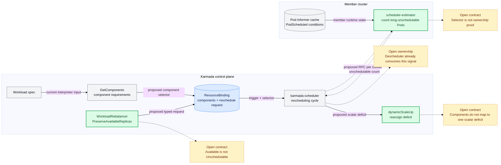

# Day 37：PR #7662 selector / unschedulable 方案更新 Review

## 先说人话

一句话结论：[#7662 的 2026-07-30 新评论](https://github.com/karmada-io/karmada/pull/7662#issuecomment-5126046690) 找到了比 `PreserveScheduled` 更接近真实问题的数据源，但还没有形成可以开始写 typed API 的完整合同。

用 10 副本 Deployment 举例：`member1` 已经分到 6 个副本，其中 2 个 Pod 连续 5 分钟保持 `PodScheduled=False, Reason=Unschedulable`；`member2` 分到 4 个并正常运行。旧的 `PreserveScheduled` 只看 Binding，得到 `assigned=10`、缺口为 0，因此什么也不做。新方向让 member 侧 scheduler-estimator 检查 Pod，可以识别 `member1` 的 2 个长期 unschedulable 副本。这正面补上了 Day 35 的核心反例。

但现在仍不能直接实现，原因不是“selector 这个想法不行”，而是还缺四个合同：

1. API 叫 `PreserveAvailableReplicas`，执行信号却只统计 `Unschedulable`，两者不是互补集合；
2. label selector 能查询 Pod，但不能独自证明 Pod ownership 和 rollout lifecycle；
3. `GetComponents` 面向多组件 workload，而当前 `dynamicScaleUp` 只处理一个标量副本缺口；
4. 现有 Descheduler 已经拥有“检测 unschedulable -> 缩小 Binding -> scheduler 补齐”的链路，新方案需要解释为什么 scheduler 也应读取这个 member runtime 信号。

当前最合理的动作仍是等待 `@zhy76` / `@RainbowMango` 回应和作者改写 proposal，不抢实现，也不把 7 月 28 日会议的 scope 共识扩大成 API 共识。

## 这次到底更新了什么

### 远端状态

| 项目 | 2026-07-30 快照 |
| --- | --- |
| PR | Open，`size/XL`、`kind/documentation` |
| Head | `586f6fc3508eb0a504223898c0329a4bb8b4c57c`，仍是 2026-06-23 的单个 720 行 proposal commit |
| 新内容 | `@zhzhuang-zju` 新增一条设计评论；proposal 文件没有更新 |
| Reviewer 状态 | `tide` pending，需要 approved / lgtm；已有 checks 只验证旧 head，不验证新评论中的设计 |
| 责任人 | PR assignee 为 `@RainbowMango`；作者 `@zhy76` 仍在推进同一 proposal |

`@zhzhuang-zju` 是 [Karmada active maintainer](https://github.com/karmada-io/community/blob/main/MAINTAINERS.md)，也是当前仓库 [root `OWNERS`](https://github.com/karmada-io/karmada/blob/ce2a7b869477272202095282251afe490c38d525/OWNERS) approver；这条意见有 maintainer 权重。但评论使用的是 `propose` / `WDYT`，仍是请求讨论的方案，不是批准结论。

### 会议只确认了范围

[2026-07-28 官方会议记录](https://docs.google.com/document/d/1y6YLVC-v7cmVAdbjedoyR5WL0-q45DBRXTvz5_I7bkA/edit) 对 #7662 只写了：社区同意继续处理 offline workload 方向。它支持以下判断：

- `SafeMigration` / online graceful migration 不再是 #7662 当前范围；
- 当前目标是长期 Pending / unschedulable replica 的重调度。

会议记录没有给出 selector schema、`PreserveAvailableReplicas` 精确定义、scheduler/Descheduler ownership、多组件映射或 completion contract，因此不能用它证明新 API 已获批准。

## 新方案的运行路径

这张图只回答一个问题：2026-07-30 评论把哪个新信号送进 scheduler，以及合同还断在哪里。



- Canonical source：[Mermaid](day37-pr7662-selector-unschedulable-flow.mmd)
- Renderer：`@mermaid-js/mermaid-cli@11.16.0`，white-background PNG
- 绿色节点是评论提出的新步骤；灰色节点是当前已有组件；黄色节点是尚未闭合的合同，不代表已发生故障。

按评论描述，预期流程是：

1. 资源解释器（`GetComponents`）从 workload 中返回 component 及 selector；
2. detector 把结果持久化到 Binding；
3. WorkloadRebalancer controller 写入 `PreserveAvailableReplicas` reschedule request；
4. 调度器（karmada-scheduler）在本次重调度中调用 member 的 scheduler-estimator；
5. estimator 按 selector 找 Pod，统计长期 `Unschedulable` 数量；
6. scheduler 把该数量作为待重新分配的 deficit，并复用 `dynamicScaleUp`。

其中第 1、3、4、5、6 步都是 proposal，当前 master 并没有这条完整路径。

## 技术证据

源码基线：`upstream/master@ce2a7b869477272202095282251afe490c38d525`（2026-07-27 merge #7798）。

| 源码位置 | 证明内容 |
| --- | --- |
| [`pkg/estimator/server/replica/replica.go`](https://github.com/karmada-io/karmada/blob/ce2a7b869477272202095282251afe490c38d525/pkg/estimator/server/replica/replica.go#L42-L97) | 当前只支持 Deployment，并按长期 `PodScheduled=False/Unschedulable` 计数。 |
| [`pkg/util/lifted/deployment.go`](https://github.com/karmada-io/karmada/blob/ce2a7b869477272202095282251afe490c38d525/pkg/util/lifted/deployment.go#L70-L164) | 当前路径使用 Deployment / ReplicaSet / Pod `ControllerRef` UID 和 current ReplicaSet 过滤。 |
| [`pkg/detector/detector.go`](https://github.com/karmada-io/karmada/blob/ce2a7b869477272202095282251afe490c38d525/pkg/detector/detector.go#L1495-L1534) | `GetComponents` 受 feature gate 控制，成功后写 `Binding.spec.components` 并跳过 `GetReplicas`。 |
| [`pkg/scheduler/core/common.go`](https://github.com/karmada-io/karmada/blob/ce2a7b869477272202095282251afe490c38d525/pkg/scheduler/core/common.go#L50-L77) | 多组件 workload 当前不进入 replica assignment。 |
| [`pkg/scheduler/core/division_algorithm.go`](https://github.com/karmada-io/karmada/blob/ce2a7b869477272202095282251afe490c38d525/pkg/scheduler/core/division_algorithm.go#L121-L136) | `dynamicScaleUp` 只计算一个 Binding 级标量 deficit。 |
| [`pkg/descheduler/descheduler.go`](https://github.com/karmada-io/karmada/blob/ce2a7b869477272202095282251afe490c38d525/pkg/descheduler/descheduler.go#L197-L249) | 现有 Descheduler 已消费 unschedulable estimate、减少 Binding replicas 并触发 scheduler 补齐。 |
| [`pkg/controllers/workloadrebalancer/workloadrebalancer_controller.go`](https://github.com/karmada-io/karmada/blob/ce2a7b869477272202095282251afe490c38d525/pkg/controllers/workloadrebalancer/workloadrebalancer_controller.go#L55-L70) | controller 目前只 watch WorkloadRebalancer spec update。 |

### 已经解决了一半：真实 Pod scheduling failure 终于可见

当前 scheduler 的 `dynamicScaleUp` 只计算：

```text
targetReplicas = Binding.spec.replicas - sum(Binding.spec.clusters[].replicas)
```

因此所有副本都已经写入 Binding 时，它看不到 member 内部的 Pending Pod。新评论改为调用 scheduler-estimator，后者当前用下面的条件统计 Pod：

```text
PodScheduled == False
Reason == Unschedulable
LastTransitionTime + threshold < now
```

这比 `availableReplicas` 更接近“换一个资源充足的集群可能修复”的 scheduling-level signal，也确实能区分 image pull、readiness probe 和应用启动失败。

### 未闭合 1：`Available` 与 `Unschedulable` 不是同一个集合

| Pod 情况 | Available | 长期 Unschedulable | 新 estimator 会移动吗 |
| --- | --- | --- | --- |
| 正常 Ready | 是 | 否 | 否 |
| 已绑定 Node，但 image pull 失败 | 否 | 否 | 否 |
| 已调度但 readiness 失败 | 否 | 否 | 否 |
| `PodScheduled=False/Unschedulable` 超过阈值 | 否 | 是 | 是 |
| 控制器尚未创建出预期 Pod | 否 | 没有 Pod 可统计 | 否 |

所以评论中的机制实际是“只重新调度长期 unschedulable Pods”，不是“重新调度所有 unavailable replicas”。`PreserveAvailableReplicas` 可以只表达安全约束，也就是 available 副本绝不移动；它不一定承诺所有 unavailable 副本都会移动。但当前单个布尔字段还没有说明 eligible set 只包含长期 unschedulable Pod，public API 注释和 proposal 必须把这层选择规则补出来。

### 未闭合 2：selector 是查询条件，不是 ownership 证明

当前 Deployment estimator 路径并非只使用 `Deployment.spec.selector`：

1. 从 member cache 读取实际 Deployment；
2. 找到与当前 PodTemplate 匹配的新 ReplicaSet；
3. 只保留 `ControllerRef` 指向该 ReplicaSet UID 的 Pod；
4. 再统计这些 Pod 的 `PodScheduled` condition。

这组 UID/owner 过滤避免把同标签的其他 Pod 或旧 rollout ReplicaSet 算进去。若 request 只传一个 selector，例如 `app=web`，rolling update 期间旧、新 ReplicaSet 都可能匹配它；自定义 controller 也可能使用运行时生成的 label 或间接 owner chain。selector 可以缩小候选集合，但 generic support 仍需定义 workload/component 到 Pod 的 ownership 和 lifecycle 验证规则。

### 未闭合 3：多组件结果不能直接进入标量 `dynamicScaleUp`

`GetComponents` 当前主要服务 FlinkDeployment、TFJob、RayCluster、Volcano Job 等多 PodTemplate workload。每个 component 有独立的 `name`、`replicas` 和 resource requirements。

但当前 scheduler 明确规定：

- 多组件 workload 作为完整 component set 选择 cluster；
- 不支持 replica division；
- `AssignReplicas` 对 `len(spec.Components) > 1` 的 workload 跳过 `assignWorkloadReplicas`；
- `dynamicScaleUp` 只接受一个 `spec.Replicas - assignedReplicas` 标量。

例如一个 FlinkDeployment 有 `jobmanager=1`、`taskmanager=4`，只有 1 个 taskmanager Pod unschedulable。Binding 目前没有“只把一个 taskmanager replica 从 member1 移到 member2”的表达和 revision contract。仅给每个 component 增加 selector，并不能让 `dynamicScaleUp(1)` 知道要移动哪个 component、如何修改原 workload spec，以及另一个 cluster 应收到完整 workload 还是局部 component。

因此 “any workload that implements `GetComponents` can be supported” 目前证据不足。首版需要明确收窄到可拆分的 single-component workload，或者先设计 per-component placement / revision 语义；二者不能由 selector 自动推出。

### 未闭合 4：feature gate 与现有 owner 边界

`GetComponents` 只在 alpha、默认关闭的 `MultiplePodTemplatesScheduling` feature gate 下运行；启用时 detector 将结果写入 `Binding.spec.components`，并跳过 `GetReplicas`。若 #7662 的通用行为强依赖这个 hook，需要明确：

- 未开启 feature gate 时 `PreserveAvailableReplicas` 是拒绝、降级还是不支持；
- single-component workload 的 `spec.replicas` 和新 `components` 如何共同驱动 replica assignment；
- API 是否应与一个 alpha gate 耦合。

更重要的是，现有 Descheduler 已经完成几乎相同的数据路径：它周期性读取 Binding reflected ready status，调用 estimator 统计长期 unschedulable Deployment Pods，减少 `Binding.spec.clusters`，再由 scheduler 的 Steady scale-up 补齐。它当前只支持 namespace-scoped Deployment 和 dynamic divided placement，但这说明 unschedulable detection 已有 owner。

新方案让 scheduler 在显式 reschedule cycle 中直接读取 member Pod signal。proposal 需要说明这是有意扩展 scheduler contract，还是应复用/扩展 Descheduler 的既有边界；否则同一信号可能存在两个触发者和两套失败语义。

### completion contract 仍然没有变化

当前 WorkloadRebalancer controller 在成功更新 Binding 后立即把 workload 标为 `Successful`，并且只 watch WorkloadRebalancer spec。新评论没有回答：

- scheduler-estimator 不可用或部分 cluster RPC 失败时，本次请求失败、重试还是降级；
- scheduler 何时确认应用了当前 `TriggeredAt` 和 behavior；
- WorkloadRebalancer 如何收到完成事件；
- 与 Descheduler 同时处理同一 Binding 时如何仲裁。

这些问题不要求恢复旧 proposal 的长事务 migration 状态机，但至少需要一个可验证的 request acknowledgment contract。

## 已确定、建议方向与待确认

| 分类 | 结论 |
| --- | --- |
| 已确定 | #7662 scope 收窄到 offline / long-running Pending workload；SafeMigration 移出当前 proposal。 |
| 已确定 | `PreserveScheduled` 单看 Binding assigned count 无法识别“已 assigned、member 内长期 unschedulable”的副本。 |
| 建议方向 | 使用 member scheduler-estimator 的 `PodScheduled=False/Unschedulable + threshold` 信号，比 generic unavailable count 更贴近 scheduling failure。 |
| 仍待确认 | API 最终叫 `PreserveAvailableReplicas`、unschedulable-specific behavior，还是别的 typed contract。 |
| 仍待确认 | selector 如何与 owner UID、rollout lifecycle 和 custom workload runtime labels 组合。 |
| 仍待确认 | 首版 workload/placement support matrix，以及 multi-component 是否明确排除。 |
| 仍待确认 | scheduler 与 Descheduler 的职责、RPC failure、request completion 和并发仲裁。 |

## 反证检查

为避免把“尚未说明”误写成“方案必然错误”，又从四个可能成立的解释反向检查了一次：

- 如果 `PreserveAvailableReplicas` 只定义保护集合，而 proposal 另外明确 eligible set 是长期 unschedulable Pod，那么字段名可以成立；当前缺的是后半句合同。
- 如果 interpreter 对某类 workload 能保证 selector 唯一、稳定并绑定当前 lifecycle，那么 selector 可以成为有效扩展点；当前 generic claim 还没有给出这种 workload contract。
- 如果首版明确只支持 single-component、Divided dynamic placement，多组件到标量 deficit 的问题可以成为 non-goal；此时应删除“任何实现 `GetComponents` 的 workload 都支持”的宽泛表述。
- 如果 scheduler 明确负责 on-demand request，Descheduler 继续负责 periodic policy，两者可以共存；仍需定义同一 Binding 同时触发时的仲裁和错误语义。

因此当前结论是“方向值得继续、合同不足”，不是 blocking code finding，也不是否定 selector 方案。

## 调研过程中的阻塞与绕过

- `gh api repos/karmada-io/karmada/collaborators/zhzhuang-zju/permission` 返回 `HTTP 403: Must have push access`；改用 Karmada community `MAINTAINERS.md` 和仓库 root `OWNERS` 验证其 maintainer/approver 身份。
- 通用网页工具无法直接打开 Google Docs meeting notes；改用公开的 `export?format=txt` 端点回读 2026-07-28 条目。
- 当前 `intern` 是 record-only 分支，没有展开 upstream source；源码证据通过 `git show` / `git grep upstream/master:<path>` 获取，没有把 Karmada source tree 加回本分支。

## 下一步

1. 先等 `@zhy76` 或 `@RainbowMango` 对 7 月 30 日方案给出 scope/API 反馈，并等待 proposal head 更新；不基于评论直接开 typed API PR。
2. 更新后优先检查一个区分性回归：10 个都 assigned、其中 2 个在 member1 长期 `Unschedulable`，结果必须保留 8 个可运行副本并把 2 个 deficit 分到其他 cluster。
3. 要求 proposal 明确首版只支持哪些 GVK、placement 和 feature gate；若声称 generic `GetComponents` support，必须给出 Flink/TFJob 一类多组件 workload 的 placement 与 revision 例子。
4. 再决定是否需要 upstream review comment。任何 exact comment 都先本地起草，并在发布前让用户确认 target 和全文。
