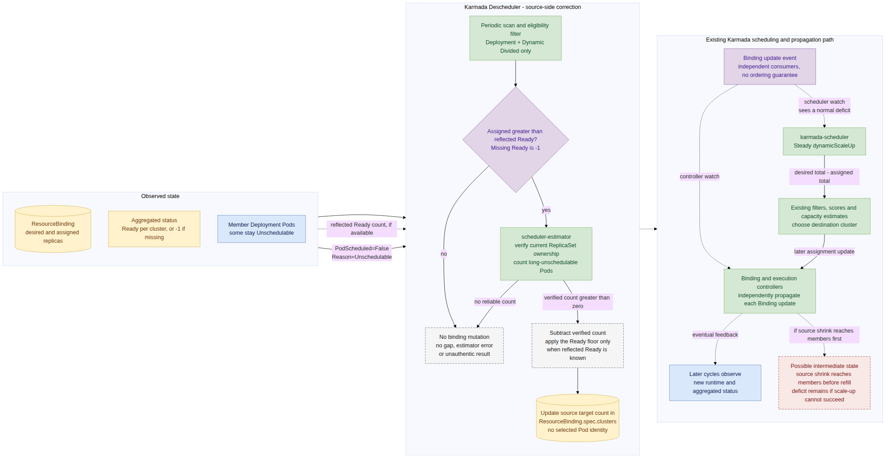
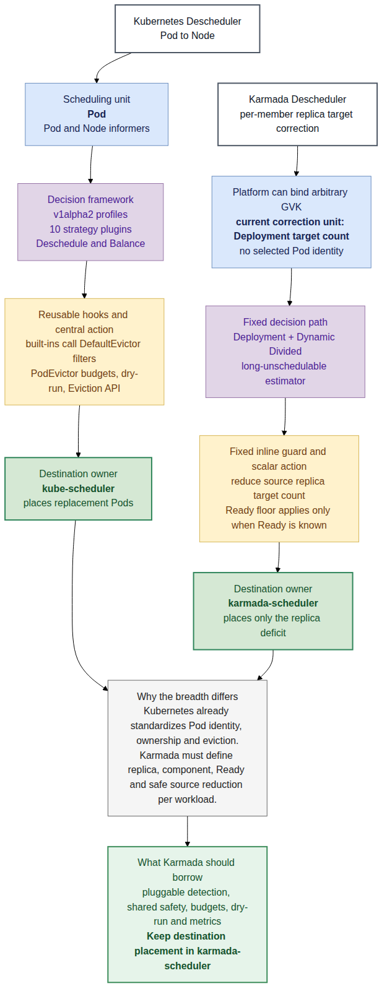

# Day 38：Karmada Descheduler 专项调研与 Kubernetes 对比

日期：2026-07-31

汇报稿：[离线 HTML 演示页](day38-karmada-descheduler-presentation.html)。本文保留完整证据、边界和追问材料；HTML 用于低文字密度现场汇报。

调研基线：

- Karmada：[`upstream/master@ce2a7b869477272202095282251afe490c38d525`](https://github.com/karmada-io/karmada/commit/ce2a7b869477272202095282251afe490c38d525)，2026-07-27。
- Kubernetes SIGs Descheduler：[`master@7d2b28bf2b6a12810317936d909af0270ff38fa3`](https://github.com/kubernetes-sigs/descheduler/commit/7d2b28bf2b6a12810317936d909af0270ff38fa3)，2026-06-30；当前稳定版为 [`v0.36.0`](https://github.com/kubernetes-sigs/descheduler/releases/tag/v0.36.0)，2026-05-20 发布。
- Qwen 场景：本文沿用团队内部称呼“千问场景”。公开 issue/PR 和官方书面纪要没有确认 Qwen 或 GPU 归属；[6 月 30 日公开会议录像的本地 ASR 记录](day23-pr7662-meeting-2026-06-30-transcript-and-alignment.md)提到可中断任务和 Spot GPU，但没有官方 transcript 或说话人归因。公开材料支持的是 offline、资源不足和 long-running Pending user story，不能据此绑定到具体产品线；真实 Kind、可替换性和完成条件仍需内部确认。

## 先说人话

### 四个汇报问题的直接答案

1. **为什么当时只支持 Deployment？**

   不是社区完整评估了所有 workload 后决定只要 Deployment，而是首版从一开始就把问题收窄为：“Deployment 的部分 Pod 因 member cluster 资源不足而长期 `Unschedulable`，按这个数量降低该 member 的 Deployment 目标副本，再交给 scheduler 补足缺口。”原提案明确说其他策略需要更多讨论；首版代码也留下了 workload 抽象、GVK 配置和 custom status interpreter 三处 TODO。Deployment-only 是窄 MVP 的实现结果，不是“其他任务类型没有价值”的结论。

2. **为什么收窄后的千问场景更适合 Descheduler，而不是 WorkloadRebalancer？**

   前提是团队先确认真实场景确实离线、可中断、replica 可替换，并且目标是周期自愈。在这些前提下，本次调研建议把 long-running Unschedulable 检测放在 Descheduler 一侧：它已有周期扫描、member estimator 和 Steady deficit path；当前 WorkloadRebalancer 只给具名 Binding 写触发时间戳，不观察 member Pod。这个 owner 仍未形成社区共识；`Fresh` 也只在当前 affinity/candidate context 内重算 Dynamic Divided replica assignment，并不会无条件重置整个 placement。

3. **Descheduler 的原理、限制和“保持 scheduler 简单”的关键是什么？**

   Descheduler 不选择目标集群，也不直接调用 Pod Eviction API。estimator 只返回长期不可调度 Pod 的数量，Descheduler 据此降低 `ResourceBinding.spec.clusters` 中该 member 的 Deployment 目标副本数；请求不携带 Pod identity，具体缩掉哪些 Pod 由 member 侧 Deployment/ReplicaSet controller 决定。scheduler 只看见一个普通副本缺口，继续复用原有 `Steady dynamicScaleUp` 选择目标集群。这让“发现旧分配失效”和“决定新位置”分属两个组件，scheduler 不必理解 Pod condition、Deployment owner chain 或异常持续时间。

4. **为什么 Kubernetes Descheduler 明显更丰富？**

   Kubernetes 把问题统一为 `Pod -> Node`，所有上层 workload 最终都落成 Pod，并且已有标准 Eviction API、PDB 和 owner controller。它因此能围绕同一种调度单元建设插件平台。Karmada 的 Binding 可以引用任意 GVK，但当前 Descheduler 实际只修正“per-member Deployment replica target/count”；扩展前必须先回答 replica、Ready、Pod ownership、缩源语义和状态恢复。Kubernetes 的框架、安全控制和 10 个策略确实更成熟，但不能把 Pod 策略直接复制成跨集群 workload 迁移。

### 一个 10 副本例子

假设一个离线、可中断的 workload 期望 10 个副本：

| 集群 | Binding 已分配 | Ready | 长期 `Unschedulable` |
| --- | ---: | ---: | ---: |
| `member1` | 6 | 4 | 2 |
| `member2` | 4 | 4 | 0 |

当前 Karmada Descheduler 的思路是：

1. 发现 `member1` 的 `Ready 4 < Assigned 6`。
2. member 侧 scheduler-estimator 证明其中 2 个 Deployment Pod 持续超过阈值处于 `PodScheduled=False, Reason=Unschedulable`。
3. 在本例 `readyReplicas=4` 已成功反射和解析的前提下，把 `member1` 的分配从 6 降到 4，不低于这 4 个 Ready 副本。
4. 此时全局只分配了 8 个，而 workload 仍期望 10 个。
5. karmada-scheduler 将它看成普通扩容缺口，尝试把缺少的 2 个副本分配到有容量的候选集群。

这里的 2 是数量，不是 Pod 身份。Descheduler 不会指定删除图中的两个 `Unschedulable` Pod；member 侧 Deployment/ReplicaSet controller 决定实际 scale-down 对象。Descheduler 也没有说“必须迁到 `member2`”，目标选择仍只有 scheduler 一套实现。

> 边界：只有团队确认千问 workload 确实离线、可中断、replica 可替换，而且接受 assignment repair 作为成功标准时，本报告才建议优先评估 Descheduler。如果它实际是多组件 CRD，或带 shard 身份、checkpoint、warm-up、target-ready-before-source-delete 合同，当前 Descheduler 不能直接处理。

## 一、先把三个对象分开

| 对象 | 解决的问题 | 当前动作 |
| --- | --- | --- |
| karmada-scheduler | 新副本应该放到哪个 member cluster | 过滤、打分、估算容量并写入 Binding 调度结果 |
| Karmada Descheduler | 哪些旧的跨集群副本分配已经被运行态事实证明失效 | 周期观察，减少源集群的 Binding 副本数 |
| WorkloadRebalancer | 用户现在明确要求哪些 workload 重新计算一次 | 给目标 Binding 写 `rescheduleTriggeredAt`，记录请求提交结果 |

“reschedule”这个词容易掩盖三种不同职责：

- **检测**：什么时候旧分配已经不合适。
- **撤销**：从哪里释放多少旧分配。
- **重新放置**：释放后的缺口应该去哪。

Karmada 当前 Descheduler 负责前两项的一个很窄子集，scheduler 始终负责第三项。WorkloadRebalancer 当前主要是一个显式触发入口，并不是运行态检测器。

## 二、问题 1：为什么首版只支持 Deployment

### 2.1 历史上能够明确证明什么

#### 2021-09：最初需求比最终实现更宽

[Issue #697](https://github.com/karmada-io/karmada/issues/697) 最初提到两类需求：

- member cluster 节点删除、标签变化等导致资源不足；
- 新集群加入后，把一部分副本搬过去做利用率均衡。

维护者当时提出了两个现实顾虑：新增组件会增加用户维护负担；`PropagationPolicy` 中缺少成熟的重调度策略，`ResourceBinding` 也缺少足够清晰的调度状态。见 [#697 maintainer comment](https://github.com/karmada-io/karmada/issues/697#issuecomment-913930871)。

#### 2021-09 至 2021-11：KEP 主动只保留 Story 1

合入的 [KEP-697](https://github.com/karmada-io/karmada/blob/ce2a7b869477272202095282251afe490c38d525/docs/proposals/scheduling/697-descheduler/README.md#L16-L83) 明确写道：设计只关注 Story 1，也就是资源不足造成的 `Unschedulable` Pod；其他策略因为需要更多讨论而不进入本提案。

KEP 使用的完整示例就是 Deployment：10 个副本分布为 5/3/2，其中一个集群的节点故障后没有资源重新承载 Pending Pod。

在 [proposal PR #726](https://github.com/karmada-io/karmada/pull/726#issuecomment-979754398) 中，作者进一步解释了边界：Descheduler 只把源集群副本从 6 减到 4，scheduler 再对缺少的 2 个副本做 ScaleSchedule。维护者随后[确认了这个理解](https://github.com/karmada-io/karmada/pull/726#issuecomment-979775681)。

#### 2022-02 至 2022-04：MVP 按这个窄边界落地

[PR #1392](https://github.com/karmada-io/karmada/pull/1392) 于 2022-02-24 合入首版组件，[Issue #1262](https://github.com/karmada-io/karmada/issues/1262) 的 estimator、core、部署、文档和 Helm 清单在 2022-04 完成。

首版实现同时留下了三个没有完成的扩展点：

- `supportedGVKs` 只有 `apps/v1 Deployment`，TODO 是未来做成 option；
- estimator 的 switch 只有 Deployment，TODO 是增加 abstract workload；
- Ready 数量直接读取 `readyReplicas`，TODO 是与 custom resource interpreter 协作。

这些业务边界至今仍在当前源码中：[filter.go](https://github.com/karmada-io/karmada/blob/ce2a7b869477272202095282251afe490c38d525/pkg/descheduler/core/filter.go#L30-L62)、[replica.go](https://github.com/karmada-io/karmada/blob/ce2a7b869477272202095282251afe490c38d525/pkg/estimator/server/replica/replica.go#L42-L97)、[helper.go](https://github.com/karmada-io/karmada/blob/ce2a7b869477272202095282251afe490c38d525/pkg/descheduler/core/helper.go#L126-L147)。

### 2.2 为什么 Deployment 最容易先闭环

以下是基于源码依赖的工程推断，不是维护者留下的原话：

- Deployment 有单一的 `.spec.replicas`，一个副本通常可以被同类副本替代。
- `.status.readyReplicas` 能给出当前服务副本下界。
- estimator 可以沿 `Deployment -> current ReplicaSet -> owner UID matching Pods` 找到本轮 rollout 的 Pod，避免只按 label selector 误计数。
- 把某集群 Deployment 副本从 6 改成 4，Binding 和成员 Deployment controller 都知道如何落实。

其他任务调度类型不是多加一个 GVK 就能安全支持：

| workload | “一个副本”的特殊语义 | 直接减计数的风险 |
| --- | --- | --- |
| StatefulSet | ordinal、稳定网络身份、PVC、有序更新 | 新集群重建不等于原身份和数据迁移 |
| Job / Indexed Job | parallelism、completion、index、重试和幂等 | 可能重复执行或丢失已完成进度 |
| DaemonSet | 每个符合条件 Node 一个 Pod | 不存在普通的跨集群副本总数分割 |
| FlinkDeployment | JobManager、TaskManager、checkpoint、应用状态 | 一个 Binding 标量无法说明减少哪个组件 |
| AI 多组件任务 | worker/leader、gang、shard、数据和拓扑关系 | 不能把任意 Pending Pod 当作独立可替换副本 |

Karmada 的 `GetComponents` 多组件解释能力直到 2025 年才进入主线，而当前 scheduler 仍明确排除多组件 workload 的 replica division，因为 Binding 尚不能表达和落实 per-component replica assignment。见 [common.go](https://github.com/karmada-io/karmada/blob/ce2a7b869477272202095282251afe490c38d525/pkg/scheduler/core/common.go#L50-L77)。这进一步说明，2021 至 2022 年的 Descheduler 没有现成的通用多组件抽象可复用。

### 2.3 汇报时最准确的表述

> Karmada 当时没有形成“只应该支持 Deployment”的通用结论。KEP 明确选择了一个 Deployment 长期 Unschedulable 的窄 MVP；代码中的 GVK、owner traversal、Ready 字段和副本修改都围绕这个例子完成，通用 workload 抽象则留在 TODO。Deployment-only 是范围和当时抽象能力共同形成的结果。

不建议说：“社区认为 Job、StatefulSet 或 CRD 不重要，所以拒绝支持。”现有历史证据不支持这句话。

## 三、问题 2：为什么千问子场景更适合 Descheduler

### 3.1 先区分原始大需求与当前收窄需求

[Issue #7621](https://github.com/karmada-io/karmada/issues/7621) 的原始复杂 workload 需求很宽，涉及 shard、warm-up、业务 readiness、目标就绪后再删除源、资源水位和服务连续性。这更接近 workload-aware migration，不能由当前 Descheduler 单独解决。

后续公开讨论把其中一个用户故事收窄到 offline workload 的 long-running Pending。不同来源的证据强度并不相同：PR review 提到 member 资源不足和长期 Pending；公开会议录像的本地 ASR 提到可中断任务和 Spot GPU，但没有官方 transcript 或说话人归因；Qwen 映射、实际 Kind、replica 可替换性和成功条件都没有公开证据。

> 分析：如果把这些来源合并成一个待验证的候选场景，可以描述为“某些 member 资源不足，离线 workload 的部分 Pod 长期 Pending，而其他集群可能有可用资源，希望按异常数量修正分配”。其中可中断、GPU 和具体产品归属不能写成已经确认的公开合同。

[PR #7662 的 maintainer review](https://github.com/karmada-io/karmada/pull/7662#pullrequestreview-4742653446) 建议把当前 proposal 收敛到这个范围并移出 SafeMigration；作者随后同意移除 migration，但 API 语义仍在讨论。2026-07-30 的 [maintainer proposal comment](https://github.com/karmada-io/karmada/pull/7662#issuecomment-5126046690) 进一步提出 `GetComponents.selector -> estimator Unschedulable -> dynamicScaleUp`，目前还没有回复、commit 或批准，不能写成最终社区共识。

### 3.2 两种组件的当前合同不同

| 维度 | Descheduler | WorkloadRebalancer |
| --- | --- | --- |
| 触发 | 默认每 2 分钟周期扫描 | 用户或上层自动化创建一个显式对象 |
| 当前状态来源 | Binding assigned/Ready，加 member estimator 的 Pod condition | 当前不读取 member Pod，只更新 Binding trigger |
| 处理粒度 | 按 estimator 返回的 Unschedulable 数量降低该 member 的目标副本；不选择具体 Pod | 时间戳触发一次 scheduler 调度；Dynamic Divided replica assignment 分支使用 `Fresh` |
| 对原分布 | reflected Ready 成功解析时，目标计数不低于该下界；缺失时没有这个保护 | 在当前 affinity/candidate context 内不保留原 replica distribution；不会自动重置顶层 `clusterAffinities` cursor |
| 目标集群 | 交给 scheduler 的 Steady scale-up | 交给 scheduler 的 Fresh reschedule |
| 完成语义 | Binding update 加 Event，没有 target-ready task 回执 | 当前 `Successful` 只证明 trigger 写入成功，不证明 scheduler 或新副本已完成 |
| 最匹配用户意图 | 本次调研建议：若目标是周期自愈，复用现有观察路径 | 当前合同：现在对这批具名对象显式触发一次调度 |

当前 WorkloadRebalancer controller 只 watch 自身 spec 变化，并在成功更新 `rescheduleTriggeredAt` 后把目标标为 `Successful`，见 [controller source](https://github.com/karmada-io/karmada/blob/ce2a7b869477272202095282251afe490c38d525/pkg/controllers/workloadrebalancer/workloadrebalancer_controller.go#L55-L72) 和 [trigger path](https://github.com/karmada-io/karmada/blob/ce2a7b869477272202095282251afe490c38d525/pkg/controllers/workloadrebalancer/workloadrebalancer_controller.go#L189-L252)。当前 API 只有 workload 列表和 TTL，没有 strategy/mode 字段。scheduler 看到显式 trigger 后，在 Dynamic Divided replica assignment 分支使用 `Fresh`，见 [assignment.go](https://github.com/karmada-io/karmada/blob/ce2a7b869477272202095282251afe490c38d525/pkg/scheduler/core/assignment.go#L52-L122)；但它不会自动重置顶层 multiple `clusterAffinities` cursor，见 [Day 29 复现实验](day29-issue5070-pr7662-fresh-rescheduling-research.md)。

### 3.3 为什么本次调研倾向让 Descheduler 做周期检测

以下是本次调研的组件归属建议，不是当前社区已批准设计。2026-07-30 maintainer comment 仍提出了“用户创建 WorkloadRebalancer -> scheduler 调 estimator -> dynamicScaleUp”的另一条路径。

1. **触发来源匹配。** 如果产品目标是周期自愈，长期 `Unschedulable` 是持续运行态事实，不是一次用户命令。
2. **已经有正确的数据路径。** Descheduler 与每个 member 的 estimator 建立连接，现有 Deployment 路径已经能验证 owner chain 并统计 Pod condition。
3. **按异常数量做局部修正。** 它把长期不可调度 Pod 的数量转成 per-member target decrease；这不是精确选择某几个 Pod。
4. **在状态可信时保护正常副本。** `readyReplicas` 成功反射和解析时，代码会把缩减后的目标限制在该 Ready 下界之上；字段缺失或无法解析时会记为 `-1`，不会自动阻止缩减。
5. **避免重复框架。** 如果选择让 WorkloadRebalancer controller 自己新增周期扫描、Pod resolver、异常阈值、estimator RPC、源缩减、安全下界和重试，实际会在另一个 controller 中重写现有观察路径；这不排除 WR 仅表达用户 intent、由其他 owner 执行策略的设计。
6. **scheduler 仍只做放置。** member failure 信号不必进入 scheduler 核心循环。

### 3.4 WorkloadRebalancer 仍然适合什么

- 管理员希望对一批具名 workload 显式触发一次 scheduler recalculation。
- 上层系统已经决定“何时、处理谁”，只需要提交一次重调度意图。
- 用户需要一个 task object、TTL 和逐对象请求结果，而不是常驻自动修复策略。
- 未来如果需要 on-demand 调用同一套 Descheduler strategy，可以让 WorkloadRebalancer 表达用户意图，但 detector、Binding writer 和 completion contract 必须先明确，不能让两个组件独立修改同一 Binding。

### 3.5 当前不能越过的边界

- 当前 Descheduler 只支持 namespaced Deployment 和 Dynamic Divided；如果 Qwen 实际是多组件 CRD，它今天会被过滤。
- `ImagePullBackOff`、容器启动失败、readiness probe 失败和应用 heartbeat 失败都不满足当前 `Unschedulable` 条件。
- 所有 Pod 都能运行、只是 GPU 水位不均时，当前 Descheduler 不会动作。
- 它没有 source exclusion、target reservation、target-ready acknowledgment 或 warm-up 后切流。
- 若任务具有 shard、checkpoint、gang 或不可重复执行语义，需要 workload operator 或新的显式迁移合同参与。

因此结论不是“千问一律用 Descheduler”，而是：

> 如果内部确认 workload 满足离线、可中断、replica 可替换，并且目标是周期修复 long-running Pending，本次调研建议优先评估 Descheduler 观察路径；最终 owner/API 尚未形成社区共识。对在线安全迁移、状态保留和业务切流，当前两者都不够，不能把问题伪装成普通 reschedule。

## 四、问题 3：工作原理、限制与 scheduler 简化

### 4.1 当前控制闭环



- canonical source：[Mermaid](day38-karmada-descheduler-control-loop.mmd)
- renderer：repo-local `project-mermaid` wrapper 通过 `npx` 调用固定版本 official Mermaid CLI `11.16.0`；PNG 为生成物。
- 实线表示直接处理或写入，虚线表示 informer/状态的异步反馈。

运行过程如下：

1. Leader 启动后发现并连接各 member cluster 的 scheduler-estimator。
2. 默认每 2 分钟列出全部 `ResourceBinding`。
3. 只保留 `apps/v1 Deployment + Dynamic Divided`。
4. 从 `Binding.status.aggregatedStatus` 中直接读取每个集群的 `readyReplicas`；字段缺失或无法解析时记为 `-1`。
5. 对 `Ready < Assigned` 的集群请求 estimator，因此 `Ready=-1` 仍会继续估算，而不是 fail-closed。
6. estimator 找到 member 中的 Deployment、current ReplicaSet 和 owned Pods。
7. 只统计持续超过默认 5 分钟的 `PodScheduled=False/Unschedulable` Pod，返回数量而不是 Pod identity。
8. Descheduler 计算 `target = Assigned - Unschedulable`；只有 reflected Ready 成功取得时，才用 `target >= Ready` 限制缩减下界。
9. 更新 `ResourceBinding.spec.clusters[].replicas`。这不是 Pod eviction，而是修改跨集群期望副本；具体缩掉哪些 Pod 由 member 侧 Deployment/ReplicaSet controller 决定。
10. scheduler 与 Binding controller 都独立 watch 这次 Binding 更新，没有“先调度、后传播”的顺序保证。Binding controller 可能先把源缩减、总 assigned 暂时少于 desired 的中间状态传播到 member。
11. scheduler 将这个差值看成普通 `ScaleSchedule`，`Steady dynamicScaleUp` 只计算 `desired - assigned` 的缺口，复用既有过滤、容量估算和目标选择；若本轮没有可行目标，缺口会继续存在。
12. scheduler 成功写回新 assignment 后，Binding/Execution controller 再传播新结果；member 运行态和 aggregated status 继续异步反馈。

主要源码是 [main loop](https://github.com/karmada-io/karmada/blob/ce2a7b869477272202095282251afe490c38d525/pkg/descheduler/descheduler.go#L141-L249)、[helper](https://github.com/karmada-io/karmada/blob/ce2a7b869477272202095282251afe490c38d525/pkg/descheduler/core/helper.go#L40-L147)、[member estimator](https://github.com/karmada-io/karmada/blob/ce2a7b869477272202095282251afe490c38d525/pkg/estimator/server/replica/replica.go#L42-L97)、[scheduler Binding update handler](https://github.com/karmada-io/karmada/blob/ce2a7b869477272202095282251afe490c38d525/pkg/scheduler/event_handler.go#L183-L219)、[Binding controller watch](https://github.com/karmada-io/karmada/blob/ce2a7b869477272202095282251afe490c38d525/pkg/controllers/binding/binding_controller.go#L109-L195)、[scheduler trigger](https://github.com/karmada-io/karmada/blob/ce2a7b869477272202095282251afe490c38d525/pkg/scheduler/scheduler.go#L395-L468) 和 [`dynamicScaleUp`](https://github.com/karmada-io/karmada/blob/ce2a7b869477272202095282251afe490c38d525/pkg/scheduler/core/division_algorithm.go#L121-L136)。

### 4.2 为什么 scheduler 因此保持简单

最关键的接口不是某个 Go interface，而是一个数据不变量：

```text
replica deficit = workload desired replicas - sum(binding assigned replicas)
```

Descheduler 把“member 内部有 2 个长期无法调度的 Pod”转换成“Binding 当前少分配 2 个副本”。完成转换后，scheduler 不需要知道：

- 哪个 Pod condition 触发了动作；
- 这个 condition 持续了多久；
- Deployment 当前 ReplicaSet 是谁；
- estimator 如何连接 member cluster；
- 为什么旧分配应该释放。

scheduler 仍只回答一个稳定问题：“现在缺 2 个副本，按当前 placement 和容量应该放到哪里？”

这带来四个好处：

- 目标选择只有一套过滤、打分和容量逻辑。
- member 运行态观察不会塞进 scheduler hot path。
- Descheduler 失败时可以保守不动作，不破坏正常 scheduling。
- 后续异常策略只要能安全地产生“释放多少源副本”，理论上仍可复用相同 scheduler path。

代价是复杂度没有消失，而是分散到独立 Descheduler、member estimator、aggregated status 和 Binding 的多 writer 边界。因此“scheduler 简单”不等于“整个系统简单”。

### 4.3 当前硬限制和工程挑战

| 类别 | 当前限制 | 实际影响 |
| --- | --- | --- |
| workload | GVK 硬编码 Deployment | StatefulSet、Job、Flink 和 AI CRD 直接不进入流程 |
| scope | 只 list namespaced `ResourceBinding` | `ClusterResourceBinding` 不受支持 |
| placement | 只允许 Dynamic Divided | Duplicated、静态权重和多组件不能使用 |
| status | 硬编码解析 `readyReplicas`，缺失或失败时记为 `-1` | custom workload 即使有 interpreter 也无法直接提供安全下界；Ready 不可信时也不会自动停止缩减 |
| Pod ownership/action | Deployment current ReplicaSet 专用 traversal 只用于计数，Binding mutation 不携带 Pod identity | selector alone 无法证明 rollout、owner UID 和 component lifecycle；member controller 决定实际 scale-down 对象 |
| failure signal | 只识别长期 `PodScheduled=False/Unschedulable` | 不能覆盖 image、startup、readiness、heartbeat 或纯利用率问题 |
| policy | 没有 profile、strategy plugin 或 per-workload opt-in | 组件启用后会周期处理所有满足固定过滤条件的 Binding |
| safety | 没有迁移预算、优先级、PDB 类似合同、dry-run | 难以灰度新策略，也难限制一次释放的全局规模 |
| member dependency | 每个 member 需要 estimator、Service discovery 和 TLS | 一个待查询集群 RPC 报错会使该 Binding 本轮丢弃整批 estimator 结果，其他已成功集群也按 0 no-op，等待下轮扫描 |
| time | 默认 threshold 5 分钟、scan 2 分钟、RPC timeout 3 秒 | 首次识别通常至少 5 至 7 分钟，再加缓存、队列和传播延迟；不是 SLA |
| consistency | status、Deployment、ReplicaSet、Pod 来自异步缓存；scheduler 与 Binding controller 独立 watch | 判断与写入之间可能变化；源缩减可能先传播，总 assigned 暂时小于 desired，且补位失败时缺口持续存在 |
| throughput | 单 leader、一个 Descheduler worker、周期全量 list | 大规模 Binding 与多 member RPC 的上限需要 benchmark |
| target assurance | Descheduler 不预留目标容量，也不排除原 source | scheduler 可能暂时仍找不到可放位置，不能承诺一次成功 |
| completion | 只有 Binding update 和 Event | 没有“新副本在目标 Ready”级别的任务完成回执 |
| validation | 有 unit tests，但当前 e2e 未找到长期 Unschedulable Replica 专项路径 | 跨组件真实闭环缺少直接回归证据 |

### 4.4 现有保守保护

限制之外，当前实现有几个值得保留的 fail-safe：

- 只在 `Ready < Assigned` 时继续查询；但缺失 Ready 会记为 `-1`，仍满足这个条件。
- 只有 successfully reflected Ready 存在时，缩减目标才不低于该值；缺失 Ready 不是 fail-closed。
- estimator error、未知结果或 unauthentic result 最终按 0 处理，本轮不移动；其中一个待查询集群 RPC 报错会让该 Binding 的整批 estimator 结果一起丢弃。
- estimator 返回值大于原 assigned 时不做减法。
- scheduler 而不是 Descheduler 决定目标集群。

这些保护对 estimator 结果倾向于“宁可慢一轮，也不要因为缺证据而释放副本”，但 Ready 状态缺失并没有同样的 fail-closed 性质。它们适合自动控制循环，却还不能代替状态 freshness、预算和 workload-specific safety contract。

## 五、问题 4：Karmada 与 Kubernetes Descheduler 对比

### 5.1 两者其实工作在不同层



- canonical source：[Mermaid](day38-karmada-vs-kubernetes-descheduler.mmd)
- renderer：repo-local `project-mermaid` wrapper 通过 `npx` 调用固定版本 official Mermaid CLI `11.16.0`；PNG 为生成物。

Kubernetes Descheduler 的当前调度单位是 Pod，目标是 Node；Karmada 的 Binding 平台能引用任意 GVK，但当前 Descheduler 修正的是 per-member Deployment replica target/count，目标层级是 member cluster。它不携带被缩减 Pod 的 identity。平台抽象更宽、当前实现更窄，这个层级差异决定了扩展难度。

| 维度 | Kubernetes SIGs Descheduler | Karmada Descheduler |
| --- | --- | --- |
| 决策层级 | Pod -> Node | 当前是 per-member Deployment replica target/count -> member cluster |
| 统一调度单元 | Pod | Binding 可引用任意 GVK，但当前 Descheduler 只接受 Deployment 并按标量计数修正 |
| 输入 | Pod、Node、利用率、affinity、taint、topology 等 | Binding assigned/Ready，加 member estimator 的长期 Unschedulable 数 |
| 动作 | 调用 Kubernetes Eviction API | 减少 `ResourceBinding.spec.clusters` 中源集群副本 |
| 谁放新位置 | kube-scheduler | karmada-scheduler |
| 策略 | 10 个 strategy plugins | 1 条固定 unschedulable-replica path |
| 框架 | profiles、registry、plugin config、4 个实际 extension points | 无用户策略 API 和 plugin framework |
| 安全 | 内置策略复用 DefaultEvictor hooks；PodEvictor 限额与 Eviction/PDB 路径；priority、owner、nodeFit 等保护 | threshold、已知 Ready 下界、未知估算不动作；缺失 Ready 不会 fail-closed |
| 预算 | total、per-node、per-namespace eviction limits | 无全局、集群或 workload release budget |
| 试运行 | `--dry-run` | 无 dry-run |
| 观测 | Event、metrics、plugin/cycle duration、OTel tracing | Event 和基础组件/estimator metrics，策略维度较弱 |
| 运行方式 | Job、CronJob 或 Deployment | 长驻 Deployment |
| 成熟时间 | 2017 年开始演进 | 2022 年组件落地 |

### 5.2 Kubernetes 当前 10 个策略

Balance plugins 会先看一组 Pod 的整体分布，再挑选 eviction candidate：

- `RemoveDuplicates`
- `LowNodeUtilization`
- `HighNodeUtilization`
- `RemovePodsViolatingTopologySpreadConstraint`

Deschedule plugins 可以按 Pod 顺序处理：

- `RemovePodsViolatingInterPodAntiAffinity`
- `RemovePodsViolatingNodeAffinity`
- `RemovePodsViolatingNodeTaints`
- `RemovePodsHavingTooManyRestarts`
- `PodLifeTime`
- `RemoveFailedPods`

此外还有 `DefaultEvictor`。它不负责发现某种失衡，也不直接作为策略驱逐 Pod，而是提供 `Filter` 和 `PreEvictionFilter` hooks，供当前内置策略复用；`Evictor.Evict` 本身不会替插件自动执行这些 pre-check，自定义插件可以绕过。当前实际运行时 extension points 是 `Deschedule`、`Balance`、`Filter` 和 `PreEvictionFilter`，见 [framework types](https://github.com/kubernetes-sigs/descheduler/blob/7d2b28bf2b6a12810317936d909af0270ff38fa3/pkg/framework/types/types.go#L33-L99)、[default plugin registry](https://github.com/kubernetes-sigs/descheduler/blob/7d2b28bf2b6a12810317936d909af0270ff38fa3/pkg/descheduler/setupplugins.go#L33-L50) 和 [Evict implementation](https://github.com/kubernetes-sigs/descheduler/blob/7d2b28bf2b6a12810317936d909af0270ff38fa3/pkg/descheduler/evictions/evictions.go#L507-L678)。

### 5.3 Kubernetes 为什么能做得更丰富

1. **Pod 是统一事实对象。** Deployment、Job、StatefulSet 最终都产生 Pod，策略无需先解释任意 GVK。
2. **有标准撤销动作。** Eviction API、PDB、owner controller 和 kube-scheduler 已经形成通用闭环。
3. **策略、过滤 hooks 和动作分层。** 内置 strategy 负责“为什么选它”，并复用 DefaultEvictor 的过滤 hooks；PodEvictor 集中做限额和 Eviction API 调用，PDB 由 API 路径落实。自定义插件仍必须正确调用 hooks，框架不是不可绕过的安全沙箱。
4. **配置是框架能力。** `v1alpha2` policy 支持 profiles、启停、顺序、参数默认化和校验。
5. **试错成本更低。** dry-run、全局预算、Events、metrics 和 tracing 让策略可以先观察再放量。
6. **演进时间更长。** Kubernetes Descheduler 自 2017 年持续建设；Karmada 2021 年提案、2022 年实现，且首版主动只做一个 story。

### 5.4 不能把 Kubernetes 讲成完美答案

- `DeschedulerPolicy` 仍是 `v1alpha2`，framework KEP 仍标记 `provisional/alpha`。
- 外部插件不是运行时热插拔，仍需注册并构建自己的 Descheduler。
- 它同样不负责新 Pod 的最终放置，也不预留目标 Node 容量。
- `nodeFit` 是当前快照下的 best-effort 检查，不是 scheduler reservation。
- `HighNodeUtilization` 等策略需要与 kube-scheduler scoring 配合，否则两边目标可能相互抵消。
- 10 个插件中有失败 Pod 清理和生命周期淘汰，并非全部对应“更优重调度”。
- 单集群 Pod eviction 无法直接解决跨集群 CRD 的 source shrink、checkpoint、shard 或 per-component assignment。

因此建议使用这句总结：

> Kubernetes Descheduler 是成熟得多的单集群 Pod 驱逐平台；Karmada Descheduler 是刻意收窄的跨集群 Unschedulable Replica 修复器。前者的框架和安全机制值得借鉴，Pod 策略本身不能直接照搬。

### 5.5 Karmada 最值得借鉴什么

| 借鉴项 | Karmada 对应做法 | 不应照搬的部分 |
| --- | --- | --- |
| strategy plugin | 先抽象 `LongUnschedulableReplicas` 检测策略 | 不直接复制 Node taint/affinity 插件 |
| shared safety layer | opt-in、Ready/Available 下界、freshness、release budget | 不把 PDB 当作跨集群 workload 安全的完整证明 |
| profile/policy | 显式选择 workload、策略和阈值 | 不默认扫描所有新增 GVK |
| dry-run | 输出候选 Binding、源集群、数量和原因，不写 API | 不用日志模拟代替结构化结果 |
| observability | strategy/result/reason、estimator latency、released replicas | 不只记录最终成功 Event |
| nodeFit 思路 | 修改前验证至少存在可能承载缺口的 candidate cluster | 不宣称容量估算等于 reservation |
| single eviction path | 所有策略通过一个 Binding mutation/safety executor | 不允许 Descheduler 与 WorkloadRebalancer 成为两个独立 writer |

## 六、建议的演进路线

### 阶段 0：先把范围写清楚

首版扩展建议只承诺：

```text
LongUnschedulableReplicas
+ explicit workload opt-in
+ single-component, replica-dividable workload
+ replaceable replica semantics
+ Ready/Available lower bound
+ scheduler remains the only destination owner
```

明确 non-goals：online safe migration、checkpoint/warm-up、gang、shard identity、Job completion transfer 和 target-ready cutover。

### 阶段 1：先抽安全骨架，不急着增加 Kind

- 将固定 detection 与 mutation 分开，保留现有 Deployment strategy 作为第一个实现。
- 增加 per-workload opt-in、dry-run、每轮/每集群/每 workload release budget。
- 把 estimator error、no target capacity、stale status 和 ownership mismatch 变成结构化 reason/metrics。
- 增加真实跨组件 e2e：长期 Unschedulable、已知与缺失 Ready 两条路径、estimator outage、scheduler 找不到目标和 eventual recovery。

### 阶段 2：定义 workload resolver 合同

不能只增加一个 selector。至少需要解释：

- 哪些 Pod 属于当前 workload revision/component；
- 一个 component 的 replica 如何映射到 Binding assignment；
- Ready/Available 从哪里读取，何时算新鲜；
- 从源集群减少 1 是否可以由目标集群安全重建；
- rollout、删除和 controller ownership 变化时如何避免误计数。

现有 Deployment 的 `Deployment -> current ReplicaSet -> owner UID Pod` 可以作为第一份 reference implementation。`GetComponents.selector` 可以缩小查询范围，但 selector 本身不是 ownership 证明。

### 阶段 3：按 support matrix 扩展，不宣称 any workload

建议顺序是：

1. Deployment 保持完整闭环。
2. 只接入有明确 single-component、replica、Ready 和 revise contract 的 CRD。
3. StatefulSet、Job 和多组件 AI/Flink workload 分别设计迁移单位和状态合同。
4. 只有 Binding 能表达 per-component placement 后，才讨论多组件 partial rescheduling。

### 阶段 4：确定 Descheduler 与 WorkloadRebalancer 的唯一 owner

推荐职责是：

- Descheduler：运行态检测、候选分类、安全源缩减。
- scheduler：唯一目标集群决策者。
- WorkloadRebalancer：显式用户 intent/task API；若调用同一 strategy，不自己再实现一套 Pod 扫描和 Binding mutation。

这是本次调研建议，不是当前社区已批准设计。#7662 在 API、selector ownership、多组件、single writer 和 completion contract 上仍未收敛。

## 七、周一汇报建议

### 13 页 HTML 结构

1. **标题**：四个汇报问题和 Observe -> Release -> Place 主线。
2. **一句话结论**：Karmada Descheduler 把失效旧分配转成普通 replica deficit，不是第二个 scheduler。
3. **职责拆分**：Descheduler 检测/撤销，scheduler 放置，WorkloadRebalancer 显式触发。
4. **历史答案**：KEP 只做 Story 1，Deployment-only 是窄 MVP，其他抽象留在 TODO。
5. **workload 语义**：Deployment 能闭环；StatefulSet、Job、多组件 CRD 不能只增加 GVK。
6. **10 副本例子**：6 assigned / 4 ready / 2 unschedulable，source target 减 2，scheduler 补 2；不点名删除 Pod。
7. **控制闭环**：scheduler 和 Binding controller 独立 watch，补位与传播没有顺序保证。
8. **组件对比**：本次调研建议周期检测复用 Descheduler；WorkloadRebalancer 当前只显式触发一次调度。
9. **千问边界**：offline / interruptible / replaceable / assignment-only completion 都是待内部确认的适用前提。
10. **当前限制**：workload、signal、safety、single writer 四类问题。
11. **层级图**：Karmada 当前修正 per-member Deployment target/count，Kubernetes 直接选择 Pod -> Node eviction candidate。
12. **Kubernetes 对比**：10 plugins、DefaultEvictor、预算、dry-run；成熟但不是跨集群答案。
13. **建议路线**：先窄场景和安全骨架，再扩 workload；scheduler 保持唯一目标放置者。

### 90 秒结论稿

> Karmada Descheduler 当时只支持 Deployment，最准确的解释不是“社区不想支持其他 workload”，而是 KEP 主动只做了一个窄 MVP：member cluster 资源不足导致 Deployment Pod 长期 Unschedulable。estimator 返回异常数量，Descheduler 只降低源集群 replica target，不点名删除 Pod；scheduler 再把缺口补到其他集群。这个边界让 scheduler 不必理解 Pod failure 和 workload ownership，继续只负责目标选择。
>
> 如果团队确认千问 workload 离线、可中断、replica 可替换，并且目标是周期修复 long-running Pending，本次调研倾向复用 Descheduler 的观察和 Steady deficit path。当前 WorkloadRebalancer 只写一次 trigger，不观察 member Pod；其 `Fresh` 作用于当前 affinity/candidate context 内的 Dynamic Divided replica assignment，不是无条件重置整个 placement。最终 owner/API 仍未形成社区共识。
>
> Kubernetes Descheduler 更成熟，核心原因是它统一处理 Pod 到 Node，已有 Eviction API、PDB 和 controller 重建闭环，因此可以发展出 10 个策略、DefaultEvictor、预算和 dry-run。Karmada 应借鉴框架和安全层，但不能直接复制 Pod 策略。下一步应先定义 workload resolver、opt-in、release budget 和 single writer，并保持 scheduler 是唯一目标放置者。

### 可能被追问的问题

**问：为什么不直接让 scheduler 每次都重新看 member Pod？**

答：这会把运行态监控、异常持续时间、owner traversal 和 member RPC 放进核心调度路径，同时让 scheduler 既判断旧结果是否失效，又选择新位置。现有 deficit contract 能复用成熟 scheduling path，边界更清楚。

**问：Descheduler 能保证这 2 个副本一定去别的集群吗？**

答：不能保证。它只降低源集群 target count，既不指定 member controller 删除哪个 Pod，也不指定新目标。scheduler 根据当时的 candidate、filter 和 estimator 再尝试放置；没有目标 reservation，也没有 source exclusion。

**问：加 `GetComponents.selector` 后是不是所有 CRD 都能支持？**

答：不是。selector 只能找候选 Pod，不能证明 owner UID、当前 revision、component identity、Ready freshness，也不能让 Binding 自动拥有 per-component replica assignment。

**问：为什么 Kubernetes 不需要逐个支持 Deployment、Job？**

答：因为它的输入就是 Pod，eviction 后由原 controller 决定如何重建。Karmada 修改的是上层 workload 在不同集群的副本数，必须理解上层语义。

**问：WorkloadRebalancer 还有什么价值？**

答：当前价值是对具名 workload 显式触发一次调度，并承载 task/TTL/status。它没有 strategy/mode 字段；是否让它未来表达周期策略 intent、由哪个组件检测和写 Binding，仍需 proposal 收敛。

## 八、技术证据索引

### Karmada 历史与社区讨论

- [Issue #697：最初提出 Karmada Descheduler](https://github.com/karmada-io/karmada/issues/697)
- [KEP-697：只实现 Story 1](https://github.com/karmada-io/karmada/blob/ce2a7b869477272202095282251afe490c38d525/docs/proposals/scheduling/697-descheduler/README.md#L16-L83)
- [PR #726：作者解释 source decrease + scheduler scale](https://github.com/karmada-io/karmada/pull/726#issuecomment-979754398)
- [PR #726：维护者确认组件边界](https://github.com/karmada-io/karmada/pull/726#issuecomment-979775681)
- [PR #1392：首版实现](https://github.com/karmada-io/karmada/pull/1392)
- [Issue #1262：首版 TODO list 完成](https://github.com/karmada-io/karmada/issues/1262)
- [Issue #3092：custom CRD support，关闭但没有实现证据](https://github.com/karmada-io/karmada/issues/3092)
- [Issue #5987：FlinkDeployment support 仍在讨论](https://github.com/karmada-io/karmada/issues/5987)
- [Issue #7621：复杂 workload safe rescheduling 原始问题](https://github.com/karmada-io/karmada/issues/7621)
- [PR #7662：WorkloadRebalancer proposal](https://github.com/karmada-io/karmada/pull/7662)
- [Karmada Descheduler 官方文档](https://karmada.io/docs/userguide/scheduling/descheduler/)

### Karmada 当前源码

- [Deployment + Dynamic Divided filter](https://github.com/karmada-io/karmada/blob/ce2a7b869477272202095282251afe490c38d525/pkg/descheduler/core/filter.go#L30-L62)
- [Ready gap 与 estimator aggregation](https://github.com/karmada-io/karmada/blob/ce2a7b869477272202095282251afe490c38d525/pkg/descheduler/core/helper.go#L40-L147)
- [periodic loop 与 source replica reduction](https://github.com/karmada-io/karmada/blob/ce2a7b869477272202095282251afe490c38d525/pkg/descheduler/descheduler.go#L141-L249)
- [Deployment current ReplicaSet Pod traversal](https://github.com/karmada-io/karmada/blob/ce2a7b869477272202095282251afe490c38d525/pkg/estimator/server/replica/replica.go#L42-L97)
- [ScaleSchedule trigger](https://github.com/karmada-io/karmada/blob/ce2a7b869477272202095282251afe490c38d525/pkg/scheduler/scheduler.go#L395-L468)
- [Steady 与 Fresh](https://github.com/karmada-io/karmada/blob/ce2a7b869477272202095282251afe490c38d525/pkg/scheduler/core/assignment.go#L52-L122)
- [dynamicScaleUp deficit](https://github.com/karmada-io/karmada/blob/ce2a7b869477272202095282251afe490c38d525/pkg/scheduler/core/division_algorithm.go#L121-L136)
- [multi-component workload 不支持 replica division](https://github.com/karmada-io/karmada/blob/ce2a7b869477272202095282251afe490c38d525/pkg/scheduler/core/common.go#L50-L77)
- [WorkloadRebalancer trigger-only path](https://github.com/karmada-io/karmada/blob/ce2a7b869477272202095282251afe490c38d525/pkg/controllers/workloadrebalancer/workloadrebalancer_controller.go#L189-L252)

### Kubernetes SIGs Descheduler

- [项目定位：evict Pods，replacement 仍由 kube-scheduler 放置](https://github.com/kubernetes-sigs/descheduler/blob/7d2b28bf2b6a12810317936d909af0270ff38fa3/README.md#L14-L83)
- [策略分类与 10 个插件](https://github.com/kubernetes-sigs/descheduler/blob/7d2b28bf2b6a12810317936d909af0270ff38fa3/README.md#L285-L302)
- [framework interfaces](https://github.com/kubernetes-sigs/descheduler/blob/7d2b28bf2b6a12810317936d909af0270ff38fa3/pkg/framework/types/types.go#L33-L99)
- [default plugin registration](https://github.com/kubernetes-sigs/descheduler/blob/7d2b28bf2b6a12810317936d909af0270ff38fa3/pkg/descheduler/setupplugins.go#L33-L50)
- [Deschedule then Balance cycle](https://github.com/kubernetes-sigs/descheduler/blob/7d2b28bf2b6a12810317936d909af0270ff38fa3/pkg/descheduler/descheduler.go#L226-L304)
- [Eviction limits and API call](https://github.com/kubernetes-sigs/descheduler/blob/7d2b28bf2b6a12810317936d909af0270ff38fa3/pkg/descheduler/evictions/evictions.go#L507-L678)
- [DefaultEvictor、Pod protections 与 nodeFit](https://github.com/kubernetes-sigs/descheduler/blob/7d2b28bf2b6a12810317936d909af0270ff38fa3/README.md#L152-L220)
- [framework KEP，当前 provisional/alpha](https://github.com/kubernetes-sigs/descheduler/blob/7d2b28bf2b6a12810317936d909af0270ff38fa3/keps/753-descheduling-framework/kep.yaml)

## 九、已确认、工程判断与未决边界

| 证据强度 | 结论 |
| --- | --- |
| 已确认 | KEP 只做资源不足导致长期 Unschedulable 的 Story 1，其他策略明确延期讨论。 |
| 已确认 | 当前 Descheduler 与 estimator 仍只支持 Deployment，且 placement 必须是 Dynamic Divided。 |
| 已确认 | Descheduler 只降低 per-member replica target count，不选择具体 Pod；scheduler 通过 Steady scale-up 选择新目标集群。 |
| 已确认 | 当前 WorkloadRebalancer trigger 使 Dynamic Divided replica assignment 使用 Fresh，controller 不观察 member Pod；顶层 affinity cursor 不会自动重置。 |
| 已确认 | Kubernetes 当前注册 10 个策略插件和 DefaultEvictor，并有 4 个实际 runtime extension points。 |
| 工程判断 | Deployment 因单一 replica、Ready 和成熟 owner chain，最容易成为首版闭环。历史记录没有把这句话写成正式决策。 |
| 工程判断 | 若内部场景需要周期自愈，本次调研倾向由 Descheduler 承担主要检测职责；社区尚未批准最终 owner/API。 |
| 未决 | #7662 最终使用 Available、Unschedulable 还是新的 typed signal。 |
| 未决 | `GetComponents.selector` 如何证明 ownership、revision 和多组件到 Binding deficit 的映射。 |
| 未决 | Descheduler 与 WorkloadRebalancer 的 single writer、RPC failure 和 completion contract。 |
| 未决 | Qwen 实际 workload 类型、GPU/interruptible 属性、component/shard/checkpoint、replaceable replica 与 assignment-only completion 前提。 |

## 十、本轮验证与下一步

本轮完成：

- 回读 KEP-697、Issue #697/#1262、PR #726/#1392 的原始历史。
- 在最新 Karmada master 独立源码 worktree 中核对 Descheduler、estimator、scheduler 和 WorkloadRebalancer 当前实现。
- 核对 #7621/#7662 截至 2026-07-31 的 head、review 和最新 maintainer proposal；PR head 仍为 `586f6fc3508e`，7 月 30 日评论尚无回复。
- 拉取 Kubernetes SIGs Descheduler current master 和 `v0.36.0`，核对 framework、10 个默认 strategy plugins、DefaultEvictor 和 eviction path。
- 搜索 Karmada e2e；只找到 addon 启停和 metrics 相关引用，没有找到长期 Unschedulable Replica 重调度专项 e2e。
- 生成两张英文 Mermaid 图，canonical source 与 PNG 同目录保存。

下一步：

1. 周一汇报前确认千问 workload 的真实 Kind、是否多组件、是否允许副本替换，以及“成功”是否只要求重新分配还是要求目标 Ready。
2. 用 10 副本例子先让听众确认问题边界，再讨论组件归属，避免从字段名开始争论。
3. 若社区继续推进 #7662，先要求 proposal 给出 support matrix、single writer 和 completion contract，再决定是否起草 upstream review。
4. 若准备实现，先做 Deployment-only 的 policy/safety/e2e 骨架，不从“允许任意 GVK”开始。

本轮没有修改 Karmada 产品代码，也没有发布 upstream issue、PR 或评论。
