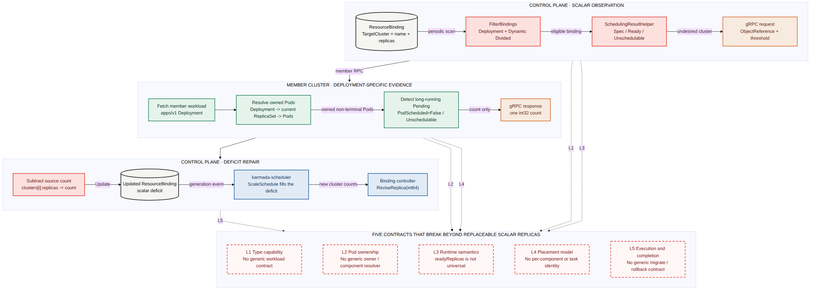

# Day 39：Karmada Descheduler 通用工作负载的五层代码合同与方案对比

日期：2026-08-03

汇报稿：[Style A HTML 演示页](day39-karmada-descheduler-code-research-presentation.html)。本文是 Day 38 的代码级补充，重点回答“为什么不只是增加 GVK”“支持更多任务类型到底要改哪几层”“有哪些实现路线”。Day 38 保留产品场景和 Kubernetes Descheduler 横向对比，本报告不重复展开。

调研基线：

- Karmada：[`upstream/master@a5cf21eacf49373a6ebd57477ac49a52babdde49`](https://github.com/karmada-io/karmada/commit/a5cf21eacf49373a6ebd57477ac49a52babdde49)，2026-08-03。
- 历史实现：estimator 首版 [`90900309ca59`](https://github.com/karmada-io/karmada/commit/90900309ca594342c7ea74ee9f9f47e6ec45dd75)，Descheduler 首版 [`85d8a6ccf4f4`](https://github.com/karmada-io/karmada/commit/85d8a6ccf4f4f1e2c29ee2e66073e1081397c9f8)。
- 源码工作树：`/tmp/karmada-day38-code-research`，只读调研，未在 `intern` 分支引入 upstream source tree。
- 本文的“工作负载（workload）”是 Binding（调度结果对象）引用的 Kubernetes API 对象；“副本（replica）”是可被调度和修订的执行数量；`GVK` 是 API Group、Version、Kind（API 组、版本、类型）的组合。

## 先说人话

### 一句话结论

> 当前 Karmada Descheduler 支持的不是“Deployment 这个名字”，而是“可替换、单组件、标量副本”这组假设。Deployment 能沿现有五层跑通 best-effort（尽力而为）的标量闭环，但它也没有目标预留、目标 Ready 回执和回滚；要把范围扩展到更多任务类型，必须逐层补齐类型能力、Pod 归属、运行状态、放置结果和执行完成，而不是在白名单里多加几个 GVK。

### 领导关心的三个直接答案

1. **为什么当时只做 Deployment？**

   能被历史材料直接证明的是：原始需求很宽，但 KEP 只深入“资源不足导致 Pod 长期 `Unschedulable`”这一条 Story，两个完整例子都使用 Deployment；首版代码随后把 Deployment 写进准入、member 缓存、Pod 归属和 `readyReplicas` 读取。没有找到维护者说“Job、StatefulSet 或 CRD 不应该支持”。更准确的表述是：首版跑通了 Deployment 的最小纵向切片；resolver 和 status 的通用解释只留下局部 TODO，没有形成完整 workload 合同。

2. **为什么不是增加几个类型分支就结束？**

   因为现在链路传递的核心数据始终是一个整数。`readyReplicas=4`、`unschedulableReplicas=2`、`TargetCluster.replicas=6` 可以对 Deployment 表达同一种“可互换副本”；但 Job 的完成进度、StatefulSet 的 ordinal/PVC、Flink 或 AI 任务的 leader/worker、checkpoint 和 gang 都不是一个整数能说明的。

3. **应该怎么实现更多任务调度类型？**

   本报告比较四个方案。推荐不是四选一：近期用 **B：ResourceInterpreter + DeschedulingAdapter（反调度适配器）** 覆盖 Deployment-like 的单组件 workload；Job、StatefulSet、Flink 和千问类多角色任务需要 **D：Operator/plugin delegated task（委托任务）** 这类完成合同，并先确认由哪个 adapter、Operator 或存储控制面执行。**A：逐 GVK 内置** 只适合过渡验证；**C：component-aware Binding/API（组件级调度结果）** 只有产品明确要求“一个 workload 的不同组件跨集群独立分配”时才值得投入。

### 一个最小反例：为什么 Job 不能照抄 Deployment

假设 Deployment 在 `member1` 分配 6 个副本，其中 4 个 Ready、2 个长期 Pending。当前 best-effort 闭环可以把 Binding 中 `member1` 的目标从 6 减到 4，再由 scheduler 尝试把缺少的 2 个副本放到别的集群。

把同一算法套到一个 `parallelism=6, completions=100` 的 Job：

- `parallelism=6` 只是同时运行上限，不等于还有 6 份工作；
- Job status 只有 `active/succeeded/failed`，没有通用的 `readyReplicas`；
- 两个 Pending Pod 可能代表可重建槽位，也可能带固定 completion index；
- Karmada 现有 Binding controller 还会单独调整各集群的 Job `completions`；
- 直接把源集群 `replicas` 减 2，不能证明不会漏做或重复做任务。

所以新增 Job 支持首先需要定义“可移动工作单元”和“完成合同”，而不是先写 `case "Job"`。

## 一、当前代码实际执行什么



- canonical source：[Mermaid](day39-karmada-descheduler-code-contract-breaks.mmd)
- renderer：repo-local `project-mermaid` wrapper，official Mermaid CLI `11.16.0`；图中文字使用英文，便于后续社区复用。

当前完整路径可以压成 12 步：

1. `karmada-descheduler` 周期列出 namespaced `ResourceBinding`，没有处理 `ClusterResourceBinding`。
2. `FilterBindings` 只接受 `apps/v1 Deployment`。
3. applied placement 必须满足 dynamic divided：`Divided + Aggregated`，或 `Divided + Weighted + DynamicWeight`。
4. helper 从 Binding aggregated status 读取每个集群的顶层 `readyReplicas`；字段缺失时写成 `-1`。代码不校验 freshness；字段存在但不是 JSON number 时，`r.(float64)` 还可能 panic。
5. 只有 `Ready < Assigned` 的集群会请求 member `scheduler-estimator`。
6. 请求只带 cluster、workload `ObjectReference` 和超时阈值。
7. estimator 读取 member Deployment。
8. estimator 沿 `Deployment -> current ReplicaSet -> owned Pods` 找到本次 rollout 的 Pod。
9. 只统计持续超过阈值的 `PodScheduled=False, Reason=Unschedulable` Pod。
10. gRPC 只返回一个 `int32 unschedulableReplicas`。
11. 只有 `Unschedulable > 0 && Spec >= Unschedulable` 才计算 `target = Spec - Unschedulable`；仅当 `target < Ready && Ready <= Spec` 时，代码再把 target 抬到 Ready。`Ready=-1` 时这个数值保护不生效，然后更新整个 Binding。
12. scheduler 看到总 assigned 小于 desired，走原有 `ScaleSchedule` 补缺口；Binding controller 再用 `ReviseReplica(int64)` 修改成员工作负载。

> 当前风险：缺少 `readyReplicas` 并不会 fail-closed。`Ready=-1 < Spec` 仍会触发 estimator，请求成功后写回也不会应用 Ready 下界。因此“加 GVK + 加 resolver”可能让新类型在状态证据不可信时继续减副本，而不是在 status 阶段自动报错退出。

关键源码：

- 周期扫描与写回：[`pkg/descheduler/descheduler.go#L141-L249`](https://github.com/karmada-io/karmada/blob/a5cf21eacf49373a6ebd57477ac49a52babdde49/pkg/descheduler/descheduler.go#L141-L249)
- 准入过滤：[`pkg/descheduler/core/filter.go#L30-L62`](https://github.com/karmada-io/karmada/blob/a5cf21eacf49373a6ebd57477ac49a52babdde49/pkg/descheduler/core/filter.go#L30-L62)
- 状态读取与 estimator 请求：[`pkg/descheduler/core/helper.go#L40-L147`](https://github.com/karmada-io/karmada/blob/a5cf21eacf49373a6ebd57477ac49a52babdde49/pkg/descheduler/core/helper.go#L40-L147)
- member 缓存和对象查询：[`pkg/estimator/server/server.go#L66-L70`](https://github.com/karmada-io/karmada/blob/a5cf21eacf49373a6ebd57477ac49a52babdde49/pkg/estimator/server/server.go#L66-L70)、[`server.go#L293-L326`](https://github.com/karmada-io/karmada/blob/a5cf21eacf49373a6ebd57477ac49a52babdde49/pkg/estimator/server/server.go#L293-L326)
- Deployment 到 Pod：[`pkg/estimator/server/replica/replica.go#L42-L97`](https://github.com/karmada-io/karmada/blob/a5cf21eacf49373a6ebd57477ac49a52babdde49/pkg/estimator/server/replica/replica.go#L42-L97)
- 标量 RPC：[`pkg/estimator/pb/estimator.proto#L227-L247`](https://github.com/karmada-io/karmada/blob/a5cf21eacf49373a6ebd57477ac49a52babdde49/pkg/estimator/pb/estimator.proto#L227-L247)
- Binding 标量结果：[`pkg/apis/work/v1alpha2/binding_types.go#L286-L293`](https://github.com/karmada-io/karmada/blob/a5cf21eacf49373a6ebd57477ac49a52babdde49/pkg/apis/work/v1alpha2/binding_types.go#L286-L293)
- scheduler 补缺口：[`pkg/scheduler/scheduler.go#L428-L433`](https://github.com/karmada-io/karmada/blob/a5cf21eacf49373a6ebd57477ac49a52babdde49/pkg/scheduler/scheduler.go#L428-L433)、[`division_algorithm.go#L121-L135`](https://github.com/karmada-io/karmada/blob/a5cf21eacf49373a6ebd57477ac49a52babdde49/pkg/scheduler/core/division_algorithm.go#L121-L135)
- 成员对象修订：[`pkg/controllers/binding/common.go#L74-L96`](https://github.com/karmada-io/karmada/blob/a5cf21eacf49373a6ebd57477ac49a52babdde49/pkg/controllers/binding/common.go#L74-L96)

> 注释：`Binding` 在本报告中特指 `ResourceBinding`，它记录 workload 的跨集群调度结果。`TargetCluster` 是其中一项成员集群分配，当前只有集群名和一个副本数。

## 二、历史上为什么出现 Deployment-only

### 2.1 直接证据

| 时间 | 证据 | 能证明什么 |
| --- | --- | --- |
| 2021-09-04 | [Issue #697](https://github.com/karmada-io/karmada/issues/697) | 最初需求用“调整副本”描述，范围并未写死 Deployment。 |
| 2021-09-07 | [maintainer comment](https://github.com/karmada-io/karmada/issues/697#issuecomment-913930871) | 维护者担心新增组件负担、reschedule strategy 和 Binding schedule status；没有讨论类型取舍。 |
| 2021-09-14 | [KEP-697](https://github.com/karmada-io/karmada/blob/8bbc60d02857c37c730c9caf7d36334a1cd9d7eb/docs/proposals/scheduling/697-descheduler/README.md#L16) | 只深入资源不足导致长期 Unschedulable 的 Story 1，两个 User Story 都用 Deployment。 |
| 2021-11-26 | [proposal discussion](https://github.com/karmada-io/karmada/pull/726#issuecomment-979775681) | 职责确定为 Descheduler 减少源副本，scheduler 再分配缺口。 |
| 2022-02-23 | [estimator commit `90900309`](https://github.com/karmada-io/karmada/commit/90900309ca594342c7ea74ee9f9f47e6ec45dd75) | 首版 estimator 只实现 Deployment 缓存和 owner chain。 |
| 2022-02-23 | [Descheduler commit `85d8a6cc`](https://github.com/karmada-io/karmada/commit/85d8a6ccf4f4f1e2c29ee2e66073e1081397c9f8) | 首版过滤器只放 Deployment，状态读取硬编码 `readyReplicas`。 |

两个限制从首版进入主线并一直保留：

```go
var supportedGVKs = []schema.GroupVersionKind{
    appsv1.SchemeGroupVersion.WithKind("Deployment"),
}
```

```go
switch workload := workload.(type) {
case *appsv1.Deployment:
    // Deployment -> current ReplicaSet -> Pods
default:
    // TODO: add abstract workload
    return nil, fmt.Errorf("kind(%s) ... is not supported", ...)
}
```

状态读取也留下了 `TODO: cooperate with custom resource interpreter`。这些 TODO 只能证明 resolver 和 status 两个具体位置预留了扩展方向，不能证明作者当时已经定义完整的通用 workload 架构，也不能反推 Deployment-only 的主观动机。

### 2.2 不能写成历史事实的内容

没有证据证明：

- 社区完整评估后明确拒绝 Job、StatefulSet 或 CRD；
- Karmada scheduler 当时只能调度 Deployment；
- Deployment-only 是因为固定工期、性能压力或某个客户优先级；
- 后续 Flink 场景的 state preservation 讨论就是 2021 年的原始理由。

当时 `ResourceBinding` 已经用通用 `ObjectReference` 保存 GVK，scheduler 也处理通用 Binding；默认 ResourceInterpreter 甚至已经支持 Deployment 和 Job 的副本解释。因此不能说“scheduler 本身只支持 Deployment”。Descheduler 缺的是从任意 workload 反向解释其运行单元、状态和安全动作的合同。

### 2.3 工程推断：Deployment 为什么能跑通 best-effort 标量闭环

下面是从源码结构得到的工程推断，不是维护者原话：

```text
Deployment.spec.replicas
      = Binding.spec.replicas
      = sum(TargetCluster.replicas)

Deployment.status.readyReplicas
      = 代码当作不可继续缩减的标量下界；没有 freshness 校验

long-running Unschedulable Pods
      = 可以从源 TargetCluster.replicas 减掉的标量数量
```

Deployment 还有一条可验证的 owner chain：只取 current ReplicaSet，再按 controller UID 取其 Pod。于是“期望、就绪、不可调度、分配”四个量能够落在同一个整数空间，scheduler 只需填补整数缺口。这个性质让 release-first 的异步修正可以工作，但当前路径仍没有 target reservation、Ready acknowledgment 或 rollback，不能等同于完整迁移事务。

## 三、支持更多类型必须解决的五层问题

### L1：类型能力与准入合同

当前门槛分散在多个地方：

- `supportedGVKs` 只列 Deployment；
- Descheduler 只 list `ResourceBinding`；
- 只接受 `Divided + Aggregated`，或 `Divided + Weighted + DynamicWeight`；
- estimator 只预建 Deployment、ReplicaSet、Pod 的 informer/lister；
- ResourceInterpreter 没有“此 workload 是否支持自动 Deschedule”的能力声明。

只加 GVK 会让对象进入前半段，但随后可能在 member lookup、status 或 action 阶段失败。通用方案需要一个显式 capability，而不是用“能 GetReplicas”推断“可以安全迁移”。

建议最少区分：

- `ReplaceableScalar`：可互换、单组件、可按数量缩放；
- `OrdinalStateful`：有 ordinal、PVC 或稳定身份；
- `FiniteCompletion`：存在有限完成量、index 或幂等要求；
- `GangAtomic`：多个角色必须成组放置或启动；
- `OperatorManaged`：迁移语义由领域 Operator 管理。

未知类型默认 fail-closed（证据不足时不动作）；“支持所有类型”应定义为“所有显式声明并实现能力合同的类型”，不能让核心自动猜。

### L2：执行单元与 Pod 归属合同

estimator 必须回答：“这个 workload 当前真正控制哪些 Pod？”Deployment 路径并不是简单 label selector，而是：

```text
Deployment UID
  -> current ReplicaSet
  -> ReplicaSet UID
  -> non-terminal owned Pods
```

不同 workload 的 owner graph 完全不同：

- StatefulSet 直接拥有带 ordinal 的 Pod；
- Job 直接拥有 Pod，还可能要求 completion index；
- CronJob 先创建 Job，再由 Job 创建 Pod；
- CRD 可能直接创建 Pod，也可能创建 Deployment/Job 等子 controller；
- 多组件 CRD 的不同 selector 对应不同 component/role。

仅按 label selector 会把旧 revision、相邻 workload 或重叠组件算进去。通用 resolver 至少需要 `owner UID + owner chain + current revision/component identity`，selector 只能作为候选集合，不能单独证明归属。

### L3：运行状态与进度合同

当前 helper 把每集群状态固定为三个标量：`Spec / Ready / Unschedulable`，并直接读取顶层 `status.readyReplicas`。这个字段不是 workload 通用协议：

- Deployment、ReplicaSet、StatefulSet 有近似的 ready 标量；
- Job 反射的是 `active/succeeded/failed`；
- Flink 有 JobManager/TaskManager 和应用状态；
- AI 任务可能有 leader/worker、gang 是否完整和训练进度；
- stateful workload 还需要 checkpoint/PVC/ordinal 是否可恢复。

这里必须先回答：哪个运行单元确实 Pending？它是否可丢弃并在别处重建？哪些已完成工作不能回退？状态是否与当前 generation/revision 对齐？没有这些信息，`Ready` 下界只是看起来安全的数字。

当前实现还有一个必须单独修正的风险：`readyReplicas` 缺失时，helper 将 `Ready` 记为 `-1`，但仍会因为 `-1 < Spec` 请求 estimator；如果 estimator 返回不可调度数量，写回阶段也不会应用 Ready 下界。这是 fail-open 行为，不适合作为新 workload 的默认状态合同。

源码证据：[`helper.go#L126-L147`](https://github.com/karmada-io/karmada/blob/a5cf21eacf49373a6ebd57477ac49a52babdde49/pkg/descheduler/core/helper.go#L126-L147)、[Job reflected status](https://github.com/karmada-io/karmada/blob/a5cf21eacf49373a6ebd57477ac49a52babdde49/pkg/resourceinterpreter/default/native/reflectstatus.go#L203-L230)、[StatefulSet reflected status](https://github.com/karmada-io/karmada/blob/a5cf21eacf49373a6ebd57477ac49a52babdde49/pkg/resourceinterpreter/default/native/reflectstatus.go#L280-L320)。

### L4：决策与放置结果合同

当前 gRPC response 只有一个 `int32`，`TargetCluster` 也只有：

```go
type TargetCluster struct {
    Name     string
    Replicas int32
}
```

它表达不了：

- `worker` 减 2、`leader` 不动；
- StatefulSet 应移动哪个 ordinal；
- Job 的哪个 completion index 仍未完成；
- 一个 gang 是整体移动还是部分移动；
- checkpoint、shard 或 role 的身份。

当前 `Binding.Spec.Components` 只是 workload 的全局组件需求，不是每个集群的组件分配结果。scheduler 明确把多组件 workload 当作整体放到一个集群，并且不支持 replica division。[`pkg/util/binding.go#L43-L49`](https://github.com/karmada-io/karmada/blob/a5cf21eacf49373a6ebd57477ac49a52babdde49/pkg/util/binding.go#L43-L49) 直接指出：当前只能识别 clusters 清空，无法识别 component scale/swap；完整方案需要改变调度结果保存方式，很可能给 `TargetCluster` 增加 per-component 信息。

因此多组件支持首先是 Binding/Scheduler 数据模型问题，不能只在 Descheduler 一侧解决。

### L5：执行、安全与完成合同

当前动作只有“减源集群标量副本”，然后异步等待 scheduler 补位。它没有：

- source prepare/checkpoint；
- target reservation；
- target Ready acknowledgment；
- cutover、rollback、deadline；
- migration budget、priority、dry-run；
- workload-specific completion；
- 跨 controller 的单一写入者和幂等 token。

Binding controller 最终调用的仍是 `ReviseReplica(int64)`。虽然 native interpreter 能把 StatefulSet 写到 `.spec.replicas`、把 Job 写到 `.spec.parallelism`，但“能改一个数”不等于“这次迁移已经安全完成”。现有 `GracefulEvictionTask` 的完成条件主要是目标健康或超时；没有 health interpreter 的资源还会被视为 Healthy，也不足以直接承载所有任务迁移语义。

> 分析：五层不是历史 KEP 明列的五项原因，而是沿当前代码调用链归纳出的五个合同边界。任何方案声称支持某类 workload，都必须逐层给出输入、输出、失败方式和测试，而不能只报告“GVK 已加入”。

## 四、不同 workload 会具体断在哪里

| workload 类型 | L1 准入 | L2 归属 | L3 状态/进度 | L4 结果表达 | L5 动作/完成 | 结论 |
| --- | --- | --- | --- | --- | --- | --- |
| Deployment | 已支持 | current RS + owner UID | `readyReplicas` + Pending count | 标量 | `ReviseReplica`，无 target-ready/rollback | 当前 best-effort 标量闭环 |
| ReplicaSet | 未放行 | 可直接 owner UID | 有 ready 标量 | 标量 | `ReviseReplica` | 最接近，可作适配器验证 |
| StatefulSet | 未放行 | 直接 owner + ordinal | 有 ready，但无身份/数据可恢复证明 | 标量缺 ordinal | 缺 PVC/ordinal/rollback | 只能定义非常受限的 opt-in 子集 |
| Job / Indexed Job | 未放行 | direct owner + index | `active/succeeded/failed`，无 ready | 标量缺 completion/index | 可能漏做或重复 | 必须先定义完成合同 |
| 单组件 CRD | 未放行 | 缺通用 owner graph hook | 可由 interpreter 自定义 | 若可替换则标量够用 | 缺显式 capability | B 方案目标范围 |
| Flink / AI 多组件 CRD | 未放行 | component selector/owner graph | checkpoint、role、gang | per-cluster component 缺失 | 需 prepare/cutover/rollback | D 优先，C 只在组件拆分需求明确时 |
| DaemonSet | 未放行 | 直接 Pod | 数量由节点集合派生 | 不适用普通 replica division | 不能按 Binding scalar 缩放 | 不应套用现算法 |
| CronJob | 未放行 | CronJob -> Job -> Pod | 每次运行有独立生命周期 | 不是稳定副本向量 | 需处理子 Job | 不应套用现算法 |

这里最重要的分界不是 built-in/CRD，而是：

```text
可替换标量副本
    vs.
带身份或完成进度的执行单元
    vs.
多组件/成组放置的原子任务
```

## 五、四种实现方案

### 方案 A：逐 GVK 增加 built-in

**做法**

- 在 `pkg/descheduler/core/filter.go` 增加 allowlist；
- 在 `pkg/estimator/server/server.go` 增加 GVR informer/lister；
- 在 `pkg/estimator/server/replica` 增加 ReplicaSet、StatefulSet、Job resolver；
- 在 `pkg/descheduler/core/helper.go` 按类型读取 status/progress；
- 保持现有 scalar proto、`TargetCluster.replicas` 和 scheduler 缺口模型不变。

**能覆盖**

- ReplicaSet；
- 明确接受无数据迁移、只丢弃不可调度 ordinal 的受限 StatefulSet；
- 明确证明 Pending 槽位可重建、没有 completion identity 风险的受限 Job。

**不能覆盖**

- 任意 CRD、多组件、多角色、gang、checkpoint、PVC/ordinal 数据迁移；
- DaemonSet、CronJob 等非 scalar division 模型。

**评价**

- 优点：交付最快，不修改 Binding API 和 gRPC 主模型，scheduler 耦合低。
- 缺点：每种类型都复制 resolver/status 分支，维护和测试成本随 GVK 线性增长；很容易把受限支持写成“通用支持”。
- 定位：只适合作为 Phase 1 抽象验证或小范围过渡，不作为最终架构。

### 方案 B：ResourceInterpreter + DeschedulingAdapter（近期主线）

**做法**

在 ResourceInterpreter（资源解释器）旁新增明确的 Descheduling capability/profile（反调度能力描述），例如：

```text
DeschedulingProfile
  capability: ReplaceableScalar
  podCandidateSelector
  requiredOwnerChain / ownerUIDRule
  currentRevisionRule
  readyOrProgressRule
  failClosedConditions
```

控制面解析 profile 后随 estimator gRPC request 发送。member estimator 不另建解释器配置源，只执行已解析的受约束 resolver；selector 结果必须再校验 owner UID/revision。Deployment 先改写成第一个 adapter，以相同输入保持现有行为。

**主要改动面**

- `pkg/resourceinterpreter/interpreter.go` 和 Lua/webhook operation：新增 `GetDeschedulingProfile` 或等价接口；
- Descheduler 启动与命令 wiring：当前组件没有 ResourceInterpreter、原始 workload dynamic client/REST mapper 或 generic informer manager；需要注入对象获取与解释器依赖，并扩展 RBAC，或另设 profile resolver 预先生成受约束描述；
- `pkg/descheduler/core`：从 Binding 的 `ObjectReference` 取得原始对象，解析 profile，并做 capability、freshness、opt-in（显式启用）和 fail-closed 校验；
- estimator proto/client/server：增加 optional profile 和结构化结果；
- `pkg/estimator/server/replica`：由 Deployment switch 变成通用 resolver registry，并定义任意 GVR 的缓存或 API fallback 策略；
- feature gate、版本偏差和 fallback 测试。

**能覆盖**

- Deployment、ReplicaSet；
- 语义确实是单组件、可替换副本的 CRD；
- 能声明 Pod 归属、当前 revision 和状态规则的 Deployment-like workload。

**仍不能覆盖**

- StatefulSet 数据身份；
- 有限完成 Job；
- gang、多角色、多组件独立迁移。

**评价**

- 优点：把类型差异隔离在 adapter，Binding 和 scheduler 仍只处理归一化标量；增加新 CRD 不再改 core switch。
- 风险：原始对象获取、解释器 wiring/RBAC、协议、Lua/webhook、owner validation 和 version skew 的首期成本高；如果 profile 设计得过宽，会把领域逻辑塞进一段不可审计脚本。
- 定位：推荐近期主线，但 support matrix 必须限定为 `ReplaceableScalar`。

### 方案 C：component-aware Binding/API 重构（平台级）

**做法**

让每个 `TargetCluster` 能保存组件向量，而不只是一个总数，例如：

```text
TargetCluster
  name: member1
  componentReplicas:
    - worker: 4
    - leader: 1
```

同时让 estimator 返回 per-component deficit，让 scheduler 支持 component assignment/division，让 Binding controller 调用 `ReviseComponents`，并给 task/status 增加 per-component 结果。

**主要改动面**

- `pkg/apis/work/v1alpha2/binding_types.go`、CRD、OpenAPI、generated clients/apply config；
- ResourceInterpreter：`ReviseComponents` 和 component observation；
- scheduler assignment/division/estimation；
- Descheduler helper/write path；
- estimator proto/client/server；
- Binding、graceful eviction、status aggregation；
- upgrade/version-skew 与 legacy `Replicas` 双表示一致性校验。

**能覆盖**

- 表达 Flink、训练任务等 replica-shaped 多组件 workload；
- 识别 `worker -2 / leader 0`，并按组件保存目的集群结果。

**仍不能单独覆盖**

- Job completion、checkpoint、gang barrier、PVC/ordinal 和外部状态；
- “组件计数可表达”不等于“迁移已安全完成”。

**评价**

- 优点：从根上补齐 per-cluster component placement 表达力。
- 风险：API 和 scheduler 耦合最高，混合版本中旧 controller 会忽略新结果；测试要覆盖生成物、admission、scheduler、Binding、Descheduler、estimator 和 e2e 全链路。
- 定位：只有出现“一个 workload 的不同组件必须跨集群独立分配/迁移”的硬产品需求时启动，不为一次 whole-workload 迁移提前重构整套 Binding。

### 方案 D：Operator/plugin delegated execution（复杂任务的条件路线）

**做法**

Karmada core 只负责发现候选、校验计划和选择目标；明确注册的 adapter、领域 Operator 或存储控制面负责 checkpoint、ordinal/PVC、Job progress、gang/role 和最终 cutover。非 scalar workload 不直接减少 Binding，而是通过可观察的任务合同握手。

任务载体不能预先写死为“新增 CRD”，至少要比较两种方式：

- **D1：扩展 `ResourceBinding.Spec.GracefulEvictionTasks`。** 现有 embedded task 已有 source、replicas、producer、grace period、suppression、preserved state 和 scheduler exclusion，完成侧也有 target health/timeout；但它缺少独立 status、component/work-unit identity 和 workload-specific phase。
- **D2：新增独立 `WorkloadDeschedulingTask`。** 可以清楚表达 status、owner、重试和审计，但会增加 CRD、controller、RBAC、升级与运维成本。

`WorkloadRebalancer` 也可以继续作为用户显式提交 intent 的入口，但执行 owner、Binding 单一写入方和完成条件必须先收敛。无论选择哪种载体，目标状态机可以是：

```text
Pending
  -> Accepted
  -> Prepared
  -> TargetReady
  -> Completed

any phase -> Failed / RolledBack
```

这是方案目标，不是当前实现已经具备的能力。任务至少要携带 workload generation、source、component/action、幂等 token、deadline 和 condition；执行方不在线、未注册或拒绝能力时必须 fail-closed，不能先缩源。

**主要改动面**

- 先比较扩展 embedded `GracefulEvictionTasks` 与新增独立 CRD，确定 task owner、status 和升级边界；
- capability/adapter 注册；
- scheduler 的目标选择或受约束 plan 校验接口；
- adapter/Operator/storage plane 执行合同；
- completion、timeout、rollback、single-writer e2e。

**在执行方显式实现合同后可以覆盖**

- Job、Indexed Job、StatefulSet；
- Flink、千问/AI 多角色任务、gang、checkpoint；
- 任何已经有 adapter/Operator/storage plane 且能实现准备、切换、完成和回滚的 workload。

**边界**

- 未注册 capability/operator 的未知 workload 仍不支持；
- Job 和 StatefulSet 并不天然带有能执行跨集群迁移的领域 Operator；没有执行方时，D 只是协议草案；
- 如果选择新 controller/CRD，会增加运维和升级成本；
- whole-workload 原子迁移对 scheduler 耦合较低，若还要求组件分别去不同集群，则仍要接方案 C。

**评价**

- 优点：设计上的安全上限最高，复杂度可以留给拥有领域知识的执行方；当合同和实现齐备时，才可能证明 prepare、target-ready、cutover 和 rollback。
- 风险：不是一个 core PR 能完成，也不能假设现有 Operator 已提供迁移能力；需要定义稳定插件合同和跨 controller 状态机。
- 定位：千问、Job、stateful 和多组件任务的优先研究方向，是否落地取决于执行方和 task 载体决策。

## 六、方案横向对比

下面是基于当前代码改动面的定性判断，不是 prototype、benchmark 或交付周期测量；D 的覆盖和安全都以存在合格执行方为前提。

| 方案 | 首次交付 | 覆盖上限与前提 | 安全上限 | API / scheduler 耦合 | 长期维护 | 推荐定位 |
| --- | --- | --- | --- | --- | --- | --- |
| A 逐 GVK built-in | 快 | 少量 `ReplaceableScalar` built-in | 低至中 | 低 | 每个 GVK 线性增长 | 过渡/验证 |
| B Interpreter + Adapter | 中 | 显式 profile 的单组件可替换 workload | 中 | 低至中；scheduler 保持标量 | 新类型主要写 profile/contract test | 近期主线 |
| C Component-aware API | 最慢 | replica-shaped 多组件；仍不解决领域状态 | 中 | 最高 | 平台统一，但升级和全链路测试成本大 | 有硬需求再做 |
| D delegated execution | 慢 | 仅覆盖已有合格 adapter/Operator/storage plane 的类型 | 高潜力，取决于执行合同 | 中；whole-workload 路径对 scheduler 较低 | core task 合同 + 每个领域实现 | 复杂任务研究主线 |

### 按五层改动范围看

| 方案 | L1 能力 | L2 归属 | L3 状态 | L4 表达 | L5 完成 |
| --- | --- | --- | --- | --- | --- |
| A | 每类型 case | 每类型 resolver | 每类型 status | 仍是标量 | 仍弱 |
| B | 统一 capability | 通用受约束 resolver | profile 解释 | 仍是标量 | 中等，可接 task |
| C | 统一 capability | 仍需 adapter | component observation | 组件向量 | 仍需状态机 |
| D | plugin/operator capability | 已注册执行方 | 领域进度 | 原子 plan 或接 C | 目标是 task 状态机，当前未实现 |

### 决策规则

1. 需求只是再支持一个确定的 Deployment-like built-in，且所有副本可互换：可用 A 做验证，但实现应朝 B 的 adapter 形态收敛。
2. 需求是多个 Deployment-like CRD：直接做 B，避免 core switch 扩散。
3. 需求涉及 Job completion、Stateful identity、checkpoint、gang 或多角色：必须采用 D 这类带执行方和完成状态的合同，不能用标量减法伪装完成；如果没有执行方，则暂不支持自动迁移。
4. 只有需求明确要求 per-component destination，才同时启动 C；whole-workload 原子迁移不需要先做 C。

## 七、推荐路线：B 主线 + D 条件扩展

### Phase 0：先冻结能力分类和安全边界

- 定义五类 capability 和第一版 support matrix；
- 默认 opt-in、fail-closed、dry-run；
- 定义 observedGeneration/revision freshness；
- 明确 Descheduler、scheduler、task controller 的单一写入职责；
- 定义预算、优先级、超时和审计 Event/Condition。

**退出条件**：每个支持类型都能回答五层合同；未知类型不会改变 Binding。

### Phase 1：把 Deployment 变成 adapter，再做一个近邻类型

- 保持 Deployment 行为不变，先抽出 adapter 接口；
- 用 ReplicaSet 或严格受限的单组件 CRD 验证接口；
- 不把 StatefulSet/Job 纳入“标量副本”默认能力；
- 增加真实两集群 long-running Unschedulable e2e，当前仓库主要是 unit coverage。

**退出条件**：不改 core switch 就能注册第二种 replaceable scalar workload，owner UID/revision 和 fail-closed 有回归测试。

### Phase 2：上线 ResourceInterpreter profile

- 控制面解析 profile，随 gRPC 发送；
- estimator 做通用 owner/revision resolver；
- optional proto 字段、feature gate 和混合版本 fallback；
- 建立 contract tests，防止脚本声称的 selector 与实际 owner 不一致。

**退出条件**：Deployment-like CRD 能在不修改 scheduler 和 Binding API 的前提下完成同等闭环。

### Phase 3：为千问/Job/复杂任务增加 delegated task

- 先确认千问真实 Kind、components、gang、checkpoint、GPU topology 和成功条件；
- 确认 adapter、Operator 或 storage plane 中谁能真正执行迁移合同；没有执行方时保持不支持；
- 比较扩展 embedded `GracefulEvictionTasks` 与新增独立 task CRD，不预先锁定 API 形态；
- 定义 task 的 prepare/target-ready/cutover/rollback；
- 让已注册执行方提供进度与安全证明；
- Karmada core 保留检测和目标选择，不理解训练框架内部状态。

**退出条件**：执行方缺失、离线或失败时不缩源；成功时有 target-ready 级回执，重试幂等。

### Phase 4：按硬需求决定是否做 component-aware Binding

只有同时满足以下条件才启动 C：

- 一个 workload 的组件确实需要落到不同 member cluster；
- whole-workload 原子迁移不能满足业务；
- component identity、资源估算、状态聚合和执行接口已经稳定；
- 团队接受 API generation、upgrade/version-skew 和全链路 e2e 成本。

## 八、为什么这条路线还能保持 scheduler 简单

保持 scheduler 简单，不是让它“什么都不做”，而是只让它接收归一化的调度单元：

```text
Adapter / Operator / storage plane
  负责：Pod 归属、状态语义、checkpoint、gang、是否可移动

Descheduler / Task controller
  负责：何时释放旧分配、预算、状态机、完成与回滚

karmada-scheduler
  负责：给已经被证明可放置的标量副本、原子组件集或原子 workload 选目标集群
```

方案 B 让 scheduler 继续只看标量缺口；如果方案 D 的执行方和 task 合同实现完成，复杂 workload 可以先收敛成一个受约束 plan。只有方案 C 被明确启用时，scheduler 才需要理解 component vector。这样 workload-specific 复杂度不必进入 scheduler 的 filter/score 主路径，也不需要为每个 CRD 增加一套调度分支。

## 九、对千问场景的代码级结论

当前不能只凭“千问”这个内部称呼选择实现。立项前必须确认：

- 真实 GVK 是 Deployment、Job 还是多组件 CRD；
- 副本是否完全可替换；
- 是否有 leader/worker、gang、shard 或固定 index；
- 是否要求 checkpoint/PVC/模型缓存；
- 成功标准是 Binding 已重新分配，还是 target workload 已 Ready 并可切换；
- source 是否允许先缩，失败时是否必须 rollback；
- 是否真的要求不同组件跨集群独立放置。

选择规则：

- 如果它本质是 Deployment-like、单组件、离线、可中断、可替换副本：走 B，复用 Descheduler 周期检测和 scheduler 标量缺口。
- 如果它是 Job、训练 Operator CRD、多角色/gang 或需要 checkpoint：研究 D，并先确认谁实现执行合同；没有执行方时，Descheduler 只产生候选或保持不支持，不能直接减 Binding。
- 如果只要求整个任务换一个集群，且 D 的执行方已就绪：不必先做 C。
- 如果明确要求不同 component 同时分布到不同集群：在 D 的执行合同之外还需要 C，并接受平台级 API 改造。

这也解释了为什么千问的“长期资源不可满足”检测更适合复用 Descheduler，而不是把 member Pod 观察重新写进 WorkloadRebalancer：检测路径可以复用，但复杂任务的执行不应强塞进现有标量 Descheduler。WorkloadRebalancer 仍可作为用户显式提交 task 的入口，前提是 single writer 和完成合同先确定。

## 十、风险、测试与未决边界

### 当前已验证

- `git blame` 确认 Deployment 白名单和 switch 来自首版实现并延续至当前基线；
- 定向测试 `go test ./pkg/descheduler/... ./pkg/estimator/server/replica` 通过；
- unit tests 已覆盖 Deployment 正常路径和 StatefulSet unsupported-kind 路径；
- 当前仓库没有找到证明真实多集群 descheduling 闭环的专项 e2e。

### 任一实现方案都必须补的测试

1. capability/default-deny、feature gate 和 version skew；
2. owner UID、rollout/revision、重叠 selector、terminal Pod；
3. stale aggregated status、missing status、partial estimator failure；
4. scheduler 补位失败、source 已缩的中间态和下一轮恢复；
5. task 幂等、timeout、operator unavailable、rollback；
6. Job no-loss/no-duplicate、Stateful ordinal/PVC、gang atomicity；
7. 两集群真实 e2e：检测、释放、补位、target Ready 和完成 condition。

### 仍需团队确认

- 千问实际 workload contract；
- 第一版支持矩阵是否只承诺 `ReplaceableScalar`；
- `ResourceInterpreter` 是否适合承载 descheduling profile，还是新增独立 CRD/registry；
- task API owner 是 Descheduler、WorkloadRebalancer 还是新 controller；
- 是否存在 component 跨集群拆分的真实硬需求；
- 社区是否接受新增常驻组件与 estimator 协议演进。

## 十一、汇报时可以直接使用的收口

> 第一，在本次核查的 Issue #697、KEP-697、PR #726 和首版提交中，没有找到“只应支持 Deployment”的架构决策；现有证据只表明首版用 Deployment 跑通了长期 Unschedulable 副本修复的窄 MVP，resolver/status 的通用合同没有完成。
>
> 第二，当前代码的限制不是一个 GVK 白名单，而是五层合同都默认“一个副本是可替换整数”：类型准入、Pod 归属、状态语义、放置结果、执行完成。Job、StatefulSet 和多组件任务分别在这些层上失去等价性。
>
> 第三，我们不建议直接承诺“支持所有 workload”。近期用 ResourceInterpreter + Adapter 扩展可替换的单组件类型；千问、Job 和有状态/多角色任务先确认执行方，再用 delegated task 合同管理 checkpoint、完成与回滚；只有明确要做组件跨集群拆分时再重构 Binding/API。这样既扩展能力，又能让 scheduler 继续只处理归一化的调度单元。

## 十二、下一步最小行动

1. 用千问真实 YAML/CRD 回答五层合同问题，给出 capability 分类和 `B/D/C` 路由。
2. 在 upstream issue/proposal 中先提 support matrix 和 contract，不先提交“增加 GVK”的代码。
3. 做一个不改变现有行为的 Deployment adapter spike，证明 B 的接口边界。
4. 为 complex workload 起草最小 task 状态机和 failure matrix，比较扩展 `GracefulEvictionTasks` 与新增 CRD，并验证 WorkloadRebalancer 是否只作为 intent 入口。
5. 在获得 maintainer 方向前，不修改 upstream API，不发布“支持所有 workload”的承诺。
