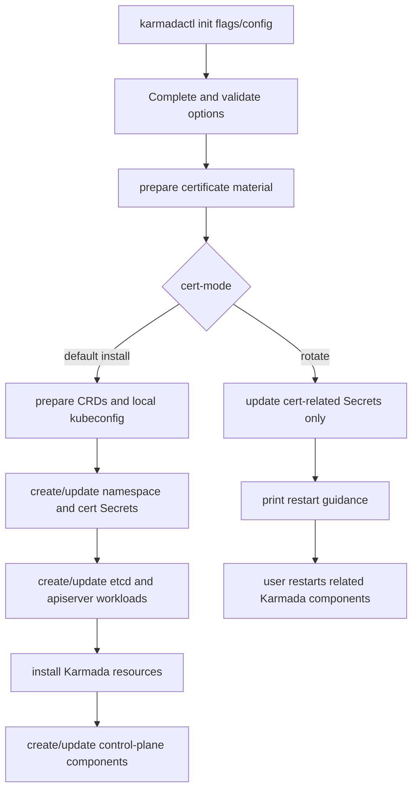

# Day 4: #7690 发布后的 branch / proposal gap 分析

日期：2026-06-30

## 今日目标

Day 3 已经把证书 layout 方向整理成 upstream issue，并发布为 [karmada-io/karmada#7690](https://github.com/karmada-io/karmada/issues/7690)。今天先不急着开 PR，而是确认当前 prototype branch `feature/cert-manager-layout` 和 #7690 提案之间还有哪些 gap，避免把“长期方案图”和“第一版可合并代码”混在一起。

## 当前社区状态

- Issue: [#7690 Proposal: plan-based split certificate Secret layout for karmadactl init](https://github.com/karmada-io/karmada/issues/7690)
- Label: `kind/feature`
- 状态：open
- Assignee / milestone：暂无
- 评论：已通过 `/kind feature` 添加 label，暂无 maintainer 设计反馈。
- 相关背景：
  - [#6051](https://github.com/karmada-io/karmada/issues/6051)：配置和证书 Secret/path naming convention umbrella。
  - [#6670](https://github.com/karmada-io/karmada/issues/6670)：标准化 self-signed certificates 的 proposal。
  - [#6788](https://github.com/karmada-io/karmada/pull/6788)：已有 open split secret layout PR，当前 proposal 需要尊重已有工作，不能装作没有相关实现。

## Prototype branch 状态

- 本地目录：`/home/karmada-cert-bulk`
- Branch: `feature/cert-manager-layout`
- Commit: `eb02bde96cbd88697bb808e2cb56137070d18a4c`
- Commit message: `feat: add cert secret layout for init`
- DCO: 已带 `Signed-off-by`
- Diff 规模：14 files changed, 1551 insertions(+), 326 deletions(-)
- Fork push CI：已通过。18 个 check runs 中 16 success、2 skipped、0 failed。
- 本地验证：

```bash
PATH="$(go env GOPATH)/bin:$PATH" golangci-lint run ./pkg/karmadactl/cmdinit/...
PATH="$(go env GOPATH)/bin:$PATH" hack/verify-staticcheck.sh
hack/verify-import-aliases.sh
go test ./pkg/karmadactl/... -count=1
hack/verify-command-line-flags.sh
git diff --check
```

## 已经对齐 #7690 的部分

| #7690 提案点 | branch 覆盖情况 | 证据 |
| --- | --- | --- |
| `karmadactl init --secret-layout=legacy\|split` | 已实现，默认 `legacy` | `pkg/karmadactl/cmdinit/cmdinit.go` 新增 flag；`docs/command-line-flags/karmadactl_init.md` 已生成更新。 |
| config file 支持 layout | 已实现 | `pkg/karmadactl/cmdinit/config/types.go` 新增 `spec.secretLayout`，测试覆盖 config parse。 |
| plan-based certificate layout abstraction | 已实现核心抽象 | 新增 `pkg/karmadactl/cmdinit/certmanager/types.go`，`Plan` 包含 identities、Secrets、kubeconfigs、component volumes/mounts/paths。 |
| legacy layout 保持默认兼容 | 已实现 | `legacyPlan()` 保留当前 aggregated `karmada-cert` / `etcd-cert` / `karmada-webhook-cert` 行为。 |
| split layout 分发 component-scoped Secrets | 已实现 prototype | `splitSecrets()` 拆出 apiserver、aggregated-apiserver、kube-controller-manager、scheduler/descheduler estimator、webhook、internal etcd 等 Secret。 |
| workload commands / volumes / mounts 消费 declarative plan | 已实现 | `pkg/karmadactl/cmdinit/kubernetes/cert_plan.go` 将 plan 翻译成 `corev1.Volume` / `VolumeMount`；`command.go` 从 plan paths 取证书路径。 |
| kubeconfig 使用 component client cert | 已实现 | `splitKubeconfigs()` 根据组件选择 client identity，`createCertsSecrets()` 按 plan 生成 kubeconfig Secret。 |
| external etcd 使用用户提供材料 | 已实现 prototype | `splitPlan(externalEtcd=true)` 不生成 internal etcd server Secret，apiserver/aggregated-apiserver etcd client Secret 复用 `EtcdClient`。 |
| split 下保留 legacy-compatible `karmada-cert` | 已实现 | `legacyCompatibleKarmadaCert()` 保留兼容 Secret，并对 external etcd 的部分 material 标记 optional。 |

结论：branch 覆盖的是 #7690 中“第一版 `karmadactl init` layout-plan subset”，不是图片里的完整长期证书管理系统。

## 主要 gap

### 1. Issue 还在问方向，branch 已经做了设计选择

#7690 的最后 5 个问题还是待 maintainer 确认的问题：

1. `karmadactl init` 是否接受 plan-based certificate layout boundary。
2. 第一版是否只做 `karmadactl init`，还是需要同时设计 Helm/operator。
3. split mode 是否应该临时保留 legacy-compatible `karmada-cert`。
4. component client cert 的 group/privilege 是否应该在本 PR 收窄。
5. 现有 #6788 是继续、替换，还是先在 #6670 讨论。

但是 prototype branch 已经默认选择：

- 只做 `karmadactl init`。
- 保留 legacy-compatible `karmada-cert`。
- 不做 RBAC/client privilege 收窄。
- 不引入 cert-manager/CRD/controller。
- 用新的 `certmanager.Plan` 抽象替代在部署代码里散落 `legacy/split` 判断。

这不是代码错误，但意味着在 maintainer 回复前不要直接开 upstream PR；否则 PR 看起来像已经绕过设计讨论。

### 2. 图片里的长期方案没有实现，这是 intentional gap

#7690 的两张图展示了更大的长期方向，包括：

- certificate policy / plan / inventory CRDs；
- certificate management controllers；
- cert-manager / CA integration；
- 多集群 Secret 分发；
- rotation / hot reload；
- observability / alerting。

当前 branch 没有实现这些内容。这个 gap 是刻意保留的，因为 #7690 的 `Non-goals` 已经写清楚第一版不做 CRD、controller、cert-manager integration、rotation/hot reload、Helm/operator。后续如果 reviewer 误解图片范围，需要回复说明：图片只用于解释长期方向和前后对比，第一版 PR 只取 `karmadactl init` 的 layout-plan 子集。

### 3. PR diff 可能偏大，需要考虑拆小

当前 diff 是 14 个文件、约 +1551/-326。它同时包含：

- 新抽象层；
- 新 flag 和 config 字段；
- 新证书 identity / Secret layout；
- Deployment / StatefulSet / command path 接入；
- Secret/kubeconfig 生成逻辑改造；
- tests 和 command-line flag docs。

如果直接开 PR，reviewer 需要一次性审抽象设计、证书命名、部署模板、external etcd、兼容策略和测试。更稳妥的拆法：

1. PR 1：引入 plan abstraction，保持 legacy 行为等价，证明 abstraction boundary 不改变用户行为。
2. PR 2：新增 `--secret-layout=split` 和 split Secret/kubeconfig 分发。
3. PR 3（可选）：根据 maintainer 反馈处理 RBAC/client identity 收窄、Helm/operator 对齐或 #6788 迁移。

如果 maintainer 明确希望一个 PR 解决，也可以保留当前 branch，但 PR body 需要非常清晰地列出 scope 和 review checklist。

### 4. 命名规范还未被社区确认

branch 已经选择了一批 Secret 名称、volume 名称、mount path 和 data key，例如：

- `karmada-apiserver-cert`
- `karmada-apiserver-etcd-client-cert`
- `karmada-apiserver-front-proxy-client-cert`
- `karmada-apiserver-service-account-key-pair`
- `karmada-aggregated-apiserver-cert`
- `karmada-aggregated-apiserver-etcd-client-cert`
- `kube-controller-manager-ca-cert`
- `kube-controller-manager-service-account-key-pair`
- `karmada-scheduler-scheduler-estimator-client-cert`
- `karmada-descheduler-scheduler-estimator-client-cert`
- `etcd-etcd-client-cert`

这些命名是基于 #6051 和现有 manifests 的理解，但还不是 maintainer 明确确认的共识。尤其要注意：

- `karmada-scheduler-scheduler-estimator-client-cert` 读起来重复，但语义是 “scheduler 组件使用的 scheduler-estimator client cert”。
- `kube-controller-manager-ca-cert` 实际包含 CA cert/key，用于 cluster signing，是否应该叫 `ca-cert` 还是 `cluster-signing-cert` 需要确认。
- `etcd-etcd-client-cert` 语义是 internal etcd 组件使用的 etcd client cert，但名称可能显得重复。

发布 PR 前应把命名表单独列出来，让 reviewer 可以逐项确认，而不是隐藏在代码 diff 里。

### 5. 安全身份粒度和权限还没有真正收窄

branch 生成了 component client cert，但不少 client cert 仍然使用 `system:masters` group。这和“更细粒度、更安全”的长期目标之间有差距。

这不是当前 PR 必须立即解决的问题，因为 #7690 已经把 “Should component client certificate groups/privileges be narrowed in the layout PR, or left for a follow-up?” 列为 open question。当前建议：

- 第一版只解决 Secret/layout/path/kubeconfig 分发；
- RBAC/client privilege 收窄单独做 follow-up；
- PR body 中主动说明 “client identity privilege tightening is intentionally deferred unless maintainers request it in this PR”。

### 6. 真实部署验证还不足

当前已有 unit test、lint、staticcheck、command flag verify 和 fork push CI。但 fork CI 主要说明代码能编译、基础测试能跑，不等于 split layout 的真实安装链路已经验证。

PR 前最好补一次 smoke test：

```bash
karmadactl init --secret-layout=split ...
kubectl -n karmada-system get secret
kubectl -n karmada-system get deploy,statefulset,pod
kubectl -n karmada-system describe pod <karmada-apiserver-pod>
```

重点检查：

- expected split Secrets 是否创建；
- apiserver / aggregated-apiserver / scheduler / webhook / etcd volume mounts 是否存在；
- command args 中证书路径是否指向 split mount path；
- pods 是否 Ready；
- external etcd 场景是否仍使用用户提供的 CA/client cert；
- legacy layout 默认路径是否没有回归。

## 官方 cert framework 对照后的理解修正

参考资料：

- 官方管理员文档：[Certificate Framework](https://karmada.io/docs/administrator/security/cert-framework/)
- 仓库内设计文档：`docs/proposals/cert/Self-Signed_Certificate_Content_Standardization.md`
- 当前已落地脚本：`hack/deploy-karmada.sh`
- 当前 raw manifest：`artifacts/deploy/*.yaml`

官方文档里的关键事实：

1. 证书框架定义的是 Karmada 组件之间安全通信需要的证书系统，包括每张证书的组织结构、用途、命令行 flag、CN/O/SAN 建议。
2. 当前只有 `hack/deploy-karmada.sh` 已经按这个框架生成和分发证书；`karmadactl init`、`karmada-operator`、Helm 会在未来版本对齐。
3. 官方框架主要按组件通信角色定义证书：server certificate、client certificate、etcd client certificate、gRPC certificate、front-proxy client certificate、service account key pair。
4. 证书分离的目标不是“多一个 Secret 名字”，而是让每个通信角色有可识别的 Subject，并通过 Secret / kubeconfig / mount path 被正确消费。

### 证书定义词表

后续代码注释和 PR 文案应按下面这套词表写，避免把 “certificate identity”、“Secret object” 和 “mount path” 混为一谈。

| 名称 | 含义 | 官方框架中的角色 | 在 prototype 中的对应 |
| --- | --- | --- | --- |
| Karmada root CA | Karmada 证书链根证书，用于签发 Karmada 控制面组件的 server/client/gRPC/etcd 相关证书。 | `Issuer: CN=karmada`。官方 `hack/deploy-karmada.sh` 中大部分组件证书由 `ca` 签发。 | `RootCA` / `ca`。当前 prototype 还保留了 `EtcdCA`，这是需要重新确认的差异。 |
| server certificate | 组件作为服务端提供 TLS endpoint 时使用的证书。 | 例如 apiserver、aggregated-apiserver、webhook、search、metrics-adapter、scheduler-estimator、etcd。通常由 `--tls-cert-file`、`--cert-dir`、`--grpc-auth-cert-file` 或 etcd `--cert-file` 消费。 | 已覆盖 apiserver、aggregated-apiserver、webhook、etcd；未覆盖 search、metrics-adapter、scheduler-estimator server cert。 |
| client certificate | 组件访问 `karmada-apiserver` 时 kubeconfig 内嵌的 client cert。 | controller-manager、scheduler、descheduler、webhook、aggregated-apiserver、search、metrics-adapter 等都有组件级 CN，通常 `O=system:masters`。 | `splitKubeconfigs()` 已生成组件级 kubeconfig；但 `cmdinit` 是否部署 search/metrics-adapter/descheduler 需要再对齐实际安装链路。 |
| etcd client certificate | 组件访问 etcd 时用于 etcd mutual TLS 的 client cert。 | apiserver、aggregated-apiserver、search、etcd self-check 等各有单独证书；官方脚本用 Karmada root CA 签发。 | 已覆盖 apiserver、aggregated-apiserver、etcd self client；未覆盖 search etcd client；当前 prototype 使用 `EtcdCA` 签发，需要对齐官方框架。 |
| gRPC certificate | scheduler/descheduler 访问 scheduler-estimator gRPC endpoint 时使用的 client cert。 | `karmada-scheduler-grpc`、`karmada-descheduler-grpc`，由 `--scheduler-estimator-cert-file` / `--scheduler-estimator-key-file` 消费。 | 已覆盖 scheduler/descheduler estimator client cert Secret 和 command path。 |
| front-proxy client certificate | apiserver front proxy 请求链路使用的 client cert。 | `front-proxy-client`，由 apiserver `--proxy-client-cert-file` / `--proxy-client-key-file` 消费。 | 已覆盖 `SecretAPIServerFrontProxyClient`。 |
| service account key pair | service account token signing/verification 使用的 key pair，不是 X.509 certificate。 | apiserver 用 signing key，kube-controller-manager 用 private key / public key。 | 已拆到 `karmada-apiserver-service-account-key-pair` 和 `kube-controller-manager-service-account-key-pair`。 |
| Secret layout | Kubernetes Secret 对象如何切分、命名、挂载。 | 官方 raw manifests 已使用组件/用途级 Secret，例如 `karmada-apiserver-etcd-client-cert`。 | prototype 的核心工作，不能把它等同于证书身份本身。 |

### 我们和官方框架的差异

| 差异点 | 官方框架 / 已落地脚本 | 当前 prototype | 处理建议 |
| --- | --- | --- | --- |
| CA 模型 | `hack/deploy-karmada.sh` 用 Karmada root `ca` 签发 server、client、etcd client、gRPC 等证书。 | 保留了 legacy `EtcdCA`，并用它签发 internal etcd server/client 以及 apiserver/aggregated-apiserver etcd client。 | PR 前必须确认是否继续兼容 `karmadactl init` legacy etcd CA，还是 split layout 直接对齐官方 root CA 模型。这个是最高优先级差异。 |
| 覆盖组件范围 | 官方框架覆盖 8 类 server component 和 11 类 client component，包含 search、metrics-adapter、scheduler-estimator、interpreter-webhook、agent/karmadactl 等。 | prototype 只覆盖 `karmadactl init` 当前主要部署链路中的 apiserver、aggregated-apiserver、kube-controller-manager、scheduler、controller-manager、webhook、etcd，以及部分 descheduler/search/metrics-adapter kubeconfig identity。 | 在 PR scope 里明确“只对齐 `karmadactl init` 实际部署的 subset”，不要宣称完整实现官方 cert framework。 |
| search / metrics-adapter | 官方框架为 search/metrics-adapter 定义 server cert 和 client cert；search 还有 etcd client cert。 | prototype 有 client identity，但没有接入 search/metrics-adapter server deployment、server Secret、search etcd client Secret。 | 如果 `karmadactl init` 当前会部署这些组件，必须补齐；如果不会部署，注释里说明 identity 预留但不创建 workload。 |
| scheduler-estimator server cert | 官方框架中 scheduler-estimator 是 server component，使用 `--grpc-auth-cert-file` / `--grpc-auth-key-file`。 | prototype 只处理 scheduler/descheduler 访问 estimator 的 client cert，没有生成 estimator server cert/workload。 | 确认 `karmadactl init` 是否负责部署 scheduler-estimator；如果不负责，作为 non-goal；如果负责，必须补齐。 |
| gRPC cert 用途 | 设计文档早期说 scheduler/descheduler gRPC 证书主要用于 TLS connection；官方现行脚本给了 `system:masters` group。 | prototype 使用 `system:masters`。 | 不在本 PR 收窄权限，但注释应写成“当前对齐现有脚本，后续再讨论最小权限”。 |
| Secret 命名 | raw manifests 使用 `${component}-${purpose}-cert`、`${component}-service-account-key-pair` 等形态。 | 大部分对齐 raw manifests，但部分名字读起来重复，如 `karmada-scheduler-scheduler-estimator-client-cert`、`etcd-etcd-client-cert`。 | 命名表需要单独给 reviewer 确认，避免 reviewer 误解为手误。 |

### 对 prototype 代码注释的要求

后续如果继续改 branch，`pkg/karmadactl/cmdinit/certmanager` 里的注释应该补成“证书框架术语”，而不是只写 Go 类型名：

- `IdentitySpec`：说明它描述的是一份待生成的证书/密钥材料身份，包括文件基名、Subject CN/O、SAN、签发 CA 和 material kind。
- `SecretSpec`：说明它描述的是 Kubernetes Secret object 的分发目标，不等同于证书身份；一个 Secret 可以包含 CA、cert、key 或 key pair。
- `KubeconfigSpec`：说明它用于组件访问 `karmada-apiserver` 的 kubeconfig Secret，并内嵌组件级 client cert。
- `ComponentPlan`：说明它描述 workload 如何消费证书材料，包括 Secret-backed volume、mount path 和 command-line flag path。
- `PathRole`：说明它是组件命令行 flag 的语义角色，例如 `--etcd-certfile`、`--tls-cert-file`、`--scheduler-estimator-cert-file`，不要和文件名硬绑定。
- `RootCA` / `EtcdCA`：必须明确当前模型和官方框架的差异。如果保留 `EtcdCA`，注释要说明是 legacy `karmadactl init` compatibility，而不是官方新框架的长期模型。

### 更新后的判断

之前说 branch “覆盖第一版 `karmadactl init` subset” 仍然成立，但需要补一句更严格的话：

> 当前 prototype 是把 `karmadactl init` 往官方 cert framework 的 Secret/path 分发模型迁移，但还没有完全对齐官方 cert framework 的 CA 模型和组件覆盖范围。

因此，PR 前除了 smoke test 和命名表，还要补一份“官方证书框架对照表”，明确每个 identity 对应官方文档里的哪张证书、由哪个 CA 签发、放进哪个 Secret、被哪个 command flag 消费。

## 当前判断

branch 和 #7690 的关系可以这样描述：

> `feature/cert-manager-layout` is a concrete prototype for the first `karmadactl init` subset proposed in #7690. It does not implement the broader certificate-management system shown in the diagrams, and it intentionally defers cert-manager integration, CRDs/controllers, rotation, Helm/operator alignment, and RBAC privilege tightening.

换成中文就是：

> 当前 branch 基本能作为 #7690 第一版 PR 的原型，但不能说它已经完成整个证书管理层长期方案。它更像是先把 `karmadactl init` 中证书生成、Secret 分发、kubeconfig 生成和 workload 消费之间的边界抽象出来。

## 下一步最小行动

1. 先等 #7690 maintainer 回复，不急着开 PR。
2. 如果 maintainer 认可方向，优先把当前 branch 收敛成小 PR，最好先做 plan abstraction + legacy no-op，降低 review 压力。
3. 在 PR body 中主动说明 intentional gaps：不做 CRD/controller/cert-manager、rotation、Helm/operator、RBAC 收窄。
4. 先补官方 cert framework 对照表，确认 CA 模型、组件覆盖范围、CN/O/SAN 和 Secret layout 是否一致。
5. 补一个 split layout smoke test 记录，证明 `karmadactl init --secret-layout=split` 真能跑通。
6. 准备命名表让 reviewer 确认 Secret name、volume name、mount path、data key，而不是只让 reviewer 从代码里猜。

## #7693 方向纠偏：从 Secret layout 转向证书轮换

晚上维护者新建了 [#7693 Add a certificate rotation capability to Karmada installation tools](https://github.com/karmada-io/karmada/issues/7693)，并把我 assign 到这个 issue。这个 issue 给出的方向比 #7690 更具体，也说明我们之前 Day 4 的重心放错了：

> 当前最需要解决的不是先重新设计 Secret layout，而是复用安装工具已经具备的证书生成和 Secret 挂载能力，先把 `karmadactl init` 做成可执行的证书轮换入口。

也就是说，#7690 仍然可以作为证书管理相关 proposal / task umbrella，但 #7693 才是现在适合落地的第一版实现任务。

### 我们之前理解偏差在哪里

之前的 `feature/cert-manager-layout` 思路主要在回答：

- 证书应该如何按组件和用途拆分 Secret。
- 是否要引入 plan-based certificate layout abstraction。
- workload command、volume、mount path 是否应该从同一份 plan 生成。
- 长期是否可以演进成更完整的 certificate management layer。

#7693 关注的问题不同。维护者实际指出的是用户操作问题：

- Karmada 组件多，证书和 Secret 多，手工轮换容易漏。
- 不同安装方式的 Secret 名称和 mount path 不一样，用户很难手动对应。
- 如果安装时使用了自定义证书参数，手动重新生成证书时很难保证参数一致。
- 安装工具本来就知道怎么生成证书、创建 Secret、让组件挂载这些 Secret，所以应该把这部分能力复用为轮换能力。

所以新的实现目标不是“先把 Secret 拆得更细”，而是“让同一种安装工具可以用同一套参数重新生成证书并替换相关 Secrets”。

### 维护者方案的核心含义

#7693 给出的第一版边界很清楚：

```bash
karmadactl init --cert-mode=rotate <other flags consistent with the original installation>
```

我的理解：

1. `--cert-mode` 是 `karmadactl init` 的证书处理模式开关，默认仍然走现有安装流程。
2. 当 `--cert-mode=rotate` 时，`karmadactl init` 不应该重新安装 Karmada 控制面，而是进入证书轮换流程。
3. 轮换流程仍然复用原来的证书参数，例如 `--cert-validity-period`、`--ca-cert-file`、`--ca-key-file`、`--cert-external-ip`、`--cert-external-dns`、external etcd 证书路径、namespace、host cluster domain 等。
4. 工具负责重新生成证书材料并更新相关 Kubernetes Secrets。
5. Secrets 更新后，用户重启相关 Karmada 组件，让 Pod 重新挂载新 Secret 并加载新证书。
6. 第一版只聚焦 `karmadactl init`，暂时不同时解决 Helm、operator、cert-manager、CRD/controller、自动热加载。

这个方案的重点是降低用户操作复杂度：用户不需要理解每个证书文件最终在哪个 Secret、哪个 mount path、哪个 component command flag 里使用，只需要用和原安装一致的参数触发轮换。

### 和当前代码的对齐点

当前 `karmadactl init` 代码里已经天然有一个可以复用的分界线。`pkg/karmadactl/cmdinit/kubernetes/deploy.go` 的 `RunInit()` 大致顺序是：

1. `genCerts()`：根据 flags/config 生成证书文件。
2. 遍历 `certList`：把证书和 key 从 `KarmadaPkiPath` 读入 `CertAndKeyFileData`；external etcd 走 `readExternalEtcdCert()`，复用用户提供的外部 etcd CA/client cert/key。
3. `prepareCRD()`：准备 CRD 包。
4. `createKarmadaConfig()`：生成本地 kubeconfig。
5. `CreateOrUpdateNamespace()`：创建 namespace。
6. `createCertsSecrets()`：创建或更新组件 kubeconfig Secret、`etcd-cert`、`karmada-cert`、`karmada-webhook-cert`。
7. `initKarmadaAPIServer()`：创建 etcd、apiserver、aggregated-apiserver 等 workload。
8. `karmada.InitKarmadaResources()`：安装 CRD / 资源。
9. `initKarmadaComponent()`：创建 controller-manager、scheduler、webhook 等 workload。

#7693 的 rotate mode 应该复用第 1、2、6 步，必要时复用第 4 步的一部分，但不能继续执行第 7、8、9 步。

更具体地说，当前 `createCertsSecrets()` 已经使用 `util.CreateOrUpdateSecret()`，这正好符合“replace related Secrets”的需求。最小实现不需要先引入 split Secret layout，也不需要改 deployment mount path；它只要在现有 layout 下重新生成同名 Secret 数据，就能让现有 Pod 在重启后拿到新证书。

### 新的抽象边界

相比之前的 `certmanager.Plan` / `secret-layout`，#7693 更适合抽出一个更小的边界：

```text
input flags/config
  -> prepare certificate material
  -> update certificate-related Secrets
```

可以把 `RunInit()` 里的证书准备逻辑抽成一个独立方法，例如：

```text
prepareCerts()
  -> genCerts()
  -> load generated cert/key files
  -> read external etcd cert/key when external etcd is configured

syncCertSecrets()
  -> create/update component kubeconfig Secrets
  -> create/update etcd cert Secret
  -> create/update karmada cert Secret
  -> create/update webhook cert Secret
```

然后 `RunInit()` 变成两个分支：



这个抽象比之前的 Secret layout plan 更小，也更贴近维护者的需求。它先不改变证书分发结构，只把现有安装流程中“证书生成 + Secret 写入”这段能力变成可单独执行的路径。

### 第一版实现边界

我现在对 #7693 的第一版实现边界理解如下：

| 项目 | 第一版处理方式 |
| --- | --- |
| 支持入口 | 只做 `karmadactl init`。 |
| 新增参数 | 增加类似 `--cert-mode` 的 flag，默认保持现有安装行为，`rotate` 进入轮换流程。 |
| config file | 如果社区认可，也应在 `KarmadaInitConfig` 中支持同等字段，避免 CLI flag 和 config file 能力不一致。 |
| 证书生成 | 复用现有 `genCerts()` 和证书参数解析逻辑。 |
| external etcd | 继续复用 `readExternalEtcdCert()`，不擅自重新生成外部 etcd 证书。 |
| Secret 更新 | 复用 `createCertsSecrets()` / `CreateOrUpdateSecret()`，更新现有 layout 下的相关 Secrets。 |
| workload 创建 | rotate mode 不创建或更新 Deployment、StatefulSet、Service、CRD。 |
| 组件重启 | 第一版不自动重启组件，只输出 restart 提示。是否自动 rollout restart 需要社区确认。 |
| Secret layout | 不在这个 PR 中引入 split layout；旧 prototype 只作为理解 Secret 映射的参考。 |
| Helm/operator | 不在第一版处理，后续安装工具可以各自复用同样思路。 |

### 需要提前确认的设计问题

真正写 PR 前还有几个点需要在代码或 PR 描述中说清楚：

1. `cert-mode` 的取值命名：是 `normal/rotate`、`install/rotate`，还是只允许空值和 `rotate`。
2. rotate mode 是否应该要求 namespace 已存在。如果自动创建 namespace，用户传错 namespace 时可能悄悄创建一批无用 Secret；如果要求已存在，错误会更早暴露。
3. rotate mode 是否要更新本地 `karmada-apiserver.config`。Issue 强调的是替换相关 Secrets，组件 kubeconfig Secrets 肯定要更新，本地 kubeconfig 文件是否顺手更新需要确认。
4. 如果用户没有传原安装时使用的 `--cert-external-ip` / `--cert-external-dns`，新 apiserver 证书的 SAN 可能缺失。工具只能复用本次输入参数，无法自动知道历史安装参数，所以文档必须强调“other flags consistent with the original installation”。
5. 使用用户自带 `--ca-cert-file` / `--ca-key-file` 时，rotate 应继续由同一个 CA 签发新 leaf cert；未指定时会生成新 CA，这会导致所有依赖 CA 的 client/server 证书一起变化，需要提醒用户必须重启所有相关组件。
6. `createCertsSecrets()` 当前会同时更新多个组件 kubeconfig Secret，里面内嵌 client cert。轮换时这正是需要的，但测试必须覆盖这些 Secret 确实被更新。

### 与旧 prototype 的关系

旧的 `feature/cert-manager-layout` 不应该直接作为 #7693 的 PR 起点，因为它解决的是另一个问题，diff 也偏大。它仍然有参考价值：

- 帮我们理解当前证书材料最终会落到哪些 Secret。
- 帮我们理解 command flag、volume、mount path 和 Secret data key 的关系。
- 帮我们知道后续如果做 split layout，应该避免把判断散落在部署代码里。

但 #7693 的实现应该从最新 `upstream/master` 新建干净分支，先做一个小而可 review 的 PR：

1. 新增证书模式字段和 flag。
2. 抽取现有证书准备逻辑。
3. 新增 rotate 分支，只更新证书相关 Secrets。
4. 补单元测试和 fake client 测试，证明 rotate mode 不创建 workload。
5. 更新 command-line flag 文档和必要使用说明。

### 更新后的下一步

证书方向现在应切换为：

> 先实现 #7693 的 `karmadactl init --cert-mode=rotate`，让现有安装工具支持可执行的证书轮换。#7690 和 split Secret layout prototype 暂时作为背景材料，不再作为当前第一优先级 PR。

具体行动：

1. 从最新 `upstream/master` 新建干净分支，不能继续在旧 `feature/cert-manager-layout` 上堆。
2. 先画出 `RunInit()` 的可抽取边界，保证 default install 行为不变。
3. 增加 `CertMode` 字段、flag、config parsing 和 validation。
4. 抽取 `prepareCertMaterial()` / `syncCertSecrets()` 之类的小函数，避免为了 rotate 复制整段 `RunInit()`。
5. 用 fake client 测试 rotate mode：Secret 被更新，Deployment/StatefulSet/Service/CRD 不被创建。
6. 准备 PR 时主关联 #7693，说明 #7690 是 tracking/proposal 背景，不再把 split layout 作为本 PR 目标。
