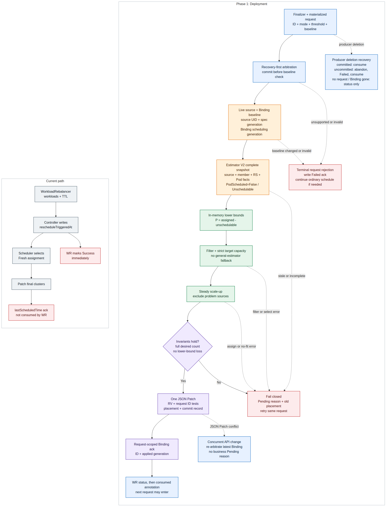

# Day 40：PR #7662 长期 Unschedulable 副本重调度 API 与开发基准

日期：2026-08-04

状态：开发前设计基线，**不是社区已批准 API**。本文以 Karmada `upstream/master@a5cf21eacf49373a6ebd57477ac49a52babdde49` 和 PR #7662 截至 2026-08-04 的公开讨论为证据。PR 当前 head `586f6fc3508e` 仍只有旧 proposal，没有运行时代码；后续评论中的 API 名称和 selector 路线均未写回 proposal，也未获得最终确认。

> 本文分析的是 #7662 的副本级按需重调度：用户显式触发后，以成员集群中长期 `PodScheduled=False/Unschedulable` 的数量为减量依据，只调整对应数量的 Deployment placement。它与 Day 39 的“未启动 Job 整任务重入队”是两套合同，不能互相代替。

## 先说人话

先看一个 10 副本 Deployment：

| member cluster | Binding 已分配 | member 内实际情况 |
| --- | ---: | --- |
| `member1` | 6 | 4 个正常，2 个 Pod 长期找不到 Node |
| `member2` | 4 | 4 个正常 |

这个 feature 想做的不是“重新调度整个 Deployment”，也不是“保证在线无损迁移”，而是一次很窄的动作：

```text
用户创建 WorkloadRebalancer
  -> scheduler-estimator 证明 member1 有 2 个长期 Unschedulable Pod
  -> member1 的保留基线变为 4，member2 的保留基线仍为 4
  -> karmada-scheduler 只给数量为 2 的缺口重新找集群
  -> 成功后一次性把完整结果写回 Binding
```

我的一期建议是最终形成 `member1=4, member2=6`，但在整个计算成功之前，API Server 中始终保留旧的 `6+4`。不能先把 Binding 写成 `4+4` 再等待 scheduler 补 2；后一段失败时会把一次“重调度请求”变成真实缩容。

这项功能真正需要补齐的不是一个布尔字段，而是五份代码合同：

1. **请求合同**：用户到底要求 Full 全量重算，还是只处理长期 Unschedulable 副本。
2. **观测合同**：哪些 Pod 属于当前 workload、当前 revision，什么条件才算长期 Unschedulable。
3. **调度合同**：怎样把问题副本变成缺口，同时把其余 placement 当作不能降低的下界。
4. **提交合同**：谁能写 `spec.clusters`，如何避免中间态和并发覆盖。
5. **完成合同**：`Successful` 是请求写入、scheduler 已处理，还是 workload 已 Ready。

本文推荐的完成语义是：

> `WorkloadRebalancer.status.observedWorkloads[].result=Successful` 只表示 scheduler 已消费这次请求并提交最终 placement；不等待新 Pod Ready，更不承诺迁移过程无可用性下降。

## 结论先行

- **一期只给 partial mode 做 Deployment 端到端闭环**：`ResourceBinding + apps/v1 Deployment + Divided/Aggregated 或 Divided/Weighted(non-empty DynamicWeight)`，复用现有 Deployment owner-chain，并新增具备 source freshness 合同的 estimator V2 RPC。legacy Full 与 built-in typed Full 都走通用 Fresh 路径，不读取 Deployment 或调用 V2；custom scheduler 只保留 legacy Full。
- **工作名使用 `mode: UnschedulableReplicas`**：它准确描述 action signal；`PreserveAvailableReplicas` 和 `PreserveScheduled` 都会承诺代码实际没有证明的集合。最终公开名字必须由 #7662 review 确认。
- **threshold 必须进入持久请求合同**：scheduler 目前没有 Descheduler 的 `--unschedulable-threshold` 配置；不能让相同 API 因进程默认值不同而改变含义。
- **scheduler 是本次按需事务的唯一提交者**：WorkloadRebalancer controller 只 patch 结构化请求（typed request）；scheduler 调 estimator、构造内存基线、校验不变量并一次写回最终 `spec.clusters`。周期性 Descheduler 也是 placement writer，所以两者的仲裁仍是开发前停止条件。
- **一期需要新增 estimator V2 RPC**：现有 request 只有 workload 名称和 threshold，不能证明 member 看到的是同一个源对象、同一代模板，也不能区分 current ReplicaSet 尚未进入缓存和真实 `U=0`。V2 必须携带源 UID、代际和期望副本数；旧 estimator 返回 `Unimplemented`，请求保持 Pending。
- **selector 不是一期解法**：selector 只能找到“标签匹配”的 Pod，不能证明 owner、当前 rollout revision 或多组件归属。
- **不能直接调用当前 `dynamicScaleUp` 就算完成**：必须先解决 Fresh/Steady、保留集群固定、问题来源集群本轮不再接收缺口、无容量时失败即保持旧状态四层逻辑。
- **typed request 必须有 `requestID` 和专属回执**：`lastScheduledTime` 会被普通调度更新，不能证明“就是这次请求完成”。
- **placement 与 commit record 必须同一次提交**：最终 clusters 和内部 `requestID + requestDigest + committedGeneration + placementDigest` 在带 resourceVersion/requestID `test` 的 JSON Patch 中写入；status 失败后按 record 补回执，不能重新搬一次、命中复用 ID 或误确认后续 generation。

## 公开讨论中实际存在三套语义

| 时间与证据 | 方案 | 当前强度 |
| --- | --- | --- |
| [PR 当前 720 行 proposal](https://github.com/karmada-io/karmada/blob/586f6fc3508eb0a504223898c0329a4bb8b4c57c/docs%2Fproposals%2Fscheduling%2F%20extend-workload-rebalancer%2FREADME.md) | `Full`、`PreserveReady`、`SafeMigration`、strategy framework、phase/progress/cancel/timeout | 仍是 current diff，但后续 review 已要求收窄 |
| [2026-07-27 作者回复](https://github.com/karmada-io/karmada/pull/7662#issuecomment-5092574880) | 移除迁移框架；提出 `Full/PreserveScheduled`；成功表示 scheduler handled | 评论反提案，未写回 proposal，也没有解释已 assigned 但 member Pending 的缺口来源 |
| [2026-07-30 selector 评论](https://github.com/karmada-io/karmada/pull/7662#issuecomment-5126046690) | `GetComponents.selector -> estimator -> dynamicScaleUp`，API 又写回 `PreserveAvailableReplicas` | 机制建议，无后续确认；owner、revision、多组件、completion 和版本兼容仍未定义 |

因此 Day 40 不把任何一条评论写成“最终 API 共识”。本文只把最新用户故事转成可评审、可测试的开发基准，并把需要 maintainer 拍板的点单列为 stop gate。

## 当前代码链路与真实断点



- [可编辑 Mermaid 源](day40-pr7662-unschedulable-replica-rescheduling-flow.mmd)
- canonical source：上述 `.mmd`；PNG 由 repo-local `project-mermaid` 流程调用 `@mermaid-js/mermaid-cli@11.16.0` 生成。

### 1. WorkloadRebalancer 只能表达“现在 Full 重调度”

当前 `WorkloadRebalancerSpec` 只有 `workloads` 和 TTL，没有 behavior。controller 使用对象的 `creationTimestamp` 作为稳定 trigger，写到 Binding 的 `spec.rescheduleTriggeredAt`。

源码证据：

- `pkg/apis/apps/v1alpha1/workloadrebalancer_types.go:39-68`
- `pkg/controllers/workloadrebalancer/workloadrebalancer_controller.go:189-245`
- `pkg/apis/work/v1alpha2/binding_types.go:151-159`

Binding API 对 legacy timestamp 的公开说明就是“complete recalculation without referring to last scheduling results”。它只有时间，没有 mode、threshold 或 request identity。

### 2. 当前 controller 把“投递成功”误写成“执行成功”

RB/CRB `Update` 成功后，controller 立即在 `workloadrebalancer_controller.go:220,238` 写 `RebalanceSuccessful`；`retryNum=0` 又会立即设置 `finishTime`。它没有 watch Binding，也不读：

- `status.conditions[type=Scheduled]`
- `status.schedulerObservedGeneration`
- `status.lastScheduledTime`

这些字段证明 scheduler 最近成功完成过一次调度：`pkg/scheduler/scheduler.go:1010-1022` 只有 `Scheduled=True` 才更新 observed generation 和 `lastScheduledTime`。但它们不是某次 typed reschedule 的专属回执：请求之后发生的普通 scale、policy update 或 cluster change 也会刷新同一个时间。

### 3. 当前显式请求必定进入 Fresh，不会进入 dynamicScaleUp

`pkg/scheduler/core/assignment.go:114-122` 把 pending `rescheduleTriggeredAt` 映射为 `assignmentMode=Fresh`；随后 `assignment.go:213-223` 直接执行 `dynamicFreshScale`。

而 `dynamicScaleUp` 只在 Steady 且 `assigned < desired` 时调用：

```go
state.targetReplicas = state.spec.Replicas - state.assignedReplicas
```

源码：`pkg/scheduler/core/division_algorithm.go:121-135`。

在示例中 Binding 已经写了 `6+4=10`，即使 member1 有 2 个 Pod 长期 Pending，Karmada 层的 deficit 仍然是 0。最新评论中的“get 2 then reuse dynamicScaleUp”中间至少缺了：

1. 把 member1 的内存基线从 6 调成 4；
2. 让新 behavior 进入 Steady 而不是 Fresh；
3. 让被释放的 2 不再投回同一个问题来源集群；
4. 最终结果不满足时不写任何中间 placement。

### 4. estimator 已有 Deployment 观测骨架，但还不是完整的失败保持原状

当前 RPC request 已包含：

```text
cluster + resource(apiVersion/kind/namespace/name) + unschedulableThreshold
```

response 只有：

```text
int32 unschedulableReplicas
```

源码：

- `pkg/estimator/pb/estimator.proto:227-247`
- `pkg/estimator/client/interface.go:100-103`
- `pkg/estimator/client/accurate.go:79-88,226-251`
- `pkg/estimator/server/server.go:293-316`

server 判断一个 Pod eligible 的条件非常窄：

```text
PodScheduled == False
and Reason == Unschedulable
and LastTransitionTime + threshold < now
```

源码：`pkg/estimator/server/replica/replica.go:72-75`。

它不会把 `ImagePullBackOff`、readiness 失败、应用启动失败、已调度但未 Ready 等问题误当成可跨集群修复的 signal。

但现有接口不能直接作为一次性 API 的完成证据：

- `GetNewReplicaSet` 明确可能返回 `nil`；当前 `listDeploymentPods` 会把这个 `nil` 放进列表，最终得到空 Pod 集并以 `U=0` 成功返回；
- gRPC request 没有源 UID、源 generation 或期望 assigned replicas，同名重建、member Work 尚未更新、Deployment/ReplicaSet/Pod 三个 informer 进度不一致时，都可能统计旧快照；
- 对周期性 Descheduler 来说，下轮再观察可以容忍短暂低估；对一次性 WorkloadRebalancer 来说，错误的 `U=0` 会被永久确认成“已完成”。

因此一期不能再宣称“现有 RPC 原样复用”。需要新增独立的 `GetUnschedulableReplicasV2`：旧 server 对新方法明确返回 `Unimplemented`，不会静默忽略新字段。V2 request 至少携带：

```text
cluster + resource GVK/namespace/name
+ expected resource-template UID
+ expected resource-template generation
+ expected assigned replicas on this cluster
+ unschedulable threshold
```

member workload 已有 `resourcetemplate.karmada.io/uid` 与 `resourcetemplate.karmada.io/generation` 注解可供核对。estimator 还必须确认“revision topology 已稳定”：member Deployment 的 `status.observedGeneration==metadata.generation`、`spec.replicas==expectedAssignedReplicas`、current ReplicaSet 存在且 desired replicas 等于 expected、没有仍保有正副本的 active old ReplicaSet、current ReplicaSet 的非终态 owned Pod 数等于 expected。任一条件未满足都返回可重试的 `ObservationNotReady`，不能返回 0。

这里**不要求 Deployment Complete，也不要求 Available/Ready 达到 desired**；否则长期 Unschedulable 的目标场景本身永远无法通过前置条件。

源码证据：`pkg/controllers/ctrlutil/work.go:41-46` 写源 UID 注解，`pkg/controllers/binding/common.go:273-277` 写源 generation 注解；`pkg/util/lifted/deployment.go:141-164` 明确允许 current ReplicaSet 返回 `nil`。

> 注释：这里要求的是“这次计数快照完整”，不是要求系统永远没有竞态。scheduler 后续仍要用 Binding `resourceVersion` 前置条件提交；观测后若 Binding 变化，就丢弃结果并重新观测。

### 5. Deployment 路径不只是 selector

当前 owner-chain 是：

```text
member Deployment
  -> label selector 初筛 ReplicaSet
  -> ControllerRef UID 验证归属 Deployment
  -> PodTemplate 匹配 current/new ReplicaSet
  -> label selector 初筛 Pod
  -> ControllerRef UID 验证归属该 ReplicaSet
  -> 统计长期 Unschedulable Pod
```

源码：

- Deployment -> owned ReplicaSet：`pkg/util/lifted/deployment.go:60-79`
- current revision：`pkg/util/lifted/deployment.go:141-164`
- ReplicaSet -> owned Pod：`pkg/util/lifted/deployment.go:91-117`
- estimator dispatch：`pkg/estimator/server/replica/replica.go:42-68`

这条链同时证明 ownership 和 current revision，是一期应该保留的正确性资产；但只有再补上 source UID/generation、revision topology stability 与完整 Pod 数校验后，才能成为本 API 的观测合同。

## 五层开发合同

### 第一层：请求与兼容合同

请求必须同时回答：

- 触发时间是什么；
- 行为是 Full 还是只处理长期 Unschedulable；
- 多久才算“长期”；
- legacy 和 typed request 同时存在时谁生效；
- 同一个 WorkloadRebalancer 修改后是否代表新请求。

工作 API 建议如下。名字是 Day 40 推荐值，不代表社区已经确认。**用户输入与 Binding 执行请求使用不同类型**：前者允许省略 threshold 以使用默认值，后者必须保存 scheduler 执行所需的全部具体参数。

```go
// pkg/apis/work/v1alpha2/binding_types.go
type RescheduleMode string

const (
    RescheduleModeFull                   RescheduleMode = "Full"
    RescheduleModeUnschedulableReplicas RescheduleMode = "UnschedulableReplicas"
)

type UnschedulableReplicasExecution struct {
    // Required and already defaulted by the WorkloadRebalancer controller.
    // +kubebuilder:validation:XValidation:rule="duration(self) > duration('0s')"
    UnschedulableThreshold metav1.Duration `json:"unschedulableThreshold"`

    // Identity of the control-plane resource template expected on the member.
    // +kubebuilder:validation:MinLength=1
    ResourceUID types.UID `json:"resourceUID"`

    // +kubebuilder:validation:Minimum=1
    ResourceGeneration int64 `json:"resourceGeneration"`
}

// +kubebuilder:validation:XValidation:rule="self.mode == 'Full' ? !has(self.unschedulableReplicas) : has(self.unschedulableReplicas)"
type RescheduleRequest struct {
    // Stable identity of this action. WorkloadRebalancer uses its UID.
    // +kubebuilder:validation:MinLength=1
    RequestID string `json:"requestID"`

    TriggeredAt metav1.Time `json:"triggeredAt"`

    // Binding generation that was fully scheduled before this request was written.
    // +kubebuilder:validation:Minimum=1
    BaselineGeneration int64 `json:"baselineGeneration"`

    // +kubebuilder:validation:Enum=Full;UnschedulableReplicas
    Mode RescheduleMode `json:"mode"`

    // Required only when mode is UnschedulableReplicas.
    // +optional
    UnschedulableReplicas *UnschedulableReplicasExecution `json:"unschedulableReplicas,omitempty"`
}

type ResourceBindingSpec struct {
    // ...
    Reschedule *RescheduleRequest `json:"reschedule,omitempty"`

    // Deprecated: use Reschedule. Legacy always means Full.
    RescheduleTriggeredAt *metav1.Time `json:"rescheduleTriggeredAt,omitempty"`
}
```

Partial preflight 还需要一个**源 spec freshness token**。现有 `Binding.spec.resource.resourceVersion` 不能承担这个职责：源 Deployment 的 status 聚合也会推进 live RV，而 detector 的 `SpecificationChanged` 明确忽略 status、managedFields 和 resourceVersion-only 变化，所以健康对象的两个 RV 本来就可能长期不同。不能要求它们强相等。

一期应在 storage `work/v1alpha2.ObjectReference` 增加 source generation，并由 detector 在创建/更新 Binding 时写入；v1alpha1 不做不完整 mirror，其写保护见后文版本门：

```go
type ObjectReference struct {
    // existing identity fields...

    // Generation of the source object spec observed by the detector.
    // +optional
    Generation int64 `json:"generation,omitempty"`
}
```

partial controller/scheduler 要求 `Binding.spec.resource.uid == live Deployment UID` 且 `Binding.spec.resource.generation == live Deployment metadata.generation > 0`，再把这两个值物化进 request。已有 Binding 的 generation 为 0 时不得猜测，也不能依赖 informer 自动 resync（controller-manager 的 `--resync-period` 默认可为 0）：升级后的 detector 需要一个有界、可重试的 startup backfill，只列出 Phase 1 eligible、generation=0 的 Deployment ResourceBinding，重新读取 source 并复用正常 desired-Binding 构造/更新路径，把 replicas 等所有 spec 派生字段与 generation 一起刷新。普通 scheduler 观察这次 Binding 更新后，才允许 partial request。`Binding.metadata.resourceVersion` 仍用于 JSON Patch 并发前置条件，但不再被误当成 source spec 版本。

源码依据：`pkg/detector/detector.go:340-342` 只在 `SpecificationChanged` 时处理更新；`pkg/util/eventfilter/eventfilter.go:59-66` 会移除 status/resourceVersion 后比较；`pkg/detector/detector.go:846,918` 当前只把 UID/RV 写入 Binding reference。

Binding status 只增加一张与 request ID 对应的执行状态，不增加旧 proposal 那套多阶段 progress/cancel framework。`Pending` 用于把可重试原因绑定到本 request，`Succeeded/Failed` 才是终态回执：

```go
type RescheduleResult string

const (
    ReschedulePending   RescheduleResult = "Pending"
    RescheduleSucceeded RescheduleResult = "Succeeded"
    RescheduleFailed    RescheduleResult = "Failed"
)

type RescheduleStatus struct {
    RequestID string `json:"requestID"`
    TriggeredAt metav1.Time `json:"triggeredAt"`
    // +kubebuilder:validation:Enum=Pending;Succeeded;Failed
    Result RescheduleResult `json:"result"`
    AppliedGeneration int64 `json:"appliedGeneration,omitempty"`
    Reason RescheduleReason `json:"reason,omitempty"`
}

type RescheduleReason string

const (
    // Retryable reasons used with Pending.
    RescheduleReasonEstimatorUnavailable      RescheduleReason = "EstimatorUnavailable"
    RescheduleReasonObservationNotReady       RescheduleReason = "ObservationNotReady"
    RescheduleReasonObservationInconsistent   RescheduleReason = "ObservationInconsistent"
    RescheduleReasonTargetCapacityUnavailable RescheduleReason = "TargetCapacityUnavailable"
    RescheduleReasonNoClusterFit               RescheduleReason = "NoClusterFitForReschedule"
    RescheduleReasonSchedulerError             RescheduleReason = "SchedulerError"
    // Terminal reasons used with Failed.
    RescheduleReasonUnsupportedWorkload  RescheduleReason = "UnsupportedWorkload"
    RescheduleReasonUnsupportedPlacement RescheduleReason = "UnsupportedPlacement"
    RescheduleReasonUnsupportedScheduler RescheduleReason = "UnsupportedScheduler"
    RescheduleReasonInvalidRequest       RescheduleReason = "InvalidRequest"
    RescheduleReasonInvalidBaseline      RescheduleReason = "InvalidBaseline"
    RescheduleReasonBaselineChanged      RescheduleReason = "BaselineChanged"
    RescheduleReasonConflictingOperation RescheduleReason = "ConflictingOperation"
    RescheduleReasonRequestAbandoned     RescheduleReason = "RequestAbandoned"
)

type ResourceBindingStatus struct {
    // existing fields...
    ObservedReschedule *RescheduleStatus `json:"observedReschedule,omitempty"`
}
```

WorkloadRebalancer controller 使用对象 UID 作为 `requestID`。同一个 WR 可以批量指向多个 Binding；每个 Binding 内仍只有一个相同 ID 的 action，不会相互混淆。直接写 Binding API 的调用者也必须提供稳定唯一 ID。

`ResourceBindingSpec` 同时服务 RB/CRB，所以 schema 会同时出现；**一期运行时仍明确拒绝 CRB 的部分副本模式**，因为 Deployment 是 namespace-scoped workload。schema 复用不等于支持矩阵相同。

Apps API 表达用户输入，允许 threshold 为空；controller 必须先补默认值，再生成上面的 Binding 执行请求：

```go
// pkg/apis/apps/v1alpha1/workloadrebalancer_types.go
type WorkloadRebalancerSpec struct {
    Workloads []ObjectReference `json:"workloads"`

    // Nil preserves the current Full behavior.
    // +optional
    Reschedule *WorkloadRebalancerReschedule `json:"reschedule,omitempty"`

    TTLSecondsAfterFinished *int32 `json:"ttlSecondsAfterFinished,omitempty"`
}

type WorkloadRebalancerRescheduleMode string

const (
    WorkloadRebalancerRescheduleModeFull WorkloadRebalancerRescheduleMode = "Full"
    WorkloadRebalancerRescheduleModeUnschedulableReplicas WorkloadRebalancerRescheduleMode = "UnschedulableReplicas"
)

// +kubebuilder:validation:XValidation:rule="self.mode == 'Full' ? !has(self.unschedulableThreshold) : true"
// +kubebuilder:validation:XValidation:rule="!has(self.unschedulableThreshold) || duration(self.unschedulableThreshold) > duration('0s')"
type WorkloadRebalancerReschedule struct {
    // Keep the user-facing apps API independent from the materialized work API.
    // +kubebuilder:validation:Enum=Full;UnschedulableReplicas
    Mode WorkloadRebalancerRescheduleMode `json:"mode"`

    // Valid only for UnschedulableReplicas; nil asks the controller to apply
    // the documented API default.
    // +optional
    UnschedulableThreshold *metav1.Duration `json:"unschedulableThreshold,omitempty"`
}
```

Apps input 的 CEL 规定 `Full` 禁止携带 threshold，partial 的非空 threshold 必须大于 0。Binding execution 的 `UnschedulableReplicas` 必须携带大于 0 的 threshold、非空 UID 和大于 0 的 generation。`RescheduleStatus` 还应以 CEL 规定：Pending 只能使用 retryable reason 且没有 applied generation；Succeeded 必须有正 `appliedGeneration` 且没有 reason；Failed 必须使用 terminal reason 且没有 applied generation。typed Full 的 quota、plugin 或其他 framework/internal retryable error 统一投影为 request reason `SchedulerError`，具体错误仍保留在通用 Scheduled condition、Event 和日志中，避免把不稳定错误字符串变成 API 枚举。若生成器不能对 `metav1.Duration` 或 status union 产生预期 schema，就在 ResourceBinding/WorkloadRebalancer validating webhook 中实现同一规则并加入邻近测试，不能只依赖 controller runtime check。

建议 YAML：

```yaml
apiVersion: apps.karmada.io/v1alpha1
kind: WorkloadRebalancer
metadata:
  name: retry-long-unschedulable-replicas
spec:
  workloads:
    - apiVersion: apps/v1
      kind: Deployment
      namespace: default
      name: inference-worker
  reschedule:
    mode: UnschedulableReplicas
    unschedulableThreshold: 5m
```

这里的 `5m` 与当前 Descheduler 默认值一致，但“是否把 5 分钟定为 API default”必须由社区确认。关键要求是 controller 把最终 threshold、源 UID、源 generation 和 baseline Binding generation 持久化到 Binding，scheduler 和 estimator 不再靠各自本地默认值或对象名称猜。

准入规则必须拒绝空 `requestID`、非法 mode、负 threshold、`Full` 携带 `unschedulableThreshold`，以及 `UnschedulableReplicas` 执行请求缺少 threshold/UID/generation。`0` 表示立即判定还是非法值属于开发前 stop gate；没有定论前不能让 Go 零值偷偷决定公开语义。

#### 为什么不推荐另外两个名字

| 候选 | 问题 |
| --- | --- |
| `preserveAvailableReplicas: true` | estimator 没有读取所有 unavailable 原因，也不证明所有 available 身份不会被 Deployment controller 在缩副本时替换 |
| `mode: PreserveScheduled` | 这 10 个副本都已经被 Karmada 写入 Binding；member 内 Pending 并不等于 Karmada 层“未 scheduled” |
| `mode: UnschedulableReplicas` | 直接命名 eligibility signal；不会把 Ready、available 或 Pod 身份保护写成 API 保证 |

#### 一次性对象与不可变性

当前 trigger 永远取 WorkloadRebalancer 的 `creationTimestamp`，成功 workload 后续会被跳过。若允许把 `mode` 从 Full 改成 partial，API update 能成功，但时间戳没有变化，scheduler 可能永远看不到新 action。

因此一期建议：

- `spec.reschedule=nil` 的 legacy Full 保持现有 add/remove workload 行为，不收紧旧 API；当前 controller 明确支持 spec list 变化，不能为新 feature 破坏它；
- 只有创建时显式设置 typed `spec.reschedule` 的新路径，才对 `spec.workloads` 和 action inputs 使用条件不可变校验；
- typed 请求需要另一种 behavior/target 时新建 WorkloadRebalancer；
- `ttlSecondsAfterFinished` 可保持现有生命周期语义；
- 不把一个 typed CR 当作可反复编辑的命令队列。

源码证据：`pkg/controllers/workloadrebalancer/workloadrebalancer_controller.go:115-149` 会把 spec 新增/删除 workload 同步到 status，说明 legacy 可变性是现有行为而不是偶然实现。

#### 新旧 request 仲裁

新增 `binding_types_helper.go`，controller、scheduler trigger、affinity cursor 和 assignment 统一调用同一个 helper：

scheduler 的判定优先序固定为：同 request 的 abandoned -> matching commit recovery -> observed terminal/Pending -> initial baseline。不能因为先看到 `ObservedReschedule=Pending` 就跳过已经成功的 commit record。

| Binding 状态 | 生效请求（effective request） |
| --- | --- |
| 只有 legacy timestamp | `Full` |
| 只有 typed request | typed behavior |
| 两者都有，typed 时间更新 | typed |
| 两者都有，legacy 时间更新 | legacy `Full` |
| timestamp 相同 | typed 胜出，避免 deprecated Full 静默覆盖新 behavior |
| typed requestID 匹配 observed 且 result=`Pending` | request 仍有效，只允许同一 request 的 retry 分支 |
| typed requestID 匹配 observed 且 result=`Succeeded/Failed` | scheduler 不再执行；producer 投影终态并完成 consume |
| legacy trigger 不晚于 `lastScheduledTime` | legacy 已消费，保持旧兼容语义 |
| 写请求前 `Scheduled!=True` 或 `schedulerObservedGeneration!=metadata.generation` | baseline 尚未被 scheduler 确认，WR 保持 Pending，不写请求 |
| typed requestID/requestDigest 与 commit record 同时匹配，status 未匹配 | 必须最先处理：placement 已提交，按 commit record 修复 status，不再次调用 estimator |
| typed `requestID == reschedule-abandoned` | producer 删除已在提交前赢得 CAS；scheduler 立即忽略该请求，finalizer controller 负责写 Failed/consume |
| 未 applied，且 `metadata.generation!=baselineGeneration+1` | 请求之后又有 spec 并发变化，拒绝旧 request，并在同一 reconcile 继续普通调度 |

WorkloadRebalancer controller 对 `spec.reschedule!=nil` 只写 typed field，不 dual-write legacy；`nil` 仍走现有 legacy Full。否则旧 scheduler 会把 partial 请求误执行成 Full。

一个 Binding 同时只允许一个未消费的 typed request。已有不同 requestID 且尚未完成下面三步时，新 WR 保持 Pending 并报告 `RequestConflict`：

```text
scheduler 写 observedReschedule(requestID)
-> producer 把结果持久化到自己的状态
-> producer 写 metadata annotation:
   resourcebinding.karmada.io/reschedule-consumed=requestID
```

ResourceBinding validating webhook 必须拒绝任何 writer 修改/删除未消费 request，也拒绝在 typed request 未消费时更新 legacy trigger。只有下面任一完整终态成立，才允许下一请求替换它：

```text
(observedReschedule.requestID == old requestID
 && observedReschedule.result in [Succeeded, Failed]
 && consumed == old requestID)
or
(abandoned == old requestID
 && observedReschedule.requestID == old requestID
 && observedReschedule.result == Failed
 && observedReschedule.reason == RequestAbandoned
 && consumed == old requestID)
```

WorkloadRebalancer controller 必须先成功写自身 `ObservedWorkload`，再写 consumed annotation，所有 target 都完成消费确认后才能设置 `finishTime` 或执行 TTL 删除。direct Binding writer 也必须按同一协议消费回执。

新增/替换 request 的 admission 还必须做两项隔离：把 old/new `spec.reschedule` 暂时置空后，其余 Binding spec 必须 DeepEqual，禁止 direct writer 在同一次 Update 中夹带 scale/policy/cluster 修改来伪造 `baseline+1`；新 requestID 不得等于当前保留的 commit、observed ack 或 abandoned ID，即使旧请求已经 consumed。requestID 是不可复用的 opaque UID，direct writer 应生成 UUID，不能用时间戳或业务名称循环复用。

这个额外确认不能省。否则 A 的 Binding ack 已写、WR-A 尚未轮询时，B 可能快速覆盖 request/status，A 的唯一成功证据就永久丢失。

手动删除 WorkloadRebalancer 也必须闭环，不能留下永久占槽的 request：

1. typed WR 在写第一个 Binding request **之前**添加 `apps.karmada.io/reschedule-protection` finalizer；
2. 删除期间若 commit/ack 已存在，controller 先持久化可得结果、写 consumed annotation，再移除 finalizer；
3. 若 request 尚未 committed，controller 先用带 RV/requestID 前置条件的 Patch **只写** `resourcebinding.karmada.io/reschedule-abandoned=requestID`；scheduler 每轮 recovery-first arbitration 都先跳过已 abandoned 的 request；
4. abandon 与 scheduler commit 竞争时只有一个 RV Patch 能成功：abandon 先赢则不再执行 placement，commit 先赢则按已提交结果消费，绝不回滚 placement；
5. abandon 赢后，controller 用**一次带当前 resourceVersion 的 status Update**同时写 `observedReschedule=Failed/RequestAbandoned` 和通用状态；由本 WR 创建且 baseline 仍为 `baseline+1` 的请求可恢复 `Scheduled=True`、observed generation 对齐但不刷新 `lastScheduledTime`，否则保持 False 并触发普通调度。status 成功后重新读取，确认 requestID、abandoned、Failed reason 和 RV 仍匹配，再以 RV/requestID/status tests 写 consumed；不能先解锁再补 status；
6. finalizer 按 target 收敛，不要求每个 target 都曾写过 request。允许移除的四种 durable 终态是：committed-and-consumed、abandoned/Failed-and-consumed、request 从未写入且 WR status 已记录终态原因、Binding 已删除且 WR status 已记录现有 `ReferencedBindingNotFound`（message 可注明删除发生在 Pending 后）；
7. 多 target WR 的每个 target 都进入上述四类之一后，正常完成可设置 `finishTime`，删除流程才移除 finalizer。NotFound/Unsupported 的 preflight target 和 request Pending 后 Binding 被删除都不能永久卡住对象。

这只是 producer 删除时的孤儿清理，不提供任意时点的公开 cancel/rollback 语义。管理员强制移除 finalizer 会绕过正常保证；此时必须通过同一带前置条件的 orphan-abandon 管理路径解锁 Binding，不能直接覆盖 request。

#### 滚动升级风险

扩展现有 WorkloadRebalancer 有两个危险的版本窗口：旧 controller-manager 的 Go 类型不认识 `spec.reschedule`，会按当前逻辑写 legacy `rescheduleTriggeredAt`，把 partial 降级为 Full；旧 scheduler 不认识 Binding typed request，却仍会被 request 引起的 generation 变化唤醒，并可能把 `schedulerObservedGeneration` 提前推进到 `baseline+1`，使新 scheduler 接管后误判合法请求为 `BaselineChanged`。

因此发布方案必须二选一：

1. **现有 Kind + 严格升级门**：增加默认关闭的 Alpha gate（建议名 `WorkloadRebalancerTypedReschedule`），由 WR controller、scheduler 和 admission 共同识别。先以 gate disabled 部署所有新实例及会写 Binding spec/status 的 controller，再更新 CRD/admission；detector 完成 source generation startup backfill，普通 scheduler 观察这些 Binding 后，确认旧实例全部退出才统一启用。gate 关闭时 admission 直接拒绝 typed request，旧 scheduler 尚存期间不能创建。
2. **新 request Kind**：旧 controller 完全不 watch，遇到旧版本会保持未执行，而不会误降级成 Full；代价是增加 API surface，需要社区重新评估是否值得。

若继续沿用现有 Kind，Helm/operator upgrade order、feature enable 时机、N-1 WR controller **及 N-1 scheduler** skew 测试必须进入交付，不得只写一句“新 controller 不 dual-write”。

#### typed Binding 写操作只允许 `work/v1alpha2`

`ResourceBinding`/`ClusterResourceBinding` 的 storage version 是 `work/v1alpha2`，但 `work/v1alpha1` 仍然 `served: true`。这里的问题不只是 v1alpha1 缺 typed request：现有 v1alpha1 `ObjectReference` 没有 UID，`ResourceBindingSpec` 也没有 v1alpha2 的 Placement、SchedulerName 等 baseline-critical 字段，手写 conversion 无法做完整 hub round-trip。只 mirror Generation/request/status 仍会让 v1alpha1 全对象 Update 清空现代字段；AdmissionReview 的 oldObject 也是请求版本，简单比较 old/new 看不到已经在 conversion 中丢失的 hub 字段。

Phase 1 因此选择保守路线：

- `ObjectReference.Generation`、typed request/status 只新增到 storage `work/v1alpha2`；Apps v1alpha1 的 WorkloadRebalancer controller 始终用 work v1alpha2 client 写 Binding；
- Alpha gate 关闭时不开放 typed request；gate 开启后，admission 根据 `AdmissionRequest.RequestResource.Version` 拒绝所有经 `work/v1alpha1` 发起的 RB/CRB spec 或 status `UPDATE/PATCH`，GET/LIST 不受影响；
- 新增/更新 typed request 必须经 v1alpha2；eligible Deployment RB 的 `spec.resource.uid` 和 generation 必须非空/正数，generation 一旦 backfill 为非零不得回退为 0；
- 发布前确认所有内置 Binding writer 已切到 v1alpha2。真正不含新字段的 frozen v1alpha1 client 必须证明写操作被拒绝，而不是证明一个并不存在的完整 round-trip。

这是 opt-in Alpha gate 的兼容代价，必须写进发布说明。若社区要求 v1alpha1 在 gate 开启后仍可写，替代方案不是再补两个字段，而是 mirror UID、全部 baseline-critical spec/status 和 typed state，并对完整 Binding 做 frozen-client/hub round-trip；该方案工作量和风险都更高，需要独立 API 决议。停止 serving v1alpha1 仍属于单独废弃流程。

源码证据：`pkg/apis/work/v1alpha2/binding_types.go:52,190-215,543` 标记 storage version 并包含 UID/现代 spec；`pkg/apis/work/v1alpha1/binding_types.go:53-70` 的 reference 没有 UID；`pkg/apis/work/v1alpha1/binding_types_conversion.go:59-145` 只转换旧字段。

### 第二层：Pod 身份与 signal 合同

一期请求当前 assigned 的每个正副本 member cluster，由 estimator V2 返回 `U_i`。计数前先验证：

```text
member resource-template UID == request.resourceUID
member resource-template generation == request.resourceGeneration
member Deployment observed 当前 generation，且 spec.replicas == expected assigned
current ReplicaSet 存在
current ReplicaSet desired/owned、非终态 Pod 数 == expected assigned replicas
没有仍保有正副本的 active old ReplicaSet
```

随后返回值还必须满足：

```text
0 <= U_i <= Binding assigned replicas on cluster i
```

任一 cluster RPC 出错、旧 server 返回 `Unimplemented`、source 身份/代际不匹配、快照未完整、没有 estimator client、返回负数或越界值时，整个请求都必须失败并保持原状。`U<0` 或 `U>A` 归为可重试的 `ObservationInconsistent`，因为重建同一个 WR 不能修复 estimator/cache 不一致；它保持 Pending，等待观测恢复或管理员处理：

- 不把未知解释成 0；
- 不消费 trigger；
- 不修改 `spec.clusters`；
- Binding 写 `observedReschedule(requestID, Pending, reason)`，并用通用 `Scheduled=False` condition 记录同一诊断后进入重试；Pending 不是可消费的终态回执。

不能直接复用 `pkg/descheduler/core/helper.go:65-92` 的失败策略。它会在 estimator error 后继续，最后把未知值重置为 0；周期性 Descheduler 可以选择下轮再看，但一次性 API 若因此确认成功，会把“观测失败”误写成“没有问题副本”。现有 estimator 对负 threshold 会直接改成 0，V2 必须改为显式校验，不得悄悄纠正非法输入。

### 第三层：保留下界与 scheduler 算法合同

不要把这里理解成复杂资源向量。代码只需要三个每集群副本数：

在计算前必须先验证 `spec.clusters` 的形状：cluster name 非空且唯一、replicas 非负，并使用 `int64` 求和后确认等于 `spec.replicas`。当前 `TargetCluster.Replicas` 没有 Minimum，`AssignedReplicasForCluster` 遇到重复 name 又只返回第一项（`pkg/apis/work/v1alpha2/binding_types_helper.go:123-131`）；只检查 int32 总和会把不合法 baseline 带进减法。

```text
A_i = 当前 Binding 已分配数
U_i = estimator 证明长期 Unschedulable 的数量
P_i = A_i - U_i，必须保留的 placement 下界
```

示例：

| cluster | `A` 当前分配 | `U` 问题副本 | `P` 内存保留下界 | 推荐最终 `F` |
| --- | ---: | ---: | ---: | ---: |
| member1 | 6 | 2 | 4 | 4 |
| member2 | 4 | 0 | 4 | 6 |

最终结果必须同时满足：

```text
sum(F_i) == desired replicas
F_i >= P_i for every preserved cluster
F_i == P_i for every source cluster with U_i > 0 in this cycle
F_i - P_i <= verified allocatable delta on every target cluster
```

最后一条表示问题来源集群本轮不再接收刚释放的缺口。否则 scheduler 可能把 2 个副本再次投回 member1，API 看似成功但 placement 没变。

推荐在 scheduler 内建立窄的 `RescheduleContext`，包含保留下界（preserved lower bounds）和问题来源排除集（scale-up exclusions），并让 selection/assignment 显式消费。仅把 deep-copied `spec.Clusters` 改成 `P` 还不够：

- pending request 若仍被识别成 Fresh，`dynamicScaleUp` 不会运行；
- `SelectClusters` 可能丢掉一个 preserved cluster；
- `dynamicScaleUp` 默认优先已有 scheduled cluster，可能把缺口放回 source；
- no-fit 路径不能沿用“清空旧结果”的普通调度行为。

所以“复用 dynamicScaleUp”的准确含义是复用**补缺口算法**，不是原封不动复用整条普通 schedule path。

#### `SelectClusters` 的隐藏阻塞

当前代码先按完整 `spec.replicas`、score 和 spread 选出一套 clusters，之后 `AssignReplicas` 才处理旧分配。`buildScheduledClusters` 又只保留仍在 selected set 内的旧 cluster：`pkg/scheduler/core/assignment.go:125-142`。

这会产生两个方向相反的错误：

- 健康的旧 placement 没被本轮 select 选中，就会被当作新 deficit 一起搬走；
- 问题 source 已占满 `maxGroups` 时，真正的新目标 cluster 可能根本进不了 selected set。

部分副本模式因此需要两套集合，而不是给 `dynamicScaleUp` 多传一个数字：

```text
pinned baseline clusters = 必须保留 P_i 的现有集群
delta candidate clusters = 可以接收 released replicas 的新/健康集群
final clusters = pinned baseline union selected delta targets
```

filter 必须先确认每个 pinned cluster 仍符合当前 hard policy；selection 再用剩余 topology/group budget 选 delta target；最后对 union 校验 spread/maxGroups。若一期不准备修改这层 selection，支持矩阵必须进一步限制为：

```text
single ClusterAffinity
+ no SpreadConstraints
+ no OverflowAffinities
```

本文选择这个保守限制作为 Phase 1 可执行基线。Spread/多 affinity 不是永远不支持，而是需要一个单独的 pinned-selection 设计和测试扩展后再开放。

#### 目标容量也必须严格观测

source 的 `U_i` 可靠，不代表 target 一定放得下 delta。当前 `pkg/scheduler/core/util.go:57-105` 的 `calAvailableReplicas` 会在某个 estimator 报错后直接 `continue`；scheduler-estimator 失败时可能保留 general estimator 的集群总量结果，全部 estimator 都没有结果时甚至把 `MaxInt32` 改成 workload replicas。这个降级适合普通调度的可用性取舍，不能支撑本文“目标容量经过验证”的 API 保证。

部分副本 transaction 必须启用 strict accurate-capacity mode：所有可能接收 delta 的 candidate 都要成功调用已注册的 `scheduler-estimator.MaxAvailableReplicas`，不允许退回 general estimator，也不允许把缺失结果当作 workload replicas。任一 candidate 的 accurate result 缺失/超时，就把整个一次性请求保持 Pending；一期先接受保守的 all-or-nothing，后续若要“排除坏 candidate 后继续”，必须单独定义候选集合稳定性和测试。

### 第四层：单次事务提交、原子更新与并发合同

职责边界应固定为：

| 状态 | owner |
| --- | --- |
| 用户意图、批量 target、WR status/TTL | workload-rebalancer controller |
| 结构化请求持久合同 | Binding spec 的 `reschedule` 字段 |
| `spec.clusters` 最终 placement | karmada-scheduler |
| member Pod 是否长期 Unschedulable | scheduler-estimator |
| Work 创建/删除与 member 收敛 | binding controller，本 feature 不改 |
| scheduler 执行回执 | Binding status；仅 finalizer controller 可写 `Failed/RequestAbandoned` |

WorkloadRebalancer controller 必须用窄 Patch 只写 `spec.reschedule`，不能继续对整个旧 Binding 做 Update。scheduler 最终提交时要：

1. controller 写请求前确认 Binding baseline 已被 scheduler 观察并把该 generation 记为 `baselineGeneration`；只有 partial mode 额外获取 live Deployment，确认其 UID/spec generation 与 `Binding.spec.resource.uid/generation` 一致，并检查 Deployment 支持矩阵、`FullyApplied=True` 和完整副本数；typed `Full` 不读取 Deployment，继续支持现有通用 workload/RB/CRB 路径；
2. scheduler 每次重入先检查 abandoned/consumed 状态和内部 `resourcebinding.karmada.io/reschedule-commit`；已 abandoned 时跳过，requestID/requestDigest 都匹配 commit 时进入恢复分支，**不能先做 baseline generation 校验**；
3. 未 applied 时，scheduler 重新执行 mode 对应的 baseline/support 检查，并只接受 `metadata.generation==baselineGeneration+1`、`status.schedulerObservedGeneration==baselineGeneration` 的快照；首次执行要求 baseline Scheduled=True，重试要求同 requestID 的 Pending status，防止 direct writer 或任意旧 False condition 伪造 baseline；
4. 若 generation 已变化，旧 reschedule 终态 `BaselineChanged`，但同一 reconcile 必须继续按当前 spec 执行普通调度，或显式重新入队，不能吞掉 scale/policy change；
5. 从同一个 Binding resourceVersion 构造 observation 和结果；
6. 一次 patch 完整最终 `spec.clusters` 和内部 commit record；record 至少包含 `requestID`、materialized request 的 digest、预测并经响应核对的 `committedGeneration`、最终 clusters 的 canonical digest；
7. 使用 JSON Patch 的 `test /metadata/resourceVersion` 和 `test /spec/reschedule/requestID` 后再 replace clusters/add commit record，不能假设普通 merge patch 自动携带 RV 前置条件；
8. 冲突时重新读取；若仍是同一 baseline，则重新调用 estimator、重新计算，否则拒绝旧 request 并转普通调度；
9. 只有 placement + commit record patch 成功并核对响应后，才用一次带当前 resourceVersion 的 status Update 同时写 `observedReschedule(requestID, Succeeded, appliedGeneration)` 和允许更新的通用状态；写前必须确认 current requestID/requestDigest、commit 和未 abandoned；
10. status Update 冲突/失败后，恢复分支总能依据 commit record 补 request-scoped ack，不重新观测和搬副本；只有当前 generation 仍等于 `committedGeneration` 且 clusters digest 相同，才能在同次 status Update 中写通用 `Scheduled=True`、`schedulerObservedGeneration`、`lastScheduledTime`；否则只补本次请求回执，并让当前 generation 继续普通调度。

这是必要的幂等边界。Kubernetes 的 spec/metadata 主对象 patch 与 status subresource 不能组成一个原子事务；若没有 durable commit record，placement 已成功、status 失败的重试会再次看到 member 侧尚未收敛的旧 Unschedulable Pod，再扣一次 `U_i`。只记录 requestID 也不够：有副本变化时 generation 通常从 `baseline+1` 变为 `baseline+2`，`U=0` 的 no-op 则仍是 `baseline+1`；record 必须保存 request digest、实际提交代际和 placement digest，才能安全恢复并拒绝误用历史 ID。

commit record 是内部 annotation 的版本化 JSON，不是拼接字符串。Phase 1 固定 `version: 1`；`requestDigest` 是 materialized `RescheduleRequest` 标准 JSON 的 SHA-256 hex，`placementDigest` 是最终 `[]TargetCluster` 按实际 slice 顺序标准 JSON 编码后的 SHA-256 hex。恢复 helper 必须用同一编码重算；以后若要把 cluster 顺序视为无语义，先定义 API 级 canonicalization，不能让组件各自排序。

当前 `helper.GenMergePatch(old,new)` 只生成对象差异，相同的 resourceVersion 会被省略，不能直接充当前置条件：`pkg/util/helper/patch.go:30-49`。一期应新增专用 JSON Patch builder，并对 annotation JSON 使用标准序列化/解析；不要拼字符串，也不要复用没有 `test` 操作的普通 schedule patch。

还需要处理与周期性 Karmada Descheduler 的竞态。它当前也会修改 `spec.clusters`：`pkg/descheduler/descheduler.go:208-249`。开发前必须在以下两种方案中选一项：

- **推荐**：Descheduler 发现 Binding 有 pending typed reschedule 时跳过，由 scheduler 完成这次 on-demand transaction；
- **最低要求**：双方写入都使用 resourceVersion precondition，任何冲突都重新计算，绝不 last-write-wins。

只依赖当前 merge patch 而不做协调，会让两个 component 基于不同快照互相覆盖。

### 第五层：完成、失败与回执消费合同

一期必须增加 request-scoped 的 `status.observedReschedule`，并纠正 controller 状态机：

| 状态 | 判断 | WR result |
| --- | --- | --- |
| request 尚未写入 | Binding 没有本 WR UID 对应的 request | empty/Pending |
| request 已写、scheduler 尚未观察 | request 匹配，observed ID 尚未匹配 | empty/Pending |
| scheduler 正在重试 | request 与 observed ID 匹配，result=`Pending` | empty/Pending；诊断 reason 保留在 Binding/Event，不 consume |
| placement 已提交、status 待修复 | commit 的 requestID/requestDigest 匹配，observed status 未匹配 | empty/Pending；scheduler 按 committed generation/digest 补 status |
| scheduler 已提交 | request 与 `observedReschedule.requestID` 匹配，result=`Succeeded` | `Successful` |
| scheduler 终态拒绝 | request 与 observed ID 匹配，result=`Failed` | WR 先写 `Failed/<reason>`，再写 consumed annotation |
| target Binding 不存在 | NotFound | `Failed/ReferencedBindingNotFound` |
| API/placement 一期不支持 | controller preflight 拒绝 | `Failed/UnsupportedWorkload` 或 `UnsupportedPlacement` |
| 另一个 pending request 已存在，本 WR 从未写入 | controller 不覆盖当前 request | empty/Pending，reason=`RequestConflict` |
| writer 试图覆盖 pending/applied-unacked request | validating webhook 拒绝更新 | 旧 WR 继续 Pending；新 writer 得到 Conflict |
| WR 正在删除、request 未 committed | finalizer controller 先 CAS abandoned，再写 Failed/RequestAbandoned，最后 consume | scheduler 不再执行；通用 baseline 状态恢复/普通调度后可接受新 request |
| WR 正在删除、request 已 committed | finalizer controller 消费已有回执 | 不回滚 placement；消费完成后允许删除 WR |
| target 从未写 request / Binding 已删除 | WR target status 已持久化终态 reason | 无 annotation 可写；target/finalizer 仍可收口 |

controller 当前只 watch WR spec update。最小实现可以在 Pending 时用低频 `RequeueAfter` 轮询；这是一次性、低频管理 API，比用错误触发 rate-limit retry 更清楚。后续若请求量增大，再增加 Binding index/watch。

`Scheduled` condition 和 `lastScheduledTime` 继续保留为通用 scheduler 观测，不再承担 request identity。`observedReschedule` 是单槽、request-scoped 的 Pending/终态记录，不引入多 phase、百分比 progress、cancel 或 timeout；只有 Succeeded/Failed 可以进入 consume 协议。

所有由 scheduler 产生的终态 `Failed` 都必须用**一次带当前 resourceVersion 的 status Update**同时写 request-scoped Failed ack 和对应的通用 scheduler 状态；Update 冲突时重新仲裁，成功前不能 consume。终态 Failed 还要按 baseline 是否仍有效区分通用 scheduler status：

- 只有在 current generation 正好是 `baseline+1` **且完整 baseline validation 已通过**时，请求本身不受支持（例如 `UnsupportedWorkload/Placement/Scheduler`、`InvalidRequest`、`ConflictingOperation`）才可对齐 `schedulerObservedGeneration` 并保持 `Scheduled=True`；这只是确认旧 placement 仍有效，不刷新 `lastScheduledTime`。
- `InvalidBaseline` 必须写 `Scheduled=False`，不能因为 generation 恰好等于 `baseline+1` 就宣称旧 placement 正确；写 request-scoped Failed 后继续普通调度或进入明确修复路径。
- `BaselineChanged` 说明 current spec 还有 scale/policy 等未处理变化；只能写 request-scoped Failed，并继续普通调度。普通调度成功前不得伪造 observed generation 或 `lastScheduledTime`。

错误分两类：

| 类型 | 示例 | `observedReschedule` 行为 |
| --- | --- | --- |
| 可重试 | estimator 连接/超时、`Unimplemented`、`ObservationNotReady`、`ObservationInconsistent`、accurate target capacity error、NoClusterFit | request 仍匹配且 status 可写时记录 `Pending/<reason>`；保持旧 placement，不 consume |
| 终态、baseline 仍有效 | unsupported GVK/placement/scheduler、invalid mode、与 graceful eviction 冲突 | 写 `Failed/<reason>`；完整 baseline validation 后可保持通用 Scheduled=True |
| 终态、baseline 无效或已变化 | `InvalidBaseline`、`BaselineChanged` | 写 Failed ack；通用 Scheduled=False/未观察，并继续普通调度或明确修复 |

## 三套实现路线对比

| 路线 | 做法 | 优点 | 根本问题 | 结论 |
| --- | --- | --- | --- | --- |
| A. controller/Descheduler 先减 Binding | 先把 `6+4` 写成 `4+4`，普通 scheduler 看见 deficit=2 后补位 | 最接近现有 Descheduler，改 scheduler 较少 | API Server 暴露真实缩容中间态；两阶段失败；`spec.clusters` 多 writer；WLR 无法原子确认 | 不作为新 API 基线 |
| B. scheduler 内存 transaction | estimator V2 在验证 source freshness 与完整快照后返回 2；scheduler 在 deep copy 中建 `4+4` 下界，选择目标后一次写完整结果和 commit record | 本次事务单点提交、失败保持原状、可校验、没有中间缩容、重试幂等 | 需要改请求、estimator 协议、selection lower bound、source exclusion 和 request-scoped completion | **一期推荐** |
| C. 立即做 generic selector/component | `GetComponents` 返回 selector，新增 estimator 协议，任意 workload 统计 Pod | 长期扩展方向更通用 | selector 无 owner/revision；版本 skew 会静默忽略新字段；当前 placement 还是 Binding 标量；多组件无法表达 deficit | Phase 2+，独立设计 |

## 一期推荐执行流程

### 入口与 preflight

1. 用户创建带 typed behavior 的 WorkloadRebalancer；只有这条新路径条件不可变，legacy Full 仍可编辑 workload list。
2. controller 解析 behavior，用 WR UID + creation timestamp 构造 typed request。Full 只物化通用参数；partial 额外补全 threshold 并读取源 Deployment UID/generation。
3. controller 先检查 `Scheduled=True` 与 observed generation 对齐并保存 `baselineGeneration`；只有 partial 再核对 live Deployment UID/spec generation 与 Binding resource reference、Phase 1 support matrix、`FullyApplied=True` 和完整 placement。
4. controller 用 narrow Patch 写 request；已有其他 pending request 时不覆盖，本 WR 保持 Pending/`RequestConflict`。
5. Binding generation 变化，scheduler 现有 event handler 入队。

### scheduler transaction

6. scheduler 通过唯一 helper 得到 effective request；先处理 abandoned/consumed，再处理匹配的 commit record 并恢复 ack，跳过 baseline 和 estimator。
7. 未 committed 时先做通用 request/baseline 校验：当前 generation=`baseline+1`、scheduler observed generation=`baseline`。scheduler 首次观察本 request（observed ID 尚未匹配）时还必须看到 baseline `Scheduled=True`；后续重试只接受同 requestID 的 `observedReschedule=Pending/<retryable reason>`，允许通用 Scheduled 已被本请求写成 False。Full 校验到此即进入现有 Fresh；只有 partial 再要求 `FullyApplied=True`、完整且合法的 cluster/replica baseline、live Deployment UID/generation 和 Phase 1 support matrix。generation/baseline 变化走终态并接续普通调度，观测/no-fit 等瞬态问题写 Pending 后重试。
8. legacy Full 与 built-in typed Full 继续走现有通用 Fresh 计算，不读取 Deployment；只有 built-in `UnschedulableReplicas` 才对所有正副本 source 调用 `GetUnschedulableReplicasV2`，验证源 UID/generation、member desired replicas、revision topology 和完整 Pod 数。
9. 任一身份、快照、RPC 或 count 错误立即停止本轮并保持原状，按分类写 Pending/retryable reason；全为 0 仍提交 commit record，确认该请求确实完成过一次有效观测。
10. 构造 `P_i=A_i-U_i` 的内存 lower bounds，并记录 `U_i>0` 的 source exclusions。
11. 分开构造 pinned baseline clusters 与 delta candidates；一期只允许 single ClusterAffinity 且无 spread/overflow。
12. 运行现有 filter/score；所有 pinned cluster 必须仍 eligible，再从 delta candidates 选择补位目标。
13. 对所有 delta candidate 严格调用 accurate `MaxAvailableReplicas`；任一结果缺失即 Pending，不回退 general estimator。然后以 Steady `dynamicScaleUp` 只放置 `sum(U_i)` 的缺口，问题 source 本轮 allocatable delta 为 0。
14. 校验 `sum(F)=desired`、`F>=P`、问题 source `F=P`、target delta 不超过本轮验证容量；任何失败都不 patch。
15. 用包含 resourceVersion/requestID `test` 的 JSON Patch，一次提交完整最终 clusters 和 commit record。
16. 主对象提交成功后写 `observedReschedule(requestID, Succeeded, appliedGeneration)`；只有当前 generation/digest 仍匹配 commit，才同步通用 Scheduled 状态。
17. status 写失败时按 commit record 只补 status；不得再次搬副本。
18. WR controller 观察相同 requestID 的回执后先写自身 workload result，再写 Binding `reschedule-consumed`；所有 target 消费后才写 `finishTime`。

### no-fit 语义

如果另外的 member cluster 放不下释放的 2 个副本，正确结果不是提交 `4+4`，也不是回退成 Full，而是：

```text
Binding.spec.clusters 仍为 6+4
Scheduled=False / NoClusterFitForReschedule
request 保持 pending
scheduler 按现有 backoff/unschedulable queue 重试
```

上面的最后一行是**目标行为，不是当前代码事实**。当前单 affinity 的 `FitError` 在 `getConditionByError` 中得到 `ignoreErr=true`，随后 `handleErr` 会 `Forget`，不会自动重试；普通路径还可能继续 patch 空 `SuggestedClusters`（`pkg/scheduler/scheduler.go:600-610`），多 affinities 全失败也会显式 patch `nil`（`:657-674`）。

一期必须新增可识别的 retryable reschedule error，并在 `pkg/scheduler/helper.go:getConditionByError` 映射成 `Scheduled=False`、稳定 reason `NoClusterFitForReschedule`、`ignoreErr=false`，让 legacy queue rate-limit 重入队、priority queue 进入 unschedulable/backoff 队列。**所有 typed mode** 的 retryable failure 都进入专用原子状态路径：partial 的 estimator/filter/select/assign 失败和 typed Full 的 Fresh 失败都保持旧 `spec.clusters` 字节级不变；legacy Full 才保留当前通用错误路径。scheduler 先重读并确认 current requestID、没有 matching commit/abandoned，再用**一次带 resourceVersion 的 status Update**同时写同 requestID 的 `observedReschedule=Pending/<retryable reason>` 和通用 Scheduled=False，且不推进 schedulerObservedGeneration。Update 冲突只重新仲裁，不写一个代表业务失败的 Pending reason；不能出现 Scheduled=False 成功而 Pending 丢失，也不能让延迟 Pending 覆盖 finalizer 的 Failed。下一轮只能凭这个 request-scoped Pending 进入 retry 分支，不能把任意旧的 Scheduled=False 当成本请求证据。

当前 `scheduler.scheduleOne` 的 defer 会在任意 error 后单独调用通用 status 更新（`pkg/scheduler/scheduler.go:571,1011`）。typed retryable path 必须显式绕过这段 defer，改由一个 `handleTypedRescheduleRetry` 同时完成上面的原子 status Update 和 queue error 返回；若 status Update 失败，Pending 与 Scheduled condition 都保持旧值，但 `ignoreErr=false` 仍让队列重试。不能在新 helper 失败后又落回旧 defer 写半份状态。

## 一期支持矩阵

| 维度 | 一期结论 | 原因 |
| --- | --- | --- |
| legacy `Full` | 保持 timestamp + 通用 scheduler status 的现有 RB/CRB 与 workload 路径 | 不具有 requestID/typed ack；current Full completion 前置修正只纠正 WR 等待语义 |
| built-in typed `Full` | 保持通用 RB/CRB 与 workload 支持面 | 使用新 requestID/commit/ack/consume 闭环；仍进入 Fresh，不调用 Deployment estimator V2 |
| `ResourceBinding` | 支持 | namespaced Deployment |
| `ClusterResourceBinding` | 拒绝 partial，Full 保持现状 | 没有 cluster-scoped Deployment story |
| `apps/v1 Deployment` | 支持 | 保留 owner/current RS/Pod signal，并补 source freshness 与快照完整性 |
| Job/StatefulSet/DaemonSet/CRD | 拒绝 partial | 没有对应 ownership、lifecycle 和 revision resolver |
| built-in `default-scheduler` | 支持 | typed behavior、estimator 和 ack 都由本实现拥有 |
| custom scheduler | 拒绝所有 typed mode；legacy Full 保持现状 | 没有 capability/ack 协议，不能假设它能消费 typed Full 或 partial 并写新回执 |
| typed baseline 已被 scheduler 观察 | 必须 | Full/partial 写请求前都要求 `Scheduled=True`、`schedulerObservedGeneration==metadata.generation`，并把 generation 固化为 baseline |
| partial dispatch 已完成 | 必须 | 只有 partial 额外要求 `FullyApplied=True`、完整合法的 cluster/replica baseline；typed Full 不增加该门槛 |
| source 与 Binding 对齐 | 必须 | live Deployment UID/spec generation 必须等于 `Binding.spec.resource`；禁止用会被 status 更新推进的 live RV 做强相等 |
| `sum(spec.clusters.replicas)==spec.replicas` | 必须 | 一期不混合既有 scale deficit 与 unschedulable deficit |
| cluster list shape | 必须 | name 非空且唯一、replicas 非负、int64 sum 精确；否则 `InvalidBaseline` |
| member Deployment revision topology 稳定 | 必须 | observed generation、member desired、current/old RS 和 owned Pod 数完整；不要求 Ready/Available，否则 `ObservationNotReady` |
| scheduling/propagation suspension | 拒绝 partial | request 与暂停合同的优先级未定义 |
| `gracefulEvictionTasks` 非空 | 拒绝 partial | 已有 eviction transaction 正在改 placement |
| `Divided + Aggregated` | 支持 | 现有 dynamic scale-up |
| `Divided + Weighted` 且 `DynamicWeight` 非空 | 支持 | 明确进入现有 dynamic scale-up，不含 StaticWeight |
| `StaticWeight` | 拒绝 partial | 会按全量静态比例重算，不能证明 lower bound |
| `Duplicated` | 拒绝 partial | 没有“移动部分全量副本”的清晰语义 |
| single `ClusterAffinity` | 支持 | 一期 selection 边界清楚 |
| top-level `ClusterAffinities` | 一期拒绝 partial | fallback cursor 与 pinned set 尚未定义 |
| `SpreadConstraints` | 一期拒绝 partial | `maxGroups` 需要从 pinned set 扣减并对最终 union 重验 |
| `OverflowAffinities` | 一期拒绝 partial | tier allocator 还没有 pinned lower-bound 合同 |
| multi-component | 拒绝 | `TargetCluster.Replicas` 与 `dynamicScaleUp` 都是 Binding 级标量 |
| estimator V2 disabled/unavailable/old server | Pending + 明确错误，绝不按 0 成功 | scheduler flag 默认 false；旧 server 的 `Unimplemented` 也是可重试错误 |
| target accurate capacity 缺失/出错 | Pending + 原 placement 不变 | partial transaction 禁止退回 general estimator |
| Pull mode estimator disabled | Pending + 明确错误 | 不能 silent fallback Full |
| exact Pod identity preserved | 不承诺 | Deployment controller 最终决定缩减哪一个 Pod |
| workload Ready | 不作为成功条件 | 本 feature 到 scheduler placement handoff 为止 |

其中 scheduler 的 `--enable-scheduler-estimator` 当前默认是 false：`cmd/scheduler/app/options/options.go:152`。发布 API 前必须同步 Helm/operator 配置和用户前置条件；否则默认安装会接受请求却永远无法执行。

## 为什么 selector 和多组件要后移

当前 `workv1alpha2.Component` 只有：

```text
name + replicas + replicaRequirements
```

没有 selector、owner、revision 或 source generation。`MultiplePodTemplatesScheduling` 还是 Alpha/default false，而且当前多组件 workload 不进入 replica division：

- `pkg/apis/work/v1alpha2/binding_types.go:236-267`
- `pkg/features/features.go:107-115,180`
- `pkg/scheduler/core/common.go:59-77`
- `pkg/scheduler/core/division_algorithm.go:121-136`

即使给 component 加 selector，也还有这些未解决问题：

1. 两个 workload/component 可以选择相同标签；
2. rollout 的 old/new revision 常共享顶层 selector；
3. Pod 可能由中间 Job/ReplicaSet/operator object 间接拥有；
4. OverridePolicy 可能在 member 改写标签，control-plane selector 会漂移；
5. 当前 estimator V1 request 没有 source UID/generation freshness token；
6. 新 protobuf 字段被旧 server 静默忽略，可能从 generic 退化成 Deployment-only 或 unsupported；
7. `TargetCluster` 没有 per-component placement，无法表达“哪个 component 在哪个集群缺几个”。

Phase 1 的 V2 RPC 只为 Deployment 增加 source freshness 和完整快照合同，不接受 selector。Phase 2 若继续 generic 化，应先限于 owner/revision 合同明确的 **single-component** workload，并设计新的 component identity/query 字段；旧 estimator 对不认识的方法继续返回 `Unimplemented`，不得在旧 RPC 中增加会被静默忽略的 optional selector。多组件 partial rescheduling 需要独立 proposal。

## 文件级开发地图

### Phase 1 手写文件

| 层 | 文件 | 计划改动 |
| --- | --- | --- |
| Work API | `pkg/apis/work/v1alpha2/binding_types.go` | 已物化 `RescheduleRequest`、requestID、baseline generation、mode、source identity、required threshold、typed reason、applied generation、`ObservedReschedule`；legacy deprecation |
| Source reference | work v1alpha2 `ObjectReference`、`pkg/detector/detector.go` | 持久化 source generation；startup backfill 复用完整 Binding 构造路径刷新旧对象，不依赖默认可能为 0 的 informer resync，不以 live RV 强相等 |
| API helper | 新建 `pkg/apis/work/v1alpha2/binding_types_helper.go` | 新旧 request 仲裁、pending/effective request |
| Apps API | `pkg/apis/apps/v1alpha1/workloadrebalancer_types.go` | 单独的用户输入类型、可选 threshold、条件校验、failure reasons；仅 typed request 路径条件不可变，保留 legacy workload list 的现有可变语义 |
| WR admission | 新建 `pkg/webhook/workloadrebalancer/validating.go` 及注册文件 | feature gate、typed inputs 条件不可变；CRD CEL 能完整表达时只保留必要的跨对象/升级门校验 |
| Served work version guard | `pkg/webhook/resourcebinding/validating.go`、新建 `pkg/webhook/clusterresourcebinding/validating.go`、`cmd/webhook/app/webhook.go` | gate 开启后按 request version 拒绝 v1alpha1 RB/CRB main/status 写；当前只有 RB main validating handler，必须补 CRB 与两个 status subresource |
| Webhook install rules | `artifacts/deploy/webhook-configuration.yaml`、`charts/karmada/templates/_karmada_webhook_configuration.tpl`、`operator/pkg/karmadaresource/webhookconfiguration/manifests.go`、`pkg/karmadactl/cmdinit/karmada/webhook_configuration.go` | 四套安装来源的 validating rules 都覆盖 `resourcebindings`、`resourcebindings/status`、`clusterresourcebindings`、`clusterresourcebindings/status`；typed state/generation 只写 v1alpha2 |
| Binding admission | RB/CRB validating handlers 与邻近测试 | 参数/CEL fallback；request-only spec Update、非零 generation、ID 不复用、未消费保护及 abandon/Failed/consume 转移 |
| WR controller | `pkg/controllers/workloadrebalancer/workloadrebalancer_controller.go` | Full/partial 分支、live source/baseline preflight、参数物化、narrow Patch、RequestConflict、finalizer、ack/abandon/consume、finishTime |
| Scheduler entry | `pkg/scheduler/scheduler.go` | typed trigger、recovery-first、partial branch、JSON Patch transaction、commit record；typed retry 绕过旧通用 defer，status 由专用原子路径写 |
| Scheduler helper | 新建 `pkg/scheduler/reschedule.go` | eligibility、baseline validation、V2 RPC、count validation、lower bounds、不变量 |
| Scheduler retry | `pkg/scheduler/helper.go`、`helper_test.go`、`framework/` 中窄错误类型 | `NoClusterFitForReschedule` 映射为 retryable；专用 handler 原子写 Pending+condition 并返回 queue error，不能被旧 defer 或 `ignoreErr/Forget` 吃掉 |
| Core options/capacity | `pkg/scheduler/core/generic_scheduler.go`、`core/util.go` | 向 select/assign 传 context；partial strict mode 禁止 accurate estimator error 回退 general |
| Assignment | `pkg/scheduler/core/assignment.go`、`division_algorithm.go` | Full=Fresh；partial=Steady；pinned lower bounds；source exclusions |
| Estimator API/client | `pkg/estimator/service/service.proto`、`pb/estimator.proto`、`client/interface.go`、`client/accurate.go` | 声明 V2 RPC 与 message，加入 source UID/generation/expected replicas；旧 server 明确 `Unimplemented` |
| Estimator server | `pkg/estimator/server/server.go`、`server/replica/replica.go` | 核对 member annotations、member desired、revision topology、current/old RS 和 Pod 快照；not-ready 返回 error，不返回 0 |
| Descheduler coordination | `pkg/descheduler/core/filter.go` 或等价协调点 | pending typed request 时不并发改同一 Binding；最终方案需 maintainer 确认 |
| Feature/rollout gate | `pkg/features/features.go`、相关 component options、charts/operator 配置 | Alpha/default false；WR controller、scheduler、admission 同步识别，旧实例退出后才启用 |
| Scheduler options | `cmd/scheduler/app/options/options.go`、`scheduler.go` | estimator 前置条件和 typed gate；threshold 进 request，不复制成进程默认配置 |
| E2E | `test/e2e/suites/base/workloadrebalancer_test.go` | 真实 2-replica delta、ack 顺序、outage/no-fit |

每个手写文件必须有邻近 `_test.go`；implementation PR 若开始修改 binding controller、Work execution、GracefulEviction 或 ResourceInterpreter，说明一期边界已经漂移，必须先回到 proposal 更新设计。

### Phase 1 预计生成物

API 变更至少会触发：

- apps/work `zz_generated.deepcopy.go`、model name；
- applyconfiguration 中的 WorkloadRebalancer/ResourceBinding/`RescheduleRequest`/`UnschedulableReplicasExecution`/`WorkloadRebalancerReschedule`；
- `pkg/generated/openapi/zz_generated.openapi.go`；
- `api/openapi-spec/swagger.json`；
- WorkloadRebalancer、ResourceBinding、ClusterResourceBinding 三份 CRD；
- estimator message 与 service 的 protobuf/grpc Go 生成文件。

运行 repo 标准 update/verify，不手工挑掉同一字段产生的合法生成物。Estimator V2 会产生 protobuf Go/grpc 生成 diff；必须由标准生成脚本得到，并做新 client 对旧 server 的 `Unimplemented` 兼容测试。

### Phase 1 明确不改

- Deployment estimator 的 owner-chain 算法（只补 source/rollout/cache completeness guard，不改成 selector-only）；
- `pkg/resourceinterpreter/**`、`Component` 和 generic selector/resolver；
- binding controller 和 Work execution；
- GracefulEviction、SafeMigration、target-first、readiness/traffic；
- Job/StatefulSet/多组件行为。

## 测试基准

### API 与 controller

| Case | 必须证明 |
| --- | --- |
| legacy only | 始终解释为 Full |
| typed only | mode/threshold 完整传到 Binding |
| built-in typed Full | RB/CRB 与非 Deployment 仍走通用 Fresh，不读取 source Deployment 或调用 V2 |
| typed/legacy 前后关系 | 较新请求生效，同时间 typed 胜出 |
| v1alpha1 read | GET/LIST 仍可用，但不承诺显示 v1alpha2-only typed state；发布说明明确 |
| frozen old v1alpha1 client | gate 开启后，旧类型对 RB/CRB 的 spec/status Update/Patch 按 request version 被 admission 拒绝，hub baseline 不丢失 |
| webhook rule coverage | artifact、Helm chart、operator、`karmadactl init` 四套安装来源都注册 RB/CRB 主资源与 `status` 四类 validating rules；主资源或 status 任一路径都不能绕过 v1alpha1 write guard |
| generation rollback | eligible Deployment RB 的非零 source generation 不能被任何 v1alpha2 writer 改回 0 |
| invalid typed request/status | 空 requestID、非法 mode、负 threshold、`Full+threshold`、partial 缺参数，以及 Pending/terminal reason 与 appliedGeneration 的非法组合均被拒绝；0 按最终 API 决议测试 |
| feature gate disabled | admission 拒绝 typed input/Binding request；legacy Full 行为不受影响 |
| N-1 WR controller 尚存 | 发布门不允许启用 typed API，partial 不会被 dual-write 成 legacy Full |
| legacy behavior update | `reschedule=nil` 时现有 add/remove workload 行为不回归 |
| typed behavior update | 创建后 workloads/action inputs 条件不可变，不能 silent no-op |
| controller retry | 相同 request 幂等，不反复 bump generation |
| another pending request exists | 本 WR 从未写入，保持 Pending/RequestConflict，不覆盖 |
| pending/committed-unacked request 被覆盖 | validating webhook 拒绝 request remove/replace 和 legacy trigger update |
| request Update 夹带其他 spec 改动 | admission 比较去掉 reschedule 后的 old/new spec 并拒绝，baseline generation 不能被伪造 |
| requestID 复用 | 与当前 commit/ack/abandoned ID 冲突时 admission 拒绝；恢复还必须匹配 requestDigest |
| request just written | WR 保持 Pending，不立即 finish |
| scheduler Pending status | 相同 requestID + retryable reason 使 WR 保持 empty/Pending，不写 consumed；不同 ID 或 terminal reason 不能进入 retry 分支 |
| scheduler ack | 只有 `observedReschedule.requestID` 与 WR UID 匹配且 Succeeded 才 Success |
| concurrent WR | 一个 Binding 只允许一个 pending request；后写者等待/冲突，不互相覆盖 |
| status patch failure | commit record 已存在时先恢复，不重复 estimator/placement |
| Pending status conflict | observed Pending 与 Scheduled=False 同次 RV status Update；冲突后重新仲裁，不产生半状态 |
| abandon vs delayed Pending | abandoned annotation 使旧 RV status Update 冲突；Failed/RequestAbandoned 不能被迟到 Pending 覆盖，consume 前重读终态 |
| ack 被下一 request 覆盖 | producer status 未落盘、consumed annotation 未写前，下一 request 必须 Conflict |
| 删除 WR、commit 未发生 | abandon CAS 与 scheduler commit 只能一方成功；abandon 后按 Failed -> common status -> consumed 收口，placement 不变且新 WR 不会卡在旧 Scheduled=False |
| 删除 WR、commit 已发生 | 消费已有结果后删除，不回滚 placement；finalizer 不永久卡住 |
| 多 target 中 request 从未写入 | NotFound/Unsupported 先持久化 WR target result；无需虚构 consume 即可完成/删除 |
| request Pending 后 Binding 被删除 | 持久化 `ReferencedBindingNotFound` 后允许 target/finalizer 收口，不等待不存在的 annotation |
| 强制删除后的 orphan recovery | 管理路径按 RV/requestID 依次写 abandon、Failed/common status、consume，不能直接覆盖 request |
| baseline 未收敛 | Scheduled 非 True 或 observed generation 未对齐时不写 request |
| request 后 baseline 变化 | 终态 BaselineChanged，不执行旧快照 |
| live source/Binding 不一致 | UID 或 spec generation 不同则不写 request |
| status-only source update | live RV 变化但 UID/generation 不变仍可通过，不产生永久假冲突 |
| source spec generation 未 backfill/不一致 | 不写 partial request；等待 detector 更新 Binding 且普通 scheduler 观察完成 |
| startup backfill | eligible 且 generation=0 的旧 Deployment RB 复用正常构造路径刷新全部 source-derived spec；可重试、限速，不能只补一个 generation 数字 |
| NotFound/unsupported | 稳定的枚举 reason，程序可以判断 |

### estimator 与 ownership

| Case | 必须证明 |
| --- | --- |
| current RS 长期 Unschedulable | 计数 |
| current RS 不存在 | `ObservationNotReady`，不能成功返回 0 |
| source UID/generation annotation 不匹配 | 可重试错误，不统计旧 workload |
| member desired/revision topology 未稳定 | 可重试错误；不检查 Ready/Available |
| current RS desired/owned Pod 数少于/多于 expected assigned | 可重试错误，不把不完整 cache 当 0 |
| old rollout RS | 不计数 |
| 同标签但错误 Deployment/RS UID | 不计数 |
| threshold 内 | 不计数 |
| Scheduled、ImagePull、readiness failure | 不计数 |
| client request | cluster/resource/threshold 转换正确 |
| V2 client 对旧 server | `Unimplemented` 上抛，scheduler 保持 Pending |
| 任一 RPC error | 整次 transaction 失败并保持原 placement |

### scheduler

| Case | 必须证明 |
| --- | --- |
| existing Full | 仍然 Fresh，不回归 #7791 affinity reset |
| typed Full retryable failure | 仍用 Fresh 计算，但保持旧 placement，由专用路径原子写 Pending+Scheduled=False；同 request 下一轮可重试，legacy Full 行为不变 |
| typed Full 非 FitError | quota、plugin、framework/internal error 归一为 Pending/`SchedulerError`；详细原因保留在通用 condition/Event，同 request 仍可重试 |
| N-1 scheduler 尚存 | feature/admission gate 禁止创建 typed request；不能让旧 scheduler 抢先推进 observed generation |
| baseline generation | 先恢复已提交 transaction；未提交请求只接受 request 写入造成的 `baseline+1`。其他变化使旧请求终态失败，并在同一 reconcile 或显式 requeue 中继续普通调度 |
| `6+4`, member1 `U=2` | 只生成缺口 2，preserved lower bounds 不降低 |
| source exclusion | 新增 2 不回 member1 |
| `U=0` | placement 不变，但 scheduler 正确 ack |
| `U<0` / `U>A` | `ObservationInconsistent` 可重试，保持 Binding 原值 |
| 空/重复 cluster、负 replicas、int64 sum 不符 | InvalidBaseline，不进入减法；request Failed、通用 Scheduled=False，随后普通修复路径仍运行 |
| estimator disabled/error | Scheduled=False，trigger 不消费，Binding 原值 |
| retry after Scheduled=False | 同 requestID 的 observed Pending 允许再次执行；schedulerObservedGeneration 仍为 baseline，任意旧 False condition 不能冒充本请求 |
| Pending status Update 注入失败 | `observedReschedule` 与 Scheduled condition 都保持旧值；旧通用 defer 不运行，queue 仍重试，下一轮仍可按首次 baseline 进入 |
| target accurate estimator error | 不回退 general estimator，整次 request Pending、Binding 原值 |
| preserved cluster 不再 eligible | 保持原 placement，不偷偷按 Full 移走 |
| no target capacity | 不提交 `4+4` 或 nil；返回 retryable reason，legacy/priority queue 都不会 Forget |
| API conflict | JSON Patch RV/requestID test 失败后重新读取，不覆盖并发 placement |
| terminal Failed status conflict | request-scoped Failed 与对应通用状态同次 RV status Update；冲突后重新仲裁，成功并重读前不能 consume |
| status patch 注入失败 | 主对象已有 commit record，恢复分支先于 baseline；不重复搬迁 |
| commit 后又有 G+1 spec update | request ack 记录 committed generation；通用 observed generation 不伪对齐新 spec，继续普通调度 |
| `U=0` recovery | commit generation 仍为 baseline+1，不能硬编码 baseline+2 |
| BaselineChanged + scale/policy update | 旧 request Failed，但同一 reconcile/显式 requeue 完成普通调度 |
| duplicate reconcile | 同一 requestID 只产生一次有效 placement 提交 |
| multiple problem sources | 每个 source 最终等于各自 `A-U`，都不接收 delta |
| spread/maxGroups input | Phase 1 明确 Unsupported，不误入普通 select path |
| graceful eviction/suspension | Phase 1 明确 Unsupported，不与另一 transaction 并行 |
| CRB partial/typed custom scheduler/StaticWeight/Duplicated | Phase 1 逐项 Unsupported；CRB typed Full 仅 built-in scheduler 支持，legacy Full 原路径不回归 |
| top-level affinities/overflow | Phase 1 逐项 Unsupported，不误走 fallback/tier allocator |
| Aggregated | 通过支持路径和 lower-bound 不变量 |
| Weighted + non-empty DynamicWeight | 通过支持路径和 lower-bound 不变量 |

### E2E 验收

现有 E2E 分别等 WorkloadRebalancer status 和 Binding `lastScheduledTime`，但没有证明二者因果。新增用例至少要验证 requestID 闭环：

1. 建立 revision topology 已稳定的真实 Deployment（不要求 Ready/Available），制造 member1 两个超过 threshold 的 Unschedulable Pod；
2. 创建 partial WorkloadRebalancer；
3. WR 在 request 写入后仍未 Successful；
4. 最终 Binding 只移动 2 个副本，正常的 8 个 placement 下界不降低；
5. final clusters 与 commit record 同次出现；Binding ack -> WR status -> consumed annotation 顺序可观察，下一 request 只能在消费后进入；
6. estimator V2 `Unimplemented`、cache not-ready、outage/no-fit 时 Binding 不出现中间缩容；
7. 恢复 estimator/容量后同一 request 可继续完成。
8. request Pending 与 committed 两个时点删除 WR，均不遗留永久锁；N-1 scheduler/旧 v1alpha1 writer 场景均被发布门或 admission 阻断。

## PR 拆分与工作量

| 阶段 | 内容 | 规模/风险 | 合并条件 |
| --- | --- | --- | --- |
| Proposal gate | 本文 10 个 stop gates | S / 高决策风险 | #7662 maintainer 明确回复并更新 proposal |
| 前置修正：current Full completion | WR 不再把 request delivery 当 scheduler completion；只复用现有 timestamp/status | M / 中行为风险 | 可独立证明现有 Full 生命周期变得更准确 |
| Phase 1：Deployment partial 闭环 | typed API、requestID/baseline/commit/ack/consume/abandon、estimator V2、strict capacity、scheduler transaction、admission、生成物、E2E | L / 高实现风险 | 端到端一起合并，不发布只有字段没有消费者的半成品 API |
| Phase 1a：estimator 正确性 | source freshness、current RS、完整 Pod 快照、old RS、threshold、V2/旧 server 测试 | M / 中风险 | 可提前提交，但不声称 feature 已支持 |
| Phase 2：generic single-component | Component Pod query + owner/revision/freshness + 新 RPC/version policy | M-L / 高风险 | 独立 proposal 和真实 controller E2E |
| Phase 3：multi-component placement | per-component deficit、placement、revision、apply contract | XL / 当前阻塞 | 独立 API 设计，不属于 #7662 顺手扩展 |

Phase 1 可以在一个 PR 内分机械提交，但 API/controller/scheduler 不能拆成先合并一个用户可写、消费者却无行为的半成品。

## 开发前停止条件（Stop Gates）

以下十项未确认前，不开始公开 API 实现：

1. **名字**：接受 `UnschedulableReplicas`，还是社区坚持 `PreserveAvailableReplicas/PreserveScheduled`。
2. **threshold**：进入 API 并持久化，还是 scheduler 全局配置；默认值和 0 的语义是什么。
3. **observation freshness**：接受 detector 持久化 source generation、旧 Binding startup backfill、live source/Binding UID-generation 对齐，以及 estimator V2 的 source UID/generation、member desired、revision topology/完整 Pod 快照合同；明确不要求 Ready/Available，旧 server `Unimplemented` 时保持 Pending。
4. **source exclusion**：问题来源集群本轮是否禁止重新接收 released delta。
5. **no-fit**：是否明确保持旧 Binding、请求 Pending，不提交缩减基线；新增 retryable error 不能被 queue `Forget`。
6. **request identity/lifecycle**：确认 requestID 格式、未消费 request 不可覆盖、direct Binding writer 的消费协议，以及 WR 删除时 finalizer + abandon -> Failed -> consume 的孤儿恢复。
7. **transaction record**：确认 JSON Patch 的 RV/requestID tests，以及 clusters 与 `requestID+requestDigest+committedGeneration+placementDigest` 同次提交；恢复分支先于 baseline，不命中复用 ID、不伪确认后续 generation。
8. **completion**：typed request 使用 `observedReschedule`；producer 自身 status 落盘后再写 consumed annotation，下一 request 才可进入；已 abandoned 的 request 不执行；`lastScheduledTime` 只保留 legacy/通用语义。
9. **arbitration**：pending WorkloadRebalancer request 与周期性 Descheduler、failover/eviction 同时触发时谁拥有本轮 `spec.clusters`。
10. **version skew 与 API conversion**：controller、scheduler、CRD/admission 的禁用态升级顺序，如何阻止旧 controller 降级为 Full、旧 scheduler 抢先推进 generation；是否接受 gate 开启后 v1alpha1 Binding spec/status 只读，还是付出完整 hub mirror 成本。

另外两个后续 gate 不阻塞 Deployment Phase 1，但阻塞 generic 宣称：

- selector resolver 如何证明 owner/current revision/source generation；
- multi-component placement 如何表达每 component 每 cluster 的 deficit。

## 完成标准（Definition of Done）

只有同时满足以下条件，才能说 Phase 1 已完成：

- proposal 明确写出 signal、支持矩阵、非目标和成功语义；
- typed/legacy request 有唯一仲裁 helper；
- typed request 使用稳定 requestID，普通调度不能伪造其完成回执；
- built-in typed Full 保持现有通用 Fresh 支持面；custom scheduler 拒绝所有 typed mode，legacy Full 保持原合同；只有 partial 分支读取 Deployment 并调用 estimator V2；
- request 写入前 live source UID/spec generation 与 Binding reference 对齐，baseline 已被 scheduler 确认；scheduler 也重新验证，direct writer 不能绕过；
- generation=0 的旧 Binding 经 detector 完整 backfill 和普通 scheduler 观察后才接受 partial，不把 live RV 当 spec token；
- commit recovery 先于 `baselineGeneration+1` 检查，BaselineChanged 不吞掉普通 scale/policy 调度；
- finalizer 对 committed、abandoned、request-not-issued、Binding-gone 四类 target 都可收口；abandon CAS 与 scheduler commit 竞争可恢复，不永久占槽或回滚已提交 placement；
- typed Binding state 只经 v1alpha2 写；gate 开启后 frozen v1alpha1 client 的 spec/status Update 被按 request version 拒绝，非零 source generation 不能回退为 0；
- artifact、Helm chart、operator、`karmadactl init` 的 validating webhook rules 都覆盖 RB/CRB 主资源与 `status`，对应 handler/注册测试证明没有写入旁路；
- 所有新 WR controller、scheduler 和 Binding writer 在 feature disabled 状态完成升级后才开放 typed API；N-1 skew 测试通过；
- Full 行为及 #7791 affinity reset 无回归；
- estimator V2 验证 source UID/generation、member desired、stable revision topology 和完整 Pod 快照，不要求 Ready/Available；旧 server 不能静默返回 0；
- delta candidates 的 accurate capacity 全部成功，不回退 general estimator；
- estimator 未启用、RPC error、invalid count、cache not-ready、no-fit 全部失败并保持原 placement；
- retryable error 写同 requestID 的 Pending reason，下一轮在通用 Scheduled=False 后仍可重试；错误 ID/reason 不能绕过首次 baseline 校验；
- Pending+Scheduled=False、Succeeded+通用成功状态、scheduler Failed+对应通用终态、RequestAbandoned+通用恢复状态分别用单次 RV status Update；冲突时重新仲裁，成功并重读前不能 consume，延迟写不能覆盖 commit/abandon 终态；
- typed retryable path 绕过 scheduler 旧通用 defer；专用 Pending status Update 失败时两个状态都不变，queue 仍可触发首次执行重试；
- `InvalidBaseline` 不会被通用状态误报为 Scheduled=True，并继续普通修复路径；
- no-fit 的 legacy/priority queue 回归测试证明请求会重试而不是 `Forget`；
- source 不接收本轮 released delta；
- cluster name/replicas/int64 sum 合法，preserved placement 下界、目标容量和总副本数均由单测证明；
- API Server 从未观察到缩减中间态；
- final clusters 与完整 commit record 通过带 RV/requestID test 的 JSON Patch 同次提交；status 重试不重复搬迁或误确认新 generation；
- request admission 禁止同一次 Update 夹带其他 spec 变化，并拒绝当前历史 ID 复用；commit recovery 同时匹配 requestDigest；
- 相同 requestID 严格按 Binding ack -> WR status -> consumed annotation 完成；删除路径按 committed-consume 或 uncommitted abandon -> Failed/common-status -> consume 收口，未消费回执不会被下一 request 覆盖；
- CRD/OpenAPI/applyconfiguration 生成物完整；
- unit、`make test` 定向包、`make verify`、相关 E2E 通过；
- 文档明确它不保证 Pod identity、Ready、SafeMigration 或任意 workload 支持。

## 与 Day 39 的边界

| 问题 | Day 40 / #7662 | Day 39 Job 整任务重入队 |
| --- | --- | --- |
| 调度单位 | Deployment 的部分副本数 | 一个尚未开始的任务/Binding |
| member signal | 当前 revision Pod 长期 Unschedulable count | Job `NotStarted` + Placement 无法启动 |
| 动作 | 保留正常 placement，补副本缺口 | 撤回整个 Placement，任务整体重新入队 |
| 算法 | lower bound + dynamic scale-up | whole-binding requeue，不计算副本差值 |
| 开始执行后 | 仍可能处理 Pending 副本，但不保证 Pod identity | Running/Terminal 明确不自动搬 |

两者可以复用“member 事实必须可证明、失败保持旧状态、执行要有 ack”的设计原则，但不能共享同一个 `replica count` API。

## 证据索引

### Upstream discussion

- [PR #7662](https://github.com/karmada-io/karmada/pull/7662)
- [维护者要求收窄 WorkloadRebalancer scope](https://github.com/karmada-io/karmada/pull/7662#discussion_r3619073694)
- [2026-07-27 Full/PreserveScheduled 反提案](https://github.com/karmada-io/karmada/pull/7662#issuecomment-5092574880)
- [2026-07-30 selector/estimator/dynamicScaleUp 建议](https://github.com/karmada-io/karmada/pull/7662#issuecomment-5126046690)

### Pinned source baseline

- [WorkloadRebalancer API](https://github.com/karmada-io/karmada/blob/a5cf21eacf49373a6ebd57477ac49a52babdde49/pkg/apis/apps/v1alpha1/workloadrebalancer_types.go)
- [WorkloadRebalancer controller](https://github.com/karmada-io/karmada/blob/a5cf21eacf49373a6ebd57477ac49a52babdde49/pkg/controllers/workloadrebalancer/workloadrebalancer_controller.go)
- [Binding API](https://github.com/karmada-io/karmada/blob/a5cf21eacf49373a6ebd57477ac49a52babdde49/pkg/apis/work/v1alpha2/binding_types.go)
- [Served v1alpha1 Binding conversion](https://github.com/karmada-io/karmada/blob/a5cf21eacf49373a6ebd57477ac49a52babdde49/pkg/apis/work/v1alpha1/binding_types_conversion.go)
- [Detector source reference construction](https://github.com/karmada-io/karmada/blob/a5cf21eacf49373a6ebd57477ac49a52babdde49/pkg/detector/detector.go)
- [Specification-change filter](https://github.com/karmada-io/karmada/blob/a5cf21eacf49373a6ebd57477ac49a52babdde49/pkg/util/eventfilter/eventfilter.go)
- [Controller-manager resync option](https://github.com/karmada-io/karmada/blob/a5cf21eacf49373a6ebd57477ac49a52babdde49/cmd/controller-manager/app/options/options.go)
- [Scheduler entry and status](https://github.com/karmada-io/karmada/blob/a5cf21eacf49373a6ebd57477ac49a52babdde49/pkg/scheduler/scheduler.go)
- [Scheduler error-to-queue mapping](https://github.com/karmada-io/karmada/blob/a5cf21eacf49373a6ebd57477ac49a52babdde49/pkg/scheduler/helper.go)
- [Current merge-patch helper](https://github.com/karmada-io/karmada/blob/a5cf21eacf49373a6ebd57477ac49a52babdde49/pkg/util/helper/patch.go)
- [Assignment mode](https://github.com/karmada-io/karmada/blob/a5cf21eacf49373a6ebd57477ac49a52babdde49/pkg/scheduler/core/assignment.go)
- [Dynamic scale algorithms](https://github.com/karmada-io/karmada/blob/a5cf21eacf49373a6ebd57477ac49a52babdde49/pkg/scheduler/core/division_algorithm.go)
- [Estimator capacity fallback](https://github.com/karmada-io/karmada/blob/a5cf21eacf49373a6ebd57477ac49a52babdde49/pkg/scheduler/core/util.go)
- [Estimator service methods](https://github.com/karmada-io/karmada/blob/a5cf21eacf49373a6ebd57477ac49a52babdde49/pkg/estimator/service/service.proto)
- [Estimator RPC](https://github.com/karmada-io/karmada/blob/a5cf21eacf49373a6ebd57477ac49a52babdde49/pkg/estimator/pb/estimator.proto)
- [Deployment unschedulable detector](https://github.com/karmada-io/karmada/blob/a5cf21eacf49373a6ebd57477ac49a52babdde49/pkg/estimator/server/replica/replica.go)
- [Deployment owner/current revision helpers](https://github.com/karmada-io/karmada/blob/a5cf21eacf49373a6ebd57477ac49a52babdde49/pkg/util/lifted/deployment.go)
- [Work source UID annotation](https://github.com/karmada-io/karmada/blob/a5cf21eacf49373a6ebd57477ac49a52babdde49/pkg/controllers/ctrlutil/work.go)
- [Work source generation annotation](https://github.com/karmada-io/karmada/blob/a5cf21eacf49373a6ebd57477ac49a52babdde49/pkg/controllers/binding/common.go)
- [Current Descheduler writer](https://github.com/karmada-io/karmada/blob/a5cf21eacf49373a6ebd57477ac49a52babdde49/pkg/descheduler/descheduler.go)
- [Current webhook handler registration](https://github.com/karmada-io/karmada/blob/a5cf21eacf49373a6ebd57477ac49a52babdde49/cmd/webhook/app/webhook.go)
- [Static webhook installation manifest](https://github.com/karmada-io/karmada/blob/a5cf21eacf49373a6ebd57477ac49a52babdde49/artifacts/deploy/webhook-configuration.yaml)
- [Helm webhook installation template](https://github.com/karmada-io/karmada/blob/a5cf21eacf49373a6ebd57477ac49a52babdde49/charts/karmada/templates/_karmada_webhook_configuration.tpl)
- [Operator webhook installation manifest](https://github.com/karmada-io/karmada/blob/a5cf21eacf49373a6ebd57477ac49a52babdde49/operator/pkg/karmadaresource/webhookconfiguration/manifests.go)
- [`karmadactl init` embedded webhook configuration](https://github.com/karmada-io/karmada/blob/a5cf21eacf49373a6ebd57477ac49a52babdde49/pkg/karmadactl/cmdinit/karmada/webhook_configuration.go)

## 下一步

先把 10 个 Stop Gates 整理成 #7662 proposal review 清单，等 maintainer 对准确英文文本和发布目标明确确认后再发布评论。得到 API signal 后，先做 current Full completion 前置修正，再进入 Phase 1 的 Deployment partial 端到端实现；不要因为 selector 看起来通用，就跳过 owner/revision 和 per-component placement 两个合同。
