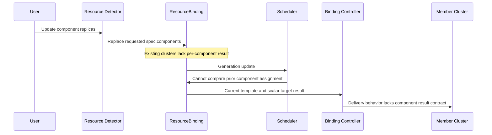

# Day 42：#7492 多组件扩缩容重调度承接基线

日期：2026-08-10

## 先说人话

本周把 [#7492](https://github.com/karmada-io/karmada/issues/7492) 作为核心工作，
但不是直接抢走整个 umbrella issue。`mszacillo` 已在 6 月承接，维护者
`RainbowMango` 也在 8 月 7 日把新的 API 前置问题直接交给他。因此当前最稳妥的
进入方式是：先把 API、兼容性和测试矩阵做实，再询问他希望我们独立负责哪一块。

具体例子：FlinkDeployment 上一次成功结果是 `jobmanager=1`、
`taskmanager=10`，用户把 `taskmanager` 改成 `20`。当前 Binding 的请求侧会更新为
20，但结果侧 `clusters` 只能记住 `member1` 和一个旧式 scalar `replicas`，无法记住
“上次 taskmanager 是 10”。调度器就没有可靠基准判断这是扩容，也无法表达混合变化，
例如 `jobmanager 2 -> 1`、`taskmanager 10 -> 20`。

现在可以完成精确 API/流程分析、测试矩阵和协作评论；在现有 owner 或 maintainer
确认独立切片前，不创建代码分支，不提交重复 PR。

18:26 状态更新：`ranxi2001` 已发布 `/assign` 并成为正式 assignee。这个元数据变化
不覆盖 `mszacillo` 更早的承接；下一步仍然是先公开协调非重叠切片。

## Issue 概览

- 目标：Karmada [#7492](https://github.com/karmada-io/karmada/issues/7492)，
  `[Umbrella] Multi-components workload scheduling - phase IV`。
- 状态：Open，里程碑 v1.19，due 2026-08-31。
- PR 认领 @：`@ranxi2001` 已正式 assigned；`@mszacillo` 更早公开承接并获
  maintainer 同意，必须先协调 ownership。
- 当前任务：让多组件应用进入重调度；重调度时考虑已经调度的组件；失败时不把新配置
  传播到 member cluster。
- 本次代码基线：`upstream/master@c884a95908c59a59788c6536fcec798624a09771`。

## 讨论脉络与参与者

1. `RainbowMango` 在 2026-05-08 创建 Phase IV tracker。
2. `mszacillo` 在 2026-05-28 表示愿意调研；`RainbowMango` 次日同意，并把工作移到
   v1.19；`mszacillo` 在 2026-06-03 再次确认。
3. `RainbowMango` 在 2026-08-07 指出结果侧缺失：`TargetCluster` 只能表示 cluster
   和单一 `Replicas`，无法保存每个 component 的上次分配；建议增加 per-component
   scheduling result，并请 `mszacillo`、`zhzhuang-zju` 评估。
4. 截至 2026-08-10，没有 PR 直接链接 #7492；这只说明没有公开实现，不表示原认领失效。
5. `ranxi2001` 在 2026-08-10 18:26 发布 `/assign`，当前 GitHub assignee 已更新为
   `ranxi2001`。

评论权重：`RainbowMango` 是 issue 作者和 MEMBER，其意见是明确 maintainer direction；
`mszacillo` 是既有贡献者和 Phase III failover 修复作者；`zhzhuang-zju` 被邀请评估 API。

## 历史先例与实际关系

- [#5115](https://github.com/karmada-io/karmada/issues/5115)：总特性 tracker，定义
  multi-component workload 和单集群资源感知调度目标；#7492 是其 v1.19 iteration。
- [#6998](https://github.com/karmada-io/karmada/issues/6998)：Phase III，已关闭并由
  #7492 接替。讨论已经指出“上次调度信息缺失”和 component 同时增减的未决语义。
- [#7065](https://github.com/karmada-io/karmada/issues/7065) /
  [PR #7066](https://github.com/karmada-io/karmada/pull/7066)：同一根因的窄修复。
  合并代码只在 `clusters` 被清空时触发 failover rescheduling，并在注释中明确它不能检测
  component scale-up/down 或 swap；这证明缺口是已接受限制，但不代表完整 API 已获批准。

## 当前运行路径

源码证据：

- `pkg/detector/detector.go:470-510,1495-1510`：重新解释资源并覆盖
  `bindingCopy.Spec.Components`，同时刻意保留已有 `Spec.Clusters`。
- `pkg/apis/work/v1alpha2/binding_types.go:89-102,236-293`：请求侧 `Component`
  有 name、replicas、requirements；结果侧 `TargetCluster` 只有 name 和 scalar replicas。
- `pkg/util/binding.go:37-68`：代码注释明确现有临时逻辑不能检测 component replica
  change 或 swap，只处理 clusters empty 的 failover。
- `pkg/scheduler/core/common.go:33-77`：multi-component workload 当前作为整体选择一个
  cluster，不做 replica division，最后仍只产生 `TargetCluster{Name: ...}`。
- `pkg/controllers/binding/common.go:52-100`：传播阶段只把 scalar
  `targetCluster.Replicas` 交给 `ReviseReplica`，没有 per-component delivery contract。

## API 与兼容性边界

维护者示例说明了方向，但还没有确定最终类型。第一轮必须回答：

1. `TargetCluster.components` 是否复用包含 resource requirements 的请求类型 `Component`，
   还是新增只含 name/replicas 的结果类型；请求与结果混用会产生冗余和错误更新风险。
2. 空的 target components 是“旧对象/未知结果”，还是“明确零副本”；nil、empty 和 zero
   必须有稳定语义。
3. v1alpha1 和 v1alpha2 都是 served version。v1alpha1 当前没有 request-side Components，
   conversion 又直接转换 `TargetCluster`；新字段需要明确保留、降级或拒绝策略。
4. 混合变化如何分类：一个 component scale-up、另一个 scale-down 时，是只估算正 delta、
   按完整新 footprint 重算，还是拒绝第一阶段不支持的组合。
5. scheduling 失败时，是保留 last accepted result 和原 Work，还是清空 placement；谁负责阻止
   binding controller 读取最新 template 并提前传播。

## 测试矩阵

| Case | Request change | Expected decision to define |
| --- | --- | --- |
| Unchanged | `1/10 -> 1/10` | No reschedule |
| Scale-up | `1/10 -> 1/20` | Estimate only accepted incremental footprint or agreed full footprint |
| Scale-down | `1/20 -> 1/10` | Skip estimator if that remains the contract; persist new accepted result |
| Mixed | `2/10 -> 1/20` | Explicitly support or reject; never infer from total replicas alone |
| Component add/remove | `A/B -> A/B/C` | Define identity and compatibility behavior |
| Reorder only | `[A,B] -> [B,A]` | No reschedule if names and values are unchanged |
| Failed scheduling | accepted `1/10`, requested `1/20`, no fit | Member cluster must retain the last accepted configuration |
| Legacy object | target result has no components | Stable fallback without false success or data loss |
| API conversion | v1alpha2 -> v1alpha1 -> v1alpha2 | Preserve or explicitly document unsupported information |

## 本周计划与停线条件

1. 先发布一条简短英文评论，说明已完成源码基线，并请求 owner 分配 API/兼容性/test
   slice；评论必须经用户确认 exact target/text。
2. owner 确认后，从最新 `upstream/master` 创建单独 worktree，先冻结选中切片的 API 和
   acceptance tests，再写实现。
3. 本周最低成功标准是拿到明确协作边界和可执行 maintainer feedback；目标是独立切片达到
   local review-ready。
4. 如果 owner 正在实现同一部分、明确不需要协助，或未回复，不开重复 PR；转为 baseline
   tests、review 和可复查设计证据。
