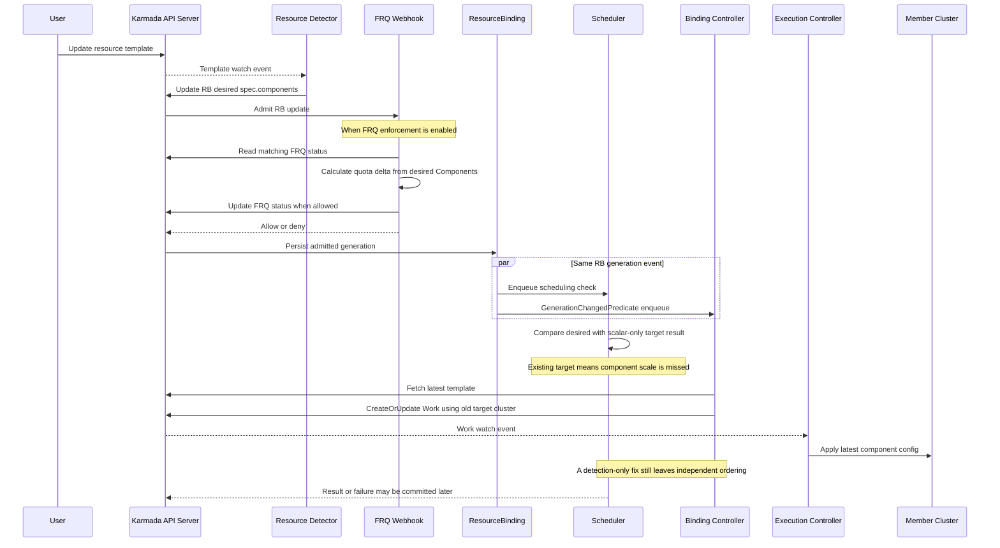

# Day 42：#7492 多组件扩缩容重调度承接与上下文基线

- 日期：2026-08-10
- 上下文复核时间：2026-08-10T19:38:30+08:00
- 源码基线：[`upstream/master@c884a95908c59a59788c6536fcec798624a09771`](https://github.com/karmada-io/karmada/commit/c884a95908c59a59788c6536fcec798624a09771)

## 更新说明

Day 42 最初是一份 issue intake。当时把 `mszacillo` 的公开表态理解成已经承接实现，因而把
“先协调 ownership”设为进入条件。完整回读线程后，这个判断需要纠正：他原话是愿意
“investigate these scale scenarios”以及在 v1.19 “take a look”，没有正式 assignment、关联
PR 或公开实现分支。`ranxi2001` 在 2026-08-10 发布 `/assign` 后，才成为 #7492 当前唯一
正式 assignee。

随后完成的
[Day 43](day43-issue5115-evolution-and-7492-implementation-plan.md)
补齐了 #5115 四期演进和源码调用链，但其中 result type、positive delta、current-target
continuity 和 pre-cleanup Work fence 都是本地设计假设，不是已经确认的社区 API。

当前决定是：**先不发布旧协调评论，也不创建源码 worktree；等待 `RainbowMango` 给出明确
API，再逐项对照 Day 43。** 本报告把进入这项工作前必须知道的上下文重新整理成一条完整主线。

## 先说人话

[#7492](https://github.com/karmada-io/karmada/issues/7492) 不是简单补一个“副本变化了”的判断。
它需要让 Karmada 在一次多组件扩缩容中，始终区分并协调四份状态：

1. 用户现在想要什么，即请求状态（desired）。
2. 调度器上一次成功接受了什么，即调度结果（accepted）。
3. member cluster 实际收到什么，即下发状态（applied）。
4. FederatedResourceQuota 当前按什么计量，即配额状态（accounted）。

以 FlinkDeployment 为例，上一次成功结果是 `jobmanager=1`、`taskmanager=10`，用户把
`taskmanager` 改成 20。Resource Detector 会把请求侧 `spec.components` 更新为 20，但
当前 `spec.clusters` 只能记录 `member1`，不能记录“上次 taskmanager 接受的是 10”。

这会同时造成三个问题：Scheduler 没有基准计算增量；Binding controller 可能在 Scheduler
得出结果前把最新模板下发；FRQ 又可能在调度成功前按 20 计量。只修
`IsBindingReplicasChanged` 会让 Scheduler 开始处理事件，却不能保证失败后 member 状态与 quota
合同仍然一致。

> 结论：#7492 的核心不是“如何发现一次 scale”，而是“谁保存 last accepted component
> result，以及 Scheduler、Binding controller 和 FRQ 何时推进或回退这次变化”。

## 什么是 multi-component workload

普通 Deployment 通常只有一个 Pod template。FlinkDeployment、Volcano Job、RayJob、
SparkApplication 等复杂资源可以在一个 CRD 中包含多个 Pod template；Karmada 把每个 template
解释成一个 component。例如：

```yaml
components:
- name: jobmanager
  replicas: 1
  replicaRequirements:
    resourceRequest:
      cpu: "1"
      memory: 2Gi
- name: taskmanager
  replicas: 10
  replicaRequirements:
    resourceRequest:
      cpu: "2"
      memory: 4Gi
```

这里的 `jobmanager` 和 `taskmanager` 不是两个独立 Karmada workload。当前 proposal 和实现把
整个 CRD 当成一个完整 component set，选择一个 member cluster 承载整组组件；不把不同
component 拆到不同集群，也不由 Karmada 负责 member 内部的 Pod packing。

因此 #7492 讨论的 “per-component result” 是：在已经选中的 cluster 下，记录每个 component
上一次成功接受的副本数。它不是引入 component-level multi-cluster replica division。

## Issue 原始交付目标

[#7492 issue body](https://github.com/karmada-io/karmada/issues/7492) 给出了三项直接要求：

1. multi-template application 的 component 变化必须有机会进入 rescheduling。
2. 重调度估算必须考虑已经调度的 components：scale-up 只考虑增量，scale-down 可以跳过
   replica set estimation。
3. rescheduling 失败时，更新后的配置不能传播到 member cluster。

当前 issue 状态是 Open，里程碑 v1.19，due 2026-08-31；`ranxi2001` 是唯一 assignee，未发现
关联 PR。FRQ 没有作为第四个 checkbox 写在 issue body 中，它进入本报告是因为 accepted result
会改变 quota 的计量和拒绝时机，而不是要把整个 FRQ umbrella 并入 #7492。

## 四份状态与当前缺口

| 状态 | 当前载体与 writer | 应表达的事实 | 当前问题 |
| --- | --- | --- | --- |
| desired | Detector 写 `ResourceBinding.spec.components` | 最新 component replicas、resource request、NodeClaim | 模板一变化就覆盖旧 request，不能代表上次成功结果 |
| accepted | Scheduler 写 `ResourceBinding.spec.clusters` | 最后一次成功调度到哪里、接受了多少 | `TargetCluster` 只有 name 和 legacy scalar `replicas`，没有 per-component result |
| applied | Binding/Execution controller 通过 Work 下发 | member cluster 应执行的配置 | multi-component path 没有按 accepted components 修订最新模板的合同 |
| accounted | FRQ webhook/controller 写 `FRQ.status.overallUsed` | 配额已经接受或预留的资源 | scalar 按 accepted replicas，components 却按最新 desired Components 计量 |

上表里的 accepted components 是 #7492 要补的概念，当前 API 中还不存在。不能先假设它一定是
`TargetCluster.components []{name, replicas}`；字段位置、类型、资源需求关联和旧对象语义仍需
维护者明确。

> 注释：这里的 applied 指 Karmada 已写入 Work 并向 member 下发的目标配置，不等价于 member
> 已经成功执行；后者还需要 Execution controller 和聚合状态确认。#7492 的 failure invariant
> 首先要求未接受的新配置不能进入这条下发链。

## #5115 到 #7492 的演进

[#5115](https://github.com/karmada-io/karmada/issues/5115) 是总特性主线，#7492 是其 Phase IV，
不是一个脱离历史的新调度模型。

| 阶段 | 已交付 | 尚未解决 |
| --- | --- | --- |
| Proposal PR [#5085](https://github.com/karmada-io/karmada/pull/5085) / [#6535](https://github.com/karmada-io/karmada/pull/6535) | request-side Components、完整 set、单集群目标、interpreter/estimator 方向 | target result、scale 和 failure contract 没有定案 |
| Phase I / [#6641](https://github.com/karmada-io/karmada/issues/6641)，v1.15 | Alpha gate、`GetComponents`、`spec.components`、Flink interpreter、component-aware quota 基础 | accurate scheduling 延后 |
| Phase II / [#6734](https://github.com/karmada-io/karmada/issues/6734)，v1.16 | `MaxAvailableComponentSets`、general/accurate estimator、初次 Flink/Volcano 调度 E2E | 只覆盖 initial full-set placement，没有 scale/result/failure fence |
| Phase III / [#6998](https://github.com/karmada-io/karmada/issues/6998)，v1.17 | [#7066](https://github.com/karmada-io/karmada/pull/7066) 让 clusters-empty failover 重新进入 Scheduler | 注释明确不能检测 component scale 或 swap |
| Phase IV / [#7492](https://github.com/karmada-io/karmada/issues/7492)，v1.19 | maintainer 提出 per-component target result 的方向；`ranxi2001` 已 assigned | scale detection、delta estimation、failed-delivery invariant、API/FRQ 兼容性 |

前三期已经证明 Karmada 能解释多个 component、估算完整 set 并完成首次 placement。#7492 要补的
是后续更新的事务边界：从旧 accepted set 变成新 accepted set 的过程。

## #6486 与 #7492 的关系

[#6486](https://github.com/karmada-io/karmada/issues/6486) 是 FederatedResourceQuota（FRQ）
Phase II umbrella，不是 multi-component scheduling 的一个阶段。它的核心合入项包括：

- [#6474](https://github.com/karmada-io/karmada/pull/6474)：Duplicated 模式扩容时，member
  下发必须服从 `bindingSpec.clusters[].replicas`，不能直接使用最新模板副本数绕过 quota。
- [#6477](https://github.com/karmada-io/karmada/pull/6477)：scalar workload 的 FRQ usage 按
  实际调度结果计算。
- [#6481](https://github.com/karmada-io/karmada/pull/6481)：Scheduler 提交 RB 调度结果、被 FRQ
  webhook 以 quota exceeded 拒绝时，记录 `Scheduled=False, reason=QuotaExceeded`。

#6486 后来在核心修复完成后关闭，Scope、ResourceLimit、cache/requeue 等相关未完成事项继续由
[#6835](https://github.com/karmada-io/karmada/issues/6835)、
[#5130](https://github.com/karmada-io/karmada/issues/5130) 和
[#6836](https://github.com/karmada-io/karmada/issues/6836) 跟踪。这些 leftovers 不属于 #7492。

它对 #7492 的价值是提供了 scalar precedent。当前 Binding controller 的源码注释已经明确：
member 下发必须服从 accepted `bindingSpec.Clusters`，否则扩容可能绕过 quota 或 suspended queue。
因此 per-component accepted result 不只是方便 Scheduler 做差值：下发路径必须能消费它；配额
路径则必须明确消费 accepted result，或为 desired reservation 定义完整 lifecycle。

但 #6486 没有回答 multi-component API，也不能直接替 #7492 选择 FRQ 语义。它是设计约束，
不是现成答案。

## Issue 线程与 ownership 纠正

1. `RainbowMango` 在 2026-05-08 创建 Phase IV tracker。
2. `mszacillo` 在
   [2026-05-28 的评论](https://github.com/karmada-io/karmada/issues/7492#issuecomment-4567706415)
   中表示愿意 “investigate these scale scenarios”。
3. `RainbowMango` 次日回复 “go ahead”，并把迭代移到 v1.19；`mszacillo` 在 06-03 表示会
   “take a look”。这些措辞支持调研意向，不证明正式 assignment 或正在编码。
4. `RainbowMango` 在
   [2026-08-07 的评论](https://github.com/karmada-io/karmada/issues/7492#issuecomment-5212258262)
   中指出 `TargetCluster` 无法保存每个 component 的分配，使用 “we might need to extend” 给出
   `clusters[].components` YAML 示例，并邀请 `mszacillo`、`zhzhuang-zju` 评估。这是明确的问题
   方向，但不是已经冻结的 Go API 和行为合同。
5. `ranxi2001` 在
   [2026-08-10 18:26 的评论](https://github.com/karmada-io/karmada/issues/7492#issuecomment-5238938075)
   中发布 `/assign`。截至本次复核，GitHub 只列
   `ranxi2001` 为 assignee，没有 PR 关联 #7492，也没有公开的同题实现。

因此当前没有发现公开重叠实现、关联 PR 或其他 formal assignee。本地 blocker 是 API 尚未明确，
不是已确认的 ownership 冲突。等 `RainbowMango` 给出具体类型和语义后，可以直接做本地实现
比较；任何 issue comment、PR、reviewer request 或 maintainer mention 仍需单独审批。

## 当前 producer-to-impact 链



这条链说明只补 detection 后，失败传播会形成可达窗口：Scheduler 和 Binding controller 由同一次
generation change 独立入队，没有顺序保证。Binding controller 会先抓最新模板，再按旧 cluster
更新 Work；它不读 `SchedulerObservedGeneration` 来等待本轮调度。

当前 `IsBindingReplicasChanged` 又只在 component workload 的 `clusters` 为空时返回 true。有旧
target 时，scale-up、scale-down、add/remove、same-total swap 和 mixed change 都不会进入真正的
reschedule。即使只修这个条件，Controller/FRQ 的提交时序仍然存在，所以 detection-only 不是完整
修复。

## FRQ 为什么必须进入 API 对照

当前 `CalculateResourceUsage` 有两套不同计算：

- scalar workload：汇总 accepted `spec.clusters[].replicas`，再乘
  `ReplicaRequirements.ResourceRequest`。
- multi-component workload：汇总最新 desired `spec.components` 的 replicas 和 resource
  request，再乘 `len(spec.clusters)`；它不读取 per-cluster component result，因为当前没有该字段。

这带来以下实际行为和未来风险：

| 场景 | 当前行为或推论 | 为什么影响 #7492 |
| --- | --- | --- |
| 超额 scale-up | 启用 FRQ enforcement 且命中 quota 时，Detector 的 RB update 可在 admission 阶段被拒；Scheduler 看不到新 generation | 拒绝阶段与 scalar 路径不同，也不会自然得到 Scheduler 写入的 `QuotaExceeded` condition |
| quota 内 scale-up 后 no-fit | Webhook 已按新 desired 值增加 `overallUsed`；如果 #7492 保留旧 Work，可能形成未运行资源的 reservation | 必须明确这是有意预留，还是失败后需要回退 |
| scale-down 或 mixed change 失败 | 对计算后下降的资源维度，如果 Work 按 accepted 结果保留，FRQ 却已按较小 desired 值释放，可能低估仍在运行的旧配置 | 可能允许其他 workload 使用尚未真正释放的 quota |
| Scheduler 只 patch accepted components | 如果 FRQ helper 仍只看 desired，accepted patch 的 old/new usage 可能相同，quota delta 为 0 | 新 result API 与 quota 提交点必须一起定义，不能只加字段 |

后三项是根据当前源码和 #7492 failure invariant 推导出的设计风险，尚未通过运行时 E2E 复现。

FRQ 合同至少有两个可行方向：

| 方向 | 含义 | 必须补的机制 |
| --- | --- | --- |
| accepted usage | 只有 Scheduler 成功提交 accepted result 后才改变 `overallUsed` | FRQ 读取 per-cluster accepted components；quota denial、旧 result/Work 保留、resource request 配对和 legacy fallback 必须一致 |
| desired reservation | Detector 更新 desired 时先预留资源 | no-fit 时如何保留或释放 reservation、scale-down/mixed failure 如何避免提前释放，必须有明确 lifecycle |

当前 scalar 路径接近 accepted usage，multi-component 路径表现为 desired reservation。#7492 不能
默默延续这处分叉，也不能未经 maintainer 决策就强行统一。

## 源码证据

- Request API：[`ResourceBindingSpec.Components`](https://github.com/karmada-io/karmada/blob/c884a95908c59a59788c6536fcec798624a09771/pkg/apis/work/v1alpha2/binding_types.go#L89)
  包含完整 component request；[`TargetCluster`](https://github.com/karmada-io/karmada/blob/c884a95908c59a59788c6536fcec798624a09771/pkg/apis/work/v1alpha2/binding_types.go#L286)
  只有 name 和 scalar replicas。
- Producer：[`detector.go`](https://github.com/karmada-io/karmada/blob/c884a95908c59a59788c6536fcec798624a09771/pkg/detector/detector.go#L470)
  覆盖最新 `Spec.Components`，同时保留 `Spec.Clusters`。
- Detection：[`IsBindingReplicasChanged`](https://github.com/karmada-io/karmada/blob/c884a95908c59a59788c6536fcec798624a09771/pkg/util/binding.go#L37)
  的注释明确当前临时逻辑不能检测 component scale 或 swap。
- Estimation：[`calculateMultiTemplateAvailableSets`](https://github.com/karmada-io/karmada/blob/c884a95908c59a59788c6536fcec798624a09771/pkg/scheduler/core/estimation.go#L75)
  把完整最新 Components 送给 estimator，当前没有 per-cluster old accepted set 来计算 delta。
- Delivery：[`ensureWork`](https://github.com/karmada-io/karmada/blob/c884a95908c59a59788c6536fcec798624a09771/pkg/controllers/binding/common.go#L80)
  明确 scalar 下发必须服从 accepted clusters，但只有 `ReviseReplica`；
  [`syncBinding`](https://github.com/karmada-io/karmada/blob/c884a95908c59a59788c6536fcec798624a09771/pkg/controllers/binding/binding_controller.go#L109)
  会在抓取模板前先清理 orphan Work。
- Failure：[`scheduleResourceBindingWithClusterAffinity`](https://github.com/karmada-io/karmada/blob/c884a95908c59a59788c6536fcec798624a09771/pkg/scheduler/scheduler.go#L590)
  遇到 `FitError` 仍继续 patch suggested clusters；component scale 的 last-good-state 语义尚未定义。
- Accounting：[`CalculateResourceUsage`](https://github.com/karmada-io/karmada/blob/c884a95908c59a59788c6536fcec798624a09771/pkg/util/helper/binding.go#L539)
  显示 scalar accepted 与 component desired 两套计算；
  [`validateFederatedResourceQuota`](https://github.com/karmada-io/karmada/blob/c884a95908c59a59788c6536fcec798624a09771/pkg/webhook/resourcebinding/validating.go#L118)
  在 RB admission 中计算 delta 并更新 FRQ status；FRQ controller 的周期重算也调用同一 helper。
- Conversion：v1alpha1 和 v1alpha2 都是 served version，现有
  [`binding_types_conversion.go`](https://github.com/karmada-io/karmada/blob/c884a95908c59a59788c6536fcec798624a09771/pkg/apis/work/v1alpha1/binding_types_conversion.go#L75)
  直接转换 scalar-only `TargetCluster`；新安全状态不能在版本 round trip 中丢失。

## 已确定、待确认与本地假设

### 已确定

- 一个 multi-component CRD 作为完整 set 调度到一个 cluster；component-level cross-cluster
  division 不在当前功能边界。
- desired `spec.components` 已存在，per-component accepted result 不存在。
- 当前检测漏掉有旧 target 的 up/down/add/remove/swap/mixed change。
- Scheduler 与 Binding controller 并行消费同一 Binding generation，未接受的新模板存在提前下发窗口。
- scalar delivery 已确立“服从 accepted result”的安全先例。
- FRQ 是 accepted component result 的下游消费者或 reservation lifecycle owner，不能从影响矩阵中省略。

### 等 `RainbowMango` 明确

1. accepted components 是否放在每个 `TargetCluster` 下，字段和 Go type 的准确形状是什么。
2. result 只存 `{name, replicas}`，还是需要 resource requirements、revision 或 digest 来覆盖
   CPU/memory/NodeClaim 更新。
3. name 唯一性、顺序无关、nil/empty/zero 和 legacy object 的准确语义。
4. current target 算 positive delta、其他 candidate 算 full set，还是第一阶段禁止迁移。
5. pure down、mixed up/down、same-total swap、component add/remove 的分类与 estimator 规则。
6. Scheduler 失败时是否原子保留 old clusters 和 accepted components；初次 no-fit 是否继续为空。
7. Binding controller 应阻止整个 pending request，还是将最新模板修订回 accepted components；fence
   必须发生在 orphan Work cleanup 之前还是存在其他提交机制。
8. FRQ 表示 accepted usage 还是 desired reservation；quota denial 在哪次 RB update 发生，失败如何
   保留或回滚，`QuotaExceeded` condition 由谁写。
9. v1alpha1/v1alpha2 conversion、RB/CRB parity 和 feature-gate downgrade 如何保证无损或显式拒绝。

### Day 43 仅供比较的本地假设

- 新增 result-only `{name, replicas}` type。
- 按 component name 归一化，mixed change 只估算正 delta。
- scale 时优先固定 current target，失败不迁移。
- request 与 accepted 不一致时，在 orphan cleanup 前停止 Work 同步。
- 已有 accepted result 的 scale failure 保留 old result；initial no-fit 仍为空。

这些方案能组成一个闭环，但尚未获得 maintainer API 确认。收到官方信号后可以接受、修改或
删除其中任何一项，不能因为 Day 43 写得具体就把它当成既定实现。

## 对照与验证矩阵

| Case | 必须比较的状态 | 关键断言 |
| --- | --- | --- |
| Initial schedule | desired / accepted / applied / accounted | 成功后四者收敛；initial no-fit 不创建虚假 accepted result |
| Unchanged / reorder | component name-keyed equality | 不重调度，不产生 quota delta |
| Scale-up | old accepted、desired delta 与 full footprint | 确认 current/other target 的估算输入，以及 accounted 在 desired 或 accepted 阶段推进 |
| Scale-down | old applied 与 quota release | accepted-usage 不提前释放；desired-reservation 明确预留、释放和失败回退规则 |
| Mixed / same-total swap | 每个 component 的正负变化 | 不能按总 replicas 误判 unchanged |
| Add / remove | component identity | 定义完整 snapshot、zero/remove 和 legacy 兼容行为 |
| No-fit / estimator error | old accepted/result/Work/FRQ | 新配置不下发；旧 good state 与 quota 语义一致 |
| Quota exceeded | admission 或 Scheduler commit | 拒绝点、`QuotaExceeded` condition、old result 与 Work 必须有统一合同 |
| API round trip | v1alpha1 -> v1alpha2 -> v1alpha1 | accepted safety state 不静默丢失 |
| Controller restart / FRQ resync | durable state | 重启和周期重算后得到同一结果，而不是依赖事件先后顺序 |

确认 API 后，最小影响面至少需要重新核对：API/conversion/generated artifacts、
`pkg/util/binding.go`、Scheduler core/result commit、Binding controller、
`pkg/util/helper/binding.go`、resourcebinding validating webhook、FRQ enforcement controller，以及
RB/CRB unit tests 和 multi-template/FRQ E2E。FRQ 三个实现层最终是修改还是只补兼容测试，取决于
维护者选择 accepted usage 还是 desired reservation。

## 当前范围与停线条件

- 不把一个 CRD 的 components 拆到多个集群。
- 不把 resource requirement 或 NodeClaim change 宣称为 replica scale 已解决，除非 accepted result
  明确覆盖这些信息。
- 不顺带实现 #6835、#6836、#5130 的 Scope、ResourceLimit、cache/requeue 等 FRQ leftovers。
- 不把 #6486 的 scalar precedent 写成 #7492 已确认 API。
- 不修改 initial no-fit、policy replacement、cluster termination 或 single-template cleanup 的既有
  语义，除非 maintainer 明确要求。
- 在 `RainbowMango` 给出明确 API 前，不创建 #7492 源码 worktree，不发布旧协调评论，不提交
  upstream PR。

## 下一步

1. 等待一个可固定的 maintainer 信号：issue comment、proposal commit 或 PR head。
2. 刷新 `upstream/master`，把信号钉到 exact ref。
3. 逐项对照 result type/location、served-version conversion、name/delta semantics、failure commit、
   delivery enforcement、legacy、FRQ 和 RB/CRB parity。
4. 更新 Day 43 和任务 file/test matrix，明确哪些假设被接受、拒绝或仍然开放。
5. 只有合同收敛后，才从最新 canonical master 创建一个隔离 worktree，先做 API 和 acceptance
   tests，再连接 Scheduler 与 Binding controller，并按确认的 accounting 合同决定是否修改 FRQ。

本轮结论来自官方线程与静态源码追踪，没有运行 unit、E2E 或真实 cluster 测试，也没有进行任何
上游写操作。
