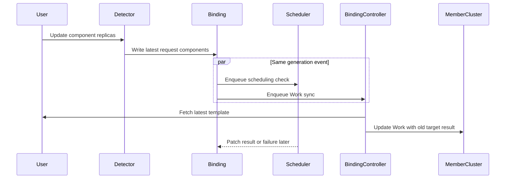
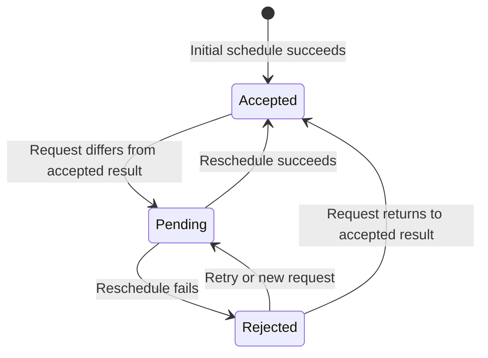

# Day 43：#5115 多组件调度演进与 #7492 快速实现路线

日期：2026-08-10

## 先说人话

[#5115](https://github.com/karmada-io/karmada/issues/5115) 不是一个尚未开始的需求，
而是一条从 2024 年延续到现在的功能主线。前三期已经完成了请求建模、Resource
Interpreter、quota、整组资源估算、初次调度和 failover 的基础能力；当前
[#7492](https://github.com/karmada-io/karmada/issues/7492) 缺的是最后一段闭环：
Karmada 不知道“上一次成功接受了每个组件多少副本”，所以无法安全处理扩缩容。

以 FlinkDeployment 为例：上一次成功下发的是 `jobmanager=1`、
`taskmanager=10`，用户把 taskmanager 改成 20。Detector 会立刻把请求侧
`spec.components` 更新为 20，但结果侧 `spec.clusters` 只保留 `member1`，没有
“上次是 10”这个事实。后果不只是调度器漏掉扩容：Binding controller 和 Scheduler
会被同一次 Binding 更新并行唤醒，前者可能先拿最新模板更新旧 Work，后者稍后才发现
增量无法调度。这样即使重调度最终失败，新配置也可能已经到达 member cluster。

本次调研结论是：**快速实现不能只改 `IsBindingReplicasChanged`**。最小完整闭环必须同时
包含以下四件事：

1. 在 `TargetCluster` 保存最后一次成功接受的 per-component result。
2. 按 component name 比较 request 与 accepted result，并只估算正增量。
3. 调度成功才提交新 result；扩容失败保留旧 result 和旧 Work。
4. Binding controller 在 request 尚未被 result 接受时，必须在删除或更新 Work 之前停住。

当前 `ranxi2001` 是 #7492 的正式 assignee，未发现关联实现 PR。用户已决定暂不发布
Day 42 的协调评论，先走 implementation-first；本报告完成后可以从最新
`upstream/master` 创建独立 worktree 开始编码，但任何 push、PR、issue comment 或
maintainer mention 仍需单独过上游门禁。

## 调研口径

- GitHub 观察时间：2026-08-10。
- 当前 canonical source：
  [`upstream/master@c884a95908c59a59788c6536fcec798624a09771`](https://github.com/karmada-io/karmada/commit/c884a95908c59a59788c6536fcec798624a09771)。
- 完整读取：#5115、proposal PR #5085/#6535、Phase I-IV tracker
  #6641/#6734/#6998/#7492，以及 failover issue #7065 / PR #7066 的分页评论与 timeline。
- PR 搜索：截至观察时间，没有 PR 关联 #7492，也没有公开的 `TargetCluster.components`
  实现。
- 本轮只做静态源码与官方线程调研；没有修改 Karmada 源码，没有运行 unit/e2e/cluster
  测试，也没有进行上游写操作。

## #5115 到底要解决什么

目标不是队列管理，也不是把一个 CRD 的不同组件拆到不同集群。Proposal 已明确：

- `Deployment` 只有一个 pod template；FlinkDeployment、Volcano Job、RayJob、
  SparkApplication 等对象包含多个 component，每个 component 的 replicas 和资源需求不同。
- Karmada 需要把这些 component 当成一个完整 set 做 resource-aware estimation。
- 整个 CRD 的所有 component 放到同一个 member cluster。
- Kubernetes 负责 member cluster 内的实际 Pod packing；Karmada 不求全局最优装箱。

这个边界在当前 proposal 的
[`Goals` / `Non-Goals`](https://github.com/karmada-io/karmada/blob/c884a95908c59a59788c6536fcec798624a09771/docs/proposals/scheduling/multi-podtemplate-support/multiple-pod-template-support.md#L27)
和
[`Notes/Constraints`](https://github.com/karmada-io/karmada/blob/c884a95908c59a59788c6536fcec798624a09771/docs/proposals/scheduling/multi-podtemplate-support/multiple-pod-template-support.md#L54)
中都很明确。因此 #7492 不应顺手扩展成 component-level multi-cluster division。

## 四期演进

| 阶段 | 时间与状态 | 已交付 | 留给下一期的缺口 |
| --- | --- | --- | --- |
| Proposal part 1 | [PR #5085](https://github.com/karmada-io/karmada/pull/5085)，2024-06 创建，2025-07-11 合并为 `9966a3fd` | 确立 request-side Components、完整 set、单集群边界 | Maintainer 明确 estimator alternative 和 interpreter extension 仍需后续设计 |
| Proposal part 2 | [PR #6535](https://github.com/karmada-io/karmada/pull/6535)，2025-08-30 合并为 `d4402a75` | 标准 proposal、feature gate、interpreter、API 和三种 estimator alternative | 合并文档没有回答 `spec.clusters` 是否也要存 per-component result；scheduler design 留给后续 PR |
| Phase I / v1.15 | [#6641](https://github.com/karmada-io/karmada/issues/6641)，2025-08-14 至 09-05 | Alpha gate、`GetComponents`、`InterpretComponent`、`spec.components`、Flink interpreter、FRQ、validation、debug | accurate estimator 明确延期到 v1.16 |
| Phase II / v1.16 | [#6734](https://github.com/karmada-io/karmada/issues/6734)，2025-09-05 至 11-29 | webhook interpreter、`MaxAvailableComponentSets`、general/accurate estimator、plugins、FRQ、Flink/Volcano E2E | 只证明初次 full-set placement；没有 scale/result/failure fence |
| Phase III / v1.17 | [#6998](https://github.com/karmada-io/karmada/issues/6998)，2025-12-05 至 2026-05-08 | [#6997](https://github.com/karmada-io/karmada/pull/6997) 统一计算、[#7066](https://github.com/karmada-io/karmada/pull/7066) 修复 clusters-empty failover | 研究确认 previous result、mixed scale 和增量估算无合同；关闭时显式交给 #7492 |
| Phase IV / v1.19 | [#7492](https://github.com/karmada-io/karmada/issues/7492)，Open，due 2026-08-31 | 2026-08-07 maintainer 提出 `TargetCluster.components` 方向；`ranxi2001` 于 08-10 正式 assigned | scale detection、delta estimation、failed-reschedule fence 和兼容性仍待实现 |

Phase III 的 [PR #7066](https://github.com/karmada-io/karmada/pull/7066) 是理解当前状态的
关键证据。它最后只在 `clusters` 被清空时让多组件 workload 重新进入 Scheduler，合并代码
明确注明不能检测 scale-up/down 或 component swap，完整方案需要 per-component target
result。它关闭的是 failover mitigation，不是扩缩容问题。

## Proposal 与当前实现的准确关系

### 已接受且已落地

- `MultiplePodTemplatesScheduling` 仍是 Alpha、默认关闭：
  [`pkg/features/features.go`](https://github.com/karmada-io/karmada/blob/c884a95908c59a59788c6536fcec798624a09771/pkg/features/features.go#L107)。
- 权威请求模型是 `ResourceBindingSpec.Components []Component`，每项包含 name、replicas、
  NodeClaim、resource request 和 priority：
  [`binding_types.go`](https://github.com/karmada-io/karmada/blob/c884a95908c59a59788c6536fcec798624a09771/pkg/apis/work/v1alpha2/binding_types.go#L89)。
- 实际 interpreter 名称是 `GetComponents`，不是 proposal 早期文本中的
  `GetComponentReplicas`。Gate 和 hook 可用时优先调用，否则回退 `GetReplicas`：
  [`detector.go`](https://github.com/karmada-io/karmada/blob/c884a95908c59a59788c6536fcec798624a09771/pkg/detector/detector.go#L1495)。
- multi-template path 只在 Components 非空，且 cluster spread 明确
  `minGroups=maxGroups=1` 时启用：
  [`estimation.go`](https://github.com/karmada-io/karmada/blob/c884a95908c59a59788c6536fcec798624a09771/pkg/scheduler/core/estimation.go#L32)。
- 最终 estimator 不是 proposal 三个 alternative 的原样复制，而是在原 service 增加独立
  `MaxAvailableComponentSets` RPC，并保留 `MaxAvailableReplicas`。
- 当前 E2E 只覆盖 Flink/Volcano 初次解析、选择一个集群和传播：
  [`schedule_multi_template_test.go`](https://github.com/karmada-io/karmada/blob/c884a95908c59a59788c6536fcec798624a09771/test/e2e/suites/base/schedule_multi_template_test.go#L79)。

### Proposal 没有定下来的内容

- `TargetCluster` 的 per-component result 类型和兼容规则。
- scale-up、scale-down、component add/remove、相同总数 swap、mixed up/down 的比较语义。
- current target 应算 delta、其他 candidate 应算 full set，还是扩缩容完全不迁移。
- rescheduling failure 后保留旧 placement，还是清空 placement。
- Binding controller 如何保证未接受的模板不更新 member Work。
- v1alpha1/v1alpha2 round trip、旧对象 backfill 和 gate downgrade。

Proposal 还存在一处 shipped-behavior 差异：文档说 gate 开启时 legacy replicas 和
Components 同时填充；当前 Detector 在 `GetComponents` 成功后立即返回，并不会继续填
`Replicas/ReplicaRequirements`。实现时应以当前源码为准，不能把 proposal 示例当运行事实。

## 当前源码链路



### 1. Request 被覆盖，旧 result 被保留

Detector 在
[`ApplyPolicy`](https://github.com/karmada-io/karmada/blob/c884a95908c59a59788c6536fcec798624a09771/pkg/detector/detector.go#L470)
中覆盖 `Spec.Resource` 和 `Spec.Components`，同时刻意不改 `Spec.Clusters`。这本来是正确的
request/result 分工，但现有 `Clusters` 无法表达旧 component result。

### 2. Scheduler 无法识别 scale，也会对旧 workload 重复估算

[`IsBindingReplicasChanged`](https://github.com/karmada-io/karmada/blob/c884a95908c59a59788c6536fcec798624a09771/pkg/util/binding.go#L37)
对 component workload 只有 `clusters` 为空时返回 true。有旧 target 时，up/down、swap、
add/remove 都漏掉。

即使强制进入 Scheduler，当前
[`calculateMultiTemplateAvailableSets`](https://github.com/karmada-io/karmada/blob/c884a95908c59a59788c6536fcec798624a09771/pkg/scheduler/core/estimation.go#L75)
也会把完整最新 Components 对所有 candidate cluster 共用。旧 Pods 已占 current cluster
资源，再估算完整 set 会双算；而对其他 cluster 又确实必须估算完整 set，不能把 delta
一刀切传给所有 cluster。

`SchedulingOvercommitProtection` 的 assumption cache 只防止并发 in-flight workload
超卖，不是 last accepted result，不能替代本 issue 的持久状态。

### 3. 失败前传播存在真实并发窗口

Binding controller 的
[`syncBinding`](https://github.com/karmada-io/karmada/blob/c884a95908c59a59788c6536fcec798624a09771/pkg/controllers/binding/binding_controller.go#L109)
没有读取 Scheduled condition 或 `SchedulerObservedGeneration`。它先删除 orphan Work，再按
Binding 引用抓取最新模板，随后直接 `ensureWork`。对 multi-template workload 又没有
`ReviseComponents`，因此最新模板会按旧 target cluster 原样下发。

当前 Scheduler 遇到 `FitError` 还会继续 patch 空的 schedule result：
[`scheduler.go`](https://github.com/karmada-io/karmada/blob/c884a95908c59a59788c6536fcec798624a09771/pkg/scheduler/scheduler.go#L590)。
对于已有成功结果的 scale reschedule，这会删除旧 placement，而不是保留 last good state。

## 快速实现合同

以下是本报告建议的第一版实现合同。Maintainer 已确认 result-side components 的方向，但
具体 Go type、legacy backfill 和 mixed semantics 尚不是社区共识，因此这些是待代码与 review
验证的工程方案。

### A. Result API

在 v1alpha1 和 v1alpha2 的 `TargetCluster` 同时增加可选结果字段：

```go
type TargetCluster struct {
    Name       string                   `json:"name"`
    Replicas   int32                    `json:"replicas,omitempty"`
    Components []TargetClusterComponent `json:"components,omitempty"`
}

type TargetClusterComponent struct {
    Name     string `json:"name"`
    Replicas int32  `json:"replicas"`
}
```

第一版建议使用独立的 result-only type，而不复用 request-side `Component`：

- 与 maintainer 在 #7492 给出的 YAML 一致，只表达 accepted assignment。
- 避免把 NodeClaim/resource requirements 复制到每个 target result。
- 两个 served version 可以保持相同 underlying struct，避免 conversion 静默丢字段。
- 本 issue 只处理 replica scale；资源需求变化是否触发 reschedule 应单独定义，不在第一版
  里假装已经解决。

列表语义按 name 归一化，顺序无关；name 必须非空且唯一，replicas 必须非负。Scheduler
写入的是完整 accepted snapshot，而不是本轮 delta。

### B. Change classification

令 `D[name]` 为最新 request，`A[name]` 为 current target 的 accepted result，
`delta[name] = D[name] - A[name]`：

| 变化 | 判定 | 第一版行为 |
| --- | --- | --- |
| Unchanged / reorder | 所有 delta 为 0 | 不重调度 |
| Pure scale-down / remove | 无正 delta，至少一个负 delta | 跳过 capacity estimation；保留 current target，提交完整 D |
| Scale-up / add | 至少一个正 delta | current target 只估算正 delta；负 delta 不提前当可用容量 |
| Mixed up/down | 同时有正负 delta | 按 scale-up 处理，只估算正 delta，保守但不会依赖尚未释放的资源 |
| Same-total swap | 总数相同但 name-keyed delta 非零 | 正确进入 mixed 路径，不再按总副本数误判 unchanged |
| Legacy empty result | 有 cluster、无 target components | 一次性 backfill 当前 request 为 baseline；必须有 upgrade test 和明确 Alpha 限制 |

为控制首版范围，扩缩容时建议固定在 current target：符合 #7066 中“优先保持业务连续性”的
讨论，也避免当前 estimator 一次 request 无法给不同 cluster 传不同 Components 的接口限制。
current target 容不下正增量时返回调度失败，保留旧配置；“失败后尝试迁移到其他 cluster”可在
后续用 current-target delta / other-target full-set 的分组 estimator 调用实现。

### C. Accepted-result fence

Binding controller 不需要先引入新的 reverse interpreter hook。第一版可以用 request/result
一致性做提交门禁：



- `request != accepted` 时，在 `removeOrphanWorks` **之前**返回，不删除旧 Work，也不更新旧 Work。
- Scheduler 成功后，在同一次 result patch 中写 cluster 和完整 accepted components；这个
  generation change 会重新触发 Binding controller，随后 request/result 相等，可以下发。
- Scheduler 失败时保留旧 `Clusters` 和 accepted components；request/result 继续不等，旧 Work
  保持原状。
- 初次调度没有 accepted result，同样不应提前创建 Work。

这比直接比较 `SchedulerObservedGeneration` 更稳妥。后者当前在 schedule-result spec patch 后会
出现 generation 再次增长的问题，而且 Binding controller 的 predicate 不消费 status-only event；
单加 equality check 可能永久等不到唤醒。

### D. Failure semantics

只对“已有 accepted component result 的 scale reschedule”改变失败行为：

- `FitError` / estimator error：保留旧 target/result，Scheduled=False，不推进 accepted state。
- 初次调度失败：仍保持 targets empty。
- placement policy change、cluster deletion 和单模板调度继续使用既有语义，不能被本补丁顺手
  改成保留旧 placement。

## 最短代码路径

| 层 | 文件 | 第一版改动 |
| --- | --- | --- |
| API | `pkg/apis/work/v1alpha{1,2}/binding_types.go` | 两版增加 result-only component type 和 `TargetCluster.components` |
| Conversion | `pkg/apis/work/v1alpha1/binding_types_conversion.go` | 显式、无损双向转换；避免当前直接 struct cast 因字段变化失效 |
| Validation | `pkg/webhook/resourcebinding/validating.go` | target component name/replicas/uniqueness；核对 RB/CRB 一致性 |
| Diff helpers | `pkg/util/binding.go`、`pkg/apis/work/v1alpha2/binding_types_helper.go` | name-keyed normalize、compare、positive delta、legacy detection |
| Scheduler core | `pkg/scheduler/core/common.go`、`util.go`、`estimation.go` | accepted result 写入、current-target delta、pure-down bypass |
| Result commit | `pkg/scheduler/scheduler.go` | 成功提交完整 snapshot；component scale failure 保留旧 result |
| Delivery fence | `pkg/controllers/binding/common.go` 与 RB/CRB controller | 在 orphan cleanup 和 `ensureWork` 前阻断 pending request |
| Generated | deepcopy、applyconfiguration、OpenAPI、Swagger、两个 work CRD | `make update` 后逐项审计，禁止夹带无关 generation churn |
| E2E | `test/e2e/suites/base/schedule_multi_template_test.go` | 在现有 Flink initial case 上补 up/down/no-fit lifecycle |

当前 v1alpha1 和 v1alpha2 都是 served version，v1alpha2 是 storage version。现有 conversion 在
[`binding_types_conversion.go`](https://github.com/karmada-io/karmada/blob/c884a95908c59a59788c6536fcec798624a09771/pkg/apis/work/v1alpha1/binding_types_conversion.go#L75)
直接转换 `TargetCluster`；只改 v1alpha2 会编译失败，手工丢字段则会让 v1alpha1 round trip
破坏安全状态。因此 API 与 conversion 必须作为同一个首提交完成。

## 建议提交顺序

为了尽快编码，同时保留可 review 的边界，先在一个 topic worktree 中形成四个逻辑 commit：

1. `api: persist accepted component results in target clusters`
2. `scheduler: detect and estimate multi-component scale deltas`
3. `controller: fence unaccepted multi-component updates`
4. `test: cover multi-component scale and failure lifecycle`

本地先完成整个闭环再决定是否拆 PR。API commit 可以独立 review，但不要把只改 detection helper
的半成品单独发布；那会扩大“已触发调度但仍提前传播”的窗口。

## 验证矩阵

| 层级 | 必测场景 |
| --- | --- |
| API | old object decode；v1alpha1 -> v1alpha2 -> v1alpha1；deepcopy；apply config；CRD/OpenAPI |
| Validation | empty/duplicate name；negative replicas；nil vs empty；feature gate off |
| Diff | unchanged；reorder；up；down；add；remove；same-total swap；mixed；legacy empty |
| Estimator | current target positive delta；pure down zero calls；mixed ignores negative capacity；error path |
| Scheduler | initial success 写 full accepted result；scale success 更新 result；scale failure 保留旧 result；initial no-fit remains empty |
| Controller | pending request 不 update/delete Work；accepted request 才更新；失败和 restart 后仍保持旧 Work |
| E2E | Flink initial -> scale-up success -> scale-down success -> forced no-fit，最后断言 member 仍是旧 replicas |

先生成并审计 API artifacts，再跑聚焦 unit tests 和仓库门禁：

```bash
make update
go test ./pkg/apis/work/v1alpha1 ./pkg/apis/work/v1alpha2
go test ./pkg/util ./pkg/scheduler/core ./pkg/scheduler
go test ./pkg/controllers/binding ./pkg/webhook/resourcebinding
make verify
git diff --check
```

E2E 需要真实 Karmada/member cluster 环境；如果本机没有环境，必须把它明确记录为未运行，不能用
unit green 代替端到端 failure invariant。

## 风险与停线条件

1. **Legacy backfill 有不可消除的历史歧义。** 旧 target 没有 snapshot，无法仅从 Binding 判断
   member 上一次接受的准确值。第一版把当前 request 作为 baseline 是 Alpha 迁移策略，必须在
   PR 中明说；若 reviewer 要求从 Work 重建，则暂停并重新设计。
2. **Result-only snapshot 不覆盖资源需求变化。** CPU/memory/NodeClaim 更新的安全估算不应冒充
   replica scale 已解决；如 maintainer 要把它纳入 #7492，应改为完整 Component snapshot 或稳定
   revision/digest，再扩测试。
3. **不能对所有 candidate 共用 delta。** 若首版允许 scale 时迁移，必须把 current target 的 delta
   与其他 target 的 full desired 分组估算；否则会低估新集群所需资源。
4. **Fence 必须早于 orphan cleanup。** 放在 `ensureWork` 前但 cleanup 后仍会删除 last good Work。
5. **失败保留必须精确限定。** 不得改变初次 no-fit、policy replacement、cluster termination 或
   single-template 的既有 cleanup 行为。
6. **RB/CRB 和 served versions 必须一致。** 只修 namespaced RB 或只修 storage version 都不是
   完整实现。

## 最终判断

#5115 已经给 #7492 留下了清晰且稳定的外边界：一个 multi-component CRD 是一个完整 set，
所有组件落在同一个 cluster；现有 interpreter 和 estimator 主链不需要推倒重来。#7492 的真正
工作量集中在 accepted-result persistence、delta、commit/fence 三处。

因此下一步可以直接进入实现，但要按“一个本地完整闭环、四个逻辑 commit”推进。最先写 API
和 table tests，然后再接 Scheduler 与 Binding controller；不要从一行
`IsBindingReplicasChanged` 修补开始。旧协调评论保持暂缓，本轮没有任何上游发布动作。
