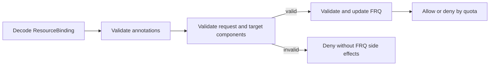

# Day 45：#7492 进度、完整性与待确认合同

- 日期：2026-08-12
- Issue：[`karmada-io/karmada#7492`](https://github.com/karmada-io/karmada/issues/7492)
- Feature branch：[`ranxi2001/feature/multi-component-scale-rescheduling`](https://github.com/karmada-io/karmada/compare/master...ranxi2001:karmada:feature/multi-component-scale-rescheduling)
- Feature HEAD：[`cf59527e23f432b241d2abeb9c3c54f73f834bcb`](https://github.com/ranxi2001/karmada/commit/cf59527e23f432b241d2abeb9c3c54f73f834bcb)
- Remote feature HEAD：[`cf59527e23f432b241d2abeb9c3c54f73f834bcb`](https://github.com/ranxi2001/karmada/commit/cf59527e23f432b241d2abeb9c3c54f73f834bcb)
- Merge base：[`upstream/master@1c278577e7892b6ea44f86a4317c1eb1e013bb93`](https://github.com/karmada-io/karmada/commit/1c278577e7892b6ea44f86a4317c1eb1e013bb93)
- Maintainer-provided Draft：[`RainbowMango/pr_multi_component_next_move@c14af2f1119a66d4672a814cc80f7612943d35d3`](https://github.com/RainbowMango/karmada/blob/c14af2f1119a66d4672a814cc80f7612943d35d3/docs/proposals/scheduling/multi-podtemplate-support/scheduling-result-for-components.md)
- 前置设计与实测：[Day 44：#7492 多组件调度结果 API 设计](day44-issue7492-component-scheduling-result-api-design.md)
- 本轮范围：在现有 feature branch 上补齐维护者 Draft PR1 已明确的 API、codegen 和 RB result
  validation，并将单提交更新到 fork；没有实现 PR2/PR3 行为，也没有发布 upstream PR 或评论

## 先说人话

当前分支已经造好了“记录每个组件上次调度结果”的位置，但生产代码还没有向这个位置写数据，也没有
读取它来判断扩缩容。

例如，FlinkDeployment 原来是：

```text
request: jobmanager=1, taskmanager=10
result:  member1
```

用户把 `taskmanager` 改成 20 后，当前 Binding 仍只有 `member1`，没有
`member1/jobmanager=1/taskmanager=10` 这份旧结果。调度器因此缺少可比较的基线。feature branch 新增了
`spec.clusters[].components`，但当前 scheduler 仍只产生 `TargetCluster{Name: "member1"}`，所以字段实际
不会被填充。

需要把三种“完成”分开：

| 目标 | 当前判断 | 还差什么 |
| --- | --- | --- |
| **可以开 API groundwork PR** | feature branch 已补齐 Draft PR1 的共同范围、完成 preflight 并推送 | 准备 exact PR text；PR body 明确未做 scheduler/dispatch，并披露 v1alpha1 与 CRB 边界 |
| **API PR 可以合并** | 代码层 PR1 gap 已消除，但 public API 兼容合同仍需 reviewer 确认 | served v1alpha1 数据保护、CRB 对等校验、Gate 降级策略需要在 PR review 中收敛 |
| **完整实现 #7492** | 约 **30% ±5%** | producer、scale trigger/delta、失败保护、component dispatch/interpreter、FRQ result accounting 和行为测试 |

> 分析：百分比是按功能链路和未决合同给出的工程估计，不是测试覆盖率，也不是 maintainer 承诺。
> 当前最准确的结论是：**本地代码已经形成 Draft PR1 候选，但还没有推送或获得 review；离“关闭
> #7492”仍很远。**

## 本轮进度

### 分支与社区状态

截至 2026-08-12 的回读结果：

- 本地 feature HEAD 已 amend 为 `cf59527e2`；核对远端旧值 `a3547a3a8` 后，已通过 exact-SHA
  `--force-with-lease` 将 fork branch 更新到同一提交。
- `upstream/master@1c278577e` 仍是本地提交的直接父提交；branch 为 `0 behind / 1 ahead`，工作树干净。
- 只有 1 个 DCO commit：`feat(api): add component scheduling results`。
- 本地 candidate diff 为 18 files、`+1060/-13`；包含 API/conversion/helper、RB webhook/test 和对应
  生成物，没有实习记录或无关源码。
- #7492 仍为 Open，milestone 为 v1.19，assignee 为 `ranxi2001`；正文三项任务均未勾选。
- issue 最新一条评论仍是 2026-08-11 `mszacillo` 提出的跨集群重调度状态保留问题；8 月 12 日没有新
  maintainer 回复。
- 当前没有关联 #7492 或该 feature head 的 upstream PR。

### 已经完成的代码

1. **结果 API 载体**：`TargetCluster` 已增加 name-keyed、order-insensitive 的
   `Components []TargetComponent`；`TargetComponent` 保存 `Name` 和 `Replicas`。
2. **发布产物**：deepcopy、apply configuration、OpenAPI、swagger 和 RB/CRB CRD 已同步。
3. **legacy projection 显式化**：v1alpha1 conversion 只投影 `Name/Replicas`，测试明确记录
   `Components` round-trip 后丢失，而不是依赖不再可编译的类型强转。
4. **测试 helper 语义**：`IsScheduleResultEqual` 按 component name 比较，忽略 component 顺序及
   nil/empty 差异，并拒绝重复 name；11 个 table-driven case 已覆盖关键边界。
5. **API 注释纠偏**：删除未经解释的 “only workloads with multiple pod templates”，改成中性的
   component-based scheduling result 描述；它与维护者 Draft 明确的 single-component 双写路线兼容。
6. **驱逐结果载体**：`GracefulEvictionTask` 增加 name-keyed
   `Components []TargetComponent`，并同步 deepcopy、apply configuration、OpenAPI、CRD 和 Swagger。
7. **RB 结果校验**：Gate 开启时，`clusters[*].components[*].name` 必须来自 `spec.components`，同一
   cluster 内不得重复；跨 cluster 同名、partial result 和 single-component scalar/component 双写允许。
8. **Gate 降级保护**：Gate 关闭时拒绝 CREATE、新引入或修改 component result；UPDATE 可保留语义相同
   的旧结果（顺序无关）或完整清空，避免 feature-gate downgrade 卡住普通更新和 finalizer 移除。
9. **准入副作用顺序**：静态 component 校验移到 FRQ 校验之前；无效结果不会先修改
   `FederatedResourceQuota.status` 再被拒绝。

### 已有验证证据

以下命令针对本地 `cf59527e2` candidate tree 执行：

| 命令 | 结果 | 能证明什么 |
| --- | --- | --- |
| `go test ./test/helper -run '^TestIsScheduleResultEqual$' -count=1 -v` | 11 个子用例通过 | helper 符合 map-list 判等语义 |
| `go test --race ./pkg/webhook/resourcebinding ./pkg/apis/work/v1alpha1 ./pkg/apis/work/v1alpha2 ./test/helper -count=1` | PASS | 新 webhook、API、conversion、helper 在 race 下通过 |
| `go test ./pkg/webhook/resourcebinding -run 'TestValidatingAdmission_Handle\|TestComponentValidationPrecedesFederatedQuotaValidation' -count=1` | PASS | membership、duplicate、partial、single 双写、Gate on/off 和 FRQ side-effect order 均通过 |
| `make verify` | PASS | staticcheck、gofmt、vendor、Swagger、CRD、codegen、license 全部一致 |
| `make test` | **环境红 1 项** | 唯一失败为既有 `TestInternetIP` 请求 `https://myexternalip.com/raw` 后得到 `nil/error`；本次相关包通过 |
| `go test --race ./cmd/... ./examples/... ./operator/...` | PASS | `make test` 因上述 `pkg/...` 红项未执行到的其余范围已补跑通过 |
| `git diff --check` | PASS | 无 whitespace error |

`make test` 的红项是直接访问公网服务的既有测试，已在去掉 `-v` 的同范围 race 重跑中定位；除该包外
`pkg/...` 全部通过。上述证据证明本地 PR1 candidate 自洽、可编译、生成物完整；它们不证明 production
path 已经使用新字段，也不证明未确认的跨字段和版本合同正确。

## Maintainer-provided Draft 已给出的答案

`c14af2f1` 是用户确认的维护者设计资料。它仍标记为 `Draft (design discussion, not yet a formal
proposal)`，所以这里只把它作为当前实现方向，不写成 upstream 已合入共识。Day44/Day45 原先三组
blocker 中，下面内容已有答案：

| 事项 | 已给出的方向 |
| --- | --- |
| API 方案 | 选择方案 B，在 `TargetCluster` 内保存 name-keyed component result |
| single component | 迁移期双写 scalar `Replicas` 和一个 `Components` entry |
| multi component | scheduler 写 `fullComponentSetOf(spec.Components)`，不是 delta |
| request/result 迁移 | 两侧结构同构，`Components` 是迁移方向，legacy scalar 暂时双写 |
| result validation | RB webhook 校验 request membership、cluster 内 duplicate；Gate 关闭时拒绝携带结果字段 |
| `BindingSnapshot` | 复用 `TargetCluster` 是有意的；同名 component merge 取最大 replicas |
| dispatch | PR3 增加 `ReviseComponents` 并贯通 interpreter；single component 可 fallback `ReviseReplica` |
| eviction | `GracefulEvictionTask` 增加 `Components` 并保存被驱逐集群结果 |
| PR 切分 | PR1 API+codegen+webhook，PR2 scheduler 双写，PR3 interpreter+ensureWork，PR4 third-party+Flink E2E，PR5 downstream |

因此 single/scalar 三选一、是否允许 `requiredBy` 暴露 Components、Gate-off 基本策略、
`ReviseComponents` 是否属于闭环，都不再列为“需要 maintainer 从零回答”。仍未回答的是失败状态机、
v1alpha1 保护、partial/mismatch/CRB 校验边界和 scale delta/trigger 细节。

## 完整性分析

### #7492 的实际验收目标

Issue 正文明确列出三项 phase IV 行为：

1. multi-template application 能进入 rescheduling。
2. rescheduling 的 estimator 考虑已调度组件：scale-up 只估算增量，scale-down 可以跳过估算。
3. rescheduling 失败时，不把更新后的配置传播到 member clusters。

当前三项仍全部未完成。新增 API 是这三项的前置数据结构，不等于行为已经接通。

### 当前生产链路

1. 资源解析器（`ResourceInterpreter.GetComponents`）可以把请求模板解析到
   `ResourceBindingSpec.Components`。
2. 调度器的 component estimator 可以用整份 `spec.Components` 估算某集群能容纳多少完整 component
   sets。
3. 选择阶段把 component workload 当作不可拆分的一个整体，只选择一个集群。
4. 结果生成阶段仍返回 `TargetCluster{Name: clusterName}`，没有生成
   `TargetCluster.Components`。
5. `IsBindingReplicasChanged` 对 component workload 只在 `Clusters` 为空时触发 failover；它明确不检测
   component scale 或等总副本的 component swap。
6. Binding controller 下发 Work 时只支持 scalar `ReviseReplica(targetCluster.Replicas)`；
   `ResourceInterpreter` 没有 `ReviseComponents`，因此也没有把 component result 原子写回模板的协议。

因此当前数据流在“结果记录”处断开：

```text
GetComponents -> spec.Components -> component capacity estimation
                                    |
                                    v
                            TargetCluster{Name}
                                    X
                  TargetCluster.Components -> scale comparison -> component dispatch
```

### 分层状态矩阵

| 层次 | 状态 | 已有基础 | 主要缺口 |
| --- | --- | --- | --- |
| 请求解析 | **已有上游基础** | `GetComponents` 生成 `spec.Components` | Draft 已给同构/双写迁移方向；mismatch 权威与迁移终点未定义 |
| API 结果载体 | **Draft PR1 branch candidate 完成** | `TargetCluster.Components`、`TargetComponent`、`GracefulEvictionTask.Components`、生成物和 RB validation | 已推送但尚未 review；v1alpha1、CRB 和降级合同仍需确认 |
| Scheduler producer | **未接通** | 已有选择结果和 desired components | `AssignReplicas` 仍只写 cluster name；没有成功结果快照 |
| Reschedule trigger | **未接通** | scheduler 已调用 `IsBindingReplicasChanged` | helper 不比较 request components 与旧 result，scale/swap 不入队 |
| Estimator | **可部分复用** | `MaxAvailableComponentSets` 已支持完整 component set 和 assumptions | 需要验证 scale-up delta、scale-down skip 与旧成功结果如何组合 |
| Dispatch / interpreter | **未实现** | scalar `ReviseReplica` 路径成熟；Draft 已给 PR3 方向 | 缺 `ReviseComponents` interface、webhook/declarative/Lua routing 和错误原子性 |
| 失败保护 | **合同和实现均未闭合** | 普通 `FitError` 有既有处理 | 当前 FitError 会 patch 空 `Clusters`；component scale 应保留旧结果、冻结下发还是采用别的状态，需先确认 |
| Validation / version | **RB 基础校验完成** | membership、per-cluster duplicate、Gate 新写入保护和 FRQ 前置顺序已实现 | completeness/mismatch、CRB、v1alpha1 main/status 和严格降级策略未闭合 |
| 行为测试 | **未覆盖主链路** | equality、conversion 和既有 component scheduling tests | 缺 producer、trigger、scale up/down、dispatch、failure preservation 和 version-skew tests |

### 关键源码证据

| 结论 | exact-SHA 证据 |
| --- | --- |
| 新结果字段及 validation markers 已存在 | [`binding_types.go:286-315`](https://github.com/ranxi2001/karmada/blob/a3547a3a84ef93e6cf1bf08422ae6465e381d6bd/pkg/apis/work/v1alpha2/binding_types.go#L286-L315) |
| 候选增加驱逐结果字段 | [`binding_types.go:336-341`](https://github.com/ranxi2001/karmada/blob/cf59527e23f432b241d2abeb9c3c54f73f834bcb/pkg/apis/work/v1alpha2/binding_types.go#L336-L341) |
| 候选先做静态校验再进入 FRQ | [`validating.go:83-105`](https://github.com/ranxi2001/karmada/blob/cf59527e23f432b241d2abeb9c3c54f73f834bcb/pkg/webhook/resourcebinding/validating.go#L83-L105) |
| 候选实现 membership、duplicate 与 Gate downgrade guard | [`validating.go:407-477`](https://github.com/ranxi2001/karmada/blob/cf59527e23f432b241d2abeb9c3c54f73f834bcb/pkg/webhook/resourcebinding/validating.go#L407-L477) |
| `BindingSnapshot.Clusters` 复用 `TargetCluster` | [`binding_types.go:389-403`](https://github.com/ranxi2001/karmada/blob/a3547a3a84ef93e6cf1bf08422ae6465e381d6bd/pkg/apis/work/v1alpha2/binding_types.go#L389-L403) |
| component workload 的结果 producer 仍只写 cluster name | [`common.go:50-77`](https://github.com/ranxi2001/karmada/blob/a3547a3a84ef93e6cf1bf08422ae6465e381d6bd/pkg/scheduler/core/common.go#L50-L77) |
| component estimator 仍以完整 desired components 估算整组容量 | [`estimation.go:75-112`](https://github.com/ranxi2001/karmada/blob/a3547a3a84ef93e6cf1bf08422ae6465e381d6bd/pkg/scheduler/core/estimation.go#L75-L112) |
| scale trigger 明确不检测 component scale/swap | [`binding.go:37-68`](https://github.com/ranxi2001/karmada/blob/a3547a3a84ef93e6cf1bf08422ae6465e381d6bd/pkg/util/binding.go#L37-L68) |
| Binding controller 只执行 scalar `ReviseReplica` | [`common.go:74-96`](https://github.com/ranxi2001/karmada/blob/a3547a3a84ef93e6cf1bf08422ae6465e381d6bd/pkg/controllers/binding/common.go#L74-L96) |
| Resource Interpreter interface 没有 `ReviseComponents` | [`interpreter.go:42-64`](https://github.com/ranxi2001/karmada/blob/a3547a3a84ef93e6cf1bf08422ae6465e381d6bd/pkg/resourceinterpreter/interpreter.go#L42-L64) |
| `FitError` 路径继续把空结果 patch 到 Binding | [`scheduler.go:590-615`](https://github.com/ranxi2001/karmada/blob/a3547a3a84ef93e6cf1bf08422ae6465e381d6bd/pkg/scheduler/scheduler.go#L590-L615)、[`scheduler.go:686-702`](https://github.com/ranxi2001/karmada/blob/a3547a3a84ef93e6cf1bf08422ae6465e381d6bd/pkg/scheduler/scheduler.go#L686-L702) |
| v1alpha1 projection 不保存 component result | [`binding_types_conversion.go:75-133`](https://github.com/ranxi2001/karmada/blob/a3547a3a84ef93e6cf1bf08422ae6465e381d6bd/pkg/apis/work/v1alpha1/binding_types_conversion.go#L75-L133)、[`binding_types_conversion_test.go:39-52`](https://github.com/ranxi2001/karmada/blob/a3547a3a84ef93e6cf1bf08422ae6465e381d6bd/pkg/apis/work/v1alpha1/binding_types_conversion_test.go#L39-L52) |

### 失败路径需要特别区分

当前通用 scheduler 在没有可行集群时返回 `FitError`；`scheduleResourceBindingWithClusterAffinity` 会继续
执行 `patchScheduleResultForResourceBinding(..., nil)`，后者把 `Spec.Clusters` 设为空。这个行为对普通
“当前集群不再可用”的重调度有清理意义，但不能自动等价为 #7492 想要的安全 scale 语义。

多组件扩容失败时至少有三种可能合同：

1. 保留旧 `Clusters/Components`，并阻止新模板下发。
2. 清空调度结果并删除旧 Work。
3. 另存 pending request/condition，让旧结果继续服务，新结果成功后再原子切换。

#7492 只明确“更新配置不得传播”，没有明确在失败期间旧 workload 是否必须继续运行。Day44 的本地倾向是
保留最近一次成功结果，但这仍是 **INFERENCE**，不能在没有 maintainer 决策时改写通用 FitError 语义。

## API Groundwork PR 完整性

### 可以现在开 PR 的理由

- branch hygiene、DCO、base 和生成物已经闭合；本地 candidate 仍为单 commit。
- API、conversion、helper 与 webhook race tests、`make verify` 有 exact-tree 证据；`make test` 唯一红项已
  定位为既有公网 IP 测试，其余范围补跑通过。
- diff 聚焦，没有 scheduler/controller 的半成品混入 API patch。
- #7492 maintainer 已明确提出需要 component scheduling result，并给出候选类型结构。

因此，fork 上的 `cf59527e2` 已经可以作为维护者 Draft PR1 的 review surface；现在的机械前置动作是
准备 exact PR title/body。它仍不是完整 #7492，也不能把 v1alpha1、CRB 和 Gate downgrade 的兼容边界
写成已获批准。

### PR 不能怎样描述

- 不能写 `Fixes #7492`，因为 umbrella issue 三项行为都未完成。
- 不能宣称 component scale rescheduling 已经工作。
- 不能把 RainbowMango 的 “Proposing the API” 写成已接受或最终合同。
- 不能把 v1alpha1 round-trip 丢字段只描述成无影响的测试细节。

正确的 metadata 应是：

- primary kind：`/kind feature`
- additional kind：`/kind api-change`
- issue relation：`Part of #7492`
- release note：说明新增 `TargetCluster.Components` / `TargetComponent` API，不能写 `NONE`
- reviewer notes：明确 Draft 已回答的设计点、v1alpha1/CRB/Gate downgrade 风险，并说明 trigger、
  estimator、failed-rescheduling safety 和 dispatch 是后续

## 仍需确认的问题

### P0：合并 public API 前必须闭合

#### 已解决：当前 branch 如何对齐 Draft PR1？

本地 `cf59527e2` 已补齐 `GracefulEvictionTask.Components`、生成物、RB result membership、per-cluster
duplicate、Gate 新写入保护及 webhook tests；该项从 maintainer 问题清单移除。它只说明本地实现范围已
对齐，不代表 public API 已获 approval，也不包含 scheduler producer 或 eviction consumer。

#### 1. served v1alpha1 如何保护 v1alpha2-only 数据？

当前 v1alpha1 无法表达 `spec.components` 和 `clusters[].components`；conversion test 已证明 typed
round-trip 会丢结果。需要分别决定：

| 操作 | 必须选定的合同 |
| --- | --- |
| v1alpha1 GET | 是否接受只读 lossy projection |
| RB/CRB main update | 接受丢失、拒绝 legacy write，还是 preservation strategy |
| RB/CRB `/status` update | 是否能证明保留 storage spec；若不能，是拒绝还是额外保存 |

**当前倾向**：可以接受只读 projection，但不能接受一次无关的 legacy write 静默删除调度基线。先用真实
API server 建立 main/status baseline，再按 maintainer 选择实现拒绝或保留策略。

#### 2. admission 的未覆盖边界是什么？

Draft 已回答 RB 的 unknown/duplicate/Gate-off 校验和 `BindingSnapshot` max merge，不应再问是否禁用
`requiredBy`。当前实现允许 partial result 和 scalar/component 双写，不自行增加 completeness 或 mismatch
约束；Gate 关闭时只禁止新引入/修改，允许语义相同旧值和完整清空，避免降级锁死。仍需在 PR 中收敛：
这三项是否符合最终合同、CRB 是否需要对等 validator，以及 maintainer 是否坚持更严格的 Gate-off 拒绝并
提供升级/降级清理路径。

### P1：后续实现要确认，但不阻止创建 groundwork PR

1. **scale trigger / backfill**：Draft 已指定 scheduler 写 full set/dual-write，但没有说明旧对象如何
   backfill，`IsBindingReplicasChanged` 是唯一 trigger 还是还要修改 detector/controller event path。
2. **失败状态机**：无可行集群时，谁保留旧成功结果、谁阻止 binding controller 使用新模板，以及什么
   condition 表示 pending/failed reschedule。
3. **estimator 输入**：scale-up 的 delta 是由 scheduler 先计算后传入 estimator，还是 estimator 同时接收
   desired 与 scheduled snapshot；scale-down 如何绕过 estimate 而不绕过 placement/eligibility 检查。
4. **`ReviseComponents` 错误合同**：Draft 已把它放入 PR3，并允许 single-component fallback；仍需明确
   多组件修改是否 all-or-nothing、partial mutation 如何回滚，以及 third-party interpreter error 行为。
5. **snapshot/eviction consumers**：API 字段已经存在；后续仍需实现 `BindingSnapshot` component max
   merge、`GracefulEvictionTask.Components` 的实际快照/消费和 FRQ result accounting，并确定测试。

### P2：移出当前 API PR，另做设计或复现

1. **跨集群重调度的应用状态保留**：`mszacillo` 观察到 workload 被迁往新集群时“不保留状态”，但尚未
   给出 workload kind、状态类型、复现步骤或期望 continuity contract。这可能涉及存储、checkpoint、
   workload-specific migration，不是增加 replica result 字段即可解决。除非 maintainer 明确纳入 phase IV，
   否则应单独复现和设计。
2. **收紧既有 request schema**：给 `Component.Name` 增加 `MinLength`、把 `spec.components` 改成
   name-keyed map-list、统一 RB/CRB admission 都会改变既有对象或 SSA/merge 语义，不应顺带塞进当前
   result API PR。
3. **长期 API 迁移**：`Replicas` / `ReplicaRequirements` 是否 deprecated、是否改 pointer、何时删除
   scalar path，不属于本次最小结果载体。
4. **扩展场景**：component 跨多个集群拆分、add/remove/rename、HPA、Descheduler 和通用状态迁移均
   另行设计；FRQ 与 `GracefulEvictionTask.Components` 已在 Draft 内，不再归为无方向的扩展项。

## 证据边界

| 标签 | 本文中的含义 | 本轮结论 |
| --- | --- | --- |
| `MAINTAINER` | #7492 正文、真人讨论，以及用户确认的 RainbowMango `c14af2f1` Draft | 方案 B、双写、producer、snapshot merge、interpreter 和 PR 切分已有 maintainer direction；仍非 merged project consensus |
| `CODE` | 本地 `cf59527e2` 与 `upstream/master@1c278577e` | Draft PR1 candidate 已实现；仍无 production producer/consumer，trigger、dispatch 和 FitError 行为未变 |
| `OBS` | exact-tree 测试结果、git/remote/issue 回读 | local clean、0 behind/1 ahead、verify 通过；唯一 test 红项为既有公网依赖；远端已对齐 `cf59527e2`，无关联 PR |
| `INFERENCE` | 对完成度、失败状态机和兼容方案的工程判断 | 完整 feature 约 30%、Gate grandfathering、last-success 保留和 v1alpha1 保护仍等待 PR/maintainer 收敛 |

`TargetComponent.Replicas int32` 的 pointer 疑问已经由提问者主动撤回；这只关闭该局部问题，不表示完整
API 已获 approval。维护者 Draft 与 #7492 snippet 在 “only multiple pod templates” 上仍有文字冲突；
本文采用 Draft 更具体的 single-component 双写步骤，并把注释最终措辞留给 PR review。

## 下一步

1. 基于官方 PR template 准备简洁的 exact English title/body，使用 `/kind feature`、
   `/kind api-change` 和 `Part of #7492`；用户确认 exact target/text 后再创建 upstream PR。
2. 用真实 API server 覆盖 v1alpha1 main/status read-modify-write，再按 maintainer 选择实现拒绝或保留策略。
3. 按 Draft PR2/PR3 实现 scheduler full-set/dual-write producer、snapshot merge、scale trigger/delta、
   `ReviseComponents`/dispatch 和 failed-rescheduling safety，再推进 third-party/Flink E2E 与 downstream。
4. 生产链路闭合前，不勾选 issue 正文三项，也不宣称完整 feature 可用。

## 本轮实现设计：补齐 Maintainer Draft PR1

### 先说人话

本轮只把当前 API branch 补到维护者 Draft 所说的第一阶段，不提前做 scheduler 或 Work 下发。

具体来说：`TargetCluster.Components` 已经能记录集群里的组件结果，但优雅驱逐任务还没有同类字段，
RB webhook 也会接受结果中不存在于请求侧的 component name。本轮新增
`GracefulEvictionTask.Components` 这个 API 载体，并在 ResourceBinding admission 阶段拒绝 unknown、
单集群 duplicate 以及 Gate 关闭时仍携带的 component result。

这不会让 #7492 行为闭环：scheduler full-set/dual-write producer、`BindingSnapshot` merge、
`ReviseComponents`、FRQ target-result accounting 和 failed-rescheduling safety 仍属于后续 PR。

### 所有权与调用顺序

静态字段合法性属于 ResourceBinding validating webhook；FRQ 校验会更新
`FederatedResourceQuota.status`，因此必须在静态校验通过后才能运行。



### 文件范围

| 文件 / 区域 | 改动 | 原因 | 验证 |
| --- | --- | --- | --- |
| `pkg/apis/work/v1alpha2/binding_types.go` | 给 `GracefulEvictionTask` 增加 name-keyed `Components []TargetComponent` | 对齐 Draft API 定义 | API package tests、generation verify |
| `pkg/webhook/resourcebinding/validating.go` | 把静态 component validation 移到 FRQ 前；新增 result membership、per-cluster duplicate、Gate-off 新写入保护 | 对齐 Draft 且避免 deny 前产生 FRQ side effect | webhook unit tests |
| `pkg/webhook/resourcebinding/validating_test.go` | 覆盖 Gate on/off、unknown、duplicate、跨集群同名、partial 和 single-component 双写 | 固定允许与拒绝边界 | focused `go test` |
| 生成物 | 更新 deepcopy、apply configuration、OpenAPI、RB/CRB CRD 与 Swagger | 发布 API schema 与 Go 类型保持一致 | update/verify scripts |

### 明确不改

| 区域 | 本轮不改原因 |
| --- | --- |
| scheduler/core、`pkg/util/binding.go` | 属于 Draft PR2 的 full-set/dual-write producer |
| binding controller、Resource Interpreter | 属于 Draft PR3 的 `ReviseComponents`/ensureWork |
| `GracefulEvictCluster` 与 eviction controllers | 本轮只发布任务字段；填充和消费属于 downstream eviction 行为迁移 |
| FRQ usage helper/controller | 共享 helper 会同时改变 admission 与 enforcement controller，属于后续行为 PR |
| ClusterResourceBinding webhook | 当前没有 CRB validating webhook；新增配置会显著扩大范围，Draft 只点名 RB |
| v1alpha1 conversion、failed-rescheduling、scale delta | 维护者 Draft 没有闭合这些合同 |
| request `Component.Name` schema | 不顺带收紧既有 API/SSA 兼容边界 |

### 精确行为

- Gate 开启：result name 必须出现在 `spec.components`；同一 cluster 内 name 唯一。
- 同一个 component name 可以出现在不同 cluster；不要求 result 必须包含 request 的完整集合。
- single-component 的 scalar + component 双写合法，不增加互斥校验。
- Gate 关闭：CREATE、新引入或修改非空 result 拒绝；UPDATE 可保留 name/replicas 语义相同的旧结果
  （slice 顺序无关）或完整清空。这样不会因 feature-gate downgrade 卡住普通更新/finalizer 移除；是否要
  改成更严格策略仍交给 PR review 确认。
- Gate 关闭时 request-side `spec.components` 的既有行为保持不变；Draft 所称“与现行策略一致”与当前源码
  不符，本轮不顺带改变请求侧。
- `requiredBy[*].clusters` 不按当前 binding 的 `spec.components` 校验，因为 snapshot 属于其他 binding。

### 实现与验证结果

1. 手写代码和 7 类生成物均已完成；最终 branch 为 18 files、`+1060/-13`、单 DCO commit。
2. `hack/update-codegen.sh` 首次因 Go 自动下载 toolchain 时访问 `sum.golang.org` 得到 `EOF`；固定使用已
   安装的 Go 1.26.5，并设置 `GOTOOLCHAIN=local` 后，codegen、CRD 和 Swagger update/verify 全部成功。
3. focused tests 与 API/webhook/helper race tests 通过；独立 code review 在收窄 Gate-off grandfathering
   后未发现 blocker、P1 或 P2。
4. exact-tree `make verify` 通过；生成器输出仓库既有 `list_type_missing` / `names_match` warnings，但没有
   新生成差异或退出错误。
5. `make test` 唯一失败是既有 `TestInternetIP` 无法从 `https://myexternalip.com/raw` 获取公网 IP；同轮
   其余 `pkg/...` 通过，随后补跑 `cmd/...`、`examples/...`、`operator/...` 的 race tests 全部通过。
6. `git diff --check upstream/master...HEAD` 无输出；本地 worktree clean、`0 behind / 1 ahead`，远端已
   更新为 `cf59527e2`。
7. HTTPS 推送连续三次失败，错误均为 `gnutls_handshake() failed: The TLS connection was non-properly
   terminated`；`curl` 同样在 GitHub TLS 阶段失败。SSH 认证检查确认账号为 `ranxi2001` 后，使用 SSH URL
   和远端旧 SHA `a3547a3a8` 的 exact lease 完成受保护强推，没有修改 `origin` 配置。
