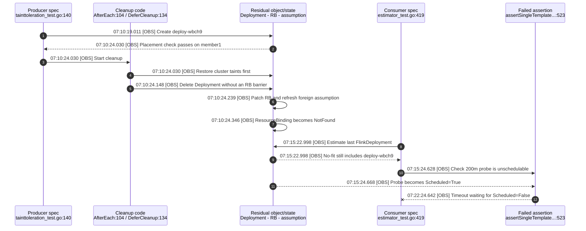
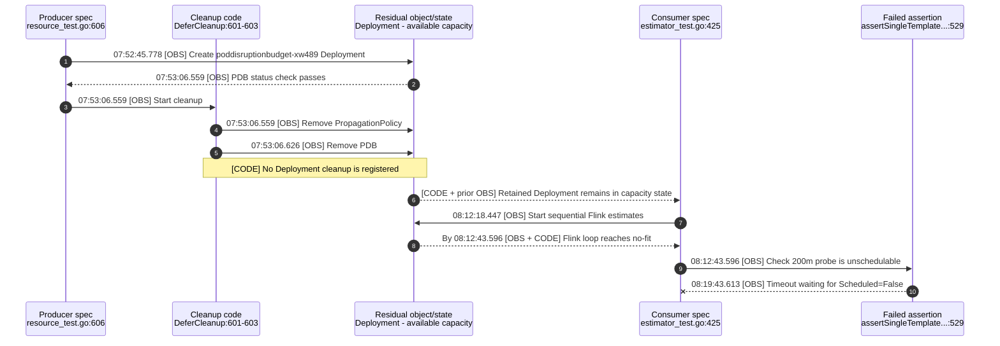

#### Which jobs are flaking:

- [Official v1.34.0 failure](https://github.com/karmada-io/karmada/actions/runs/28998390044/job/86054168911) at `3d4d14d746de507164abf40c1017b1f2b0e47e3a`.
- [Fork v1.36.1 attempt-1 failure](https://github.com/ranxi2001/karmada/actions/runs/31573625648/job/94042457609) at `8770a193a7a0c6f20dd3a1ea3ac9ff979df2730f`.

#### Which test(s) are flaking:

Both jobs report the same failing consumer spec in [`test/e2e/suites/base/estimator_test.go`](https://github.com/karmada-io/karmada/blob/3d4d14d746de507164abf40c1017b1f2b0e47e3a/test/e2e/suites/base/estimator_test.go#L379-L515):

```text
[EstimatorAssumption] NodeResource plugin assumption testing
[It] FlinkDeployment should be unschedulable when assumed workloads exhaust cluster resources
```

The failure is at `assertSingleTemplateDeploymentUnschedulable`: the 200m probe Deployment becomes schedulable instead of reaching `Scheduled=False`, so the assertion times out after 420 seconds.

#### Reason for failure:

The defect is in the cleanup of an earlier producer spec, while the later NodeResource spec is the test that reports the failure. The producer spec itself can pass before its cleanup leaks workload state into the shared cluster.

| Run | Earlier producer spec with defective cleanup | Later consumer spec that fails | Failed check |
| --- | --- | --- | --- |
| Official v1.34.0 | [`[propagation with taint and toleration testing] ... [It] deployment with cluster tolerations testing`](https://github.com/karmada-io/karmada/blob/3d4d14d746de507164abf40c1017b1f2b0e47e3a/test/e2e/suites/base/tainttoleration_test.go#L38-L148) | `[EstimatorAssumption] NodeResource plugin assumption testing ... [It] FlinkDeployment should be unschedulable when assumed workloads exhaust cluster resources` | `assertSingleTemplateDeploymentUnschedulable` never observes `Scheduled=False` |
| Fork v1.36.1 attempt 1 | [`[resource-status collection] ... PodDisruptionBudget collection testing ... [It] pdb status collection testing`](https://github.com/ranxi2001/karmada/blob/8770a193a7a0c6f20dd3a1ea3ac9ff979df2730f/test/e2e/suites/base/resource_test.go#L561-L628) | The same NodeResource spec | The same assertion times out |

The official run shows the complete test-code-object-time chain. All timestamps are UTC; `[OBS]` denotes a job or component log observation, and `[CODE]` denotes a source-proven cleanup property.



Here, the producer spec passed its own placement assertion. Its cleanup restored shared cluster state and deleted the Deployment without waiting for the generated `ResourceBinding` to disappear. The resulting reschedule refreshed the `deploy-wbch9` scheduler assumption, so the later NodeResource spec stopped its Flink loop on a no-fit result that did not come from its own FlinkDeployments alone. When the foreign assumption disappeared, the probe scheduled and the consumer spec failed.

The fork run shows a second producer affecting the same consumer. Its timestamps are also UTC.



The fork attempt-1 component artifact was later replaced at the run level by a rerun artifact. The job log still anchors the displayed spec times, while source code proves the missing Deployment cleanup. This branch therefore remains supporting evidence rather than a complete timestamped cache-transition chain. The official run remains the primary E3 root-cause chain.

#### Anything else we need to know:

The fix belongs to the two producer specs, not to `estimator_test.go`:

- `tainttoleration_test.go`: delete the workload and wait for its `ResourceBinding` to become NotFound before restoring cluster taints.
- `resource_test.go`: register cleanup for the fixture Deployment and wait for both the Deployment and its `ResourceBinding` to disappear.

This is limited to E2E lifecycle isolation. It does not change scheduler or estimator behavior, cache TTL, retries, or test timeouts, and it does not claim to solve the general production delete/reschedule race.

- #7719 and #7732 use the same official CI run but fix the earlier Flink CRD/APIEnablements cleanup race, not these two producer specs.
- #5382 isolates the PDB selector but does not delete the fixture Deployment.
