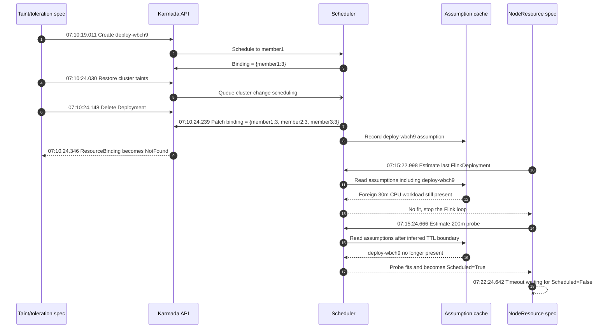
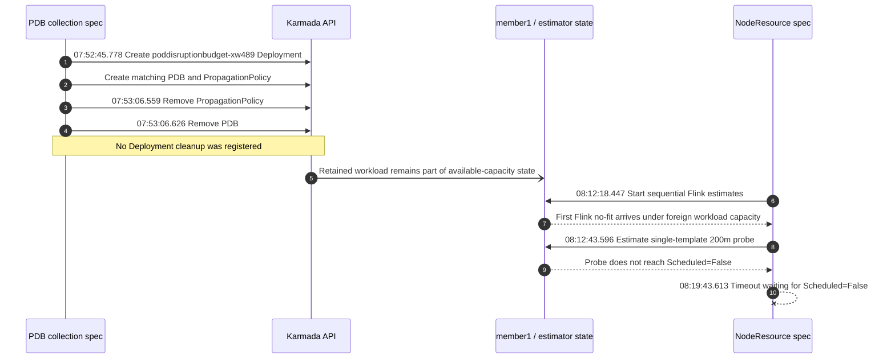

#### Which jobs are flaking:

- [Official v1.34.0 failure](https://github.com/karmada-io/karmada/actions/runs/28998390044/job/86054168911) at `3d4d14d746de507164abf40c1017b1f2b0e47e3a`.
- [Fork v1.36.1 attempt-1 failure](https://github.com/ranxi2001/karmada/actions/runs/31573625648/job/94042457609) at `8770a193a7a0c6f20dd3a1ea3ac9ff979df2730f`.

#### Which test(s) are flaking:

Both jobs failed the same spec:

```text
[EstimatorAssumption] NodeResource plugin assumption testing
[It] FlinkDeployment should be unschedulable when assumed workloads exhaust cluster resources
```

`assertSingleTemplateDeploymentUnschedulable` timed out after 420 seconds because the 200m probe Deployment became schedulable instead of reaching `Scheduled=False`.

#### Reason for failure:

The spec stops creating FlinkDeployments at the first no-fit result and treats that result as proof that **its own** assumptions exhausted `member1`. The two runs show two different earlier specs that violated this isolation assumption and affected the same assertion.

| Run | Workload-producing spec | State left for the NodeResource spec | Result |
| --- | --- | --- | --- |
| Official v1.34.0 | `[propagation with taint and toleration testing] ... deployment with cluster tolerations testing` | `deploy-wbch9` was rescheduled during cleanup and refreshed a foreign scheduler assumption | The Flink loop stopped on a no-fit result that still included `deploy-wbch9`; after that foreign assumption expired, the probe scheduled successfully |
| Fork v1.36.1 attempt 1 | `[resource-status collection] ... PodDisruptionBudget collection testing ... pdb status collection testing` | `poddisruptionbudget-xw489` Deployment had no cleanup; only its PDB and policy were removed | The retained workload changed the capacity seen by the same NodeResource spec, so its first Flink no-fit did not prove that this spec's assumptions alone exhausted `member1` |

The official run provides the timestamped root-cause chain:



The fork run identifies a separate producer for the same consumer failure:



The first diagram is the primary E3 root-cause evidence. The second diagram identifies an independent cleanup omission and the same downstream failure. That run was later rerun, and GitHub now exposes the rerun's component artifact under the run-level artifact name; therefore the second branch is supporting evidence, not the timestamp anchor for a cache transition.

#### Anything else we need to know:

A spec that creates a schedulable workload must delete the source object and wait for its generated `ResourceBinding` to become NotFound before restoring shared cluster state or completing cleanup. This prevents a completed spec from changing the capacity assumptions observed by a later estimator spec.

The proposed fix is limited to E2E lifecycle isolation. It does not change scheduler or estimator behavior, cache TTL, retries, or test timeouts, and it does not claim to solve the general production delete/reschedule race.

- #7719 and #7732 use the same official CI run but fix the earlier Flink CRD/APIEnablements cleanup race, not these workload producers.
- #5382 isolates the PDB selector but does not delete the fixture Deployment.
