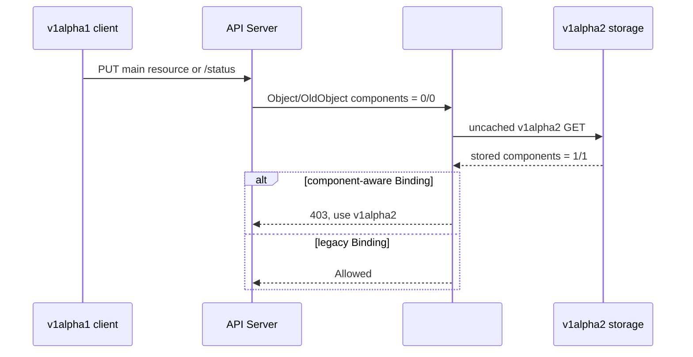

# Day 49：PR #7830 职责边界复审与多版本写入实验

- 日期：2026-08-17 至 2026-08-18
- 相关 Issue：[#7492](https://github.com/karmada-io/karmada/issues/7492)
- 相关 PR：[#7830](https://github.com/karmada-io/karmada/pull/7830)、[#7833](https://github.com/karmada-io/karmada/pull/7833)、[#7841](https://github.com/karmada-io/karmada/pull/7841)
- 实验对象：`ResourceBinding`
- 流程图补充日期：2026-08-27

> 2026-08-18 更新：PR #7830 已 force-push 为 `4583e06d2050058d4ff8a3980fe587ea12a48c79`，当前
> diff 是 `ReviseComponents` interpreter 能力与 Work delivery；原 validation、feature-gate rollback 和
> v1alpha1 write guard 已全部退出该 PR。本文后半部的 API Server 实验仍是有效机制证据，但只描述已被
> 替换的旧实现，不能当作当前 diff 的代码说明。

## 先说人话

当前 PR 的正确定位是“把已经存在的 component scheduling result 翻译成具体 Work 字段”，不是“判断这份
result 是否仍对应当前 source”。`ResourceInterpreter` 知道 `taskmanager` 应写到
`spec.taskManager.replicas`；它不应判断 scheduler 是否已经接受本次 CPU、内存、placement 或 source
版本变化。

具体例子：scheduler 上次接受的是 `taskmanager = 4 x 100m CPU`，用户一次更新为
`taskmanager = 6 x 500m CPU`。当前 #7830 会读取最新 source，再用旧 result 把副本数改回 4；Flink
脚本只改 `replicas`，所以可能生成 `4 x 500m CPU` 的 Work。旧 result 只证明“4 个副本被接受”，没有
证明“500m CPU 也被接受”。

因此本轮结论是：

- `ReviseComponents` 放在 ResourceInterpreter、由 binding controller 在生成 Work 时调用，组件定位正确；
- #7830 自身没有 accepted-input provenance 或 delivery fence，不能单独宣称 failed reschedule 下的完整
  fail-closed 交付；
- 该接受性协议应由 scheduler 持久化、binding controller 消费。旧 #7841 candidate 已实现 provenance
  与 delivery fence，但其 integration history 仍包含 force-push 前的 PR1/PR2，需要按当前拆分重新对齐；
  不要让 ResourceInterpreter 或 binding controller 用一次直接 API read、重试或副本数相等来猜
  scheduler acceptance；
- `requiredBy` 只借用 referring binding 的目标集群。当前代码丢弃 foreign `Components`、保留 dependency
  自身字段的方向正确。

## 当前 PR 的组件权责

| 角色 | 拥有的事实或动作 | 不应承担的责任 |
| --- | --- | --- |
| source + detector | 从当前 workload 提取 `spec.components`、`ReplicaRequirements` 和 `ResourceVersion` | 不决定 placement 或 accepted result |
| scheduler | 计算并持久化 `spec.clusters[].components`；完整方案还要持久化 accepted input identity | 不知道 CRD 内部 replica 字段路径 |
| binding controller | 在交付边界读取 accepted result、执行 delivery gate、生成或保留 Work | 不重新估算容量，也不凭 cache/API freshness 推断调度成功 |
| ResourceInterpreter | 把 name-keyed assignment 映射到 workload-kind 的字段 | 不决定 result 新鲜度、placement 或 retry 合同 |
| dependencies distributor | 把 referring binding 的目标集群写入 `requiredBy` snapshot | 不把 referring workload 的 component assignment 变成 dependency 的 assignment |

职责图的 canonical source 是
[`day49-7830-review-component-ownership.mmd`](day49-7830-review-component-ownership.mmd)。按仓库 export gate
只保留 `.mmd`，本轮未生成 PNG/SVG。

## `Component`、`TargetComponent` 与新增 operation 的关系

> 2026-08-27 更新：[#7833](https://github.com/karmada-io/karmada/pull/7833) 已合并，因此 scheduler producer 已进入 upstream `master`。它仍不属于 #7830 的两个 commit；#7830 消费该结果并完成 Work delivery。

Commit 1 没有新增另一种 workload component。它补充的是既有读取链的反向 operation：原有 `GetComponents` 把不同 CRD 的字段解释成统一的 `[]Component`，新增 `ReviseComponents` 再把 scheduler 产出的 `[]TargetComponent` 写回不同 CRD 的实际副本字段。

| 对象或 operation | 相对 #7830 的状态 | 携带的信息 | 在链路中的作用 |
| --- | --- | --- | --- |
| `Component` / `binding.spec.components` | 已有 | `name`、全局期望 `replicas`、每副本资源与调度要求 | detector 生成的 scheduler input |
| `TargetComponent` / `binding.spec.clusters[*].components` | API 已由 #7837 提供，producer 已由 #7833 合并 | `name`、某个目标集群获分配的 `replicas` | scheduler output；按 `name` 对应 `Component` |
| `ComponentResource` / `GetComponents` | 已有 | workload object -> `[]Component` | 读取资源结构，即 decode |
| `ComponentRevision` / `ReviseComponents` | commit 1 新增 | workload object + `[]TargetComponent` -> revised workload object | 写回资源结构，即 encode |
| `reviseWorkloadReplicas` | commit 2 新增 | 当前目标集群的 scalar 或 component result | 在 `ensureWork` 中选择 component path、scalar path 或 fail-closed fallback |
| `ReviseReplica` | 已有 | 单个 scalar replica result | 没有 component result 时继续使用的旧路径 |

`Component.Name` 与 `TargetComponent.Name` 是两侧的关联键，但两者的信息量不同。`Component` 包含 scheduler 做容量和约束判断所需的 requirements；`TargetComponent` 只保存该集群的副本分配结果。`ReviseComponents` 因此只改副本字段，不重新判断 placement、资源要求或 result freshness。

### 整体数据流

1. detector 对 source workload 调用已有 `GetComponents`，把 Flink 等 CRD 的字段转成统一的 `binding.spec.components`。
2. scheduler 读取 `[]Component`，在 #7833 当前支持的 multi-template placement 范围内选择目标集群，并把每个组件的 name/replicas 写入 `binding.spec.clusters[*].components`。该 producer 来自已合并的 #7833。
3. binding controller 的已有 `ensureWork` 为每个目标集群 clone source workload；commit 2 新增的 `reviseWorkloadReplicas` 决定采用 component result 还是 legacy scalar result。
4. component result 存在且有 hook 时，commit 1 新增的 `ReviseComponents` dispatcher 按既有优先级选择 configurable Lua、custom webhook 或 built-in thirdparty；native interpreter 当前没有 component revision implementation。
5. 具体规则拥有 CRD 字段映射。Flink 内置 Lua 例如把 `jobmanager=1`、`taskmanager=4` 写入 `spec.jobManager.replicas` 和 `spec.taskManager.replicas`。
6. 没有 `ReviseComponents` hook 时，commit 2 仅在已有 `GetComponents` 且 name/replicas exact match 时允许原对象继续交付；没有读取 hook 或结果不同都会返回错误，避免生成副本数与结果不一致的 Work。
7. replica revision 完成后，已有 `ApplyOverridePolicies` 最后执行，随后 controller 创建或更新 Work。

用于后续 reviewer comment 的英文数据流图和说明保存在 [`day49-pr7830-component-delivery-comment-draft.md`](day49-pr7830-component-delivery-comment-draft.md)。该草稿中的 Mermaid fence 是 comment 的 canonical source；本轮只做临时渲染校验，不保存 PNG/SVG。

## 为什么会改 37 个文件

这 37 个文件不代表 37 个独立行为变更。根因是 `ResourceInterpreter` 不是一个单实现接口：
同一个 operation 需要同时贯通 config API、声明式 Lua、自定义 webhook、内置 thirdparty rule、
`karmadactl interpret` 的规则认知、配置 webhook 校验和生成的 CRD/OpenAPI/applyconfiguration。
最后 binding controller 还要成为这个 operation 的 production consumer。

按 base `1819ee7bd` 到 head `4583e06d2` 的 `--numstat` 分类：

| 文件类型 | 数量 | 行数 | 为什么需要 |
| --- | ---: | ---: | --- |
| 测试与 fixture | 11 | `+690/-0` | 覆盖 interpreter 各路径、Flink 字段改写、fail-closed、legacy fallback 和 `requiredBy` ownership；占全部新增行约 54% |
| 生成代码与发布 schema | 9 | `+214/-2` | `ComponentRevision` 和 webhook request 的 `DesiredComponents` 是 config API 变化，必须同步 CRD、OpenAPI、deepcopy 和 applyconfiguration |
| 手写产品/工具代码 | 17 | `+372/-38` | 定义 operation，打通四类 interpreter 入口，添加 Flink 映射，并在 `ensureWork` 中消费 result |

从 commit 维度看更清楚：

- `997a594b1` 是 capability commit：35 files、`+839/-27`。它让 `ReviseComponents` 能够被配置、调用和测试，
  但尚没有 Work-delivery consumer。
- `4583e06d2` 是 consumer commit：2 files、`+437/-13`。真正产品逻辑只在
  `pkg/controllers/binding/common.go` 的 `+76/-13`，另外 361 行是 binding 回归测试。

### 主要文件组和职责

| 文件组 | 主要改动 | 权责边界 |
| --- | --- | --- |
| `pkg/apis/config/v1alpha1/` | 新增 `InterpreterOperationReviseComponents`、`ComponentRevision` 和 webhook request 的 `DesiredComponents` | 定义扩展合同和序列化形状；不决定调度结果 |
| `pkg/resourceinterpreter/interpreter.go` | 在顶层 interface 和 dispatcher 中加 `ReviseComponents` | 按 configurable Lua -> custom webhook -> built-in thirdparty -> native 的既有顺序找 hook；不判断 result freshness |
| `customized/declarative/` 与 `customized/webhook/` | 让 Lua 能接收 component list，让 webhook context 传递 `DesiredComponents` 并校验 patch response | 提供两种用户扩展机制；只负责 object patch |
| `default/thirdparty/.../FlinkDeployment/` | 内置 Lua 要求完整的 `jobmanager` + `taskmanager` result，拒绝 unknown/duplicate/missing component，再写入两个 replica 字段 | 拥有 Flink CRD 字段映射；不拥有 placement 或 capacity 决策 |
| `pkg/controllers/binding/common.go` | `ensureWork()` 在 override 之前调用 `reviseWorkloadReplicas()`；有 component result 时优先用新 hook，否则只在 source 与 result 完全匹配时原样交付，不匹配则 fail closed | 消费已持久化结果并创建/更新 Work；不生成 result、不估算容量 |
| `mergeTargetClusters()` | 本 binding 的 target 优先；`requiredBy` 只新增传播目标，并清空 foreign `Components` | dependency 只借 cluster reachability，不继承 referring workload 的 replica assignment |
| `pkg/util/interpreter/`、`pkg/karmadactl/interpret/`、`pkg/webhook/configuration/` | 让规则集和配置校验认识新 operation；CLI 因没有 component-assignment 输入而显式拒绝直接执行 | 工具/配置一致性；不是 production result producer |

### 实际交付路径

以 `TargetCluster.Components = [{jobmanager, 1}, {taskmanager, 4}]` 为例：

1. binding controller 从 `ResourceBinding.spec.clusters[]` 读到 member cluster 的 accepted result。
2. `ensureWork()` clone 当前 source workload，然后调用 `reviseWorkloadReplicas()`。
3. `ResourceInterpreter` 选中 Flink 的 `componentRevision` Lua rule。
4. Lua 校验 component 集合，把 1/4 分别写入 `spec.jobManager.replicas` 和
   `spec.taskManager.replicas`。
5. binding controller 再应用 OverridePolicy，保持“override 优先级最高”的旧合同，最后创建或更新 Work。
6. 如果对象没有 `ReviseComponents` hook，只有当 `GetComponents()` 解释出来的 name/replicas
   与 result 完全相同才放行；不同则返回 error，不交付一份副本数不匹配的 Work。

### 这个 PR 明确不管什么

- 不产生 `TargetCluster.Components`；这是 scheduler producer #7833 的职责。
- 不比较 scale delta，不调 estimator；这是 #7835/#7841 的 scheduler 路径。
- 不校验 ResourceBinding 中 result 的 API invariant；旧 validation 实现已被 force-push 移出当前 PR。
- 不证明 result 仍对应当前 source requirements；这需要 scheduler-owned provenance 与
  binding-side delivery fence。
- 当前只有 Flink 内置 component revision；native Deployment/StatefulSet 和其他 thirdparty workload
  未因这个 PR 获得新的 component revision 能力。

因此，从 review 角度不应按 37 个文件平铺。先审 `4583e06d2` 的 `common.go` 确认
consumer 语义，再审 `997a594b1` 的 config contract -> dispatcher -> Lua/webhook -> Flink 链路，
最后对生成物做机械一致性核对。文件数大，但当前主题仍是一个可识别的 delivery vertical slice。

## 当前 Review Finding

### P1 scope / merge gate：不要把副本 result 当成完整 source acceptance

当前 binding controller 按名字读取最新 workload，而 `reviseWorkloadReplicas()` 在发现
`TargetCluster.Components` 和 `ReviseComponents` hook 后立即改写副本。Flink 的
`ReviseComponents` 只写 `jobManager.replicas` 与 `taskManager.replicas`，但同一 customization 的
`GetComponents` 会把 CPU、memory 和 PodTemplate scheduling requirements 作为 scheduler input。

这证明一个可达窗口：detector 已把新 source 写入 Binding、scheduler 尚未接受或最终拒绝新 input 时，
binding controller 仍可把“旧副本 result + 新 requirements”写入 Work。证据是当前 head 的
`pkg/controllers/binding/binding_controller.go:126-138`、`pkg/controllers/binding/common.go:156-172`、
`pkg/util/helper/binding.go:287-327`，以及 Flink customization
`pkg/resourceinterpreter/default/thirdparty/resourcecustomizations/flink.apache.org/v1beta1/FlinkDeployment/customizations.yaml:185-245`。
这是 `CODE` 级可达路径；本轮没有 live E2E 或生产日志，不写成已观测事故。

最小处理不是给 binding controller 增加 direct GET 或 generic retry，而是明确 PR 依赖：

1. 保留 PR body 当前的 delivery-side 定位，并补充它不提供 accepted-input freshness；
2. 把 scheduler-owned provenance + binding delivery fence 作为完整功能和 rollout 的硬依赖；旧 #7841
   candidate 已证明这套方向可以实现，但需要按当前 PR1/PR2 拆分重新对齐后才能作为合并依据；
3. 如果 reviewer 要求 #7830 独立合并后就满足 fail-closed 合同，应把真正消费
   `TargetCluster.Components` 的 production call 推迟到 fence 同时落地，而不是在本 PR 猜 freshness。

这条 finding 不否定当前代码相对旧行为的局部改善：旧路径本来就可能传播整个新 source，当前 hook 至少
能保留 accepted replica count。问题是 PR 的定位和独立合同不能超过它实际证明的范围。

## `requiredBy` 权责复核

`DependenciesDistributor` 在 `BindingSnapshot.Clusters` 中复制 referring binding 的完整 schedule result，
但 dependency binding 只需要这些 cluster names 来补充传播目标。#7830 在合并 inherited-only target 时
清除 `TargetCluster.Components`，同时让本 binding 自己已经拥有的同名 target 优先，这两点都符合 owner
边界，也有 unit + real `ensureWork` 测试。

现有 scalar `TargetCluster.Replicas` 仍会随 snapshot 保留，这是旧 `requiredBy` 合同，不应仅因本 PR 新增
component delivery 就顺带重构。若后续要统一为“inherited target 只携带 reachability”，应单独审计所有
dependency workload、legacy `ReviseReplica` 和 mixed own/inherited target 路径。

## 当前 Review Surface 与状态

- reviewed head：`4583e06d2050058d4ff8a3980fe587ea12a48c79`，base
  `1819ee7bd392a7e2c750897b57b47acda4dc005c`；2 commits、37 files、`+1276/-40`；
- 深读：interpreter API/实现、binding delivery、Flink rule、`requiredBy` producer/consumer、相关 unit tests；
  generated OpenAPI/CRD/applyconfiguration 只核对生成范围；
- 讨论：当前 human comments 都针对 force-push 前的 API/validation diff；当前 head 尚无 human review
  decision；
- 本轮只执行 `git diff --check upstream/master...upstream/pr-7830`，未重复运行 PR body 已报告的 focused
  tests；2026-08-18 最新核对时 17 checks passed，只有 Tide pending。

## 2026-08-17 已被替换实现的历史实验

以下内容整理当时 mentor 对 validation 版本的意见，以及真实 API Server 实验。实验确认：只要 v1alpha2
`ResourceBinding` 已保存 component scheduling result，v1alpha1 客户端再更新主资源或 `/status`，都有
可能把新字段从 storage 清空；uncached v1alpha2 read 能看到 webhook `OldObject` 已丢失的数据。这个结论
仍适用于未来 legacy-write 设计，但对应代码已不在当前 #7830。

## 业务场景

这个风险会在后续 scheduler producer 落地后的 mixed-version upgrade 或 rollback 窗口进入正常业务路径；
当前也可以由直接写入 v1alpha2 API 的客户端构造同样状态：

1. 新版 scheduler 使用 v1alpha2，把 per-component scheduling result 写入 Binding。
2. 集群里仍有旧版 controller、自动化脚本或第三方客户端使用 v1alpha1。
3. 旧客户端只想更新 annotation 或 status condition，但 v1alpha1 schema 无法表达 component fields。
4. API Server 接受该对象并写回 v1alpha2 storage 时，无法恢复旧版本表示中已经缺失的字段。
5. 后续 scheduler 和 binding controller 读取到的 accepted component result 不完整，PR2 的 result
   delivery 也失去可靠输入。



Karmada 内建 scheduler 和相关 status controller 使用 v1alpha2，因此正常的新版本控制链不会触发该
保护。保护针对的是仍使用 v1alpha1 写入已升级对象的客户端。

## Mentor 意见与验证问题

> 先不要继续改功能代码，先把机制实验做明白。
>
> 没有实验或者明确 API contract 支持的代码，一律删。

本报告按这个要求把实验前假设和实验后结论分开：

| Mentor 要求 | 验证或处理结果 |
| --- | --- |
| #7837 合并后先 rebase，让 #7830 只保留自身职责 | 已完成；当前 PR1 是基于 master 的单个 residual commit |
| 不依赖文档猜测，实际观察 `Kind`、`RequestKind`、`Object`、`OldObject` | 已用真实 Kubernetes API Server 和 raw HTTP PUT 完成 |
| 分别测试 v1alpha2/v1alpha1 的 main resource 与 `/status` | 四组请求均已执行，结果见下表 |
| 验证 `APIReader.Get()` 是否可以删除 | 不能删除；只有 storage read 保留 component data |
| 验证 v1alpha1 `/status` 是否真的丢字段 | 已用无 guard 反事实复现 storage data loss |
| 回到 PRD，说明 producer、owner、consumer 和具体 invariant | PR1 收敛到 result validation、feature-gate rollback protection 和 legacy write protection |
| 不因结构相似而扩大 `GracefulEvictionTask`、`RequiredBy` 的协议语义 | `GracefulEvictionTask.Components` 已退出 PR1；`RequiredBy` 按 foreign snapshot 的所有权边界校验 |

mentor 提出的“`OldObject` 可能已经足够”“status strategy 可能自动保留 spec”是实验前需要验证的假设。
下面的反事实结果给出了最终取舍依据。

## 实验设计

### 环境

- PR candidate：`e1495093fcc04f6b220699eae79b08423bd0307f`
- Base：`08f8a2016f20fc68544eb7cf66f360620db859b0`
- API Server：Kubernetes `v1.34.0`，临时单节点 Kind
- CRD：`resourcebindings.work.karmada.io`
  - `v1alpha1`: `served=true`, `storage=false`
  - `v1alpha2`: `served=true`, `storage=true`
  - `conversion.strategy=None`
- Webhook：candidate 中的 `pkg/webhook/resourcebinding.ValidatingAdmission`
- Main rule：`v1alpha2 + matchPolicy: Equivalent`
- Legacy status rule：`v1alpha1 + matchPolicy: Exact`

请求通过 localhost-only `kubectl proxy` 和 raw HTTP PUT 发出。URL 与 body 的 `apiVersion` 均显式指定，
没有经过 typed client 或 hub conversion。每个 case 使用独立 ResourceBinding，初始 v1alpha2 对象都包含：

```yaml
spec:
  components:
    - name: worker
      replicas: 3
  clusters:
    - name: member1
      components:
        - name: worker
          replicas: 3
```

实验日志只记录脱敏后的请求元数据和字段摘要，包括 `Object`/`OldObject`/storage read 的长度、component
数量、SHA-256 与响应；没有记录完整 Object、annotations、status 或 `UserInfo`。临时证书、kubeconfig
和日志权限均为 `0600`，未提交到 Git。

## 四组请求结果

表中的 `1/1` 表示 `spec.components` 有 1 项，`spec.clusters[*].components` 合计有 1 项；`0/0` 表示
两处都为空。

| Case | Webhook | `Kind` | `RequestKind` | `Object` | `OldObject` | uncached v1alpha2 read | HTTP | 最终 v1alpha2 storage |
| --- | --- | --- | --- | ---: | ---: | ---: | ---: | --- |
| v1alpha2 main | 触发 | v1alpha2 | v1alpha2 | 1/1 | 1/1 | 1/1 | 200 | 1/1；annotation 写入成功 |
| v1alpha1 main | 触发 | v1alpha2 | v1alpha1 | 0/0 | 0/0 | 1/1 | 403 | 1/1；annotation 未写入 |
| v1alpha2 `/status` | 未触发 | N/A | N/A | N/A | N/A | N/A | 200 | 1/1；condition 写入成功 |
| v1alpha1 `/status` | 触发 | v1alpha1 | v1alpha1 | 0/0 | 0/0 | 1/1 | 403 | 1/1；condition 未写入 |

两条拒绝响应的 message 都是：

```text
component-aware bindings must be updated through work.karmada.io/v1alpha2
```

v1alpha1 main 的 AdmissionReview 关键字段：

```text
Kind            = work.karmada.io/v1alpha2/ResourceBinding
RequestKind     = work.karmada.io/v1alpha1/ResourceBinding
Resource        = work.karmada.io/v1alpha2/resourcebindings
RequestResource = work.karmada.io/v1alpha1/resourcebindings
Object          = v1alpha2, components 0/0
OldObject       = v1alpha2, components 0/0
APIReader GET   = v1alpha2, components 1/1
```

v1alpha1 `/status` 的 AdmissionReview 关键字段：

```text
Kind               = work.karmada.io/v1alpha1/ResourceBinding
RequestKind        = work.karmada.io/v1alpha1/ResourceBinding
SubResource        = status
RequestSubResource = status
Object              = v1alpha1, components 0/0
OldObject           = v1alpha1, components 0/0
APIReader GET       = v1alpha2, components 1/1
```

main request 进入 Equivalent rule 后，AdmissionReview 虽以 v1alpha2 GVK 表示对象，但 conversion 无法
重新生成 v1alpha1 中不存在的字段。`OldObject` 也是有损投影，不能代替 storage-state read。status
request 由 Exact rule 接收，因此 webhook 看到的是 v1alpha1 表示。

## 无 Guard 反事实

反事实沿用同一 CRD、rules、TLS 和 AdmissionReview 编码，只把 handler 临时改成记录后返回 `Allowed`。

| 请求 | AdmissionReview `Object/OldObject` | 写入结果 | 随后 v1alpha2 GET |
| --- | --- | ---: | --- |
| v1alpha1 main | 0/0，storage read 为 1/1 | 200 | component data 变为 0/0；annotation 已写入 |
| v1alpha1 `/status` | 0/0，storage read 为 1/1 | 200 | component data 变为 0/0；condition 已写入 |

这组对照构成当前实验边界内的反事实：guard 开启时请求被拒绝且 storage 保持 `1/1`；guard 关闭时同类
请求成功且 storage 变为 `0/0`。

`/status` 的结果与 Kubernetes CRD 的版本化存储机制一致：status strategy 操作的是 served-version
Store 已经解码出的 v1alpha1 旧对象。该对象无法表达 component fields，编码回 storage version 时没有
来源恢复这些字段。这段机制解释来自源码与 API 行为对照，不是 AdmissionReview JSON 单独直接观测到的
内部步骤。

## Legacy 对象控制组

恢复 candidate 的真实 guard 后，对两个从未包含 component data 的 ResourceBinding 发出 v1alpha1 请求：

| 请求 | HTTP | 最终结果 |
| --- | ---: | --- |
| v1alpha1 main | 200 | annotation 写入成功 |
| v1alpha1 `/status` | 200 | condition 写入成功 |

guard 的判定边界是 v1alpha2 storage 中是否已经存在 component data，不是统一禁止 v1alpha1 客户端。

## 对 PR #7830 的决定

### 保留

- 用 `RequestKind` 识别客户端原始版本。
- 用 uncached v1alpha2 `APIReader` 判断 storage 中是否存在 component data。
- Main resource 使用 Equivalent rule；v1alpha1 `/status` 使用 Exact rule。
- 只对 `subresource == "status"` 提前放行 v1alpha2 status；其他 subresource 不绕过 main validation。
- RB/CRB 共享的 result integrity、feature-gate rollback 和 legacy write protection。
- rebase 后由 webhook 补齐 `TargetComponent` 的 leaf validation：name 非空且不超过 32 个字符，
  `replicas >= 0`。该检查不把 API/codegen ownership 重新带回 PR1。

### 不保留

- 不修改 v1alpha1/v1alpha2 conversion 来隐藏数据丢失。
- 不把 #7837 已拥有的 API types、CRD、OpenAPI 或生成物带回 PR1。
- 不加入 `GracefulEvictionTask.Components`。
- 不提交实验 probe、临时日志、证书或 kubeconfig。
- 不在 PR1 中加入 scheduler producer、result delivery 或 scale planning；这些属于后续 PR。

当前 #7830 head 为 `bac1732e8b548a7b72e476139597a3da5a3bdbe7`，是基于 master 的单个 DCO
commit。当前 residual diff 为 9 个文件、`+1519/-11`。以下验证已在该内容上通过：

```text
go test -count=1 ./pkg/webhook/resourcebinding
go test -race -count=1 ./pkg/webhook/resourcebinding
PATH=/root/go/bin:$PATH make verify
go test -count=1 ./test/e2e/suites/base -run '^$'
```

最后一条只证明 base E2E package 可以编译，输出为 `[no tests to run]`，不是 live E2E。动态 CI 状态不在
这份实验报告中重复维护，最终状态以 [PR #7830](https://github.com/karmada-io/karmada/pull/7830) 为准。

## 证据边界

- Raw API Server 实验只执行了 namespaced `ResourceBinding`，没有把 `ClusterResourceBinding` 写成“已
  实测”。CRB 走同一 handler 和同构 rules，现有 unit/E2E source 覆盖不能替代本轮 raw experiment。
- 实验只在 Kubernetes `v1.34.0` 单节点 Kind 上执行一次。
- 这是 API Server、CRD versioning 和真实 candidate handler 的组件级实验，不是完整 Karmada 控制面
  E2E；scheduler、binding controller 和 member cluster 不在本次实验范围。
- 反事实证明这组请求会丢字段，并证明当前 guard 在该边界内阻止丢失；它不等于验证所有旧客户端和
  mixed-version deployment 组合。
- 实验结束后已停止 webhook/proxy，删除唯一临时 Kind cluster。临时 probe 不在 PR diff 中。

## 下一步

1. 单独更新 #7830 已过期的 stacked-branch 描述，并在 PR body 中准确说明 raw experiment 与 live E2E
   的边界；上游文本修改仍走 action gate。
2. 等待 maintainer review，不因缺少 producer-to-impact 因果链的环境 flake 修改 validation 逻辑。
3. PR2 只在 PR1 的 validation 与 legacy-write contract 稳定后继续推进。

## 参考资料

- [PR #7830: validate component scheduling results in bindings](https://github.com/karmada-io/karmada/pull/7830)
- [PR #7837: introduce `spec.clusters.components`](https://github.com/karmada-io/karmada/pull/7837)
- [Kubernetes Dynamic Admission Control](https://kubernetes.io/docs/reference/access-authn-authz/extensible-admission-controllers/)
- [Versions in CustomResourceDefinitions](https://kubernetes.io/docs/tasks/extend-kubernetes/custom-resources/custom-resource-definition-versioning/)
