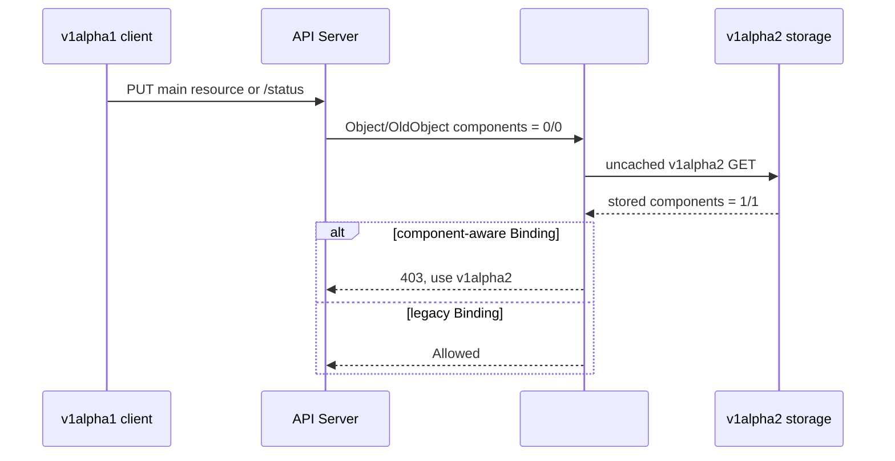

# Day 49：PR #7830 Mentor Review 与多版本写入实验

- 日期：2026-08-17
- 相关 Issue：[#7492](https://github.com/karmada-io/karmada/issues/7492)
- 相关 PR：[#7830](https://github.com/karmada-io/karmada/pull/7830)、[#7837](https://github.com/karmada-io/karmada/pull/7837)
- 实验对象：`ResourceBinding`

这份记录整理周会 mentor 对 PR #7830 的意见，以及随后完成的真实 API Server 实验。mentor 要求先暂停
功能扩展，通过实验回答 `OldObject` 是否保留 component data、`APIReader` 是否必要、v1alpha1
`/status` 是否真的会破坏 v1alpha2 storage，再决定删除或保留代码。

## 先说人话

实验确认：只要 v1alpha2 `ResourceBinding` 已经保存 component scheduling result，v1alpha1 客户端再更新
主资源或 `/status`，都有可能把这些新字段从 storage 中清空。

具体表现如下：

- v1alpha1 main request 通过 `matchPolicy: Equivalent` 进入 webhook 后，`Kind` 是 v1alpha2，
  `RequestKind` 是 v1alpha1；但 `Object` 和 `OldObject` 的 component data 都是 `0/0`。
- v1alpha1 `/status` request 进入 Exact rule 后，`Object` 和 `OldObject` 同样是 `0/0`。
- uncached v1alpha2 `APIReader.Get()` 能从 storage 读到完整的 `1/1` component data。
- 临时关闭 guard 后，两类 v1alpha1 写入都返回 200；随后 v1alpha2 GET 显示 component data 已变成
  `0/0`。
- 从未包含 component data 的 legacy Binding 仍可通过 v1alpha1 更新 main resource 和 `/status`。

因此，PR #7830 中的 v1alpha1 write guard、uncached `APIReader` 和独立 status rule 都有实验依据，不能
仅根据 webhook 已提供 `OldObject` 或 status subresource 的一般语义删除。

## 业务场景

这个风险会在后续 scheduler producer 落地后的 mixed-version upgrade 或 rollback 窗口进入正常业务路径；
当前也可以由直接写入 v1alpha2 API 的客户端构造同样状态：

1. 新版 scheduler 使用 v1alpha2，把 per-component scheduling result 写入 Binding。
2. 集群里仍有旧版 controller、自动化脚本或第三方客户端使用 v1alpha1。
3. 旧客户端只想更新 annotation 或 status condition，但 v1alpha1 schema 无法表达 component fields。
4. API Server 接受该对象并写回 v1alpha2 storage 时，无法恢复旧版本表示中已经缺失的字段。
5. 后续 scheduler 和 binding controller 读取到的 accepted component result 不完整，PR2 的 result
   delivery 也失去可靠输入。



Karmada 内建 scheduler 和相关 status controller 使用 v1alpha2，因此正常的新版本控制链不会触发该
保护。保护针对的是仍使用 v1alpha1 写入已升级对象的客户端。

## Mentor 意见与验证问题

> 先不要继续改功能代码，先把机制实验做明白。
>
> 没有实验或者明确 API contract 支持的代码，一律删。

本报告按这个要求把实验前假设和实验后结论分开：

| Mentor 要求 | 验证或处理结果 |
| --- | --- |
| #7837 合并后先 rebase，让 #7830 只保留自身职责 | 已完成；当前 PR1 是基于 master 的单个 residual commit |
| 不依赖文档猜测，实际观察 `Kind`、`RequestKind`、`Object`、`OldObject` | 已用真实 Kubernetes API Server 和 raw HTTP PUT 完成 |
| 分别测试 v1alpha2/v1alpha1 的 main resource 与 `/status` | 四组请求均已执行，结果见下表 |
| 验证 `APIReader.Get()` 是否可以删除 | 不能删除；只有 storage read 保留 component data |
| 验证 v1alpha1 `/status` 是否真的丢字段 | 已用无 guard 反事实复现 storage data loss |
| 回到 PRD，说明 producer、owner、consumer 和具体 invariant | PR1 收敛到 result validation、feature-gate rollback protection 和 legacy write protection |
| 不因结构相似而扩大 `GracefulEvictionTask`、`RequiredBy` 的协议语义 | `GracefulEvictionTask.Components` 已退出 PR1；`RequiredBy` 按 foreign snapshot 的所有权边界校验 |

mentor 提出的“`OldObject` 可能已经足够”“status strategy 可能自动保留 spec”是实验前需要验证的假设。
下面的反事实结果给出了最终取舍依据。

## 实验设计

### 环境

- PR candidate：`e1495093fcc04f6b220699eae79b08423bd0307f`
- Base：`08f8a2016f20fc68544eb7cf66f360620db859b0`
- API Server：Kubernetes `v1.34.0`，临时单节点 Kind
- CRD：`resourcebindings.work.karmada.io`
  - `v1alpha1`: `served=true`, `storage=false`
  - `v1alpha2`: `served=true`, `storage=true`
  - `conversion.strategy=None`
- Webhook：candidate 中的 `pkg/webhook/resourcebinding.ValidatingAdmission`
- Main rule：`v1alpha2 + matchPolicy: Equivalent`
- Legacy status rule：`v1alpha1 + matchPolicy: Exact`

请求通过 localhost-only `kubectl proxy` 和 raw HTTP PUT 发出。URL 与 body 的 `apiVersion` 均显式指定，
没有经过 typed client 或 hub conversion。每个 case 使用独立 ResourceBinding，初始 v1alpha2 对象都包含：

```yaml
spec:
  components:
    - name: worker
      replicas: 3
  clusters:
    - name: member1
      components:
        - name: worker
          replicas: 3
```

实验日志只记录脱敏后的请求元数据和字段摘要，包括 `Object`/`OldObject`/storage read 的长度、component
数量、SHA-256 与响应；没有记录完整 Object、annotations、status 或 `UserInfo`。临时证书、kubeconfig
和日志权限均为 `0600`，未提交到 Git。

## 四组请求结果

表中的 `1/1` 表示 `spec.components` 有 1 项，`spec.clusters[*].components` 合计有 1 项；`0/0` 表示
两处都为空。

| Case | Webhook | `Kind` | `RequestKind` | `Object` | `OldObject` | uncached v1alpha2 read | HTTP | 最终 v1alpha2 storage |
| --- | --- | --- | --- | ---: | ---: | ---: | ---: | --- |
| v1alpha2 main | 触发 | v1alpha2 | v1alpha2 | 1/1 | 1/1 | 1/1 | 200 | 1/1；annotation 写入成功 |
| v1alpha1 main | 触发 | v1alpha2 | v1alpha1 | 0/0 | 0/0 | 1/1 | 403 | 1/1；annotation 未写入 |
| v1alpha2 `/status` | 未触发 | N/A | N/A | N/A | N/A | N/A | 200 | 1/1；condition 写入成功 |
| v1alpha1 `/status` | 触发 | v1alpha1 | v1alpha1 | 0/0 | 0/0 | 1/1 | 403 | 1/1；condition 未写入 |

两条拒绝响应的 message 都是：

```text
component-aware bindings must be updated through work.karmada.io/v1alpha2
```

v1alpha1 main 的 AdmissionReview 关键字段：

```text
Kind            = work.karmada.io/v1alpha2/ResourceBinding
RequestKind     = work.karmada.io/v1alpha1/ResourceBinding
Resource        = work.karmada.io/v1alpha2/resourcebindings
RequestResource = work.karmada.io/v1alpha1/resourcebindings
Object          = v1alpha2, components 0/0
OldObject       = v1alpha2, components 0/0
APIReader GET   = v1alpha2, components 1/1
```

v1alpha1 `/status` 的 AdmissionReview 关键字段：

```text
Kind               = work.karmada.io/v1alpha1/ResourceBinding
RequestKind        = work.karmada.io/v1alpha1/ResourceBinding
SubResource        = status
RequestSubResource = status
Object              = v1alpha1, components 0/0
OldObject           = v1alpha1, components 0/0
APIReader GET       = v1alpha2, components 1/1
```

main request 进入 Equivalent rule 后，AdmissionReview 虽以 v1alpha2 GVK 表示对象，但 conversion 无法
重新生成 v1alpha1 中不存在的字段。`OldObject` 也是有损投影，不能代替 storage-state read。status
request 由 Exact rule 接收，因此 webhook 看到的是 v1alpha1 表示。

## 无 Guard 反事实

反事实沿用同一 CRD、rules、TLS 和 AdmissionReview 编码，只把 handler 临时改成记录后返回 `Allowed`。

| 请求 | AdmissionReview `Object/OldObject` | 写入结果 | 随后 v1alpha2 GET |
| --- | --- | ---: | --- |
| v1alpha1 main | 0/0，storage read 为 1/1 | 200 | component data 变为 0/0；annotation 已写入 |
| v1alpha1 `/status` | 0/0，storage read 为 1/1 | 200 | component data 变为 0/0；condition 已写入 |

这组对照构成当前实验边界内的反事实：guard 开启时请求被拒绝且 storage 保持 `1/1`；guard 关闭时同类
请求成功且 storage 变为 `0/0`。

`/status` 的结果与 Kubernetes CRD 的版本化存储机制一致：status strategy 操作的是 served-version
Store 已经解码出的 v1alpha1 旧对象。该对象无法表达 component fields，编码回 storage version 时没有
来源恢复这些字段。这段机制解释来自源码与 API 行为对照，不是 AdmissionReview JSON 单独直接观测到的
内部步骤。

## Legacy 对象控制组

恢复 candidate 的真实 guard 后，对两个从未包含 component data 的 ResourceBinding 发出 v1alpha1 请求：

| 请求 | HTTP | 最终结果 |
| --- | ---: | --- |
| v1alpha1 main | 200 | annotation 写入成功 |
| v1alpha1 `/status` | 200 | condition 写入成功 |

guard 的判定边界是 v1alpha2 storage 中是否已经存在 component data，不是统一禁止 v1alpha1 客户端。

## 对 PR #7830 的决定

### 保留

- 用 `RequestKind` 识别客户端原始版本。
- 用 uncached v1alpha2 `APIReader` 判断 storage 中是否存在 component data。
- Main resource 使用 Equivalent rule；v1alpha1 `/status` 使用 Exact rule。
- 只对 `subresource == "status"` 提前放行 v1alpha2 status；其他 subresource 不绕过 main validation。
- RB/CRB 共享的 result integrity、feature-gate rollback 和 legacy write protection。
- rebase 后由 webhook 补齐 `TargetComponent` 的 leaf validation：name 非空且不超过 32 个字符，
  `replicas >= 0`。该检查不把 API/codegen ownership 重新带回 PR1。

### 不保留

- 不修改 v1alpha1/v1alpha2 conversion 来隐藏数据丢失。
- 不把 #7837 已拥有的 API types、CRD、OpenAPI 或生成物带回 PR1。
- 不加入 `GracefulEvictionTask.Components`。
- 不提交实验 probe、临时日志、证书或 kubeconfig。
- 不在 PR1 中加入 scheduler producer、result delivery 或 scale planning；这些属于后续 PR。

当前 #7830 head 为 `bac1732e8b548a7b72e476139597a3da5a3bdbe7`，是基于 master 的单个 DCO
commit。当前 residual diff 为 9 个文件、`+1519/-11`。以下验证已在该内容上通过：

```text
go test -count=1 ./pkg/webhook/resourcebinding
go test -race -count=1 ./pkg/webhook/resourcebinding
PATH=/root/go/bin:$PATH make verify
go test -count=1 ./test/e2e/suites/base -run '^$'
```

最后一条只证明 base E2E package 可以编译，输出为 `[no tests to run]`，不是 live E2E。动态 CI 状态不在
这份实验报告中重复维护，最终状态以 [PR #7830](https://github.com/karmada-io/karmada/pull/7830) 为准。

## 证据边界

- Raw API Server 实验只执行了 namespaced `ResourceBinding`，没有把 `ClusterResourceBinding` 写成“已
  实测”。CRB 走同一 handler 和同构 rules，现有 unit/E2E source 覆盖不能替代本轮 raw experiment。
- 实验只在 Kubernetes `v1.34.0` 单节点 Kind 上执行一次。
- 这是 API Server、CRD versioning 和真实 candidate handler 的组件级实验，不是完整 Karmada 控制面
  E2E；scheduler、binding controller 和 member cluster 不在本次实验范围。
- 反事实证明这组请求会丢字段，并证明当前 guard 在该边界内阻止丢失；它不等于验证所有旧客户端和
  mixed-version deployment 组合。
- 实验结束后已停止 webhook/proxy，删除唯一临时 Kind cluster。临时 probe 不在 PR diff 中。

## 下一步

1. 单独更新 #7830 已过期的 stacked-branch 描述，并在 PR body 中准确说明 raw experiment 与 live E2E
   的边界；上游文本修改仍走 action gate。
2. 等待 maintainer review，不因缺少 producer-to-impact 因果链的环境 flake 修改 validation 逻辑。
3. PR2 只在 PR1 的 validation 与 legacy-write contract 稳定后继续推进。

## 参考资料

- [PR #7830: validate component scheduling results in bindings](https://github.com/karmada-io/karmada/pull/7830)
- [PR #7837: introduce `spec.clusters.components`](https://github.com/karmada-io/karmada/pull/7837)
- [Kubernetes Dynamic Admission Control](https://kubernetes.io/docs/reference/access-authn-authz/extensible-admission-controllers/)
- [Versions in CustomResourceDefinitions](https://kubernetes.io/docs/tasks/extend-kubernetes/custom-resources/custom-resource-definition-versioning/)
