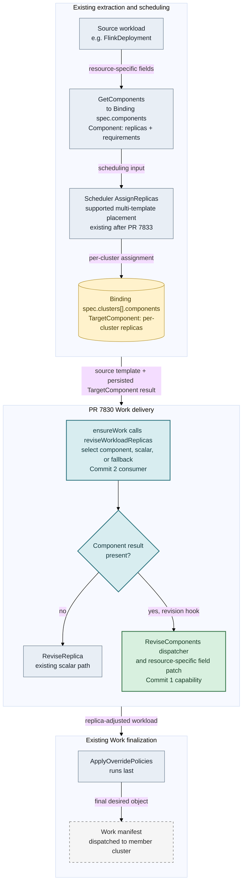

To clarify how the new operation fits the existing component path: `Component` is the scheduler input extracted from the source object, while `TargetComponent` is the per-cluster replica assignment stored in `spec.clusters[*].components`. Commit 1 adds the inverse mapping from that logical assignment back to resource-specific fields; commit 2 invokes it while generating `Work`.

No component result uses the existing scalar path. Without a `ReviseComponents` hook, delivery proceeds only when `GetComponents` returns the exact name/replica set; otherwise the controller emits no mismatched `Work`. `ApplyOverridePolicies` still runs last. The split therefore keeps the reusable capability separate from its production consumer.
