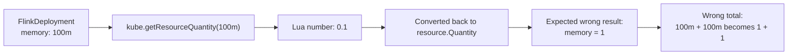
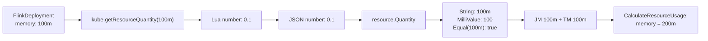

# Day 5：#7643 FlinkDeployment memory 计算问题验证

日期：2026-06-30

## 目标

跟进 upstream issue [#7643](https://github.com/karmada-io/karmada/issues/7643)：验证 `FlinkDeployment` interpreter 中 `kube.getResourceQuantity("100m")` 是否会把 memory 错误转换成 `1`，进而导致组件资源总量从 `100m + 100m = 200m` 变成错误值。

这次只做验证和证据整理。Issue 当前已经由 `@Priyanshu8023` 认领，`@zhzhuang-zju` 明确要求先提供 verification process 和 outputs，并 `/cc @ranxi2001`。

## 验证环境

- 仓库：`karmada-io/karmada`
- 验证 worktree：`/home/karmada-issue-7643`
- 分支：`verify/issue-7643`
- 基线：`upstream/master`，commit `ffbade988`
- 记录分支：`intern`

## 相关源码

- `pkg/resourceinterpreter/default/thirdparty/resourcecustomizations/flink.apache.org/v1beta1/FlinkDeployment/customizations.yaml`
  - `GetComponents` 中 JobManager memory：`jm_requires.resourceRequest.memory = kube.getResourceQuantity(jm_memory)`
  - `GetComponents` 中 TaskManager memory：`tm_requires.resourceRequest.memory = kube.getResourceQuantity(tm_memory)`
- `pkg/resourceinterpreter/customized/declarative/luavm/kube.go`
  - `getResourceQuantity()` 内部执行 `resource.MustParse(...).AsApproximateFloat64()`，并把结果作为 Lua number 返回。
- `pkg/resourceinterpreter/customized/declarative/luavm/lua_convert.go`
  - Lua table 先编码为 JSON，再反序列化到 Go 结构体。
- `pkg/util/helper/binding.go`
  - `CalculateResourceUsage()` 会通过 `aggregateComponentResources()` 对 `ResourceBinding.Spec.Components` 中的 `resource.Quantity` 做 `Mul()` 和 `Add()`。

## 第一层：函数级验证

临时新增测试文件：

- `/home/karmada-issue-7643/pkg/resourceinterpreter/customized/declarative/luavm/issue7643_verification_test.go`

执行命令：

```bash
go test ./pkg/resourceinterpreter/customized/declarative/luavm -run 'TestIssue7643' -count=1 -v
```

关键输出：

```text
resource.MustParse("100m"): String="100m" AsApproximateFloat64=0.1 Value=1 MilliValue=100
json.Unmarshal(0.1): String="100m" AsApproximateFloat64=0.1 Value=1 MilliValue=100 Equal100m=true
json.Unmarshal(1): String="1" AsApproximateFloat64=1 Value=1 MilliValue=1000 Equal100m=false
components JSON after Lua conversion: [{"name":"jobmanager","replicas":1,"replicaRequirements":{"resourceRequest":{"cpu":"150m","memory":"100m"}}}]
component memory quantity: String="100m" AsApproximateFloat64=0.1 Value=1 MilliValue=100 Equal100m=true
CalculateResourceUsage JSON: {"cpu":"300m","memory":"200m"}
memory usage: String="200m" Value=1 MilliValue=200 Equal200m=true
PASS
```

结论：

- `kube.getResourceQuantity("100m")` 返回 Lua number `0.1` 这一点成立。
- 但 Lua number `0.1` 经 JSON 反序列化到 `resource.Quantity` 后，结果是 `100m`，不是 `1`。
- `resource.Quantity.Value()` 对 `100m` 返回 `1`，这是 Kubernetes Quantity 的整数 byte 向上取整行为；不能把它理解成资源被错误转换为字符串 `"1"`。
- 判断 milli 级别值应该看 `MilliValue()` 或 `Equal(resource.MustParse("100m"))`。本次输出中 `MilliValue=100` 且 `Equal100m=true`。

## 第二层：默认 Flink interpreter 运行路径验证

临时新增测试文件：

- `/home/karmada-issue-7643/pkg/resourceinterpreter/default/thirdparty/issue7643_verification_test.go`

执行命令：

```bash
go test ./pkg/resourceinterpreter/default/thirdparty -run 'TestIssue7643FlinkDefaultCustomizationEvidence' -count=1 -v
```

测试直接加载当前默认 `FlinkDeployment/customizations.yaml`，构造：

- JobManager：`cpu=150m`，`memory=100m`，`replicas=1`
- TaskManager：`cpu=150m`，`memory=100m`，`replicas=1`

关键输出：

```text
Flink components JSON: [{"name":"jobmanager","replicas":1,"replicaRequirements":{"resourceRequest":{"cpu":"150m","memory":"100m"}}},{"name":"taskmanager","replicas":1,"replicaRequirements":{"resourceRequest":{"cpu":"150m","memory":"100m"}}}]
Flink CalculateResourceUsage JSON: {"cpu":"300m","memory":"200m"}
jobmanager memory: String="100m" Value=1 MilliValue=100 Equal100m=true
taskmanager memory: String="100m" Value=1 MilliValue=100 Equal100m=true
total memory usage: String="200m" Value=1 MilliValue=200 Equal200m=true
PASS
```

结论：

- 默认 Flink interpreter 的实际 `GetComponents` 输出中，两个组件的 memory 都是 `"100m"`。
- 后续 `CalculateResourceUsage()` 汇总结果是 `{"cpu":"300m","memory":"200m"}`。
- 因此 issue 描述中的 “100m later becomes 1 and total memory is wrong” 在当前 upstream master 上没有复现。

## 为什么现有 YAML 测试不够直接

我也尝试在 `FlinkDeployment/testdata/interpretcomponent-test.yaml` 中临时加入 `memory: 100m` 的测试用例，现有 `TestThirdPartyCustomizationsFile` 仍然通过。

原因不是 bug 一定不存在，而是当前测试框架对 `[]workv1alpha2.Component` 使用语义比较：

- 期望 YAML 会先反序列化成 `[]Component`。
- `ResourceRequest` 中的 memory 变成 `resource.Quantity`。
- 比较时使用 `resource.Quantity.Equal()`，检查的是资源数值语义，不检查原始字符串格式。

所以这类测试适合确认资源数值是否正确，不适合证明 `100m` 这个输入字符串是否原样保留。

## 当前判断

截至 `upstream/master@ffbade988`，我认为 #7643 的 bug 描述没有被验证为真实问题。

更准确的说法是：

- `getResourceQuantity("100m")` 确实把 Kubernetes quantity 转成 Lua number `0.1`。
- 但当前 Karmada 的 Lua -> Go 转换链路可以把 JSON number `0.1` 正确反序列化为 `resource.Quantity("100m")`。
- `Quantity.Value()` 返回 `1` 是显示/取整接口行为，不等于 ResourceBinding 中写入了错误 memory。
- 实际 Flink `GetComponents` + `CalculateResourceUsage` 路径输出的是 `100m` 和 `200m`。

## 对 issue 的建议回复方向

因为 issue 已有人认领，不建议直接开重复 PR。

建议在 issue 下回复验证证据，核心内容可以是：

```md
I verified this on upstream/master (`ffbade988`) with both a function-level check and the default FlinkDeployment third-party customization path.

Findings:
- `kube.getResourceQuantity("100m")` returns Lua number `0.1`.
- When that value is converted back into `resource.Quantity`, JSON number `0.1` becomes `100m`, not `1`.
- `Quantity.Value()` returns `1` for `100m` because it rounds up to the nearest integer byte. `MilliValue()` returns `100`, and `Equal(resource.MustParse("100m"))` is true.
- Running the default FlinkDeployment customization with JM/TM memory `100m` produced component JSON with both memories as `"100m"`.
- `helper.CalculateResourceUsage()` then produced `{"cpu":"300m","memory":"200m"}`.

So I cannot reproduce the reported incorrect total memory on current upstream/master. The proposed change may still be a readability improvement, but the verification output does not show a functional bug in the current conversion path.
```

发布前需要用户确认完整英文文本。不要擅自评论 upstream issue。

## 可直接复制的 upstream 评论草稿

下面这版用于直接贴到 [#7643](https://github.com/karmada-io/karmada/issues/7643) 评论区。它比上一节更完整，包含 Mermaid 图和验证输出，方便解释“issue 担心的路径”和“实际验证到的路径”的差异。

````md
I took a closer look at this on current upstream/master (`ffbade988`). Based on the verification below, I cannot reproduce the reported incorrect memory calculation.

The concern in this issue is understandable. The suspected path is:



But what I observed on current master is:



## What I verified

### 1. Function-level conversion

I added a temporary local test around `resource.Quantity` and the Lua conversion path.

Command:

```bash
go test ./pkg/resourceinterpreter/customized/declarative/luavm -run 'TestIssue7643' -count=1 -v
```

Relevant output:

```text
resource.MustParse("100m"): String="100m" AsApproximateFloat64=0.1 Value=1 MilliValue=100
json.Unmarshal(0.1): String="100m" AsApproximateFloat64=0.1 Value=1 MilliValue=100 Equal100m=true
json.Unmarshal(1): String="1" AsApproximateFloat64=1 Value=1 MilliValue=1000 Equal100m=false
components JSON after Lua conversion: [{"name":"jobmanager","replicas":1,"replicaRequirements":{"resourceRequest":{"cpu":"150m","memory":"100m"}}}]
component memory quantity: String="100m" AsApproximateFloat64=0.1 Value=1 MilliValue=100 Equal100m=true
CalculateResourceUsage JSON: {"cpu":"300m","memory":"200m"}
memory usage: String="200m" Value=1 MilliValue=200 Equal200m=true
PASS
```

The important detail is that `Quantity.Value()` returning `1` for `100m` does not mean the stored quantity became `"1"`. It is the rounded-up integer value in base units. For this case, `MilliValue()` is `100`, and `Equal(resource.MustParse("100m"))` is true.

### 2. Default FlinkDeployment customization path

I also loaded the current default `FlinkDeployment/customizations.yaml` and ran `GetComponents` with both JobManager and TaskManager memory set to `100m`.

Command:

```bash
go test ./pkg/resourceinterpreter/default/thirdparty -run 'TestIssue7643FlinkDefaultCustomizationEvidence' -count=1 -v
```

Relevant output:

```text
Flink components JSON: [{"name":"jobmanager","replicas":1,"replicaRequirements":{"resourceRequest":{"cpu":"150m","memory":"100m"}}},{"name":"taskmanager","replicas":1,"replicaRequirements":{"resourceRequest":{"cpu":"150m","memory":"100m"}}}]
Flink CalculateResourceUsage JSON: {"cpu":"300m","memory":"200m"}
jobmanager memory: String="100m" Value=1 MilliValue=100 Equal100m=true
taskmanager memory: String="100m" Value=1 MilliValue=100 Equal100m=true
total memory usage: String="200m" Value=1 MilliValue=200 Equal200m=true
PASS
```

So the actual path I observed is:

```text
100m -> kube.getResourceQuantity(...) -> Lua number 0.1 -> resource.Quantity("100m")
JM 100m + TM 100m -> CalculateResourceUsage -> memory 200m
```

## Current conclusion

I do not see a functional bug in the current conversion path on `upstream/master@ffbade988`.

The proposed change:

```lua
jm_requires.resourceRequest.memory = jm_memory
tm_requires.resourceRequest.memory = tm_memory
```

may still be a readability improvement, because memory assignment does not need a numeric conversion. But based on the outputs above, I do not think the current evidence proves that memory is actually calculated incorrectly.

Could you share the exact failing output or the downstream path where the value becomes `"1"` instead of `"100m"`?
````

## 后续动作

1. 清理验证 worktree 中的临时测试文件和临时 YAML case。
2. 如果 maintainer 仍认为这里需要改动，建议要求更具体的失败路径：是 ResourceBinding JSON、FRQ quota used、scheduler estimator，还是其他外部 consumer 读取了 `Quantity.Value()`。
3. 如果只是希望避免 `kube.getResourceQuantity()` 用于赋值时造成误解，可以考虑把 `GetComponents` 中 memory 赋值改成原始字符串，并补充一个直接 marshal JSON 的测试；但这属于可读性/防误用改动，不是当前证据支持的 bugfix。
