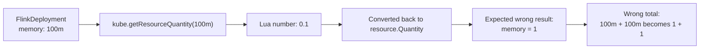
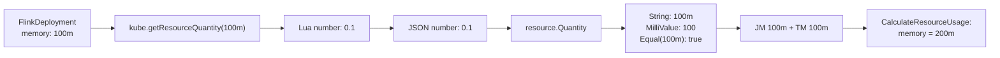

# Day 5：#7643 FlinkDeployment memory 计算问题验证

日期：2026-06-30

## 目标

跟进 upstream issue [#7643](https://github.com/karmada-io/karmada/issues/7643)：验证 `FlinkDeployment` interpreter 中 `kube.getResourceQuantity("100m")` 是否会把 memory 错误转换成 `1`，进而导致组件资源总量从 `100m + 100m = 200m` 变成错误值。

这次只做验证和证据整理。Issue 当前已经由 `@Priyanshu8023` 认领，`@zhzhuang-zju` 明确要求先提供 verification process 和 outputs，并 `/cc @ranxi2001`。

## 给自己看的通俗解释

这个 issue 一开始容易绕晕，是因为中间跨了两种语言和两套数据表示：

- Lua 脚本里没有 Kubernetes 的 `resource.Quantity` 这种 Go 类型。
- Go 代码最终需要拿到 `[]workv1alpha2.Component`，里面的 `resourceRequest.memory` 又必须是 Kubernetes 的 `resource.Quantity`。
- 所以 Karmada 的 interpreter 做法是：Lua 先返回普通 Lua table，然后 Go 把 Lua table 编成 JSON，再把 JSON 反序列化到 Go 结构体。

可以把它理解成一次“跨语言搬家”：

```text
FlinkDeployment YAML
  -> Lua 脚本读字段并组装 Lua table
  -> Lua table 序列化成 JSON
  -> JSON 反序列化成 Go 的 []Component
  -> Component.ResourceRequest.memory 变成 resource.Quantity
```

为什么要序列化 / 反序列化？

因为 Lua table 和 Go struct 不是同一种内存对象，Go 不能直接把 Lua table 当成 `[]Component` 用。JSON 是中间格式：Lua table 先转成 JSON 字节，Go 再按目标结构体字段和类型解析 JSON。这样 `resourceRequest.memory` 这个字段就能触发 Kubernetes `resource.Quantity` 自己的 JSON 解析逻辑。

这正是本 issue 的关键点。作者担心的是：

```text
"100m" -> kube.getResourceQuantity -> 0.1 -> JSON/Go -> "1"
```

但我们验证到的是：

```text
"100m" -> kube.getResourceQuantity -> 0.1 -> JSON number 0.1 -> resource.Quantity("100m")
```

也就是说，中间确实变成了 Lua number `0.1`，但 Go 反序列化回 `resource.Quantity` 时，`0.1` 会被 Kubernetes 正确解析成 `100m`。后面真正写入 component JSON 的还是 `"100m"`，两个组件汇总出来也是 `"200m"`。

这里和 `Quantity.Value()` 有关系，因为 issue 作者看到的“变成 1”很可能就是从 `Quantity.Value()` 这个观察角度来的。

链路是这样：

```text
Lua 里：
"100m" -> kube.getResourceQuantity("100m") -> 0.1

Go 里：
JSON number 0.1 -> resource.Quantity
```

关键在第二步：Kubernetes 的 `resource.Quantity` 可以从 JSON number 解析。`0.1` 不是普通 float 留在那里，而是被解析成一个 Quantity，语义上就是 `100m`。

所以 Go 里的对象不是：

```text
memory = 0.1
```

而是：

```text
memory = resource.Quantity("100m")
```

但如果你对这个 Quantity 调：

```go
q.Value()
```

它会返回：

```text
1
```

因为 `Value()` 的语义是“返回向上取整后的整数 base unit”。`100m` 等于 `0.1` 个 base unit，向上取整就是 `1`。

所以误解来源大概是：

```text
看到 kube.getResourceQuantity("100m") -> 0.1
又看到 Quantity.Value() -> 1
于是以为 0.1 最后变成了错误的 memory=1
```

但真实情况是：

```text
resource.Quantity("100m").Value() == 1
resource.Quantity("100m").String() == "100m"
resource.Quantity("100m").MilliValue() == 100
resource.Quantity("100m").Equal(resource.MustParse("100m")) == true
```

也就是说，`Value() == 1` 只是这个对象的一个“整数取值视角”，不是它最终序列化出来的资源值。

我们确实传输了 `0.1` 这种不带单位的数字，但 Go 反序列化到 `resource.Quantity` 时会把它按 Kubernetes Quantity 规则解析成 `100m`。如果最终真的错了，JSON 输出会是：

```json
"memory": "1"
```

但我们验证看到的是：

```json
"memory": "100m"
```

所以这个 issue 的误会点就是：把 `Quantity.Value()` 的整数结果，当成了最终资源 JSON 里的 memory 值。

所以这个 issue 的学习点是：不要只看 `Value()` 就判断资源被算错了，要沿着 Lua -> JSON -> Go struct -> resource.Quantity -> resource usage 的完整链路验证。

## 验证环境

- 仓库：`karmada-io/karmada`
- 验证 worktree：`/home/karmada-issue-7643`
- 初始临时分支：`verify/issue-7643`
- 证据分支：[`ranxi2001/karmada@verify/issue-7643-evidence`](https://github.com/ranxi2001/karmada/tree/verify/issue-7643-evidence)
- 证据提交：[`46d0ba9be`](https://github.com/ranxi2001/karmada/commit/46d0ba9bef5781cd2364db7134659234e48846a8) `test: add flink memory conversion evidence`
- 基线：`upstream/master`，commit `ffbade988`
- 记录分支：`intern`

## 相关源码

- `pkg/resourceinterpreter/default/thirdparty/resourcecustomizations/flink.apache.org/v1beta1/FlinkDeployment/customizations.yaml`
  - `GetComponents` 中 JobManager memory：`jm_requires.resourceRequest.memory = kube.getResourceQuantity(jm_memory)`
  - `GetComponents` 中 TaskManager memory：`tm_requires.resourceRequest.memory = kube.getResourceQuantity(tm_memory)`
- `pkg/resourceinterpreter/customized/declarative/luavm/kube.go`
  - `getResourceQuantity()` 内部执行 `resource.MustParse(...).AsApproximateFloat64()`，并把结果作为 Lua number 返回。
- `pkg/resourceinterpreter/customized/declarative/luavm/lua_convert.go`
  - Lua table 先编码为 JSON，再反序列化到 Go 结构体。
- `pkg/util/helper/binding.go`
  - `CalculateResourceUsage()` 会通过 `aggregateComponentResources()` 对 `ResourceBinding.Spec.Components` 中的 `resource.Quantity` 做 `Mul()` 和 `Add()`。

## 第一层：函数级验证

证据分支新增测试文件：

- `/home/karmada-issue-7643/pkg/resourceinterpreter/customized/declarative/luavm/issue7643_verification_test.go`

执行命令：

```bash
go test ./pkg/resourceinterpreter/customized/declarative/luavm -run 'TestIssue7643' -count=1 -v
```

关键输出：

```text
resource.MustParse("100m"): String="100m" AsApproximateFloat64=0.1 Value=1 MilliValue=100
json.Unmarshal(0.1): String="100m" AsApproximateFloat64=0.1 Value=1 MilliValue=100 Equal100m=true
json.Unmarshal(1): String="1" AsApproximateFloat64=1 Value=1 MilliValue=1000 Equal100m=false
components JSON after Lua conversion: [{"name":"jobmanager","replicas":1,"replicaRequirements":{"resourceRequest":{"cpu":"150m","memory":"100m"}}}]
component memory quantity: String="100m" AsApproximateFloat64=0.1 Value=1 MilliValue=100 Equal100m=true
CalculateResourceUsage JSON: {"cpu":"300m","memory":"200m"}
memory usage: String="200m" Value=1 MilliValue=200 Equal200m=true
PASS
```

结论：

- `kube.getResourceQuantity("100m")` 返回 Lua number `0.1` 这一点成立。
- 但 Lua number `0.1` 经 JSON 反序列化到 `resource.Quantity` 后，结果是 `100m`，不是 `1`。
- `resource.Quantity.Value()` 对 `100m` 返回 `1`，这是 Kubernetes Quantity 的整数 byte 向上取整行为；不能把它理解成资源被错误转换为字符串 `"1"`。
- 判断 milli 级别值应该看 `MilliValue()` 或 `Equal(resource.MustParse("100m"))`。本次输出中 `MilliValue=100` 且 `Equal100m=true`。

## 第二层：默认 Flink interpreter 运行路径验证

证据分支新增测试文件：

- `/home/karmada-issue-7643/pkg/resourceinterpreter/default/thirdparty/issue7643_verification_test.go`

执行命令：

```bash
go test ./pkg/resourceinterpreter/default/thirdparty -run 'TestIssue7643FlinkDefaultCustomizationEvidence' -count=1 -v
```

测试直接加载当前默认 `FlinkDeployment/customizations.yaml`，构造：

- JobManager：`cpu=150m`，`memory=100m`，`replicas=1`
- TaskManager：`cpu=150m`，`memory=100m`，`replicas=1`

关键输出：

```text
Flink components JSON: [{"name":"jobmanager","replicas":1,"replicaRequirements":{"resourceRequest":{"cpu":"150m","memory":"100m"}}},{"name":"taskmanager","replicas":1,"replicaRequirements":{"resourceRequest":{"cpu":"150m","memory":"100m"}}}]
Flink CalculateResourceUsage JSON: {"cpu":"300m","memory":"200m"}
jobmanager memory: String="100m" Value=1 MilliValue=100 Equal100m=true
taskmanager memory: String="100m" Value=1 MilliValue=100 Equal100m=true
total memory usage: String="200m" Value=1 MilliValue=200 Equal200m=true
PASS
```

结论：

- 默认 Flink interpreter 的实际 `GetComponents` 输出中，两个组件的 memory 都是 `"100m"`。
- 后续 `CalculateResourceUsage()` 汇总结果是 `{"cpu":"300m","memory":"200m"}`。
- 因此 issue 描述中的 “100m later becomes 1 and total memory is wrong” 在当前 upstream master 上没有复现。

## 为什么现有 YAML 测试不够直接

我也尝试在 `FlinkDeployment/testdata/interpretcomponent-test.yaml` 中临时加入 `memory: 100m` 的测试用例，现有 `TestThirdPartyCustomizationsFile` 仍然通过。

原因不是 bug 一定不存在，而是当前测试框架对 `[]workv1alpha2.Component` 使用语义比较：

- 期望 YAML 会先反序列化成 `[]Component`。
- `ResourceRequest` 中的 memory 变成 `resource.Quantity`。
- 比较时使用 `resource.Quantity.Equal()`，检查的是资源数值语义，不检查原始字符串格式。

所以这类测试适合确认资源数值是否正确，不适合证明 `100m` 这个输入字符串是否原样保留。

## 当前判断

截至 `upstream/master@ffbade988`，我认为 #7643 的 bug 描述没有被验证为真实问题。

更准确的说法是：

- `getResourceQuantity("100m")` 确实把 Kubernetes quantity 转成 Lua number `0.1`。
- 但当前 Karmada 的 Lua -> Go 转换链路可以把 JSON number `0.1` 正确反序列化为 `resource.Quantity("100m")`。
- `Quantity.Value()` 返回 `1` 是显示/取整接口行为，不等于 ResourceBinding 中写入了错误 memory。
- 实际 Flink `GetComponents` + `CalculateResourceUsage` 路径输出的是 `100m` 和 `200m`。

## 对 issue 的建议回复方向

因为 issue 已有人认领，不建议直接开重复 PR。

建议在 issue 下回复验证证据，核心内容可以是：

````md
I think the key point is the conversion boundary between Lua and Go:

```text
Lua:
"100m" -> kube.getResourceQuantity("100m") -> 0.1

Go:
JSON number 0.1 -> resource.Quantity
```

At the Go side, JSON number `0.1` is not kept as a plain float. It is unmarshaled into Kubernetes `resource.Quantity`, and semantically it becomes `100m`.

So the resulting Go object is not:

```text
memory = 0.1
```

It is:

```text
memory = resource.Quantity("100m")
```

One confusing part is `Quantity.Value()`. For `resource.Quantity("100m")`, `Value()` returns `1` because it returns the rounded-up integer value in base units. That does not mean the final serialized resource value became `"1"`.

The checks I observed are:

```text
resource.Quantity("100m").Value() == 1
resource.Quantity("100m").String() == "100m"
resource.Quantity("100m").MilliValue() == 100
resource.Quantity("100m").Equal(resource.MustParse("100m")) == true
```

If the reported issue were happening, I would expect the component JSON to contain:

```json
"memory": "1"
```

But the actual default FlinkDeployment customization output is:

```json
"memory": "100m"
```

And `helper.CalculateResourceUsage()` produces:

```json
{"cpu":"300m","memory":"200m"}
```

So I cannot reproduce the reported incorrect total memory on current upstream/master. The proposed change may still be a readability improvement, because memory assignment does not need numeric conversion, but the verification output does not show a functional bug in the current conversion path.
````

发布前需要用户确认完整英文文本。不要擅自评论 upstream issue。

## 可直接复制的 upstream 评论草稿

下面这版用于直接贴到 [#7643](https://github.com/karmada-io/karmada/issues/7643) 评论区。它比上一节更完整，包含 Mermaid 图和验证输出，方便解释“issue 担心的路径”和“实际验证到的路径”的差异。

````md
I took a closer look at this on current upstream/master (`ffbade988`). Based on the verification below, I cannot reproduce the reported incorrect memory calculation.

For reproducibility, I pushed the evidence tests to my fork:

- Branch: https://github.com/ranxi2001/karmada/tree/verify/issue-7643-evidence
- Commit: https://github.com/ranxi2001/karmada/commit/46d0ba9bef5781cd2364db7134659234e48846a8

The concern in this issue is understandable. The suspected path is:



But what I observed on current master is:



## What I verified

### 1. Function-level conversion

I added an evidence test around `resource.Quantity` and the Lua conversion path.

Command:

```bash
go test ./pkg/resourceinterpreter/customized/declarative/luavm -run 'TestIssue7643' -count=1 -v
```

Relevant output:

```text
resource.MustParse("100m"): String="100m" AsApproximateFloat64=0.1 Value=1 MilliValue=100
json.Unmarshal(0.1): String="100m" AsApproximateFloat64=0.1 Value=1 MilliValue=100 Equal100m=true
json.Unmarshal(1): String="1" AsApproximateFloat64=1 Value=1 MilliValue=1000 Equal100m=false
components JSON after Lua conversion: [{"name":"jobmanager","replicas":1,"replicaRequirements":{"resourceRequest":{"cpu":"150m","memory":"100m"}}}]
component memory quantity: String="100m" AsApproximateFloat64=0.1 Value=1 MilliValue=100 Equal100m=true
CalculateResourceUsage JSON: {"cpu":"300m","memory":"200m"}
memory usage: String="200m" Value=1 MilliValue=200 Equal200m=true
PASS
```

The important detail is that `Quantity.Value()` returning `1` for `100m` does not mean the stored quantity became `"1"`. It is the rounded-up integer value in base units. For this case, `MilliValue()` is `100`, and `Equal(resource.MustParse("100m"))` is true.

### 2. Default FlinkDeployment customization path

I also loaded the current default `FlinkDeployment/customizations.yaml` in the evidence branch and ran `GetComponents` with both JobManager and TaskManager memory set to `100m`.

Command:

```bash
go test ./pkg/resourceinterpreter/default/thirdparty -run 'TestIssue7643FlinkDefaultCustomizationEvidence' -count=1 -v
```

Relevant output:

```text
Flink components JSON: [{"name":"jobmanager","replicas":1,"replicaRequirements":{"resourceRequest":{"cpu":"150m","memory":"100m"}}},{"name":"taskmanager","replicas":1,"replicaRequirements":{"resourceRequest":{"cpu":"150m","memory":"100m"}}}]
Flink CalculateResourceUsage JSON: {"cpu":"300m","memory":"200m"}
jobmanager memory: String="100m" Value=1 MilliValue=100 Equal100m=true
taskmanager memory: String="100m" Value=1 MilliValue=100 Equal100m=true
total memory usage: String="200m" Value=1 MilliValue=200 Equal200m=true
PASS
```

So the actual path I observed is:

```text
100m -> kube.getResourceQuantity(...) -> Lua number 0.1 -> resource.Quantity("100m")
JM 100m + TM 100m -> CalculateResourceUsage -> memory 200m
```

## Current conclusion

I do not see a functional bug in the current conversion path on `upstream/master@ffbade988`.

The proposed change:

```lua
jm_requires.resourceRequest.memory = jm_memory
tm_requires.resourceRequest.memory = tm_memory
```

may still be a readability improvement, because memory assignment does not need a numeric conversion. But based on the outputs above, I do not think the current evidence proves that memory is actually calculated incorrectly.

Could you share the exact failing output or the downstream path where the value becomes `"1"` instead of `"100m"`?
````

## 后续动作

1. 清理验证 worktree 中的临时测试文件和临时 YAML case。
2. 如果 maintainer 仍认为这里需要改动，建议要求更具体的失败路径：是 ResourceBinding JSON、FRQ quota used、scheduler estimator，还是其他外部 consumer 读取了 `Quantity.Value()`。
3. 如果只是希望避免 `kube.getResourceQuantity()` 用于赋值时造成误解，可以考虑把 `GetComponents` 中 memory 赋值改成原始字符串，并补充一个直接 marshal JSON 的测试；但这属于可读性/防误用改动，不是当前证据支持的 bugfix。
