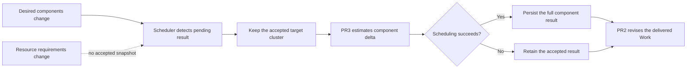

# Day 51：#7492 PR4 本地集成与提交前审计

- 日期：2026-08-16
- Issue：[#7492](https://github.com/karmada-io/karmada/issues/7492)
- PR0：[#7837](https://github.com/karmada-io/karmada/pull/7837)，`76589a9d514543edc8c8ca47174cff360d3b832e`
- PR1：[#7830](https://github.com/karmada-io/karmada/pull/7830)，`6ff28fe4a1d42b8a7980e60e0276306731c15656`
- PR2：[#7833](https://github.com/karmada-io/karmada/pull/7833)，`98535c5413cca7a697ee754934d4d3a147f90597`
- PR3：[#7835](https://github.com/karmada-io/karmada/pull/7835)，`782232b7db4455b7339b669978a6e799753528df`
- PR4 prototype：`f54f228d7d59d0a9529196e525c58f6c29c5df3e`
- 本轮边界：只建立和验证本地 integration candidate；不更新 fork branch，不创建 PR，不修改 GitHub 文本

## 先说人话

PR4 要提前准备，但当前 prototype 只能先作为“可重放的集成基线”，还不能作为“可以推送的 PR4”。它同时
使用 PR1 的结果写入保护、PR2 的组件结果交付路径和 PR3 的增量估算器；缺少任意一边，源码都不能形成完整
的生产合同。

具体例子：FlinkDeployment 已在 `member1` 接受 `jobmanager=1, taskmanager=4`，用户把
`taskmanager` 改为 6。PR3 只负责算“新增 2 个 taskmanager 是否还能放进 member1”；PR2 只负责把最终
接受的组件结果写进 Work。PR4 才负责发现这次变化、只保留 `member1` 作为候选、调用 PR3、成功后更新
`TargetCluster.Components`，失败时继续保留旧的 `1/4` 结果，让 PR2 仍按旧值交付。

预重放审计还发现一个更关键的例子：如果 `taskmanager` 从 `4 x 100m` 同时改成 `6 x 500m`，当前结果 API
只保存组件名和副本数。调度成功时，PR4 只检查新增的 `2 x 500m`，PR2 随后交付 `6 x 500m`；调度失败时，
PR2 会把副本数回退到 4，但仍可能交付 `4 x 500m`。API 中没有“已接受的旧资源需求”可供比较或恢复，这个
缺口不能靠 ancestry 重排修好。

因此本轮只做一个本地组合分支：在 PR0 后依次复制 PR1、PR2、PR3 residual，再原样重放 PR4 residual，证明
组合、编译和现有测试状态。远端 PR1/PR2/PR3 仍是 PR0 的 sibling；本地通过不代表 PR4 已具备推送条件。

## 当前与目标历史

```text
Old prototype:
1d954fcf8 -> c0b68f728 -> 1d2ee95c4 -> b1c41a584 -> f54f228d7

Current remote PRs:
a957f64d5 -> 76589a9d5 (PR0)
                  |-> 6ff28fe4a (PR1)
                  |-> 98535c541 (PR2)
                  `-> 782232b7d (PR3)

Local integration candidate:
a957f64d5 -> 76589a9d5 -> <PR1 copy> -> <PR2 copy> -> <PR3 copy> -> <PR4 replay>
```

PR4 的 upstream 最终基线仍应是同时包含 PR1、PR2、PR3 的 future `master`。本地 integration copy 只是提前证明
组合后的代码和测试，不作为新的公共 stack，也不用于通知 reviewer。

## 运行流程



调度器（`karmada-scheduler`）拥有 placement decision 和 schedule status；binding controller 只消费已经持久化
的 `spec.clusters[*].components`。prototype 的目标是在估算失败后保留已接受结果，但当前结果只覆盖副本数，
无法阻止 binding controller 从最新 source template 交付新的资源需求。binding controller 仍不应扩展成新的调度
或重试 owner。

## 依赖与等价性证据

- PR4 residual 是 1 个 DCO commit，12 文件 `+1045/-34`，patch-id
  `2ce0d6e61750d35d4a95438ca644e87a4a0728b7`。
- PR1 是语义依赖：它阻止非法或旧版本写入破坏 `TargetCluster.Components`。PR4 自己只验证 scheduler
  输出，不能替代 API admission 边界。
- 它硬依赖 PR2 的 `ReviseComponents`、`reviseWorkloadReplicas`、组件结果生成和交付语义。
- 它硬依赖 PR3 的 `calculateMultiTemplateAvailableSetsForScale` 与
  `IsBindingComponentsChanged`。
- PR1、PR2、PR3 residual 两两没有手写文件交集，可以先在本地组成 integration base。
- 对 PR4 修改的 12 个文件，旧 parent `b1c41a584` 与“当前 PR2 文件 + 当前 PR3 文件”的内容逐文件相同；
  PR1 不修改这些文件。因此先组合三个依赖 residual 后，PR4 应当无语义冲突并保持 patch-id；若实际结果不满足，
  立即停止。

## 文件范围

| 文件 / 区域 | 本轮保留的 PR4 行为 | 风险 | 验证 |
| --- | --- | --- | --- |
| `pkg/controllers/binding/common.go` 及测试 | 有组件请求但无结果时停止交付；有旧结果时按旧结果执行 `ReviseComponents` | 只恢复副本数，新的资源需求仍可传播 | source audit blocker、binding focused race tests |
| `pkg/scheduler/core/common.go` 及测试 | component scale 必须满足当前 target 的增量容量 | 选择容量不足的集群 | core focused race tests |
| `pkg/scheduler/core/estimation_test.go` | 证明 scale option 接到 PR3 planner | 仍走 full-desired estimator | core focused race tests |
| `pkg/scheduler/core/generic_scheduler.go`、`util.go` 及测试 | 只保留已接受 target，并把 scale mode 传给 estimator | 整体迁移到其他集群或错误估算 | core focused race tests |
| `pkg/scheduler/scheduler.go` 及测试 | 检测 transition、拒绝不支持的形状、验证结果、失败保留、带 resourceVersion 前置条件 patch | 状态/缓存与 API patch 不一致 | scheduler focused race tests |
| `pkg/util/binding.go` 及测试 | 区分 same-name monotonic scale、pending result 和 accepted result | 漏触发或把非 scale 变更误判为 scale | util focused race tests |

## 明确不改

- 不修改 PR0、PR2、PR3 或现有 PR4 fork branch 的远端 SHA。
- 不把 PR4 直接重放到 PR0，也不伪造它是 independent residual。
- 不在机械重放 commit 中新增 API、CRD、generated code、feature gate、interpreter、third-party customization
  或 Flink E2E；PR1/PR2 已有文件只作为依赖原样复制。
- 不顺带修复 #7835 当前 v1.35 E2E failure；该失败需要单独按 job/log 分类。
- 不在 ancestry 重排中重写 scheduler 状态机、扩大支持的 scale shape 或新增重试/直接 API read。
- 不把 maintainer Draft 的 “PR4 = third-party scripts + Flink E2E” 与现有 `f54f228d7` 的行为 scope 写成同一层。

## 实现顺序

1. 在 `/home/ranxi/projects/karmada-pr4-integration` 重建 branch
   `pr4-local-integration-on-pr0-pr1-pr2-pr3`，起点为 PR0 `76589a9d5`。
2. 依次 cherry-pick PR1 `6ff28fe4a`、PR2 `98535c541`、PR3 `782232b7d`，要求每个 residual 的
   range-diff/patch-id 等价且 author/sign-off 保持。
3. cherry-pick PR4 `f54f228d7`，要求 12 文件 residual 与旧 commit 等价；若冲突或 patch-id 改变则停止。
4. 核对最终 ancestry 只有 PR0 与四个 current residual，不含旧 `c0b68f728`、`1d2ee95c4`、
   `b1c41a584` 的 stacked ancestors。
5. 先运行 focused race tests，再运行 base E2E package compile、`make verify` 和 `git diff --check`。
6. 只更新 `intern` 记录并推送 `origin/intern`；source branch 留在本地。

## 验证计划

| 层级 | 命令 | 证明范围 |
| --- | --- | --- |
| residual 等价 | `git range-diff`、`git patch-id --stable` | PR1/PR2/PR3/PR4 重放没有静默改变行为 |
| focused race | `go test -race -count=1 ./pkg/scheduler/core ./pkg/scheduler ./pkg/controllers/binding ./pkg/util` | scheduler routing、estimation、failure retention、Work delivery 和 predicate |
| E2E compile | `go test -count=1 ./test/e2e/suites/base -run '^$'` | 现有 base E2E 调用面仍可编译；不等于 live E2E |
| repository verify | `GOMODCACHE=/home/ranxi/go/pkg/mod make verify` | staticcheck、格式、vendor、generated artifacts 与 license 无漂移 |
| patch hygiene | `git diff --check 76589a9d5..HEAD` | 完整 candidate 无 whitespace error |

PR4 改动 production scheduler 且 residual 较大；若 focused/verify 通过且时间允许，再决定是否需要完整
`make test`。没有 live multi-cluster E2E 时，不能把本地结果写成端到端行为证明；现有测试即使全绿，也不会
推翻下面的源码合同缺口。

## 预重放高风险审计

### 阻塞项：已接受结果没有资源需求快照

`Component` 保存 `ReplicaRequirements`，但 `TargetComponent` 只保存 `Name` 与 `Replicas`。PR4 的
`IsBindingComponentResultChanged`、`IsBindingComponentsAccepted` 和 transition routing 也只比较名称与副本数。
这会形成两条可达路径：

1. 只改资源需求、不改副本数时，scheduler 会把新 generation 修复成 `Scheduled=True`，不重新估算。
2. 同时改资源需求和副本数时，PR3 只估算新增副本；PR2 却把最新资源需求应用到旧副本和新增副本。

因此当前 API 既不能证明“资源需求稳定”，也不能恢复旧资源需求。正确修复必须先选择并获得维护者认可：
把已接受的资源需求或 revision 纳入结果模型，或者明确拒绝这类 transition 并提供可验证的识别标记。在这个
合同决定前，本地 branch 只证明 prototype 的原样组合状态，不能推送。

### 待确认边界

- 当前 target 仍存在但因 affinity、taint 或其他 filter 变为不可选时，scale path 会固定旧 target 并持续
  返回 `FitError`，不会转入普通 failover。这可能符合“扩缩容不得迁移整个应用”的安全方向，但缺少明确
  precedence 合同和带真实 filter 的回归测试，不能自行改成迁移。
- 被明确拒绝的 scale transition 会写 `Scheduled=False`，随后把内部错误转成 `nil`，队列不会重试；当前
  metrics 会把它统计为成功且不会发失败 event。这不改变 Work，但降低可观测性，至少需要独立测试和设计决定。

## 本地集成结果

本地 branch 为 `pr4-local-integration-on-pr0-pr1-pr2-pr3`，source worktree 位于
`/home/ranxi/projects/karmada-pr4-integration`。最终历史为：

```text
76589a9d5  PR0 current head
efc798b9f  PR1 integration copy
9b9a4504c  PR2 integration copy
ea8782509  PR3 integration copy
d005826b1  PR4 prototype replay
```

四个 residual 的 `git range-diff` 均为 `=`，patch-id 分别保持为 `95394cbe4`、`ba61f0270`、
`e2132d5cf` 和 `2ce0d6e61`。四个 commit 的 author 与 `Signed-off-by` 匹配；旧 `c0b68f728`、
`1d2ee95c4`、`b1c41a584` 均不在新 ancestry。PR4 residual 仍是 12 文件 `+1045/-34`，完整组合相对
PR0 为 58 文件 `+4400/-86`。

| 验证 | 结果 | 证据边界 |
| --- | --- | --- |
| 四组 binding / scheduler core / scheduler / util focused race tests | 通过 | 覆盖现有 routing、增量估算、失败保留、交付和 predicate cases |
| `go test -race -count=1 ./pkg/scheduler/... ./pkg/util ./pkg/controllers/binding` | 通过 | 覆盖 PR4 主要 runtime packages |
| PR1/PR2 dependency surfaces race tests | 通过 | 覆盖 detector、interpreter、webhook 和 `karmadactl interpret` 组合 |
| `go test -count=1 ./test/e2e/suites/base -run '^$'` | 通过，无测试执行 | 只证明 base E2E package 可编译 |
| `GOMODCACHE=/home/ranxi/go/pkg/mod make verify` | 通过 | staticcheck、gofmt、vendor、mocks、Swagger、CRD、codegen 与 license 无漂移 |
| `git diff --check 76589a9d5..HEAD` | 通过 | 完整本地组合无 whitespace error |

没有运行 live Flink E2E，也没有运行完整 `make test`。现有 focused/package tests 已证明机械组合没有已知回归；
完整 `make test` 不能改变已由生产路径和源码证明的资源需求阻塞结论，因此本轮停止扩大测试范围。

远端 `origin/feature/multi-component-failure-safe-rescheduling` 仍是 `f54f228d7`，没有 source push、PR、正文或
评论更新。#7833 current SHA 的 17 个 checks 全部成功；#7835 current SHA 有 16 个成功、1 个
`e2e test (v1.35.0)` 失败，本轮未诊断，也未把它与 PR4 绑定。

## 结论与下一步

PR4 的本地机械集成已经完成，当前状态仍是“阻塞，不能推送”。下一步需要先决定 accepted-result 合同：

1. 在结果中保存可比较、可恢复的 `ReplicaRequirements` 或 revision；或者
2. 增加能可靠识别并拒绝资源需求变化的持久标记。

这个选择会改变 API 和失败交付语义，需要 maintainer 明确方向。随后才能修复 metrics/event 可观测性、补充
ineligible-target precedence test，以及增加 Flink scale-up、scale-down、容量不足和资源需求变化的 live E2E。

## 停止条件

- PR3 或 PR4 residual 不再 patch-equivalent。
- PR4 residual 实际修改超出上述 12 个文件，或机械重放额外修改 API/generated/third-party/E2E 文件。
- 发现 source-proven correctness defect，需要改变原 prototype 行为；先更新设计，再单独处理，不能藏在 replay 中。
- 任何 fork source push、upstream PR、正文或评论动作，必须再次给出 exact target/text 并取得用户确认。
