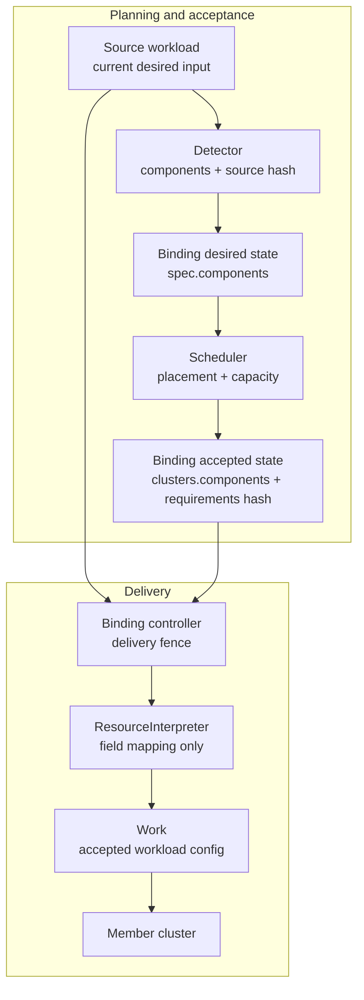

# Day 52：#7492 多组件调度 PR 设计与答辩

> 证据快照：2026-08-18。公开实现以 `#7841@b2b27ad01c79ec8cb355461a674110c59d6fb3bf`
> 为准；前一 head `9a18960ea5f307df744784e00688e9c5987c7056` 的首次 CI lint 失败。
> PR 和 CI 状态只代表本文记录时刻。

## 先说人话

#7492 不是简单地“发现副本变化后再调度一次”。它要补齐一套 accepted-result 协议：

1. scheduler 必须保存上一次真正接受的 component 副本结果；
2. 扩容时只能估算新增部分，不能把已经运行的副本再算一遍；
3. 新请求调度失败时，Binding 和 Work 必须继续使用旧的 accepted result；
4. binding controller 进入 Override 阶段前，只能应用 scheduler 接受过的 source、replicas 和 requirements 组合。

`TargetCluster.Components` 因此不是可有可无的历史记录。它既是下一次增量估算的基线，也是失败时保留
现有 Work 的依据。

## 30 秒结论

当前设计把问题拆成五层：#7837 定义结果字段，#7833 生成结果，#7830 把结果翻译并交付到 Work，
#7835 计算 scale delta，#7841 负责触发、接受、失败保留和恢复。前四层提供能力，#7841 才把它们
组成一个 fail-closed 的生产状态机。

最重要的不变量是：

```text
进入 Override 阶段前，Work 使用的 component replicas + requirements
必须对应 scheduler 接受过的同一份 source input。
```

Override 本来就允许在调度后改写 workload；它造成的副本或资源变化不由这套协议证明。

## 一个具体业务场景

下面是用于说明可达风险的业务推演，不是已执行的 live E2E 数据。

以 FlinkDeployment 为例，初始调度成功：

```text
source:
  jobmanager = 1
  taskmanager = 4
  taskmanager CPU = 100m

accepted result on member1:
  jobmanager = 1
  taskmanager = 4

Work:
  1 JM + 4 TM，每个 TM 100m
```

### 只扩副本：`4 -> 6`

member1 已经承担 4 个 taskmanager。重新检查完整的 6 个，会把现有 4 个重复计入容量；正确问题是：

```text
member1 的剩余容量能否再容纳 2 个 taskmanager？
```

因此纯 scale-up 固定当前 accepted target，只估算 `+2`。如果放不下，就保留 4 个副本和旧 Work，
而不是把整个应用迁移到另一个集群。

### 同时改副本和 CPU：`4 x 100m -> 6 x 500m`

这时不能只估算 `+2 x 500m`。如果 binding controller 读取最新 source，再用旧 result 把副本改回 4，
Flink 的 `ReviseComponents` 只会改 replica 字段，最终可能交付：

```text
4 x 500m CPU
```

scheduler 从未接受过这组输入。#7841 因此同时校验 source snapshot、accepted replicas 和 accepted
requirements；requirements 变化默认冻结 Work，只有 explicit reschedule 成功后才能提交新结果。

## 问题到底分成哪几层



| 模块 | 它拥有的事实 | 它不应该判断的事情 |
| --- | --- | --- |
| detector | 当前 source input、解释后的 desired components、source snapshot hash | 集群是否有容量、结果是否已被 scheduler 接受 |
| scheduler | placement、capacity、accepted component result、accepted requirements identity | 具体 CRD 的字段路径 |
| binding controller | delivery fence、Work 创建/更新/保留 | 用重试或重新解释来猜 scheduler 是否接受 |
| ResourceInterpreter | component name 到 workload 字段的映射 | freshness、placement、capacity |
| `RequiredBy` | dependency 应传播到哪些集群 | referring workload 的 component assignment |

## PR 为什么这样拆

| 层级 | Exact ref | 只回答的问题 | 主要改动 |
| --- | --- | --- | --- |
| [#7837](https://github.com/karmada-io/karmada/pull/7837) | `76589a9d5`，merge `1dd55a5d5` | result 存在哪里 | `TargetCluster.Components` API、conversion、codegen |
| [#7833](https://github.com/karmada-io/karmada/pull/7833) | `014c555f8` | scheduler 如何产生 result | `AssignReplicas()` 写完整 component snapshot，现有 patch 流程自然持久化 |
| [#7830](https://github.com/karmada-io/karmada/pull/7830) | `4583e06d2` | result 如何变成 Work | commit A 增加 `ReviseComponents`，commit B 在 binding delivery 中消费，并处理 `RequiredBy` ownership |
| [#7835](https://github.com/karmada-io/karmada/pull/7835) | `9fb3992fd` | 已知 accepted snapshot 后，容量怎么算 | 纯 scale-up 算正 delta，纯 scale-down 跳过 estimator，unknown/mixed 显式拒绝；equal 由 activation 当作 steady state |
| [#7841](https://github.com/karmada-io/karmada/pull/7841) | `b2b27ad01` | 何时触发、何时接受、失败如何保留 | reschedule routing、provenance、delivery fence、CAS commit、恢复与 E2E |

拆分依据不是文件数，而是职责：API 不产生结果，scheduler 不理解 Flink 字段，interpreter 不判断 freshness，
planner 不决定何时调度。#7841 把 trigger、accepted commit 和 failure retention 放在一起，是为了避免出现
“已经会触发重新调度，但失败时还会破坏现有 Work”的不安全中间版本。

### 为什么 #7841 有五个 commits

当前公开 integration branch 的五个 commits 是：

```text
014c555f8  #7833 result producer
32d2e45d5  #7830 ReviseComponents capability 的 patch-equivalent copy
db8073d38  #7830 Work delivery 的 patch-equivalent copy
bdcc01b66  #7835 corrected planner 的 patch-equivalent copy
b2b27ad01  #7841 activation residual + lint fix
```

`b2b27ad01` 是对前一第五个 commit `9a18960ea` 的 amend；lint fix 没有增加第六个 commit。

前四个是尚未合入 `master` 的依赖，不是 #7841 重复实现。它们分别提供 producer、interpreter、consumer
和 planner；等对应 PR 合并后，rebase 会自然只剩最后一个 residual commit。提前 squash 不会减少 GitHub diff，
反而会丢失 patch-equivalence 和分层 review 入口。

## 状态机

| 当前状态 | 事件 | scheduler 行为 | Binding / Work 结果 |
| --- | --- | --- | --- |
| 无结果 | 初始调度成功 | 完整估算并写 component snapshot | 进入 Accepted，开始交付 |
| Accepted | replicas 纯扩容 | 固定当前 target，只估正 delta | 成功提交新结果；no-fit 保留旧结果和 Work |
| Accepted | replicas 纯缩容 | 不调用 estimator | 写 desired component snapshot；内部 capacity sentinel 不会持久化 |
| Accepted | requirements、name、mixed direction 或 shape 改变 | 自动路径拒绝 | 进入 pending，Work 不变 |
| Accepted | 当前 target missing / terminating | 走既有 failover，对新候选估完整 desired | 成功才替换结果；失败保留旧结果 |
| Pending | explicit reschedule | 做受控的完整 scheduling | 成功恢复；失败或结果非法仍保留旧 Work |
| Accepted | source 只发生 status 或列举的 API-managed identity fields 变化 | UID 相同且 RV 或 normalized hash 表明是同一 source snapshot | 可继续交付，不因无关 RV 变化永久冻结 |

### planner 的关键边界

- 当前 target 的 pure scale-up：只估 positive delta；
- pure scale-down：不调用 estimator；
- activation 在 planner 前把 equal 识别为 steady accepted state；planner 若被误调用，则与 unknown、mixed、
  重复或不完整 component 一样在 estimator 前显式返回错误；
- full desired 只用于尚未承载该 workload 的新候选集群；
- scale path 的 capacity no-fit 不迁移 workload；普通 steady reconcile 中 target 已不满足 filter/spread 时，先排除
  当前 target，再对其他候选做完整估算。

## 三类持久证据不能混为一谈

| 证据 | Owner | 证明什么 |
| --- | --- | --- |
| `TargetCluster.Components` | scheduler | 已接受的 component name / replicas |
| `scheduler.karmada.io/accepted-component-requirements-hash` | scheduler | 上述 replicas 对应哪组 CPU、memory 等 requirements |
| `binding.karmada.io/resource-template-specification-hash` | detector | Binding 记录的 desired input 与 binding controller 当前读取的 source 是否一致 |

source hash 不是 scheduler acceptance token。它只关闭 source 与 Binding informer 不同步的窗口。在
default-scheduler-owned 且没有外部篡改的协议范围内，component result 和 requirements hash 共同作为
acceptance evidence。比较规则要求 UID 一致，并接受“ResourceVersion 完全相同”或“去掉 status 和明确列举的
API-managed identity fields 后 source hash 相同”。hash 保留用户 labels、annotations、finalizers 和
ownerReferences，因为它们可能影响 interpreter 或交付语义。

## 为什么 main patch 和 status patch 要可修复

scheduler 不能用一次 Kubernetes API 请求同时更新 Binding spec/annotations 和 status。当前协议是：

1. 用带 `metadata.resourceVersion` 前置条件的 main-resource patch 原子写入 clusters、accepted requirements
   hash 和 result identity；
2. 再用独立 CAS patch 更新 status；
3. 如果第 1 步成功、第 2 步失败，下一次 reconcile 优先用精确的 result-generation token；不满足该分支时，
   在没有 explicit reschedule 的前提下可用 normalized scheduling-spec hash 兜底，识别“结果已经提交，
   只需修 status”，避免对已运行 workload 再做完整估算。

失败保留不等于回滚 source。用户的 desired source 仍是新值，只是 accepted Binding 和 Work 在新结果成功前
保持旧值。

## 源码定位

| 设计点 | `#7841@b2b27ad01` 中的入口 |
| --- | --- |
| source snapshot hash | `pkg/util/eventfilter/eventfilter.go`、`pkg/detector/detector.go` |
| transition / pending / requirements hash | `pkg/util/binding.go` |
| delta / scale-down planner | `pkg/scheduler/core/estimation.go` |
| accepted target reuse 与新候选 fallback | `pkg/scheduler/core/generic_scheduler.go` |
| reschedule routing、CAS commit、status repair | `pkg/scheduler/scheduler.go` |
| source coherence 与 Work fence | `pkg/controllers/binding/common.go`、两个 binding controller |
| workload 字段映射 | `pkg/resourceinterpreter/interpreter.go`、Flink `customizations.yaml` |
| 集成场景 | `test/e2e/suites/base/schedule_multi_template_test.go` |

## 为什么一些更简单的方案不成立

**只看 `generation > observedGeneration`**：只能说明对象变了，不能证明 result main patch 是否已经成功；
result/status 分写时会误判。

**binding controller 直接 GET 最新 source 再重试**：读到最新对象不等于 scheduler 接受了它，重试只能缩短
缓存延迟，不能建立 acceptance 因果关系。

**让 ResourceInterpreter 比较 components**：它只知道字段映射；而 orphan Work 删除发生在 interpreter 之前，
也必须由 binding controller 在统一入口拦截。

**mixed scale 用净副本数估算**：不同 component 的 requirements 和约束不同，`A -1, B +2` 不能安全折算成
一个 scalar `+1`。

**occupied target 缺 snapshot 时估完整 desired**：会重新产生 double counting；旧 Binding 只有在可证明是
当前 generation 的成功 `Duplicated` 结果时才能 backfill，其余要求 explicit recovery。

## 目前验证到了哪里

`9a18960ea` 功能 tree 的本地验证已跑 focused tests、race tests、完整 `make test`、生成/一致性检查和
E2E package compile。
E2E compile 输出 `[no tests to run]`，只证明 package 可编译，不是 live multi-cluster E2E。精确命令和 SHA
归属统一记录在 [stack 状态页](issue7492-pr-stack-status.md#validation)，不在答辩稿复制动态清单。

前一 head `9a18960ea` 的首次 upstream #7841 CI lint job 因 1 个导出注释和 3 个 gocyclo
阈值问题失败；其余已结束的非 E2E checks 均通过，三个 base E2E jobs 当时仍在运行。这是确定性代码质量门禁，
不能写成 flake，也不改变上面的设计结论。修复后的 `b2b27ad01` 已通过 upstream 同款 staticcheck、
focused/race tests、`make verify` 和 diff checks，并已触发新一轮 CI；最终结果回填到
[stack 状态页](issue7492-pr-stack-status.md)。

## 尚未证明和明确排除的范围

- 没有本地运行 live multi-cluster Flink E2E，也没有做 mixed-version rollout；
- 当前支持 default scheduler、`len(spec.Components) > 1`、可证明为 exactly-one-cluster 的 placement；
- ordered `ClusterAffinities`、自动 mixed scale、component name replacement 不在自动恢复合同内；
- custom scheduler 不属于这套 scheduler-owned acceptance 协议；
- `RequiredBy` 只继承 cluster reachability，不继承 referring workload 的 component assignment；
- 当前 PR 栈没有 arbitrary-client 的 admission-time result validation，不能声称所有手工 API 写入都被 webhook
  拦截；
- Override 发生在 `ReviseComponents` 之后；override-induced replicas / requirements change 不在本协议证明范围；
- 连续快速 scale-up 可能因旧 scheduling assumption 保守等待到 TTL / queue retry，但不会覆盖 accepted Work；
- feature gate 和 controller/scheduler 的 rollout 顺序仍需 maintainer 确认，功能完整启用前应保持 Alpha gate 关闭。

## 90 秒答辩稿

我解决的不是普通 workload 的 scalar replicas，而是一个 workload 中多个 pod template 的调度结果如何保存、
重新估算和安全交付。以前 Binding 只有 desired components，没有每个集群上真正接受的 component result，
所以 `taskmanager 4 -> 6` 时无法知道当前 4 个已经占用容量，完整估算会重复计算；调度失败时 binding
controller 还可能把最新 source 提前写进 Work。

我把方案拆成五层：API 保存结果，scheduler 生成结果，interpreter 把结果映射回 Flink 字段，planner 只计算
scale delta，最后由 activation PR 建立状态机。纯扩容固定当前集群只估新增副本，纯缩容跳过 estimator；
mixed、requirements 变化或 no-fit 都 fail closed，旧 accepted result 和 Work 不变。

为了避免“旧 4 个副本 + 新 500m CPU”这种 scheduler 从未接受的组合，我分别保存 accepted replicas、
accepted requirements hash 和 detector-observed source hash，并在 binding controller 删除或更新 Work 之前
做 delivery fence。result main patch 和 status patch 分开时，再用 result generation 或 scheduling-spec hash
修复 split write。功能 tree 的 focused/race 与完整 `make test` 已有本地证据；lint-only 候选还通过了
staticcheck、focused/race 和 `make verify`。live E2E 和 mixed-version rollout 仍是明确未完成项，
首次 upstream lint 的四个问题已修复，正在等待新 exact-head CI 验证。

## Mentor 常问问题

### 1. 已经调度成功，为什么还要保存 result？

controller 会持续根据 source 重建 Work。没有 accepted snapshot，就无法区分“上次接受 4、本次申请 6”，
也无法在失败时继续交付旧的 4。

### 2. 为什么存完整 snapshot，不只存 delta？

delta 依赖前序状态，重试、重启和乱序事件后不能独立解释。持久 result 必须完整描述 accepted assignment；
delta 只用于一次 estimator 请求。

### 3. scale-up 为什么不允许因为容量不足迁移整个应用？

增量估算的基线只在当前 accepted target 上成立，而且普通扩容不应隐式变成 stateful workload migration。
这是 #7492 讨论中 maintainer 明确给出的方向；target missing / terminating 才走既有 failover。

### 4. scale-down 中的 `Replicas: 1` 是不是魔法值？

它只是 scheduler 内部表示“至少能继续承载一个完整 component set”的 capacity sentinel，不是 workload
副本数。最终 `AssignReplicas` 重建 `TargetCluster.Components`，测试同时断言 scalar `Replicas == 0`。

### 5. equal 为什么不再走 planner？

equal 是 steady accepted state，不是 scale。它重用已接受 target，但仍经过 filter、score 和 spread；不能把
equal 伪装成 full desired estimation，否则会再次 double count。

### 6. mixed 或旧 Binding 无 snapshot 为什么不 fallback？

在 occupied target 上 full desired 不安全。mixed/unknown 自动路径拒绝；可证明成功的旧 `Duplicated`
对象可以 backfill，其余用 explicit full recovery。

### 7. requirements hash 为什么不直接塞进 `TargetComponent`？

`TargetComponent` 表示 assignment，只保存 name/replicas；完整 requirements 已在 `spec.components`。
hash 在无外部篡改的协议范围内记录 scheduler 接受的是哪组 requirements，避免复制并维护第二份结构。

### 8. source hash 与 requirements hash 有什么区别？

source hash 表明 detector 与 binding controller 看到的是同一份 source input；requirements hash 记录 scheduler
接受了哪组 component requirements。前者解决 informer skew，后者解决 scheduling acceptance，不能互相替代。

### 9. 为什么不用 `metadata.generation` 或严格比较 ResourceVersion？

generation 不覆盖自定义 interpreter 可能读取的 user metadata；严格 RV 又会把 status-only 更新当成 source
变化而永久冻结。UID 必须相同，RV 相同可作为直接证据，RV 不同则比较 normalized source hash。

### 10. 为什么 fence 放在 binding controller，而不是 interpreter？

binding controller 拥有 Work 生命周期，并且必须在 orphan 删除之前决定是否冻结。interpreter 只负责字段映射，
把 freshness 放进去会造成每种 workload 各自猜 acceptance。

### 11. `RequiredBy` 为什么清除 inherited `Components`？

dependency 只继承“这个资源也要传播到该集群”。referring workload 的 component name 即使同名，也不是
dependency workload 的副本决策；同名 target 仍以 dependency 自己的 result 为准。

### 12. 为什么 #7830 有 37 个文件？

它包含一个完整的 interpreter API capability：config API、generated files、Lua、webhook、native/thirdparty
路由、Flink customization，以及 binding delivery。公开接口与唯一生产 consumer 分成两个 commits，review
时可以逐段看；再机械拆 PR 也不会减少 API generated surface，只会把同一条 capability-to-consumer 链分到
两个 review 页面。

### 13. #7841 为什么不再拆 trigger 和 failure protection？

如果先合 trigger，失败保护尚未合入，功能就会在不安全的中间状态下生效。trigger、accepted commit、Work
fence 和 failure retention 共同定义一次安全 activation。

### 14. 现在是否已经 production-ready？

不能这样说。#7837 已合并，其余 PR 尚未获得实质性 human review；live E2E、mixed-version rollout、admission
validation 和新 exact-head CI 都仍是明确门禁。

### 15. 目前最需要 maintainer 决定什么？

确认 default-scheduler accepted-result 协议、`RequiredBy` 只承载 reachability、unsupported transition 的
fail-closed / explicit recovery 语义，以及 admission validation 与 feature rollout 的最终 owner。

## 答辩时不要说的三句话

1. 不说“整套设计已经被 maintainer 接受”；已合并的是 #7837，其余仍在 review 前后阶段。
2. 不说“E2E 已通过”；本地只做了 E2E compile，新 exact-head CI 仍在运行。
3. 不说“webhook 已保护所有 component result”；当前栈没有这份 admission validation。

## 证据入口

- [Issue #7492](https://github.com/karmada-io/karmada/issues/7492)
- [#7837 API](https://github.com/karmada-io/karmada/pull/7837)
- [#7833 result producer](https://github.com/karmada-io/karmada/pull/7833)
- [#7830 interpreter + delivery](https://github.com/karmada-io/karmada/pull/7830)
- [#7835 scale planner](https://github.com/karmada-io/karmada/pull/7835)
- [#7841 activation](https://github.com/karmada-io/karmada/pull/7841)
- [当前 PR 栈状态](issue7492-pr-stack-status.md)
- [Day 49 ownership 与 stale-input 反例](day49-7830-review.md)
