# Day 6: 证书轮换方案设计与实现准备

日期：2026-06-30

## 今日目标

Day 4 已经确认之前把主线放在 `secret-layout` / split Secret prototype 上有偏差。维护者在 [karmada-io/karmada#7693](https://github.com/karmada-io/karmada/issues/7693) 给出的新方向更具体：先为安装工具增加证书轮换能力，第一步聚焦 `karmadactl init`。

今天的目标是把这个方向整理成可实现的方案：

1. 对齐 website 侧的证书轮换文档任务 [karmada-io/website#1014](https://github.com/karmada-io/website/issues/1014)。
2. 梳理历史问题和已有尝试，避免重复走大而散的方案。
3. 写清楚 `karmadactl init --cert-mode=rotate` 的实现边界、代码切入点、风险和测试计划。

## 社区背景

### website#1014：证书轮换指南的文档任务

- Issue: [karmada-io/website#1014 Publish Certificate Rotation Guide](https://github.com/karmada-io/website/issues/1014)
- 状态：open
- Label: `kind/feature`
- Assignee：暂无
- 任务清单：
  - Manual Karmada certificate rotation guide
  - Automated Karmada certificate rotation guide (cert-manager integration)
  - Karmada built-in certificate rotation support (agent certificate auto-rotation) 已由 [website#1016](https://github.com/karmada-io/website/pull/1016) 完成

这个 issue 说明证书轮换不是单纯代码功能，还需要文档配套。当前已合并的是 agent built-in certificate rotation 文档；控制面证书的手动轮换和自动轮换仍然缺入口。

### karmada#4787：生产环境真实痛点

- Issue: [karmada-io/karmada#4787 How to rotate karmada certificate if it is expired](https://github.com/karmada-io/karmada/issues/4787)
- 状态：open
- Label: `kind/question`
- Milestone: `v1.19`

这个 issue 里用户遇到的问题很直接：很多安装方式下证书默认 365 天过期，过期后 apiserver、controller-manager、kube-controller-manager 等组件进入 CrashLoop。评论里也有用户明确希望有类似 `kubeadm certs renew all` 的一键续期工具。

这说明 #7693 的价值不是“锦上添花”，而是解决生产环境中证书过期后难恢复、手工步骤容易出错的问题。

### karmada#5037：cert-manager 大 PR 的经验

- PR: [karmada-io/karmada#5037 Support automatic cert rotation & fix a few bugs](https://github.com/karmada-io/karmada/pull/5037)
- 状态：open，但长期未推进，mergeable state 为 dirty
- Scope：Helm chart、cert-manager/trust-manager、ServiceMonitor、HPA、audit policy、bugfix 等混在一个 XXL PR 中
- 维护者明确反馈：希望拆成更小的 PR

这个 PR 对当前任务的启发是：

- 自动轮换和 cert-manager integration 是合理方向，但不适合作为 #7693 第一版。
- 第一版必须小，最好只解决 `karmadactl init` 的一个明确能力。
- 不要把 HPA、ServiceMonitor、Helm chart 大改、Secret layout、cert-manager integration 混进同一个 PR。

### website#1016：agent 证书轮换文档已合并

- PR: [karmada-io/website#1016 publish karmada cert rollout guide](https://github.com/karmada-io/website/pull/1016)
- 状态：closed / merged
- 重点讨论：`karmada-agent` 当前不支持证书热加载，需要重启后读取新证书；旧证书过期时可能由组件自动重启触发加载

这个结论对控制面证书轮换也适用：第一版不做 hot reload。Secret 更新后，用户仍需要重启相关组件，让 Pod 重新挂载 Secret 并加载新证书。

## 当前问题定义

现在要解决的问题可以用一句话描述：

> 对于通过 `karmadactl init` 安装的 Karmada 控制面，提供一个可重复执行的证书轮换模式，复用原安装参数重新生成证书材料并替换相关 Secrets，避免用户手工识别证书、Secret、mount path 和 kubeconfig 的对应关系。

不是当前第一版目标的内容：

- 不做 `--secret-layout=split`。
- 不做 Helm chart 证书结构改造。
- 不做 operator 证书轮换。
- 不做 cert-manager / trust-manager integration。
- 不做 CRD/controller 形式的证书管理系统。
- 不做组件热加载。
- 不自动 rollout restart，除非维护者明确要求。

## 用户视角流程

预期使用方式：

```bash
karmadactl init --cert-mode=rotate \
  --namespace karmada-system \
  --cert-validity-period 8760h \
  --cert-external-ip <same-as-original-install> \
  --cert-external-dns <same-as-original-install> \
  <other flags consistent with the original installation>
```

工具做的事情：

1. 读取和普通 `init` 相同的 flags / config。
2. 根据这些参数重新生成 Karmada 组件身份证书，也就是 server/client 等 leaf certificates。
3. 更新 `karmada-config-*`、`karmada-cert`、`etcd-cert`、`karmada-webhook-cert` 等相关 Secrets。
4. 输出需要重启的组件提示。

用户仍需要做的事情：

1. 确认 rotate 命令使用的证书参数和原安装一致。
2. 在 Secret 更新后重启相关 Karmada 组件。
3. 确认使用的是原有 CA 签发新的组件身份证书。CA/root certificate 是底层信任链基石，第一版不轮转、不更新。

## 当前代码链路

`karmadactl init` 的入口在 `pkg/karmadactl/cmdinit/cmdinit.go`：

```text
NewCmdInit()
  -> Validate()
  -> Complete()
  -> RunInit()
```

证书相关实现主要在 `pkg/karmadactl/cmdinit/kubernetes/deploy.go`：

```text
RunInit(parentCommand)
  -> genCerts()
  -> load cert/key files into CertAndKeyFileData
  -> prepareCRD()
  -> createKarmadaConfig()
  -> CreateOrUpdateNamespace()
  -> createCertsSecrets()
  -> initKarmadaAPIServer()
  -> karmada.InitKarmadaResources()
  -> initKarmadaComponent()
```

与 rotate mode 最相关的是：

| 函数 | 当前作用 | rotate mode 是否复用 |
| --- | --- | --- |
| `Validate()` | 解析 config file、校验参数 | 需要复用，但可能要按 mode 调整校验 |
| `Complete()` | 初始化 kube client、检查 NodePort、处理 node selector、获取 apiserver IP、初始化 command args、清理/创建 data path | 不能原样复用，需要小心拆分 |
| `genCerts()` | 根据参数生成 CA、leaf cert、etcd cert、front-proxy cert | 不能在 rotate mode 原样复用，需要避免生成新 root CA，只复用既有 CA 签发组件身份证书 |
| `readExternalEtcdCert()` | external etcd 场景读取用户提供的 etcd cert/key | 需要复用 |
| `createCertsSecrets()` | 创建/更新 kubeconfig Secrets、`etcd-cert`、`karmada-cert`、`karmada-webhook-cert` | 需要复用 |
| `initKarmadaAPIServer()` | 创建 etcd/apiserver/aggregated-apiserver workload | rotate mode 不执行 |
| `karmada.InitKarmadaResources()` | 创建/patch CRD、webhook、APIService、bootstrap RBAC 等 | rotate mode 不复用；因为 CA 不变，不需要更新 caBundle/APIService/Webhook/CRD conversion 信任配置 |
| `initKarmadaComponent()` | 创建 controller-manager、scheduler、webhook 等 workload | rotate mode 不执行 |

## 关键设计点

### 1. `Complete()` 不能直接复用

这是实现时最容易踩的坑。现在 `Complete()` 是安装流程的 complete，不是通用 complete：

- `isNodePortExist()` 对正常安装有意义，但 rotate 时 apiserver NodePort 已经存在，不能因此失败。
- hostPath etcd 场景会尝试给 Node 加 label；rotate 时不应该修改 Node。
- `getKarmadaAPIServerIP()` 依赖安装时逻辑，但 rotate 只需要构造证书 SAN。
- `initializeDirectory(i.KarmadaDataPath)` 会清理并重建 data path，rotate 时如果用户已有本地配置，不能无脑清空。

因此建议拆成两个阶段：

```text
completeCommon()
  -> rest config
  -> kube client
  -> parse config / basic defaults

completeInstall()
  -> nodePort conflict check
  -> node selector mutation/check
  -> install command args
  -> initialize data path for install

completeRotate()
  -> ensure target namespace exists
  -> prepare temporary output directory for regenerated cert material
  -> compute cert SAN inputs without mutating cluster install resources
```

如果不想第一版拆太大，也至少要在 `Complete()` 里根据 cert mode 跳过 install-only 逻辑。

### 2. 证书材料准备应独立抽取

当前 `RunInit()` 中证书准备逻辑和后续安装逻辑混在一起。建议抽成：

```text
prepareCertMaterial()
  -> genCerts()
  -> i.CertAndKeyFileData = map[string][]byte{}
  -> for each certList item:
       if external etcd cert, read from user provided path
       else read generated .crt/.key from KarmadaPkiPath
```

然后普通安装和 rotate 共享这个函数。

### 3. Secret 更新也应独立抽取

当前 `createCertsSecrets()` 已经使用 `util.CreateOrUpdateSecret()`，语义上接近 rotate 的需求。建议保留它作为核心同步函数，但命名上可以考虑：

```text
syncCertSecrets()
  -> create/update component kubeconfig Secrets
  -> create/update etcd cert Secret
  -> create/update karmada cert Secret
  -> create/update webhook cert Secret
```

如果为了减少 diff，第一版可以继续使用 `createCertsSecrets()` 名称，但 PR 描述里要说明 rotate mode 复用它更新 Secret。

### 4. 只轮转组件身份证书，不轮转 CA

当前 `cert.GenCerts()` 的行为是：

- 如果用户传 `--ca-cert-file` 和 `--ca-key-file`，使用该 CA 签发新的 Karmada leaf cert。
- 如果用户不传 CA 文件，会生成新的 `karmada` root CA。
- `front-proxy-ca` 和 internal `etcd-ca` 每次都会重新生成。
- leaf cert 的有效期由 `--cert-validity-period` 控制。

这里已经明确第一版策略：

> 轮转的是组件身份证书，也就是组件用于 TLS server/client 身份验证的 leaf certificates。CA/root certificates 是底层信任链基石，数量少、影响面大，不在这个功能里轮转。

原因是 CA 一旦变化，所有信任这个 CA 的 kubeconfig、WebhookConfiguration、APIService、CRD conversion caBundle、组件间 TLS 信任链都可能需要同步更新。对用户来说，这不是普通证书续期，而是信任根迁移，兼容风险明显更高。

因此 rotate mode 必须复用既有 CA 签发新的组件身份证书，不能偷偷生成新的 root CA。

明确后的场景表：

| 场景 | 含义 | rotate mode 影响 |
| --- | --- | --- |
| 复用旧 CA 续签组件身份证书 | 新 server/client cert 仍由旧 CA 签发 | 第一版目标路径，只更新相关 Secrets 并提示用户重启组件 |
| 生成新 Karmada root CA | 信任根变化 | 第一版不支持，避免破坏现有信任链 |
| 生成新 front-proxy CA | front-proxy 信任根变化 | 第一版不支持，应复用既有 front-proxy CA 签发新的 front-proxy-client cert |
| 生成新 internal etcd CA | etcd mutual TLS 信任根变化 | 第一版不支持，应复用既有 etcd CA 签发新的 etcd server/client cert |
| external etcd | 外部 etcd CA/client cert 由用户提供 | 工具不轮转 external etcd CA；如用户提供新的 external etcd client cert/key，只作为输入材料同步进 Secret |

这会直接影响实现：

1. 不能在 rotate mode 里直接调用当前 `cert.GenCerts()`，因为它在未传 CA 文件时会生成新的 `karmada` root CA，并且总是重新生成 `front-proxy-ca` 和 internal `etcd-ca`。
2. rotate mode 需要有“读取既有 CA 材料”的能力，来源可以是用户显式传入的 CA 文件，也可以是从现有 Secret 中读取 CA cert/key。
3. 轮转函数应只重新签发组件身份证书：apiserver server cert、admin/client cert、front-proxy-client cert、etcd server/client cert、webhook serving cert/kubeconfig client cert 等。
4. 如果找不到签发所需的既有 CA private key，应该直接报错，而不是自动生成新 CA。

换句话说，`--cert-mode=rotate` 的语义更接近 “renew component identity certificates”，不是 “rotate trust roots”。

### 5. caBundle 不属于第一版更新范围

`karmada.InitKarmadaResources()` 在安装时会使用 CA 更新：

- CRD conversion webhook patches 中的 `caBundle`
- `MutatingWebhookConfiguration`
- `ValidatingWebhookConfiguration`
- aggregated APIService 的 `CABundle`

现在策略明确为“不轮转 CA”，所以 rotate mode 不应该更新这些 caBundle。这样可以避免把证书身份证明续期扩展成信任根迁移。

如果未来社区需要 root CA migration，应作为单独设计处理，至少需要：

- 信任 bundle 双写或过渡期机制；
- WebhookConfiguration / APIService / CRD conversion caBundle 同步；
- kubeconfig client CA bundle 更新；
- 组件重启顺序和回滚策略；
- external etcd / internal etcd 不同信任链的迁移边界。

这些都不是 #7693 第一版目标。

## 建议实现方案

### API / option 设计

新增 mode 常量：

```go
const (
    CertModeInstall = "install"
    CertModeRotate  = "rotate"
)
```

`CommandInitOption` 增加字段：

```go
CertMode string
```

`karmadactl init` 增加 flag：

```bash
--cert-mode string
```

默认值建议是 `install`，这样比空字符串更容易校验和写文档。

如果支持 config file，则 `KarmadaInitSpec` 增加：

```yaml
spec:
  certMode: rotate
```

不过 config file 字段是否第一版加入，需要看社区是否希望 CLI flag 和 config file 能力一致。Karmada 当前 `init` 已支持 `--config`，如果只加 flag 不加 config 字段，会留下一个小的不一致。

### 执行流程

建议目标流程：

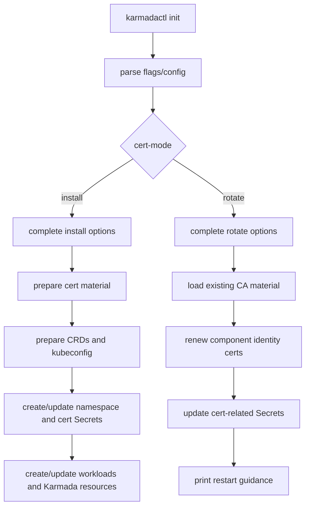

### 代码拆分建议

第一步做纯重构，保证普通安装行为不变：

```text
RunInit()
  -> prepareCertMaterial()
  -> runInstall()
```

第二步加 rotate：

```text
RunInit()
  -> switch CertMode
       install: runInstall()
       rotate: runRotate()

runInstall()
  -> prepareCertMaterial()
  -> prepareCRD()
  -> createKarmadaConfig()
  -> CreateOrUpdateNamespace()
  -> createCertsSecrets()
  -> initKarmadaAPIServer()
  -> InitKarmadaResources()
  -> initKarmadaComponent()

runRotate()
  -> loadExistingCAMaterial()
  -> renewComponentIdentityCerts()
  -> ensure namespace exists
  -> createCertsSecrets()
  -> print restart guidance
```

如果维护者不希望拆 `RunInit()` 太多，可以先把证书逻辑抽出来，保留安装主流程的顺序。

## 测试计划

### 单元测试

1. mode validation：
   - 默认 `install` 通过。
   - `rotate` 通过。
   - 未知 mode 报错。

2. config parsing：
   - 如果加 `spec.certMode`，测试 YAML config 能解析到 `CommandInitOption.CertMode`。

3. cert material preparation：
   - internal etcd 场景能读取既有 `karmada` CA、`front-proxy-ca`、`etcd-ca`，并重新签发组件身份证书。
   - rotate mode 找不到既有 CA private key 时必须报错，不能自动生成新 CA。
   - external etcd 场景读取用户提供的 external etcd client cert/key，不生成 external etcd CA。

4. rotate secret sync：
   - fake client 中预置 namespace 和旧 Secrets。
   - 执行 rotate path 后，相关 Secrets 被更新。
   - component kubeconfig Secrets 仍包含新的 cert data。

5. rotate 不创建 workload：
   - fake client action list 中不应出现 Deployment、StatefulSet、Service、CRD 创建。
   - 这条测试很重要，能防止 rotate mode accidentally reinstall。

6. CA bundle 行为：
   - rotate mode 不更新 WebhookConfiguration / APIService / CRD conversion caBundle。
   - 测试可以通过 fake client action list 确认没有相关 update/patch 行为。
   - 如果输入会导致生成新 CA，应直接报错或拒绝，而不是进入 caBundle 更新路径。

### 本地验证命令

开发分支上至少跑：

```bash
go test ./pkg/karmadactl/cmdinit/... -count=1
hack/verify-command-line-flags.sh
git diff --check
```

如果新增导出类型或包级常量，再跑：

```bash
PATH="$(go env GOPATH)/bin:$PATH" golangci-lint run ./pkg/karmadactl/cmdinit/...
hack/verify-staticcheck.sh
hack/verify-import-aliases.sh
```

### 手工 smoke test

真实部署验证需要单独安排，至少覆盖：

```bash
karmadactl init ...
kubectl -n karmada-system get secret karmada-cert etcd-cert karmada-webhook-cert
karmadactl init --cert-mode=rotate <same cert flags>
kubectl -n karmada-system get secret karmada-cert -o yaml
kubectl -n karmada-system rollout restart deploy/karmada-apiserver
kubectl -n karmada-system rollout restart deploy/karmada-aggregated-apiserver
kubectl -n karmada-system rollout restart deploy/karmada-controller-manager
kubectl -n karmada-system rollout restart deploy/karmada-kube-controller-manager
kubectl -n karmada-system rollout restart deploy/karmada-scheduler
kubectl -n karmada-system rollout restart deploy/karmada-webhook
kubectl -n karmada-system get pod
```

如果使用 internal etcd，rotate mode 应复用既有 etcd CA 重新签发 etcd server/client cert。Secret 更新后仍要评估 etcd StatefulSet 和 apiserver 的重启顺序，因为 etcd server/client leaf cert 同时更新会影响 apiserver 连接 etcd。

## PR 切分建议

建议不要直接把所有内容做成一个大 PR。比较稳的拆法：

1. PR 1：引入 `CertMode`、抽取证书材料准备函数，默认安装行为不变。
2. PR 2：实现 `--cert-mode=rotate`，只更新相关 Secrets，补 fake client 测试和 flag 文档。
3. PR 3：website 文档，补 manual control-plane certificate rotation guide，关联 website#1014。

如果社区希望一个 PR 完成 #7693，也可以合并 PR 1/2，但不建议把 cert-manager 自动轮换、Helm chart 和 split Secret layout 混进去。

## 当前需要确认的问题

提交代码前最好在 issue 或 PR body 中明确这些问题：

1. `--cert-mode` 默认值是否用 `install`，还是保持空值代表普通安装。
2. rotate mode 从哪里读取既有 CA private key：要求用户传 `--ca-cert-file` / `--ca-key-file`，还是优先从现有 Secret 中读取。
3. rotate mode 是否应该要求 namespace 和现有 cert Secrets 已存在，避免用户传错 namespace 时创建无用 Secret。
4. 是否更新本地 kubeconfig 文件，还是只更新集群内 kubeconfig Secrets。
5. 是否自动输出 restart 命令；是否自动执行 rollout restart。
6. external etcd 场景是否只复用用户提供的 external cert，不做任何生成。

## 当前结论

证书方向现在应聚焦 #7693：

> 第一版不是重做 Secret layout，也不是 cert-manager 自动轮换，而是把 `karmadactl init` 已有的证书生成和 Secret 写入能力抽出来，提供一个 `--cert-mode=rotate` 路径，让用户能可靠地替换 `karmadactl init` 管理的证书 Secrets。

更准确地说，第一版轮转的是组件身份证书，不轮转 CA/root certificates。CA 是底层信任链基石，变化会带来不兼容风险，不应混入这个功能。

这条路径和 website#1014 也能对齐：代码侧先提供可执行工具，后续文档侧补 manual certificate rotation guide，把“命令如何跑、哪些参数必须和原安装一致、哪些组件要重启、为什么 CA 不轮转”写清楚。

## 下一步最小行动

1. 从最新 `upstream/master` 新建干净 topic branch。
2. 先做源码级最小重构：抽出证书材料准备边界，保持 `RunInit()` 默认行为不变。
3. 增加 `CertMode` 和 validation，不急着改 Secret layout。
4. 实现 rotate path：读取既有 CA，重新签发组件身份证书，更新 Secrets。
5. 用 fake client 测试证明 rotate 只更新 Secrets、不创建 workloads、不更新 caBundle。

## 代码级别文件变动设计（补充）

这一节是上代码前的文件级设计，不是最终 patch 清单。目标是先把“哪些文件该动、哪些文件不该动、函数边界怎么拆、测试怎么证明”讲清楚，避免为了改代码而改代码。

核心原则：

1. 普通 `karmadactl init` 安装路径行为保持不变。
2. 第一版只做 `karmadactl init --cert-mode=rotate`。
3. rotate mode 只更新由 `karmadactl init` 管理的证书 Secrets。
4. CA/root certificates 只读取和复用，不轮转、不重新生成、不更新 caBundle。
5. Deployment/StatefulSet/Service 模板第一版不改，因为现有 workload 已经通过固定 Secret 名称挂载证书。

### 文件触点总览

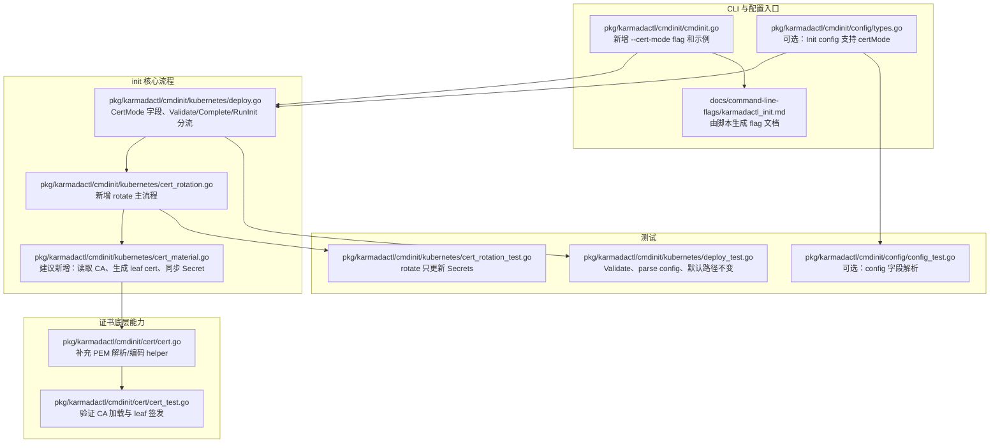

### 建议变更清单

| 文件 | 变更类型 | 计划内容 | 风险控制 |
| --- | --- | --- | --- |
| `pkg/karmadactl/cmdinit/cmdinit.go` | 小改 | 新增 `--cert-mode` flag，默认值为 `install` 或空值等价 install；补一个 rotate 示例 | 不改变默认执行路径；flag 文档用生成脚本更新 |
| `pkg/karmadactl/cmdinit/kubernetes/deploy.go` | 中改 | `CommandInitOption` 增加 `CertMode`；`Validate()` 校验 mode；`Complete()` 拆出 install/rotate 不同准备动作；`RunInit()` 按 mode 分流 | 先做无行为变化重构，再加 rotate；默认 install 仍走原有流程 |
| `pkg/karmadactl/cmdinit/kubernetes/cert_rotation.go` | 新增 | 放 rotate mode 的入口函数，如 `runCertRotate()`、`validateRotatePrerequisites()` | 新流程独立，减少污染安装路径 |
| `pkg/karmadactl/cmdinit/kubernetes/cert_material.go` | 新增或合入上文件 | 读取现有 CA Secret、生成新的 leaf cert、填充 `CertAndKeyFileData`、调用 Secret 同步逻辑 | 把证书材料处理从部署流程中拿出来，便于单测 |
| `pkg/karmadactl/cmdinit/cert/cert.go` | 小改 | 补 PEM bytes 到 `x509.Certificate`/private key 的加载 helper；必要时补 private key 编码 helper | 只补通用能力，不改变 `GenCerts()` 现有语义 |
| `pkg/karmadactl/cmdinit/config/types.go` | 可选但建议 | 如果社区希望 config file 与 CLI 对齐，给 init spec 增加 `certMode` | 避免只有 CLI 能 rotate、配置文件不能表达 |
| `pkg/karmadactl/cmdinit/kubernetes/deploy_test.go` | 测试 | 增加 mode validate、默认 install path 不变、config parse 测试 | 防止重构破坏现有 init |
| `pkg/karmadactl/cmdinit/kubernetes/cert_rotation_test.go` | 测试 | fake client 验证 rotate 只更新 cert Secrets，不创建 workloads，不更新 caBundle | 这是 PR 最关键的证明材料 |
| `pkg/karmadactl/cmdinit/cert/cert_test.go` | 测试 | 验证从 Secret PEM 加载 CA 后能签发 leaf cert，非法 PEM 会报错 | 防止 CA 读取失败时静默生成新 CA |
| `docs/command-line-flags/karmadactl_init.md` | 生成文件 | 通过 `hack/update-command-line-flags.sh` 更新 | 不手写，避免 flag 文档和代码不一致 |

### 第一版明确不改的文件

这些文件第一版最好不要动，除非实现时发现现有挂载方式确实无法复用：

| 文件 | 不改原因 |
| --- | --- |
| `pkg/karmadactl/cmdinit/kubernetes/command.go` | 组件命令参数和证书路径已经指向现有挂载目录；rotate 更新 Secret 后通过重启组件生效 |
| `pkg/karmadactl/cmdinit/kubernetes/deployments.go` | Deployment 挂载的是同名 Secret；第一版不自动重启、不改模板 |
| `pkg/karmadactl/cmdinit/kubernetes/statefulset.go` | internal etcd 已经挂载 `etcd-cert`；Secret 更新后再处理重启顺序 |
| `pkg/karmadactl/cmdinit/karmada/deploy.go` | 这里涉及 APIService/Webhook/CRD 等信任配置；第一版不更新 caBundle |
| Helm chart / operator 相关目录 | #7693 第一版聚焦 `karmadactl init`，不要把 Helm/operator 轮换混进来 |

### 运行路径拆分

当前 `RunInit()` 是单一路径：生成证书、创建 namespace、创建 CRD、创建 workload、创建 Secret。rotate mode 不能复用这个完整路径，否则会误触安装期动作。

建议拆成：

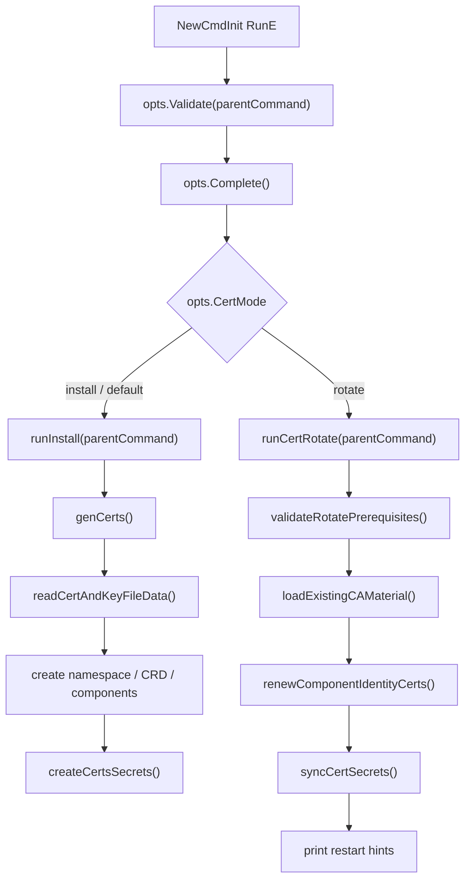

关键点：

- `install` 继续使用现有 `genCerts()`，避免扩大风险。
- `rotate` 不调用 `genCerts()`，因为当前 `cert.GenCerts()` 会在缺少 CA 文件时生成新 root CA，并且会生成新的 `front-proxy-ca` / `etcd-ca`。
- `rotate` 不调用创建 CRD、Service、Deployment、StatefulSet 的逻辑。
- `syncCertSecrets()` 可以复用现有 `createCertsSecrets()` 的 Secret 数据组织方式，但需要先做 existing Secret preflight，防止传错 namespace 时创建一套无效 Secret。

### Complete 阶段拆分

现有 `Complete()` 包含一些明显属于 install 的动作，例如 NodePort 检查、hostPath etcd node label、初始化数据目录。这些动作不应该在 rotate mode 执行。

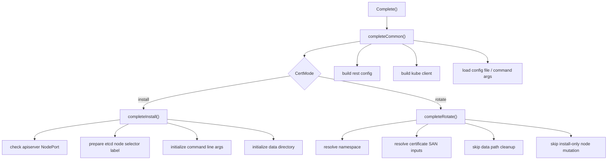

rotate mode 的 `Complete()` 应该只准备运行所需上下文，不做集群结构变更。尤其要避免：

- 不执行 `isNodePortExist()`，因为 rotate 时 NodePort 本来就应该存在。
- 不执行 `AddNodeSelectorLabels()`，避免证书轮换时修改节点标签。
- 不执行 `initializeDirectory(i.KarmadaDataPath)`，避免清理或覆盖安装期数据目录。

### CA 与 leaf cert 边界

这次设计里最重要的边界是：CA 只作为签发者被读取，leaf cert 才会重新生成。

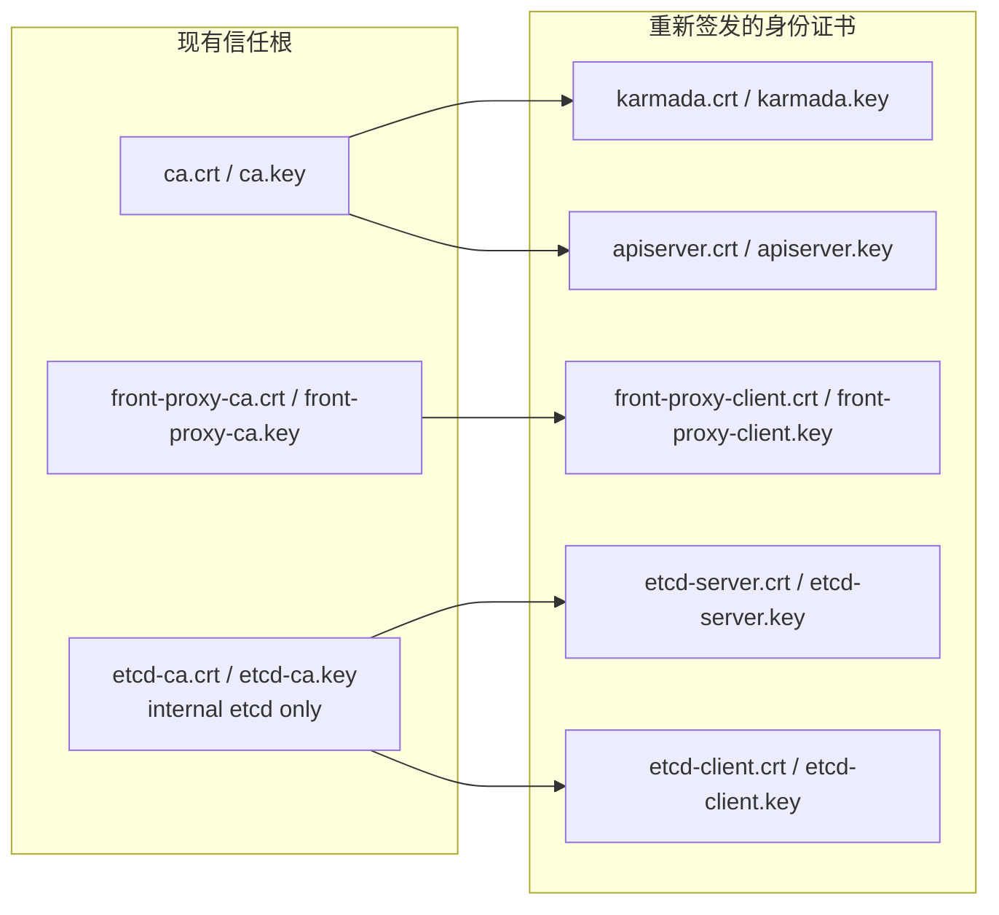

对应到 Secret 数据，大致是：

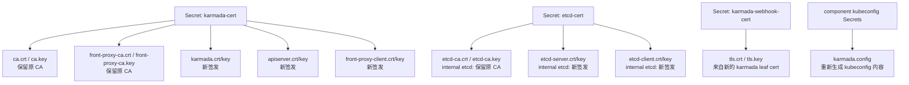

### CA 来源策略

rotate mode 需要 CA private key，否则无法重新签发 leaf cert。这里建议采用“显式文件优先，现有 Secret 兜底”的策略，但要在 PR body 里请维护者确认。

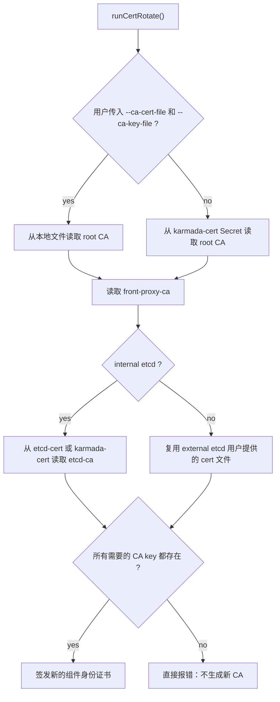

为什么不能缺 CA key 时自动生成：

- 自动生成 CA 会改变信任链。
- caBundle 不更新时，新 CA 签发的证书不会被已有组件信任。
- caBundle 更新又会扩大 blast radius，和第一版目标冲突。

### 函数级设计草案

建议函数分层如下，名字可以在实现时按现有风格微调：

```go
const (
    CertModeInstall = "install"
    CertModeRotate  = "rotate"
)

func (i *CommandInitOption) RunInit(parentCommand string) error {
    switch i.CertMode {
    case "", CertModeInstall:
        return i.runInstall(parentCommand)
    case CertModeRotate:
        return i.runCertRotate(parentCommand)
    default:
        return fmt.Errorf("unsupported cert mode %q", i.CertMode)
    }
}
```

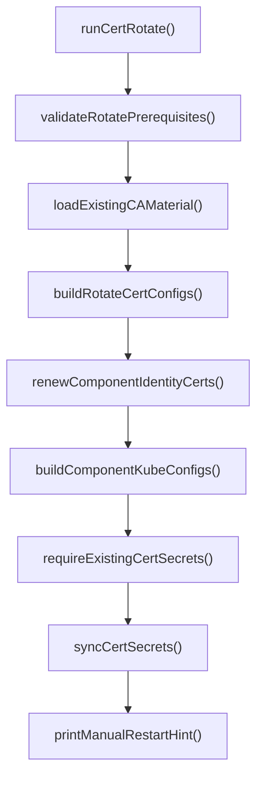

每个函数的职责建议：

| 函数 | 职责 | 不应该做的事 |
| --- | --- | --- |
| `validateCertMode()` | 校验 mode 只能是 `install` 或 `rotate` | 不连接集群 |
| `completeCommon()` | 创建 kube client、读取 kubeconfig、解析通用配置 | 不清理目录、不改节点标签 |
| `completeInstall()` | 保留当前安装期准备动作 | 不服务 rotate |
| `completeRotate()` | 准备 rotate 所需上下文 | 不创建 NodePort、不初始化数据目录 |
| `runInstall()` | 承接原 `RunInit()` 主体 | 不混入 rotate 分支细节 |
| `runCertRotate()` | rotate 主流程编排 | 不创建 workload / CRD |
| `loadExistingCAMaterial()` | 从文件或 Secret 读取 CA cert/key | 不生成新 CA |
| `renewComponentIdentityCerts()` | 使用既有 CA 重新签发 leaf cert | 不更新 caBundle |
| `requireExistingCertSecrets()` | 确认目标 namespace 里已有相关 Secret | 不创建新 Secret |
| `syncCertSecrets()` | 更新现有 Secret 数据 | 不决定证书如何生成 |

### Secret 更新边界

rotate mode 最终应只影响这些 Secret：

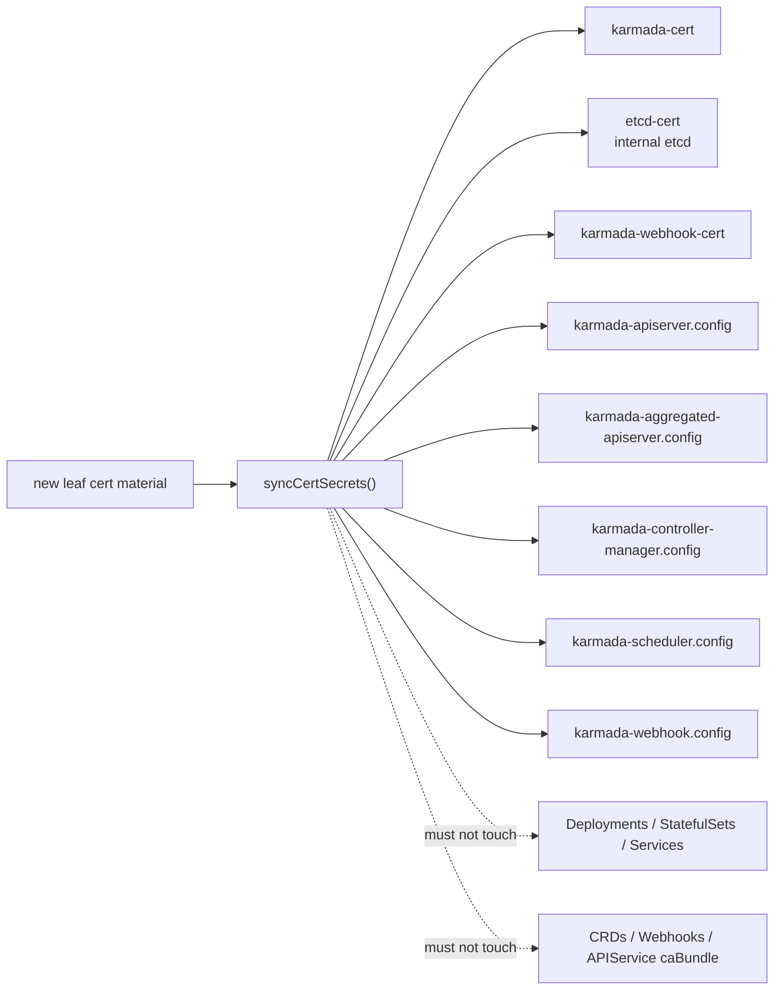

测试里要证明“不该动的对象没动”，而不是只证明 Secret 被更新了。

### 测试矩阵

```mermaid
flowchart TB
    T["Test Plan"] --> V["Validate tests"]
    T --> R["Rotate unit tests"]
    T --> N["No side-effect tests"]
    T --> C["Cert package tests"]
    T --> G["Generated docs verification"]

    V --> V1["unknown cert mode returns error"]
    V --> V2["empty/install mode keeps default path"]
    V --> V3["config file certMode parse<br/>if config support is added"]

    R --> R1["loads existing CA from Secret"]
    R --> R2["signs leaf certs with existing CA"]
    R --> R3["updates karmada-cert and webhook cert"]
    R --> R4["internal etcd updates etcd server/client leaf certs"]

    N --> N1["no Deployment action"]
    N --> N2["no StatefulSet action"]
    N --> N3["no Service action"]
    N --> N4["no webhook/APIService caBundle update"]

    C --> C1["valid PEM loads successfully"]
    C --> C2["invalid PEM returns error"]
    C --> C3["missing CA key never creates new CA"]

    G --> G1["hack/update-command-line-flags.sh"]
    G --> G2["hack/verify-command-line-flags.sh"]
```

建议最小测试命令：

```bash
go test ./pkg/karmadactl/cmdinit/... -count=1
hack/update-command-line-flags.sh
hack/verify-command-line-flags.sh
git diff --check
```

如果引入新的导出函数或调整 import，再补：

```bash
PATH="$(go env GOPATH)/bin:$PATH" golangci-lint run ./pkg/karmadactl/cmdinit/...
hack/verify-staticcheck.sh
hack/verify-import-aliases.sh
```

### 实现顺序建议


这里最适合作为第一个 commit 的不是直接实现 rotate，而是“无行为变化的流程拆分 + 测试”。这样 review 时能清楚看到：

- 第一层只是把安装路径拆清楚。
- 第二层才加入 rotate mode。
- 如果 rotate 逻辑有争议，默认安装路径的风险仍然可控。

### PR 说明里的代码变动解释

后续 PR body 可以按这个结构解释：

```markdown
### What this PR changes

- Adds a `--cert-mode` option to `karmadactl init`.
- Keeps the existing install behavior as the default path.
- Adds a rotate path that reuses existing CA certificates and private keys to issue new component identity certificates.
- Updates the certificate-related Secrets managed by `karmadactl init`.

### What this PR intentionally does not change

- Does not rotate root CA certificates.
- Does not update WebhookConfiguration/APIService/CRD caBundle.
- Does not recreate workloads or automatically restart components.
- Does not change Helm chart or operator certificate management.

### Validation

- Unit tests cover cert mode validation.
- Fake client tests verify rotate updates only the expected Secrets.
- Tests verify missing CA key fails instead of generating a new CA.
- Command-line flag docs are regenerated.
```

### 当前设计结论

代码上最稳的方向是：

1. 在 `karmadactl init` 入口引入 mode，但默认安装路径保持原样。
2. 把 install-only 准备动作从通用 `Complete()` 中拆出去。
3. 新增独立 rotate path，读取既有 CA，重新签发 leaf cert。
4. 复用现有 Secret 名称和数据结构，不做 Secret layout 重构。
5. 用测试证明 rotate 的副作用边界：只更新证书 Secret，不动 workload，不动 caBundle。

这个设计和社区会议要讲的重点一致：第一版先解决“用户如何可靠地批量替换由 `karmadactl init` 管理的组件身份证书”，而不是一次性重做整个证书管理体系。

## 实现后代码变动解释（feature/cert-mode-rotate）

实现分支：

- branch: `feature/cert-mode-rotate`
- commit: `32e553925 feat: support rotating init managed certificates`
- fork push CI 当前观察：已有大部分 check 成功，`FOSSA` / `image-scanning` skipped，剩余 `CI Workflow` / `CLI` / `Chart` / `Operator` 等仍在跑。

这次实现严格按前面的文件级设计落地，变更集中在 `pkg/karmadactl/cmdinit` 和生成的 command-line flag 文档，没有修改 workload 模板、挂载路径、caBundle、Helm chart 或 operator。

### 变更文件总览

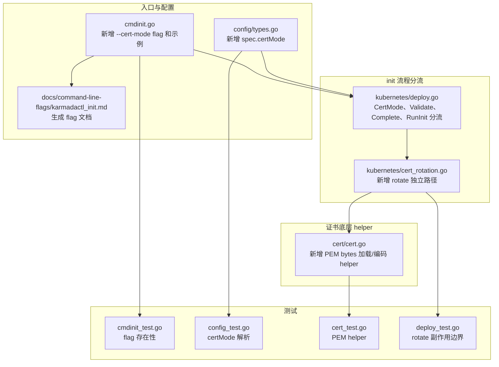

对应 `git diff --stat`：

| 文件 | 变更性质 | 解释 |
| --- | --- | --- |
| `pkg/karmadactl/cmdinit/cmdinit.go` | 小改 | 增加 `--cert-mode` flag，默认 `install`；补 rotate 示例。 |
| `pkg/karmadactl/cmdinit/config/types.go` | 小改 | 配置文件支持 `spec.certMode`，避免 CLI 和 config 能力不一致。 |
| `pkg/karmadactl/cmdinit/kubernetes/deploy.go` | 中改 | 增加 mode validation；拆 `Complete()` / `RunInit()`；抽出 cert config 和 Secret spec 构造；新增 update-only Secret 同步。 |
| `pkg/karmadactl/cmdinit/kubernetes/cert_rotation.go` | 新增 | rotate 主流程：读取既有 CA，重新签发 leaf cert，更新既有 Secrets。 |
| `pkg/karmadactl/cmdinit/cert/cert.go` | 小改 | 增加从 PEM bytes 加载 cert/key、编码 private key 的 helper，避免 rotate 走落盘 `GenCerts()`。 |
| `*_test.go` | 测试 | 覆盖 flag/config/PEM helper/rotate 副作用边界。 |
| `docs/command-line-flags/karmadactl_init.md` | 生成文件 | 由 `hack/update-command-line-flags.sh` 生成。 |

### 核心运行路径变化

之前 `RunInit()` 只有一条安装路径：

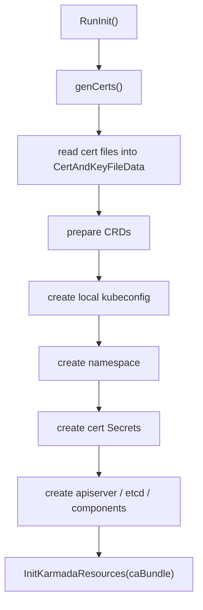

现在变成 mode 分流：

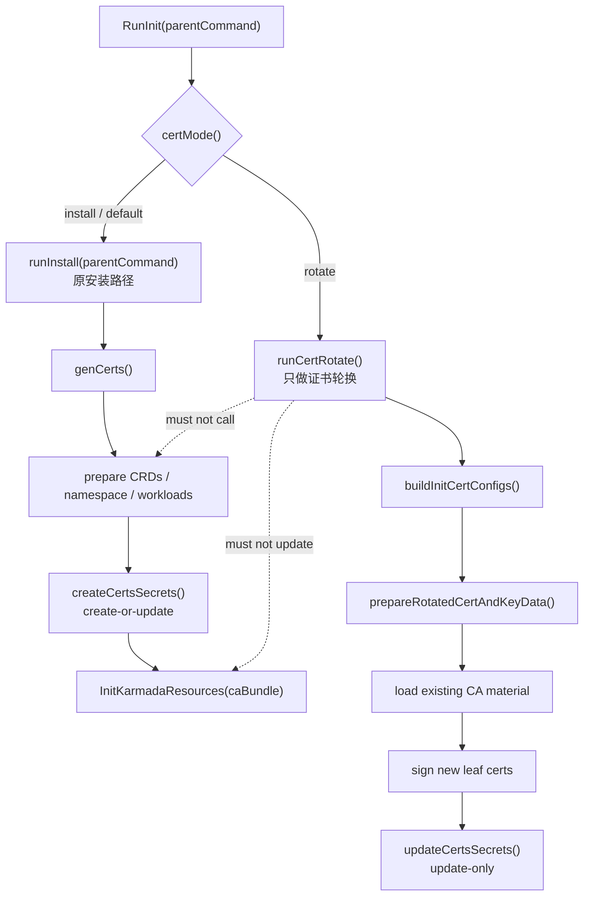

这张图是 reviewer 看 diff 的主线：`install` 是原路径，`rotate` 是新路径。新路径不进入 CRD、workload、caBundle 创建逻辑。

### `Complete()` 的拆分解释

原 `Complete()` 里混了两类动作：

1. 通用动作：创建 rest config / kube client。
2. 安装期动作：检查 NodePort 是否已存在、给 node 打 etcd label、解析 hostPath etcd selector、清理 `KarmadaDataPath`。

rotate 不能执行安装期动作，因为 rotate 面对的是“已经安装好的 Karmada”。如果继续检查 NodePort，会因为 apiserver Service 已存在而失败；如果继续 node label 逻辑，会在轮换证书时修改节点；如果继续清理 data path，可能误删本地安装数据。

实现后：

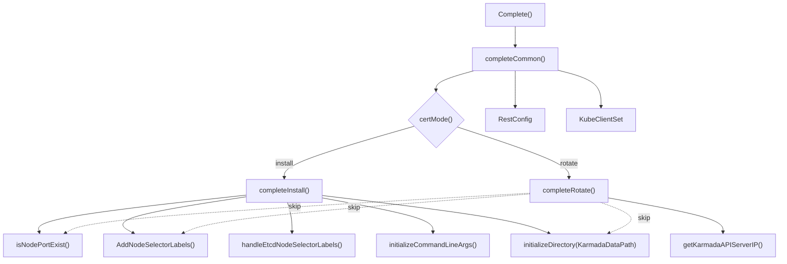

这里不是删除安装能力，而是把安装期副作用从通用路径里隔离出去。

### “删除的代码”实际做了什么

diff 里看起来有几处删除，实际都是“抽函数/分流”，不是删功能。

#### 1. `genCerts()` 内部证书配置被抽出

原来 `genCerts()` 内部直接构造：

- etcd server/client cert config
- karmada/admin cert config
- apiserver cert config
- front-proxy-client cert config

然后立即调用 `cert.GenCerts()`。

现在改为：

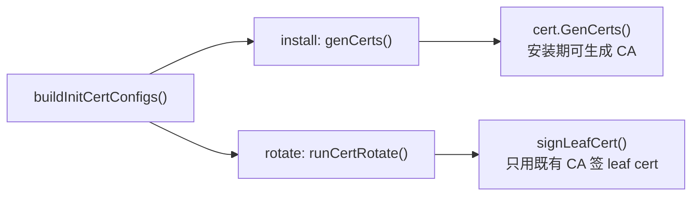

解释：

- 删除的是 `genCerts()` 里直接内联的 config 构造代码。
- 新增的是 `buildInitCertConfigs()`，让 install 和 rotate 复用同一套 SAN / CN / validity 规则。
- `install` 仍调用 `cert.GenCerts()`，默认安装行为不变。
- `rotate` 不调用 `cert.GenCerts()`，因为 `GenCerts()` 在缺少 CA 文件时会生成新 root CA / front-proxy-ca / etcd-ca，这不符合本次“不轮转 CA”的设计。

#### 2. `createCertsSecrets()` 内联创建逻辑被抽成 Secret spec

原来 `createCertsSecrets()` 是边构造 Secret、边 `CreateOrUpdateSecret()`。

现在拆成：

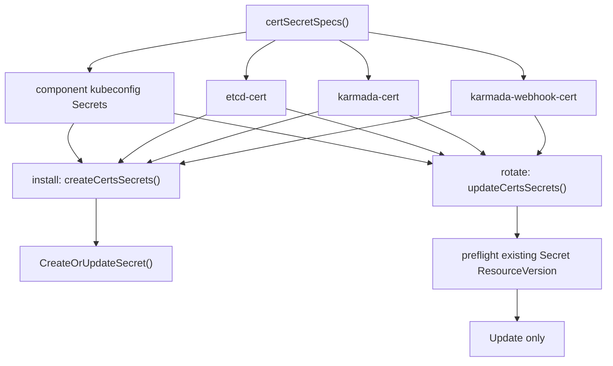

解释：

- 删除的是 `createCertsSecrets()` 里重复的“构造后立即写入”代码。
- 新增 `certSecretSpecs()` 统一构造 Secret 数据结构。
- `install` 继续 create-or-update，保持原行为。
- `rotate` 使用 update-only：先检查所有目标 Secret 已存在，再统一 update。这样用户传错 namespace 时不会创建一套无效 Secret，也避免失败时半更新。

#### 3. 原 `RunInit()` 主体被改名为 `runInstall()`

原 `RunInit()` 的主体没有被删，而是整体变成 `runInstall()`。

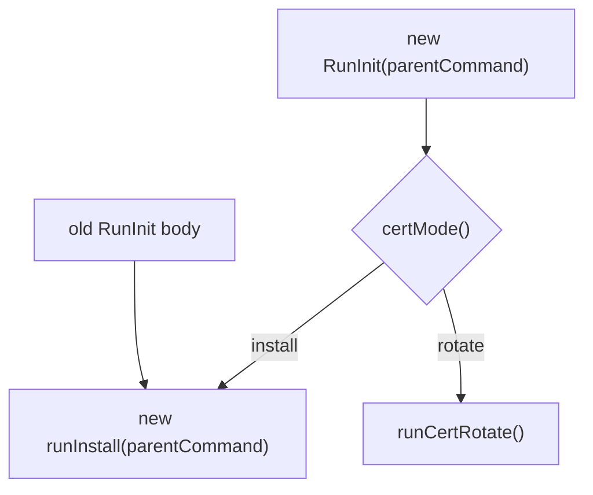

解释：

- 删除的是 `RunInit()` 直接承载所有安装逻辑的形态。
- 保留的是原安装逻辑本身。
- 新增的是顶层 mode dispatch。

### 新增 `cert_rotation.go` 的职责

`cert_rotation.go` 是这次最核心的新文件。它不是新的证书管理系统，也不是 controller，只是 rotate mode 的独立实现。

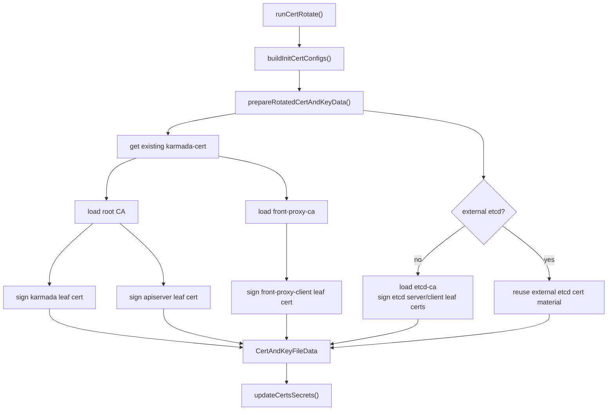

关键点：

- root CA、front-proxy CA、etcd CA 都只读取复用。
- 新签发的是 leaf cert：`karmada`、`apiserver`、`front-proxy-client`、internal etcd 的 `etcd-server` / `etcd-client`。
- 如果 CA private key 不存在，直接报错，不生成新 CA。
- 如果用户传了 `--ca-cert-file` / `--ca-key-file`，会校验文件里的 CA cert 必须和现有 `karmada-cert` Secret 里的 CA cert 一致，避免拿另一套 CA 签出不被信任的 leaf cert。

### Secret 更新边界

rotate 只更新 init 管理的 Secret：

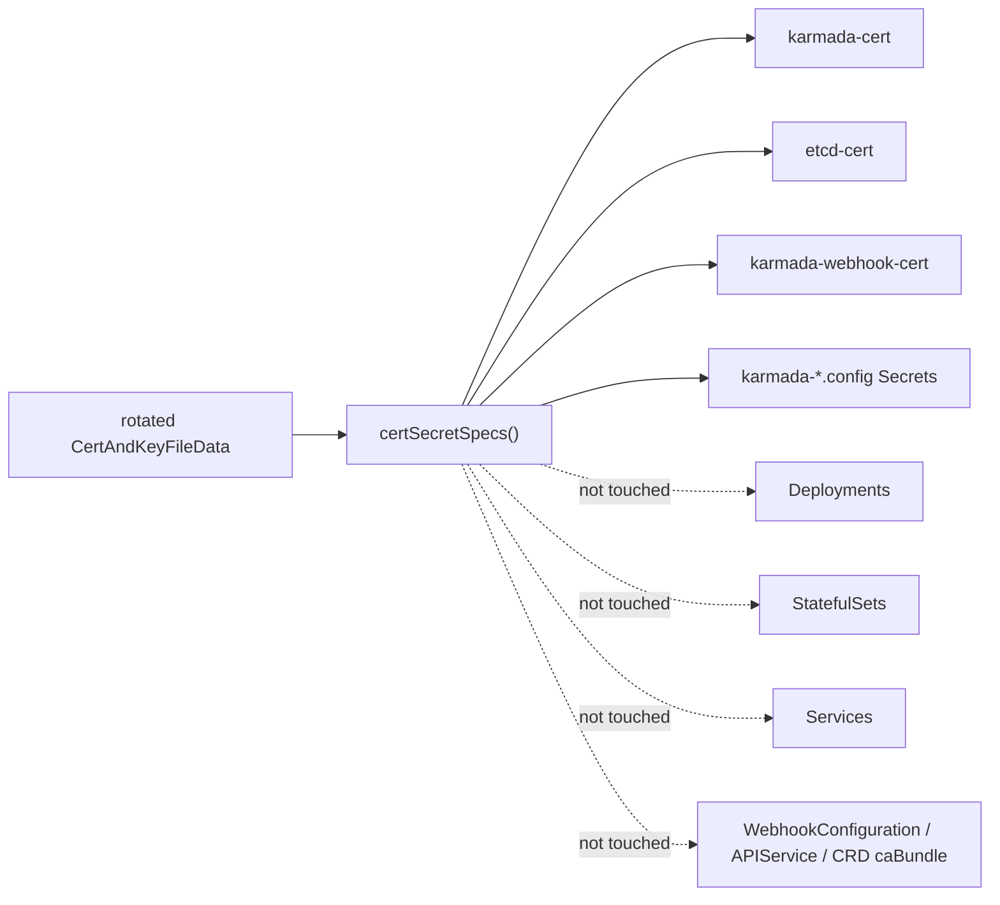

这也是测试的重点：不是只证明 Secret 能更新，而是证明 rotate 不会创建/更新 Deployment、StatefulSet、Service。

### 为什么没有改这些文件

| 文件 / 目录 | 没改原因 |
| --- | --- |
| `pkg/karmadactl/cmdinit/kubernetes/command.go` | 组件命令使用的证书路径和 kubeconfig 路径没有变化，Secret 名称和挂载路径保持兼容。 |
| `pkg/karmadactl/cmdinit/kubernetes/deployments.go` | Deployment 仍挂载同名 Secret；第一版不自动重启、不改模板。 |
| `pkg/karmadactl/cmdinit/kubernetes/statefulset.go` | internal etcd 仍挂载 `etcd-cert`；Secret 更新后由用户按顺序重启。 |
| `pkg/karmadactl/cmdinit/karmada/deploy.go` | 不更新 APIService/Webhook/CRD caBundle，因为 CA 不轮转。 |
| `charts/` / `operator/` | #7693 第一版聚焦 `karmadactl init`，不把 Helm/operator 混进来。 |

### 测试覆盖解释

```mermaid
flowchart TB
    A["Tests"] --> B["flag/config"]
    A --> C["cert PEM helper"]
    A --> D["rotate path"]
    A --> E["generated docs"]
    A --> F["lint/staticcheck"]

    B --> B1["cmdinit_test.go: cert-mode flag exists"]
    B --> B2["config_test.go / deploy_test.go: certMode parses"]

    C --> C1["LoadCertAndKeyPEM valid PEM"]
    C --> C2["invalid PEM returns error"]
    C --> C3["nil private key rejected"]

    D --> D1["rotate keeps CA unchanged"]
    D --> D2["rotated leaf cert is signed by old CA"]
    D --> D3["webhook cert follows new karmada cert"]
    D --> D4["missing existing Secret fails"]
    D --> D5["missing CA key fails without update"]
    D --> D6["no Deployment/StatefulSet/Service action"]

    E --> E1["hack/verify-command-line-flags.sh"]
    F --> F1["golangci-lint cmdinit scope"]
    F --> F2["verify-staticcheck"]
```

本地已跑过：

```bash
go test ./pkg/karmadactl/cmdinit/... -count=1
go test ./pkg/karmadactl/... ./cmd/karmadactl/... ./cmd/kubectl-karmada/... -count=1
hack/verify-command-line-flags.sh
hack/verify-import-aliases.sh
PATH="$(go env GOPATH)/bin:$PATH" golangci-lint run ./pkg/karmadactl/cmdinit/...
PATH="$(go env GOPATH)/bin:$PATH" hack/verify-staticcheck.sh
git diff --check
```

### 给 reviewer 的一句话解释

这次 PR 不是重做 Karmada 证书体系，而是在现有 `karmadactl init` 证书生成和 Secret 数据结构上增加一个受限的 rotate mode：

> `install` 仍保留原行为；`rotate` 只读取既有 CA，重新签发组件 leaf certificates，并 update 已存在的 init-managed Secrets，不生成新 CA、不更新 caBundle、不重建 workload。

### 当前剩余需要 review 的点

1. `--cert-mode=rotate` 这个 UX 是否符合维护者预期。
2. rotate mode 默认从 Secret 读取 CA private key 是否可接受；如果社区更希望强制用户传本地 CA 文件，需要调整。
3. external etcd 场景当前是复用已有 external etcd cert material，不主动生成；这是否符合预期。
4. 是否需要在命令输出中打印更完整的手工 restart 提示。

## 官方证书框架 11 项覆盖表

参考文档：[Karmada 证书框架](https://karmada.io/zh/docs/administrator/security/cert-framework/)。

这张表只回答一个问题：官方文章里列出的 11 类证书，我们当前 `feature/cert-mode-rotate` 分支覆盖轮换了哪些，哪些没覆盖。结论要按 `karmadactl init` 当前实际实现理解：文章描述的是目标证书框架，很多条目在标准框架里是独立证书；但当前 `karmadactl init` 仍复用 `karmada.crt/key` 和共享 kubeconfig Secret，没有完全做到每个组件独立证书。

| 官方框架条目 | 当前覆盖状态 | 当前分支实际处理 | 没覆盖 / gap |
| --- | --- | --- | --- |
| 1. Karmada Root Certificate | 不覆盖 | 读取并复用 `ca.crt/key`，用于签发新的 leaf cert。 | 不轮转 root CA；不做信任根迁移；不更新依赖 root CA 的 caBundle。 |
| 2. Karmada API Server | 覆盖 | 轮转 `apiserver.crt/key`；轮转访问 etcd 的 `etcd-client.crt/key`；轮转 front-proxy 使用的 `front-proxy-client.crt/key`；保留 `ca.crt` / `front-proxy-ca.crt` / `etcd-ca.crt`。 | 不轮转 `ca.crt/key`、`front-proxy-ca.crt/key`、`etcd-ca.crt/key`。 |
| 3. Karmada Aggregated API Server | 部分覆盖 | 更新 `karmada-aggregated-apiserver.config`；当前 serving cert 使用共享 `karmada.crt/key`，所以会随共享 leaf cert 更新；访问 etcd 使用共享 `etcd-client.crt/key`，也会更新。 | 没有生成官方框架里的独立 aggregated-apiserver serving cert / client cert；不更新 APIService caBundle。 |
| 4. Karmada Webhook | 部分覆盖 | 更新 `karmada-webhook.config`；更新 `karmada-webhook-cert` 的 `tls.crt/key`，当前来自新的共享 `karmada.crt/key`。 | 没有生成官方框架里的独立 webhook serving cert；不更新 MutatingWebhookConfiguration / ValidatingWebhookConfiguration caBundle。 |
| 5. Karmada Search | 部分覆盖 | 更新 `karmada-search.config` 这个 kubeconfig Secret，内容使用新的共享 `karmada.crt/key`。 | 当前 `karmadactl init` 不部署独立 search 证书链；不覆盖 search 独立 serving cert / etcd client cert。 |
| 6. Karmada Metrics Adapter | 部分覆盖 | 更新 `karmada-metrics-adapter.config` 这个 kubeconfig Secret，内容使用新的共享 `karmada.crt/key`。 | 当前 `karmadactl init` 不部署独立 metrics-adapter 证书链；不覆盖独立 serving cert。 |
| 7. Karmada Scheduler Estimator | 不覆盖 | 无独立 estimator Secret 被更新。 | 官方框架里的 estimator server / client 证书不在当前 `karmadactl init` 管理范围内；当前 scheduler estimator 参数仍引用共享 `/etc/karmada/pki/ca.crt` 和 `karmada.crt/key`。 |
| 8. ETCD | 覆盖 internal etcd；external etcd 只同步输入材料 | internal etcd：复用 `etcd-ca.crt/key`，重新签发 `etcd-server.crt/key` 和 `etcd-client.crt/key`，更新 `etcd-cert` 和 `karmada-cert`。external etcd：复用用户提供或现有 Secret 中的 external etcd CA/client cert material。 | 不轮转 `etcd-ca.crt/key`；不生成 external etcd server cert；外部 etcd 证书生命周期仍归用户或外部 etcd 管理。 |
| 9. Karmada Controller Manager | 部分覆盖 | 更新 `karmada-controller-manager.config`，内容使用新的共享 `karmada.crt/key`。 | 没有生成官方框架里的独立 controller-manager client cert。 |
| 10. Karmada Scheduler | 部分覆盖 | 更新 `karmada-scheduler.config`；scheduler 当前 gRPC estimator 参数使用共享 `karmada.crt/key`，因此共享 leaf cert 会更新。 | 没有生成官方框架里的独立 scheduler client cert / scheduler-estimator gRPC cert。 |
| 11. Karmada Descheduler | 部分覆盖 | 更新 `karmada-descheduler.config`，内容使用新的共享 `karmada.crt/key`。 | 没有生成官方框架里的独立 descheduler cert。 |

### 覆盖结论

当前 PR 覆盖的是 `karmadactl init` 已经实际管理并通过 Secret 挂载/配置给组件使用的证书材料：

- `karmada-cert`：保留 CA，轮转 `karmada.crt/key`、`apiserver.crt/key`、`front-proxy-client.crt/key`、internal `etcd-server/client.crt/key`。
- `etcd-cert`：internal etcd 场景保留 `etcd-ca.crt/key`，轮转 `etcd-server.crt/key`。
- `karmada-webhook-cert`：更新 `tls.crt/key`。
- `karmada-*.config`：更新组件 kubeconfig Secret，使用新的共享 `karmada.crt/key`。

当前 PR 没覆盖的是两类：

1. 信任根：`ca.crt/key`、`front-proxy-ca.crt/key`、`etcd-ca.crt/key`。这些属于 CA/root certificates，更新它们会变成信任链迁移，不是这次 leaf certificate rotation。
2. 官方标准框架中未来应独立化的 per-component cert：例如 aggregated-apiserver 独立 serving cert、webhook 独立 serving cert、search / metrics-adapter / scheduler-estimator / controller-manager / scheduler / descheduler 的独立证书。当前 `karmadactl init` 还没有完全按文章标准拆出这些独立证书，所以本 PR 只刷新现有共享证书和 kubeconfig Secret。

## PR 文案准备（feature/cert-mode-rotate）

### PR 基本信息

- Target repo: `karmada-io/karmada`
- Base branch: `master`
- Head branch: `ranxi2001:feature/cert-mode-rotate`
- Head commit: `32e5539256168fb44ddef6b3db39434e5b39d227`
- Related issue: [karmada-io/karmada#7693](https://github.com/karmada-io/karmada/issues/7693)
- Related docs issue: [karmada-io/website#1014](https://github.com/karmada-io/website/issues/1014)

### Suggested PR title

```text
feat: support rotating init-managed certificates
```

### Suggested PR body

```markdown
**What type of PR is this?**

/kind feature

**What this PR does / why we need it**:

This PR adds a `--cert-mode` option to `karmadactl init` and implements `--cert-mode=rotate` for certificates managed by `karmadactl init`.

The rotate path reuses existing CA certificates and private keys from the current certificate Secrets, or validates `--ca-cert-file` / `--ca-key-file` against the existing CA when they are provided. It then issues new component identity certificates and updates the existing init-managed certificate/config Secrets.

The default mode remains `install`, so the existing installation behavior is preserved.

This is intentionally scoped to `karmadactl init`. It does not rotate CA/root certificates, update WebhookConfiguration/APIService/CRD caBundle fields, recreate workloads, restart components automatically, or change Helm/operator/cert-manager certificate management.

**Which issue(s) this PR fixes**:

Fixes #7693

<!--
Related docs work:
https://github.com/karmada-io/website/issues/1014
-->

**Special notes for your reviewer**:

- Scope:
  - Adds `--cert-mode` with supported values `install` and `rotate`.
  - Adds `spec.certMode` support for the init config file.
  - Keeps `install` as the default path.
  - Updates existing init-managed Secrets during rotate: `karmada-cert`, `etcd-cert`, `karmada-webhook-cert`, and the component kubeconfig Secrets.

- Implementation notes:
  - `RunInit` now dispatches to the default install path or the new rotate path.
  - `Complete` is split into common/install/rotate steps so rotate skips install-only side effects such as NodePort conflict checks, node selector mutation, and data path initialization.
  - Rotate reuses existing CA material and only signs new leaf certificates.
  - Missing CA private key fails instead of generating a new CA.
  - If `--ca-cert-file` and `--ca-key-file` are provided, the provided CA certificate must match the CA in the existing `karmada-cert` Secret.
  - Internal etcd renews `etcd-server` and `etcd-client` leaf certificates with the existing etcd CA.
  - External etcd reuses provided or existing external etcd certificate material.

- Intentionally not included:
  - No CA/root CA rotation.
  - No WebhookConfiguration/APIService/CRD caBundle updates.
  - No workload recreation or automatic rollout restart.
  - No Helm chart, operator, or cert-manager integration changes.

- Tests:
  - `go test ./pkg/karmadactl/cmdinit/... -count=1`
  - `go test ./pkg/karmadactl/... ./cmd/karmadactl/... ./cmd/kubectl-karmada/... -count=1`
  - `hack/verify-command-line-flags.sh`
  - `hack/verify-import-aliases.sh`
  - `PATH="$(go env GOPATH)/bin:$PATH" golangci-lint run ./pkg/karmadactl/cmdinit/...`
  - `PATH="$(go env GOPATH)/bin:$PATH" hack/verify-staticcheck.sh`
  - `git diff --check`

- Fork push CI:
  - Branch: `ranxi2001/karmada@feature/cert-mode-rotate`
  - Commit: `32e5539256168fb44ddef6b3db39434e5b39d227`
  - Status: passed. GitHub checks show 16 successful and 2 skipped checks.
  - Workflow summary from `karmada-push-ci-check`: 4 successful workflows (`CI Workflow`, `Chart`, `CLI`, `Operator`) and 2 skipped workflows (`FOSSA`, `image-scanning`).
  - Actions run set: https://github.com/ranxi2001/karmada/actions?query=branch%3Afeature%2Fcert-mode-rotate

**Does this PR introduce a user-facing change?**:

```release-note
`karmadactl init`: Added `--cert-mode=rotate` to rotate certificates managed by `karmadactl init`; users still need to restart related components for the new certificates to take effect.
```
```

### PR 创建前检查清单

- [x] fork push CI 全部完成后，把 `Fork push CI` 一节从 Actions 列表链接更新为明确的 passed 状态。
- [x] 再确认 `feature/cert-mode-rotate` 是否仍基于最新 `upstream/master`：`upstream/master` = `ffbade988fc3d6652daa504ff6cac37141e9f755`，是该分支祖先。
- [x] 如果 CI 结束后有失败项，先修分支，不要开 upstream PR：当前无失败，`CI Workflow` / `Chart` / `CLI` / `Operator` 均 success。
- [ ] 开 PR 前让用户确认 title、body、base/head branch。
