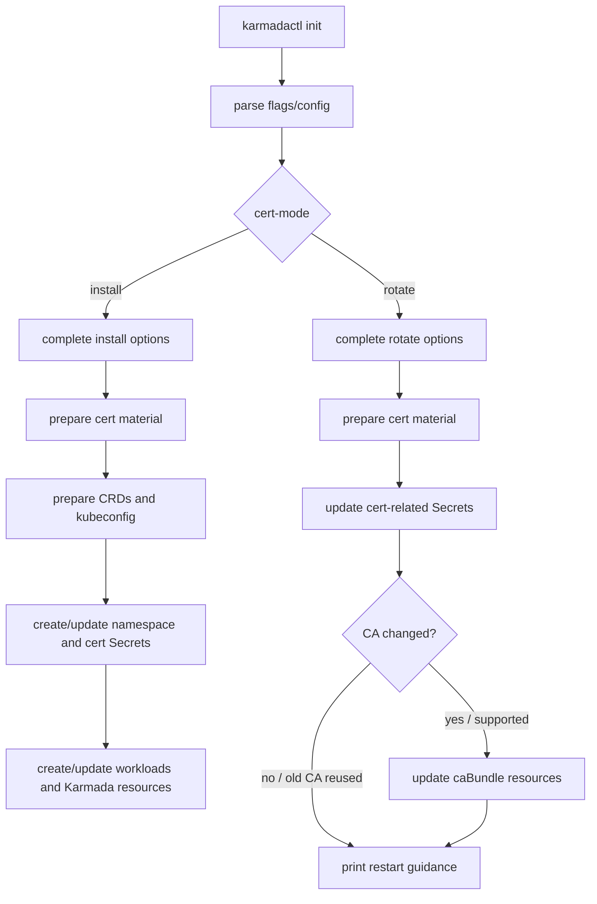

# Day 6: 证书轮换方案设计与实现准备

日期：2026-06-30

## 今日目标

Day 4 已经确认之前把主线放在 `secret-layout` / split Secret prototype 上有偏差。维护者在 [karmada-io/karmada#7693](https://github.com/karmada-io/karmada/issues/7693) 给出的新方向更具体：先为安装工具增加证书轮换能力，第一步聚焦 `karmadactl init`。

今天的目标是把这个方向整理成可实现的方案：

1. 对齐 website 侧的证书轮换文档任务 [karmada-io/website#1014](https://github.com/karmada-io/website/issues/1014)。
2. 梳理历史问题和已有尝试，避免重复走大而散的方案。
3. 写清楚 `karmadactl init --cert-mode=rotate` 的实现边界、代码切入点、风险和测试计划。

## 社区背景

### website#1014：证书轮换指南的文档任务

- Issue: [karmada-io/website#1014 Publish Certificate Rotation Guide](https://github.com/karmada-io/website/issues/1014)
- 状态：open
- Label: `kind/feature`
- Assignee：暂无
- 任务清单：
  - Manual Karmada certificate rotation guide
  - Automated Karmada certificate rotation guide (cert-manager integration)
  - Karmada built-in certificate rotation support (agent certificate auto-rotation) 已由 [website#1016](https://github.com/karmada-io/website/pull/1016) 完成

这个 issue 说明证书轮换不是单纯代码功能，还需要文档配套。当前已合并的是 agent built-in certificate rotation 文档；控制面证书的手动轮换和自动轮换仍然缺入口。

### karmada#4787：生产环境真实痛点

- Issue: [karmada-io/karmada#4787 How to rotate karmada certificate if it is expired](https://github.com/karmada-io/karmada/issues/4787)
- 状态：open
- Label: `kind/question`
- Milestone: `v1.19`

这个 issue 里用户遇到的问题很直接：很多安装方式下证书默认 365 天过期，过期后 apiserver、controller-manager、kube-controller-manager 等组件进入 CrashLoop。评论里也有用户明确希望有类似 `kubeadm certs renew all` 的一键续期工具。

这说明 #7693 的价值不是“锦上添花”，而是解决生产环境中证书过期后难恢复、手工步骤容易出错的问题。

### karmada#5037：cert-manager 大 PR 的经验

- PR: [karmada-io/karmada#5037 Support automatic cert rotation & fix a few bugs](https://github.com/karmada-io/karmada/pull/5037)
- 状态：open，但长期未推进，mergeable state 为 dirty
- Scope：Helm chart、cert-manager/trust-manager、ServiceMonitor、HPA、audit policy、bugfix 等混在一个 XXL PR 中
- 维护者明确反馈：希望拆成更小的 PR

这个 PR 对当前任务的启发是：

- 自动轮换和 cert-manager integration 是合理方向，但不适合作为 #7693 第一版。
- 第一版必须小，最好只解决 `karmadactl init` 的一个明确能力。
- 不要把 HPA、ServiceMonitor、Helm chart 大改、Secret layout、cert-manager integration 混进同一个 PR。

### website#1016：agent 证书轮换文档已合并

- PR: [karmada-io/website#1016 publish karmada cert rollout guide](https://github.com/karmada-io/website/pull/1016)
- 状态：closed / merged
- 重点讨论：`karmada-agent` 当前不支持证书热加载，需要重启后读取新证书；旧证书过期时可能由组件自动重启触发加载

这个结论对控制面证书轮换也适用：第一版不做 hot reload。Secret 更新后，用户仍需要重启相关组件，让 Pod 重新挂载 Secret 并加载新证书。

## 当前问题定义

现在要解决的问题可以用一句话描述：

> 对于通过 `karmadactl init` 安装的 Karmada 控制面，提供一个可重复执行的证书轮换模式，复用原安装参数重新生成证书材料并替换相关 Secrets，避免用户手工识别证书、Secret、mount path 和 kubeconfig 的对应关系。

不是当前第一版目标的内容：

- 不做 `--secret-layout=split`。
- 不做 Helm chart 证书结构改造。
- 不做 operator 证书轮换。
- 不做 cert-manager / trust-manager integration。
- 不做 CRD/controller 形式的证书管理系统。
- 不做组件热加载。
- 不自动 rollout restart，除非维护者明确要求。

## 用户视角流程

预期使用方式：

```bash
karmadactl init --cert-mode=rotate \
  --namespace karmada-system \
  --cert-validity-period 8760h \
  --cert-external-ip <same-as-original-install> \
  --cert-external-dns <same-as-original-install> \
  <other flags consistent with the original installation>
```

工具做的事情：

1. 读取和普通 `init` 相同的 flags / config。
2. 根据这些参数重新生成 Karmada 所需证书材料。
3. 更新 `karmada-config-*`、`karmada-cert`、`etcd-cert`、`karmada-webhook-cert` 等相关 Secrets。
4. 输出需要重启的组件提示。

用户仍需要做的事情：

1. 确认 rotate 命令使用的证书参数和原安装一致。
2. 在 Secret 更新后重启相关 Karmada 组件。
3. 如果 CA 发生变化，需要特别关注 webhook configuration、APIService、CRD conversion caBundle 等信任链配置是否同步更新。

## 当前代码链路

`karmadactl init` 的入口在 `pkg/karmadactl/cmdinit/cmdinit.go`：

```text
NewCmdInit()
  -> Validate()
  -> Complete()
  -> RunInit()
```

证书相关实现主要在 `pkg/karmadactl/cmdinit/kubernetes/deploy.go`：

```text
RunInit(parentCommand)
  -> genCerts()
  -> load cert/key files into CertAndKeyFileData
  -> prepareCRD()
  -> createKarmadaConfig()
  -> CreateOrUpdateNamespace()
  -> createCertsSecrets()
  -> initKarmadaAPIServer()
  -> karmada.InitKarmadaResources()
  -> initKarmadaComponent()
```

与 rotate mode 最相关的是：

| 函数 | 当前作用 | rotate mode 是否复用 |
| --- | --- | --- |
| `Validate()` | 解析 config file、校验参数 | 需要复用，但可能要按 mode 调整校验 |
| `Complete()` | 初始化 kube client、检查 NodePort、处理 node selector、获取 apiserver IP、初始化 command args、清理/创建 data path | 不能原样复用，需要小心拆分 |
| `genCerts()` | 根据参数生成 CA、leaf cert、etcd cert、front-proxy cert | 需要复用或抽取 |
| `readExternalEtcdCert()` | external etcd 场景读取用户提供的 etcd cert/key | 需要复用 |
| `createCertsSecrets()` | 创建/更新 kubeconfig Secrets、`etcd-cert`、`karmada-cert`、`karmada-webhook-cert` | 需要复用 |
| `initKarmadaAPIServer()` | 创建 etcd/apiserver/aggregated-apiserver workload | rotate mode 不执行 |
| `karmada.InitKarmadaResources()` | 创建/patch CRD、webhook、APIService、bootstrap RBAC 等 | rotate mode 是否部分复用，需要按 CA 策略决策 |
| `initKarmadaComponent()` | 创建 controller-manager、scheduler、webhook 等 workload | rotate mode 不执行 |

## 关键设计点

### 1. `Complete()` 不能直接复用

这是实现时最容易踩的坑。现在 `Complete()` 是安装流程的 complete，不是通用 complete：

- `isNodePortExist()` 对正常安装有意义，但 rotate 时 apiserver NodePort 已经存在，不能因此失败。
- hostPath etcd 场景会尝试给 Node 加 label；rotate 时不应该修改 Node。
- `getKarmadaAPIServerIP()` 依赖安装时逻辑，但 rotate 只需要构造证书 SAN。
- `initializeDirectory(i.KarmadaDataPath)` 会清理并重建 data path，rotate 时如果用户已有本地配置，不能无脑清空。

因此建议拆成两个阶段：

```text
completeCommon()
  -> rest config
  -> kube client
  -> parse config / basic defaults

completeInstall()
  -> nodePort conflict check
  -> node selector mutation/check
  -> install command args
  -> initialize data path for install

completeRotate()
  -> ensure target namespace exists
  -> prepare temporary output directory for regenerated cert material
  -> compute cert SAN inputs without mutating cluster install resources
```

如果不想第一版拆太大，也至少要在 `Complete()` 里根据 cert mode 跳过 install-only 逻辑。

### 2. 证书材料准备应独立抽取

当前 `RunInit()` 中证书准备逻辑和后续安装逻辑混在一起。建议抽成：

```text
prepareCertMaterial()
  -> genCerts()
  -> i.CertAndKeyFileData = map[string][]byte{}
  -> for each certList item:
       if external etcd cert, read from user provided path
       else read generated .crt/.key from KarmadaPkiPath
```

然后普通安装和 rotate 共享这个函数。

### 3. Secret 更新也应独立抽取

当前 `createCertsSecrets()` 已经使用 `util.CreateOrUpdateSecret()`，语义上接近 rotate 的需求。建议保留它作为核心同步函数，但命名上可以考虑：

```text
syncCertSecrets()
  -> create/update component kubeconfig Secrets
  -> create/update etcd cert Secret
  -> create/update karmada cert Secret
  -> create/update webhook cert Secret
```

如果为了减少 diff，第一版可以继续使用 `createCertsSecrets()` 名称，但 PR 描述里要说明 rotate mode 复用它更新 Secret。

### 4. CA rotation 和 leaf renewal 要分清楚

当前 `cert.GenCerts()` 的行为是：

- 如果用户传 `--ca-cert-file` 和 `--ca-key-file`，使用该 CA 签发新的 Karmada leaf cert。
- 如果用户不传 CA 文件，会生成新的 `karmada` root CA。
- `front-proxy-ca` 和 internal `etcd-ca` 每次都会重新生成。
- leaf cert 的有效期由 `--cert-validity-period` 控制。

这带来一个重要问题：

| 场景 | 含义 | rotate mode 影响 |
| --- | --- | --- |
| 复用旧 CA 续签 leaf cert | 新 leaf cert 仍由旧 CA 签发 | 只更新 Secrets 和重启组件通常足够 |
| 生成新 CA | 信任根变化 | 需要同步 caBundle、APIService、webhook/CRD conversion 相关信任配置，否则组件可能不互信 |
| internal etcd CA 重新生成 | etcd server/client mutual TLS 信任链变化 | 需要同时更新 `etcd-cert` 和 apiserver 使用的 etcd client cert，并重启 etcd/apiserver |
| external etcd | 外部 etcd CA/client cert 由用户提供 | 工具不应该擅自生成外部 etcd 证书 |

所以 PR 里必须明确第一版支持哪种策略。更保守的路线是：

1. 第一版允许重新生成并替换当前 `karmadactl init` 管理的全部证书 Secret。
2. 如果生成新 root CA，则同步更新由 `karmadactl init` 管理的 caBundle 资源，或者明确暂不支持 root CA rotation。
3. 如果暂不支持 root CA rotation，rotate mode 应要求用户提供原 CA 的 `--ca-cert-file` / `--ca-key-file`，只做 leaf renewal。

这个点需要实现前和维护者确认，因为 #4787 里“证书过期”可能同时包括 CA 和 leaf cert 过期。只 renew leaf 不能解决 root CA 已过期的问题。

### 5. 是否更新 caBundle 是一个分界点

`karmada.InitKarmadaResources()` 在安装时会使用 CA 更新：

- CRD conversion webhook patches 中的 `caBundle`
- `MutatingWebhookConfiguration`
- `ValidatingWebhookConfiguration`
- aggregated APIService 的 `CABundle`

如果 rotate mode 会生成新 CA，就不能只更新 Secrets。否则 webhook、aggregated apiserver、CRD conversion 相关 trust bundle 仍指向旧 CA。

可选方案：

| 方案 | 优点 | 风险 |
| --- | --- | --- |
| 第一版只支持复用旧 CA 签发 leaf cert | 改动小，风险低，测试简单 | 不能解决 root CA 已过期场景 |
| rotate mode 同步更新 caBundle | 更完整，能覆盖新 CA 场景 | 需要拆出 `InitKarmadaResources()` 中 caBundle patch 子流程，测试面更大 |
| 分成两个 mode：`renew` 和 `rotate-ca` | 语义清晰 | flag 设计变复杂，第一版可能过重 |

我的倾向：先实现小而可靠的 rotate path，同时在 PR 描述中主动暴露 CA 策略。如果维护者希望覆盖 #4787 的 root CA 已过期场景，就必须把 caBundle 同步纳入第一版。

## 建议实现方案

### API / option 设计

新增 mode 常量：

```go
const (
    CertModeInstall = "install"
    CertModeRotate  = "rotate"
)
```

`CommandInitOption` 增加字段：

```go
CertMode string
```

`karmadactl init` 增加 flag：

```bash
--cert-mode string
```

默认值建议是 `install`，这样比空字符串更容易校验和写文档。

如果支持 config file，则 `KarmadaInitSpec` 增加：

```yaml
spec:
  certMode: rotate
```

不过 config file 字段是否第一版加入，需要看社区是否希望 CLI flag 和 config file 能力一致。Karmada 当前 `init` 已支持 `--config`，如果只加 flag 不加 config 字段，会留下一个小的不一致。

### 执行流程

建议目标流程：



### 代码拆分建议

第一步做纯重构，保证普通安装行为不变：

```text
RunInit()
  -> prepareCertMaterial()
  -> runInstall()
```

第二步加 rotate：

```text
RunInit()
  -> switch CertMode
       install: runInstall()
       rotate: runRotate()

runInstall()
  -> prepareCertMaterial()
  -> prepareCRD()
  -> createKarmadaConfig()
  -> CreateOrUpdateNamespace()
  -> createCertsSecrets()
  -> initKarmadaAPIServer()
  -> InitKarmadaResources()
  -> initKarmadaComponent()

runRotate()
  -> prepareCertMaterial()
  -> ensure namespace exists
  -> createCertsSecrets()
  -> optionally update caBundle resources
  -> print restart guidance
```

如果维护者不希望拆 `RunInit()` 太多，可以先把证书逻辑抽出来，保留安装主流程的顺序。

## 测试计划

### 单元测试

1. mode validation：
   - 默认 `install` 通过。
   - `rotate` 通过。
   - 未知 mode 报错。

2. config parsing：
   - 如果加 `spec.certMode`，测试 YAML config 能解析到 `CommandInitOption.CertMode`。

3. cert material preparation：
   - internal etcd 场景能生成并读入 `certList` 中的 `.crt/.key`。
   - external etcd 场景读取用户提供的 CA/client cert/key，不生成 external etcd 证书。

4. rotate secret sync：
   - fake client 中预置 namespace 和旧 Secrets。
   - 执行 rotate path 后，相关 Secrets 被更新。
   - component kubeconfig Secrets 仍包含新的 cert data。

5. rotate 不创建 workload：
   - fake client action list 中不应出现 Deployment、StatefulSet、Service、CRD 创建。
   - 这条测试很重要，能防止 rotate mode accidentally reinstall。

6. CA bundle 行为：
   - 如果第一版支持新 CA，同步测试 webhook configuration / APIService / CRD conversion caBundle 被更新。
   - 如果第一版不支持新 CA，测试没有原 CA 输入时给出明确错误。

### 本地验证命令

开发分支上至少跑：

```bash
go test ./pkg/karmadactl/cmdinit/... -count=1
hack/verify-command-line-flags.sh
git diff --check
```

如果新增导出类型或包级常量，再跑：

```bash
PATH="$(go env GOPATH)/bin:$PATH" golangci-lint run ./pkg/karmadactl/cmdinit/...
hack/verify-staticcheck.sh
hack/verify-import-aliases.sh
```

### 手工 smoke test

真实部署验证需要单独安排，至少覆盖：

```bash
karmadactl init ...
kubectl -n karmada-system get secret karmada-cert etcd-cert karmada-webhook-cert
karmadactl init --cert-mode=rotate <same cert flags>
kubectl -n karmada-system get secret karmada-cert -o yaml
kubectl -n karmada-system rollout restart deploy/karmada-apiserver
kubectl -n karmada-system rollout restart deploy/karmada-aggregated-apiserver
kubectl -n karmada-system rollout restart deploy/karmada-controller-manager
kubectl -n karmada-system rollout restart deploy/karmada-kube-controller-manager
kubectl -n karmada-system rollout restart deploy/karmada-scheduler
kubectl -n karmada-system rollout restart deploy/karmada-webhook
kubectl -n karmada-system get pod
```

如果使用 internal etcd 且 etcd CA/server cert 更新，还要评估 etcd StatefulSet 的重启顺序。这个可能影响 apiserver 连接 etcd，应在 PR 文档里说明。

## PR 切分建议

建议不要直接把所有内容做成一个大 PR。比较稳的拆法：

1. PR 1：引入 `CertMode`、抽取证书材料准备函数，默认安装行为不变。
2. PR 2：实现 `--cert-mode=rotate`，只更新相关 Secrets，补 fake client 测试和 flag 文档。
3. PR 3：如果维护者要求，补 caBundle 同步或 root CA rotation 支持。
4. PR 4：website 文档，补 manual control-plane certificate rotation guide，关联 website#1014。

如果社区希望一个 PR 完成 #7693，也可以合并 PR 1/2，但不建议把 cert-manager 自动轮换、Helm chart 和 split Secret layout 混进去。

## 当前需要确认的问题

提交代码前最好在 issue 或 PR body 中明确这些问题：

1. `--cert-mode` 默认值是否用 `install`，还是保持空值代表普通安装。
2. 第一版是否支持 root CA rotation；如果支持，是否必须同步 caBundle。
3. rotate mode 是否应该要求 namespace 和现有 cert Secrets 已存在，避免用户传错 namespace 时创建无用 Secret。
4. 是否更新本地 kubeconfig 文件，还是只更新集群内 kubeconfig Secrets。
5. 是否自动输出 restart 命令；是否自动执行 rollout restart。
6. external etcd 场景是否只复用用户提供的 external cert，不做任何生成。

## 当前结论

证书方向现在应聚焦 #7693：

> 第一版不是重做 Secret layout，也不是 cert-manager 自动轮换，而是把 `karmadactl init` 已有的证书生成和 Secret 写入能力抽出来，提供一个 `--cert-mode=rotate` 路径，让用户能可靠地替换 `karmadactl init` 管理的证书 Secrets。

这条路径和 website#1014 也能对齐：代码侧先提供可执行工具，后续文档侧补 manual certificate rotation guide，把“命令如何跑、哪些参数必须和原安装一致、哪些组件要重启、CA 变化时要注意什么”写清楚。

## 下一步最小行动

1. 从最新 `upstream/master` 新建干净 topic branch。
2. 先做源码级最小重构：抽出 `prepareCertMaterial()`，保持 `RunInit()` 默认行为不变。
3. 增加 `CertMode` 和 validation，不急着改 Secret layout。
4. 实现 rotate path，并用 fake client 测试证明只更新 Secrets、不创建 workloads。
5. 在 PR body 中明确 CA 策略，必要时先问维护者是否要求第一版支持 root CA rotation。
